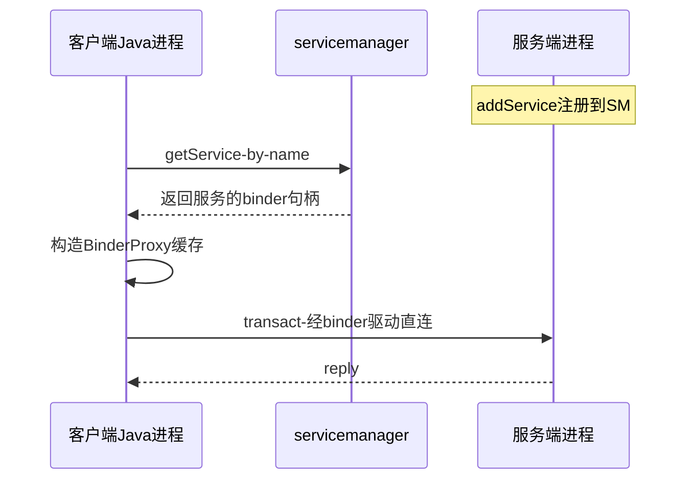
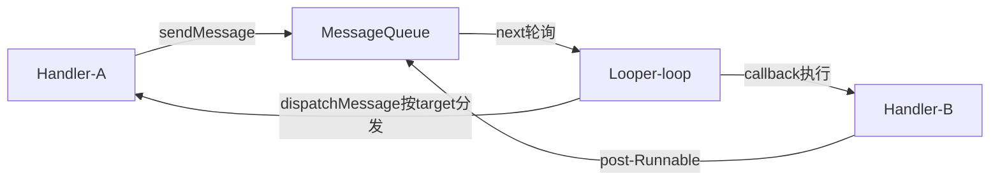
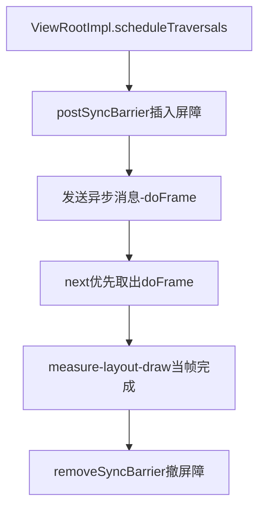

## 1.1 概述

本章分析 Framework Java 层的两个基础设施：

- **Java Binder**：native 层 Binder 驱动在 Java 层的封装，是 Java 进程间通信(Interprocess Communication, IPC)的基础。四大组件的生命周期驱动、系统服务的获取、ContentProvider 的数据传输，全部建在它之上
- **MessageQueue**：Java 层消息队列，与 Looper、Handler 一起构成 Android 单线程消息模型。可以说 Java 层一切异步行为的"调度中枢"就是它

原书基于 Android 4.0 (ICS) 源码。本章代码细节按概念重写（标注"概念简化"处），与原书可能有出入；章节小节编号为笔记整理时重建。

## 1.2 Java 层 Binder 架构分析

### 1.2.1 从一个例子出发

先看 Java 层 Binder 最常见的使用方式——获取系统服务并调用：

```java
// 客户端代码
IBinder b = ServiceManager.getService("activity");   // 查询AMS的binder
IActivityManager ams = IActivityManager.Stub.asInterface(b);
ams.startActivity(...);                               // 跨进程调用AMS
```

这三行代码背后的问题链，就是本节要回答的：

1. `getService` 是怎么找到 AMS 的？
2. `asInterface` 拿到的对象和 AMS 进程里的对象是什么关系？
3. `startActivity` 的参数如何跨越进程到达 AMS？

### 1.2.2 Binder 家族全景

Java 层 Binder 的核心类都在 `android.os` 与 `com.android.internal.os` 包下：

| Java 类 | native 对应物 | 角色 |
|---|---|---|
| `IBinder` | `BBinder`/`IBinder` | 跨进程标识一个对象 |
| `Binder` | `JavaBBinder`(继承 `BBinder`) | 服务端基类，实现方继承它 |
| `BinderProxy` | `BpBinder` | 客户端持有的代理对象 |
| `Parcel` | `android::Parcel` | 承载 IPC 数据的容器 |
| `IInterface` | `IInterface` | "可转换出 IBinder"的接口基类 |
| `Stub`/`Proxy` | `BnInterface`/`BpInterface` | AIDL 生成的服务端/客户端代码骨架 |
| `ServiceManager` | 无(直接调servicemanager) | 按名字查询/注册服务的入口 |
| `BinderInternal` | — | 桥接 native 的内部类(getContextManager) |

关键认知：**Java 层 Binder 只是 native Binder 的一层 JNI 封装，真正的通信仍由 /dev/binder 驱动完成**。JNI 边界在 `android_util_Binder.cpp`：`Binder` 对象通过 `javaObjectForIBinder`/`ibinderForJavaObject` 两个函数与 native 对象互转。

一个 Java Binder 对象跨进程传递后，接收方拿到的是指向同一 native 实体的 `BinderProxy`——**对象身份跨进程是"一个实体、两种投影"**。

### 1.2.3 Binder 与 BinderProxy 的职责划分

同一个 native `JavaBBinder`，在两个进程中呈现不同面貌：

**服务端（`Binder` 子类）**：入口是 `onTransact`

```java
// 服务端：继承 Binder，重写 onTransact（概念简化）
class MyService extends Binder {
    @Override
    protected boolean onTransact(int code, Parcel data, Parcel reply, int flags) {
        switch (code) {
            case TRANSACTION_hello:
                data.enforceInterface(DESCRIPTOR);   // 校验调用方想找的接口名
                String name = data.readString();
                reply.writeNoException();
                reply.writeString("hello " + name);
                return true;                          // 已处理，不再向下分发
        }
        return super.onTransact(code, data, reply, flags);
    }
}
```

调用链是：binder 驱动唤醒服务端的 binder 线程 → native `JavaBBinder::onTransact` → JNI 回调 `Binder.execTransact` → Java `onTransact`。注意 `execTransact` 运行在** binder 线程池的某个线程**（不是主线程），所以 `onTransact` 里若要操作 UI 必须自己切线程。

**客户端（`BinderProxy`）**：入口是 `transact`

```java
// 客户端调用（概念简化）
Parcel data = Parcel.obtain();
Parcel reply = Parcel.obtain();
data.writeInterfaceToken(DESCRIPTOR);
data.writeString("world");
binderProxy.transact(TRANSACTION_hello, data, reply, 0);  // 阻塞直至服务端返回
String result = reply.readString();
```

底层对应 native `BpBinder::transact` → `ioctl(/dev/binder, BINDER_WRITE_READ, ...)` → 驱动把数据挂到目标进程的工作队列。`flags` 传 `FLAG_ONEWAY` 时不等 reply，调用立即返回（fire-and-forget）。

**BinderProxy 是按 native 句柄缓存的**：驱动给客户端进程返回的是 32 位 binder 句柄，native 侧每个句柄只有一个 `BpBinder`，Java 侧相应只有一个 `BinderProxy`（挂在 `BpBinder` 的扩展数据上）。因此 `IBinder` 接口的 Javadoc 明确保证：**两个 `BinderProxy` 可用 `==` 比较是否指向同一远端对象**。这与普通 Java 对象"每次序列化产生新实例"截然不同。

### 1.2.4 死亡通知：DeathRecipient

客户端可以监听服务端进程死亡：

```java
IBinder binder = ...;
binder.linkToDeath(new IBinder.DeathRecipient() {
    @Override
    public void binderDied() {
        // 服务端进程已死，做重连等清理
    }
}, 0);   // flags=0，保留参数
```

底层利用 binder 驱动的 `BC_REQUEST_DEATH_NOTIFICATION` 命令：服务端进程退出时，驱动发现其持有的 binder 实体死亡，向所有注册者投递 `BR_DEAD_REPLY`，native 层回调 Java 的 `binderDied`。三个实战要点：

- `binderDied` 回调发生在 binder 线程，同样不能直接操作 UI
- 服务端死后，该 `BinderProxy` 的后续 `transact` 会抛出 `DeadObjectException`（`RemoteException` 子类）
- 这是 `ActivityManager` 感知应用进程死亡、`ServiceConnection` 断线重连、`RemoteCallbackList` 自动清理失效监听者的共同基础。`RemoteCallbackList` 内部就是"注册表 + DeathRecipient 自动 onCallbackDied"的封装，写跨进程回调必用它

### 1.2.5 服务管理：ServiceManager 的 Java 接口

Java 层通过 `ServiceManager`/`ServiceManagerNative` 与 native 的 servicemanager 守护进程交互：

```java
// 注册（仅 system_server 等特权进程可用）
ServiceManager.addService("my_service", new MyService());

// 获取
IBinder b = ServiceManager.getService("my_service");   // 不存在返回null
IBinder b2 = ServiceManager.getServiceOrThrow("x");    // 不存在抛ServiceNotFoundException
// 服务列表
String[] list = ServiceManager.listServices();         // dumpsys -l 的数据来源
```

获取流程分两步：

1. **拿 manager 的代理**：`BinderInternal.getContextManager()` 通过 JNI 调 `ProcessState::getContextObject`，得到句柄 0（servicemanager 在驱动里的固定句柄）对应的 `BinderProxy`
2. **按名字查询**：以该代理为管道，发 `GET_SERVICE_TRANSACTION`，servicemanager 在自己维护的名字表中查找，把目标服务的 binder 实体引用返回（驱动把引用翻译为客户端进程的新句柄）



注意：查询走 servicemanager，但**后续业务调用不经过 servicemanager**，而是客户端凭句柄直连服务端——这是 Binder 相比传统"总线式" IPC 的高效之处：路由只发生一次，之后是端到端通信。

### 1.2.6 AIDL：Stub 与 Proxy

手写 `enforceInterface`/`writeInterfaceToken` 配对过于繁琐且易错，AIDL 工具从 `.aidl` 接口描述自动生成 `Stub`（服务端骨架）与 `Proxy`（客户端代理）：

```java
// IHelloService.aidl 生成的代码结构（简化）
public interface IHelloService extends android.os.IInterface {
    public static abstract class Stub extends Binder
            implements IHelloService {
        private static final String DESCRIPTOR = "com.example.IHelloService";
        static final int TRANSACTION_hello = IBinder.FIRST_CALL_TRANSACTION + 0;

        // asInterface：本地对象直接返回，远端返回代理
        public static IHelloService asInterface(IBinder obj) {
            if (obj == null) return null;
            IInterface iin = obj.queryLocalInterface(DESCRIPTOR);
            if (iin != null) return (IHelloService) iin;  // 同进程：就是原对象
            return new Proxy(obj);                        // 跨进程：包代理
        }

        @Override
        protected boolean onTransact(int code, Parcel data, Parcel reply, int flags) {
            switch (code) { /* 解参→调用真实实现→写返回 */ }
        }
    }

    private static class Proxy implements IHelloService {
        private IBinder mRemote;
        public String hello(String name) throws RemoteException {
            Parcel data = Parcel.obtain();
            Parcel reply = Parcel.obtain();
            try {
                data.writeInterfaceToken(DESCRIPTOR);
                data.writeString(name);
                mRemote.transact(TRANSACTION_hello, data, reply, 0);
                reply.readException();        // 服务端异常在此重放
                return reply.readString();
            } finally {
                data.recycle(); reply.recycle();
            }
        }
    }
}
```

`asInterface` 中的 `queryLocalInterface` 分支体现了 Binder 的**同进程优化**：客户端与服务端同进程时，`IBinder` 参数就是服务端原对象（binder 对象在本进程内传递时驱动直接传指针），方法调用退化为普通 Java 调用，零开销。这个分支也让系统代码在"服务与调用方可能在也可能不在同一进程"时无需写两套逻辑——AMS 与 system_server 内部调用走的就是这个捷径。

AIDL 语言本身只支持有限类型：基础类型、`String`/`CharSequence`、`List`/`Map`、`Parcelable`、其他 AIDL 接口，以及这些类型的数组。`parcelable` 定方向的 `in`/`out`/`inout` 决定对象是只传过去、只传回来还是双向序列化（`out` 参数要求有无参构造与读回逻辑）。

### 1.2.7 Parcel：不只是序列化容器

`Parcel` 的定位与 `Serializable` 不同：它不是通用序列化框架，而是**专为 Binder 设计的二进制协议缓冲**。除了基础类型与 `Parcelable`，它还能传两类特殊资源：

- **binder 对象**：`writeStrongBinder` 把一个 `Binder` 实体放进 Parcel，驱动在传递时做实体→引用的翻译，接收方 `readStrongBinder` 得到 `BinderProxy`
- **文件描述符**：`writeFileDescriptor` 借助驱动的 `BC_TRANSACTION` 里的 fd 偏移数组，把一个打开的 FD "复制"到目标进程

FD 传递是很多功能的地基：

- `SharedMemory`/`MemoryFile`（基于 Ashmem，Anonymous Shared Memory，匿名共享内存）靠传 FD 实现跨进程共享一块内存
- SurfaceFlinger 与客户端之间的图形缓冲区队列，靠 FD 传 gralloc 分配的缓冲区句柄
- `ParcelFileDescriptor` 把打开的文件/套接字递给另一进程（如 `MediaRecorder` 输出到应用文件）

`Parcel` 只能单向流动（写完 `transact` 后由系统回收），且**未附带长度前缀的结构必须严格按写入顺序读出**——这是跨版本接口兼容问题的根源之一（见 1.4 Stable AIDL）。

### 1.2.8 binder 线程池与同步调用代价

每个使用 binder 的进程在首次打开 `/dev/binder` 时由 `ProcessState` 初始化线程池（默认上限 15 + 1 主 binder 线程）。两个推论：

- 服务端最多同时处理 16 个并发 `onTransact`；若某实现内部又同步调用回客户端，而客户端的实现也在等它，就会形成**跨进程死锁**（ binder 线程互相占满）
- 同步 `transact` 会阻塞调用线程；在主线程做远程调用是 ANR 的经典成因（调用慢或对端忙）

规避手段是 `FLAG_ONEWAY` 异步调用 + 回调接口（`RemoteCallbackList` 管理），这也是 AIDL 里 `oneway` 关键字的用途。

## 1.3 深入理解 MessageQueue

### 1.3.1 Looper / Handler / MessageQueue 三者关系

**MessageQueue 是 Android 线程消息模型的中枢**：每个 `Looper` 持有一个 `MessageQueue`，`Handler` 是往队列投递消息和消费消息的入口。



三者职责：

- **Looper**：`prepare()` 用 `ThreadLocal` 把 Looper 与当前线程绑定，一个线程只有一个 MessageQueue；`loop()` 是死循环，不断调 `MessageQueue.next()` 取消息，没有消息时阻塞。主线程的 Looper 由 `Looper.prepareMainLooper()` 预先创建（在 `ActivityThread.main` 里）
- **Handler**：发送方与处理方的统一入口。`sendMessage`/`post` 都最终调 `enqueueMessage`；处理时按消息的 `target`（即发送它的 Handler）回调
- **MessageQueue**：按 `when`（uptimeMillis）排序的单链表（不是数组队列），头节点最早到期

`new Handler()` 必须在已有 Looper 的线程，否则抛 `RuntimeException`——因为构造时要从 `Looper.myLooper()` 取队列。这条规则衍生出"在子线程里 `new Handler()` 前必须先 `Looper.prepare()`"的固定套路。

### 1.3.2 MessageQueue 的核心：next() 与 native 层

`next()` 是理解整个消息机制的关键（概念重写版，保留主干）：

```java
Message next() {
    int nextPollTimeoutMillis = 0;
    for (;;) {
        nativePollOnce(mPtr, nextPollTimeoutMillis); // 无消息则native层阻塞
        synchronized (this) {
            final long now = SystemClock.uptimeMillis();
            Message prevMsg = null;
            Message msg = mMessages;                  // 链表头
            if (msg != null && msg.target == null) {
                // 同步屏障：跳过所有同步消息，找第一条异步消息
                do { prevMsg = msg; msg = msg.next; }
                while (msg != null && !msg.isAsynchronous());
            }
            if (msg != null && now >= msg.when) {
                if (prevMsg != null) prevMsg.next = msg.next;
                else mMessages = msg.next;
                msg.next = null; msg.markInUse();
                return msg;                           // 取出该消息
            } else if (msg != null) {
                nextPollTimeoutMillis = (int) Math.min(msg.when - now, Integer.MAX_VALUE);
            } else {
                nextPollTimeoutMillis = -1;           // 无消息，无限阻塞
            }
        }
    }
}
```

四个重点逐一展开：

**1. nativePollOnce 阻塞在 epoll 上，Java 层"死循环"并不空转。** 无消息时线程通过 JNI 进入 native 的 `Looper::pollOnce`（`frameworks/base/core/java/android/os/MessageQueue` 对应 native 类在 `android_os_MessageQueue.cpp` 里桥接）。native Looper 内部是一个 epoll 实例 + 一个唤醒管道（4.0 用 pipe，Android 5.0 起改为 eventfd）：

- `nextPollTimeoutMillis = -1`：`epoll_wait` 无限期等待
- `nextPollTimeoutMillis > 0`：等到下条消息的到期时刻

这解释了一个常见疑惑："主线程 Looper.loop() 是死循环，为什么不清 CPU？"——因为阻塞发生在内核 epoll 上，线程处于睡眠态，零开销。

**2. 唤醒路径。** 新消息入队时（`enqueueMessage` 或 `postAtTime`），若新消息插到了链表头（比原本的最早到期时间更早），会调 `nativeWake` → 写 eventfd → `epoll_wait` 返回 → Java 层继续 `next()` 取消息。超时唤醒则由 epoll 的 timeout 参数直接覆盖。

**3. 同步屏障。** `msg.target == null` 的消息是屏障：它让 `next()` 跳过所有普通同步消息、只找 `isAsynchronous()` 的异步消息。用途只有一个但极重要——**界面绘制抢占**：



ViewRootImpl 在申请 vsync 重绘时插入同步屏障，保证 `doFrame` 不被积压的普通消息（各路业务 Handler 消息）延迟，绘制完成后撤除。这是"消息机制服务于渲染优先级"的教科书设计。

**4. IdleHandler。** `addIdleHandler` 注册的回调在队列空、线程即将阻塞前执行——适合做低优先级的初始化（如 `ActivityThread` 的 GC 调度、`GcIdler`）。

### 1.3.3 Message 的回收与复用

Message 内部维护 `sPool`（`MAX_POOL_SIZE = 50` 的单链表空闲池）：

- `Message.obtain()`：优先从池头取，避免分配
- `recycle()`：清空字段后挂回池头（`obtain` 与 `recycle` 都在 `Looper.loop` 消费路径上自动发生一部分——`msg.recycleUnchecked` 在 dispatch 完成后由框架调用）

这就是"尽量用 `Message.obtain()` 而不是 `new Message()`"建议的由来。注意回收后字段全部清零，**`recycle()` 之后继续持有/读取该 Message 是未定义行为**。

### 1.3.4 Handler 消息的分发优先级

`dispatchMessage` 的顺序（写在 `Handler` 源码里，不可绕过）：

1. `msg.callback` 不为空（来自 `post(Runnable)`）→ 直接执行该 Runnable，**不进入 handleMessage**
2. `mCallback` 不为空（构造传入 `Handler.Callback`）→ 走 `callback.handleMessage(msg)`，返回 true 则截断
3. 才走 `Handler.handleMessage(msg)`

实战含义：用 `post(Runnable)` 投递的任务无法被 `handleMessage` 拦截；`Handler.Callback` 是"轻量处理 + 可截断"的钩子；`Looper`/`MessageQueue` 层的拦截（`Looper.setMessageLogging`，4.0 时代）是性能 Trace 的原始手段。

### 1.3.5 主线程的消息从哪来

把 1.2 与 1.3 串起来看 `ActivityThread`：AMS 通过 `ApplicationThread`（`IApplicationThread`，App 进程暴露给 system_server 的 Binder 服务端）驱动四大组件生命周期，`ApplicationThread` 的每个方法都把参数打包成 message 发到主线程 `mH`（`Handler`），最终在主线程 `Looper.loop()` 里执行——**"AMS 远程调用 + Handler 线程切换"是整个 Framework 的基础范式**。

## 1.4 后续演进：4.0 机制 vs 现代 Android

本章两个主角在 2012 年后的演化方向截然不同：MessageQueue 的**语义原封不动地活到今天**，Binder 则经历了几次结构性翻新。逐项对比：

### Binder：从"系统内部私有 RPC"到"版本化公共契约"

| 维度 | Android 4.0（原书） | 现代 Android（12~15） | 展开说明 |
|---|---|---|---|
| 服务命名 | servicemanager 字符串表，任何人可 addService | 按域名分区（`manager`、`activity`…），非特权进程无法注册 | servicemanager 在 Android 8~9 被 C++ 重写，注册方受 SELinux 与 `binder.call` 约束；Java 层 `ServiceManager` API 形态未变，但应用基本只能 `getService` 不能 `addService` |
| 接口稳定性 | 内部 AIDL，随系统版本随意改，应用不得直接用 | Stable AIDL（`aidl_interface`），带版本号(`@1`/`@2`)可跨大版本演进 | Treble 的核心：vendor 与 system 分区独立升级，二者间 binder 调用必须版本化。Stable AIDL 的 Parcel 写入带类型/版本前缀，新增字段不破坏老客户端——直接回应 1.2.7 说的"顺序读写的脆弱性" |
| NDK 支持 | 无，应用只能 Java Binder | NDK stable AIDL（`binder_ndk`）、Rust 后端 | 同一接口可由 C++/Rust/Java 三端实现 |
| 线程池 | 15+1，静态 | 仍是 15+1 上限，但引入优先级继承、同步 transaction 实验支持 | Android 15 的 Binder Mailbox 允许内核排队同步请求，缓解 binder 线程耗尽死锁 |
| Parcel | obtain/recycle 对象池 | 池已删除，obtain 退化为 new | `recycle()` 变为空操作，业务代码的 obtain/recycle 配对负担消失；内存靠 ART GC |
| 死亡通知 | DeathRecipient | 语义不变，另有 `binder.dump`/`shell` 命令管道 | `RemoteCallbackList` 仍是标准用法，机制与 4.0 一致 |

### MessageQueue / Handler：API 换壳，内核不变

| 维度 | Android 4.0 | 现代 Android | 展开说明 |
|---|---|---|---|
| 阻塞实现 | pipe + epoll | eventfd + epoll（5.0 起） | eventfd 比 pipe 省一个 FD、无缓冲区语义，`nativeWake` 写 8 字节即可唤醒 |
| Handler 构造 | `new Handler()` 隐式绑当前线程 Looper | `new Handler(Looper.getMainLooper())` 必须显式传；`Handler.createAsync()` | Android 11 废弃隐式构造（易绑错线程）；`createAsync` 发出的消息天然异步，配合同步屏障使用更安全 |
| 同步屏障 API | `MessageQueue.postSyncBarrier` 隐藏 | 仍 `@hide`，但 `Handler.createAsync` + `ViewRootImpl` 内部用法延续 | Choreographer 的 doFrame 抢占机制至今没变，面试高频 |
| 消息池 | 50 条链表 | 相同（`sPool` 仍在） | ART 分配便宜后，`obtain` 的收益变小但保留 |
| 观测手段 | `Looper.setMessageLogging` | Perfetto 的 `Handler` 跟踪、`Looper` trace 点 | `setMessageLogging` 每条消息两行字符串拼接，本身拖慢队列，已被系统 trace 取代 |
| 消息级别的异步化扩展 | 无 | `MessageQueue` 增加 idle、barrier 的可观测事件（`IoBootTest` 等内部钩子） | 上层趋势是 ViewModel 协程化，但 **所有 UI 仍最终回到主线程 MessageQueue 执行**，Looper/Handler 模型未被替代 |

一句话总结：写应用时，第 1.2 节的 Binder 心智模型（Stub/Proxy、DeathRecipient、同进程优化）今天完全适用，但 API 层要按新签名写；第 1.3 节的 MessageQueue 原理（epoll 阻塞、同步屏障、分发优先级）几乎是 Android 史上最稳定的部分，值得原样掌握。
