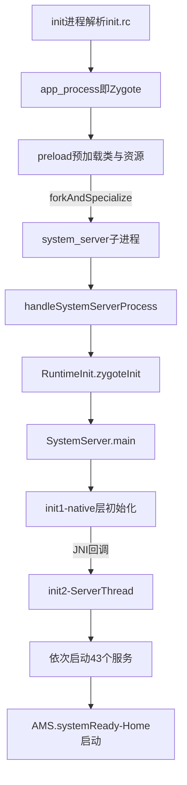
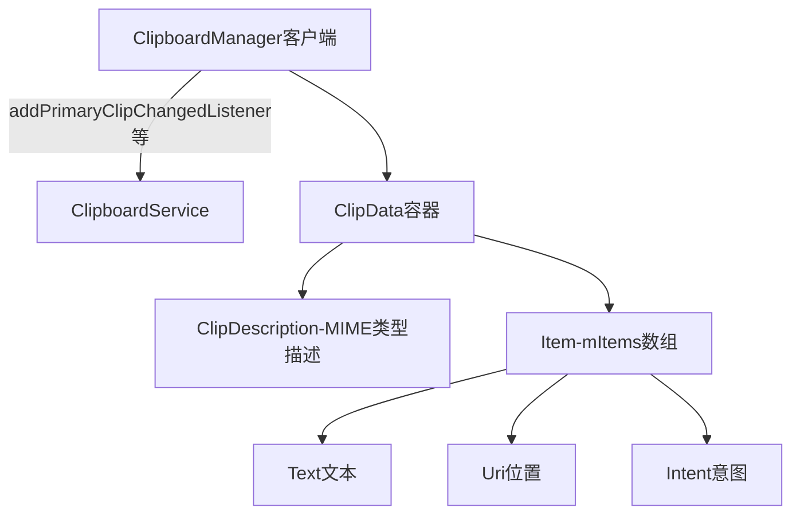

## 2.1 概述

SystemServer 是 Android Java 世界的两大支柱之一（另一根是 Zygote）：Zygote fork 出的第一个进程，**几乎所有核心系统服务——ActivityManagerService（AMS）、PackageManagerService（PMS）、WindowManagerService（WMS）等——都运行在这一个进程里**。应用进程的一切"系统功能"请求，最终都落到 system_server 中的某个服务上；它若崩溃，由 init 进程负责重启整个 Java 世界。

原书第 3 章的套路是：先分析 SystemServer 的启动流程（main → init1 → init2 → ServerThread），再把其中几十个服务分成七大类，挑出**功能单一、依赖简单的第五类**逐个走读源码，借此展示系统服务的通用写法。本章小节与原书的对应关系：

| 本笔记 | 原书第 3 章 |
|---|---|
| 2.2 SystemServer 的启动分析 | 3.2 SystemServer 分析（main 函数 / Services 群英会） |
| 2.3.1 EntropyService | 3.3 EntropyService 分析 |
| 2.3.2 DropBoxManagerService | 3.4 DropBoxManagerService 分析 |
| 2.3.3 DiskStatsService 与 DeviceStorageMonitorService | 3.5 |
| 2.3.4 SamplingProfilerService | 3.6 |
| 2.3.5 ClipboardService | 3.7 |
| 2.3.6 Watchdog | 原书归入第五类服务群（图 3-1），本笔记补全源码走读 |

从 Zygote 到 system_server 的链路全景：



三个常被问到的问题：

- **为什么 system_server 必须由 Zygote fork？** 所有 APK 进程也由 Zygote fork，二者共享同一份预加载的类与资源：既省内存（COW，Copy-On-Write 共享页），又保证运行时环境一致——AMS 里的代码与 App 里的 `Activity` 类必须来自同一个 `android.*` 世界
- **fork 之后发生了什么？** 子进程经 `handleSystemServerProcess` → `RuntimeInit.zygoteInit` 回到 Java 入口 `SystemServer.main`。fork 会带走 Zygote 的全部线程快照，所以 Zygote 在 fork 前做了严格的"单线程化"约束
- **谁重启它？** init.rc 中该服务标记 critical：system_server 死亡（Watchdog 自杀、OOM、ServiceManager 死亡连坐）后 init 杀掉 Zygote 并重启 Java 世界

## 2.2 SystemServer 的启动分析

### 2.2.1 main 函数分析

Java 世界的入口 `SystemServer.main`（Android 4.0，`frameworks/base/services/java/com/android/server/SystemServer.java`，节选）：

```java
public class SystemServer {

    private static final String TAG = "SystemServer";
    // 系统时钟不允许早于 2012-01-01：手机没有 RTC 后备电池时，
    // 时钟可能停在 epoch 附近，证书校验等逻辑会全线崩溃
    private static final long EARLIEST_SUPPORTED_TIME = 1325376000000L;

    public static void main(String[] args) {
        // ① 检查系统时钟，过早则重设
        if (System.currentTimeMillis() < EARLIEST_SUPPORTED_TIME) {
            Slog.w(TAG, "System clock is before "
                    + EARLIEST_SUPPORTED_TIME + "; setting to that.");
            SystemClock.setCurrentTimeMillis(EARLIEST_SUPPORTED_TIME);
        }

        // ② 若启用了采样统计，设置定时器：每小时输出一次 system_server 快照
        if (SamplingProfilerIntegration.isEnabled()) {
            SamplingProfilerIntegration.start();
            timer = new Timer();
            timer.schedule(new TimerTask() {
                @Override
                public void run() {
                    SamplingProfilerIntegration.writeSnapshot("system_server", null);
                }
            }, SNAPSHOT_INTERVAL, SNAPSHOT_INTERVAL);
        }

        // ③ dalvik 虚拟机设置：system_server 必须常驻，内存使用要高效
        //    清除 growth limit（解除堆上限），并把堆利用率提到 0.8
        VMRuntime.getRuntime().clearGrowthLimit();
        VMRuntime.getRuntime().setTargetHeapUtilization(0.8f);

        // ④ 加载 JNI 库，随后进入 native 层的 init1
        System.loadLibrary("android_servers");
        init1(args);
    }

    public static final void init1(String[] args) {
        // native 方法，实现在 com_android_server_SystemServer.cpp
        nativeInit1(args);
    }
}
```

要点：main 里**没有任何业务逻辑**，只做时钟纠偏、性能统计定时器（见 2.3.4）、虚拟机堆配置三件事，随后立即下沉到 native 层。`clearGrowthLimit` 与堆利用率 0.8 是 4.0 时代 system_server 的"内存姿态"：解除普通应用才有的堆增长上限，宁可多占也不允许 OOM。

### 2.2.2 init1 与 native 层的初始化

init1 的 JNI 实现只有一行转发，真正的工作在 `System_init.cpp` 的 `system_init`（节选）：

```cpp
// frameworks/base/cmds/servicemanager? 不——位于
// frameworks/base/services/jni/System_init.cpp（节选）

// ServiceManager 死亡的"死神接收者"：SM 一死，system_server 自杀陪葬
class GrimReaper : public IBinder::DeathRecipient {
public:
    virtual void binderDied(const wp<IBinder>& who) {
        ALOGI("ServiceManager died, restarting system_server");
        kill(getpid(), SIGKILL);   // 自杀，由 init 负责重启整个 Java 世界
    }
};

extern "C" status_t system_init()
{
    ALOGI("Entered system_init()");
    sp<ProcessState> proc(ProcessState::self());
    // ① 初始化 Binder 并获得 ServiceManager 的客户端
    sp<IServiceManager> sm = defaultServiceManager();
    sp<GrimReaper> grim = new GrimReaper();
    // ② 注册 SM 死亡通知：NameService 都没了，留着服务也无意义
    sm->asBinder()->linkToDeath(grim, grim.get(), 0);

    char propBuf[PROPERTY_VALUE_MAX];
    // ③ 由系统属性决定 SurfaceFlinger 是否跑在本进程
    //    （后续版本拆为独立进程，见 2.4）
    property_get("system_init.startsurfaceflinger", propBuf, "1");
    if (strcmp(propBuf, "1") == 0) {
        SurfaceFlinger::instantiate();
    }
    // ④ SensorService 同理
    property_get("system_init.startsensorservice", propBuf, "1");
    if (strcmp(propBuf, "1") == 0) {
        SensorService::instantiate();
    }

    ALOGI("System server: starting Android services.\n");
    // ⑤ 回调 Java 层的 init2——启动 Java 世界的大部队
    AndroidRuntime* runtime = AndroidRuntime::getRuntime();
    runtime->callStatic("com/android/server/SystemServer", "init2");

    // ⑥ 主线程加入 Binder 线程池，从此在 native 侧服务 Binder 请求
    if (proc->supportsProcesses()) {
        ProcessState::self()->startThreadPool();
        IPCThreadState::self()->joinThreadPool();
    }
    return NO_ERROR;
}
```

**GrimReaper（死神）**是本节最有趣的设计：ServiceManager 是所有服务的总入口，它若死亡，整个 Binder 世界瘫痪——与其苟活，不如自杀重启。这是"可诊断地死"哲学在 native 层的体现。

**为什么搞成 init1/init2 两段？** 命名风格让人想起 `MediaPlayer` 等框架的 native 初始化。原因：在初始化 AndroidRuntime（Java 运行环境）之前，必须先初始化部分核心 native 服务（Binder、SurfaceFlinger 等）；等 native 侧就绪，再通过 JNI 回调 Java 层继续。

### 2.2.3 init2 与 ServerThread：Services 群英会

init2 非常简单——只创建并启动一个线程：

```java
// SystemServer.java（节选）
public static final void init2() {
    Slog.i(TAG, "Entered the Android system server!");
    Thread thr = new ServerThread();
    thr.start();
}
```

ServerThread 的 run 函数长达 600 多行，**几乎每个 Java 系统服务的创建、addService 都汇聚在这里**，是 system_server 的"总装配流水线"（节选，仅保留关键顺序）：

```java
// SystemServer.java :: ServerThread.run（节选）
class ServerThread extends Thread {
    private static final String TAG = "SystemServer";

    @Override
    public void run() {
        Looper.prepare();                      // 本线程将成为 system_server 的主线程
        android.os.Process.setThreadPriority(
                android.os.Process.THREAD_PRIORITY_FOREGROUND);

        // —— 第一批：轻量基础服务 ——
        context = ActivityManagerService.main(factoryTest);  // 创建 AMS 与系统 Context
        LightsService lights = new LightsService(context);
        ServiceManager.addService("entropy", new EntropyService());
        power = new PowerManagerService();
        ServiceManager.addService(Context.POWER_SERVICE, power);
        ServiceManager.addService(Context.RECOVERY_SERVICE, new RecoveryService(context));
        AlarmManagerService alarm = new AlarmManagerService(context);
        ServiceManager.addService(Context.ALARM_SERVICE, alarm);
        BatteryService battery = new BatteryService(context, lights);
        ServiceManager.addService("battery", battery);

        // —— 第二批：包管理（AMS 查权限、查组件都依赖它，必须早于后续服务） ——
        PackageManagerService pm = null;
        pm = PackageManagerService.main(context, factoryTest);

        // —— ActivityManager 对外发布 ——
        ActivityManagerService.setSystemProcess();

        // —— 第三批：窗口、输入法、通知等 ——
        ServiceManager.addService("window", wm = WindowManagerService.main(
                context, power, factoryTest != SystemServer.FACTORY_TEST_LOW_LEVEL));
        ServiceManager.addService(Context.INPUT_METHOD_SERVICE,
                new InputMethodManagerService(context, wm));

        // ……中间还有 30 余个服务：NetworkManagement、Connectivity、MountService、
        //    USB、Notification、Location、AudioService、Wallpaper、Bluetooth……

        // —— 收尾：全世界可以跑了 ——
        ActivityManagerService.self().systemReady(new Runnable() {
            public void run() {
                if (batteryF != null) batteryF.systemReady();
                if (usbF != null) usbF.systemReady();
                Watchdog.getInstance().start();     // 最后启动看门狗
            }
        });
        Looper.loop();                              // 进入主线程消息循环，永不返回
        throw new RuntimeException("Main thread loop unexpectedly exited");
    }
}
```

原书将图 3-1 中的 43 个服务分为七大类（作者自述非官方标准）：

| 类别 | 代表服务 | 特点 |
|---|---|---|
| 1. Android 核心服务 | AMS、PMS、WMS、PowerManagerService、ActivityStack | 系统命脉，其余各章展开 |
| 2. 通信相关 | WifiService、Telephone（TelephoneRegistry 等） | 与 modem/无线相关 |
| 3. 系统功能 | AudioService、MountService、UsbService、NetworkManagement | 面向某个子系统功能 |
| 4. 电池/振动等 | BatteryService、VibratorService、AlarmManagerService | 硬件相关小服务 |
| 5. 相对独立 | EntropyService、DiskStatsService、SamplingProfilerService、ClipboardService、Watchdog 等 | 功能单一、依赖简单——**本章走读对象** |
| 6. 蓝牙 | Bluetooth 相关（4.0 起用 BlueZ，jni/native 分层） | 依赖外部协议栈 |
| 7. UI 相关 | StatusBarService、NotificationManagerService | 与界面展示相关 |

三个结构性要点：

- **启动顺序是精心安排的**。PMS 必须早于 AMS（AMS 要向它查权限与组件），WMS 要在 `systemReady` 之前可用——`systemReady` 是"全世界可以跑了"的分水岭，它触发启动 persistent 应用与 Home（详见第 5 章 5.2.4）。顺序错了就是开机循环重启
- **addService 的时刻就是服务的对外可见时刻**。注册进 ServiceManager 后立刻可被别人 getService，而服务内部状态可能尚未初始化完——早期代码大量依赖"调用方还没起来"这一事实来掩盖竞态
- **ServerThread 的 Looper 就是 system_server 的"主线程"**（后来的 android.ui/android.fg/android.display 多线程分组是后续演进，见 2.4）

**一个系统服务的标准写法（4.0 风格）**：构造函数做轻量初始化（重活异步化）→ `ServiceManager.addService(name, binder)` 对外发布 → 需要异步任务就内部建 Handler/HandlerThread → 需要开机时机就监听 `BOOT_COMPLETED`。没有统一的生命周期接口，全靠 ServerThread.run 里手工次序保证正确——这正是后来 SystemServiceManager 要解决的问题（见 2.4）。

## 2.3 第五类独立服务剖析

### 2.3.1 EntropyService：随机数种子服务

**问题背景**：Linux 内核的熵池刚开机时种子不足，`/dev/urandom` 的输出可预测性偏强，加密场景有风险。EntropyService（熵服务）的任务是**在开机时用持久化的熵文件为内核补种，并周期性地把新鲜熵写回文件**。

```java
// EntropyService.java（节选）
public final class EntropyService extends Binder {

    private static final int ENTROPY_WHAT = 1;
    private static final long ENTROPY_WRITE_PERIOD = 3 * 60 * 60 * 1000; // 3 小时
    private static final String DEVICE_NAME = "/dev/urandom";            // 内核熵设备

    private final File randomFile;      // /data/system/entropy.dat
    private final FileHandler mFileHandler;

    public EntropyService() {
        this(new File(Environment.getDataDirectory(), "system/entropy.dat"));
    }

    EntropyService(File file) {
        randomFile = file;
        mFileHandler = new FileHandler();
        loadInitialEntropy();       // ① 开机补种
        addDeviceSpecificEntropy(); // ② 混入设备特定信息
        writeEntropy();             // ③ 立即写一次新熵
        scheduleEntropyWriter();    // ④ 定期滚动
    }

    /** ① 读取上次保存的熵文件，写入内核 /dev/urandom 补种 */
    private void loadInitialEntropy() {
        try {
            if (randomFile.exists()) {
                RandomAccessFile in = new RandomAccessFile(randomFile, "r");
                byte[] existingBytes = new byte[(int) in.length()];
                in.readFully(existingBytes);
                in.close();
                writeToRandom(existingBytes);    // 写 /dev/urandom
            }
            // 文件不存在也无所谓：再从 urandom 取一块存起来
        } catch (IOException e) { Slog.w(TAG, "unable to load initial entropy"); }
    }

    /** ③ 从 /dev/urandom 读一块新熵，覆盖写入熵文件 */
    private void writeEntropy() {
        try {
            RandomAccessFile out = new RandomAccessFile(randomFile, "rw");
            byte[] randomBytes = getRandomBytes(out.length()); // 读 urandom
            out.write(randomBytes);
            out.close();
        } catch (IOException e) { Slog.w(TAG, "unable to write entropy"); }
    }

    /** ④ 每 3 小时重复一次 writeEntropy */
    private void scheduleEntropyWriter() {
        mFileHandler.removeMessages(ENTROPY_WHAT);
        mFileHandler.sendEmptyMessageDelayed(ENTROPY_WHAT, ENTROPY_WRITE_PERIOD);
    }
}
```

四个函数各司其职：`loadInitialEntropy`（开机补种）、`addDeviceSpecificEntropy`（把设备序列号等信息追加进 urandom）、`writeEntropy`（滚动更新文件）、`scheduleEntropyWriter`（3 小时定时）。FileHandler 运行在专属的 HandlerThread 上，与主线程解耦。

它展示了最小系统服务的形态：**一个 Binder 服务 + 一个 Handler 定时任务 + 一个持久化文件**，全部不到 200 行。也演示了 `/data/system/` 这个"系统级持久化目录"的用法（packages.xml、dropbox、entropy.dat 都在这里）。内核 CRNG 成熟后该服务已在新版本中删除（见 2.4）。

### 2.3.2 DropBoxManagerService：异常现场收集箱

DropBoxManagerService（DBMS，名字源自飞机的黑匣子"回收箱"）负责**收集系统运行时的异常现场**：应用 crash、ANR、wtf（What a Terrible Failure，`Log.wtf` 触发）、系统重启等，是 `bugreport` 数据的重要源头。

#### 1. 日志文件与 tag 规则

- 服务名 `dropbox`，目录 `/data/system/dropbox`
- tag 由"**进程类型_事件类型**"拼成：进程类型由 `processClass` 判定（system_server / system_app / data_app），事件类型有 crash、wtf、anr 等，组合出 `data_app_anr`、`system_app_crash` 等；另有 `SYSTEM_BOOT`、`SYSTEM_TOMBSTONE`（BootReceiver 收到 BOOT_COMPLETED 后生成）
- 文件名 `tag@时间戳`，如 `data_app_anr@1324836096560.txt.gz`

配置通过 Settings 数据库的 Secure 表控制（多数实际使用代码中的默认值）：

| 配置项 | 含义 | 默认值 |
|---|---|---|
| `dropbox:<tag>` | 禁止/允许记录某个 tag | 允许 |
| `dropbox_age_seconds` | 日志存活时间 | 3 天 |
| `dropbox_max_files` | 最大文件数 | 1000 |
| `dropbox_quota_percent` | 可用空间配额 | 10% |
| `dropbox_reserve_percent` | 预留比例 | 10% |
| `dropbox_quota_kb` | 绝对配额 | 5MB |

构造函数注册 BroadcastReceiver 监听 `ACTION_DEVICE_STORAGE_LOW`（空间不足时删旧日志）与 `ACTION_BOOT_COMPLETED`，并用 ContentObserver 监听 Settings 变化——**系统服务读配置的标准姿势**。

#### 2. add 流程：从 crash 到落盘

以应用 crash 为例，AMS 的 `handleApplicationCrash` → `addErrorToDropBox("crash", ...)`（节选）：

```java
// ActivityManagerService.java :: addErrorToDropBox（节选）
public void addErrorToDropBox(String tag, ProcessRecord process, ...) {
    final String dropboxTag = processClass(process) + "_" + tag;
    if (dbox == null || dbox.isTagEnabled(dropboxTag)) return; // tag 被禁止则放弃
    StringBuilder sb = new StringBuilder(1024);
    appendDropBoxProcessHeaders(db, process, processName, sb);  // 进程头信息
    ...                       // 可读取 logcat（最多 128KB，截断标记 [[TRUNCATED]]）
    sb.append(crashInfo.stackTrace);     // 附带崩溃堆栈
    dbox.addText(dropboxTag, sb);        // 送入 DBMS
}
```

DBMS 侧 `add` 的核心（节选）：

```java
// DropBoxManagerService.java :: add（节选）
public void add(DropBoxManager.Entry entry) {
    File temp = null;
    try {
        temp = new File(mDropBoxDir, "drop" + Thread.currentThread().getId() + ".tmp");
        // ① 先写临时文件，按 mBlockSize（4KB）分块读取数据
        // ② 超过一个 BlockSize 的内容用 GZIPOutputStream 压缩——
        //    原书实例：42KB 的日志压缩后只有 6.1KB，非常划算
        // ③ createEntry：临时文件改名为 tag@timestamp(.txt.gz)，
        //    生成 EntryFile 记录并存入内部数据容器（mAllFiles/mFilesByTag）
        ...
        // ④ trimToFit()：按 2.4 中的配置项清理旧文件腾空间
        // ⑤ 发送 ACTION_DROPBOX_ENTRY_ADDED 广播（需 READ_LOGS 权限）
    } finally { ...删除临时文件... }
}
```

客户端 `DropBoxManager` 提供 `addText`/`addData`/`addFile` 三个便捷函数，统一封装为 Entry 传给 DBMS 的 `add`。查询用 `getNextEntry`，调试用 `dumpsys dropbox`——查"昨晚为什么重启""某 App 崩了什么"的第一站。

### 2.3.3 DiskStatsService 与 DeviceStorageMonitorService

#### 1. DiskStatsService：dump 接口当报表

DiskStatsService 是个极端案例：**直接继承自 Binder，却没有任何业务函数，唯一对外接口就是 dump**。dumpsys 命令的原理（dumpsys.cpp，节选）：

```cpp
// dumpsys.cpp :: main（节选，思路示意）
sp<IServiceManager> sm = defaultServiceManager();
if (argc == 1) {
    // 无参数：列出所有服务名并排序
    const Vector<String16>& services = sm->listServices();
    ...
} else {
    // 有参数：checkService 得到目标服务，跨进程调用其 dump 函数
    sp<IBinder> service = sm->checkService(services[i]);
    int fd = STDOUT_FILENO;
    int err = service->dump(fd, args);   // Binder 的标准 dump 接口
}
```

**每个 Binder 服务都自动获得 dump 接口**（`Binder.dump`），`dumpsys <name>` 即可调用——系统服务调试的瑞士军刀。DiskStatsService.dump 的实现（节选）：

```java
// DiskStatsService.java（节选）
public void dump(FileDescriptor fd, PrintWriter pw, String[] args) {
    mContext.enforceCallingOrSelfPermission(android.Manifest.permission.DUMP, TAG);
    byte[] junk = new byte[512];
    for (int i = 0; i < junk.length; i++) junk[i] = (byte) i;  // 512B 垃圾数据
    File tmp = new File(Environment.getDataDirectory(), "system/perftest.tmp");
    long before = SystemClock.uptimeMillis();
    // 写入并测量耗时：输出 "Latency: xx ms [512B Data Write]"
    ...
    reportFreeSpace(pw, Environment.getDataDirectory(), "Data");   // 三个分区
    reportFreeSpace(pw, Environment.getDownloadCacheDirectory(), "Cache");
    reportFreeSpace(pw, new File("/system"), "System");
}
```

作者点评：这个服务功能本可合并进 DeviceStorageMonitorService，独立存在更多是历史原因。

#### 2. DeviceStorageMonitorService：磁盘水位看门狗

服务名 `devicestoragemonitor`，**每 1 分钟用 StatFs 检查存储水位**。构造函数（节选）：

```java
// DeviceStorageMonitorService.java（节选）
public DeviceStorageMonitorService(Context context) {
    mLastReportedFreeMemTime = 0;
    mRestatDataDir = mDataDirStat = new StatFs(DATA_PATH);     // /data
    mSystemDirStat = new StatFs(SYSTEM_PATH);                  // /system
    mCacheDirStat = new StatFs(CACHE_PATH);                    // /cache
    // mTotalMemory 取 data 分区总量的百分之一，作为清理量的基准
    mTotalMemory = (long) mDataDirStat.getTotalBytes() / 10L;
    // 四个通知 Intent，都带 FLAG_RECEIVER_REGISTERED_ONLY_BEFORE_BOOT：
    // 只能被系统服务接收，不给 App 可乘之机
    mStorageLowIntent = new Intent(Intent.ACTION_DEVICE_STORAGE_LOW);
    ...
    checkMemory(true);
}
```

水位判断与周期检查（骨架）：

```java
// DeviceStorageMonitorService.java :: checkMemory（骨架）
private final void checkMemory(boolean checkCache) {
    if (mClearingCache) return;         // 正在清缓存时不重复处理
    restatDataDir();                    // 重算三分区剩余空间
    if (!mLowMem) {
        // 剩余空间低于阈值（Settings 的 sys_storage_threshold_percentage，
        // 默认 10%）：先 clearCache() 清理 App 缓存；仍不足则 sendNotification()
        // 广播 STORAGE_LOW 并在状态栏告警；若已满（默认剩 1MB 视为满）
        // 则 sendFullNotification() 广播 STORAGE_FULL
    } else {
        // 剩余空间恢复过阈值：广播 STORAGE_OK / STORAGE_NOT_FULL
    }
    postCheckMemoryMsg(true, DEFAULT_CHECK_INTERVAL);   // 1 分钟后再查
}
```

clearCache 的跨服务协作（节选）：

```java
// DeviceStorageMonitorService.java :: clearCache（节选）
private final void clearCache() {
    if (mClearingCache) return;
    mClearingCache = true;
    try {
        // 直接拿 PKMS 的 Binder 接口（不走 Context，拿原始服务的写法）
        IPackageManager.Stub.asInterface(
                ServiceManager.getService("package")).freeStorageAndNotify(
                mMemLowThreshold, mClearingObserver);
    } catch (Exception e) { mClearingCache = false; }
}
// 清理完成后的回调：置回标志并再触发一次 checkMemory（恢复机制）
class CachePackageDataObserver extends IPackageDataObserver.Stub {
    public void onRemoveCompleted(String packageName, boolean succeeded) {
        mClearingCache = false;
        postCheckMemoryMsg(true, 0);    // 立即复查
    }
}
```

收到 LOW 广播的缓存型应用（浏览器、地图离线包）应清理缓存；DBMS（2.3.2）收到后删旧日志——这是 4.0 时代"存储压力协同"的全部机制。作者认为 1 分钟的检查间隔偏短。后来它演化为 StorageManagerService 的一部分（见 2.4）。

### 2.3.4 SamplingProfilerService：采样快照搬运工

**这个服务自己不做采样**，只做文件搬运——作者读代码时也专门点破了这一疑惑。

```java
// SamplingProfilerService.java（节选）
public class SamplingProfilerService extends Binder {
    private static final File SNAPSHOT_DIR =
            new File(Environment.getDataDirectory(), "system/snapshots");

    public SamplingProfilerService(Context context) {
        registerSettingObserver(context);   // 监听 Settings 变化
        startWorking(context);              // 开始搬运
    }

    private void startWorking(Context context) {
        DropBoxManager dropbox = (DropBoxManager) context.getSystemService(...);
        // ① 把 snapshots 目录下已有的快照文件逐个转入 dropbox，然后删除
        for (File file : SNAPSHOT_DIR.listFiles()) handleSnapshotFile(file, dropbox);
        // ② 用 FileObserver 监控该目录（底层是 Linux 的 inotify 机制）：
        //    ATTRIB 事件（新文件到达）触发搬运
        mObserver = new FileObserver(SNAPSHOT_DIR.getPath(), FileObserver.ATTRIB) {
            @Override
            public void onEvent(int event, String path) {
                handleSnapshotFile(new File(SNAPSHOT_DIR, path), dropbox);
            }
        };
        mObserver.startWatching();
    }
}
```

真正的采样由 `SamplingProfilerIntegration` 完成（非 SDK 公开类，封装 dalvik 的 SamplingProfiler）：

- 其 **static 块**读取系统属性 `persist.sys.profiler_ms`（默认 0，即**默认禁用**）与 `persist.sys.profiler_depth`（默认 4）；仅当毫秒值 > 0 时创建 snapshots 目录、启用采样。控制放在 static 块，改属性须重启目标进程才生效
- 以 Zygote 为例（`ZygoteInit.main`）：启动时 `SamplingProfilerIntegration.start()`（创建线程集并开始采样），工作完成后 `writeZygoteSnapshot()` 落盘——文件命名"进程名_开始统计时刻.snapshot"，头部由 `generateSnapshotHeader` 写入版本号、编译信息等，最后 `shutdown()` 停止采样

这条链路的分工：SamplingProfilerIntegration 产生快照文件 → SamplingProfilerService 用 inotify 感知并搬运 → DBMS 持久化滚动清理。三个第五类小服务串成了一条开机性能数据流水线。

### 2.3.5 ClipboardService：URI 权限管理才是重点

原书明确指出：ClipboardService（CBS）的难点不在剪贴板本身，而在 **URI 权限的临时授予机制**。

#### 1. 剪贴板家族与数据模型



- 4.0 的 `ClipboardManager` 继承自旧的 `android.text.ClipboardManager`（只支持文本）——兼容痕迹
- **ClipData** 是容器，真实数据在 `mItems`（Item 数组）中，每个 Item 可携带 Text、Uri、Intent 三种类型之一
- **URI 指向数据的位置（类似文件路径），MIME 表示数据的类型（类似后缀名），二者缺一不可**。`ClipData.newUri` 的核心工作就是查询目标 URI 的 MIME（先 `resolver.getType(uri)` 与 `getStreamTypes`，查不到则兜底 `"text/uri-list"`）

#### 2. Copy 流程：setPrimaryClip

```java
// ClipboardService.java :: setPrimaryClip（节选）
public void setPrimaryClip(ClipData clip, String callingPackage) {
    synchronized (this) {
        // ① 检查 copy 方是否有权处置这些数据（防泄露，见下文）
        checkDataOwnerLocked(clip, Binder.getCallingUid());
        // ② 换新数据前，撤销旧 ClipData 上已授予 paste 方的临时权限
        clearActiveOwnersLocked();
        mPrimaryClip = clip;                       // ③ 保存（仅在内存，不落盘）
        final int n = mPrimaryClipListeners.beginBroadcast();
        for (int i = 0; i < n; i++) {
            try {
                // ④ 通知所有监听者——RemoteCallbackList 是需要掌握的重要常用类
                mPrimaryClipListeners.getBroadcastItem(i)
                        .dispatchPrimaryClipChanged();
            } catch (RemoteException e) { /* 监听者进程已死则忽略 */ }
        }
        mPrimaryClipListeners.finishBroadcast();
    }
}
```

**RemoteCallbackList** 统一管理跨进程回调：注册的是 `IOnPrimaryClipChangedListener` Binder，回调前 beginBroadcast/finishBroadcast 快照式遍历，监听者进程死亡自动摘除——**DeathRecipient 的标准应用场景**，此后各章反复出现。

#### 3. Paste 流程与 URI 权限

问题场景：把 Contacts 的联系人 URI 复制到剪贴板，第三方程序 paste 后要 query 该 URI——但它无法预知该声明什么权限。解法是**临时授权**：ContentProvider 在 Manifest 中声明 `grant-uri-permission`（配合 `pathPattern`）允许系统临时授权，paste 时系统判断 URI 是否命中规则，命中则授权成功，否则失败。前提是 copy 方自己得有权限，于是有 copy 方检查：

```java
// ClipboardService.java（节选）
/** copy 方检查：无权处置该 URI 则抛 SecurityException */
private void checkUriOwnerLocked(Uri uri, int uid) {
    // 委托 AMS 检查 uid 对该 URI 的 FLAG_GRANT_READ_URI_PERMISSION
    if (mAm.checkGrantUriPermission(uid, null, uri,
            Intent.FLAG_GRANT_READ_URI_PERMISSION) < 0) {
        throw new SecurityException("Caller " + uid + " does not own " + uri);
    }
}
```

目的：防止恶意程序把私密 URI（如 Settings 的 Secure 表）复制到剪贴板后泄露。paste 方在 `getPrimaryClip(pkg)` 时走 `addActiveOwnerLocked`：

```java
// ClipboardService.java :: addActiveOwnerLocked 之后的授权（节选）
private boolean grantUriLocked(Uri uri, String pkg) {
    int uid = Binder.getCallingUid();
    // 防伪造包名：用 PKMS 校验 package 与 uid 的对应关系（uid 无法造假）
    // 检查过一次的 package 记入 mActivePermissionOwners，避免重复授权
    // 委托 AMS 从 CBS 持有的权限 Owner（mPermissionOwner）出发，
    // 给 paste 方授予该 URI 的临时读权限
    mAm.grantUriPermissionFromOwner(mPermissionOwner, Process.myUid(), pkg,
            uri, Intent.FLAG_GRANT_READ_URI_PERMISSION);
    return true;
}
```

换新 ClipData 时 `clearActiveOwnersLocked` 撤销旧授权——权限的生命周期与剪贴板内容严格同步。paste 方拿到 ClipData 后若不知道类型，`item.coerceToText(context)` 可强制转文本：有 mText 直接返回；URI 类型则经 `ContentResolver.openTypedAssetFileDescriptor(mUri, "text/*", null)` 要求对应 ContentProvider 返回 text/* 数据源，按 UTF-8 读成字符串；Intent 类型用 `toUri(Intent.URI_INTENT_SCHEME)` 转字符串。

### 2.3.6 Watchdog：system_server 的自我保护

Watchdog（看门狗）严格说不是 addService 发布的服务，而是 system_server 里的一个守护线程，在 ServerThread 的 systemReady 回调中最后启动（见 2.2.3）。核心机制（4.0 真实代码，节选）：

```java
// Watchdog.java（节选）
public class Watchdog extends Thread {
    static Watchdog sWatchdog;
    // 探测周期与超时都是 30 秒
    static final long MONITOR_INTERVAL = 30 * 1000;

    // 各服务通过 addMonitor 登记自己的关键锁探测点
    public interface Monitor {
        void monitor();
    }

    public void addMonitor(Monitor monitor) {
        synchronized (this) { mMonitors.add(monitor); }
    }

    @Override
    public void run() {
        boolean waitedHalf = false;
        while (true) {
            mCompleted = false;
            // ① 依次调用各 Monitor：内部尝试拿服务的关键锁，
            //    拿不到（说明某线程长期持锁）monitor() 会阻塞在这里
            for (int i = 0; i < mMonitors.size(); i++) {
                mMonitors.get(i).monitor();
            }
            synchronized (this) {
                mCompleted = true;
                // ② 全部通过：睡 30 秒再来
                SystemClock.sleep(MONITOR_INTERVAL);
            }
        }
    }
}
```

实际 4.0 实现在"30 秒未通过"时**分两级处理**（骨架）：

```java
// Watchdog.java :: run 的超时分支（骨架）
if (!mCompleted && !waitedHalf) {
    // 第一级：再等 30 秒；期间 dump 全部线程堆栈取证
    waitedHalf = true;
    ArrayList<Integer> pids = new ArrayList<Integer>();
    pids.add(Process.myPid());
    // 堆栈、CPU 占用等写入 dropbox（system_server_watchdog tag）
    ActivityManagerService.dumpStackTraces(true, pids, null, null);
} else if (!mCompleted && waitedHalf) {
    // 第二级：60 秒仍未通过，判定系统卡死
    Slog.e(TAG, "*** WATCHDOG KILLING SYSTEM PROCESS: ...");
    Process.killProcess(Process.myPid());   // 自杀 → init 重启 Java 世界
    System.exit(10);
}
```

服务侧的登记方式——以 AMS 为例，`monitor()` 内部就是空 synchronized：

```java
// ActivityManagerService.java（节选）
public void monitor() {
    synchronized (this) { }   // 尝试拿 AMS 的服务锁：被长期占住即视为卡死
}
```

**"可诊断地死"是 system_server 的设计哲学**：宁可取证后自杀重启，也不无限冻屏。这与 native 层 GrimReaper（2.2.2）遥相呼应。

## 2.4 后续演进：4.0 机制 vs 现代 Android

system_server 是被 Treble/主线模块化改造最深的进程之一。逐项对比：

| 维度 | Android 4.0（原书） | 现代 Android（12~15） | 展开说明 |
|---|---|---|---|
| 服务启动编排 | `ServerThread.run()` 手工排序，一个线程串行起 | `SystemServiceManager` + `SystemService` 生命周期 | Android 5.0 起：服务继承 `SystemService`，由 `SystemServiceManager.startService(EARLY/LATE)` 统一启动，并通过 `onBootPhase(phase)` 收到分阶段回调（`PHASE_WAIT_FOR_DEFAULT_DISPLAY` → `PHASE_LOCK_SETTINGS_READY` → … → `PHASE_BOOT_COMPLETED`），取代手工次序；启动还按 `@ServiceThread` 分发到 parallel 线程组，开机时间大幅优化 |
| 线程模型 | 单一 ServerThread 主线程 | android.ui / android.fg / android.display / android.io 等 HandlerThread 组 + binder 线程池分区 | 服务的工作线程按职责归组（fg 队列处理高优先级、io 处理磁盘），Watchdog 分别监控每组；死锁与优先级反转管理精细化 |
| 进程边界 | 所有服务挤在 system_server | Treble 拆分：netd、statsd、tombstoned、network_stack 等 native/独立进程 | Android 8~10 后"system_server 瘦身"，服务以 AIDL 接口跨进程协作；原书 init1 里"在 system_server 内起 SurfaceFlinger"早已变为独立进程。原书"一个进程看全部服务"的阅读法要调整为"按接口找进程" |
| EntropyService | 存在 | 已删除 | 内核 CRNG（ChaCha20 就绪机制）成熟后不再需要用户态补种，Android 9 前后移除——原书 3.3 的内容已成历史注脚 |
| DeviceStorageMonitor | 独立定时服务 | 并入 `StorageManagerService` | Android 8 起存储卷管理、cache 配额（`StorageManager.setCacheBehavior`）、磁盘水位统一管理；`CACHE` 卷满时按配额清理缓存而非只广播 |
| Dropbox | 手工 addData | 语义不变，消费方进化 | `dumpsys dropbox` 仍在；incident/dumpstate 流水线（Android 9+）把 dropbox 纳入结构化报告，配合 `MetricsLogger`/statsd 的事件通道 |
| SamplingProfiler | SamplingProfilerIntegration + 搬运服务 | 已移除 | 被 ART 侧的 profiler/perfetto 体系取代；开机性能数据改由 statsd/traced_pi 收集 |
| 剪贴板 | URI 临时授权 + 属主记录 | 强隐私管控 | Android 10：后台读剪贴板返回空；Android 12：前台读取时系统提示"App 粘贴自 xxx"（用的就是属主记录）；`ClipDescription` 增加 `EXTRA_IS_SENSITIVE` 让输入法密码不进历史；URI 授权机制由 `UriGrantsManagerService` 专门接管 |
| Watchdog | 30s/60s 两级探测 + 自杀 | 同思路，更细粒度 | 4.2 起引入 HandlerChecker：除了取锁探测，还按 android.fg/android.ui 等线程组分别监控消息循环卡顿；另有 HAL 侧独立 watchdog、卡死时输出 perfetto trace；仍是"取证后重启 system_server"作为最终手段 |

**阅读建议**：今天读 AOSP 的 system_server，入口文件仍是 `frameworks/base/services/java/com/android/server/SystemServer.java`，但 run 里看到的是 `SystemServiceManager` 的分阶段启动（`startBootstrapServices` → `startOtherServices`，native 层的 system_init 已由 `libsystem_server` 的简化初始化替代）；原书剖析的"小服务套路"（构造 + addService + Handler 异步化 + dump 报表）在系统服务代码里依然是通用语法，迁移成本主要在生命周期接口化与跨进程化两点。
