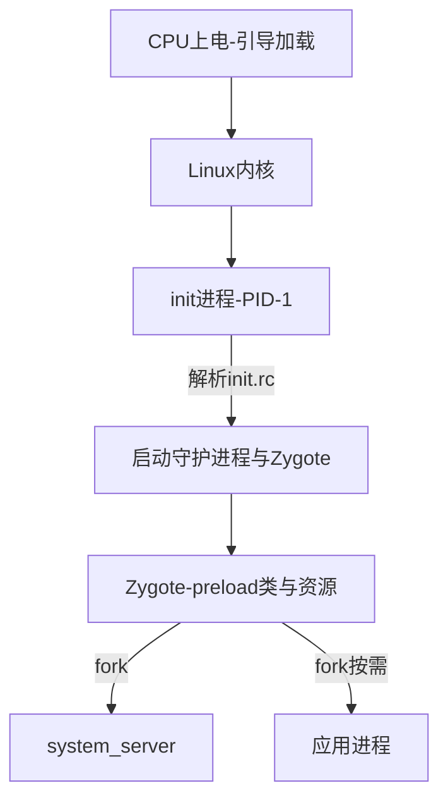
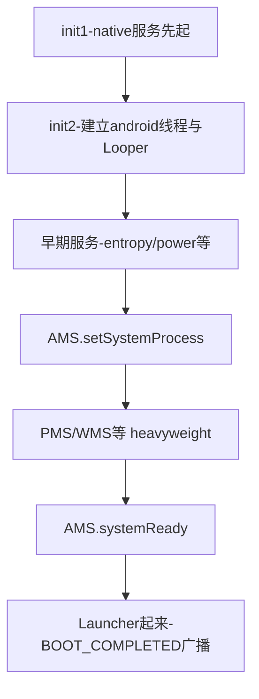
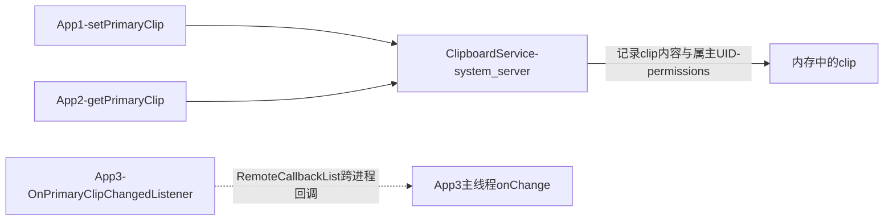

## 2.1 概述

system_server 是 Android Java 世界的心脏：Zygote fork 出的第一个（也是最重要的）进程，几乎所有的系统服务都住在里面——ActivityManagerService（AMS）、PackageManagerService（PMS）、WindowManagerService（WMS）……应用进程的一切"系统功能"请求，最终都落到这个进程的某个服务上。原书第 3 章以 Android 4.0 的 `SystemServer.java` 为主线，先看启动流程，再挑几个代表性"小服务"逐个剖析，借此展示系统服务的通用套路。

本章代码基于 Android 4.0，按概念重写（标注"概念简化"处），与原书可能有出入；小节编号为笔记整理时重建。

## 2.2 system_server 的启动

### 2.2.1 从 init 到 system_server 的完整链路

先把设备开机到 Java 世界诞生的时间线铺开：



init.rc 里 app_process 以 `--start-system-server` 参数启动 Zygote，Zygote 完成预加载（preload 常用类与 drawable 资源）后调用 `startSystemServer`：

```java
// ZygoteInit.startSystemServer（概念简化）
String args[] = {
    "--setuid=1000", "--setgid=1000",
    "--runtime-init",
    "--nice-name=system_server",
    "com.android.server.SystemServer",
};
forkSystemServer(args);   // Zygote.forkSystemServer → forkAndSpecialize
```

三个关键问题：

**1. 为什么 system_server 必须由 Zygote fork？** 因为所有 APK 进程也由 Zygote fork。system_server 与 App 进程共享同一份预加载的类和资源：既省内存（COW，Copy-On-Write 共享页），又保证 `CLASSPATH` 与运行时环境一致——AMS 里的代码与 App 里的 `Activity` 类必须来自同一个 `android.*` 世界。

**2. fork 之后发生了什么？** 子进程（system_server）通过 `handleSystemServerProcess` 回到 Java 入口 `RuntimeInit.zygoteInit` → `SystemServer.main`。注意 fork 出的进程带着 Zygote 的全部线程快照问题，所以 Zygote 在 fork 前后做了大量"单线程化"约束。

**3. 谁重启它？** init.rc 里声明 `service system_server /system/bin/app_process ...` 且标记 critical：system_server 一旦死亡（Watchdog 自杀、OOM），init 会杀死整个 Zygote 并重启 Java 世界——这就是"系统重启" softer 版本。

### 2.2.2 SystemServer 启动的三段式

4.0 时代的 `SystemServer` 用 native/Java 两段式启动（概念骨架）：

```java
public class SystemServer {
    public static void main(String[] args) {
        // 第一段：init1 → native层启动SurfaceFlinger、SensorService等native服务
        com.android.server.SystemServer.init1(args);
    }
    // native侧init1完成后回调init2（JNI上调）
    public static final void init2() {
        Thread thr = new ServerThread();   // 名为"android"的线程
        thr.start();
    }
}

class ServerThread extends Thread {
    public void run() {
        Looper.prepareMainLooper();
        // ……依次启动几十个服务（见2.2.3）
        Looper.loop();
    }
}
```



`ServerThread.run()` 的启动序列（节选顺序，概念简化）：

```java
Looper.prepareMainLooper();
// —— 第一批：轻量基础服务 ——
ServiceManager.addService("entropy", new EntropyService());
power = new PowerManagerService();
ServiceManager.addService("power", power);
// —— 第二批：包管理 ——
pm = PackageManagerService.main(context, factoryTest);
// —— 第三批：ActivityManager 及其依赖 ——
ams = ActivityManagerService.self();
ams.setSystemProcess();     // 注册"activity""meminfo""cpuinfo"等服务名
// —— 第四批：窗口 ——
wm = WindowManagerService.main(context, power, factoryTest);
// —— 收尾 ——
ams.systemReady(goCallback); // goCallback里发BOOT_COMPLETED
Looper.loop();
```

三个结构性要点：

- **服务启动顺序是精心安排的**。PMS 必须早于 AMS（AMS 查询权限与组件），WMS 要在 AMS 通知就绪前可用，`systemReady` 是"全世界可以跑了"的分水岭——它触发启动 Launcher、发送 `ACTION_BOOT_COMPLETED`。顺序错了就是开机循环重启
- **每个服务注册到 servicemanager 后立刻可被别人 getService**，所以"addService 的时刻"就是服务的对外可见时刻，而服务内部状态可能还没初始化完——早期代码大量依赖"调用方还没起来"这一事实来掩盖竞态
- **ServerThread 的 Looper 就是 system_server 的"主线程"**（后来的 `android.ui`/`android.fg`/`android.display` 多 HandlerThread 分组是后续演进）

### 2.2.3 一个系统服务的标准写法（4.0 风格）

以本章剖析的小服务为模板，4.0 时代的系统服务套路是：

1. 构造函数里做轻量初始化（重活异步化）
2. `ServiceManager.addService(name, binder)` 对外发布
3. 需要异步任务就内部建 Handler/HandlerThread
4. 需要开机后的时机就监听 `BOOT_COMPLETED` 广播

没有统一的生命周期接口，全靠 `ServerThread.run()` 里手工调用次序保证正确——这正是后来 `SystemServiceManager` 要解决的问题（见 2.4）。

## 2.3 代表性服务剖析

原书挑了几个"小而典型"的服务讲透套路，本节逐个展开。

### 2.3.1 EntropyService：随机数种子服务

**问题背景**：Linux 内核熵池在刚开机时种子不足，`SecureRandom` 依赖的 `/dev/urandom` 输出可预测性偏强，加密场景有风险。

**解法**：

1. 开机时读取 `/data/system/entropy.dat`（上次关机前存的 128 字节），`writeTo` 内核 `/dev/urandom` 补种
2. 起一个 Handler 定时任务（每 3 小时），把 urandom 的新鲜熵写回文件，滚动更新

它展示了最小系统服务的形态：**一个 Binder 服务 + 一个 Handler 定时任务 + 一个持久化文件**，全部不到 200 行。也演示了 `/data/system/` 这个"系统级持久化目录"的用法（packages.xml、batterystats 也在旁边）。

### 2.3.2 DropboxManagerService：异常现场收集箱

负责收集系统运行中的"异常现场"：应用 crash、ANR、Watchdog 死亡、磁盘告警、`SYSTEM_RESTART` 等。核心设计：

- 每个 entry 属于一个 **tag**（如 `system_app_crash`、`system_server_watchdog`、`system_app_anr`），tag 可配置最多保留个数与总字节数（`/data/system/dropbox` 下的滚动清理）
- entry 内容是字节流，附带时间戳，落盘文件名 `tag@timestamp.txt.gz`
- 对外提供 `DropBoxManager.addData/addText`；AMS 的 crash 处理流程（`handleAppCrashLocked`）会把进程堆栈 `addData` 进来

**排查实战**：`dumpsys dropbox` 列出全部 entry，或直接翻 `/data/system/dropbox/`——查"昨晚为什么重启""某 App 崩了什么"的第一站。它是 `bugreport` 数据的重要源头之一。

### 2.3.3 DeviceStorageMonitorService：磁盘水位看门狗

周期性（每 60s）`StatFs` 检查 `/data` 剩余空间，按水位广播：

| 水位 | 行为 |
|---|---|
| 剩余 < 10%（freeThreshold） | 广播 `ACTION_DEVICE_STORAGE_LOW`，isLow=true； PackageManager 暂停非必要安装 |
| 恢复过阈值 + buffer | 广播 `ACTION_DEVICE_STORAGE_OK` |

收到 LOW 广播的缓存型应用（如浏览器、地图离线包）应清理缓存——这是 4.0 时代"存储压力协同"的全部机制。后来它演化为 `StorageManagerService` 的一部分（见 2.4）。

### 2.3.4 SamplingProfilerService 与 DiskStatsService

- **SamplingProfilerService**：开机后对 system_server 做一段时间的采样剖析（默认概率开启），结果写 `/data/snapshot/`，用于厂商/Google 收集开机性能数据。展示的套路是"system_server 观测自己"
- **DiskStatsService**：极薄的只读服务，`dumpsys diskstats` 输出 app 数量、缓存大小、可用空间等聚合数字，供 bugreport 与自动化测试消费。展示了"dump 接口当报表"的用法——**每个 Binder 服务都自动获得 dump 接口**（`Binder.dump`），`dumpsys <name>` 即可调用，是系统服务调试的瑞士军刀

### 2.3.5 ClipboardService：多客户端转发模型

剪贴板是理解"多客户端 + 服务端转发"模型的经典案例：



要点展开：

- **set 方的 UID 与权限被记录**，get 时做检查：默认任何应用可读明文 clip，但 `addPrimaryClipChangedListener` 通知与 `getPrimaryClip` 都会更新"最后一次读取者"记录（后来成为剪贴板隐私提示的数据源）
- 变更通知用 `RemoteCallbackList` 管理跨进程监听者：注册的是 `IOnPrimaryClipChangedListener` Binder，回调时 ClipboardService 用每个监听者注册时绑定的 Handler 线程分发，监听者进程死后由 DeathRecipient 自动摘除——**DeathRecipient 的标准应用场景**
- clip 内容存在 system_server 内存里（不落盘），含大段数据时也有跨进程 Parcel 拷贝成本

### 2.3.6 Watchdog：system_server 的自我保护

严格说 Watchdog 不是被 addService 的服务，而是 system_server 里的一个守护线程（`Thread` 循环）：

```java
// Watchdog 核心循环（概念简化）
public void run() {
    while (true) {
        for (Monitor m : monitors) {
            m.monitor();        // 尝试在超时内拿到各服务的关键锁
        }
        // 上述任一monitor()阻塞超过30s未返回：
        // 1) dump所有线程堆栈 → dropbox(system_server_watchdog)
        // 2) kill system_server进程 → init重启Java世界
        sleep(30s);
    }
}
```

- AMS、WMS 等服务通过 `Watchdog.getInstance().addMonitor()` 登记自己的关键锁探测点（`monitor()` 内部 `ActivityManagerService.this.monitor(){ synchronized(this){} }` 式的取锁探测）
- 判定卡死后先取证（堆栈、CPU 占用、内核锁信息进 dropbox）再自杀——**"可诊断地死"是 system_server 的设计哲学**：宁可重启也不无限冻屏

## 2.4 后续演进：4.0 机制 vs 现代 Android

system_server 是被 Treble/主线模块化改造最深的进程之一。逐项对比：

| 维度 | Android 4.0（原书） | 现代 Android（12~15） | 展开说明 |
|---|---|---|---|
| 服务启动编排 | `ServerThread.run()` 手工排序，一个线程串行起 | `SystemServiceManager` + `SystemService` 生命周期 | Android 5.0 起：服务继承 `SystemService`，由 `SystemServiceManager.startService(EARLY/LATE)` 统一启动，并通过 `onBootPhase(phase)` 收到分阶段回调（`PHASE_WAIT_FOR_DEFAULT_DISPLAY` → `PHASE_LOCK_SETTINGS_READY` → … → `PHASE_BOOT_COMPLETED`），取代手工次序；启动还按 `@ServiceThread` 分发到 parallel 线程组，开机时间大幅优化 |
| 线程模型 | 单一 "android" 主线程 | android.ui / android.fg / android.display / android.io 等 HandlerThread 组 + binder 线程池分区 | 服务的工作线程按职责归组（fg 队列处理高优先级、io 处理磁盘），Watchdog 分别监控每组；死锁与优先级反转管理精细化 |
| 进程边界 | 所有服务挤在 system_server | Treble 拆分：netd、statsd、tombstoned、network_stack 等 native/独立进程 | Android 8~10 后"system_server 瘦身"，服务以 AIDL 接口跨进程协作；Java 服务部分（如 `NetworkStackService`）独立成 APK。原书"一个进程看全部服务"的阅读法要调整为"按接口找进程" |
| EntropyService | 存在 | 已删除 | 内核 CRNG（ChaCha20 就绪机制）成熟后不再需要用户态补种，Android 9 前后移除——原书 3.3.1 的内容已成历史注脚 |
| DeviceStorageMonitor | 独立定时服务 | 并入 `StorageManagerService` | Android 8 起存储卷管理、cache 配额（`StorageManager.setCacheBehavior`）、磁盘水位统一管理；`CACHE` 卷满时按配额清理缓存而非只广播 |
| Dropbox | 手工 addData | 语义不变，消费方进化 | `dumpsys dropbox` 仍在；incident/dumpstate 流水线（Android 9+）把 dropbox 纳入结构化报告，配合 `MetricsLogger`/statsd 的事件通道 |
| 剪贴板 | 属主 UID 记录 | 强隐私管控 | Android 10：后台读剪贴板返回空；Android 12：前台读取时系统提示"App 粘贴自 xxx"（用的就是属主记录）；`ClipDescription` 增加 `EXTRA_IS_SENSITIVE` 让输入法密码不进历史 |
| Watchdog | 30s 探测 + 自杀 | 同思路，更细粒度 | HAL 独立 watchdog（`IWatchdog` HAL）、`SiFramework` 各线程的 `Looper` monitor、卡死时输出 perfetto trace；仍是"取证后重启 system_server"作为最终手段 |

**阅读建议**：今天读 AOSP 的 system_server，入口文件仍是 `frameworks/base/services/java/com/android/server/SystemServer.java`，但 `run()` 里看到的是 `SystemServiceManager` 的分阶段启动（`startBootstrapServices` → `startOtherServices`）；原书剖析的"小服务套路"在系统服务代码里依然是通用语法（构造 + addService + Handler 异步化），迁移成本主要在生命周期接口化与跨进程化两点。
