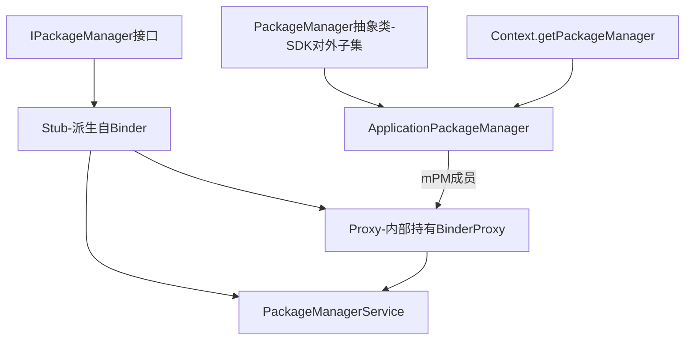
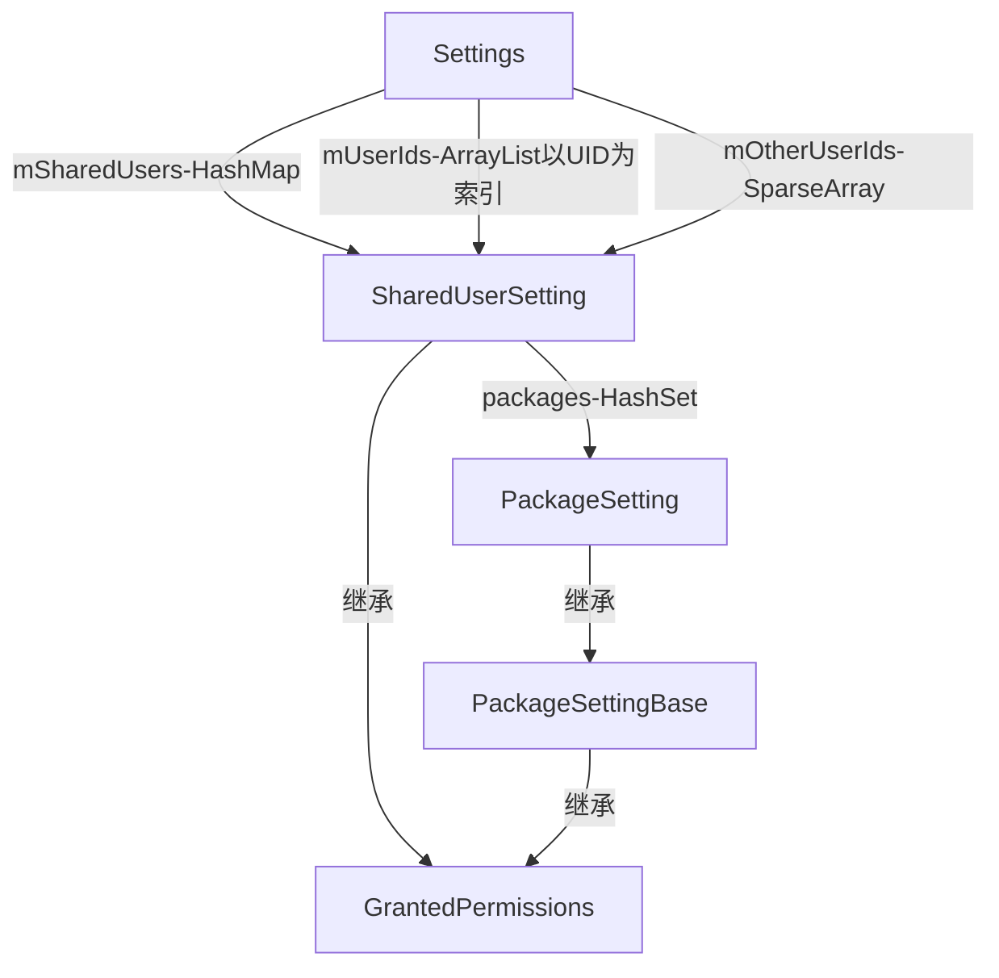
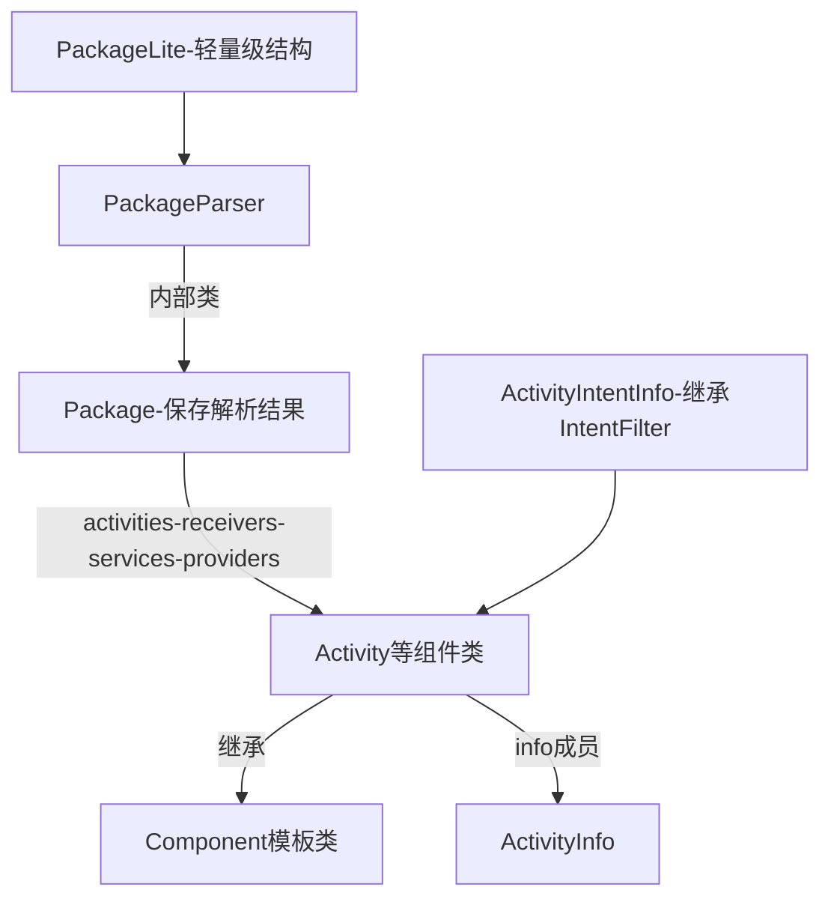
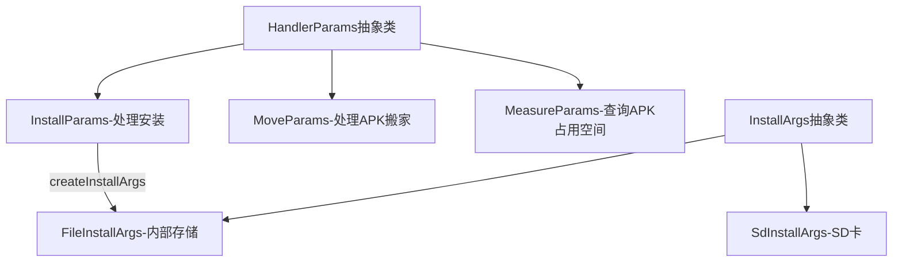
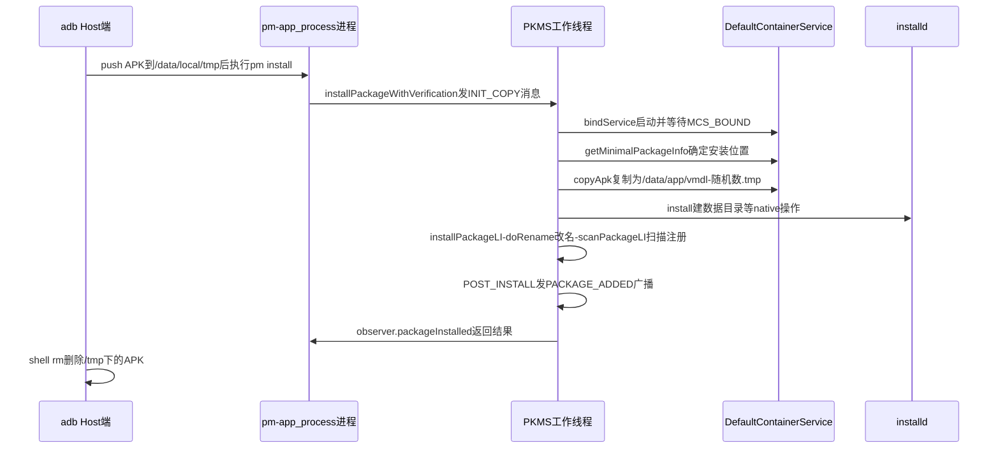

## 3.1 概述

PackageManagerService(后文简称 **PKMS**)是本书分析的第一个核心服务,负责系统中 **Package 的安装、卸载、升级、信息查询**。所有应用里的 `PackageManager` API,最终都是跨 Binder 调用到 system_server 里的 PKMS。

先看 PKMS 及其客户端的类家族:



- **IPackageManager** 接口定义了服务端和客户端通信的业务函数,其内部类 **Stub** 从 Binder 派生并实现该接口;PKMS 继承自 Stub,因此作为 **Binder 服务端**参与通信
- Stub 中定义了内部类 **Proxy**,它持有 IBinder 类型(实际为 BinderProxy)的 `mRemote`,用于和 PKMS 通信
- 出于安全考虑,Android 对外(SDK)开放的只是 IPackageManager 的一个子集,封装在抽象类 **PackageManager** 中;客户端通过 `Context.getPackageManager` 得到的实际是其子类 **ApplicationPackageManager**——它不直接参与 Binder 通信,而是通过 `mPM` 成员指向一个 Proxy 对象

> IPackageManager.java 在源码树中找不到——它是编译时由 aidl 工具处理 IPackageManager.aidl 生成的,位于 out 目录下的 framework_intermediates 中。aidl 生成的文件结构都是"接口 + Stub(内含 Proxy)"这套固定形状,与第 2 章的 Binder 知识一一对应。

PKMS 内部几组核心数据结构(4.0 命名,后文反复出现):

| 数据结构 | 职责 |
|---|---|
| `mPackages` | 包名 → PackageParser.Package,所有已装包的总登记表 |
| `mActivities` / `mReceivers` / `mServices` / `mProvidersByComponent` | 四大组件索引,Intent 匹配查询用 |
| `mSharedLibraries` | 系统共享 Java 库名 → 路径(platform.xml 的 library 标签) |
| `mPermissions` / `mSystemPermissions` | 权限定义表 / 特定 UID 被赋的权限 |
| `mAvailableFeatures` | 设备硬件特性表(feature 标签) |
| `mSettings`(Settings) | 包世界"账本":UID 分配、签名、授权、sharedUser 记录 |
| `mInstaller`(Installer) | 与 native 守护进程 installd 的 socket 客户端 |

## 3.2 初识 PackageManagerService

PKMS 由 SystemServer 的 ServerThread 创建,关键调用轨迹如下:

```java
// SystemServer.java :: ServerThread 的 run 函数(节选)
// 4.0 新增的设备加密功能由系统属性 vold.decrypt 指定,
// 它对 PKMS 的影响就是 onlyCore 变量:是否只扫描系统目录(含 APK 和 Jar 包)
String cryptState = SystemProperties.get("vold.decrypt");
boolean onlyCore = false;
// ENCRYPTING_STATE 的值为 "trigger_restart_min_framework"
if (ENCRYPTING_STATE.equals(cryptState)) {
    ......                                    // 加密流程中,只扫描系统包
    onlyCore = true;
} else if (ENCRYPTED_STATE.equals(cryptState)) {
    ......                                    // ENCRYPTED_STATE 的值为 "1"
    onlyCore = true;
}
// ① 调用 PKMS 的 main 函数;第二个参数判断是否为工厂测试,此处不考虑
pm = PackageManagerService.main(context,
        factoryTest != SystemServer.FACTORY_TEST_OFF, onlyCore);
boolean firstBoot = false;
try {
    // 判断本次是否为初次启动。Zygote 或 SystemServer 退出时 init 会再次拉起它们,
    // 所以 FirstBoot 特指开机后的第一次启动
    firstBoot = pm.isFirstBoot();             // ②
} ......
try {
    pm.performBootDexOpt();                   // ③ 对已安装应用做 dex 优化
} ......
try {
    pm.systemReady();                         // ④ 通知系统进入就绪状态
} ......
```

main 函数本身只有几行,但执行时间却很长——重体力活全在 PKMS 的构造函数里:

```java
// PackageManagerService.java :: main
public static final IPackageManager main(Context context, boolean factoryTest,
        boolean onlyCore) {
    // 构造函数中完成开机扫描,耗时耗内存,是 Android 启动慢的主要原因之一
    PackageManagerService m = new PackageManagerService(context,
            factoryTest, onlyCore);
    // 向 ServiceManager 注册 PKMS,服务名为 "package"
    ServiceManager.addService("package", m);
    return m;
}
```

抽象地看,PKMS 像一个**加工厂**:解析物理文件(APK),生成符合自己要求的数据结构。例如解析 APK 中的 AndroidManifest.xml,根据其中声明的 activity 标签创建对应的对象并加以保管。PKMS 的工作流程相对简单,复杂的是其中的**数据结构及关系**和**策略控制**(如 onlyCore)。

PKMS 构造函数的工作分三个阶段:

1. 扫描目标文件夹之前的准备工作(解析各类 XML)
2. 扫描目标文件夹(系统目录 + 非系统目录)
3. 扫描之后的工作(权限汇总、写账本)

## 3.3 PKMS 构造函数分析:开机扫描三阶段

### 3.3.1 第一阶段:前期准备工作

#### 1. Settings 与 SharedUserSetting

构造函数开头先创建 **Settings** 对象——它保存系统运行过程中的设置信息,是 PKMS 的"账本",并预登记四个系统级 sharedUser:

```java
// PackageManagerService.java :: 构造函数(节选)
mContext = context;
mFactoryTest = factoryTest;   // 假定为 false,即非工厂模式
mOnlyCore = onlyCore;         // 假定为 false,即普通模式
// 如果是 eng 版,扫描 Package 后不对 package 做 dex 优化
mNoDexOpt = "eng".equals(SystemProperties.get("ro.build.type"));
mMetrics = new DisplayMetrics();   // 存储屏幕宽/高、分辨率等显示属性
mSettings = new Settings();        // 非常重要的类,管理运行时的设置信息
// 预登记系统级 sharedUser:名字 → 固定 UID
mSettings.addSharedUserLPw("android.uid.system",
        Process.SYSTEM_UID, ApplicationInfo.FLAG_SYSTEM);
mSettings.addSharedUserLPw("android.uid.phone",
        MULTIPLE_APPLICATION_UIDS ? RADIO_UID : FIRST_APPLICATION_UID,
        ApplicationInfo.FLAG_SYSTEM);
mSettings.addSharedUserLPw("android.uid.log",
        MULTIPLE_APPLICATION_UIDS ? LOG_UID : FIRST_APPLICATION_UID,
        ApplicationInfo.FLAG_SYSTEM);
mSettings.addSharedUserLPw("android.uid.nfc",
        MULTIPLE_APPLICATION_UIDS ? NFC_UID : FIRST_APPLICATION_UID,
        ApplicationInfo.FLAG_SYSTEM);
```

这里引出 **UID/GID** 的话题。UID(User ID,用户 ID)与 GID(Group ID,用户组 ID)是 Linux 进程权限管理的基本概念:每个进程有一个 UID(属于哪个 user),也可分属多个用户组。Android 在 Process.java 中定义了系统级的 UID/GID:

```java
// Process.java(节选)
public static final int SYSTEM_UID = 1000;            // 系统进程
public static final int PHONE_UID = 1001;             // Phone 进程
public static final int SHELL_UID = 2000;             // shell 进程
public static final int LOG_UID = 1007;               // 使用 LOG 的进程所在组
public static final int WIFI_UID = 1010;              // WIFI 相关进程
public static final int MEDIA_UID = 1013;             // mediaserver 进程
public static final int SDCARD_RW_GID = 1015;         // 可读写 SD 卡的组
public static final int NFC_UID = 1025;               // NFC 相关进程
public static final int MEDIA_RW_GID = 1023;          // 可读写内部存储的组
public static final int FIRST_APPLICATION_UID = 10000; // 应用 Package 起始 UID
public static final int LAST_APPLICATION_UID = 99999;  // 应用 Package 最大 UID
```

看 addSharedUserLPw 的实现:

```java
// Settings.java :: addSharedUserLPw(节选)
SharedUserSetting addSharedUserLPw(String name, int uid, int pkgFlags) {
    // mSharedUsers 是 HashMap:key 为 sharedUser 字符串,value 为 SharedUserSetting
    SharedUserSetting s = mSharedUsers.get(name);
    if (s != null) {
        if (s.userId == uid) return s;   // 已存在且 uid 一致,直接复用
        ......
        return null;
    }
    // 创建 SharedUserSetting 并设置 userId
    s = new SharedUserSetting(name, pkgFlags);
    s.userId = uid;
    if (addUserIdLPw(uid, s, name)) {
        mSharedUsers.put(name, s);       // name 与 s 键值对存入 mSharedUsers
        return s;
    }
    return null;
}
```

**sharedUserId 的两个作用**(以 SystemUI 为例):

```xml
<!-- SystemUI 的 AndroidManifest.xml(节选) -->
<manifest xmlns:android="http://schemas.android.com/apk/res/android"
      package="com.android.systemui"
      coreApp="true"
      android:sharedUserId="android.uid.system"
      android:process="system">
```

- 两个或多个声明了**同一种 sharedUserId** 的 APK 可共享彼此的数据,并且可运行在同一进程中
- 更重要的是,通过声明特定的 sharedUserId,该 APK 所在进程将被**赋予指定的 UID**——SystemUI 声明了 `android.uid.system`,其进程就享有 system 用户对应的全部权限

> 除了在 AndroidManifest.xml 中声明 sharedUserId,APK 在编译时还必须用对应证书签名(SystemUI 的 Android.mk 中声明 `LOCAL_CERTIFICATE := platform`),才能获得指定的 UID。

**SharedUserSetting 的数据结构设计**回答了三个问题:XML 中的字符串如何与代码关联(字符串成员)、Linux 真正的 UID 是整数(整型成员)、多个 Package 可声明同一 sharedUserId(packages 集合成员):



- **SharedUserSetting** 派生自 **GrantedPermissions**(权限相关),其 `packages` 成员保存声明了相同 sharedUserId 的各 Package 的设置信息
- **PackageSetting** 表达单个 Package 的权限设置,继承链:PackageSetting → PackageSettingBase → GrantedPermissions
- Settings 的 `mUserIds`(ArrayList)与 `mOtherUserIds`(SparseArray)以 UID 为索引反查 SharedUserSetting——按下标取数组元素比按 key 查 HashMap 快,典型的**以空间换时间**

addUserIdLPw 把 SharedUserSetting 保存到对应数组:应用 UID(≥ 10000)存 mUserIds(索引为 uid 与 FIRST_APPLICATION_UID 之差),系统 UID 存 mOtherUserIds,并校验 uid 不能越过 `FIRST_APPLICATION_UID + MAX_APPLICATION_UIDS` 的上限。

#### 2. readPermissions:解析 /system/etc/permissions

构造函数接着创建 Installer(与 native 进程 installd 交互的 socket 客户端)、获取屏幕信息,并做两次关键读取:

```java
// PackageManagerService.java :: 构造函数(节选)
mHandlerThread.start();   // 带消息循环的工作线程,负责程序的安装和卸载
mHandler = new PackageHandler(mHandlerThread.getLooper());
// handleMessage 将运行在该工作线程上,而非 Binder 线程
mAppDataDir = new File(dataDir, "data");               // /data/data
mUserAppDataDir = new File(dataDir, "user");           // /data/user
mDrmAppPrivateInstallDir = new File(dataDir, "app-private"); // /data/app-private
// UserManager:4.0 新增,管理手机上的不同用户(多用户雏形)
mUserManager = new UserManager(mInstaller, mUserAppDataDir);
readPermissions();                    // ① 从 /system/etc/permissions 读权限
mRestoredSettings = mSettings.readLPw(); // ② 读上次的"账本"
```

readPermissions 解析 `/system/etc/permissions` 目录下的 XML(先处理其他文件,**最后处理优先级最高的 platform.xml**):

```java
// PackageManagerService.java :: readPermissions(节选)
void readPermissions() {
    // 该目录存储了和设备相关的权限信息
    File libraryDir = new File(Environment.getRootDirectory(),
            "etc/permissions");
    ......
    for (File f : libraryDir.listFiles()) {
        if (f.getPath().endsWith("etc/permissions/platform.xml")) {
            continue;                    // platform.xml 留到最后解析
        }
        readPermissionsFromXml(f);
    }
    final File permFile = new File(Environment.getRootDirectory(),
            "etc/permissions/platform.xml");
    readPermissionsFromXml(permFile);    // platform.xml 优先级最高
}
```

platform.xml 使用了 4 类标签:

```xml
<!-- platform.xml(节选) -->
<permissions>
  <!-- 建立权限名与 gid 的映射:这些权限涉及和 Linux 内核交互(读写设备/创建 socket),
       需要在底层权限(由用户组界定)和 Android 层权限(由字符串界定)之间建立映射 -->
  <permission name="android.permission.BLUETOOTH_ADMIN" >
      <group gid="net_bt_admin" />
  </permission>
  <permission name="android.permission.BLUETOOTH" >
      <group gid="net_bt" />
  </permission>
  <!-- 赋予对应 uid 相应的权限:uid 为 shell 的进程可获得 SEND_SMS 权限
       (其实就是把它加到对应的"用户组"中) -->
  <assign-permission name="android.permission.SEND_SMS" uid="shell" />
  <assign-permission name="android.permission.CALL_PHONE" uid="shell" />
  <!-- 系统提供的 Java 库,应用运行时系统会自动为进程加载 -->
  <library name="android.test.runner"
          file="/system/frameworks/android.test.runner.jar" />
  <library name="javax.obex"
          file="/system/frameworks/javax.obex.jar" />
</permissions>
```

其余 XML 以 feature 标签描述设备硬件特性,如 handheld-core-hardware.xml 声明了 `android.hardware.camera`、`android.hardware.bluetooth`、`android.hardware.touchscreen` 等——应用中的 `<uses-feature>` 就与它们匹配。这些文件在**编译阶段**由各硬件平台按自己的配置从 frameworks/base/data/etc 复制到目标目录,随 system 镜像烧入手机。

readPermissionsFromXml 用 XmlPullParser 把标签转成数据结构:

```java
// PackageManagerService.java :: readPermissionsFromXml(节选)
while (true) {
    ......
    String name = parser.getName();
    if ("group".equals(name)) {
        // gid 字符串转整型,保存到 mGlobalGids
        int gid = Integer.parseInt(gidStr);
        mGlobalGids = appendInt(mGlobalGids, gid);
    } else if ("permission".equals(name)) {
        readPermission(parser, perm);   // 建立 permission → gid 数组的映射
    } else if ("assign-permission".equals(name)) {
        int uid = Process.getUidForName(uidStr);
        // assign 相关信息保存在 mSystemPermissions:uid → 权限字符串集合
        HashSet<String> perms = mSystemPermissions.get(uid);
        if (perms == null) {
            perms = new HashSet<String>();
            mSystemPermissions.put(uid, perms);
        }
        perms.add(perm);
    } else if ("library".equals(name)) {
        // 系统库名与路径存储到 mSharedLibraries
        mSharedLibraries.put(lname, lfile);
    } else if ("feature".equals(name)) {
        // feature 由 FeatureInfo 表达,存入 mAvailableFeatures
        FeatureInfo fi = new FeatureInfo();
        fi.name = fname;
        mAvailableFeatures.put(fname, fi);
    }
    ......
}
```

一句话:**readPermissions 的目的是保存 XML 中各种标签及它们之间的关系**,重要的是理解标签的作用,而不是数据结构本身。

#### 3. readLPw 的"佐料":五个文件

readLPw 解析的文件是 PKMS **上次正常运行后自己生成的**,路径在 Settings 构造函数中指明:

```java
// Settings.java :: 构造函数(节选)
Settings() {
    File dataDir = Environment.getDataDirectory();
    File systemDir = new File(dataDir, "system");  // /data/system
    systemDir.mkdirs();
    ......
    mSettingsFilename = new File(systemDir, "packages.xml");
    mBackupSettingsFilename = new File(systemDir, "packages-backup.xml");
    mPackageListFilename = new File(systemDir, "packages.list");
    mStoppedPackagesFilename = new File(systemDir, "packages-stopped.xml");
    mBackupStoppedPackagesFilename = new File(systemDir,
            "packages-stopped-backup.xml");
}
```

| 文件 | 内容 |
|---|---|
| packages.xml + packages-backup.xml | 系统中所安装 Package 的信息。PKMS 先把数据写到 backup,全部写成功后再改名为正式文件——**防止写文件过程中出错导致信息丢失**的原子策略 |
| packages-stopped.xml + backup | 被用户强制停止(Force Stop)的 Package 信息;若 backup 存在,说明上次流程被中断 |
| packages.list | 当前系统中应用级(UID ≥ 10000)Package 的信息列表 |

readLPw 解析这些 XML 并建立/更新数据结构(例如 stopped 状态的 package 重启之后依然是 stopped)。**packages.xml 是 PKMS 的"账本"**:扫描 APK 得到的是"新信息",账本里存的是"旧信息",升级、沿用 UID 等判断都来自新旧对比。

第一阶段总结:**扫描并解析 XML 文件,将其中的信息保存到特定的数据结构中**,为下一阶段的扫描提供参考。

### 3.3.2 第二阶段:扫描 Package

#### 1. 系统库的 dex 优化

进入扫描前,PKMS 先确保系统库都做过 dex 优化:

```java
// PackageManagerService.java :: 构造函数(节选)
int scanMode = SCAN_MONITOR | SCAN_NO_PATHS | SCAN_DEFER_DEX;
if (mNoDexOpt) {
    scanMode |= SCAN_NO_DEX;   // 控制扫描过程中是否对 APK 做 dex 优化
}
mFrameworkDir = new File(Environment.getRootDirectory(), "framework");
mDalvikCacheDir = new File(dataDir, "dalvik-cache");   // /data/dalvik-cache
boolean didDexOpt = false;
// java.boot.class.path 来自 init.rc 的 BOOTCLASSPATH 环境变量,
// 指明 framework 所有核心库的位置(core.jar、framework.jar、services.jar 等)
String bootClassPath = System.getProperty("java.boot.class.path");
if (bootClassPath != null) {
    String[] paths = splitString(bootClassPath, ':');
    for (int i = 0; i < paths.length; i++) {
        // 判断该 jar 包是否需要重新做 dex 优化
        if (dalvik.system.DexFile.isDexOptNeeded(paths[i])) {
            // 通过 mInstaller 发送命令给 installd,让它对该 jar 包做 dex 优化
            mInstaller.dexopt(paths[i], Process.SYSTEM_UID, true);
            didDexOpt = true;
        }
    }
}
// platform.xml 中声明的系统库、/system/framework 目录下的 jar/apk 同样处理
......
if (didDexOpt) {
    // 只要对任何一个系统库重新做过 dex 优化,就要删除/data/dalvik-cache 下
    // data@app@ 与 data@app-private@ 开头的 cache 文件——这些 cache 依赖
    // 优化前的系统库,系统库变了缓存即失效
    String[] files = mDalvikCacheDir.list();
    ......
}
```

#### 2. scanDirLI 与第一个 scanPackageLI

接着 PKMS 为每个目录创建 **AppDirObserver**(利用 Linux 的 **inotify** 机制监控目录,APK 被放入目录即可自动触发安装),并依次扫描:

```java
// PackageManagerService.java :: 构造函数(节选)
// 监控并扫描 /system/framework(注意加了 SCAN_NO_DEX:前面已按需做过 dex 优化)
mFrameworkInstallObserver = new AppDirObserver(
        mFrameworkDir.getPath(), OBSERVER_EVENTS, true);
mFrameworkInstallObserver.startWatching();
scanDirLI(mFrameworkDir, PackageParser.PARSE_IS_SYSTEM
        | PackageParser.PARSE_IS_SYSTEM_DIR, scanMode | SCAN_NO_DEX, 0);
// 监控并扫描 /system/app
mSystemAppDir = new File(Environment.getRootDirectory(), "app");
mSystemInstallObserver = new AppDirObserver(
        mSystemAppDir.getPath(), OBSERVER_EVENTS, true);
mSystemInstallObserver.startWatching();
scanDirLI(mSystemAppDir, PackageParser.PARSE_IS_SYSTEM
        | PackageParser.PARSE_IS_SYSTEM_DIR, scanMode, 0);
// 监控并扫描 /vendor/app
mVendorAppDir = new File("/vendor/app");
mVendorInstallObserver = new AppDirObserver(
        mVendorAppDir.getPath(), OBSERVER_EVENTS, true);
mVendorInstallObserver.startWatching();
scanDirLI(mVendorAppDir, PackageParser.PARSE_IS_SYSTEM
        | PackageParser.PARSE_IS_SYSTEM_DIR, scanMode, 0);
mInstaller.moveFiles();   // 和 installd 交互,处理系统升级相关的文件搬移
```

三个**系统 Package 目录**:/system/framework(scanDirLI 只扫 APK,所以 framework-res.apk 是该目录唯一"受宠"的文件)、/system/app(默认系统应用如 Browser.apk、SettingsProvider.apk)、/vendor/app(厂商提供,不过实际厂商多把应用放在 /system/app)。

scanDirLI 逐个文件扫描:

```java
// PackageManagerService.java :: scanDirLI(节选)
private void scanDirLI(File dir, int flags, int scanMode, long currentTime) {
    String[] files = dir.list();
    ......
    for (int i = 0; i < files.length; i++) {
        File file = new File(dir, files[i]);
        if (!isPackageFilename(files[i])) {
            continue;      // 根据文件名后缀,只扫描 APK 文件
        }
        // 返回值是 PackageParser 的内部类 Package,一个实例代表一个 APK 文件
        PackageParser.Package pkg = scanPackageLI(file,
                flags | PackageParser.PARSE_MUST_BE_APK, scanMode, currentTime);
        if (pkg == null && (flags & PackageParser.PARSE_IS_SYSTEM) == 0 &&
                mLastScanError == PackageManager.INSTALL_FAILED_INVALID_APK) {
            // 注意 flags 的作用:只有非系统 Package 扫描失败才删除该文件
            file.delete();
        }
    }
}
```

PKMS 中有**两个同名 scanPackageLI 重载**。第一个负责"解析":

```java
// PackageManagerService.java :: 第一个 scanPackageLI(节选)
private PackageParser.Package scanPackageLI(File scanFile,
        int parseFlags, int scanMode, long currentTime) {
    mLastScanError = PackageManager.INSTALL_SUCCEEDED;
    String scanPath = scanFile.getPath();
    parseFlags |= mDefParseFlags;   // 默认扫描标志,正常情况下为 0
    // 创建 PackageParser 对象,调用其 parsePackage 解析 APK 文件,
    // 注意把代表屏幕信息的 mMetrics 也传了进去
    PackageParser pp = new PackageParser(scanPath);
    pp.setSeparateProcesses(mSeparateProcesses);
    pp.setOnlyCoreApps(mOnlyCore);
    final PackageParser.Package pkg = pp.parsePackage(scanFile,
            scanPath, mMetrics, parseFlags);
    ......
    PackageSetting ps = null;
    PackageSetting updatedPkg;
    /* 此处略去约 300 行 Package 升级处理:刚解析得到的是"新"信息,
       旧信息来自 readLPw 读的 packages.xml,对比两次信息即知是否需要升级 */
    // 收集签名信息(证书验证)
    if (!collectCertificatesLI(pp, ps, pkg, scanFile, parseFlags))
        return null;
    // PARSE_FORWARD_LOCK 标志针对资源和 Class 文件不在同一目录的情况
    // (仅 /vendor/app 扫描使用),本书不考虑
    ......
    // 设置文件路径信息:codePath 和 resPath 都指向 APK 文件所在位置
    setApplicationInfoPaths(pkg, codePath, resPath);
    // 调用第二个 scanPackageLI 函数
    return scanPackageLI(pkg, parseFlags, scanMode | SCAN_UPDATE_SIGNATURE,
            currentTime);
}
```

#### 3. PackageParser:解析 AndroidManifest.xml

**PackageParser** 完成从物理文件到数据结构的转换——解析 APK 中的 AndroidManifest.xml:

```java
// PackageParser.java :: parsePackage(节选)
public Package parsePackage(File sourceFile, String destCodePath,
        DisplayMetrics metrics, int flags) {
    mArchiveSourcePath = sourceFile.getPath();
    ......
    AssetManager assmgr = new AssetManager();
    int cookie = assmgr.addAssetPath(mArchiveSourcePath);
    if (cookie != 0) {
        res = new Resources(assmgr, metrics, null);
        // 获得解析 AndroidManifest.xml 的 XML 资源解析对象
        parser = assmgr.openXmlResourceParser(cookie,
                ANDROID_MANIFEST_FILENAME);
    }
    ......
    // 调用另一个同名 parsePackage 函数
    pkg = parsePackage(res, parser, flags, errorText);
    ......
    pkg.mPath = destCodePath;
    pkg.mScanPath = mArchiveSourcePath;
    pkg.mSignatures = null;
    return pkg;
}
```

第二个 parsePackage 就是逐标签解析 AndroidManifest.xml:先取 package 属性得到包名并创建 Package 对象,然后循环处理各标签——`application`(四大组件都在其中,由 parseApplication 处理)、`permission-group`、`permission`、`uses-permission`、`uses-configuration` 等:

```java
// PackageParser.java :: parsePackage(重载,节选)
// 得到包名,即 manifest 中 package 属性的值,每个 APK 都必须定义
String pkgName = parsePackageName(parser, attrs, flags, outError);
final Package pkg = new Package(pkgName);   // 后面的工作就是解析 XML 并填充它
......
while (如果解析未完成) {
    String tagName = parser.getName();
    if (tagName.equals("application")) {
        parseApplication(pkg, res, parser, attrs, flags, outError);
    } else if (tagName.equals("permission-group")) {
        parsePermissionGroup(pkg, res, parser, attrs, outError);
    } else if (tagName.equals("permission")) {
        parsePermission(pkg, res, parser, attrs, outError);
    } else if (tagName.equals("uses-permission")) {
        sa = res.obtainAttributes(attrs, ......);
        // 取出权限使用声明,添加到 Package 的 requestedPermissions 数组
        String name = sa.getNonResourceString(......);
        if (name != null && !pkg.requestedPermissions.contains(name)) {
            pkg.requestedPermissions.add(name.intern());
        }
    } else if (tagName.equals("uses-configuration")) {
        // 指明对硬件的设置参数(触摸屏、键盘等),游戏类应用可能对此有要求
        ConfigurationInfo cPref = new ConfigurationInfo();
        pkg.configPreferences.add(cPref);
    }
    ......// 对其他标签的解析和处理
}
```

PackageParser 家族的要点:



- Package 的成员变量与四大组件一一对应:`activities`、`receivers`、`providers`、`services`,均声明为 ArrayList(一个 APK 可声明多个组件)
- 以 PackageParser.Activity 为例,它从 `Component<ActivityIntentInfo>` 模板类派生,内部有一个 ActivityInfo 成员。**为什么不直接用 ActivityInfo?** 因为 Package 除了保存信息,还要支持 **Intent 匹配查询**——ActivityIntentInfo 从 IntentFilter 派生,能判断自己是否满足某 Intent 的要求,满足则返回对应的 ActivityInfo
- **PackageLite** 是轻量级数据结构,仅存储 Package 的简单信息(安装流程中会再遇到它)

#### 4. 与 scanPackageLI 再相遇:注册进 PKMS

PackageParser 扫描完一个 APK 后,系统已得到一个完整的 Package 对象,下一步是把它"加入系统"——第二个 scanPackageLI,长达 800 行,分段看关键内容。

**特殊待遇:packageName 为 "android" 的包**(对应 framework-res.apk):

```java
// PackageManagerService.java :: 第二个 scanPackageLI(节选)
if ((parseFlags & PackageParser.PARSE_IS_SYSTEM) != 0) {
    pkg.applicationInfo.flags |= ApplicationInfo.FLAG_SYSTEM; // 标识系统 Package
}
// 下面这句 if 判断极为重要:单独处理 packageName 为 "android" 的 Package
if (pkg.packageName.equals("android")) {
    synchronized (mPackages) {
        if (mAndroidApplication != null) { ...... }
        mPlatformPackage = pkg;                    // 保存该 Package 信息
        pkg.mVersionCode = mSdkVersion;
        mAndroidApplication = pkg.applicationInfo; // 保存其 ApplicationInfo
        mResolveActivity.applicationInfo = mAndroidApplication;
        mResolveActivity.name = ResolverActivity.class.getName();
        mResolveActivity.packageName = mAndroidApplication.packageName;
        ......  // 配置 mResolveActivity 的 launchMode/theme/exported 等属性
        mResolveInfo.activityInfo = mResolveActivity;
        mResolveComponentName = new ComponentName(
                mAndroidApplication.packageName, mResolveActivity.name);
    }
}
```

framework-res.apk 还包含几个常用 Activity:**ChooserActivity**(多个 Activity 匹配同一 Intent 时弹出选择框)、RingtonePickerActivity(铃声选择)、ShutdownActivity(关机对话框)。它与系统息息相关,故得到 PKMS 的特别青睐:`mPlatformPackage` 保存该 Package、`mAndroidApplication` 保存其 ApplicationInfo、`mResolveActivity`/`mResolveInfo` 单独保存 ChooserActivity 的信息——**ResolverActivity 使用频率高,单独保存是为了提高运行时的效率**。从 PKMS 查询满足某 Intent 的 Activity 时,返回的就是 ResolveInfo。

**重名检查与设置处理**:

```java
// 第二个 scanPackageLI 续(节选)
// mPackages 保存系统内所有 Package,以 packageName 为 key
if (mPackages.containsKey(pkg.packageName)
        || mSharedLibraries.containsKey(pkg.packageName)) {
    return null;     // 已存在同名 Package,拒绝
}
......
synchronized (mPackages) {
    /* 此段代码约 300 行,主要做四方面工作:
       ① 如果该 Package 声明了 uses-library,判断该 library 是否在 mSharedLibraries 中
       ② 如果声明了 sharedUser,处理 SharedUserSettings(由 Settings 的 getSharedUserLPw 完成)
       ③ 处理 pkgSetting(由 Settings 的 getPackageLPw 完成,含 UID 分配/沿用)
       ④ 调用 verifySignaturesLP 检查该 Package 的签名 */
}
// 确定运行该 Package 的进程名,一般用 packageName 作为进程名
pkg.applicationInfo.processName = fixProcessName(
        pkg.applicationInfo.packageName,
        pkg.applicationInfo.processName, pkg.applicationInfo.uid);
```

**数据目录与 native 库**:

```java
// 第二个 scanPackageLI 续(节选)
if (mPlatformPackage == pkg) {
    dataPath = new File(Environment.getDataDirectory(), "system");
    pkg.applicationInfo.dataDir = dataPath.getPath();
} else {
    // 返回该 Package 的数据目录,一般是 /data/data/packageName/
    dataPath = getDataPathForPackage(pkg.packageName, 0);
    if (dataPath.exists()) {
        ......     // 目录已存在,则要处理 uid 的问题
    } else {
        // 向 installd 发送 install 命令:在 /data/data 下建立 packageName 目录
        int ret = mInstaller.install(pkgName, pkg.applicationInfo.uid,
                pkg.applicationInfo.uid);
        // 为系统所有 user 安装此程序
        mUserManager.installPackageForAllUsers(pkgName,
                pkg.applicationInfo.uid);
        ......
        // 为该 Package 确定 native library 所在目录,一般是 /data/data/packagename/lib
    }
}
// 如果该 APK 包含 native 动态库,需解压并复制到对应目录
if (pkg.applicationInfo.nativeLibraryDir != null) {
    // 从 2.3 开始系统 Package 的 native 库统一放在 /system/lib 下,
    // 所以不提取系统 Package 目录下 APK 中的 native 库
    if (isSystemApp(pkg) && !isUpdatedSystemApp(pkg)) {
        NativeLibraryHelper.removeNativeBinariesFromDirLI(nativeLibraryDir);
    } else if (nativeLibraryDir.getParentFile().getCanonicalPath()
            .equals(dataPathString)) {
        // 在 lib 下建立和 CPU 类型对应的目录,例如 ARM 平台是 arm/
        NativeLibraryHelper.copyNativeBinariesIfNeededLI(scanFile,
                nativeLibraryDir);
    }
    ......
}
if ((scanMode & SCAN_NO_DEX) == 0) {
    performDexOptLI(pkg, forceDex, (scanMode & SCAN_DEFER_DEX)); // 做 dex 优化
}
// 如果是覆盖安装,要先杀掉运行该 APK 的进程
if ((parseFlags & PackageManager.INSTALL_REPLACE_EXISTING) != 0) {
    killApplication(pkg.applicationInfo.packageName, pkg.applicationInfo.uid);
}
```

**私有财产公有化**——此前四大组件信息都属于 Package 的私有财产,现在登记注册到 PKMS 内部,PKMS 即可对外提供统一的组件查询:

```java
// 第二个 scanPackageLI 续(节选)
synchronized (mPackages) {
    if ((scanMode & SCAN_MONITOR) != 0) {
        mAppDirs.put(pkg.mPath, pkg);
    }
    mSettings.insertPackageSettingLPw(pkgSetting, pkg);
    mPackages.put(pkg.applicationInfo.packageName, pkg);  // 包名 → Package
    // 处理 Provider:mProvidersByComponent 提供基于 ComponentName 的查询
    int N = pkg.providers.size();
    for (int i = 0; i < N; i++) {
        PackageParser.Provider p = pkg.providers.get(i);
        p.info.processName = fixProcessName(
                pkg.applicationInfo.processName,
                p.info.processName, pkg.applicationInfo.uid);
        mProvidersByComponent.put(new ComponentName(
                p.info.packageName, p.info.name), p);
    }
    // 处理 Service
    N = pkg.services.size();
    for (int i = 0; i < N; i++) {
        PackageParser.Service s = pkg.services.get(i);
        mServices.addService(s);
    }
    // 处理 BroadcastReceiver
    N = pkg.receivers.size();
    for (int i = 0; i < N; i++) {
        PackageParser.Activity a = pkg.receivers.get(i);
        mReceivers.addActivity(a, "receiver");
    }
    // 处理 Activity
    N = pkg.activities.size();
    for (int i = 0; i < N; i++) {
        PackageParser.Activity a = pkg.activities.get(i);
        mActivities.addActivity(a, "activity");   // 见 3.5 节
    }
    // permissionGroups、permissions、instrumentation、protectedBroadcasts 同样登记
    ......
}
return pkg;   // Package 的私有财产终于完成了公有化改造
```

#### 5. 扫描非系统 Package

系统目录扫完后,轮到非系统目录:

```java
// PackageManagerService.java :: 构造函数第三部分(节选)
if (!mOnlyCore) {   // mOnlyCore 控制是否扫描非系统 Package
    Iterator<PackageSetting> psit = mSettings.mPackages.values().iterator();
    while (psit.hasNext()) {
        ......      // 删除账本中那些实际已不存在的 APK(残留清理)
    }
    mAppInstallDir = new File(dataDir, "app");    // /data/app
    ......          // 删除安装不成功的文件及临时文件
    // 普通模式下,扫描 /data/app 以及 /data/app-private
    mAppInstallObserver = new AppDirObserver(
            mAppInstallDir.getPath(), OBSERVER_EVENTS, false);
    mAppInstallObserver.startWatching();
    scanDirLI(mAppInstallDir, 0, scanMode, 0);
    mDrmAppInstallObserver = new AppDirObserver(
            mDrmAppPrivateInstallDir.getPath(), OBSERVER_EVENTS, false);
    mDrmAppInstallObserver.startWatching();
    scanDirLI(mDrmAppPrivateInstallDir,
            PackageParser.PARSE_FORWARD_LOCK, scanMode, 0);
}
```

目录版图汇总:

| 目录 | 类别 | 内容 |
|---|---|---|
| /system/framework | 系统 | 系统库,仅 framework-res.apk 参与扫描 |
| /system/app | 系统 | 预装系统应用,只读 |
| /vendor/app | 系统 | 厂商预装,只读 |
| /data/app | 非系统 | 用户安装的普通应用,升级/卸载发生在这里 |
| /data/app-private | 非系统 | 前向加密(Forward Locking)应用 |
| /data/data/<pkg> | — | 各应用私有数据目录,installd 创建,UID 隔离 |

扫描是耗时耗内存的操作:手机装的程序越多,PKMS 工作量越大,启动越慢。原书作者当时提出的两个优化方向——**延时扫描不重要的 APK**、**多核并行扫描不同目录**——前者受限于 APK 之间微妙的依赖关系,后者在 4.0 代码中尚无蛛丝马迹;两者后来都成了现实(见 3.7 节)。

### 3.3.3 第三阶段:扫尾工作

```java
// PackageManagerService.java :: 构造函数结尾(节选)
mSettings.mInternalSdkPlatform = mSdkVersion;
// 汇总并更新和 Permission 相关的信息
updatePermissionsLPw(null, null, true, regrantPermissions, regrantPermissions);
// 将信息写到 packages.xml、packages.list 及 packages-stopped.xml
mSettings.writeLPr();
Runtime.getRuntime().gc();
mRequiredVerifierPackage = getRequiredVerifierLPr();
```

updatePermissionsLPw 对照权限定义与各 Package 的 requestedPermissions,补发/回收授权;writeLPr 把账本写回磁盘(沿用 backup 改名的原子策略)。

### 3.3.4 权限的授予与检查

原书对权限只做了点到为止的分析(readPermissions 与 updatePermissionsLPw),这里补一个提纲挈领的整理。权限按保护级别(protectionLevel)分三级:

| 级别 | 授予时机 | 例子 |
|---|---|---|
| normal | 安装时自动授予 | INTERNET、VIBRATE |
| dangerous | **4.0 时代同样在安装时授予**(用户只有装/不装的投票权) | READ_CONTACTS、CAMERA |
| signature | 仅当申请方与定义方签名相同才授予 | BIND_DEVICE_ADMIN |

权限检查分布在每个敏感调用点上:

- `Context.checkPermission` / `enforcePermission`:查 PKMS 维护的授予表(Settings 中的 PermissionState)
- Binder 服务端惯用 `checkCallingPermission`(以 `Binder.getCallingPid/Uid` 为准)——**永远信 calling 身份,不信参数里自称的身份**
- `checkCallingOrSelfPermission` 合并检查自己与调用者(ContentProvider 场景常见)
- platform.xml 的 permission→gid 映射是另一条通路:授权即把进程加入对应 Linux 用户组,内核层面的设备访问由此放行

App 也可用 `<permission>` 自定义权限并声明 protectionLevel;`<permission-tree>` 声明命名空间后,可用 `PackageManager.addPermission` 运行时往这棵树上挂新权限——系统内部(输入法、壁纸权限等)大量使用。

## 3.4 APK Installation 分析

故事从 adb install 开始,它远比想象中复杂。

### 3.4.1 adb install 与 pm 分析

adb 是命令,install 是参数,处理代码在 adb 的 commandline.c 中:

```c
// commandline.c :: install_app(节选)
int install_app(transport_type transport, char* serial, int argc, char** argv)
{
    // APK 此时还在 Host 机器上,要先把 APK 复制到手机中
    // 安装在内部存储,目标目录为 /data/local/tmp;SD 卡则为 /sdcard/tmp
    static const char *const DATA_DEST = "/data/local/tmp/%s";
    static const char *const SD_DEST   = "/sdcard/tmp/%s";
    const char* where = DATA_DEST;
    ......
    for (i = 1; i < argc; i++) {
        if (*argv[i] != '-') {
            file_arg = i; break;
        } else if (!strcmp(argv[i], "-s")) {
            where = SD_DEST;   // -s 参数指明安装到 SD 卡
        }
    }
    // 调用 do_sync_push 将此 APK 传送到手机的目标路径
    err = do_sync_push(apk_file, apk_dest, 1 /* verify APK */);
    ......  // ① 4.0 新增安装包 Verification 功能,见 3.4.6
    pm_command(transport, serial, argc, argv);   // ② 执行 pm 命令
cleanup_apk:
    // ③ 在手机中执行 shell rm 删除刚才传送的 APK。
    // 为什么敢删?因为 PKMS 安装时会把该 APK 复制一份到 /data/app 下
    delete_file(transport, serial, apk_dest);
    return err;
}
```

pm_command 发送 `shell:pm install 参数` 给手机端 adbd,adbd 启动一个 shell 执行 pm。**pm 是一个脚本**:

```bash
# pm 脚本:Script to start "pm" on the device, which has a very rudimentary shell.
base=/system
export CLASSPATH=$base/frameworks/pm.jar
exec app_process $base/bin com.android.commands.pm.Pm "$@"
```

它通过 **app_process** 执行 pm.jar 中 Pm 类的 main 函数。app_process 先创建 Dalvik 虚拟机再执行某个类的 main 函数,从而把 native 进程转变为 Java 进程——Zygote 也是这样启动的,**app_process 才是 Android Java 进程的老祖宗**,monkeytest、pm、am 都以这种方式启动。

```java
// Pm.java(节选)
public void run(String[] args) {
    ......
    // 获取 PKMS 的 Binder 客户端
    mPm = IPackageManager.Stub.asInterface(
            ServiceManager.getService("package"));
    ......
    String op = args[0];
    ......
    if ("install".equals(op)) {
        runInstall();
        return;
    }
    ......
}
private void runInstall() {
    int installFlags = 0;
    String installerPackageName = null;
    ......
    while ((opt = nextOption()) != null) {
        if (opt.equals("-l")) {
            installFlags |= PackageManager.INSTALL_FORWARD_LOCK;
        } else if (opt.equals("-r")) {
            installFlags |= PackageManager.INSTALL_REPLACE_EXISTING;
        } else if (opt.equals("-i")) {
            installerPackageName = nextOptionData();
        }
        ......
    }
    final String apkFilePath = nextArg();   // APK 在手机上的路径(/data/local/tmp 下)
    final Uri apkURI = Uri.fromFile(new File(apkFilePath));
    ......
    // 创建 PackageInstallObserver,用于接收 PKMS 的安装结果
    PackageInstallObserver obs = new PackageInstallObserver();
    // 调用 PKMS 的 installPackageWithVerification 完成安装
    mPm.installPackageWithVerification(apkURI, obs,
            installFlags, installerPackageName, verificationURI, null);
    synchronized (obs) {
        while (!obs.finished) {
            obs.wait();    // 等待安装结果
        }
        if (obs.result == PackageManager.INSTALL_SUCCEEDED) {
            System.out.println("Success");   // 安装成功打印 Success
        }
    }
    ......
}
```

### 3.4.2 installPackageWithVerification:INIT_COPY

进入 PKMS:

```java
// PackageManagerService.java :: installPackageWithVerification(节选)
public void installPackageWithVerification(Uri packageURI,
        IPackageInstallObserver observer,
        int flags, String installerPackageName, Uri verificationURI,
        ManifestDigest manifestDigest) {
    // 检查客户端进程是否有安装权限(本例客户端是 shell)
    mContext.enforceCallingOrSelfPermission(
            android.Manifest.permission.INSTALL_PACKAGES, null);
    final int uid = Binder.getCallingUid();
    final int filteredFlags;
    if (uid == Process.SHELL_UID || uid == 0) {
        // 通过 shell pm 方式安装,则增加 INSTALL_FROM_ADB 标志
        filteredFlags = flags | PackageManager.INSTALL_FROM_ADB;
    } else {
        filteredFlags = flags & ~PackageManager.INSTALL_FROM_ADB;
    }
    // 创建 INIT_COPY 消息,发送给 PKMS 构造函数中创建的 mHandler,
    // 将在另一个工作线程中处理——安装再久也不阻塞 Binder 调用线程
    final Message msg = mHandler.obtainMessage(INIT_COPY);
    // InstallParams 的基类是 HandlerParams
    msg.obj = new InstallParams(packageURI, observer,
            filteredFlags, installerPackageName,
            verificationURI, manifestDigest);
    mHandler.sendMessage(msg);
}
```

该函数很"清闲":创建几个对象、发一条消息就甩手退出。INIT_COPY 的处理:

```java
// PackageManagerService.java :: doHandleMessage(节选)
case INIT_COPY: {
    HandlerParams params = (HandlerParams) msg.obj;  // 实际类型 InstallParams
    int idx = mPendingInstalls.size();   // 当前等待处理的安装请求个数
    if (!mBound) {
        // APK 的安装居然需要使用另一个 APK 提供的服务!即 DefaultContainerService
        // (简称 DCS,由 DefaultContainerService.apk 提供,运行在独立进程)
        // connectToService 内部调用 bindService 启动它
        if (!connectToService()) {
            return;
        } else {
            mPendingInstalls.add(idx, params);
        }
    } else {
        mPendingInstalls.add(idx, params);
        if (idx == 0) {
            // 队列之前为空,表明要启动安装
            mHandler.sendEmptyMessage(MCS_BOUND);
        }
    }
    break;
}
```

> connectToService 调 bindService 时传入 DefaultContainerConnection 对象;DCS 启动成功后其 onServiceConnected 被调用,内部也会发送 MCS_BOUND 消息。

### 3.4.3 MCS_BOUND 与 startCopy

```java
// PackageManagerService.java :: doHandleMessage(节选)
case MCS_BOUND: {
    if (msg.obj != null) {
        mContainerService = (IMediaContainerService) msg.obj;
    }
    if (mContainerService == null) {
        mPendingInstalls.clear();   // 无法启动 DCS,则不能安装程序
    } else if (mPendingInstalls.size() > 0) {
        HandlerParams params = mPendingInstalls.get(0);
        if (params != null) {
            // 调用 params 对象的 startCopy,该函数由基类 HandlerParams 定义
            if (params.startCopy()) {
                ......
                if (mPendingInstalls.size() > 0) {
                    mPendingInstalls.remove(0);   // 删除队列头
                }
                if (mPendingInstalls.size() == 0) {
                    if (mBound) {
                        // 请求都处理完了,和 DCS 断绝联系:
                        // 发送 MCS_UNBIND 消息(延迟 10 秒执行)
                        removeMessages(MCS_UNBIND);
                        Message ubmsg = obtainMessage(MCS_UNBIND);
                        sendMessageDelayed(ubmsg, 10000);
                    }
                } else {
                    // 还有未处理的请求,继续发送 MCS_BOUND。
                    // 为什么不用一个循环处理所有请求?——保持消息驱动的单线程模型
                    mHandler.sendEmptyMessage(MCS_BOUND);
                }
            }
        }
    }
    break;
}
```

先认识两个家族:



- **InstallParams** 处理 APK 安装,**MoveParams** 处理已安装 APK 的搬家(内部存储 ↔ SD 卡),**MeasureParams** 查询已安装 APK 占用的存储空间
- InstallArgs 的派生类 **FileInstallArgs** 针对内部存储安装,**SdInstallArgs** 针对 SD 卡安装;本节只讨论前者

startCopy 由基类 HandlerParams 实现:

```java
// PackageManagerService.java :: HandlerParams.startCopy(节选)
final boolean startCopy() {
    boolean res;
    try {
        // MAX_RETRIES 为 4:尝试 4 次安装还不成功,则认为安装失败
        if (++mRetries > MAX_RETRIES) {
            mHandler.sendEmptyMessage(MCS_GIVE_UP);
            handleServiceError();
            return false;
        } else {
            handleStartCopy();   // ① 调用派生类的 handleStartCopy
            res = true;
        }
    } ......
    handleReturnCode();          // ② 调用派生类的 handleReturnCode,返回处理结果
    return res;
}
```

### 3.4.4 InstallParams 的 handleStartCopy

```java
// PackageManagerService.java :: InstallParams.handleStartCopy(节选)
public void handleStartCopy() throws RemoteException {
    int ret = PackageManager.INSTALL_SUCCEEDED;
    final boolean fwdLocked =   // 不考虑 FORWARD_LOCK 的情况
            (flags & PackageManager.INSTALL_FORWARD_LOCK) != 0;
    // 根据 adb install 的参数,判断安装位置
    final boolean onSd = (flags & PackageManager.INSTALL_EXTERNAL) != 0;
    final boolean onInt = (flags & PackageManager.INSTALL_INTERNAL) != 0;
    PackageInfoLite pkgLite = null;
    if (onInt && onSd) {
        // APK 不能同时安装在内部存储和 SD 卡上
        ret = PackageManager.INSTALL_FAILED_INVALID_INSTALL_LOCATION;
    } else if (fwdLocked && onSd) {
        // FORWARD_LOCK 的应用不能安装在 SD 卡上
        ret = PackageManager.INSTALL_FAILED_INVALID_INSTALL_LOCATION;
    } else {
        // 获取 DeviceStorageMonitorService 的 Binder 客户端
        final DeviceStorageMonitorService dsm = ......;
        // 从 DSMS 查询内部空间最小余量,默认是总空间的 10%
        lowThreshold = dsm.getMemoryLowThreshold();
        try {
            // 授权 DCS URI 读权限
            mContext.grantUriPermission(DEFAULT_CONTAINER_PACKAGE,
                    packageURI, Intent.FLAG_GRANT_READ_URI_PERMISSION);
            // ① 调用 DCS 的 getMinimalPackageInfo,得到一个 PackageLite 对象
            pkgLite = mContainerService.getMinimalPackageInfo(packageURI,
                    flags, lowThreshold);
        } finally ......  // 撤销 URI 授权
        // recommendedInstallLocation 保存该 APK 推荐的安装路径
        int loc = pkgLite.recommendedInstallLocation;
        if (loc == PackageHelper.RECOMMEND_FAILED_INVALID_LOCATION) {
            ret = PackageManager.INSTALL_FAILED_INVALID_INSTALL_LOCATION;
        } ......
        else {
            // ② 根据推荐安装路径,调用 installLocationPolicy 再检查
            // (例如系统 Package 不允许安装在 SD 卡上)
            loc = installLocationPolicy(pkgLite, flags);
            if (!onSd && !onInt) {
                if (loc == PackageHelper.RECOMMEND_INSTALL_EXTERNAL) {
                    flags |= PackageManager.INSTALL_EXTERNAL;
                    flags &= ~PackageManager.INSTALL_INTERNAL;
                } ......  // 处理安装位置为内部存储的情况
            }
        }
    }
    // ③ 根据安装位置创建 InstallArgs:内部存储为 FileInstallArgs,否则 SdInstallArgs
    final InstallArgs args = createInstallArgs(this);
    mArgs = args;
    if (ret == PackageManager.INSTALL_SUCCEEDED) {
        final int requiredUid = mRequiredVerifierPackage == null ? -1
                : getPackageUid(mRequiredVerifierPackage);
        if (requiredUid != -1 && isVerificationEnabled()) {
            ......  // ④ Verification 流程,见 3.4.6
        } else {
            ret = args.copyApk(mContainerService, true);   // ⑤ 调用 args 的 copyApk
        }
    }
    mRet = ret;   // 确定返回值
}
```

五个关键点中,DCS 的 getMinimalPackageInfo 值得展开:

```java
// DefaultContainerService.java :: getMinimalPackageInfo(节选)
public PackageInfoLite getMinimalPackageInfo(final Uri fileUri, int flags,
        long threshold) {
    // fileUri 指向该 APK 的文件路径(此时还在 /data/local/tmp 下)
    PackageInfoLite ret = new PackageInfoLite();
    ......
    String archiveFilePath = fileUri.getPath();
    // 调用 PackageParser 的 parsePackageLite 解析该 APK 文件(轻量级解析)
    PackageParser.PackageLite pkg =
            PackageParser.parsePackageLite(archiveFilePath, 0);
    if (pkg == null) { ...... // 解析失败,设置错误值
        return ret;
    }
    ret.packageName = pkg.packageName;
    ret.installLocation = pkg.installLocation;
    ret.verifiers = pkg.verifiers;
    // 调用 recommendAppInstallLocation,取得一个合理的安装位置
    ret.recommendedInstallLocation =
            recommendAppInstallLocation(pkg.installLocation, archiveFilePath,
                    flags, threshold);
    return ret;
}
```

recommendAppInstallLocation 中多种安装策略交叉影响:

- APK 在 AndroidManifest.xml 中设置的安装点默认为 **AUTO**,倾向内部空间
- 用户在 Settings 数据库(secure 表的 DEFAULT_INSTALL_LOCATION)中设置的安装位置
- 检查外部存储或内部存储是否有足够空间(不足则返回 RECOMMEND_FAILED_INSUFFICIENT_STORAGE)

**copyApk 的蹊跷在临时文件名**:

```java
// PackageManagerService.java :: InstallArgs.copyApk(节选)
int copyApk(IMediaContainerService imcs, boolean temp) throws RemoteException {
    if (temp) {
        /* createCopyFile 在 /data/app 下创建临时文件,名字形如 vmdl-随机数.tmp。
           为什么用这么奇怪的名字?因为 PKMS 通过 inotify 监控了 /data/app 目录,
           若新复制的文件名后缀为 apk 将立刻触发扫描;为防止这种情况,
           复制生成的文件才有了如此的名字 */
        createCopyFile();
    }
    File codeFile = new File(codeFileName);
    ParcelFileDescriptor out = ParcelFileDescriptor.open(codeFile,
            ParcelFileDescriptor.MODE_READ_WRITE);
    ......
    mContext.grantUriPermission(DEFAULT_CONTAINER_PACKAGE,
            packageURI, Intent.FLAG_GRANT_READ_URI_PERMISSION);
    // 调用 DCS 的 copyResource 执行复制:/data/local/tmp 下的 APK 被复制到
    // /data/app 下,文件名换成 vmdl-随机数.tmp
    ret = imcs.copyResource(packageURI, out);
    ......  // 关闭 out,撤销 URI 授权
    return ret;
}
```

### 3.4.5 handleReturnCode 与 POST_INSTALL

handleStartCopy 执行完后,startCopy 调用 handleReturnCode:

```java
// PackageManagerService.java :: InstallParams.handleReturnCode(节选)
void handleReturnCode() {
    if (mArgs != null) {
        // 调用 processPendingInstall,mArgs 指向之前创建的 FileInstallArgs
        processPendingInstall(mArgs, mRet);
    }
}
```

```java
// PackageManagerService.java :: processPendingInstall(节选)
private void processPendingInstall(final InstallArgs args, final int currentStatus) {
    // 向 mHandler 中抛一个 Runnable 对象
    mHandler.post(new Runnable() {
        public void run() {
            mHandler.removeCallbacks(this);
            PackageInstalledInfo res = new PackageInstalledInfo();
            res.returnCode = currentStatus;
            res.uid = -1;
            res.pkg = null;
            res.removedInfo = new PackageRemovedInfo();
            if (res.returnCode == PackageManager.INSTALL_SUCCEEDED) {
                args.doPreInstall(res.returnCode);          // ① FileInstallArgs 的 doPreInstall
                synchronized (mInstallLock) {
                    installPackageLI(args, true, res);       // ② 关键:真正的安装
                }
                args.doPostInstall(res.returnCode);          // ③ FileInstallArgs 的 doPostInstall
            }
            final boolean update = res.removedInfo.removedPackage != null;
            boolean doRestore = (!update && res.pkg != null &&
                    res.pkg.applicationInfo.backupAgentName != null); // 备份恢复暂不考虑
            int token;   // 计算一个 ID 号
            if (mNextInstallToken < 0) mNextInstallToken = 1;
            token = mNextInstallToken++;
            PostInstallData data = new PostInstallData(args, res);
            mRunningInstalls.put(token, data);   // 以 token 为 key 保存
            if (!doRestore) {
                // ④ 抛一个 POST_INSTALL 消息给 mHandler 处理
                Message msg = mHandler.obtainMessage(POST_INSTALL, token, 0);
                mHandler.sendMessage(msg);
            }
        }
    });
}
```

其中 installPackageLI 完成真正的安装:内部调用 InstallArgs 的 **doRename** 把临时文件改名为正式文件(一般为"包名-数字.apk",数字 index 从 1 开始),然后**扫描此 APK**——过程与 3.3.2 节"扫描系统 Package"完全同款,APK 的私有财产就此全部登记到 PKMS。

最后处理 POST_INSTALL 消息(adb install 还等着安装结果):

```java
// PackageManagerService.java :: doHandleMessage(节选)
case POST_INSTALL: {
    PostInstallData data = mRunningInstalls.get(msg.arg1);
    mRunningInstalls.delete(msg.arg1);
    boolean deleteOld = false;
    if (data != null) {
        InstallArgs args = data.args;
        PackageInstalledInfo res = data.res;
        if (res.returnCode == PackageManager.INSTALL_SUCCEEDED) {
            res.removedInfo.sendBroadcast(false, true);
            Bundle extras = new Bundle(1);
            extras.putInt(Intent.EXTRA_UID, res.uid);
            final boolean update = res.removedInfo.removedPackage != null;
            if (update) {
                extras.putBoolean(Intent.EXTRA_REPLACING, true);
            }
            // 发送 PACKAGE_ADDED 广播——桌面图标刷新、备份软件都靠它
            sendPackageBroadcast(Intent.ACTION_PACKAGE_ADDED,
                    res.pkg.applicationInfo.packageName, extras, null, null);
            if (update) {
                /* 如果是 APK 升级,发送 PACKAGE_REPLACE 和 MY_PACKAGE_REPLACED 广播,
                   二者不同之处在于 PACKAGE_REPLACE 将携带一个 extra 信息 */
            }
            Runtime.getRuntime().gc();
        }
        if (deleteOld) {
            synchronized (mInstallLock) {
                // 调用 FileInstallArgs 的 doPostDeleteLI 进行资源清理
                res.removedInfo.args.doPostDeleteLI(true);
            }
        }
        if (args.observer != null) {
            // 向 pm 通知安装结果
            args.observer.packageInstalled(res.name, res.returnCode);
        }
    }
    break;
}
```

### 3.4.6 Verification 介绍

4.0 新增的 **Verification**(安装包校验)功能打乱了上面的流程:在 copyApk 之前先收集安装包信息,向校验者发广播:

```java
// PackageManagerService.java :: InstallParams.handleStartCopy(节选,Verification 部分)
if (requiredUid != -1 && isVerificationEnabled()) {
    // 创建一个 Intent,用于查找满足条件的广播接收者
    final Intent verification = new Intent(Intent.ACTION_PACKAGE_NEEDS_VERIFICATION);
    verification.setDataAndType(packageURI, PACKAGE_MIME_TYPE);
    verification.addFlags(Intent.FLAG_GRANT_READ_URI_PERMISSION);
    // 查询满足 Intent 条件的广播接收者
    final List<ResolveInfo> receivers = queryIntentReceivers(
            verification, null, PackageManager.GET_DISABLED_COMPONENTS);
    // verificationId 为当前等待 Verification 的安装包个数
    final int verificationId = mPendingVerificationToken++;
    verification.putExtra(PackageManager.EXTRA_VERIFICATION_ID, verificationId);
    verification.putExtra(
            PackageManager.EXTRA_VERIFICATION_INSTALLER_PACKAGE, installerPackageName);
    verification.putExtra(PackageManager.EXTRA_VERIFICATION_INSTALL_FLAGS, flags);
    ......
    final PackageVerificationState verificationState =
            new PackageVerificationState(requiredUid, args);
    // 保存到 mPendingVerification 中
    mPendingVerification.append(verificationId, verificationState);
    // 筛选符合条件的广播接收者
    final List<ComponentName> sufficientVerifiers =
            matchVerifiers(pkgLite, receivers, verificationState);
    if (sufficientVerifiers != null) {
        // 向每个 sufficient 校验包发送广播
        mContext.sendBroadcast(sufficientIntent);
    }
    ......
    // 向 adb install 指定的必需校验包发送 ordered 广播
    verification.setComponent(requiredVerifierComponent);
    mContext.sendOrderedBroadcast(verification,
            android.Manifest.permission.PACKAGE_VERIFICATION_AGENT,
            new BroadcastReceiver() {
                // 该对象在广播发送的最后被调用
                public void onReceive(Context context, Intent intent) {
                    final Message msg = mHandler.obtainMessage(
                            CHECK_PENDING_VERIFICATION);
                    msg.arg1 = verificationId;
                    // 超时时间来自 Settings 数据库 secure 表,默认 60 秒
                    mHandler.sendMessageDelayed(msg, getVerificationTimeout());
                }
            }, null, 0, null, null);
    mArgs = null;   // 等校验结果出来再继续安装
}
```

PKMS 的 Verification 工作就是**收集安装包的信息,然后向对应的校验者发送广播**;校验组件处理完后调用 PKMS 的 `verifyPendingInstall` 通知校验结果。遗憾的是,4.0 标准代码中还没有能处理 Verification 的 APK——机制先行,生态后到(后来 Google Play 的应用校验正是长在这套机制上)。

### 3.4.7 APK 安装流程总结



主要对象及关键函数:**PKMS**(installPackageWithVerification、processPendingInstall、installPackageLI)、**InstallParams**(handleStartCopy、handleReturnCode)、**FileInstallArgs**(copyApk、doRename、doPostDeleteLI)、**DCS**(getMinimalPackageInfo、copyResource)。若考虑安装到 SD 卡,流程还会更复杂(SdInstallArgs 走 MountService)。

## 3.5 queryIntentActivities 分析

PKMS 除安装、升级、卸载外,还有一项重要职责:**对外提供统一的信息查询**,包括查询系统中匹配某 Intent 的 Activities、BroadcastReceivers、Services 等。以查询 Activities 为例。

### 3.5.1 Intent 及 IntentFilter 介绍

**Intent**(意图)的基本思想来自对日常生活的高度抽象,以用人单位招聘类比:用人单位把需求发给猎头公司;猎头公司从内部信息库查找合适人选,既要考虑用人单位的需求,也要考虑求职者本身的要求;二者匹配后,把工作任务交给满足条件的人。

一个 Intent 由两方面属性衡量:

- **主要属性**:**Action**(动作意图)与 **Data**(该 Action 所操作的数据)
- **次要属性**:**Category**(类别)、**Type**(数据 MIME 类型)、**Component**(指定特定的响应者)、**Extras**(其他信息)

猎头公司(即系统)根据需求表内容把 Intent 分为两类:

- **Explicit Intents(显式)**:通过 `setComponent`/`setClass` 明确指明目标,处理起来轻松
- **Implicit Intents(隐式)**:只标明工作内容,不指定具体人名,系统不得不做一系列复杂的匹配工作——即 **Intent Resolution(意图解析)**

求职方则用 **IntentFilter** 表达自己的诉求,规定 3 项内容:

- **Action**:支持的 Intent 动作(与 Intent 的 Action 对应)
- **Category**:支持的 Intent 种类
- **Data**:支持的 Intent 数据(包括 URI 和 MIME 类型)

匹配以 IntentFilter 列出的 3 项内容为参考标准:

1. 首先匹配 Action:Intent 的 Action 不满足 IntentFilter 则失败;IntentFilter 未设定 Action 则直接成功
2. 检查 Category:方法同 Action,例外是 CATEGORY_DEFAULT 的处理
3. 最后检查 Data:比较繁琐——Data 可包含 URI(完整格式 `scheme://host:port/path`,host+port 合称 authority)与 MIME 类型,且 URI 本身也可能携带类型信息

### 3.5.2 Activity 信息的管理

回顾 scanPackageLI 中 Activity 的登记代码:

```java
// PackageManagerService.java :: 第二个 scanPackageLI(节选)
N = pkg.activities.size();
for (i = 0; i < N; i++) {
    PackageParser.Activity a = pkg.activities.get(i);
    a.info.processName = fixProcessName(pkg.applicationInfo.processName,
            a.info.processName, pkg.applicationInfo.uid);
    mActivities.addActivity(a, "activity");   // 登记到 mActivities
}
```

`mActivities` 为 **ActivityIntentResolver** 类型,内部有一个(同名)`mActivities` 成员,以 ComponentName 为 key 保存 PackageParser.Activity。addActivity 完成私有信息的公有化:

```java
// PackageManagerService.java :: ActivityIntentResolver.addActivity(节选)
public final void addActivity(PackageParser.Activity a, String type) {
    final boolean systemApp = isSystemApp(a.info.applicationInfo);
    // 将 Component 和 Activity 保存到 mActivities 中
    mActivities.put(a.getComponentName(), a);
    final int NI = a.intents.size();
    for (int j = 0; j < NI; j++) {
        // ActivityIntentInfo 存储的就是 XML 中声明的 intent-filter 信息
        PackageParser.ActivityIntentInfo intent = a.intents.get(j);
        if (!systemApp && intent.getPriority() > 0 && "activity".equals(type)) {
            // 非系统 APK 的 priority 必须为 0(priority 影响 intent-filter 的排序)
            intent.setPriority(0);
        }
        addFilter(intent);   // 接下来分析这个函数
    }
}
```

addFilter 为了**加快匹配速度**,把 IntentFilter 分类保存:

```java
// IntentResolver.java :: IntentResolver.addFilter(节选)
public void addFilter(F f) {
    mFilters.add(f);   // mFilters 保存所有 IntentFilter 信息
    // 分类保存,register_xxx 函数的最后一个参数用于打印信息
    int numS = register_intent_filter(f, f.schemesIterator(),
            mSchemeToFilter, "      Scheme: ");
    int numT = register_mime_types(f, "      Type: ");
    if (numS == 0 && numT == 0) {
        register_intent_filter(f, f.actionsIterator(),
                mActionToFilter, "      Action: ");
    }
    if (numT != 0) {
        register_intent_filter(f, f.actionsIterator(),
                mTypedActionToFilter, "      TypedAction: ");
    }
}
```

除 mFilters 为 HashSet 外,其余成员都是 `HashMap<String, ArrayList<F>>`:

| 成员 | 保存的 IntentFilter |
|---|---|
| mSchemeToFilter | URI 中设置了 scheme 的 |
| mActionToFilter | 仅设置 Action 条件的 |
| mTypedActionToFilter | 既设置 Action 又设置 Data MIME 类型的 |
| mFilters | 全部 IntentFilter |
| mWildTypeToFilter | MIME 类型为通配形式如 "audio/*" 的 |
| mTypeToFilter | mWildTypeToFilter 加上明确类型如 "image/jpeg" 的 |
| mBaseTypeToFilter | 按 MIME base type 索引、不含 subtype 为 "*" 的 |

举例:一个 intent-filter 声明了 action `android.intent.action.VIEW`、`mimeType="audio/*"`、`scheme="http"`,则它分别出现在 mTypedActionToFilter(以 VIEW 为 key)、mWildTypeToFilter 和 mTypeToFilter(以 audio 为 key)、mSchemeToFilter(以 http 为 key)中。

### 3.5.3 Intent 匹配查询分析

客户端通过 ApplicationPackageManager 发起查询:

```java
// ApplicationPackageManager.java :: queryIntentActivities(节选)
public List<ResolveInfo> queryIntentActivities(Intent intent, int flags) {
    return mPM.queryIntentActivities(
            intent,
            // 下面这句话很重要:如果 Intent 的 Data 包含一个 URI,则需要查询
            // 该 URI 的提供者(即 ContentProvider)以取得该数据的数据类型
            intent.resolveTypeIfNeeded(mContext.getContentResolver()),
            flags);
}
```

PKMS 侧的 queryIntentActivities 分三种情况:

```java
// PackageManagerService.java :: queryIntentActivities(节选)
public List<ResolveInfo> queryIntentActivities(Intent intent,
        String resolvedType, int flags) {
    final ComponentName comp = intent.getComponent();
    if (comp != null) {
        // Explicit Intents:直接根据 component 得到对应的 ActivityInfo
        final List<ResolveInfo> list = new ArrayList<ResolveInfo>(1);
        final ActivityInfo ai = getActivityInfo(comp, flags);
        if (ai != null) {
            final ResolveInfo ri = new ResolveInfo();
            ri.activityInfo = ai;   // ResolveInfo 的 activityInfo 指向查询结果
            list.add(ri);
        }
        return list;
    }
    synchronized (mPackages) {
        final String pkgName = intent.getPackage();
        if (pkgName == null) {
            // Implicit Intents:在全系统范围内匹配——重点分析此情况
            return mActivities.queryIntent(intent, resolvedType, flags);
        }
        // Intent 指明了 Package 名:只在该 Package 包含的 Activities 中匹配
        final PackageParser.Package pkg = mPackages.get(pkgName);
        if (pkg != null) {
            return mActivities.queryIntentForPackage(intent, resolvedType,
                    flags, pkg.activities);
        }
        return new ArrayList<ResolveInfo>();
    }
}
```

核心匹配在 IntentResolver.queryIntent:

```java
// IntentResolver.java :: queryIntent(节选)
public List<R> queryIntent(Intent intent, String resolvedType, boolean defaultOnly) {
    String scheme = intent.getScheme();
    ArrayList<R> finalList = new ArrayList<R>();
    // 最多有四轮匹配工作要做
    ArrayList<F> firstTypeCut = null;
    ArrayList<F> secondTypeCut = null;
    ArrayList<F> thirdTypeCut = null;
    ArrayList<F> schemeCut = null;
    if (resolvedType != null) {     // 按 MIME 类型选取候补集合
        int slashpos = resolvedType.indexOf('/');
        if (slashpos > 0) {
            final String baseType = resolvedType.substring(0, slashpos);
            if (!baseType.equals("*")) {
                if (resolvedType.length() != slashpos+2
                        || resolvedType.charAt(slashpos+1) != '*') {
                    firstTypeCut = mTypeToFilter.get(resolvedType);   // 精确类型
                    secondTypeCut = mWildTypeToFilter.get(baseType);  // 通配类型
                }
                ......
            }
        }
        if (scheme != null) {
            schemeCut = mSchemeToFilter.get(scheme);   // 按 scheme 选取候补
        }
    }
    if (resolvedType == null && scheme == null && intent.getAction() != null) {
        // action 的 filter 优先级最低:仅在无类型无 scheme 时用
        firstTypeCut = mActionToFilter.get(intent.getAction());
    }
    // FastImmutableArraySet:保存该 Intent 携带的 Category 信息
    FastImmutableArraySet<String> categories = getFastIntentCategories(intent);
    // 四轮过关斩将,具体匹配在 buildResolveList 中完成
    if (firstTypeCut != null) {
        buildResolveList(intent, categories, debug, defaultOnly,
                resolvedType, scheme, firstTypeCut, finalList);
    }
    if (secondTypeCut != null) {
        buildResolveList(intent, categories, debug, defaultOnly,
                resolvedType, scheme, secondTypeCut, finalList);
    }
    if (thirdTypeCut != null) { ...... }
    if (schemeCut != null) {
        buildResolveList(intent, categories, debug, defaultOnly,
                resolvedType, scheme, schemeCut, finalList);
    }
    sortResults(finalList);   // 将匹配结果按 Priority 的大小排序
    return finalList;
}
```

要点:分类索引先把候补集合从"全系统所有 intent-filter"缩小到一个子集,再由 buildResolveList 逐个精确匹配(verify 各 Action/Category/Data 条件)——**索引剪枝 + 精确匹配**的两段式。`resolveActivity` 取得的"最佳"即排序后的第一名。分析这部分代码时建议以目的为导向,不必在数据结构上花太多时间。

## 3.6 installd 及 UserManager 介绍

### 3.6.1 installd 介绍

PKMS 构造函数中创建的 **Installer** 对象通过 socket 与 native 后台服务 **installd** 交互,回顾其用法:

```java
mInstaller = new Installer();                        // 创建 Installer 对象
mInstaller.dexopt(paths[i], Process.SYSTEM_UID, true); // 对某个文件做 dex 优化
mInstaller.moveFiles();                              // 扫描完系统 Package 后调用
mInstaller.freeCache(freeStorageSize);               // 存储空间不足时清理
```

installd 是一个 native 进程,代码非常简单:启动一个 socket,处理来自 Installer 的命令:

```c
// installd.c :: main(节选)
int main(const int argc, const char *argv[]) {
    char buf[BUFFER_MAX];
    struct sockaddr addr;
    socklen_t alen;
    int lsocket, s, count;
    // 初始化全局变量,失败则退出
    if (initialize_globals() || initialize_directories()) { ...... }
    lsocket = android_get_control_socket(SOCKET_PATH);   // /dev/socket/installd
    listen(lsocket, 5);
    fcntl(lsocket, F_SETFD, FD_CLOEXEC);
    for (;;) {
        alen = sizeof(addr);
        s = accept(lsocket, &addr, &alen);
        fcntl(s, F_SETFD, FD_CLOEXEC);
        for (;;) {
            unsigned short count;
            readx(s, &count, sizeof(count));
            execute(s, buf);            // 执行 Installer 发出的命令
        }
        close(s);
    }
    return 0;
}
```

installd 支持的命令表(第二列为参数个数,第三列为响应函数):

```c
// installd.c(节选)
struct cmdinfo cmds[] = {
    { "ping",         0, do_ping },
    { "install",      3, do_install },
    { "dexopt",       3, do_dexopt },
    { "movedex",      2, do_move_dex },
    { "rmdex",        1, do_rm_dex },
    { "remove",       2, do_remove },
    { "rename",       2, do_rename },
    { "freecache",    1, do_free_cache },
    { "rmcache",      1, do_rm_cache },
    { "protect",      2, do_protect },
    { "getsize",      4, do_get_size },
    { "rmuserdata",   2, do_rm_user_data },
    { "movefiles",    0, do_movefiles },
    { "linklib",      2, do_linklib },
    { "unlinklib",    1, do_unlinklib },
    { "mkuserdata",   3, do_mk_user_data },
    { "rmuser",       1, do_rm_user },
};
```

#### 1. dexopt 命令

PKMS 需要对 APK 或 jar 包做 dex 优化时发送 dexopt 命令:

```c
// commands.c :: dexopt(节选)
int dexopt(const char *apk_path, uid_t uid, int is_public)
{
    char dex_path[PKG_PATH_MAX];
    char dexopt_flags[PROPERTY_VALUE_MAX];
    // 取出系统级的 dexopt_flags 参数(即 dalvik.vm.dexopt-flags 属性)
    property_get("dalvik.vm.dexopt-flags", dexopt_flags, "");
    strcpy(dex_path, apk_path);
    // 若 apk 同目录已存在 .odex 文件则直接返回
    end = strrchr(dex_path, '.');
    if (end != NULL) {
        strcpy(end, ".odex");
        if (stat(dex_path, &dex_stat) == 0) return 0;
    }
    // 得到 dex 文件名,位于 /data/dalvik-cache/ 下
    if (create_cache_path(dex_path, apk_path)) return -1;
    ......
    zip_fd = open(apk_path, O_RDONLY, 0);
    unlink(dex_path);
    odex_fd = open(dex_path, O_RDWR | O_CREAT | O_EXCL, 0644);
    ......
    pid_t pid = fork();
    if (pid == 0) {
        // 创建新进程,exec dexopt 进程进行 dex 优化
        run_dexopt(zip_fd, odex_fd, apk_path, dexopt_flags);
        exit(67);
    } else {
        // installd 将等待 dexopt 完成优化工作
        res = wait_dexopt(pid, apk_path);
    }
    ......
    return -1;
}
```

**让人大跌眼镜的是,dex 优化工作竟由 installd 再委派给 dexopt 进程实现**(由 dalvik/dexopt/OptMain.cpp 定义)。优化产物一般位于 `/data/dalvik-cache/` 目录,文件名形如 `data@app@xxx.apk@classes.dex`——把校验(verify)与部分优化提前做掉,每次启动 App 不必重复,代价是首次安装变慢、占用额外空间。

#### 2. movefiles 命令

PKMS 扫描完系统 Package 后发送该命令,movefiles 打开 `/system/etc/updatecmds/` 目录并解析其中的指令文件,例如"把 com.google.android.gsf 下的 databases 目录转移到 com.andorid.providers.im 下"——**该命令与系统升级有关**(厂商借它在升级时搬移应用数据)。

#### 3. freecache 命令

DeviceStorageMonitorService(第 3 章)发现空间不足时,经 PKMS 的 freeStorageAndNotify 通知 installd 清理:

```c
// commands.c :: free_cache(节选)
int free_cache(int64_t free_size)
{
    int64_t avail;
    avail = disk_free();               // 获取当前系统的剩余空间
    if (avail < 0) return -1;
    if (avail >= free_size) return 0;  // 空间已够,无需清理
    d = opendir(android_data_dir.path);   // 打开 /data/ 目录
    dfd = dirfd(d);
    while ((de = readdir(d))) {
        if (de->d_type != DT_DIR) continue;
        name = de->d_name;
        ......
        subfd = openat(dfd, name, O_RDONLY | O_DIRECTORY);
        // 删除 /data 及各级子目录中的 cache 文件夹
        delete_dir_contents_fd(subfd, "cache");
        close(subfd);
        // 若清理过程中剩余空间恢复正常,则提前返回
    }
    closedir(d);
    return -1;   // 清理后仍不满足要求
}
```

### 3.6.2 UserManager 介绍

**UserManager 是 4.0 新增功能**,用于管理手机上的不同用户——类似 Windows 安装程序时"安装给本人还是所有用户"的选择,为 Android 推向企业用户打基础。遗憾的是该功能在 4.0 中尚未完全实现,SDK 中也没有说明。

```java
// UserManager.java(节选)
UserManager(File dataDir, File baseUserPath) {
    mUsersDir = new File(dataDir, USER_INFO_DIR);   // /data/system/users 目录
    mUsersDir.mkdirs();
    mBaseUserPath = baseUserPath;
    // mUserListFile 指向 /data/system/users/userlist.xml
    mUserListFile = new File(mUsersDir, USER_LIST_FILENAME);
    readUserList();   // 解析 userlist.xml 文件
}
```

readUserList 的内部流程:userlist.xml 保存每个用户的 id;再到 /data/system/users 下解析 id.xml,信息保存在 **UserInfo** 对象中:

```java
// UserInfo.java(节选)
public class UserInfo implements Parcelable {
    public static final int FLAG_PRIMARY = 0x00000001;  // 主用户,全系统仅一个
    public static final int FLAG_ADMIN   = 0x00000002;  // 管理员,可创建/删除其他用户
    public static final int FLAG_GUEST   = 0x00000004;  // 访客用户
    public int id;          // id
    public String name;     // 用户名
    public int flags;       // 属性标志
    ......
}
```

PKMS 扫描非系统 APK 时,每扫完一个就调用 installPackageForAllUsers:

```java
// UserManager.java :: installPackageForAllUsers(节选)
public void installPackageForAllUsers(String packageName, int uid) {
    for (int userId : mUserIds) {
        if (userId == 0) continue;   // userId 为 0 的是主用户,已处理过
        // 向 installd 发送命令:getUid 组合 userId 和 uid 为一个整型值,
        // installd 在 /data/user 对应目录下创建该 package 的子目录
        mInstaller.createUserData(packageName,
                PackageManager.getUid(userId, uid), userId);
    }
}
```

4.0 的 UserManager 只是雏形,但"每个 User 安装自己的应用"的设想在 4.2 的多用户(平板分身)中变成了现实,`getUid(userId, uid)` 的位组合方式也一直沿用。

## 3.7 后续演进:4.0 机制 vs 现代 Android

PMS 在 2012 年后经历了四大方向改造:权限动态化、安装加速、模块化(APEX)、查询收紧。逐项对比:

| 维度 | Android 4.0(原书) | 现代 Android(12~15) | 展开说明 |
|---|---|---|---|
| dangerous 权限 | 安装时一次性授予 | 运行时弹窗授予(6.0),可撤销/仅此一次 | `requestPermissions` 流程由 `PermissionController`(独立模块)渲染授权 UI;授权状态迁到独立的 `PermissionManagerService`(Android 10 从 PMS 拆出);`AppOps` 提供更细的运行时开关(即使授权了也可禁后台定位)。开发者心智从"manifest 声明完事"变为"申请 + 处理拒绝 + 解释"三段式 |
| dexopt | dalvik → odex | ART:dex2oat,AOT/JIT/Profile 混合 | Android 5.0 起 ART 全面替代 dalvik:先全量 AOT(安装慢),7.0 改 JIT + 后台按 profile 增量 AOT,`ProfileGuided` 让常跑路径优化、冷路径不浪费编译时间;产物在 `/data/app/*/oat/` 下的 `.odex`/`.art` |
| 安装速度 | 全量复制 + 全量 dexopt | 流式安装(9.0)、**增量安装**(12.0,Incremental APK) | Incremental install:APK 按 block 惰性从市场流过来,装完即启动、缺块按需拉取(基于 fs-verity 签名的 block 校验);`adb install --incremental`。A/B 无缝更新(8.0)把"升级要停机"变成后台装好重启切换 |
| 包格式 | APK v1 签名(JAR 签名) | APK Signature Scheme v2/v3/v4 + fs-verity | v2 覆盖整包字节(防 zip 条目篡改)、v3 带密钥轮换、v4 配合 fs-verity 支持增量安装的按块验证;installd 承担 fs-verity setup |
| sharedUserId | 系统应用协作主流手段 | 弃用(Q 起限制新声明) | 共享 UID 使一组应用的更新互相锁死(任何一个签名变化全组报废),运维灾难;新方案是私有 IPC + 签名权限 |
| 模块化 | 无 | **APEX**(10.0)+ Mainline | 新包格式 APEX 可更新系统模块(Conscrypt、MediaProvider、PermissionController…);`ApexManager` 从 PMS 分出。原书"系统组件只能 OTA"的世界已部分变成"像 App 一样走商店更新" |
| 查询可见性 | 任何 App 可列出全部包 | `<queries>` 声明制(11.0) | `getInstalledPackages`/`queryIntentActivities` 默认只返回可见包(自身、同签名、显式 `<queries>` 声明、特定 Intent 交互过的),遏制设备指纹追踪 |
| 账本 | packages.xml 单文件 | packages.xml 保留,权限等外移多文件 | 结构化为 packages.xml + permission 相关多个 xml;`backup` 原子写策略延续 |
| 开机扫描 | 单线程串行扫全部目录 | 并行扫描 + 缓存优化 | 8.0 起 PKMS 扫描按目录并行化,并用 packages-cache 等手段缩短解析时间——原书 4.3.2 节末"多核为什么不用"的疑问后来得到解答 |
| 多用户 | UserManager 雏形,SDK 无说明 | 4.2 起完整多用户 | `getUid(userId, uid)` 的组合方式沿用;应用按 user 安装/授权,工作资料(Work Profile)、分身皆基于此 |

**不变的部分**值得单独记:scanPackageLI 的"解析 manifest → 校验签名 → 分配/比对 UID → 注册索引 → 发广播"五步骨架、installd 分工、"信 calling UID 不信自称身份"的检查原则,到 Android 15 依然是这个形状——原书第 4 章的阅读价值主要在这条主线上。
