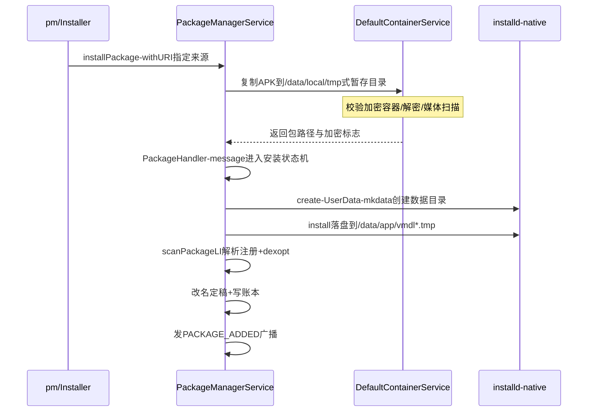

## 3.1 概述

PackageManagerService（PMS）掌管整个系统的"包世界"：APK 的安装、卸载、更新、权限授予、组件查询，都由它负责。所有应用里的 `PackageManager` API，最终都是跨 Binder 调用到 system_server 里的 PMS。

本章基于 Android 4.0 源码按概念重写（标注"概念简化"处），与原书可能有出入；小节编号为笔记整理时重建。

## 3.2 APK 安装全过程

### 3.2.1 包世界的目录版图

先建立空间感——PMS 管辖的几个目录：

| 目录 | 内容 | 特点 |
|---|---|---|
| `/system/app`、`/system/framework` | 预装应用与框架资源包 | 只读，出厂固化 |
| `/vendor/app` | 厂商预装 | 只读 |
| `/data/app` | 用户安装的普通应用 | 可写，升级/卸载发生在这里 |
| `/data/app-private` | 前向加密(Forward Locking)应用 | 付费内容保护的产物 |
| `/data/data/<pkg>` | 各应用私有数据目录 | installd 创建，UID 隔离 |
| `/data/system/packages.xml` | 包信息持久化快照 | PMS 的"账本" |

### 3.2.2 开机扫描：PMS 的诞生

PMS 在 system_server 启动早期被创建（`PackageManagerService.main`），构造函数就是第一次"全量盘点"（概念骨架）：

```java
// PackageManagerService 构造流程（概念简化）
// 1. 读上次的账本
mSettings.readLPw();                 // /data/system/packages.xml + packages-backup.xml
// 2. 扫描各目录（顺序有讲究：先priv-system，再system，再data）
scanDirLI(mFrameworkDir, ...);
scanDirLI(mSystemAppDir, ...);       // /system/app
scanDirLI(mVendorAppDir, ...);       // /vendor/app
scanDirLI(mAppInstallDir, 0, 0);     // /data/app
scanDirLI(mDrmAppPrivateInstallDir, ...);
// 3. 授权：对照账本给每个包补发权限
updatePermissionsLPw(null, null, true);
// 4. 写回账本
mSettings.writeLPw();
```

**账本（packages.xml）记录什么**：每个已装包的 userId、`sharedUserId`、签名、申请并获授的权限、首选 Activity（preferred activities）、序列号。开机时先读旧账本，扫描时逐包比对：

- APK 还在且签名一致 → 沿用旧 userId（应用数据无感）
- APK 不见了 → 标记残留，清理其数据目录与权限
- 新面孔 → 分配新 userId（从 10000 起）

先写 `packages-backup.xml` 再写正式文件的原子策略，保证写一半断电不至于账本损坏——系统服务持久化的标准防备。

### 3.2.3 scanPackageLI：一个 APK 如何变成 Package

对每个 APK 文件：

**第 1 步：`PackageParser` 解析 manifest。** 解码 `AndroidManifest.xml`（AXML 二进制格式），得到 `Package` 对象：`activities`、`receivers`、`services`、`providers`、`permissionGroups`、`requestedPermissions`、签名（`collectCertificates` 验读 APK 签名块）。这一步产出 PMS 内存索引的原材料。

**第 2 步：分配 userId。**

- 普通新包：`userId = firstAvailableUid(10000+)`
- 声明 `sharedUserId`（如 `android.uid.system`）的包：与同组共享 UID，但**要求签名一致**——framework-res、Settings 声明同一 sharedUserId 才能互访内部数据，这是 4.0 时代系统内置应用协作的主要手段（也是后来被废弃的机制，见 3.5）

**第 3 步：签名与版本校验。** 升级安装必须签名一致，否则 `INSTALL_FAILED_UPDATE_INCOMPATIBLE`；版本号回退被拒绝。签名在这里不是安全装饰，而是"包身份"的定义。

**第 4 步：注册进内存索引。**

```java
mPackages.put(pkg.packageName, pkg);       // 包名 → Package
mActivities.addAll(pkg.activities);        // 组件索引：Intent匹配用
mReceivers.addAll(pkg.receivers);
mServices.addAll(pkg.services);
mProviders.addAll(pkg.providers);
```

**每个 App 的 Linux UID 就是 PMS 分配的**（`uid = userId + 10000`），这是 Android 沙箱的基石：数据目录属主、binder 调用方身份（`Binder.getCallingUid()`）、权限检查全部锚定在这个 UID 上。

### 3.2.4 普通安装流程：四步走

以 `adb install` 为例（`pm` 命令 → `PackageManager` 代理 → PMS）：



四个设计点展开：

- **复制与解析分离**：`DefaultContainerService`（运行在独立进程 `com.android.defcontainer`）负责把 APK 从来源（网络、sdcard、加密容器）复制到内部存储。为什么独立进程？因为 mount/解密环境与 system_server 不同，且复制是重 IO，隔离后不拖累主服务
- **安装状态机**：`installPackage` 只是往 `mHandler` 发消息（`INIT_COPY` → `MCS_BOUND` → `START_CLEANING` → …），真正的流程在 Handler 消息里推进——**安装耗时几分钟也不阻塞调用方的 binder 线程**，这是系统服务"入口轻、干活异步"的典型设计
- **真正落盘靠 installd**：PMS 通过 socket（`/dev/socket/installd`）指挥 native 守护进程 installd 执行 `mkdir`/`chown`（到具体 UID）/`dexopt` 等——跨 mount 命名空间与权限边界的活派给 native 侧
- **广播收尾**：`ACTION_PACKAGE_ADDED`（带 `EXTRA_REPLACING` 区分升级）、`PACKAGE_REMOVED`——桌面图标刷新、备份软件、widget 宿主都靠它

### 3.2.5 dexopt：安装时的字节码优化

安装最后一步是 **dexopt**：dalvik 虚拟机把 `.dex` 优化为 `.odex`，落在 `/data/dalvik-cache/<path>@apk@classes.dex`。作用：

- 把校验（verify）与部分优化（字节码重排、内联提示）提前做掉，每次启动 App 不必重复
- 代价是首次安装变慢、占双份空间——`dex2oat` 时代这个权衡被重新设计（见 3.5）

预装应用的开机扫描也会触发 dexopt，这是冷启动慢的主因之一（`dalvik.vm.dexopt-flags` 等系统属性就是那时的调优旋钮）。

## 3.3 权限管理

### 3.3.1 权限的三级体系与授予时机

权限按保护级别分三级：

| 级别 | 授予时机 | 例子 |
|---|---|---|
| normal | 安装时自动授予 | `INTERNET`、`VIBRATE` |
| dangerous | **4.0 时代也在安装时授予**（用户只有装/不装的投票权） | `READ_CONTACTS`、`CAMERA` |
| signature | 仅当申请方与定义方签名相同才授予 | `BIND_DEVICE_ADMIN` |

PMS 解析时的授予流程（概念简化）：

```java
// updatePermissionsLPw 对每个包的每个requestedPermission
PermissionInfo pi = mPermissions.get(name);
switch (pi.protectionLevel) {
    case PROTECTION_NORMAL: grant(); break;
    case PROTECTION_DANGEROUS: grant(); break;      // 4.0：直接给
    case PROTECTION_SIGNATURE:
        if (haveSignature(pkg, pi)) grant();        // 签名比对
        else deny();
}
```

### 3.3.2 检查发生在哪

权限检查不是"一次性的"，而是分布在每个敏感调用点上：

- `Context.checkPermission(perm, pid, uid)` / `Context.enforcePermission`：查 PMS 维护的授予表（`Settings` 里的 `PermissionState`）
- Binder 服务端惯用 `checkCallingPermission`（以 `Binder.getCallingPid/Uid` 为准）——**永远信 calling 身份，不信参数里自称的身份**
- App 内 API 层面：`checkCallingOrSelfPermission` 合并检查自己与调用者（ContentProvider 场景常见）

### 3.3.3 自定义权限与权限组

- App 可 `<permission>` 定义权限并声明 `protectionLevel`；`<permission-group>` 归组（设置界面的分类展示）
- `<permission-tree name="com.example.perms">` 声明命名空间后，可用 `PackageManager.addPermission` 在运行时往这棵树上挂新权限——系统内部（如输入法、壁纸权限）大量使用

## 3.4 查询与组件解析

`PackageManager` 的查询族 API 全部基于 PMS 内存索引：

- `queryIntentActivities(intent, flags)`：隐式 Intent 匹配。遍历 `mActivities`，用 `IntentFilter.match(action/category/scheme/data)` 打分；`resolveActivity` 取最佳（`BEST_MATCH`）
- `queryContentProviders(processName, uid, ...)`、`queryServices`、`queryPermission...`：按名/按 UID 的反查
- `getPackageInfo`/`getApplicationInfo`：包元信息（版本号、签名、安装时间）

**性能认知**：装几百个应用后，mPackages 一棵对象树 + 组件索引相当庞大（数十 MB 级），每次开机扫描的 IO + 解析也是启动时间大头——这两点是后来 PMS 多轮改造（权限索引外移、并行扫描、增量解析）的直接动因。

## 3.5 后续演进：4.0 机制 vs 现代 Android

PMS 在 2012 年后经历了四大方向改造：权限动态化、安装加速、模块化（APEX）、查询收紧。逐项对比：

| 维度 | Android 4.0（原书） | 现代 Android（12~15） | 展开说明 |
|---|---|---|---|
| dangerous 权限 | 安装时一次性授予 | 运行时弹窗授予（6.0），可撤销/仅此一次 | `requestPermissions` 流程由 `PermissionController`（独立模块）渲染授权 UI；授权状态迁到独立的 `PermissionManagerService`（Android 10 从 PMS 拆出）；`AppOps` 提供更细的运行时开关（即使授权了也可禁后台定位）。开发者心智从"manifest 声明完事"变为"申请 + 处理拒绝 + 解释"三段式 |
| dexopt | dalvik → odex | ART：dex2oat，AOT/JIT/Profile 混合 | Android 5.0 起 ART 全面替代 dalvik：先全量 AOT（安装慢），7.0 改 JIT + 后台按 profile 增量 AOT，`ProfileGuided` 让常跑路径优化、冷路径不浪费编译时间；产物在 `/data/app/*/oat/` 下的 `.odex`/`.art` |
| 安装速度 | 全量复制 + 全量 dexopt | 流式安装（9.0）、**增量安装**（12.0，Incremental APK） | Incremental install：APK 按 block 惰性从市场流过来，装完即启动、缺块按需拉取（基于 fs-verity 签名的 block 校验）；`adb install --incremental`。A/B 无缝更新（8.0）把"升级要停机"变成后台装好重启切换 |
| 包格式 | APK v1 签名（JAR 签名） | APK Signature Scheme v2/v3/v4 + fs-verity | v2 覆盖整包字节（防 zip 条目篡改）、v3 带密钥轮换、v4 配合 fs-verity 支持增量安装的按块验证；installd 承担 fs-verity setup |
| sharedUserId | 系统应用协作主流手段 | 弃用（Q 起限制新声明） | 共享 UID 使一组应用的更新互相锁死（任何一个签名变化全组报废），运维灾难；新方案是私有 IPC + 签名权限 |
| 模块化 | 无 | **APEX**（10.0）+ Mainline | 新包格式 APEX 可更新系统模块（Conscrypt、MediaProvider、PermissionController…）；`ApexManager` 从 PMS 分出。原书"系统组件只能 OTA"的世界已部分变成"像 App 一样走商店更新" |
| 查询可见性 | 任何 App 可列出全部包 | `<queries>` 声明制（11.0） | `getInstalledPackages`/`queryIntentActivities` 默认只返回可见包（自身、同签名、显式 `<queries>` 声明、特定 Intent 交互过的），遏制设备指纹追踪 |
| 账本 | packages.xml 单文件 | packages.xml 保留，权限等外移多文件 | 结构化为 packages.xml + permission 相关多个 xml；`backup` 原子写策略延续 |

**不变的部分**值得单独记：scanPackageLI 的"解析 manifest → 校验签名 → 分配/比对 UID → 注册索引 → 发广播"五步骨架、installd 分工、"信 calling UID 不信自称身份"的检查原则，到 Android 15 依然是这个形状——原书第 4 章的阅读价值主要在这条主线上。
