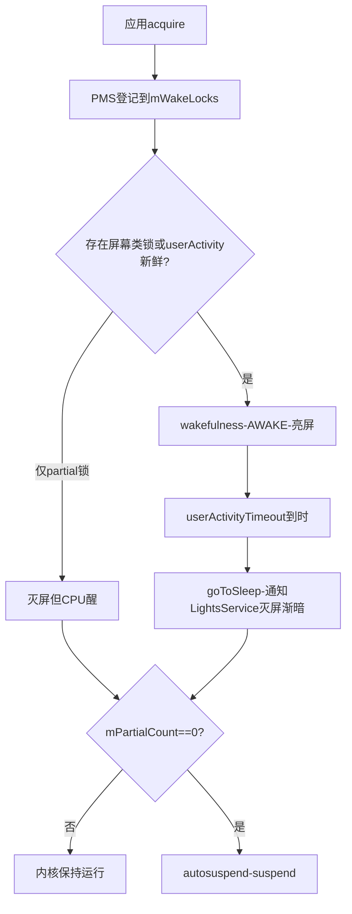

## 4.1 概述

PowerManagerService（电源管理，注意与 PackageManagerService 缩写撞车）掌管系统的电源状态：亮灭屏、休眠唤醒、WakeLock、按键电源处理与电池统计。它是"耗电"这一用户痛点的系统侧答案，也是应用开发者与系统机制摩擦最多的地方。

本章基于 Android 4.0 源码按概念重写（标注"概念简化"处），与原书可能有出入；小节编号为笔记整理时重建。

## 4.2 WakeLock 机制

### 4.2.1 为什么需要 WakeLock

Linux 系统无负载时进入 suspend（挂起，CPU 停止执行、内存自刷新维持）。但手机上有大量"屏幕关闭也要干活"的需求：放音乐、后台下载、VoIP 通话保持。WakeLock 就是阻止系统休眠的引用计数机制：

- **持有 WakeLock → 系统保持运行**（或仅允许部分部件休眠）
- 所有 WakeLock 释放 → 内核 autosuspend 线程允许触发，系统 suspend

直观模型：把"系统醒着"看作一个资源，WakeLock 是一个个引用，引用计数归零才允许睡。这是典型的"谁需要谁申请"的分布式责任制。

### 4.2.2 使用接口与锁类型

```java
PowerManager pm = (PowerManager) getSystemService(POWER_SERVICE);
PowerManager.WakeLock wl = pm.newWakeLock(
        PowerManager.PARTIAL_WAKE_LOCK, "MyApp:MyTag");
wl.setReferenceCounted(false);   // 默认true：acquire/release需配对计数
wl.acquire();                    // 持锁，CPU保持唤醒
wl.acquire(60_000);              // 带超时的重载，防漏释放
wl.release();                    // 必须释放，否则耗电
```

WakeLock 类型（4.0 全集）：

| 类型 | CPU | 屏幕 | 键盘背光 | 现状 |
|---|---|---|---|---|
| PARTIAL_WAKE_LOCK | 开 | 关 | 关 | 唯一存活 |
| SCREEN_DIM_WAKE_LOCK | 开 | 暗 | 关 | 已废弃 |
| SCREEN_BRIGHT_WAKE_LOCK | 开 | 亮 | 亮/关 | 已废弃 |
| FULL_WAKE_LOCK | 开 | 亮 | 亮 | 已废弃 |
| ACQUIRE_CAUSES_WAKEUP | flag：acquire时强制亮屏 | — | — | 供通知点亮类场景 |
| ON_AFTER_RELEASE | flag：释放时重置灭屏计时 | — | — | 配合按键类交互 |

带屏幕的锁废弃后，正道是 View 层 `FLAG_KEEP_SCREEN_ON`（`getWindow().addFlags` 或布局 `android:keepScreenOn`）——它把"保亮"与"可见窗口"生命周期绑定，窗口走人就自动撤，比应用自己管锁可靠得多。

### 4.2.3 PowerManagerService 内部实现

PMS 的核心是 wakefulness 状态机 + WakeLock 引用计数管理（概念骨架）：

```java
// PMS 关键路径（概念简化）
public void acquireWakeLock(IBinder token, int flags, String tag, WorkSource ws) {
    // 权限检查：WAKE_LOCK为normal级；PARTIAL之外需DEVICE_POWER签名级
    synchronized (mLocks) {
        WakeLock wl = new WakeLock(token, flags, tag, uid, pid, ws);
        mWakeLocks.add(wl);                 // 登记UID/PID/tag
        applyWakeLockFlagsOnAcquireLocked(); // ACQUIRE_CAUSES_WAKEUP处理
        updatePowerStateLocked();           // 重算电源状态
    }
}
```

状态机全景：



展开几个关键函数：

- **`userActivity(when, eventType, flags)`**：任何触摸/按键最终都会经 InputDispatcher 的策略回调走到这里，把"最后活动时间"刷新，灭屏倒计时清零重算。`eventType`（KEY/TOUCH/OTHER）与 flags（如 `FLAG_WAKE_LOCK` 相关位）决定是否顺带唤醒
- **`updatePowerStateLocked`**：PMS 的"总账函数"——汇总 WakeLock 计数、userActivity 新鲜度、boot 流程状态，决定 wakefulness 目标态并驱动 LightsService（背光渐变）、通知 native（`setPowerState`）执行
- **autosuspend 的判定**：灭屏后是否 suspend 取决于是否还有 partial 锁持有者（`mPartialCount > 0` 则向内核写 on 阻止 autosuspend）。原书在此详细分析了 `/sys/power/state` 与 early suspend（早挂起：先挂起部分外设）机制——4.0 内核的 early suspend 后来在 mainline 化中被 wakelock events + autosuspend 取代

**排查视角**：每个 WakeLock 登记 UID/PID/tag，`dumpsys power` 的 `mWakeLocks` 段完整可见。**Lock 漏释放是后台耗电的头号元凶**：典型是 Service 里 acquire 后异常路径没 release、或者 `setReferenceCounted(true)` 下 acquire/release 不配对。Battery Historian（见 4.5）把 wakelock held 时长画在时间轴上一目了然。

### 4.2.4 系统内部的隐式持锁路径

除了应用显式 `newWakeLock`，要认识几个系统级隐式锁，读代码/排查时才不迷惑：

- `MediaPlayer.setWakeMode(context, PARTIAL_WAKE_LOCK)`：播放期间代持
- `AlarmManager` 精确闹钟触发时：短暂持锁让 onReceive 跑完（`mPendingNonWakeupAlarms` 处理链）
- `ViewRootImpl` 的 `FLAG_KEEP_SCREEN_ON`：向 PMS 申请屏幕亮锁（绑定窗口可见性）
- 来电/闹钟响铃：Ringer/InCallUI 持 ACQUIRE_CAUSES_WAKEUP 锁直接点亮

## 4.3 Power 按键处理

### 4.3.1 按键从内核到策略层

电源键的处理链路（4.0）：


两层拦截的分工：

- **interceptKeyBeforeQueueing**（入队前，同步调用）：策略层在此直接改 event 标志（`FLAG_PASS_TO_USER` 等）。POWER 键在这里被截走：亮屏态短按 → `goToSleep()`；灭屏态短按 → `wakeUp()`。因为同步发生在 InputReader 线程，策略必须快
- **interceptKeyBeforeDispatching**（分发前）：兜底处理，如部分窗口遮盖时的键位抢占

**长按电源**：PWMS 启动一个长按计时（`mPowerLongPressThread` 式），到时弹出关机/静音选择对话框（`mLongPressOnPowerBehavior` 配置为直接关机或对话框）。连续短按的处理（误触防抖、双击截屏类特性）也在此层。

### 4.3.2 与 Keyguard 的联动

灭屏不是"只关背光"：`goToSleep` 会同步通知 `KeyguardViewMediator` 上锁（若安全锁启用），唤醒路径则是 `wakeUp` → 亮屏 → Keyguard 绘制 → 解锁后才轮到应用窗口。电源状态（PMS）与锁屏状态（Keyguard/Later 的 KeyguardService）是两个独立状态机的协同，中间靠 `ScreenOnListener`/`onScreenOnComplete` 之类的回调缝合——很多"亮屏闪一下锁屏"的 bug 都出在这条缝合线上。

## 4.4 BatteryStatsService 与 BatteryService

### 4.4.1 BatteryService：电池状态播报员

职责单一：监听内核、广播状态。

- 数据源：`/sys/class/power_supply/<name>/` 下的属性（capacity、voltage_now、temp、status）与 uevent（`power_supply` 子系统的 netlink 事件）
- 触发广播的规则：电量变化超过阈值（约 1%）、充电状态切换、温度越限；`ACTION_BATTERY_CHANGED` 以 **sticky broadcast** 发出——后注册的 receiver 也能立刻拿到最新值
- 临界水位（默认 15% 以下）发 `ACTION_BATTERY_LOW`，恢复发 `ACTION_BATTERY_OKAY`；耗尽关机流程（shutdown）也在此启动
- 应用侧接口：`BatteryManager` 常量 + sticky broadcast 的 `intent.getIntExtra(BatteryManager.EXTRA_LEVEL, -1)`

### 4.4.2 BatteryStatsService：耗电审计师

**BatteryStats 的职责是回答"电都去哪了"**，按 UID 维度记账：

| 记账维度 | 内容 |
|---|---|
| wakelock | 各 tag 的 full/partial 持有时长 |
| 进程 CPU | 前台/后台 CPU 时间、启动次数 |
| 网络 | 移动数据/Wi-Fi 收发字节数与包数 |
| 传感器 | GPS、加速度计等各传感器使用时长 |
| 活动 | wake-up 次数（alarm/通知唤起）、屏幕状态分桶 |

设计要点：

- **数据分桶**：realtime（当前屏幕态）/ since boot（开机以来）/ since charged（上次充满以来）——"since charged"是评估"这次放电周期谁费电"的口径
- **持久化**：定期与充放电切换时序列化到 `/data/system/batterystats.bin`（Java ObjectOutputStream 格式），重开机不丢账
- **低开销原则**：记账发生在各系统服务的热点路径上（wakelock acquire、CPU 调度切换），实现上大量用原子计数与稀疏数组，避免审计本身成为耗电项
- **消费方式**：`dumpsys batterystats [--charged] [<pkg>]` 输出文本报告；4.0 时代的分析就是人肉读这份输出——"App X partial wakelock held 3h"级别的定位

## 4.5 后续演进：4.0 机制 vs 现代 Android

电源管理是 Android 演进史上"每代都动刀"的领域，方向是**从"应用自律"转向"系统强制调度"**。逐项对比：

| 维度 | Android 4.0（原书） | 现代 Android（12~15） | 展开说明 |
|---|---|---|---|
| 省电哲学 | 应用自己持 WakeLock 干活 | 系统统一调度（Doze/App Standby/JobScheduler） | Android 5.0 Project Volta 引入 JobScheduler：把"持锁干活"改成"申报约束（充电中/不计量网络/空闲），系统择机批量执行"；6.0 **Doze**：设备静止+离屏+未充电时进入 deep idle，网络/Job/alarm 全部推迟，周期性开"维护窗口"放行积压任务；**App Standby** 对"用户 N 天未碰"的应用同等限制。开发者须用 `setAndAllowWhileIdle`/`setExactAndAllowWhileIdle` 争取豁免窗口 |
| 电池统计格式 | Java 序列化 bin + 文本 dump | protobuf + Battery Historian 可视化 | `dumpsys batterystats --proto` 输出 pb；Google 开源 **Battery Historian**（Docker 部署）把 pb 画成时间轴：wakelock 条带、wakeups、信号强度、Doze 区间叠在一条时间线上，"谁在什么时刻持锁多久"一眼可见。原书人肉读文本的排查法已升级为图形化 |
| early suspend | 内核 early_suspend + autosuspend | wakelock 事件源 + autosuspend/mainline 化；Android 15 冻结优先 | 内核侧机制换血多次；应用可见语义不变：**没锁就睡** |
| 后台持锁 | 只要不漏 release 就一直有效 | 前台化要求 + 缓冲限制 | 后台 Service 本身受限（8.0），持 partial 锁的长活后台必须前台服务 + 常驻通知；Android 14 对"假前台服务"进一步收紧（FGS 类型声明制） |
| WakeLock API | 四种类型 | 仅 PARTIAL 存活；新增位置感知约束 | 屏幕类锁全废弃；PowerManager 新增 `isPowerSaveMode`/`isDeviceIdleMode` 查询、`PowerManager.WakeLock` 与 `ThreadedRenderer` 联动的渲染节能；Android 9 省电模式联动降分辨率/限后台摄像头 |
| 电源键策略 | PWMS 短按灭屏/长按关机 | 手势化：长按=助手、双击/挤压=相机或助手 | 厂商高度定制（Pixel 的 Active Edge、Assistant 键）；`interceptKeyBeforeQueueing` 的"入队前问策略"架构保留至今，是理解自定义按键行为的钥匙 |
| 状态机 | AWAKE/SLEEP 两态 | AWake/Dream/Dozing/Asleep + 多显示器 | wakefulness 扩展为多态，亮灭屏拆给 `DisplayPowerController`（背光渐变、色彩）与 `DisplayManagerService`（多屏/折叠屏），PMS 专注状态裁决；Always-On Display 是 Dozing 态的常驻渲染 |
| 电池硬件接口 | power_supply sysfs | 保留 sysfs + health HAL/AIDL 化 | BatteryService 逻辑不变，电池健康/充电路径经 `android.hardware.health` HAL 与 Charger RLSS；`BatteryManager` 新增 `BATTERY_PROPERTY_*` 查询（实际容量、充电次数） |

**给应用开发者的落脚点**：今天写"后台持续干活"的正确姿势是前台服务（用户知情）+ 部分场景 WorkManager 约束式调度，WakeLock 只在"系统调度粒度不够细"时短借短还；排查耗电用 Battery Historian 看 wakelock/wakeup 时间轴，而不是读 dumpsys 文本。
