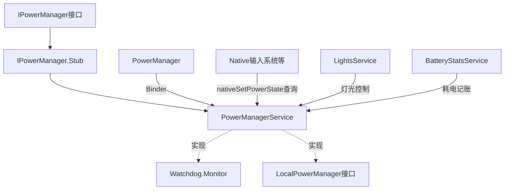
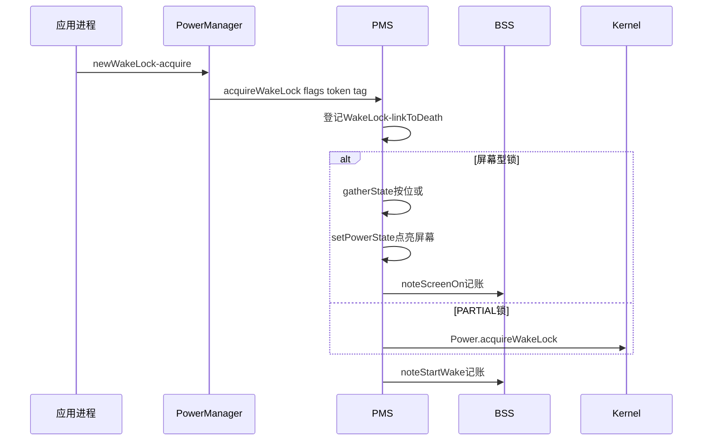
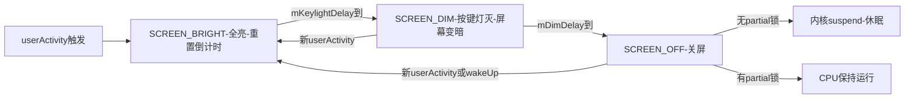
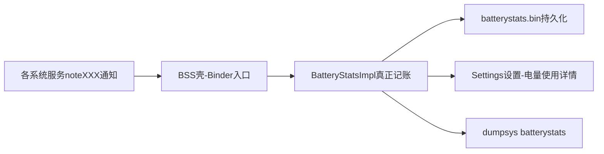

## 4.1 概述

PowerManagerService（电源管理服务，注意与 PackageManagerService 的缩写"撞车"，本章 PMS 特指前者）是 Android 电源管理的核心服务，负责**亮灭屏控制、WakeLock（唤醒锁）管理、userActivity（用户活动）计时、Power 按键休眠处理以及电池状态与耗电统计**。它是"耗电"这一用户痛点的系统侧答案，也是应用开发者与系统机制摩擦最多的地方。

原书第 5 章按**四条线**分析 PMS 及其伙伴服务：

1. **第一条线**：SystemServer 中 PMS 的创建、init、systemReady、BootComplete 四个关键调用点（4.2 节）
2. **第二条线**：WakeLock 机制——客户端 PowerManager 到服务端 PMS 的完整链路，以及 Power 类、LightsService 两个底层助手（4.3 节）
3. **第三条线**：userActivity 与屏幕 BRIGHT→DIM→OFF 状态切换、Power 按键处理（4.4 节）
4. **第四条线**：BatteryService（电池状态播报）与 BatteryStatsService（耗电统计，本章难点）（4.5 节）

### PMS 家族图谱



- PMS 由 **IPowerManager.Stub** 派生（Binder 服务端），同时实现 `Watchdog.Monitor`（看门狗监控）与 `LocalPowerManager` 接口（供同进程的 WMS、InputManager 等直接调用，免 Binder 开销）
- 客户端使用 **PowerManager** 类，内部持有 `IPowerManager` 的代理对象经 Binder 与 PMS 交互
- 本章涉及的核心源码文件：`PowerManagerService.java`、`PowerManager.java`、`Power.java`、`com_android_server_PowerManagerService.cpp`、`LightsService.java`、`com_android_server_LightsService.cpp`、`com_android_server_InputManager.cpp`、`BatteryService.java`、`com_android_server_BatteryService.cpp`、`BatteryStatsService.java`、`BatteryStatsImpl.java` 等

## 4.2 初识 PowerManagerService

PMS 由 SystemServer 的 ServerThread 线程创建，关键调用点如下：

```java
// SystemServer.java :: ServerThread 的 run 函数（节选）
power = new PowerManagerService();                       // ① 创建 PMS 对象
ServiceManager.addService(Context.POWER_SERVICE, power); // ② 注册到 ServiceManager
power.init(context, lights, ActivityManagerService.self(), battery); // ③ 初始化
......
power.systemReady();                                     // ④ 系统就绪
// ⑤ 收到 ACTION_BOOT_COMPLETED 广播后执行 bootCompleted（见 4.2.4）
```

### 4.2.1 PMS 构造函数分析

```java
// PowerManagerService.java :: 构造函数（骨架）
PowerManagerService() {
    MY_UID = Process.myUid();     // ① 记录 SystemServer 进程的 uid/pid，供后续判断使用
    MY_PID = Process.myPid();
    // ② 设置 lastUserActivity 超时时间为一周——该值并无业务含义，
    //    只是取一个足够大的数，避免内核提前"过期"该时间戳
    Power.setLastUserActivityTimeout(7 * 24 * 3600 * 1000L);
    mUserState = mPowerState = 0; // ③ 两个核心状态变量清零（含义见 4.3.4）
    // ④ 加入 Watchdog 监控：PMS 若被锁死，Watchdog 会重启系统
    Watchdog.getInstance().addMonitor(this);
}
```

构造函数非常简单，重头戏在 init。

### 4.2.2 init 分析

init 的工作分三个阶段。

#### 1. init 分析之一：保存服务引用

```java
// PowerManagerService.java :: init（之一，节选）
public void init(Context context, LightsService ls,
        IActivityManager activityManagerService,
        IBatteryService batteryService) {
    // 四个 Light 对象来自 LightsService，分别对应背光/按键灯/键盘灯/提示灯
    mLcdLight = ls.getLight(LightsService.LIGHT_ID_BACKLIGHT);
    mButtonLight = ls.getLight(LightsService.LIGHT_ID_BUTTONS);
    mKeyboardLight = ls.getLight(LightsService.LIGHT_ID_KEYBOARD);
    mAttentionLight = ls.getLight(LightsService.LIGHT_ID_ATTENTION);
    mContext = context;
    mActivityService = activityManagerService;  // 和 AMS 交互（wakingUp/goingToSleep）
    mBatteryService = batteryService;           // 获取电源状态（插拔、电量）
    mBatteryStats = BatteryStatsService.getService(); // 耗电统计
    nativeInit();                               // JNI 层初始化
    synchronized (mLocks) {
        updateNativePowerStateLocked();         // 更新 Native 层保存的电源状态
    }
}
```

nativeInit 在 JNI 层只做一件事——保存 PMS 对象的全局引用，供 Native 代码（如输入系统）回调 Java 方法使用：

```cpp
// com_android_server_PowerManagerService.cpp :: nativeInit（节选）
static void android_server_PowerManagerService_nativeInit(JNIEnv* env, jobject obj) {
    gPowerManagerServiceObj = env->NewGlobalRef(obj);
}
```

成员变量的分工：

| 成员 | 类型 | 用途 |
|---|---|---|
| mActivityService | IActivityManager | 亮灭屏时通知 AMS（`wakingUp`/`goingToSleep`），让它释放内部 WakeLock |
| mBatteryStats | IBatteryStats | 在亮屏、灭屏、userActivity 等节点"记账" |
| mBatteryService | IBatteryService | 查询是否插着电源（STAY_ON_WHILE_PLUGGED_IN 逻辑） |
| mLcdLight 等四个 | LightsService.Light | 经 LightsService 控制各种灯 |

#### 2. init 分析之二：两个工作线程与 initInThread

init 接着创建两个 HandlerThread：

```java
// PowerManagerService.java :: init（之二，节选）
mHandlerThread = new HandlerThread("PowerManagerService") {
    // PMS 的主工作线程：Looper 准备好后立刻执行 initInThread
    protected void onLooperPrepared() {
        super.onLooperPrepared();
        initInThread();
    }
};
// 关屏线程：负责关屏时的亮度渐暗动画（关屏不是"啪"地变黑，而是渐暗）
mScreenOffThread = new HandlerThread("PowerManagerService.mScreenOffThread");
mScreenOffThread.start();
mHandlerThread.start();
```

- **mHandlerThread**：PMS 的主工作线程，`mTimeoutTask`（灭屏倒计时）、`mNotificationTask`（亮灭屏广播）都在它的消息队列上执行
- **mScreenOffThread**：关屏时屏幕亮度渐暗过程的动画控制（4.4.1 节会看到 userActivity 如何打断这个动画）

initInThread 做三方面工作：

```java
// PowerManagerService.java :: initInThread（节选）
private void initInThread() {
    mH = new Handler();                       // 基于 mHandlerThread 的 Looper
    // ① 注册三个广播
    IntentFilter filter = new IntentFilter();
    filter.addAction(Intent.ACTION_BATTERY_CHANGED);   // 电池变化
    filter.addAction(Intent.ACTION_BOOT_COMPLETED);    // 开机完成
    filter.addAction(Intent.ACTION_DOCK_EVENT);        // 插拔底座
    mContext.registerReceiver(mReceiver, filter);
    // ② 读取配置参数（config.xml 与 Settings 数据库，见下表）
    // ③ 创建两个通知 Intent——注意都带 FLAG_RECEIVER_REGISTERED_ONLY，
    //    即只发给动态注册的接收者（manifest 静态接收者收不到 SCREEN_ON/OFF）
    mScreenOnIntent = new Intent(Intent.ACTION_SCREEN_ON);
    mScreenOnIntent.addFlags(Intent.FLAG_RECEIVER_REGISTERED_ONLY);
    mScreenOffIntent = new Intent(Intent.ACTION_SCREEN_OFF);
    mScreenOffIntent.addFlags(Intent.FLAG_RECEIVER_REGISTERED_ONLY);
    // ④ 创建 PMS 内部使用的 WakeLock（如发送亮灭屏广播时防止中途休眠的
    //    mBroadcastWakeLock），类型为 UnsynchronizedWakeLock——
    //    因为 PMS 的调用本身已处于 mLocks 锁保护下，内部无需再同步
    ...
}
```

initInThread 读取的配置参数（两部分来源）：

| 参数 | 来源 | 说明 |
|---|---|---|
| mAnimateScreenLights | config.xml | 关屏是否渐暗，默认 true |
| mUnplugTurnsOnScreen | config.xml | 拔 USB 时是否点亮屏幕 |
| mScreenBrightnessDim | config.xml | 变暗状态的最低亮度，默认 20 |
| mUseSoftwareAutoBrightness | config.xml | 是否用软件自动亮度，默认 false |
| mAutoBrightnessLevels 等 | config.xml | 软件自动亮度的分级参数 |
| STAY_ON_WHILE_PLUGGED_IN | Settings 数据库 | 插 USB/AC 时保持唤醒（开发者选项"不锁定屏幕"） |
| SCREEN_OFF_TIMEOUT | Settings 数据库 | 屏幕超时（15 秒/30 秒/1 分钟……） |
| DIM_SCREEN | Settings 数据库 | 是否允许变暗 |
| SCREEN_BRIGHTNESS_MODE | Settings 数据库 | 亮度模式（手动/自动） |

config.xml 参数编译期固定；Settings 数据库的参数通过 **ContentQueryMap + SettingsObserver** 监视，用户在设置里改屏幕超时能立即生效。

#### 3. init 分析之三：forceUserActivityLocked

init 末尾再次调用 nativeInit 与 updateNativePowerStateLocked（原书怀疑这里是代码瑕疵），最后强制触发一次 userActivity：

```java
// PowerManagerService.java :: forceUserActivityLocked（骨架）
private void forceUserActivityLocked() {
    if (mBootCompleted) {
        mUserActivityAllowed = true;    // 临时放开限制，为调用 userActivity 扫清障碍
        userActivity(SystemClock.uptimeMillis(), false);
        mUserActivityAllowed = false;   // 用完立刻恢复
    }
}
```

按 SDK 文档的说法，调用 userActivity 后手机将被唤醒，屏幕超时重新计算——init 用它保证开机后屏幕处于点亮状态。

#### 4. init 函数总结

| 阶段 | 工作 |
|---|---|
| 之一 | 保存四个 Light 对象及 AMS/BSS/BatteryService 引用；nativeInit 建立 JNI 全局引用 |
| 之二 | 创建 mHandlerThread（主工作线程）与 mScreenOffThread（渐暗线程）；initInThread 注册广播、读配置、创建通知 Intent 与内部 WakeLock |
| 之三 | 再次 nativeInit；forceUserActivityLocked 强制点亮屏幕 |

### 4.2.3 systemReady 分析

```java
// PowerManagerService.java :: systemReady（骨架）
public void systemReady() {
    synchronized (mLocks) {
        // ① 创建 SensorManager，注意 Looper 用的是 mHandlerThread 的
        mSensorManager = new SensorManager(mHandlerThread.getLooper());
        // 获取接近传感器（打电话时贴脸灭屏用）
        mProximitySensor = mSensorManager.getDefaultSensor(Sensor.TYPE_PROXIMITY);
        // 若启用软件自动亮度，再获取光传感器
        ...
        // ② 点亮屏幕和键盘灯——开机流程走到这里，屏幕、按键灯全部打开
        setPowerState(SCREEN_BRIGHT | SCREEN_BUTTON_BRIGHT);
        mDoneBooting = true;
        ...
        // ③ 通知 BSS：屏幕已开、当前亮度是多少（耗电统计从开机第一秒就开始）
        mBatteryStats.noteScreenBrightness(getScreenBrightnessMode()?...);
        mBatteryStats.noteScreenOn();
    }
}
```

一个有意思的细节：**SensorManager 的 Looper 用的是 PMS 自己的 mHandlerThread**——传感器事件回调不占用 SystemServer 主线程，也不需要再开线程。

### 4.2.4 BootComplete 处理

收到 ACTION_BOOT_COMPLETED 后（4.2.2 注册的 mReceiver）：

```java
// PowerManagerService.java :: bootCompleted（节选）
private void bootCompleted() {
    synchronized (mLocks) {
        mBootCompleted = true;
        userActivity(SystemClock.uptimeMillis(), false); // 再触发一次 userActivity
        updateWakeLockLocked();   // 关键：处理 STAY_ON_WHILE_PLUGGED_IN
    }
}
```

```java
// PowerManagerService.java :: updateWakeLockLocked（节选）
private final void updateWakeLockLocked() {
    // mStayOnConditions 来自 STAY_ON_WHILE_PLUGGED_IN 设置：
    // 若用户勾选了"插入时保持唤醒"且当前确实插着 USB/AC
    if (mStayOnConditions != 0 && mBatteryService.isPowered(mStayOnConditions)) {
        mStayOnWhilePluggedInScreenDimLock.acquire();
        mStayOnWhilePluggedInPartialLock.acquire();
    } else {
        // 否则释放，系统就可以在超时后正常进入休眠
        mStayOnWhilePluggedInScreenDimLock.release();
        mStayOnWhilePluggedInPartialLock.release();
    }
}
```

### 4.2.5 初识 PowerManagerService 总结

| 函数 | 工作 |
|---|---|
| 构造函数 | 记录 uid/pid；设置超时初值；加入 Watchdog |
| `init` | 保存服务与灯光引用；创建两个工作线程；initInThread 读配置、注册广播；强制触发一次 userActivity |
| `systemReady` | 初始化传感器；点亮屏幕；通知 BSS 开始记账 |
| `bootCompleted` | 再触发 userActivity；按"插入时保持唤醒"设置决定持锁或放行休眠 |

## 4.3 WakeLock 机制分析

### 4.3.1 WakeLock 客户端分析

Linux 在无负载时会进入 suspend（挂起：CPU 停止执行、内存靠自刷新维持）。但手机有大量"屏幕关闭也要干活"的需求——放音乐、后台下载、VoIP 通话。**WakeLock 就是阻止系统休眠的引用计数机制**：持有则系统保持运行（或部分部件保持运行），全部释放才允许内核 suspend。这是典型的"谁需要谁申请"的分布式责任制。

```java
// PowerManager.java :: newWakeLock 与 WakeLock.acquire（节选）
public WakeLock newWakeLock(int flags, String tag) {
    return new WakeLock(flags, tag);
}

public class WakeLock {
    WakeLock(int flags, String tag) {
        mFlags = flags;
        mTag = tag.toString();
        mToken = new Binder();   // 充当 Token：PMS 借此监视客户端生死
    }
    public void acquire() {
        synchronized (mToken) {
            acquireLocked();
        }
    }
    private void acquireLocked() {
        if (!mRefCounted || mCount++ == 0) {   // 引用计数控制：计数归零才真正申请
            mService.acquireWakeLock(mFlags, mToken, mTag, mWorkSource);
        }
    }
}
```

三个细节：

- **mToken 是一个 Binder 对象**。客户端进程死掉时，PMS 会收到死亡讣告并代为释放 WakeLock——这是防止"锁泄漏导致永远休眠不了"的最后防线
- **引用计数**：`setReferenceCounted(true)`（默认）时 acquire/release 需配对，计数归零才真正向 PMS 申请/释放；`setReferenceCounted(false)` 则一次 acquire 一把锁
- **WorkSource**：描述"这项工作是为谁做的"，便于耗电统计时把电费记到正确应用的头上（当时主要用于 ContentService 的 SyncManager 同步场景）

WakeLock 的 flags 类型（4.0 全集）：

| flags | CPU | Screen | Keyboard | 说明 |
|---|---|---|---|---|
| PARTIAL_WAKE_LOCK | On | Off | Off | 唯一不受电源键影响的锁（唯一存活至今） |
| SCREEN_DIM_WAKE_LOCK | On | Dim | Off | 已废弃 |
| SCREEN_BRIGHT_WAKE_LOCK | On | Bright | Off | 已废弃 |
| FULL_WAKE_LOCK | On | Bright | On | 已废弃 |
| ACQUIRE_CAUSES_WAKEUP | — | — | — | 附加标志：acquire 同时唤醒设备（通知点亮屏幕类场景） |
| ON_AFTER_RELEASE | — | — | — | 附加标志：释放后重置灭屏倒计时 |

### 4.3.2 PMS acquireWakeLock 分析

#### 1. acquireWakeLockLocked 分析之一：登记与 flags 转换

```java
// PowerManagerService.java :: acquireWakeLockLocked（之一，节选）
public void acquireWakeLock(IBinder token, int flags, String tag, WorkSource ws) {
    int uid = Binder.getCallingUid();
    int pid = Binder.getCallingPid();
    if (uid == MY_UID) {
        pid = 0;    // 来自 SystemServer 自身的锁，pid 记 0
    }
    ...
    synchronized (mLocks) {
        acquireWakeLockLocked(flags, token, uid, pid, tag, ws);
    }
}
```

PMS 内部用一个 **WakeLock 内部类**登记每把锁，它实现了 `IBinder.DeathRecipient`：

```java
// PowerManagerService.java :: 内部类 WakeLock（骨架）
private final class WakeLock implements IBinder.DeathRecipient {
    final int flags;        // 锁类型
    final String tag;       // 调用者给的标签（排查耗电时的关键线索）
    final IBinder token;    // 客户端传来的 Binder，一一对应
    final int uid;
    final int pid;
    WorkSource workSource;  // 电费记到谁头上
    int minState;           // 该锁对应的"最低电源状态"（由 flags 翻译而来）
    boolean activated;      // 是否活跃（goToSleep 时屏幕锁会被置 false）
    public void binderDied() {
        // 客户端进程死亡：代为释放，防止锁泄漏
        releaseWakeLock(this.token, 0, true);
    }
}
```

若 mLocks 中不存在该 token，则创建 WakeLock 并把 flags 翻译为 **minState**（该锁要求的最低电源状态）：

| flags | 翻译为 minState |
|---|---|
| FULL_WAKE_LOCK | ALL_BRIGHT（或 SCREEN_BRIGHT / SCREEN_BUTTON_BRIGHT，取决于键盘是否可见及自动亮度配置） |
| SCREEN_BRIGHT_WAKE_LOCK | SCREEN_BRIGHT |
| SCREEN_DIM_WAKE_LOCK | SCREEN_DIM |
| PARTIAL_WAKE_LOCK / PROXIMITY_SCREEN_OFF_WAKE_LOCK | 不参与屏幕状态（无 minState） |

#### 2. acquireWakeLockLocked 分析之二：gatherState、setPowerState、sendNotificationLocked

对屏幕型锁（isScreenLock 为真），核心三步：

```java
// PowerManagerService.java :: acquireWakeLockLocked（之二，节选）
// PROXIMITY 型单独走 mProximityWakeLockCount 引用计数与接近传感器逻辑，
// 其余屏幕型锁：
mUserState = mPowerState & LIGHTS_MASK;   // 保存用户状态中的灯光部分
// ① gatherState：把所有活跃屏幕锁的 minState 做"或"运算
// ② mWakeLockState = (mUserState | mWakeLockState) & mLocks.gatherState();
mWakeLockState = mLocks.gatherState();    // 重算 WakeLock 侧目标状态
// ③ 汇总用户状态与锁状态，驱动电源状态
setPowerState(mWakeLockState | mUserState);
```

**gatherState——所有活跃锁状态的"或"**：

```java
// PowerManagerService.java :: 内部类 WakeLockList :: gatherState（节选）
int gatherState() {
    int result = 0;
    final int N = size();
    for (int i = 0; i < N; i++) {
        WakeLock wl = get(i);
        if (wl.activated && isScreenLock(wl.flags)) {
            result |= wl.minState;   // SCREEN_DIM 与 SCREEN_BRIGHT 共存时取并集（更亮的赢）
        }
    }
    return result;
}
```

**setPowerState——PMS 状态机的总账函数**（骨架，按序执行这些判定）：

```java
// PowerManagerService.java :: setPowerState（骨架）
private void setPowerState(int newState) {
    // ① 接近传感器激活时不允许亮屏（贴脸状态下强制去掉 BRIGHT 位）
    if (mProximitySensorActive) newState = (newState & ~SCREEN_BRIGHT);
    // ② 电量低时加上 BATTERY_LOW_BIT（低电时降低亮度）
    if (mBatteryLevel < mBatteryLowThreshold) newState |= BATTERY_LOW_BIT;
    // ③ 系统未启动完成则强制全亮——解释了开机时键盘、屏幕全亮一会儿的现象
    if (!mSystemReady) newState |= ALL_BRIGHT;
    // ④ 屏幕开关切换判定
    if (oldScreenOn != newScreenOn) {
        if (newScreenOn) {
            // 开屏：真正点亮，并通知 BSS 记账；
            // 若 mPreventScreenOn 为 true 则暂不点亮（防闪屏，见下）
            setScreenStateLocked(true);
            mBatteryStats.noteScreenOn();
        } else {
            // 关屏：取消自动亮度任务、通知 BSS、更新 Native 状态
            ...
            mBatteryStats.noteScreenOff();
            updateNativePowerStateLocked();
        }
    } else {
        // 屏幕开关状态没变，只是灯光状态变化：只更新灯光
        updateLightsLocked(newState, 0);
    }
}
```

**mPreventScreenOn 防闪屏**：应用切换/来电时，若先把屏幕点亮再等新界面画好，用户会看到上一界面"闪一下"。窗口端可调用 `preventScreenOn(true)` 让 PMS 压住亮屏；若应用 5 秒内未恢复，PMS 自行置 false 防止屏幕永远黑着。

**sendNotificationLocked——亮灭屏通知的队列优化**：

```java
// PowerManagerService.java :: sendNotificationLocked（节选）
// mBroadcastQueue 是 3 个元素的 int 数组，存放待广播的屏幕状态（1=ON，0=OFF）
private void sendNotificationLocked(boolean on, int why) {
    ...
    if (index == 2) {
        // 0、1、2 三个槽位都已占满：由于 ON/OFF 是配对出现的，
        // 前两个必然互相抵消，去掉它们只处理最后一次，节省一次无谓的亮灭屏切换
        mBroadcastQueue[1] = -1;
        mBroadcastQueue[2] = -1;
    }
    ...
    mHandler.post(mNotificationTask);   // 抛给主工作线程执行
}
```

**mNotificationTask——真正发送通知**：

```java
// PowerManagerService.java :: mNotificationTask（骨架）
private final Runnable mNotificationTask = new Runnable() {
    public void run() {
        while (true) {
            int value;  // 从 mBroadcastQueue 取出一个待处理项
            ...
            if (value == 1) {   // 亮屏通知
                policy.screenTurningOn(mScreenOnListener); // 通知 WMS/锁屏策略
                ActivityManagerNative.getDefault().wakingUp(); // 通知 AMS
                mScreenOnIntent 发送 ACTION_SCREEN_ON 有序广播（持 mBroadcastWakeLock）
            } else if (value == 0) {  // 灭屏通知
                policy.screenTurnedOff(why);               // 通知 WMS/锁屏策略
                ActivityManagerNative.getDefault().goingToSleep(); // 通知 AMS
                mScreenOffIntent 发送 ACTION_SCREEN_OFF 有序广播
            }
        }
    }
};
```

通知 WMS 与 AMS 的目的是**让它们释放各自持有的内部 WakeLock**——AMS 在动画、旋转屏等过程中会持锁，灭屏通知到来时必须放行，否则系统休眠不了。`policy.screenTurningOn` 与锁屏的交互也是"亮屏闪一下锁屏"类 bug 的多发地：PMS 的电源状态与 Keyguard 的锁屏状态是两个独立状态机，靠 `ScreenOnListener` 回调缝合。

#### 3. acquireWakeLockLocked 分析之三：PARTIAL 锁走内核

```java
// PowerManagerService.java :: acquireWakeLockLocked（之三，节选）
// PARTIAL 型锁：直接申请内核 WakeLock——即使 Java 世界全部入睡，
// 内核 wakelock 也能阻止底层 suspend
if (uid == MY_UID || pid == 0 || ...) {
    // 系统进程的锁直接走内核
    Power.acquireWakeLock(Power.PARTIAL_WAKE_LOCK, PARTIAL_NAME);
}
...
// 最后通知 BSS 记账（哪个 uid 的什么锁开始持有）
mBatteryStats.noteStartWake(uid, pid, name, type, ...);
```

全链路时序：



#### 4. acquireWakeLock 总结

| 环节 | 关键点 |
|---|---|
| 客户端 | token（Binder 对象）标识身份；引用计数控制配对 |
| 服务端登记 | linkToDeath 防客户端死亡导致锁泄漏 |
| flags → minState | FULL→ALL_BRIGHT、SCREEN_BRIGHT→SCREEN_BRIGHT、SCREEN_DIM→SCREEN_DIM |
| 屏幕型锁 | gatherState 汇总 → setPowerState 驱动屏幕与灯光 → 通知 WMS/AMS/广播 |
| PARTIAL 锁 | 直接向内核申请 wakelock；灭屏不休眠就靠它 |

**排查视角**：每把锁登记了 uid/pid/tag，`dumpsys power` 完整可见。**WakeLock 漏释放是后台耗电的头号元凶**——典型是 Service 里 acquire 后异常路径没 release，或引用计数模式下 acquire/release 不配对。系统侧也有隐式持锁路径：`MediaPlayer.setWakeMode` 播放期间代持、AlarmManager 闹钟触发时短暂持锁（`mPendingNonWakeupAlarms` 处理链）、ViewRootImpl 的 `FLAG_KEEP_SCREEN_ON`（绑定窗口可见性，窗口走人自动撤）、来电响铃持 ACQUIRE_CAUSES_WAKEUP 锁点亮屏幕。

### 4.3.3 Power 类及 LightsService 类介绍

PMS 操作屏幕和灯最终要落到这两位身上。

#### Power 类：与内核交互的 JNI 桥

```java
// Power.java 提供的接口（4.0 全集）
public static native boolean setScreenState(boolean on);       // 开关屏幕背光
public static native void setLastUserActivityTimeout(...);     // 设置活动超时
public static native void acquireWakeLock(int lockId, String id); // 申请内核锁
public static native void releaseWakeLock(String id);          // 释放内核锁
public static native void reboot(String reason);               // 重启
```

```cpp
// com_android_server_PowerManagerService.cpp（节选）
static void android_server_PowerManagerService_acquireWakeLock(
        JNIEnv* env, jobject clazz, jint lockId, jstring id) {
    ...
    acquire_wake_lock(lockId, str);   // 与内核 wakelock 机制交互
}
static jint android_server_PowerManagerService_setScreenState(
        JNIEnv* env, jobject clazz, jint on) {
    return set_screen_state(on);      // 写 /sys/power/state 或经 framebuffer 关背光
}
```

另外，`updateNativePowerStateLocked → nativeSetPowerState` 只是在 JNI 层更新 **gScreenOn、gScreenBright 两个全局变量**——原书特别强调它"和 Kernel 压根儿没有关系"，纯粹供 Native 层（输入系统、动画等）查询屏幕状态用。

#### LightsService：8 种灯的 HAL 封装

```cpp
// com_android_server_LightsService.cpp（节选）
static void init_native(JNIEnv* env, jobject clazz) {
    // 加载 "lights" HAL 模块（各厂商实现，如 lights.msm8660.so）
    hw_module_t const* module;
    hw_get_module(LIGHTS_HARDWARE_MODULE_ID, &module);
    // 打开 8 种灯对应的设备：BACKLIGHT（背光）、KEYBOARD、BUTTONS、
    // BATTERY、NOTIFICATIONS、ATTENTION、BLUETOOTH、WIFI
    devices->lights[LIGHT_INDEX_BACKLIGHT] = get_device(module, LIGHT_ID_BACKLIGHT);
    ...
}
static void setLight_native(JNIEnv* env, jobject clazz, jint light,
        jint colorARGB, jint flashMode, jint onMS, jint offMS, jint brightnessMode) {
    light_state_t state;
    state.color = colorARGB;        // 颜色（RGB）
    state.flashMode = flashMode;    // 闪烁模式
    state.flashOnMS = onMS;         // 闪烁亮/灭时长
    state.flashOffMS = offMS;
    state.brightnessMode = brightnessMode;  // 手动/自动亮度
    devices->lights[light]->set_light(devices->lights[light], &state);  // 调 HAL
}
```

PMS 的渐暗关屏（mScreenOffThread）就是靠不断调小 LIGHT_INDEX_BACKLIGHT 的 brightness 实现的；BatteryService 的低电红/绿 LED 提示走 LIGHT_INDEX_BATTERY。

### 4.3.4 WakeLock 机制总结：mUserState 与 mWakeLockState

PMS 的电源状态由两个变量按位"或"共同决定，这是全章的提纲：

| 变量 | 含义 | 驱动者 |
|---|---|---|
| **mUserState** | **用户触发事件导致的电源状态**（按键、触摸点亮屏幕） | userActivity（4.4.1） |
| **mWakeLockState** | **所有活跃 WakeLock 要求的电源状态**（gatherState 汇总） | acquire/releaseWakeLock、goToSleep |
| mPowerState | 实际生效的电源状态 = 上述两者的按位或 | setPowerState 统一裁决 |

涉及的电源状态常量（位掩码）：

| 常量 | 含义 |
|---|---|
| SCREEN_ON_BIT | 屏幕开关位 |
| SCREEN_BRIGHT / SCREEN_DIM | 屏幕亮/暗 |
| SCREEN_BUTTON_BRIGHT | 按键灯亮 |
| ALL_BRIGHT | 屏幕与所有灯全亮（= SCREEN_BRIGHT | SCREEN_BUTTON_BRIGHT | 键盘灯） |
| SCREEN_OFF | 全灭 |
| BATTERY_LOW_BIT | 低电降亮度标志 |
| PROXIMITY_SCREEN_OFF | 接近传感器触发的灭屏（锁保留） |

## 4.4 userActivity 及 Power 按键处理分析

### 4.4.1 userActivity 分析

典型场景：解锁后若一段时间不操作，屏幕先变暗再熄灭；一旦触动屏幕，userActivity 被触发，屏幕重新变亮、灭屏倒计时重置。这里包含两个问题：不操作时屏幕状态如何切换（4.4.2 的 TimeoutTask）；操作后状态如何重置（本节）。

```java
// PowerManagerService.java :: userActivity（节选）
public void userActivity(long time, boolean noChangeLights) {
    // 检查调用进程是否持有 DEVICE_POWER 权限
    if (checkCallingPermission(android.Manifest.permission.DEVICE_POWER)
            != PackageManager.PERMISSION_GRANTED) {
        throw new SecurityException(...);
    }
    userActivity(time, -1, noChangeLights, OTHER_EVENT, false);
}
```

事件类型有三种：**OTHER_EVENT、BUTTON_EVENT、TOUCH_EVENT**——它们本身不影响电源逻辑，主要供 BatteryStatsService 分类统计（"耗电是按键触发还是触摸触发的"）。

内部实现的关键判定（骨架，顺序执行）：

```java
// PowerManagerService.java :: userActivityInternal（骨架）
// ① mPokey 与输入事件处理策略有关：若配置忽略触摸事件，直接返回
if (((mPokey & POKE_LOCK_IGNORE_TOUCH_EVENTS) != 0) && (eventType == TOUCH_EVENT)) {
    return;
}
// ② 屏幕正处于渐暗关闭过程中（isScreenTurningOffLocked）：不处理，避免打断关屏
// ③ 接近传感器逻辑：贴脸状态下若已无接近锁，解除 mProximitySensorActive
// ④ 只有 mUserActivityAllowed 且未贴脸（或 force）才真正处理
if (mUserActivityAllowed && !mProximitySensorActive || force) {
    // ⑤ 更新 mUserState：按键事件且未启用软件自动亮度 → 按键灯也点亮；
    //    否则只保证屏幕亮
    if (eventType == BUTTON_EVENT && !mUseSoftwareAutoBrightness) {
        mUserState = mKeyboardVisible ? ALL_BRIGHT : SCREEN_BUTTON_BRIGHT;
    } else {
        mUserState |= SCREEN_BRIGHT;
    }
    // ⑥ 通知 BSS 记账（哪个 uid 触发了一次用户活动）
    mBatteryStats.noteUserActivity(uid, eventType);
    // ⑦ 重新激活屏幕锁并重算状态、驱动电源
    reactivateScreenLocksLocked();
    setPowerState(mUserState | mWakeLockState);
    // ⑧ 重新开始屏幕计时（BRIGHT 状态倒计时从头算）
    setTimeoutLocked(time, timeoutOverride, SCREEN_BRIGHT);
    // ⑨ 通知窗口策略（PhoneWindowManager）
    mPolicy.userActivity();
}
```

### 4.4.2 setTimeoutLocked 与 TimeoutTask：BRIGHT→DIM→OFF

userActivity 重置计时靠 setTimeoutLocked，它根据"下一状态"查表得出延时：

```java
// PowerManagerService.java :: setTimeoutLocked（节选）
private void setTimeoutLocked(final long time, final long timeoutOverride, int nextState) {
    final long when;
    if (timeoutOverride >= 0) {
        when = time + timeoutOverride;   // 外部指定的超时优先
    } else {
        switch (nextState) {             // 按下一状态查超时表
            case SCREEN_BRIGHT: when = time + mKeylightDelay; break; // 先灭按键灯
            case SCREEN_DIM:    when = time + mDimDelay;    break;   // 再变暗
            case SCREEN_OFF:    when = time + mScreenOffDelay; break; // 最后关屏
            ...
        }
    }
    ...
    mHandler.postAtTime(mTimeoutTask, when);   // 定时抛出状态切换任务
}
```

```java
// PowerManagerService.java :: TimeoutTask（节选）
private final class TimeoutTask implements Runnable {
    int nextState;   // 本次要切换到的状态
    public void run() {
        synchronized (mLocks) {
            if (mStillNeedSleepNotification) return;  // 已在灭屏流程，别捣乱
            mUserState = nextState;                   // 切换用户状态
            setPowerState(nextState | mWakeLockState);
            // 链式安排下一跳
            if (nextState == SCREEN_BRIGHT && mDimDelay >= 0) {
                setTimeoutLocked(..., SCREEN_DIM);    // BRIGHT → DIM
            } else if (nextState == SCREEN_DIM) {
                setTimeoutLocked(..., SCREEN_OFF);    // DIM → OFF
            }
        }
    }
}
```

状态机全景（SCREEN_OFF 后，是否真正 suspend 取决于有无 PARTIAL 锁——无锁则内核 autosuspend 放行）：



注意 SCREEN_OFF 只关屏幕；真正休眠（suspend）还需要内核侧无 wakelock。mScreenOffThread 的渐暗动画发生在 DIM→OFF 之间，userActivity 的第②步判定（isScreenTurningOffLocked 直接返回）就是为了不打断这个动画造成亮度跳变。

### 4.4.3 Power 按键处理分析

Power 键不走普通的按键分发路径，而是在输入事件入队之前就被 Native 层的 InputManager 截走：

```cpp
// com_android_server_InputManager.cpp :: handleInterceptActions（节选）
void NativeInputManager::handleInterceptActions(... uint32_t wmActions ...) {
    // wmActions 由 PhoneWindowManager 的按键策略（interceptKeyBeforeQueueing）
    // 决定，常见两种：
    if (wmActions & WM_ACTION_GO_TO_SLEEP) {
        // 按下 Power 键并松开后（须在一定时间内完成按下+松开，
        // 否则被认定为关机操作）：休眠
        android_server_PowerManagerService_goToSleep(when);
    }
    if (wmActions & WM_ACTION_POKE_USER_ACTIVITY) {
        // 普通按键：触发一次 userActivity（亮屏/重置倒计时）
        android_server_PowerManagerService_userActivity(when,
                POWER_MANAGER_BUTTON_EVENT);
    }
}
```

按键策略细节（哪个键在什么状态下触发什么 wmActions）在 PhoneWindowManager 与卷Ⅲ的输入系统中展开，本章只关注 PMS 侧的落地。

**goToSleep → goToSleepLocked**：

```java
// PowerManagerService.java :: goToSleepLocked（节选）
private void goToSleepLocked(long time, int reason) {
    boolean proxLock = false;
    if (mProximityWakeLockCount == 0 || reason != OFF_BECAUSE_OF_PROX_SENSOR) {
        // ① 遍历所有屏幕型 WakeLock，全部置为未激活——
        //    Power 键的优先级高于一切屏幕锁（PARTIAL 锁不受影响）
        final int N = mLocks.size();
        for (int i = 0; i < N; i++) {
            WakeLock wl = mLocks.get(i);
            if (isScreenLock(wl.flags) && wl.activated) {
                if ((wl.flags & LOCK_MASK)
                        == PowerManager.PROXIMITY_SCREEN_OFF_WAKE_LOCK
                        && reason == OFF_BECAUSE_OF_PROX_SENSOR) {
                    proxLock = true;   // 接近传感器触发的灭屏：接近锁保留
                } else {
                    wl.activated = false;
                }
            }
        }
        if (proxLock) mWakeLockState = PROXIMITY_SCREEN_OFF;
        else mWakeLockState = SCREEN_OFF;
        mStillNeedSleepNotification = true;
        mUserState = SCREEN_OFF;
        // ② 关屏（内部走 mScreenOffThread 渐暗 + setScreenState(false)）
        setPowerState(SCREEN_OFF, false, reason);
        // ③ 撤销 mTimeoutTask——人都睡了还倒什么计时
        cancelTimerLocked();
    }
}
```

与 userActivity 相对的 **wakeUp**（灭屏态短按 Power 或来电）：置 `mUserState = ALL_BRIGHT`，重新激活屏幕锁、setPowerState 亮屏并重启超时计时。

power 键链路小结：


### 4.4.4 与 Keyguard 的联动

灭屏不是"只关背光"：`policy.screenTurnedOff` 会通知 KeyguardViewMediator 上锁（若安全锁启用）；唤醒路径则是 wakeUp → 亮屏 → `policy.screenTurningOn` → Keyguard 绘制 → 解锁后才轮到应用窗口。电源状态（PMS）与锁屏状态（Keyguard）是两个独立状态机的协同，中间靠 `ScreenOnListener`/`onScreenOnComplete` 之类的回调缝合——很多"亮屏闪一下锁屏"的 bug 都出在这条缝合线上。

## 4.5 BatteryService 及 BatteryStatsService 分析

### 4.5.1 BatteryService 分析

BatteryService 由 SystemServer 创建（`battery = new BatteryService(context, lights)`，注册名 "battery"），职责单一：**监听内核电池信息，向全系统播报**。

#### 1. 构造函数：三个阈值与 uevent 监听

```java
// BatteryService.java :: 构造函数（节选）
public BatteryService(Context context, LightsService lights) {
    // 三个非常重要的阈值（默认值，厂商可在资源覆盖中调整）
    mCriticalBatteryLevel = mContext.getResources().getInteger(
            com.android.internal.R.integer.config_criticalBatteryWarningLevel); // 4
    mLowBatteryWarningLevel = ...  // 15：低电报警
    mLowBatteryCloseWarningLevel = ...  // 20：电量回升到此值脱离低电状态
    mLed = new Led(context, lights);   // 提示灯控制（充电红/绿、低电闪红）
    // 监听电源子系统的 uevent：插拔充电器、电量变化都会触发
    mUEventObserver.startObserving("SUBSYSTEM=power_supply");
    update();   // 主动读一次，不等事件
}
```

| 阈值 | 默认值 | 含义 |
|---|---|---|
| mCriticalBatteryLevel | 4 | 严重低电，低于则强制关机 |
| mLowBatteryWarningLevel | 15 | 低电报警（闪 LED、发 ACTION_BATTERY_LOW） |
| mLowBatteryCloseWarningLevel | 20 | 回升到此值发 ACTION_BATTERY_OKAY |

uevent 到来时回调 onUEvent → `update()` → native_update。

#### 2. native_update：读 sysfs

```cpp
// com_android_server_BatteryService.cpp :: android_server_BatteryService_update（节选）
static void android_server_BatteryService_update(JNIEnv* env, jobject obj) {
    setBooleanField(env, obj, gPaths.acOnlinePath, gFieldIds.mAcOnline);
    setBooleanField(env, obj, gPaths.usbOnlinePath, gFieldIds.mUsbOnline);
    setIntField(env, obj, gPaths.batteryCapacityPath, gFieldIds.mBatteryLevel);
    setIntField(env, obj, gPaths.batteryVoltagePath, gFieldIds.mBatteryVoltage);
    setIntField(env, obj, gPaths.batteryTemperaturePath, gFieldIds.mBatteryTemperature);
    ...
}
```

读取对象是 `/sys/class/power_supply/` 下的各子目录：先看子目录的 `type` 文件——内容为 "Mains" 则读其 `online` 判定 AC 充电；"USB" 读 `online` 判定 USB 供电；"Battery" 读 `capacity`（电量百分比）、`voltage_now`、`temp`、`technology` 等。`dumpsys battery` 可查看当前这些字段的值。

#### 3. processValues：判定与播报

```java
// BatteryService.java :: processValues（骨架）
private void processValues() {
    // ① 判定供电类型：AC / USB / 电池
    if (mAcOnline) mPlugType = BatteryManager.BATTERY_PLUGGED_AC;
    else if (mUsbOnline) mPlugType = BatteryManager.BATTERY_PLUGGED_USB;
    else mPlugType = BATTERY_PLUGGED_NONE;
    // ② 通知 BSS（耗电统计的插拔口径切换，见 4.5.2）
    mBatteryStats.setBatteryState(mBatteryStatus, mBatteryHealth,
            mPlugType, mBatteryLevel, mBatteryTemperature, mBatteryVoltage);
    // ③ 安全检查：没电或过热直接弹关机流程
    shutdownIfNoPower();
    shutdownIfOverTemp();
    // ④ 与上次信息比较，有变化则发送广播：
    //    ACTION_POWER_CONNECTED/DISCONNECTED、ACTION_BATTERY_CHANGED（sticky）
    //    电量低于 15 → ACTION_BATTERY_LOW；低电后回升到 20 → ACTION_BATTERY_OKAY
    ...
    // ⑤ 更新充电指示灯
    mLed.updateLightsLocked();
}
```

要点：**ACTION_BATTERY_CHANGED 是 sticky broadcast**——后注册的 receiver 也能立刻拿到最新值（应用读电量不需轮询，注册即得）；ACTION_BATTERY_LOW 要求接收者声明该权限，且系统做了防抖（一次放电周期内只发一次）。

### 4.5.2 BatteryStatsService 分析

BatteryStatsService（BSS）是本章难点，由 AMS 在其构造函数中创建并注册为 **"batteryinfo"** 服务（注意与 "battery" 区分）：

```java
// ActivityManagerService.java :: 构造函数（节选）
mBatteryStatsService = new BatteryStatsService(
        new File(systemDir, "batterystats.bin").toString()); // 统计数据持久化文件
```

#### 1. BSS 与 BatteryStatsImpl 的关系

原书一针见血：**BSS 其实只是一个壳，具体功能全部委托给 BatteryStatsImpl（BSImpl）实现**。BSImpl 继承 BatteryStats 并实现 Parcelable，"在 Android 手机的设置中查到的用电信息就是来自 BSImpl 的"。数据流向：



客户端（如 Settings 的 PowerUsageSummary）经 `getStatistics` 取数：BSImpl 把自身写入 Parcel（`mStats.writeToParcel(out, 0)` + `out.marshall()`）经 Binder 传回，需 `BATTERY_STATS` 权限。

#### 2. 四种计量工具与 Unpluggable

BSImpl 的统计工具分两大类四件套：

| 工具 | 类别 | 用途 |
|---|---|---|
| **Counter / SamplingCounter** | 计数 | 统计"发生了多少次"（如输入事件次数、wake-up 次数）；Sampling 版可带采样信息 |
| **StopwatchTimer** | 计时（秒表） | 统计"持续了多久"（如屏幕开启时长、wakelock 持有时长） |
| **SamplingTimer** | 计时（抽样） | 带抽样性质的计时（如内核 wakelock） |

```java
// BatteryStatsImpl.java :: StopwatchTimer（节选）
public void startRunningLocked(BatteryStatsImpl stats) {
    if (mNesting++ == 0) {        // 引用计数归零起步才真正计时（支持嵌套持有）
        mLastTimeRunning = stats.mUnpluggedBatteryRealtime;
        mCount++;                 // 启动次数 +1
        ...
    }
}
public void stopRunningLocked(BatteryStatsImpl stats) {
    if (--mNesting == 0) {        // 计数归零，结算本周期
        mTotalTime += ...;        // 累加到总时长
        ...
    }
}
```

每个 StopwatchTimer 构造时都会注册进 **mUnpluggables** 列表——它实现了 **Unpluggable 接口**：

```java
// BatteryStatsImpl.java :: Unpluggable 接口
public interface Unpluggable {
    void unplug(long batteryUptime, long batteryRealtime); // 拔线：切到电池口径
    void plug(long batteryUptime, long batteryRealtime);  // 插线：切到充电口径
}
```

插/拔充电线时 BSImpl 遍历 mUnpluggables 逐一回调——因为统计要区分"电池供电期间"与"充电期间"两种口径，"这次放电周期谁费电"才有意义。

#### 3. 统计维度

全局统计项（部分）：

| 统计项 | 工具 |
|---|---|
| mScreenOnTimer / mScreenBrightnessTimer[5 级] | 屏幕开启总时长、各级亮度时长 |
| mInputEventCounter | 输入事件次数 |
| mPhoneOnTimer / mPhoneSignalStrengthsTimer[5 级] | 通话时长、各信号强度时长 |
| mPhoneDataConnectionsTimer[] | 各制式数据连接时长 |
| mWifiOnTimer / mGlobalWifiRunningTimer | Wi-Fi 开启/实际收发时长 |
| mAudioOnTimer / mVideoOnTimer | 音频/视频播放时长 |

进程维度（BatteryStats.**Uid** 家族）——Android 4.0 以 uid 为组统计每个应用的耗电：

| Uid 子结构 | 统计内容 |
|---|---|
| Uid.Wakelock | 各 tag 的 wakelock 持有时长（full/partial 分类） |
| Uid.Proc | 进程 CPU 用户态/内核态时间、前台执行次数 |
| Uid.Pkg（内含 Serv） | 各 Package 的 wakeup 次数、各 Service 启动次数与时长 |
| Uid.Sensor | 各传感器使用时长（如 GPS） |

#### 4. BSImpl 流程分析：setBatteryState 与 setOnBatteryLocked

BatteryService 的每次 update 都会调 `setBatteryState`：

```java
// BatteryStatsImpl.java :: setBatteryState（节选）
public void setBatteryState(int status, int health, int plugType,
        int level, int temp, int voltage) {
    ...
    boolean onBattery = plugType == BatteryManager.BATTERY_PLUGGED_NONE;
    boolean wasOnBattery = mOnBattery;
    if (onBattery == wasOnBattery) {
        // 供电状态没变：电池信息有变化就追加一条历史记录（用于时间轴回放）
        addHistoryRecordLocked(SystemClock.elapsedRealtime());
    } else {
        // 经历了一次插或拔：切换统计口径
        setOnBatteryLocked(...);
    }
}
```

```java
// BatteryStatsImpl.java :: setOnBatteryLocked（骨架）
private void setOnBatteryLocked(final long mSecRealtime, final long mSecUptime,
        final boolean onBattery, final int oldStatus, final int level, ...) {
    ...
    if (onBattery) {   // 拔掉充电线，开始一个新的放电周期
        // 决定是清零重统计还是续算：上一轮为满电、或当前电量 ≥ 90、
        // 或上轮起点很低且现在 ≥ 80，说明上一轮参考价值不大，清零
        if (oldStatus == BatteryManager.BATTERY_STATUS_FULL
                || level >= 90
                || (mDischargeCurrentLevel < 20 && level >= 80)) {
            resetAllStatsLocked();
        }
        mDischargeStartLevel = level;   // 记录放电起点电量
        ...
        updateKernelWakelocksLocked();  // 读取 /proc/wakelocks（内核侧锁也要记账）
    } else {
        mDischargeCurrentLevel = level; // 插上线：记录本周期截止电量
        ...
    }
    ...
    doUnplugLocked(...);  // 遍历 mUnpluggables 逐一切换口径
    // 发 MSG_REPORT_POWER_CHANGE 消息，触发 AMS 注册的 BatteryCallback 回调
}
```

#### 5. PMS 视角的 noteXXX 记账点

PMS 在关键节点调用 BSS 的 noteXXX，统计是被动的"打点式"：

```java
// BatteryStatsImpl.java :: noteScreenOnLocked（节选）
public void noteScreenOnLocked() {
    ...
    mHistoryCur.states |= HistoryItem.STATE_SCREEN_ON_FLAG;  // 历史记录打标
    if (mScreenOnTimer.startRunningLocked(this)) { ... }     // 屏幕秒表启动
    // 当前亮度对应的那一级亮度秒表也启动（共 5 级）
    ...
    // 屏幕开启也关联一个 dummy 内核 WakeLock 的记账口径
    noteStartWakeLocked(-1, -1, "dummy", WAKE_TYPE_PARTIAL);
}

// noteUserActivity：按 uid 记录用户活动次数
public void noteUserActivityLocked(int uid, int type) {
    getUidStatsLocked(uid).noteUserActivityLocked(type);
    // 内部对 7 元 Counter 数组执行 mUserActivityCounters[type].stepAtomic();
    // 7 种类型：other/cheek/touch/long_touch/touch_up/button/unknown，
    // LocalPowerManager 实际只上报 OTHER/BUTTON/TOUCH 三种
}
```

#### 6. PowerProfile：毫安单价表

BSS publish 时会加载 PowerProfile：

```java
// BatteryStatsService.java :: publish（节选）
mStats.setNumSpeedSteps(new PowerProfile(mContext).getNumSpeedSteps());
```

PowerProfile 解析 `power_profile.xml`，该文件保存**各种操作的耗电参数，以 mAh（毫安时）为单位**（屏幕每级亮度耗多少、CPU 每个频段耗多少、Wi-Fi 收发耗多少），由各厂商按硬件平台在编译时提供。耗电排名（设置里的"电量使用情况"）就是"统计出的时长 × PowerProfile 的单价"算出来的。

### 4.5.3 BatteryService 及 BatteryStatsService 总结

原书对 BSS 的点评值得记录：Android 试图对系统耗电量作**非常细致的统计**，代价是统计逻辑以 noteXXX 被动通知的方式渗透进 AMS、PMS、BatteryService 等各个服务——一方面加重了这些服务的负担，另一方面也影响了它们未来的功能扩展；而且精细统计**并不是解决耗电量大的根本途径**（后来的演进证实了这一点：方向转向了系统强制调度，见下节）。

| 服务 | 注册名 | 职责 | 一句话 |
|---|---|---|---|
| BatteryService | "battery" | 监听 uevent 读 sysfs，播报电池状态 | 电池状态播报员 |
| BatteryStatsService | "batteryinfo" | 壳 + BatteryStatsImpl 记账 | 耗电审计师 |

## 4.6 后续演进：4.0 机制 vs 现代 Android

电源管理是 Android 演进史上"每代都动刀"的领域，方向是**从"应用自律"转向"系统强制调度"**。逐项对比：

| 维度 | Android 4.0（原书） | 现代 Android（12~15） | 展开说明 |
|---|---|---|---|
| 省电哲学 | 应用自己持 WakeLock 干活 | 系统统一调度（Doze/App Standby/JobScheduler） | Android 5.0 Project Volta 引入 JobScheduler：把"持锁干活"改成"申报约束（充电中/不计量网络/空闲），系统择机批量执行"；6.0 **Doze**：设备静止+离屏+未充电时进入 deep idle，网络/Job/alarm 全部推迟，周期性开"维护窗口"放行积压任务；**App Standby** 对"用户 N 天未碰"的应用同等限制。开发者须用 `setAndAllowWhileIdle`/`setExactAndAllowWhileIdle` 争取豁免窗口 |
| 电池统计格式 | Java 序列化 bin + 文本 dump | protobuf + Battery Historian 可视化 | `dumpsys batterystats --proto` 输出 pb；Google 开源 **Battery Historian**（Docker 部署）把 pb 画成时间轴：wakelock 条带、wakeups、信号强度、Doze 区间叠在一条时间线上，"谁在什么时刻持锁多久"一眼可见。原书人肉读文本的排查法已升级为图形化 |
| early suspend | 内核 early_suspend + autosuspend | wakelock 事件源 + autosuspend/mainline 化；Android 15 冻结优先 | 内核侧机制换血多次；应用可见语义不变：**没锁就睡** |
| 后台持锁 | 只要不漏 release 就一直有效 | 前台化要求 + 缓冲限制 | 后台 Service 本身受限（8.0），持 partial 锁的长活后台必须前台服务 + 常驻通知；Android 14 对"假前台服务"进一步收紧（FGS 类型声明制） |
| WakeLock API | 四种类型 | 仅 PARTIAL 存活；新增位置感知约束 | 屏幕类锁全废弃，保亮正道是 View 层 `FLAG_KEEP_SCREEN_ON`（与窗口可见性生命周期绑定，比应用自己管锁可靠）；PowerManager 新增 `isPowerSaveMode`/`isDeviceIdleMode` 查询、省电模式联动降分辨率/限后台摄像头（9.0） |
| 电源键策略 | PWMS 短按灭屏/长按关机 | 手势化：长按=助手、双击/挤压=相机或助手 | 厂商高度定制（Pixel 的 Active Edge、Assistant 键）；`interceptKeyBeforeQueueing` 的"入队前问策略"架构保留至今，是理解自定义按键行为的钥匙 |
| 状态机 | mUserState/mWakeLockState 位掩码两态 | wakefulness 多态 + 多显示器 | wakefulness 扩展为 Awake/Dream/Dozing/Asleep 多态，亮灭屏拆给 `DisplayPowerController`（背光渐变、色彩）与 `DisplayManagerService`（多屏/折叠屏），PMS 专注状态裁决；Always-On Display 是 Dozing 态的常驻渲染。原书"mUserState 与 mWakeLockState 按位或裁决"的思路仍可辨认 |
| 电池硬件接口 | power_supply sysfs | 保留 sysfs + health HAL/AIDL 化 | BatteryService 逻辑不变，电池健康/充电路径经 `android.hardware.health` HAL 与 Charger RLSS；`BatteryManager` 新增 `BATTERY_PROPERTY_*` 查询（实际容量、充电次数）；低电阈值改为 vendor 可配（config_overrideCriticalBatteryWarningLevelForVendor 等） |

**给应用开发者的落脚点**：今天写"后台持续干活"的正确姿势是前台服务（用户知情）+ 部分场景 WorkManager 约束式调度，WakeLock 只在"系统调度粒度不够细"时短借短还；排查耗电用 Battery Historian 看 wakelock/wakeup 时间轴，而不是读 dumpsys 文本。原书对 BSS"精细统计治标不治本"的判断，被后续版本"系统强制调度"的路线验证。
