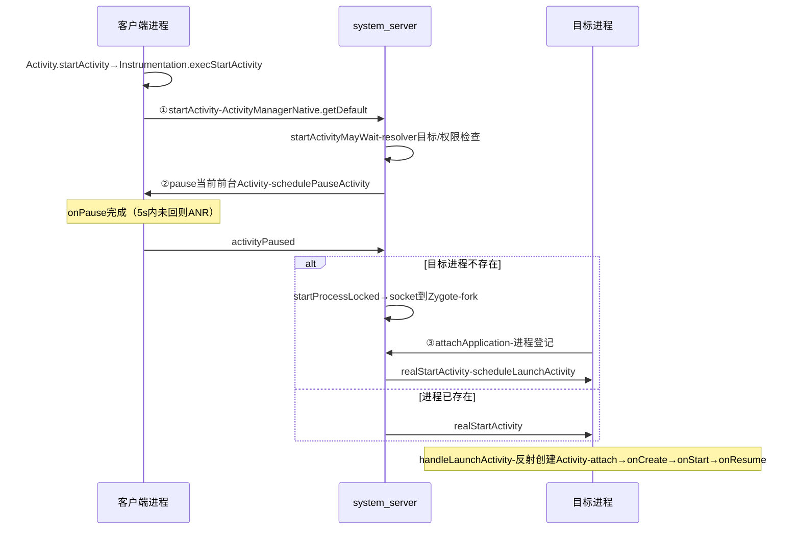
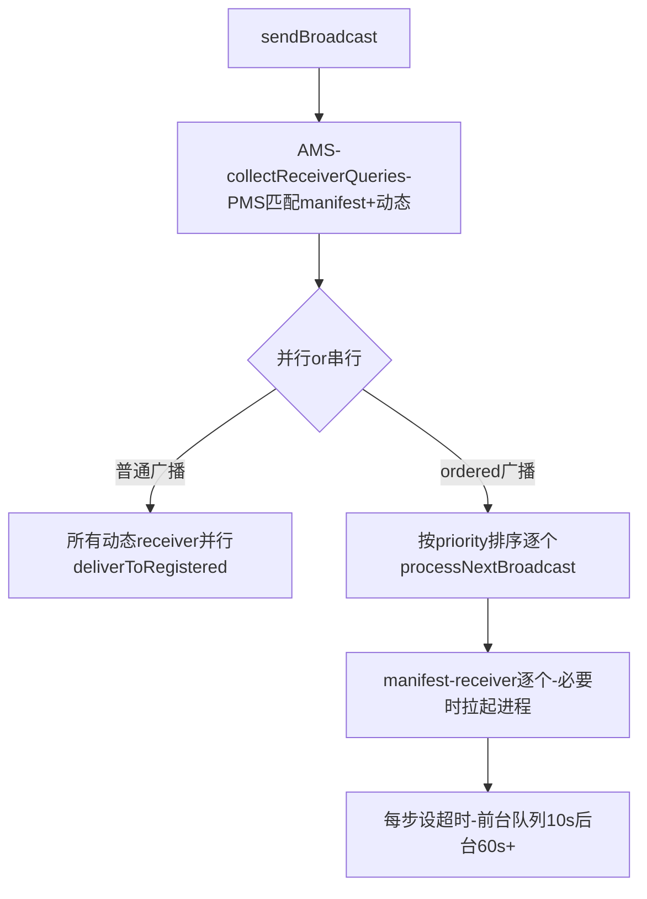

## 5.1 概述

ActivityManagerService（AMS）是 Framework 中最庞大的服务：四大组件的生命周期管理、进程的创建与调度、任务栈（Task/Back Stack）管理、ANR 判定、广播分发……全部由它统筹。原书第 6 章是卷二的重头戏，本章按原书主线：AMS 启动 → Activity 启动全链路 → BroadcastReceiver → 进程管理。

本章基于 Android 4.0 源码按概念重写（标注"概念简化"处），与原书可能有出入；小节编号为笔记整理时重建。

## 5.2 AMS 综述与启动

### 5.2.1 AMS 的数据结构总览

AMS 内部几组核心成员（4.0 命名）：

| 数据结构 | 职责 |
|---|---|
| `mProcessNames`/`mPidsSelfLocked` | pid/uid → ProcessRecord，进程档案（进程组、oom_adj、组件列表） |
| `mMainStack`（ActivityStack） | Activity 任务栈与 Activity 状态机 |
| `mBroadcastQueues`（fg/bg 各一） | 广播队列与超时 |
| `mServices`（ActiveServices） | Service 记录与生命周期 |
| `mProviderMap` | ContentProvider 登记表 |
| `mLruProcesses` | 按最近使用排序的进程链表，杀进程依据 |
| `mStartedUsers` | 用户状态结构（多用户正式支持始于 4.2） |

### 5.2.2 AMS 的启动与 systemReady

AMS 在 system_server 中创建后：

1. **构造与基础服务线程**：内部建立 `android.fg`/`android.ui` 等 HandlerThread 分组（4.0 已有雏形），加载 URI permission 等配置
2. **`setSystemProcess()`**：把自己以多个名字注册到 servicemanager——`activity`（本体）、`meminfo`、`cpuinfo`、`perminfo`、`activity` 之外还有 `user` 等；同时把 `framework-res` 的 Setting Provider 装入
3. **`systemReady(goCallback)`**：开机收尾的总闸：
   - 清理残留进程（上次异常关机留下的）、启动 persistent 应用（`android:persistent="true"`，如电话）
   - 恢复各用户状态、启动 Launcher（Home Activity）
   - 回调里发送 `ACTION_BOOT_COMPLETED`，并按接收者优先级逐个投递

`systemReady` 之后，AMS 进入"对外服务"状态，普通应用可以启动了。

## 5.3 Activity 的创建和启动

### 5.3.1 一次 startActivity 的完整链路

从 App 调 `startActivity` 到目标 Activity 走到 `onCreate`，最少跨越三次 Binder（目标进程不存在时）：



拆解每一步的内部：

**1. 客户端校验与发起。** `Activity.startActivity` → `Instrumentation.execStartActivity`：检查 `android.permission.START_ANY_ACTIVITY`（应用没有，需系统判定），然后拿 AMS 的代理发出调用。注意调用发生在**应用主线程**，AMS 处理在**system_server 的 binder 线程**。

**2. AMS 侧决策。** `ActivityStack.startActivityMayWait`（概念骨架）：

```java
// ActivityStarter的前身（概念简化）
resolveActivity(intent);                    // 问PMS：目标ActivityInfo
checkStartAnyActivityPermission(...);       // 权限
startActivityLocked(caller, ...);           // 状态机入口：NEW_TASK等flag处理
// 决策内容：
//  - launchMode/taskAffinity → 目标进哪个Task
//  - FLAG_ACTIVITY_CLEAR_TOP/NEW_TASK → 栈操作
//  - mUserLeaving → 是否带userLeaving语义（onUserLeaveHint）
```

**3. pause 前台。** AMS 先让当前前台 Activity 走 `onPause`（经客户端的 `ApplicationThread.schedulePauseActivity`），**这是跨进程等待**：AMS 记下超时，应用主线程被别的活堵住就会在这里计入 ANR。`onPause` 完成回来后才继续 resume 目标。

**4. 进程判定与冷启动。** 目标 Activity 所在进程不存在时 `startProcessLocked`：通过 Zygote 的本地 socket 发 `forkAndSpecialize` 请求，参数里带 UID/gid/seinfo/ABI；新进程入口 `ActivityThread.main`：`Looper.prepareMainLooper()` → `attach(false)`（回连 AMS，即 ③ attachApplication，登记 ProcessRecord）→ `Looper.loop()`。

**5. scheduleTransaction。** AMS 调客户端的 `ApplicationThread.realStartActivity`（4.0 名为 `scheduleLaunchActivity`）：把 ActivityInfo、token（在 AMS 侧标识该 ActivityRecord 的 Binder）、savedState 等打包发给客户端。客户端主线程 Handler 处理：

```java
// ActivityThread.handleLaunchActivity（概念简化）
Activity activity = mInstrumentation.newActivity(cls);  // 反射创建
activity.attach(context, activityToken, app, ...);       // 绑定Window/Context
activity.onCreate(savedInstanceState);                   // 生命周期开始
// …onStart→onResume，AMS侧记录ActivityRecord.state=RESUMED
```

**核心认知一：Activity 的生命周期回调由 AMS 远程驱动、在客户端线程执行。** `ApplicationThread` 是 App 进程反向注册到 AMS 的 Binder 服务端，AMS 所有"通知"（pause/stop/destroy/config change）都经它投递到客户端主线程的 MessageQueue（`mH` 这个 Handler）——把 Binder 与 Handler 两个机制串起来，就是整个组件驱动机制。

**核心认知二：AMS 侧的 ActivityRecord 与客户端 Activity 对象一一对应、分居两界。** AMS 从不知道 Java Activity 对象本身，只持有 `ActivityRecord`（含 token、状态、intent）；客户端持有对象与 `mToken`。窗口层的 `ViewRootImpl` 再以 token 与 WMS 关联——一个 Activity 的完整身份横跨 AMS/WMS/App 三界。

### 5.3.2 Task 与 Back Stack

- 每个 Task 是一个 Activity 栈（`ActivityStack` 里的 `TaskRecord`），RecentTask 记录供最近任务展示
- `launchMode` 决定入栈行为：

| launchMode | 行为 |
|---|---|
| standard | 每次 new instance，无条件压栈 |
| singleTop | 目标已在栈顶则复用（`onNewIntent`），否则新建 |
| singleTask | 以其为根的 Task 若存在则清其上并 `onNewIntent`，不存在则新 Task（受 affinity 影响） |
| singleInstance | 独占一个 Task，且该 Task 永远只有它 |

- `taskAffinity` + `FLAG_ACTIVITY_NEW_TASK` 组合出"新开栈"；`FLAG_ACTIVITY_CLEAR_TOP`/`CLEAR_TASK`/`SINGLE_TOP` 等进一步控制栈操作——所有这些都在 AMS 的 `ActivityStack`/`TaskRecord` 逻辑里裁决，客户端只是执行者

### 5.3.3 进程优先级与 oom_adj

AMS 给每个 ProcessRecord 维护 **oom_adj**（out-of-memory adjust）值，内核的 lowmemorykiller（lmk）按它从高到低杀：

| oom_adj | 级别 | 触发条件（谁把这个进程抬到这一级） |
|---|---|---|
| SYSTEM_ADJ(-16) | system_server | — |
| PERSISTENT_PROC_ADJ(-12) | persistent 应用 | manifest 声明 persistent（电话等） |
| FOREGROUND_APP_ADJ(0) | 前台应用 | 有前台 Activity / 前台 Service / 正在处理广播/受 binder 调用中 |
| VISIBLE_APP_ADJ(1) | 可见 | Activity 可见但非前台（被透明 Activity 盖住、pause 中） |
| PERCEPTIBLE_APP_ADJ(2) | 可感知 | 放音乐、无 UI 的前台 Service（用户能"感觉到"它活着） |
| BACKUP_APP_ADJ(300) / HEAVY_WEIGHT(400) | 备份/重量级 | backup agent 运行中 / heavy 应用 |
| SERVICE_ADJ(500) | 服务 | 纯后台 Service 进程 |
| PREVIOUS_APP_ADJ(600) | 上一个应用 | 刚按返回切走的（利于快速切回） |
| HOME_APP_ADJ(700) | 桌面 | Launcher 进程 |
| HIDDEN_APP_MIN_ADJ(1000) | 后台隐藏 | 什么组件都没有的空缓存进程 |

**计算规则**：`updateOomAdjLocked` 遍历 mLruProcesses，按该进程拥有的"最强组件状态"取最低 adj（前台 Activity 优先于后台 Service）。两个连带效应：

- 有客户端还在用某 ContentProvider 的进程，至少抬到 SERVICE 级（provider 联动）
- 正在响应 binder 调用/广播的进程临时抬到前台级（transient 提权），跑完降回

**这就是"后台进程容易被杀、前台放音乐不容易被杀"的机制本质**——一切耗电保活技巧（空 Service、双进程互拉）本质都是在骗这张表。

## 5.4 广播分发与 ANR 机制

### 5.4.1 注册与分发模型

两种注册：

- **静态 receiver**：manifest 声明，PMS 扫描时登记；AMS 的 `mReceiverResolver` 持有。特点：进程死了也能在广播到达时被拉起
- **动态注册**：`registerReceiver(receiver, filter)` 把 `IIntentReceiver`（LoadedApk 里 `ReceiverDispatcher.InnerReceiver` 包装的 Binder）登记到 AMS 的 `mRegisteredReceivers`

分发模型（`BroadcastQueue`）：



- **并行部分**：普通广播的动态接收者一次性全发（各自 binder 线程并发收），无序
- **串行部分**：ordered 广播按 `priority` 排队逐个投递，前一个处理完（或超时）才轮到下一个；`resultData` 沿链传递。**串行队列的超时就是广播 ANR 的来源**
- **manifest receiver 的懒唤醒**：静态接收者所在进程可能已死，AMS 派发到它时临时 `startProcessLocked` 拉起进程，把广播作为冷启动理由。这是后台应用被"广播唤醒"的根源，也是后来 Android 历次版本严打的点（见 5.7）

### 5.4.2 广播队列的两条与粘性

- 前台队列（`mFgBroadcastQueue`，超时 10s）与后台队列（`mBgBroadcastQueue`，超时 60s）分离：`FLAG_RECEIVER_FOREGROUND` 的广播走前台队列优先送达（通知类），普通广播走后台队列不阻塞关键路径
- **sticky broadcast**：发出去后常驻 AMS（按 intent filter 挂表），新注册者立刻收到最后一份。`BATTERY_CHANGED`、`CONNECTIVITY_CHANGE`（4.0 时代）都用它。因为常驻内存且权限混乱，后来被 `registerReceiver` + 查询 API 的组合替代（BATTERY_CHANGED 现由 `BatteryManager.getIntProperty` 查询，sticky 注册已废弃）

### 5.4.3 ANR：AMS 的问责机制汇总

ANR（Application Not Responding）三类来源：

| 来源 | 超时 | 触发点 |
|---|---|---|
| 输入事件 | 5s | InputDispatcher 发现窗口 5s 未消费输入 |
| 前台 Service | 20s | ActiveServices 的 `SERVICE_TIMEOUT` |
| 前台广播 | 10s | BroadcastQueue 的 mTimeoutPeriod |

超时后 `appNotResponded`：dump 主线程与各 binder 线程堆栈、CPU 占用快照进 dropbox（`data_app_anr` tag），弹 ANR 对话框（可选），用户可等/关。本质都是"主线程 MessageQueue 被长任务堵死"——与 MessageQueue 的阻塞模型直接对应：主线程要么在执行长消息，要么在等 binder/锁，队列就断了粮。

## 5.5 进程管理

### 5.5.1 进程的生命周期管理

AMS 对进程的管理围绕 `ProcessRecord`（每个 App 进程一份档案：pid、uid、oom_adj、组件列表、crash 计数）：

- **updateLruProcessLocked**：每次组件活动（Activity resume、Service 启动、provider 被取用）都把进程提到 `mLruProcesses` 相应位置（LRU，Least Recently Used 最近最少使用）
- **updateOomAdjLocked**：重算 oom_adj 并写入 `/proc/<pid>/oom_adj`；同时联动调度参数（前台进程更高的调度优先级）
- **killBackgroundProcesses / trimApplications**：内存紧张或用户操作触发杀进程；lmk 在内核里按 adj 梯度主动杀（minfree 阈值表对应 adj 等级）

### 5.5.2 应用退出 ≠ 进程退出

按返回键退出 Activity 后进程成为**空进程（empty process）**：仍留在 mLruProcesses 缓存里（adj=HIDDEN），下次启动同包组件免 fork 免 preload 重建，冷启动显著变快。真正的退出路径只有三条：被 lmk 杀 / 用户 force-stop / 开发者选项清理。**"杀不干净"是缓存设计的代价而非缺陷**——4.0 时代各种"一键清理"应用热卖，正是用户对这一设计的误解加厂商的顺水推舟。

### 5.5.3 crash 与重启治理

`handleAppCrashLocked`：进程 crash（未捕获异常经 `RuntimeInit` 的 handler 上报）后：记录 dropbox、清 ProcessRecord、视组件情况决定是否重启进程（`isolated process` 与 `persistent` app 自动重启）。crash 计数进 `ProcessRecord.badness`，短时间反复崩的应用会被"禁运"（不再自动拉起）。

## 5.6 后续演进：4.0 机制 vs 现代 Android

AMS 是 2012 年后被改得"面目最多"的服务：拆分、换内核杀手机制、砍后台自由。逐项对比：

| 维度 | Android 4.0（原书） | 现代 Android（12~15） | 展开说明 |
|---|---|---|---|
| 服务拆分 | AMS 巨石 | **ATMS 拆出**（Android 10） | Activity/Task/窗口栈管理迁到 **ActivityTaskManagerService（ATMS）**，`ActivityManager` 拆出 `ActivityTaskManager`；AMS 保留进程、Service、广播、Provider 与权限。原书第 6 章的 Activity 启动链路（5.3 节）今天要看 ATMS：`ActivityStarter` → `RootWindowContainer.resumeFocusedTasksTopActivities`，事务化投递（`ClientTransaction`/`LaunchActivityItem`）取代逐个 scheduleXxx 调用，生命周期统一为 `TransactionExecutor` 执行的事务项 |
| oom_adj / lmk | 内核 lowmemorykiller 驱动 | userspace **lmkd** + oom_score_adj + PSI | Android 8~9 起 lmkd 守护进程取代内核 lmk：读 **PSI**（Pressure Stall Information，内核内存压力指标）实时感知内存紧张，按 oom_score_adj（语义与 adj 同构，数值 0~1000）杀进程；cached 进程分级为 900~999 多档 LRU，配合 `ActivityManager.onProcessStarted` 式事件。Android 11+ 又加了 **Cached Apps Freezer**：缓存应用 cgroup 冻结 CPU（不用杀，恢复零成本），"后台被杀"的用户感知进一步弱化 |
| 后台 Service | 随便起、常驻 | 8.0 起后台 Service 被砍 | 后台进程 `startService` 直接抛 `IllegalStateException`；正道是 `startForegroundService`（5s 内必须 `startForeground` 挂常驻通知）或 JobScheduler。**FGS 类型制**（Android 14）：前台服务必须声明 `foregroundServiceType`（location/camera/dataSync…），越界类型被系统拒绝——"挂着前台服务偷偷干别的"被关死 |
| 广播 | manifest receiver 随意唤醒 | 隐式广播黑名单（8.0）+ 安全注册（13/14） | 大批隐式广播（CONNECTIVITY_CHANGE 等）不再投给 manifest receiver（动态注册仍可收）；`BOOT_COMPLETED` 等少数白名单例外；Android 13 起动态注册非系统广播必须显式 `RECEIVER_EXPORTED/NOT_EXPORTED`；广播队列增加 offload 队列（如 `ACTION_PACKAGE_ADDED` 类重负载广播去后台线程处理） |
| Task/窗口 | 单 ActivityStack | WindowContainer 树 + 多窗口/分屏 | Android 7 分屏/Freeform、多显示器、折叠屏：Task 成为 `WindowContainer` 通用树的一环，与 WMS 共用层级（`DisplayContent` → `Task` → `ActivityRecord` ↔ `WindowState`）；Recent Tasks 由 `RecentsAnimation` 演示。launchMode/singletask 语义保留，但裁决代码搬进 ATMS 的 `ActivityStarter`/`TaskOrganizer` |
| 生命周期投递 | schedulePauseActivity 等散装调用 | ClientTransaction 事务 | 生命周期 + 配置变化打包为事务项（`ActivityLifecycleItem`、`ConfigurationChangeItem`），一次 binder 携带一批，减少往返；`ClientTransactionListener` 支持死亡回滚。读现代 AOSP 时 5.3.1 的"三次 Binder"骨架不变，细粒度调用换成了事务 |
| ANR 治理 | 三类超时 | 同三类 + trace 现代化 | `anr` 输出迁到 perfetto/battery 拼装；Android 12+ `AttributionSource` 令调用链更可追；ANR 对话框策略向"静默记录+下次提醒"演进，但 5s/10s/20s 数字与主线程断粮本质没变 |
| 冷启动加速 | Zygote preload + dexopt | Baseline Profiles、App Startup、`zygote` 多路 | `androidx.startup` 统一初始化；Baseline Profiles（Cloud Profile 聚合真实用户热路径喂给 ART 编译）替代"全量 AOT"；`profman`/`DexOpt` 服务化。进程孵化仍是 Zygote fork——这层从 4.0 到 15 未变 |

**读原书的价值锚点**：`ProcessRecord`/`ActivityRecord` 的双界对应、oom_adj 的组件状态联动规则、"AMS 驱动 + ApplicationThread 回投 + 主线程 Handler 执行"三段式，是后续一切演进的地基；变化集中在"进程怎么死（lmkd/freezer）"与"后台能干什么（限制升级）"两条线上。
