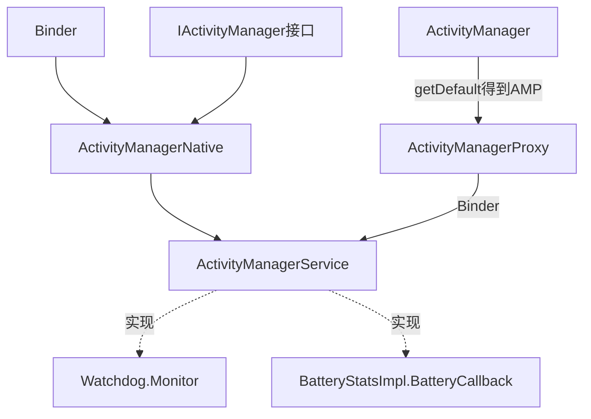
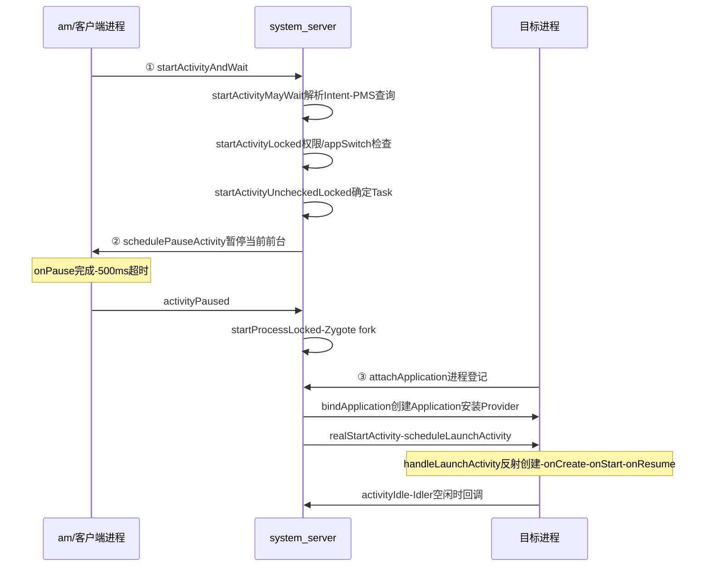

## 5.1 概述

ActivityManagerService(AMS)是 Android 中最核心的服务,主要负责**系统中四大组件的启动、切换、调度及应用进程的管理和调度**等工作,其职责与操作系统中的进程管理和调度模块相类似。

原书按**五条线**分析 AMS:

1. **第一条线**:同其他服务一样,分析 SystemServer 中 AMS 的调用轨迹(5.2 节)
2. **第二条线**:以 am 命令启动一个 Activity 为例,分析应用进程的创建、Activity 的启动,以及它们和 AMS 之间的交互(5.3 节)
3. **第三条线**:以 Broadcast 为例,分析 AMS 中 Broadcast 的相关处理流程(5.4 节)
4. **第四条线**:Service 的处理流程,以流程图的方式"按图索骥"(5.5 节)
5. **第五条线**:以一个 Crash 的应用进程为出发点,分析 AMS 如何打理该应用进程的身后事(5.7 节)

此外还统一分析与 AMS 应用进程调度、内存管理相关的知识(5.6 节)。ContentProvider 放到下一章(第 7 章)分析,但本章会涉及相关知识点。

### AMS 家族图谱



- AMS 由 **ActivityManagerNative**(AMN)派生并实现 `Watchdog.Monitor`、`BatteryStatsImpl.BatteryCallback` 接口;AMN 由 Binder 派生,实现了 `IActivityManager` 接口
- 客户端使用 `ActivityManager` 类。由于 AMS 是系统核心服务,很多 API 不开放给客户端,设计者没有让 ActivityManager 直接加入 AMS 家族——它在内部通过 `ActivityManagerNative.getDefault()` 得到一个 `ActivityManagerProxy` 对象(AMP),通过 AMP 与 AMS 通信

AMS 内部几组核心数据结构(4.0 命名,后文反复出现):

| 数据结构 | 职责 |
|---|---|
| `mProcessNames` / `mPidsSelfLocked` | 进程名/pid → ProcessRecord,进程档案(oom_adj、组件列表、crash 计数) |
| `mMainStack`(ActivityStack) | Activity 任务栈管理与调度核心 |
| `mHistory` | ActivityStack 中保存**全系统所有** ActivityRecord 的数组 |
| `mReceiverResolver` / `mRegisteredReceivers` | 动态注册广播接收者的过滤条件与登记表 |
| `mParallelBroadcasts` / `mOrderedBroadcasts` | 并行/串行两条广播队列 |
| `mProviderMap` 系列 | ContentProvider 登记表(下一章展开) |
| `mLruProcesses` | 按最近使用排序的进程链表,杀进程依据 |

## 5.2 初识 ActivityManagerService

AMS 由 SystemServer 的 ServerThread 线程创建,调用轨迹如下:

```java
// SystemServer.java :: ServerThread 的 run 函数
// ① 调用 main 函数,得到一个 Context 对象
context = ActivityManagerService.main(factoryTest);
// ② setSystemProcess:这样 SystemServer 进程可加到 AMS 中,并被它管理
ActivityManagerService.setSystemProcess();
// ③ installSystemProviders:将 SettingsProvider 放到 SystemServer 进程中来运行
ActivityManagerService.installSystemProviders();
// ④ 在内部保存 WindowManagerService(简称 WMS)
ActivityManagerService.self().setWindowManager(wm);
// ⑤ 和 WMS 交互,弹出"启动进度"对话框(正在启动应用程序)
// ⑥ AMS 是系统的核心,只有它准备好后,才能调用其他服务的 systemReady
ActivityManagerService.self().systemReady(new Runnable() {
    public void run() {
        startSystemUi(contextF);        // 启动 SystemUi,状态栏就准备好了
        if (batteryF != null) batteryF.systemReady();
        ......                          // 调用其他服务的 systemReady
        Watchdog.getInstance().start(); // 启动 Watchdog
    }
});
```

### 5.2.1 AMS 的 main 函数分析

main 函数返回一个 Context 对象,供 SystemServer 中其他服务大量使用:

```java
// ActivityManagerService.java :: main
public static final Context main(int factoryTest) {
    AThread thr = new AThread();      // ① 创建一个 AThread 线程对象
    thr.start();
    ......                            // 等待 thr 创建成功
    ActivityManagerService m = thr.mService;
    mSelf = m;
    // ② 调用 ActivityThread 的 systemMain 函数
    ActivityThread at = ActivityThread.systemMain();
    mSystemThread = at;
    // ③ 得到一个 Context 对象,函数名为 getSystemContext
    Context context = at.getSystemContext();
    context.setTheme(android.R.style.Theme_Holo);
    m.mContext = context;
    m.mFactoryTest = factoryTest;
    // ActivityStack 是 AMS 中管理 Activity 启动和调度的核心类
    m.mMainStack = new ActivityStack(m, context, true);
    m.mBatteryStatsService.publish(context);      // BSS(第 5 章已见)
    m.mUsageStatsService.publish(context);        // UsageStatsService
    synchronized (thr) {
        thr.mReady = true;
        thr.notifyAll();  // 通知 thr 线程,本线程工作完成
    }
    m.startRunning(null, null, null, null);       // ④ 调用 AMS 的 startRunning
    return context;
}
```

main 函数里有一处 wait 与一处 notifyAll:main 函数先等 AThread 创建 AMS 对象,AThread 再等 main 完成后续工作——这种双线程互等在 Android 代码中比较少见。

#### 1. AThread 分析

```java
// ActivityManagerService.java :: AThread
static class AThread extends Thread {
    ActivityManagerService mService;
    boolean mReady = false;
    public AThread() {
        super("ActivityManager");          // 线程名就叫 "ActivityManager"
    }
    public void run() {
        Looper.prepare();                  // 支持消息循环及处理
        android.os.Process.setThreadPriority(
                android.os.Process.THREAD_PRIORITY_FOREGROUND);
        android.os.Process.setCanSelfBackground(false);
        ActivityManagerService m = new ActivityManagerService(); // 创建 AMS 对象
        synchronized (this) {
            mService = m;
            notifyAll();                   // 通知 main 函数所在线程
        }
        synchronized (this) {
            while (!mReady) {
                try { wait(); } ......     // 等待 main 函数所在线程的 notifyAll
            }
        }
        Looper.loop();                     // 进入消息循环
    }
}
```

AThread 本质是一个支持消息循环的线程,其主要工作就是创建 AMS 对象。AMS 构造函数则创建 BatteryStatsService、UsageStatsService、`mProcessStats`(读取并解析 `/proc/stat` 统计 CPU/内存)、CompatModePackages(解析 `/data/system/packages-compat.xml`)等,并把自己注册进 Watchdog。

#### 2. ActivityThread.systemMain 函数分析

ActivityThread 代表**一个应用进程的主线程**(对应用进程来说,其 main 函数确实由主线程执行),职责是调度及执行在该线程中运行的四大组件。

> **应用进程**指运行 APK 的进程,由 Zygote fork 而来,上面运行 dalvik 虚拟机;与之相对的是**系统进程**(Zygote 和 SystemServer)。注意区分"应用进程/系统进程"与"应用 APK/系统 APK"(判别依据是 apk 文件在 `/data/app` 还是 `/system` 下)。

```java
// ActivityThread.java :: systemMain
public static final ActivityThread systemMain() {
    HardwareRenderer.disable(true);   // 禁止硬件渲染加速
    ActivityThread thread = new ActivityThread();
    thread.attach(true);              // 注意传递的参数为 true(system)
    return thread;
}
```

**为什么 SystemServer 不是应用进程,也需要 ActivityThread?**

- framework-res.apk 除了资源文件外还包含一些 Activity(如关机对话框),它们实际运行在 SystemServer 进程中。从这个角度看,SystemServer 是一个**特殊的应用进程**
- 通过 ActivityThread 可以把 Android 提供的组件交互机制和接口(如 Context 的 API)拓展到 SystemServer 中使用

attach(true) 走系统进程分支:创建 `Instrumentation`,用 `ContextImpl.init()` 初始化 context,再用 Instrumentation 创建一个 Application 对象并调用其 `onCreate`。一句话总结:**systemMain 函数为 SystemServer 进程搭建一个和应用进程一样的 Android 运行环境**——该环境包括 ActivityThread(Looper + 组件调度)和 ContextImpl。

#### 3. getSystemContext 与 Context 家族

getSystemContext 内部创建 ContextImpl,并用一个 package 名为 `"android"` 的 **LoadedApk**(2.3 引入,代表一个加载到系统中的 APK,保存资源文件位置、JNI 库位置等信息)去初始化它——这个 APK 就是 framework-res.apk,仅供 SystemServer 使用,故名为 SystemContext。

Context 家族要点:

- **ContextWrapper** 是代理类,被代理对象是 ContextImpl(通过 `mBase` 指定),目的是把 ContextImpl 隐藏起来
- **Application** 从 ContextWrapper 派生,内部有 LoadedApk 类型的 `mLoadedApk`——一个 Manifest 只能声明一个 application 标签,所以一个 Application 必然和一个 LoadedApk 绑定
- **Service** 从 ContextWrapper 派生,`mApplication` 指向 Application
- **Activity** 作为 UI 容器从 **ContextThemeWrapper** 派生(重载了 Theme 相关函数),同样持有 `mApplication`

### 5.2.2 AMS 的 setSystemProcess 分析

```java
// ActivityManagerService.java :: setSystemProcess
public static void setSystemProcess() {
    try {
        ActivityManagerService m = mSelf;
        // 向 ServiceManager 注册几个服务
        ServiceManager.addService("activity", m);                    // AMS 本体
        ServiceManager.addService("meminfo", new MemBinder(m));      // 打印内存信息
        ServiceManager.addService("gfxinfo", new GraphicsBinder(m)); // 4.0 新增,应用图形加速信息
        if (MONITOR_CPU_USAGE)
            ServiceManager.addService("cpuinfo", new CpuBinder(m));
        ServiceManager.addService("permission", new PermissionController(m));
        // 向 PKMS 查询 package 名为 "android" 的 ApplicationInfo。
        // 注意:虽然 PKMS 和 AMS 同属一个进程,但交互仍然借助 Context(Binder 调用)。
        // Android 希望 SystemServer 中的服务也通过 Android 运行环境来交互,
        // 这更多是从设计上考虑:组件交互接口的统一及未来系统的可扩展性
        ApplicationInfo info = mSelf.mContext.getPackageManager()
                .getApplicationInfo("android", STOCK_PM_FLAGS);
        // ① 调用 ActivityThread 的 installSystemApplicationInfo 函数
        mSystemThread.installSystemApplicationInfo(info);
        synchronized (mSelf) {
            // ② 为 SystemServer 创建一个 ProcessRecord,纳入 AMS 进程管理
            ProcessRecord app = mSelf.newProcessRecordLocked(
                    mSystemThread.getApplicationThread(), info, info.processName);
            app.persistent = true;
            app.pid = MY_PID;
            app.maxAdj = ProcessList.SYSTEM_ADJ;   // 系统进程 oom_adj 为 -16
            // ③ 保存该 ProcessRecord
            mSelf.mProcessNames.put(app.processName, app.info.uid, app);
            synchronized (mSelf.mPidsSelfLocked) {
                mSelf.mPidsSelfLocked.put(app.pid, app);
            }
            mSelf.updateLruProcessLocked(app, true, true);
        }
    } ...... // 抛异常
}
```

**installSystemApplicationInfo 的两次 init 之惑**:getSystemContext 返回的 mSystemContext 在 main 函数中已 init 过一次,此处为何再次 init?因为第一次 init 时 LoadedApk 的 ApplicationInfo 参数为 null(仅创建运行环境),第二次 init 用从 PKMS 查到的真实 ApplicationInfo 将 Context 与 framework-res.apk 绑定——APK 的运行需要一个正确初始化的 Android 运行环境。

**ProcessRecord 与 IApplicationThread**:AMS 通过 Binder 与应用进程交互,接口是 `IApplicationThread`,其 Binder **服务端在应用进程中**(AMS 需要监听应用进程的死亡通知)。典型调用如:

```java
// ActivityThread.java :: scheduleStopActivity
public final void scheduleStopActivity(IBinder token, boolean showWindow,
                                       int configChanges) {
    queueOrSendMessage(  // 给 Handler 发送对应的消息
            showWindow ? H.STOP_ACTIVITY_SHOW : H.STOP_ACTIVITY_HIDE,
            token, 0, configChanges);
}
```

AMS 想停止一个 Activity 时,调用对应进程 IApplicationThread 客户端的 `scheduleStopActivity`,服务端实现就是向主线程发消息——**Activity 的 onStop 最终在主线程被调用**。AMS 侧更多进程信息保存在 ProcessRecord 中:构造函数初始化 batteryStats、info、processName、pkgList(一个进程可运行多个 Package)、thread(IApplicationThread)、各级 oom_adj 初值、persistent 标志等。

### 5.2.3 AMS 的 installSystemProviders 函数分析

SystemServer 中很多 Service 需要向 Settings 数据库查询配置,`installSystemProviders` 加载 SettingsProvider.apk 并把 SettingsProvider 放到 SystemServer 进程中运行——这是**多个 APK 运行在同一进程**的典型案例(framework-res.apk 与 SettingsProvider.apk 同住 SystemServer)。

```java
// ActivityManagerService.java :: installSystemProviders
public static final void installSystemProviders() {
    List<ProviderInfo> providers;
    synchronized (mSelf) {
        // 从 mProcessNames 找到进程名为 "system" 且 uid 为 SYSTEM_UID 的 ProcessRecord
        ProcessRecord app = mSelf.mProcessNames.get("system", Process.SYSTEM_UID);
        // ① 向 PKMS 查询满足条件(进程名 + uid)的 ProviderInfo
        providers = mSelf.generateApplicationProvidersLocked(app);
        if (providers != null) {
            ...... // 将非系统 APK 提供的 Provider 从列表中去掉
        }
        if (providers != null) {
            // ② 为 SystemServer 进程安装 Provider
            mSystemThread.installSystemProviders(providers);
        }
        // 监视 Settings 数据库 Secure 表的变化
        mSelf.mCoreSettingsObserver = new CoreSettingsObserver(mSelf);
    }
}
```

为何偏偏能找到 SettingsProvider?看它的 AndroidManifest.xml:设置了 `android:sharedUserId="android.uid.system"`,且 application 设置了 `android:process="system"`——与 framework-res.apk 相同,所以它将运行在 SystemServer 中(从运行效率来说也合理,降低 IPC 损耗)。

ActivityThread 侧的 `installContentProviders` → `installProvider` 完成实例创建:先为 ContentProvider 找到(或通过 `createPackageContext` 创建)对应的 Context——**只有对应的 Context 才能加载对应 APK 的 Java 字节码**——然后反射创建实例:

```java
// ActivityThread.java :: installProvider(节选)
final java.lang.ClassLoader cl = c.getClassLoader();
// 通过 Java 反射机制得到真正的 ContentProvider,此处得到一个 SettingsProvider 对象
localProvider = (ContentProvider) cl.loadClass(info.name).newInstance();
provider = localProvider.getIContentProvider(); // 取出内部 Transport(Binder 端)
localProvider.attachInfo(c, info);              // 内部调用其 onCreate 函数
```

最后通过 `publishContentProviders` 向 AMS 发布:AMS 以 ComponentName 为 key 存入 `mProvidersByClass`、以 authority 为 key 存入 `mProvidersByName`,并用 `notifyAll` 唤醒那些等待该 Provider 启动的客户端进程。**ContentProvider 的创建时机早于其他组件**(见 5.3 节 handleBindApplication)。

### 5.2.4 AMS 的 systemReady 分析

systemReady 分三个阶段:

**第一阶段:处理 PRE_BOOT_COMPLETED 广播**。读取 `/data/system/called_pre_boots.dat`(上次启动时已处理过该广播的组件),保证该广播仅被接收者处理一次;若处于升级等待状态则直接 return。

**第二阶段:清理 + 读取配置**:

```java
// systemReady 第二阶段(节选)
// 从 mPidsSelfLocked 中找到那些先于 AMS 启动的进程并杀死——
// 能在 AMS 未就绪时就启动的,是那些声明了 persistent 的进程之外的"漏网之鱼"
synchronized(this) {
    if (procsToKill != null) {
        for (int i=procsToKill.size()-1; i>=0; i--)
            removeProcessLocked(procsToKill.get(i), true, false);
    }
    mProcessesReady = true;
}
retrieveSettings(); // 从 Settings 数据库取 debug_app、wait_for_debugger、
                    // always_finish_activities、font_scale 四个配置
```

**第三阶段:回调 + persistent 应用 + Home**:

```java
// systemReady 第三阶段(节选)
if (goingCallback != null) goingCallback.run(); // 启动 SystemUi、Watchdog 等
synchronized (this) {
    // 从 PKMS 中查询 persistent 为 true 的应用并启动(framework-res.apk 除外)
    List apps = AppGlobals.getPackageManager().getPersistentApplications(STOCK_PM_FLAGS);
    ...... // addAppLocked(info) 启动该 Application 所在进程
    mBooting = true;
    // 启动全系统第一个 Activity,即 Home
    mMainStack.resumeTopActivityLocked(null);
}
```

`resumeTopActivityLocked` 发现栈中无 Activity 可启动时调用 `startHomeActivityLocked`:构造带 `CATEGORY_HOME` 的 Intent,向 PKMS 查询满足条件的 ActivityInfo(Launcher),以 `FLAG_ACTIVITY_NEW_TASK` 启动。

**ACTION_BOOT_COMPLETED 在哪发?** Home 启动后,`activityIdleInternal` 被调用(见 5.3 节),其中检查 `mBooting` 并调用 `finishBooting`:设置系统属性 `sys.boot_completed=1`,然后才发送 `ACTION_BOOT_COMPLETED` 广播(要求 `RECEIVE_BOOT_COMPLETED` 权限)。

### 5.2.5 初识 AMS 总结

| 函数 | 工作 |
|---|---|
| `main` | 创建 AMS 实例;更重要的是创建供 SystemServer 使用的 Android 运行环境(ActivityThread + ContextImpl) |
| `setSystemProcess` | 注册 activity/meminfo/gfxinfo/cpuinfo/permission 服务;为 SystemServer 创建 ProcessRecord——尽管贵为系统进程,也并入 AMS 管理 |
| `installSystemProviders` | 为 SystemServer 加载 SettingsProvider |
| `systemReady` | 系统就绪前的扫尾工作;调用完毕后 Home Activity 呈现在用户面前 |

## 5.3 startActivity 分析

### 5.3.1 从 am 说起

am 和 pm 一样是脚本,用来和 AMS 交互(启动 Activity、启动 Service、发送广播等),核心文件是 Am.java。启动 Activity 的用法:

```bash
am start -W -n com.dfp.test/.TestActivity
```

`-W` 表示等目标 Activity 启动后才返回,`-n` 设置 Intent 的 Component。runStart 内部最终调用 AMS 的 `startActivityAndWait`(默认加上 `FLAG_ACTIVITY_NEW_TASK`)。选择从 am 入手分析,是为了避开"从一个 Activity 启动另一个 Activity"的鸡生蛋问题。

### 5.3.2 AMS 的 startActivityAndWait 函数分析

startActivityAndWait 参数众多,关键的几个:`caller`(调用进程的 IApplicationThread,本例为 null)、`resultTo`(接收 startActivityForResult 结果的 Activity)、`grantedUriPermissions`(与授权有关,见第 3 章 ClipboardService)。函数体直接转调:

```java
// ActivityManagerService.java :: startActivityAndWait
public final WaitResult startActivityAndWait(......) {
    WaitResult res = new WaitResult();
    mMainStack.startActivityMayWait(caller, -1, intent, resolvedType, ...);
    return res;
}
```

#### 1. Task、Back Stack、ActivityStack 及 Launch Mode

- **Task**:用户要干的一"件事",可细分为多个步骤,每个步骤即一个 Activity。不同 Task 可以复用同一个 Activity(如分享、查看图片),避免重复"发明轮子"并提供一致体验
- **Back Stack**:Task 内部的 Activity 用 Stack(先入后出)组织;多个 Task 时,系统只支持一个前台 Task,其余 Task 整体待在后台(长按 Home 弹出近期 Task 列表)
- **ActivityStack 的真实实现令人大跌眼镜**:`mHistory` 这个 ArrayList 保存了**系统中所有 Task 的 ActivityRecord**,而不是按 Task 分开保存;ActivityStack 中甚至没有成员保存 TaskRecord(ActivityRecord.task 指向所在 Task)。优点是少了 TaskRecord 一级的管理开销,缺点是弱化了 Task 概念、结构不清晰

常用查找函数(均从 mHistory 尾端开始,行为粗略符合 Stack 定义):

| 函数 | 作用 |
|---|---|
| `topRunningActivityLocked(notTop)` | 栈顶第一个非 finishing 且不等于 notTop 的 ActivityRecord |
| `topRunningNonDelayedActivityLocked(notTop)` | 同上,但要求 delayedResume 为 false |
| `findActivityLocked(intent, info)` | 根据 Intent/ActivityInfo 的 ComponentName 查找 |
| `findTaskLocked(intent, info)` | 按 taskAffinity / Task intent / affinityIntent 匹配目标 Task |

四种 **launchMode**(本质是控制 Activity 与 Task 关系的"小把戏"):

| launchMode | 行为 |
|---|---|
| standard | 每次 new instance 无条件压栈;Task 有 A、B、C、D 再启动 A 类型则变成 A、B、C、D、A |
| singleTop | 目标恰在栈顶则复用(调 `onNewIntent`),否则新建;对不在栈顶的目标无效 |
| singleTask | 该 Activity 全局唯一,与其 Task 绑定;存在则清其上并 onNewIntent,不存在则新 Task;Task 中还可以有其他 Activity |
| singleInstance | singleTask 加强版:独占一个 Task,该 Task 永远只有它 |

配合的 Intent 标志:`FLAG_ACTIVITY_NEW_TASK`(放入新 Task)、`FLAG_ACTIVITY_CLEAR_TASK`(先把关联 Task 清空再放入新 Task,须与 NEW_TASK 同用)、`FLAG_ACTIVITY_CLEAR_TOP`(启动非栈顶 Activity 时先"干掉"它上面的 Activity)。

#### 2. ActivityStack 的 startActivityMayWait 函数分析

三段式:

**第一阶段**——解析与调用者信息:

```java
// ActivityStack.java :: startActivityMayWait(节选)
boolean componentSpecified = intent.getComponent() != null;
intent = new Intent(intent);   // 创建新 Intent,防止客户端传入的被修改
// 查询满足条件的 ActivityInfo,内部和 PKMS 交互
ActivityInfo aInfo = resolveActivity(intent, resolvedType, ...);
synchronized (mService) {
    if (caller == null) {  // 本例 caller 为 null,取 am 所在进程(由 shell 启动)的 pid/uid
        callingPid = Binder.getCallingPid();
        callingUid = Binder.getCallingUid();
    }
    ......
}
```

**第二阶段**——调用核心函数 `startActivityLocked(caller, intent, ...)`(5.3.3 节)。**第三阶段**——处理返回值:am 设置了 -W,故 `START_SUCCESS` 时把 outResult 加入 `mWaitingActivityLaunched` 并 `mService.wait()` 阻塞,等目标进程启动、Activity 可见后才被唤醒。

### 5.3.3 startActivityLocked 分析

startActivityLocked 的主要工作(节选关键逻辑):

```java
// ActivityStack.java :: startActivityLocked(节选)
// 处理 sourceRecord(发起请求的 Activity)与 resultRecord(接收启动结果的 Activity,
// 其 onActivityResult 将被调用),一般二者应指向同一个 Activity
ActivityRecord sourceRecord = null;
ActivityRecord resultRecord = null;
......
// 权限检查
final int perm = mService.checkComponentPermission(aInfo.permission,
        callingPid, callingUid, aInfo.applicationInfo.uid, aInfo.exported);
......
if (mService.mController != null) {
    // IActivityController 监听者:Monkey 测试时由 Monkey 设置,可实现黑名单
    abort = !mService.mController.activityStarting(watchIntent,
            aInfo.applicationInfo.packageName);
    if (abort) return START_SUCCESS;
}
// 创建一个 ActivityRecord 对象
ActivityRecord r = new ActivityRecord(mService, this, callerApp, callingUid,
        intent, resolvedType, aInfo, mService.mConfiguration,
        resultRecord, resultWho, requestCode, componentSpecified);
if (mMainStack) {
    // app switch 检查:若 AMS 当前禁止切换,只能把请求存入
    // mPendingActivityLaunches,后续有机会时再启动
    if (!mService.checkAppSwitchAllowedLocked(callingPid, callingUid, "Activity start")) {
        PendingActivityLaunch pal = new PendingActivityLaunch();
        pal.r = r; ......
        mService.mPendingActivityLaunches.add(pal);
        return START_SWITCHES_CANCELED;
    }
    mService.doPendingActivityLaunchesLocked(false); // 先处理之前 Pending 的请求
}
// 调用 startActivityUncheckedLocked 处理本次请求
err = startActivityUncheckedLocked(r, sourceRecord,
        grantedUriPermissions, grantedMode, onlyIfNeeded, true);
```

**关于 resume/stopAppSwitches**:当重要 Activity(如设置账号)处于前台时,不希望系统因用户操作之外的原因切换 Activity(如恰好来电弹出来电界面)。AMS 提供 `stopAppSwitches`/`resumeAppSwitches`:stop 设置 5 秒超时的 `DO_PENDING_ACTIVITY_LAUNCHES_MSG`,防止应用调了 stop 却忘记 resume。注意控制粒度叫 **app switch 而非 activity switch**——从受保护 Activity 中启动同任务的新 Activity 不受制约。

**startActivityUncheckedLocked**:目的就一个——**为新创建的 ActivityRecord 找到一个合适的 Task**。三段要点:

```java
// 之一:确定是否需要创建新 Task
if (sourceRecord == null) {           // 请求发起者为空 → 必然新 Task
    if ((launchFlags & Intent.FLAG_ACTIVITY_NEW_TASK) == 0)
        launchFlags |= Intent.FLAG_ACTIVITY_NEW_TASK;
} else if (sourceRecord.launchMode == ActivityInfo.LAUNCH_SINGLE_INSTANCE) {
    launchFlags |= Intent.FLAG_ACTIVITY_NEW_TASK;  // source 独占 Task → 新 Task
} else if (r.launchMode == ActivityInfo.LAUNCH_SINGLE_INSTANCE
        || r.launchMode == ActivityInfo.LAUNCH_SINGLE_TASK) {
    launchFlags |= Intent.FLAG_ACTIVITY_NEW_TASK;  // singleTask/singleInstance → 新 Task
}

// 之二:搜索已有的 Task(findTaskLocked / findActivityLocked),
// 若目标 Activity 已存在对应 Task,则是一堆复杂的复用/清理逻辑

// 之三:本例首次启动,创建新 TaskRecord 并入栈
if (r.resultTo == null && !addingToTask
        && (launchFlags & Intent.FLAG_ACTIVITY_NEW_TASK) != 0) {
    mService.mCurTask++;
    r.setTask(new TaskRecord(mService.mCurTask, r.info, intent), null, true);
    newTask = true;
}
......
startActivityLocked(r, newTask, doResume, keepCurTransition); // 入栈并 resume
```

最后的 `startActivityLocked(r, newTask, ...)` 把 ActivityRecord 添加到 mHistory 末尾,并调用 **`resumeTopActivityLocked(null)`**。

### resumeTopActivityLocked 与 startSpecificActivityLocked

```java
// ActivityStack.java :: resumeTopActivityLocked(节选)
final boolean resumeTopActivityLocked(ActivityRecord prev) {
    ActivityRecord next = topRunningActivityLocked(null); // 找到要启动的 ActivityRecord
    if (next == null) {
        if (mMainStack) return mService.startHomeActivityLocked(); // 启动 Home
    }
    ......
    // ① mResumedActivity 指向当前正显示的 Activity(本例是 Home)
    if (mResumedActivity != null) {
        startPausingLocked(userLeaving, false); // 先暂停 Home,见 5.3 节末
        return true;
    }
    // ② mResumedActivity 为空 → 系统第一个 Activity(Home)的启动
    if (next.app != null && next.app.thread != null) {
        // 进程已存在,直接重启 Activity
    } else {
        startSpecificActivityLocked(next, true, true); // 首次启动
    }
}
```

`startSpecificActivityLocked` 按 processName + uid 查 ProcessRecord:进程存在则 `realStartActivityLocked`;不存在则调用 AMS 的 `startProcessLocked`:

```java
// ActivityManagerService.java :: startProcessLocked(节选)
// ① FLAG_FROM_BACKGROUND:后台 Task 禁止启动 "Bad Process"
// (1 分钟内连续崩溃超过 2 次的应用,记录在 mBadProcesses 中);
// 用户主动启动则移出 BadProcess,给"重新做人"的机会
if ((intentFlags & Intent.FLAG_FROM_BACKGROUND) != 0) {
    if (mBadProcesses.get(info.processName, info.uid) != null) return null;
} ......
if (app == null) {
    // 创建 ProcessRecord 并保存到 mProcessNames,注意此时还没有创建实际进程
    app = newProcessRecordLocked(null, info, processName);
    mProcessNames.put(processName, info.uid, app);
}
startProcessLocked(app, hostingType, hostingNameStr); // ② 另一个重载
```

```java
// ActivityManagerService.java :: startProcessLocked(重载,节选)
// 发送消息给 Zygote 派生子进程,该子进程执行 ActivityThread 的 main 函数。
// 注意:传给 Zygote 的参数不包含任何与 Activity 相关的信息——只是启动一个应用进程
Process.ProcessStartResult startResult = Process.start("android.app.ActivityThread",
        app.processName, uid, uid, gids, debugFlags,
        app.info.targetSdkVersion, null);
......
synchronized (mPidsSelfLocked) {
    this.mPidsSelfLocked.put(startResult.pid, app); // 以 pid 为 key 保存 ProcessRecord
    // 10 秒超时:新进程若 10 秒内没有和 AMS 交互,断定启动失败(valgrind 加载则 300 秒)
    Message msg = mHandler.obtainMessage(PROC_START_TIMEOUT_MSG);
    msg.obj = app;
    mHandler.sendMessageDelayed(msg, startResult.usingWrapper
            ? PROC_START_TIMEOUT_WITH_WRAPPER : PROC_START_TIMEOUT);
}
```

#### 应用进程的创建及初始化

新进程入口是 ActivityThread 的 main:

```java
// ActivityThread.java :: main
public static void main(String[] args) {
    ......
    Process.setArgV0("<pre-initialized>"); // 暂时没有正式进程名
    Looper.prepareMainLooper();            // 准备主线程消息循环
    if (sMainThreadHandler == null) sMainThreadHandler = new Handler();
    ActivityThread thread = new ActivityThread();
    thread.attach(false);                  // 注意参数为 false(应用进程)
    Looper.loop();                         // 进入主线程消息循环
    throw new RuntimeException("Main thread loop unexpectedly exited");
}
```

attach(false) 中最关键的一步——**尽快回连 AMS**,以免被 10 秒超时杀掉:

```java
// ActivityThread.java :: attach(节选)
IActivityManager mgr = ActivityManagerNative.getDefault();
mgr.attachApplication(mAppThread); // mAppThread 为 ApplicationThread,
                                   // 是应用进程和 AMS 交互的接口
```

AMS 侧 `attachApplicationLocked` 分三阶段:

**之一:进程登记**。按 pid 找到 ProcessRecord(AMS 在 fork 前已创建;找不到说明是 AMS 不知道的进程,直接 kill);注册 `AppDeathRecipient`(进程死亡时的讣告接收对象,`binderDied` 回调见 5.7 节);设置 thread、调度优先级、oom_adj 等成员;撤销 PROC_START_TIMEOUT_MSG——**进程启动成功**。

**之二:bindApplication**。查询需运行在该进程中的 ContentProvider,然后:

```java
// attachApplicationLocked 之二(节选)
// 通过 ApplicationThread 和应用进程交互,调用其 bindApplication 函数
thread.bindApplication(processName, appInfo, providers,
        app.instrumentationClass, profileFile, profileFd, profileAutoStop,
        ......, mConfiguration, app.compat, getCommonServicesLocked(),
        mCoreSettingsObserver.getCoreSettingsLocked());
updateLruProcessLocked(app, false, true);
```

刚创建的进程并不知道自己的使命,连进程名都只是 `<pre-initialized>`——**Android 应用进程的历史使命是 AMS 在其启动后才赋予的**。bindApplication 的功能就是创建并初始化该进程中的 Android 运行环境。客户端收到后发 `H.BIND_APPLICATION` 消息,主线程 `handleBindApplication` 处理:设置正式进程名、timezone、语言、资源、Http 代理;创建 Instrumentation 与 **Application 对象**(反射创建 Manifest 中声明的 Application 子类);**安装本 Package 携带的 ContentProvider**(早于其他组件);最后调用 `Application.onCreate`。

**之三:启动等待的组件**。取 `topRunningActivityLocked` 得到栈顶等待的 ActivityRecord,若属于该进程则调用 `realStartActivityLocked`;同时处理 mPendingServices 中等待的 Service、等待的 BroadcastReceiver 和 BackupAgent;若一切顺利(没启动任何组件)则 `updateOomAdjLocked()`。

#### realStartActivityLocked 与 scheduleLaunchActivity

```java
// ActivityStack.java :: realStartActivityLocked(节选)
r.app = app;
app.activities.add(r);                        // ActivityRecord 记入 ProcessRecord
mService.updateLruProcessLocked(app, true, true);
......
// ① 通知应用进程启动 Activity:打包 intent、token(标识该 ActivityRecord 的
// Binder)、ActivityInfo、savedState 等发给客户端
app.thread.scheduleLaunchActivity(new Intent(r.intent), r,
        System.identityHashCode(r), r.info, mService.mConfiguration,
        r.compat, r.icicle, results, newIntents, !andResume, ...);
if (andResume) {
    r.state = ActivityState.RESUMED;
    mResumedActivity = r;
    if (mMainStack) mService.addRecentTaskLocked(r.task); // 加入近期任务列表
    completeResumeLocked(r);                   // ② 设置 10 秒 IDLE 超时
}
```

客户端 ApplicationThread 收到后向主线程发 `H.LAUNCH_ACTIVITY` 消息:

```java
// ActivityThread.java :: handleLaunchActivity(节选)
// ① 创建 Activity:内部通过 Java 反射机制创建目标 Activity,
//    并调用其 onCreate 和 onStart
Activity a = performLaunchActivity(r, customIntent);
if (a != null) {
    // ② 内部调用目标 Activity 的 onResume
    handleResumeActivity(r.token, false, r.isForward);
    ......
}
```

handleResumeActivity 还做了一件重要的事:向消息队列添加一个 **Idler** 对象。当主线程空闲时 Idler 的 `queueIdle` 被调用,内部调用 `am.activityIdle(token, ...)`——这是 Activity 启动流程中应用进程与 AMS 交互的最后一步。AMS 侧对应 `activityIdleInternal`:撤销 IDLE 超时、释放防止切换掉电的 WakeLock,并**处理因本次启动而被暂停的 Activity**——finishing 的走 `finishCurrentActivityLocked`(onDestroy),否则走 `stopActivityLocked`(onStop)。另外 Home 启动后的 `mBooting` 检查也在这里,触发 `finishBooting` 发送 `ACTION_BOOT_COMPLETED`。

#### startPausingLocked:先暂停当前 Activity

上面 resumeTopActivityLocked 的第①分支——mResumedActivity 不为空时:

```java
// ActivityStack.java :: startPausingLocked(节选)
ActivityRecord prev = mResumedActivity;
mPausingActivity = prev;
prev.state = ActivityState.PAUSING;
if (prev.app != null && prev.app.thread != null) {
    // ① 调用当前 Activity 所在进程的 schedulePauseActivity
    prev.app.thread.schedulePauseActivity(prev, prev.finishing,
            userLeaving, prev.configChangeFlags);
}
......
if (mPausingActivity != null) {
    prev.pauseKeyDispatchingLocked();  // 暂停输入事件派发
    // PAUSE 超时仅 500 毫秒,时间相对较短
    Message msg = mHandler.obtainMessage(PAUSE_TIMEOUT_MSG);
    msg.obj = prev;
    mHandler.sendMessageDelayed(msg, PAUSE_TIMEOUT);
}
```

客户端 `handlePauseActivity`:调用 `performPauseActivity`(触发 **onPause**)后回调 AMS 的 `activityPaused`;AMS 侧 `completePauseLocked` 把被暂停的 Activity 放入 `mStoppingActivities`,再 `resumeTopActivityLocked(prev)` 启动目标 Activity(此时 mPausingActivity 已为 null,走第②分支)。被暂停 Activity 的 **onStop 则要等到目标 Activity 空闲后由 activityIdleInternal → stopActivityLocked 触发**。

### 5.3.4 startActivity 全链路总结

从 am 到目标 Activity 走到 onResume,跨越三次 Binder(目标进程不存在时):



**核心认知一:Activity 的生命周期回调由 AMS 远程驱动、在客户端线程执行。** `ApplicationThread` 是 App 进程反向注册到 AMS 的 Binder 服务端,AMS 所有"通知"(pause/stop/destroy/config change)都经它投递到客户端主线程的 MessageQueue(Handler `mH`)——把 Binder 与 Handler 两个机制串起来,就是整个组件驱动机制。

**核心认知二:AMS 侧的 ActivityRecord 与客户端 Activity 对象一一对应、分居两界。** AMS 从不知道 Java Activity 对象本身,只持有 ActivityRecord(含 token、状态、intent);客户端持有对象与 mToken;窗口层的 ViewRootImpl 再以 token 与 WMS 关联——一个 Activity 的完整身份横跨 AMS/WMS/App 三界。

两个阶段的工作重点:**其一,找到合适的 ActivityRecord 和 TaskRecord**(launchMode、启动标志的处理);**其二,调度相关进程进行 Activity 切换**(组件调度,SDK 文档只介绍单个 Activity 的生命周期,不涉及这部分)。

## 5.4 Broadcast 和 BroadcastReceiver 分析

Android 提供两种方式声明广播接收者:

- **静态接收者**:AndroidManifest.xml 中声明 `<receiver>`,运行时系统用反射构造实例
- **动态接收者**:运行中调用 `registerReceiver` 注册,不再需要时 `unregisterReceiver` 撤销

三种广播发送方式:

- **普通广播**(sendBroadcast):所有感兴趣的接收者都会响应,如有人喊"吃午饭去",众人作鸟兽散
- **ordered 广播**(sendOrderedBroadcast):按接收者优先级逐个派发,前一个处理完毕才轮到下一个,任意接收者可中止后续派发——像 PM 深夜逐个追问谁能改 bug
- **Sticky 广播**(sendStickyBroadcast):系统会保存 Sticky 广播,新注册者立刻收到最后一份(如 BATTERY_CHANGED)。经典困惑:"注册完 USB 状态接收者后 onReceive 马上被调用,是 USB 模块又发了一次广播吗?"——不是,是 Sticky 广播对新注册者的立即派发

### 5.4.1 registerReceiver 流程分析

ContextImpl 的 `registerReceiverInternal` 做两件事:

```java
// ContextImpl.java :: registerReceiverInternal(节选)
if (mPackageInfo != null && context != null) {
    if (scheduler == null) scheduler = mMainThread.getHandler(); // 默认主线程 Handler
    // 通过 getReceiverDispatcher 得到一个 IIntentReceiver 类型的对象
    rd = mPackageInfo.getReceiverDispatcher(
            receiver, context, scheduler, mMainThread.getInstrumentation(), true);
}
......
// 调用 AMS 的 registerReceiver
return ActivityManagerNative.getDefault().registerReceiver(
        mMainThread.getApplicationThread(), mBasePackageName,
        rd, filter, broadcastPermission);
```

BroadcastReceiver 本身与 Binder 没有任何关系,真正参与 IPC 的是 `IIntentReceiver`——其 Bn 端是 LoadedApk.ReceiverDispatcher 的内部类 **InnerReceiver**。BroadcastReceiver 还提供 `goAsync()`(2.3 新增)返回 PendingResult:把广播丢到工作线程处理,onReceive 立即返回,处理完调 `PendingResult.finish()`。

AMS 侧 `registerReceiver`:校验调用进程已注册、查询匹配的 Sticky Intent、创建 **ReceiverList**(从 `ArrayList<BroadcastFilter>` 派生,表达一个 BroadcastReceiver 多个过滤条件的一对多关系)存入 `mRegisteredReceivers`,并 `linkToDeath` 监听进程死亡;新建 **BroadcastFilter** 存入 `mReceiverResolver`。若存在匹配的 Sticky Intent,立即为每个创建 BroadcastRecord 塞进 `mParallelBroadcasts` 并调度发送。

### 5.4.2 sendBroadcast 流程分析

SDK 中各发送函数最终都调用 AMS 的 `broadcastIntent`,核心在 `broadcastIntentLocked`,分三阶段:

**之一:处理特殊广播**(UID_REMOVED、PACKAGE_REMOVED、TIME_ZONE_CHANGED 等系统内部广播,给 Intent 加 `FLAG_EXCLUDE_STOPPED_PACKAGES`——不给已停止的 Package 投递)。

**之二:查询接收者并优先发动态接收者**:

```java
// broadcastIntentLocked 之二(节选)
if (sticky) { ...... // Sticky 广播保存到 mStickyBroadcasts;不能携带权限、不能指定接收者
}
List receivers = null;                   // 所有接收者(含静态)
List<BroadcastFilter> registeredReceivers = null;
if ((intent.getFlags() & Intent.FLAG_RECEIVER_REGISTERED_ONLY) == 0) {
    // 查询 PKMS 得到 manifest 中声明的静态接收者
    receivers = AppGlobals.getPackageManager().queryIntentReceivers(
            intent, resolvedType, STOCK_PM_FLAGS);
}
// 再从 mReceiverResolver 查询动态接收者
registeredReceivers = mReceiverResolver.queryIntent(intent, resolvedType, false);
......
if (!ordered && NR > 0) {  // 非 ordered 广播:动态接收者一次性全部入并行队列
    BroadcastRecord r = new BroadcastRecord(intent, ......, registeredReceivers, ......);
    mParallelBroadcasts.add(r);
    scheduleBroadcastsLocked();
    registeredReceivers = null; // 动态接收者已处理完毕
}
```

**之三:ordered 广播入串行队列**:把(ordered 时含动态在内的)所有接收者合并进一个 BroadcastRecord,存入 `mOrderedBroadcasts`。

> **为什么静态接收者的广播记录永远放 mOrderedBroadcasts(即使是非 ordered 广播)?**
> 动态接收者所在进程必然已存在(进程不存在怎么 register?),派发只是调用其一个函数;而静态接收者的进程可能尚未创建,若放并行队列,AMS 会在循环中一口气 fork 多个进程——惊群效应,系统压力骤增。串行处理"一个进程一个进程地来",避免了惊群,代价是延迟较长。

### 5.4.3 BROADCAST_INTENT_MSG 处理:processNextBroadcast

**之一:循环处理 mParallelBroadcasts**——对每个 BroadcastFilter 调 `deliverToRegisteredReceiverLocked`(双向权限检查后)→ `performReceiveLocked` → `app.thread.scheduleRegisteredReceiver`,即 Binder 调用客户端;客户端 InnerReceiver.performReceive 用注册时的 Handler post 一个 Args(Runnable),其 run 中调用 `receiver.onReceive(mContext, intent)`,若为 ordered 则最后 `finish()` 通知 AMS。

**之二:处理 mOrderedBroadcasts**:

```java
// processNextBroadcast 之二(节选)
if (mPendingBroadcast != null) {
    ...... // 上一个静态接收者的进程还没起来:若未死则 return 继续等。
    // 注意全局串行:两条不相干的 ordered 广播 A、B,B 要等 A 的所有接收者处理完。
    // 大多数开发者理解的 order 是"单个广播内接收者串行",实际是全局串行
    if (!isDead) return;
}
do {
    if (mOrderedBroadcasts.size() == 0) { ...... return; }
    r = mOrderedBroadcasts.get(0);
    // 超时判定:总耗时超过 2 * BROADCAST_TIMEOUT(10s) * 接收者个数则强制结束
    if ((numReceivers > 0) &&
            (now > r.dispatchTime + 2*BROADCAST_TIMEOUT*numReceivers)) {
        broadcastTimeoutLocked(false); // 广播 ANR 的来源
        forceReceive = true;
    }
    // 该条广播已全部处理完或被取消:通知 resultTo、出队
    ......
} while (r == null);
```

**之三:逐个派发**。取下一个接收者:动态接收者直接 deliver;静态接收者查进程——存在则 `processCurBroadcastLocked`(调客户端 `scheduleReceiver`,反射创建 BroadcastReceiver 并 onReceive);**进程不存在则 startProcessLocked 拉起进程**,以 `mPendingBroadcast` 挂起等待,新进程 attachApplication 时再续上。这就是**后台应用被广播唤醒**的根源,也是后来 Android 历次版本严打的点(见 5.8 节)。

**任何广播对静态注册者来说都是 ordered 的,且是全局性的**,故从广播发出到静态注册者 onReceive 被调用的间隔相对较长——实践中把静态注册改为动态注册可显著提升响应速度。

### 5.4.4 广播队列的两条与 ANR

- 前台队列(`mFgBroadcastQueue`,超时 10s)与后台队列(`mBgBroadcastQueue`,超时 60s)分离:`FLAG_RECEIVER_FOREGROUND` 的广播走前台队列优先送达(通知类),普通广播走后台队列不阻塞关键路径(4.0 时代两条队列已有雏形,后续版本正式分离)
- **sticky broadcast 的没落**:因常驻内存且权限混乱,后来被 registerReceiver + 查询 API 的组合替代(BATTERY_CHANGED 现由 `BatteryManager.getIntProperty` 查询,sticky 注册已废弃)

ANR(Application Not Responding)三类来源,本质都是"主线程 MessageQueue 被长任务堵死":

| 来源 | 超时 | 触发点 |
|---|---|---|
| 输入事件 | 5s | InputDispatcher 发现窗口 5s 未消费输入 |
| 前台 Service | 20s | ActiveServices 的 `SERVICE_TIMEOUT` |
| 前台广播 | 10s | BroadcastQueue 的 mTimeoutPeriod |

超时后 dump 主线程与各 binder 线程堆栈、CPU 占用快照进 dropbox(`data_app_anr` tag),弹 ANR 对话框(可选),用户可等/关。

## 5.5 startService 之按图索骥

Service 定位于**业务层逻辑处理**(Activity 定位前端 UI 层,BroadcastReceiver 定位通知逻辑)。响应客户端请求的两种方式:

- **startService**:发送携带请求信息的 Intent,Service 的 `onStartCommand` 接收并处理——Android 特有的借助 Intent 传递请求
- **bindService**:与指定 Service 建立 Binder 关系,`onBind` 返回 IBinder 给客户端,此后客户端直接调用 Bp 端业务函数

两种方式影响生命周期:startService 方式延续到 `stopSelf`/`stopService`;bindService 方式延续到最后一个客户端 `unbindService`。两者混用时总引用计数减为零才销毁。内存不足时,与 UI 绑定的 Service(如通知栏 Music 播放信息)优先级较高(可通过 `startForeground` 变成前台 Service),系统不会轻易杀死。

Service 的处理流程与 Activity 类似但更简单,原书以流程图"授人以渔"。要点:startService 也走 AMS 的 `startService` → 查/建 ServiceRecord → 目标进程不存在则 startProcessLocked(与 Activity 冷启动共用 attachApplication 第三阶段的 mPendingServices 逻辑);进程存在时 `realStartServiceLocked` → 客户端 `scheduleCreateService`(H.CREATE_SERVICE 消息,反射创建 Service、onCreate)与 `scheduleBindService`。bindService 还涉及 ConnectionRecord 与引用计数(bindService 的客户端死亡也要经 cleanUpApplicationRecordLocked 收尾)。

## 5.6 AMS 中的进程管理

AMS 对进程的管理仅两个方面:**调节进程的调度优先级和调度策略**、**调节进程的 OOM 值**。

### 5.6.1 Linux 进程管理介绍

- **调度优先级**:Linux 用 nicer 值描述(可取 -20~19,值越大越"友好"、被调度几率越低),`setpriority(int which, int who, int prio)` 设置;AMS 用 `Process.setThreadPriority`(内核不区分线程和进程,二者对应同一个数据结构 Task)
- **调度策略**:`sched_setscheduler(pid, policy, param)`;Android 支持三种非实时策略 SCHED_OTHER(默认分时)/SCHED_BATCH/SCHED_IDLE,另有实时策略 SCHED_FIFO/SCHED_RR。AMS 用 `Process.setProcessGroup` 设置三种 Group:THREAD_GROUP_DEFAULT(正常份额)、THREAD_GROUP_BG_NONINTERACTIVE(缩减份额)、THREAD_GROUP_FG_BOOST(提升份额)
- **oom_adj**:内核 2.6.11 起,内存不足(OOM, Out Of Memory)时按进程 oom_adj(-16~15,越高越先杀,-17 禁杀)选择杀死对象。没有专门 API,做法是向 `/proc/<pid>/oom_adj` 写值
- **LMK(lowmemorykiller)**:Android 为内核新增的模块,根据当前剩余内存杀死对应 oom_adj 及以上的进程。两个参数:`minfree`(内存阈值,如 2048,3072,4096,6144,7168,8192,单位 KB)与 `adj`(对应的 oom_adj,如 0,1,2,4,7,15)——表示剩余内存 2048KB 时杀死 oom_adj ≥ 0 的进程。4.0 起配置由 ProcessList.updateOomLevels 按总内存和屏幕尺寸计算(2.3 时代在 init.rc 中写死)

### 5.6.2 Android 的进程分类

五大类(重要性递减):

| 类别 | 判定 |
|---|---|
| Foreground | 含前台 Activity(onResume 过的);或含与前台 Activity 绑定的 Service;或含 startForeground 的 Service / 正在执行生命周期函数的 Service;或有 BroadcastReceiver 正在执行 onReceive |
| Visible | 含仅 onPause 被调用的 Activity(还在前台但部分被遮,如对话框后面);或含与 Visible/Forground Activity 绑定的 Service |
| Service | 含 startService 启动且不属于前两类的 Service,如 MediaScannerService |
| Background | 含不可见 Activity(onStop 被调过),保存在 LRU 列表中 |
| Empty | 不含任何组件——进程仅创建过一个 Activity,finish 自己后即成 Empty。保留它是为了下次启动免 fork 免重建运行环境 |

### 5.6.3 ProcessList 与 oom_adj 梯度

实际代码中的划分比五大类更细:

```java
// ProcessList.java(节选)
static final int MIN_CRASH_INTERVAL = 60*1000; // Crash 间隔小于 60 秒即为 Bad 进程
static final int HIDDEN_APP_MAX_ADJ = 15;      // 不可见进程 adj:7~15
static int HIDDEN_APP_MIN_ADJ = 7;
static final int SERVICE_B_ADJ = 8;            // B List 中"老朽"的 Service
static final int PREVIOUS_APP_ADJ = 7;         // 前一个进程(back 键快速切回很频繁)
static final int HOME_APP_ADJ = 6;             // Home 进程
static final int SERVICE_ADJ = 5;              // Service 类
static final int BACKUP_APP_ADJ = 4;           // 正在 backup
static final int HEAVY_WEIGHT_APP_ADJ = 3;     // heavy weight 进程
static final int PERCEPTIBLE_APP_ADJ = 2;      // 用户可感知,如后台放音乐
static final int VISIBLE_APP_ADJ = 1;          // Visible 类
static final int FOREGROUND_APP_ADJ = 0;       // Foreground 类
static final int PERSISTENT_PROC_ADJ = -12;    // persistent 进程
static final int SYSTEM_ADJ = -16;             // 系统进程
// LMK 设置 6 个 oom_adj 阈值,内存阈值按机器内存在 Low/High 两档间插值
private final int[] mOomAdj = new int[] {
        FOREGROUND_APP_ADJ, VISIBLE_APP_ADJ, PERCEPTIBLE_APP_ADJ,
        BACKUP_APP_ADJ, HIDDEN_APP_MIN_ADJ, EMPTY_APP_ADJ };
```

### 5.6.4 updateLruProcessLocked 与 updateOomAdjLocked

以 attachApplication 为切入点:bindApplication 之后调 `updateLruProcessLocked(app, ...)`,组件启动完毕后(if !didSomething)调 `updateOomAdjLocked()`。

**updateLruProcessLocked**:mLruProcesses 按各 ProcessRecord 的 `lruWeight` 排序(含 Activity 的进程权重为当前时间,有 ContentProvider 的减 CONTENT_APP_IDLE_OFFSET(15s),空进程减 EMPTY_APP_IDLE_OFFSET(120s));每次组件活动都把进程提到相应位置。若该进程 bind 了其他 Service 或使用了其他进程的 ContentProvider,**被依赖进程的 LRU 位置也要联动调整**。

**updateOomAdjLocked(遍历版)**:从 mLruProcesses 末端开始,对每个进程调单个版 updateOomAdjLocked;hidden adj 划分 9 档,每档按进程总数均摊(factor 计算);**后台(hidden)进程数超过 mProcessLimit(默认 15)时直接 `Process.killProcessQuiet` 杀掉**。另外通过 `scheduleTrimMemory` 通知应用内存回收(4.0 新增 ComponentCallbacks2,level 有 TRIM_MEMORY_UI_HIDDEN / BACKGROUND / MODERATE / COMPLETE 四档)。

**单个版 updateOomAdjLocked**:调 `computeOomAdjLocked` 算出 curAdj 与 curSchedGroup,变化了就 `Process.setOomAdj` 写 `/proc/<pid>/oom_adj`、`Process.setProcessGroup` 设置调度组;若进程本来就带着 waitingToKill 的原因且降到了后台组,顺手杀掉。

**computeOomAdjLocked**——按"最强组件状态"逐级判定,核心骨架:

```java
// ActivityManagerService.java :: computeOomAdjLocked(骨架)
if (app == TOP_APP) {                    // 前台 Activity 所在进程
    adj = FOREGROUND_APP_ADJ;  schedGroup = THREAD_GROUP_DEFAULT;
} else if (app.curReceiver != null || (mPendingBroadcast != null && ...)) {
    adj = FOREGROUND_APP_ADJ;            // 正在执行 onReceive 的进程,adjType="broadcast"
} else if (app.executingServices.size() > 0) {
    adj = FOREGROUND_APP_ADJ;            // 正在执行 Service 生命周期函数,"exec-service"
} else if (activitiesSize > 0) {
    adj = hiddenAdj;  app.hidden = true; // 只有后台 Activity,"bg-activities"
} else {
    adj = hiddenAdj;  app.empty = true;  // Empty 进程,"bg-empty"
}
// 之后逐级回抬:绑定前台 Service 的 connection、发布且被使用的 ContentProvider
// (客户端进程会把自己"拖"到 provider 进程的级别)、Home、previous process、
// heavy weight、backup 等各有分支,最后封顶 maxAdj
if (adj > ProcessList.HOME_APP_ADJ && app == mHomeProcess) {
    adj = ProcessList.HOME_APP_ADJ;  app.adjType = "home";
}
......
app.curAdj = adj;
app.curSchedGroup = schedGroup;
```

**这就是"后台进程容易被杀、前台放音乐不容易被杀"的机制本质**——一切耗电保活技巧(空 Service、双进程互拉)本质都是在骗这张 adj 表。updateOomAdjLocked 的调用点遍布 AMS(Activity resume、Service 启动、Provider 发布、进程死亡……),检查点非常密集。

### 5.6.5 应用退出 ≠ 进程退出

按返回键退出 Activity 后进程成为 Empty 进程:仍留在 mLruProcesses 缓存里(adj=HIDDEN),下次启动同包组件免 fork 免重建运行环境,冷启动显著变快。真正的退出路径只有三条:被 LMK 杀 / 用户 force-stop / 开发者选项清理。**"杀不干净"是缓存设计的代价而非缺陷**——4.0 时代各种"一键清理"应用热卖,正是用户对这一设计的误解加厂商的顺水推舟。

## 5.7 App 的 Crash 处理

应用进程 fork 出来后,虚拟机会设置未截获异常处理器:

```java
// RuntimeInit.java :: commonInit
private static final void commonInit() {
    // 该应用中所有线程抛出的未处理异常都会由 UncaughtHandler 来处理
    Thread.setDefaultUncaughtExceptionHandler(new UncaughtHandler());
}
```

### 5.7.1 应用进程的 Crash 处理

```java
// RuntimeInit.java :: UncaughtHandler(节选)
public void uncaughtException(Thread t, Throwable e) {
    try {
        if (mCrashing) return;
        mCrashing = true;
        // 调用 AMS 的 handleApplicationCrash;第一个参数 mApplicationObject
        // 就是经常见到的 ApplicationThread 对象
        ActivityManagerNative.getDefault().handleApplicationCrash(
                mApplicationObject, new ApplicationErrorReport.CrashInfo(e));
    } ......
    finally {
        // Try everything to make sure this process goes away
        Process.killProcess(Process.myPid()); // 把自己杀死
        System.exit(10);                      // 上句不成功再尝试 exit
    }
}
```

### 5.7.2 AMS 的 handleApplicationCrash 分析

`handleApplicationCrash` → 找到 ProcessRecord、`addErrorToDropBox("crash", ...)` 存档 → `crashApplication`:

```java
// ActivityManagerService.java :: crashApplication(骨架)
// ① makeAppCrashingLocked:设置 crashing 标志、生成错误报告、startAppProblemLocked
//    (查询 Settings/PKMS/系统属性,找 APP_ERROR Intent 的接收者)、
//    skipCurrentReceiverLocked(结束它在串行广播中的处理)、handleAppCrashLocked
if (r == null || !makeAppCrashingLocked(r, shortMsg, longMsg, stackTrace)) {
    return;
}
// ② 发 SHOW_ERROR_MSG 消息弹对话框("退出"/"退出并报告")
mHandler.sendMessage(msg);
// ③ result.get() 阻塞,直到用户处理了对话框。注意涉及两个线程:
// handleApplicationCrash 在 Binder 调用线程中处理,对话框在 mHandler 所在线程
int res = result.get();
// ④ 记录 mProcessCrashTimes;若用户选"退出并报告",启动 APP_ERROR Intent
```

handleAppCrashLocked 中会做 crash 计数:短时间反复崩的应用被记入 **mBadProcesses**(配合 5.3 节 startProcessLocked 的 FLAG_FROM_BACKGROUND 检查,后台不再自动拉起)。

### 5.7.3 AppDeathRecipient binderDied 分析

应用进程退出后,之前 AMS 为它设置的讣告接收对象被唤醒:

```java
// ActivityManagerService.java :: appDiedLocked(节选)
if (app.pid == pid && app.thread != null && ...) {
    boolean doLowMem = app.instrumentationClass == null;
    handleAppDiedLocked(app, false, true);   // ① 关键函数
    if (doLowMem) {
        // 区分进程死亡是 LMK 导致的还是其他原因:若系统中已没有 oom_adj
        // ≥ HIDDEN_APP_MIN_ADJ 的后台进程,说明内存已吃紧,
        // 把剩余进程按规则加入 mProcessesToGc 并调度 GC
        // (scheduleLowMemory 触发 onLowMemory 回调)
    }
}
```

`handleAppDiedLocked` → `cleanUpApplicationRecordLocked` 打理身后事,依次处理:

- **Service**:`killServicesLocked(app, allowRestart)`——清理该进程驻留的 Service 及它和别的进程建立的 Connection
- **ContentProvider**:该进程发布的 Provider 若还有客户端在等待(mLaunchingProviders),考虑**重启**;否则 `removeDyingProviderLocked`——注意它会**杀死使用了该 Provider 的客户端进程**(杀死 MediaProvider,Music 也得死),Provider 与客户端这种紧耦合 SDK 中没有任何说明
- **BroadcastReceiver**:`skipCurrentReceiverLocked` 跳过它正在处理的串行广播,`removeReceiverLocked` 清除全部注册
- **收尾**:非 persistent 进程从 mProcessNames 移除;persistent 进程加入 mPersistentStartingProcesses 并 `startProcessLocked(app, "restart", ...)` **自动重启**;若 restart 标志为真(Provider 等待中)也重启

### 5.7.4 Crash 处理总结

应用进程的诞生很麻烦,善后同样费事:crash 上报(dropbox + 对话框)→ 进程自杀 → binderDied 讣告 → 清理 Service/Provider/Receiver → 视 persistent/等待情况决定是否重启。isolated process 与 persistent app 自动重启,普通 Bad Process 则被"禁运"。

## 5.8 后续演进:4.0 机制 vs 现代 Android

AMS 是 2012 年后被改得"面目最多"的服务:拆分、换内核杀手机制、砍后台自由。逐项对比:

| 维度 | Android 4.0(原书) | 现代 Android(12~15) | 展开说明 |
|---|---|---|---|
| 服务拆分 | AMS 巨石 | **ATMS 拆出**(Android 10) | Activity/Task/窗口栈管理迁到 **ActivityTaskManagerService(ATMS)**,`ActivityManager` 拆出 `ActivityTaskManager`;AMS 保留进程、Service、广播、Provider 与权限。本章的 Activity 启动链路今天要看 ATMS:`ActivityStarter` → `RootWindowContainer.resumeFocusedTasksTopActivities`,事务化投递(`ClientTransaction`/`LaunchActivityItem`)取代逐个 scheduleXxx 调用,生命周期统一为 `TransactionExecutor` 执行的事务项 |
| oom_adj / LMK | 内核 lowmemorykiller 驱动 | userspace **lmkd** + oom_score_adj + PSI | Android 8~9 起 lmkd 守护进程取代内核 LMK:读 **PSI**(Pressure Stall Information,内核内存压力指标)实时感知内存紧张,按 oom_score_adj(语义与 adj 同构,数值 0~1000)杀进程;cached 进程分级为 900~999 多档 LRU。Android 11+ 又加了 **Cached Apps Freezer**:缓存应用 cgroup 冻结 CPU(不用杀,恢复零成本),"后台被杀"的用户感知进一步弱化 |
| 后台 Service | 随便起、常驻 | 8.0 起后台 Service 被砍 | 后台进程 `startService` 直接抛 `IllegalStateException`;正道是 `startForegroundService`(5s 内必须 `startForeground` 挂常驻通知)或 JobScheduler。**FGS 类型制**(Android 14):前台服务必须声明 `foregroundServiceType`(location/camera/dataSync…),越界类型被系统拒绝 |
| 广播 | manifest receiver 随意唤醒 | 隐式广播黑名单(8.0)+ 安全注册(13/14) | 大批隐式广播(CONNECTIVITY_CHANGE 等)不再投给 manifest receiver(动态注册仍可收);`BOOT_COMPLETED` 等少数白名单例外;Android 13 起动态注册非系统广播必须显式 `RECEIVER_EXPORTED/NOT_EXPORTED`;广播队列增加 offload 队列(重负载广播去后台线程处理) |
| Task/窗口 | 单 ActivityStack + mHistory | WindowContainer 树 + 多窗口/分屏 | Android 7 分屏/Freeform、多显示器、折叠屏:Task 成为 `WindowContainer` 通用树的一环,与 WMS 共用层级(`DisplayContent` → `Task` → `ActivityRecord` ↔ `WindowState`);launchMode/singleTask 语义保留,但裁决代码搬进 ATMS 的 `ActivityStarter`/`TaskOrganizer`——原书吐槽的"所有 ActivityRecord 塞一个 mHistory"早已重构 |
| 生命周期投递 | schedulePauseActivity 等散装调用 | ClientTransaction 事务 | 生命周期 + 配置变化打包为事务项(`ActivityLifecycleItem`、`ConfigurationChangeItem`),一次 binder 携带一批,减少往返。读现代 AOSP 时 5.3 的"三次 Binder"骨架不变,细粒度调用换成了事务 |
| ANR 治理 | 三类超时 | 同三类 + trace 现代化 | `anr` 输出迁到 perfetto 拼装;ANR 对话框策略向"静默记录 + 下次提醒"演进,但 5s/10s/20s 数字与主线程断粮本质没变 |
| 冷启动加速 | Zygote preload + dexopt | Baseline Profiles、App Startup | `androidx.startup` 统一初始化;Baseline Profiles(聚合真实用户热路径喂给 ART 编译)替代"全量 AOT"。进程孵化仍是 Zygote fork——这层从 4.0 到 15 未变 |

**读原书的价值锚点**:ProcessRecord/ActivityRecord 的双界对应、oom_adj 的组件状态联动规则、"AMS 驱动 + ApplicationThread 回投 + 主线程 Handler 执行"三段式,是后续一切演进的地基;变化集中在"进程怎么死(lmkd/freezer)"与"后台能干什么(限制升级)"两条线上。
