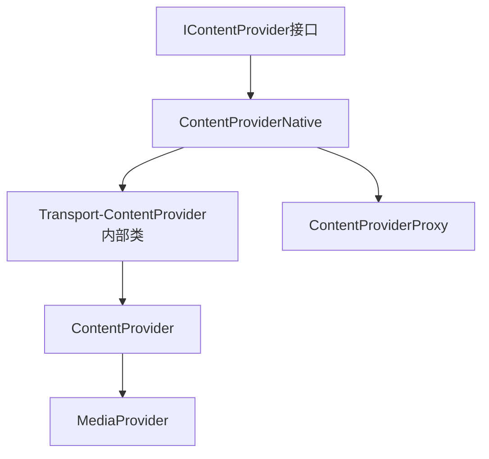
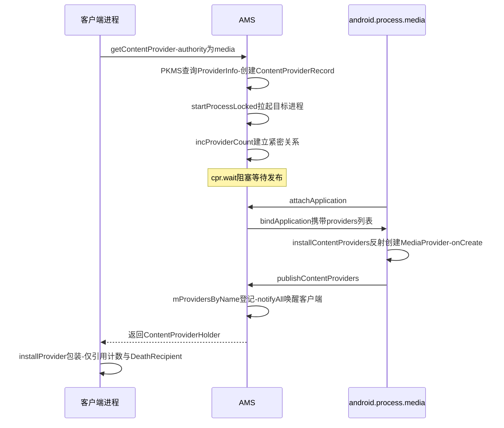
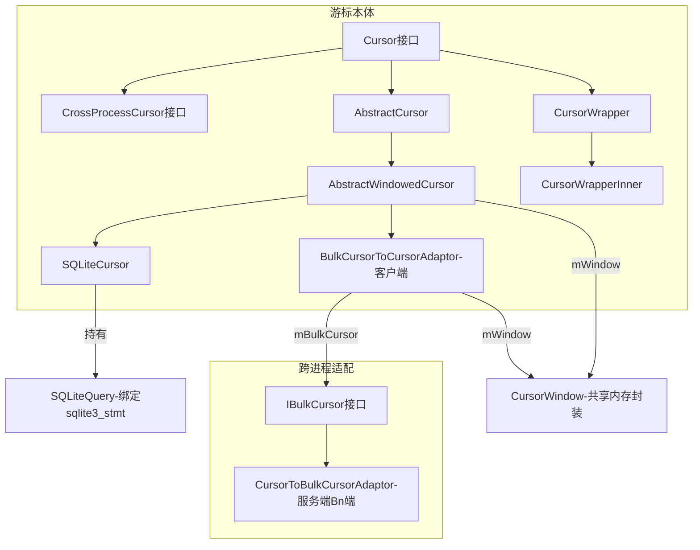
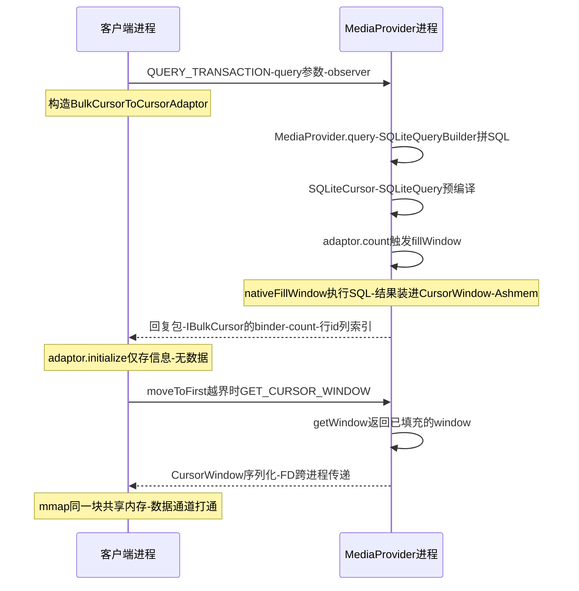

## 6.1 概述

ContentProvider(以下简称 CP)是四大组件中的"数据共享"担当:对外提供统一的 CRUD 接口,底层对接 SQLite、文件或内存数据。原书第 7 章挑选了**四条分析路线**:

1. **第一条**:以客户端通过 `MediaStore.Images.Media.query` 查询 MediaProvider 中图片信息为入口,分析系统如何创建和启动 MediaProvider——着重关注客户端进程、AMS 及 MediaProvider 所在进程间的交互(6.2 节)
2. **第二条**:沿袭第一条路径,将焦点转移到 SQLiteDatabase 如何创建数据库,并顺带介绍 SQLite 相关知识(6.3 节)
3. **第三条**:重点研究 Cursor 的 query 和 close 函数的实现细节(6.4、6.5 节)
4. **第四条**:分析 ContentResolver 的 openAssetFileDescriptor 函数——文件流方式的数据共享(6.6 节)

分析示例(第一、二、三条路线共用):

```java
// MediaProvider 客户端示例
void queryImage(Context context) {
    // ① 得到 ContentResolver 对象
    ContentResolver cr = context.getContentResolver();
    Uri uri = MediaStore.Images.Media.EXTERNAL_CONTENT_URI;
    // ② 查询数据库
    Cursor cursor = MediaStore.Images.Media.query(cr, uri, null);
    cursor.moveToFirst();  // ③ 移动游标到头部
    ......                 // 从游标中取出数据集
    cursor.close();        // ④ 关闭游标
}
```

客户端查询的目标 CP 是 MediaProvider,它运行于 `android.process.media` 进程中。**假设目标进程此时还未启动**——这是本章分析最有意思的起点。

## 6.2 MediaProvider 的启动及创建

本节关注两个问题:

- MediaProvider 所在进程是如何创建的?MediaProvider 实例又是如何创建的?
- 客户端通过什么和位于目标进程中的 MediaProvider 交互?

### 6.2.1 Context 的 getContentResolver 函数

根据第 5 章对 Context 家族的介绍,Context 的 getContentResolver 最终调用它所代理的 ContextImpl 对象:

```java
// ContextImpl.java :: init(节选)
final void init(LoadedApk packageInfo, IBinder activityToken,
        ActivityThread mainThread, Resources container, String basePackageName) {
    ......
    mMainThread = mainThread;  // mainThread 指向 ActivityThread 对象
    // mContentResolver 的真实类型是 ApplicationContentResolver
    mContentResolver = new ApplicationContentResolver(this, mainThread);
    ......
}
```

**`ApplicationContentResolver` 是 ContextImpl 的内部类,继承自 ContentResolver**——它是客户端进程里 ContentResolver 的真实类型。

### 6.2.2 acquireProvider:从客户端到 AMS

`MediaStore.Images.Media.query` 只是 `cr.query(uri, projection, null, null, DEFAULT_SORT_ORDER)` 的一层薄封装(原书借此讨论了"代码清晰易读与运行效率"的取舍)。真正的第一站是 ContentResolver 的 query:

```java
// ContentResolver.java :: query(节选)
public final Cursor query(Uri uri, String[] projection,
        String selection, String[] selectionArgs, String sortOrder) {
    // acquireProvider 由 ContentResolver 实现,根据 uri 提取 authority
    IContentProvider provider = acquireProvider(uri);
    // 拿到 provider 后与目标 CP 交互,见 6.4 节
    ......
}
```

调用链一路"层层转包":

```java
// ContentResolver.java :: acquireProvider
public final IContentProvider acquireProvider(Uri uri) {
    if (!SCHEME_CONTENT.equals(uri.getScheme())) return null;
    String auth = uri.getAuthority();  // 返回目标 CP 的 authority,如 "media"
    if (auth != null) return acquireProvider(mContext, auth);
    return null;
}

// ContextImpl.java :: ApplicationContentResolver.acquireProvider
protected IContentProvider acquireProvider(Context context, String name) {
    // mMainThread 指向应用进程主线程的 ActivityThread,
    // 每个应用进程只有一个 ActivityThread 对象
    return mMainThread.acquireProvider(context, name);
}
```

ActivityThread 的 acquireProvider 与 getProvider 是本节的第一个关键:

```java
// ActivityThread.java :: acquireProvider(节选)
public final IContentProvider acquireProvider(Context c, String name) {
    // ① 调用 getProvider,见下文
    IContentProvider provider = getProvider(c, name);
    ......
    IBinder jBinder = provider.asBinder();
    synchronized (mProviderMap) {
        // 客户端进程把使用的 CP 信息保存到 mProviderRefCountMap,
        // 主要功能与引用计数和资源释放有关(见 6.5 节)
        ProviderRefCount prc = mProviderRefCountMap.get(jBinder);
        if (prc == null) mProviderRefCountMap.put(jBinder, new ProviderRefCount(jBinder, this, 1));
        else prc.count++;
    }
    return provider;
}

// ActivityThread.java :: getProvider(节选)
private IContentProvider getProvider(Context context, String name) {
    // 先查本进程是否已保存与远端 CP 通信的对象,有则直接返回
    IContentProvider existing = getExistingProvider(context, name);
    if (existing != null) return existing;
    IActivityManager.ContentProviderHolder holder = null;
    try {
        // 没有则向 AMS 查询,返回值类型为 ContentProviderHolder
        holder = ActivityManagerNative.getDefault().getContentProvider(
                getApplicationThread(), name);
    } ......
    // 注意:客户端进程也调用 installProvider,见 6.2.4 节
    IContentProvider prov = installProvider(context, holder.provider,
            holder.info, true);
    ......
    return prov;
}
```

`ContentResolver.query` 的第一次 Binder 调用就发生在这里:**向 AMS 的 getContentProvider 要一个 `ContentProviderHolder`**。

### 6.2.3 AMS 的 getContentProviderImpl:拉起目标进程

getContentProvider 的功能主要由 getContentProviderImpl 实现。第一段:解析与登记。

```java
// ActivityManagerService.java :: getContentProviderImpl(节选)
private final ContentProviderHolder getContentProviderImpl(
        IApplicationThread caller, String name) {
    ContentProviderRecord cpr;
    ProviderInfo cpi = null;
    synchronized (this) {
        ProcessRecord r = null;
        if (caller != null) {
            r = getRecordForAppLocked(caller);
            if (r == null) ......  // 查不到调用者则抛 SecurityException
        }
        // name 为目标 CP 的 authority,先查 mProvidersByName
        cpr = mProvidersByName.get(name);
        boolean providerRunning = cpr != null;  // 已注册则不必启动
        if (providerRunning) {
            ......  // 已存在的处理逻辑,读者可自行阅读
        }
        if (!providerRunning) {
            // ① 向 PKMS 查询 authority 对应的 ProviderInfo
            cpi = AppGlobals.getPackageManager().resolveContentProvider(
                    name, STOCK_PM_FLAGS |
                    PackageManager.GET_URI_PERMISSION_PATTERNS);
            ......
            // 权限检查
            if ((msg = checkContentProviderPermissionLocked(cpi, r)) != null)
                throw new SecurityException(msg);
            // 如果 system_server 还没启动完毕,且该 CP 不运行在 system_server 中,
            // 则不允许启动——还记得哪个 CP 运行在 system_server 吗?是 SettingsProvider
            ......
            ComponentName comp = new ComponentName(cpi.packageName, cpi.name);
            cpr = mProvidersByClass.get(comp);
            final boolean firstClass = cpr == null;  // 初次启动时为 true
            if (firstClass) {
                // ② 查 PKMS 得到目标 Application 信息,创建 ContentProviderRecord——
                // 与 ActivityRecord、BroadcastRecord 同一思路
                ApplicationInfo ai = AppGlobals.getPackageManager()
                        .getApplicationInfo(cpi.applicationInfo.packageName,
                                STOCK_PM_FLAGS);
                if (ai == null) return null;
                cpr = new ContentProviderRecord(cpi, ai, comp);
            }
        }
```

第二段:启动目标进程并**等待发布**。

```java
// getContentProviderImpl(续,节选)
            // canRunHere 判断目标 CP 能否运行在调用者进程:
            // (info.multiprocess || info.processName.equals(app.processName))
            //      && (uid == Process.SYSTEM_UID || uid == app.info.uid)
            // 本例 MediaProvider 不能运行在客户端进程中
            if (r != null && cpr.canRunHere(r)) return cpr;
            final int N = mLaunchingProviders.size();
            ......  // 查目标进程是否正处于启动状态
            if (i >= N) {
                final long origId = Binder.clearCallingIdentity();
                ......  // 若 system 未就绪等检查
                // ① 调用 startProcessLocked 创建目标进程(hostingType 为 "content provider")
                ProcessRecord proc = startProcessLocked(cpi.processName,
                        cpr.appInfo, false, 0, "content provider",
                        new ComponentName(cpi.applicationInfo.packageName,
                                cpi.name), false);
                if (proc == null) return null;
                cpr.launchingApp = proc;
                // ② 将其保存到 mLaunchingProviders 中
                mLaunchingProviders.add(cpr);
            }
            if (firstClass) mProvidersByClass.put(comp, cpr);
            mProvidersByName.put(name, cpr);
            // ③ 为客户端进程和目标 CP 进程建立紧密关系:一旦 CP 进程死亡,
            // AMS 将据此找到客户端进程并杀死它们
            incProviderCount(r, cpr);
            if (cpr.launchingApp == null) return null;
            try {
                cpr.wait();  // ④ 阻塞等待,直到目标进程发布该 CP
            } ......
    }  // synchronized(this) 结束
    return cpr;
}
```

**客户端的 query 线程在 `cpr.wait()` 上挂起**,等的就是目标进程把 CP"发布"出来。接下来看目标进程这一侧。

### 6.2.4 目标进程:installContentProviders 与 installProvider

根据第 5 章,目标进程启动后第一件大事是调用 AMS 的 attachApplication,其内部 `attachApplicationLocked` 会通过 PKMS 查询运行在该进程中的 CP 信息(存入 mProvidersByClass),并把它塞进 bindApplication 的参数传给目标进程。客户端侧 `handleBindApplication` 处理时(注意时序:**CP 的安装早于 Application.onCreate 与其他一切组件**):

```java
// ActivityThread.java :: handleBindApplication(节选)
private void handleBindApplication(AppBindData data) {
    ......
    if (!data.restrictedBackupMode) {
        List<ProviderInfo> providers = data.providers;
        if (providers != null) {
            // 安装本 Package 携带的 ContentProvider
            installContentProviders(app, providers);
        }
    }
    ......  // 之后才调用 Application.onCreate
}
```

installContentProviders 的两个关键点:

```java
// ActivityThread.java :: installContentProviders(节选)
private void installContentProviders(Context context,
        List<ProviderInfo> providers) {
    final ArrayList<IActivityManager.ContentProviderHolder> results =
            new ArrayList<IActivityManager.ContentProviderHolder>();
    for (ProviderInfo cpi : providers) {
        // ① 调用 installProvider,注意第二个参数硬编码为 null(目标进程的情况)
        IContentProvider cp = installProvider(context, null, cpi, false);
        if (cp != null) {
            IActivityManager.ContentProviderHolder cph =
                    new IActivityManager.ContentProviderHolder(cpi);
            cph.provider = cp;
            results.add(cph);
            ......  // 创建引用计数
        }
    }
    // ② 调用 AMS 的 publishContentProviders 发布
    ActivityManagerNative.getDefault().publishContentProviders(
            getApplicationThread(), results);
}
```

installProvider 是一个**客户端与目标进程共用**的通用函数,区别只在第二个参数:

```java
// ActivityThread.java :: installProvider(节选)
private IContentProvider installProvider(Context context,
        IContentProvider provider, ProviderInfo info, boolean noisy) {
    ContentProvider localProvider = null;
    if (provider == null) {  // 目标进程的情况
        Context c = null;
        ApplicationInfo ai = info.applicationInfo;
        if (context.getPackageName().equals(ai.packageName)) {
            c = context;
        } ......  // 或通过 createPackageContext 得到正确的 Context——
                  // 只有对应的 Context 才能加载对应 APK 的 Java 字节码
        try {
            final java.lang.ClassLoader cl = c.getClassLoader();
            // 通过 Java 反射机制创建 MediaProvider 实例
            localProvider = (ContentProvider) cl.loadClass(info.name).newInstance();
            // 取出其内部的 Transport(Binder 端)
            provider = localProvider.getIContentProvider();
        } ......
    }
    // 对于 provider 不为 null(客户端)的情况,没有特殊处理,
    // 真正的工作只是引用计数控制和设置 DeathRecipient(讣告接收对象)
    ......
    return provider;  // 返回 IContentProvider 类型的对象
}
```

- **目标进程**调用时第二个参数为 null:反射真正创建 CP 实例,并调 `attachInfo`(内部回调其 onCreate)
- **客户端进程**调用时第二个参数已通过查询 AMS 得到:只做引用计数与 DeathRecipient

### 6.2.5 IContentProvider 的真面目

installProvider 返回的 IContentProvider 到底是什么?看 ContentProvider 家族:



- 每个 ContentProvider 实例中都有一个 `mTransport` 成员,类型为 **Transport**——它从 ContentProviderNative 派生(Binder 服务端,Bn 端)
- 客户端使用的是 **ContentProviderProxy**(定义在 ContentProviderNative.java 中,Bp 端)

服务端 Transport 的 query 做权限检查后转调子类:

```java
// ContentProvider.java :: Transport.query
public Cursor query(Uri uri, String[] projection,
        String selection, String[] selectionArgs, String sortOrder) {
    enforceReadPermission(uri);  // 读权限检查
    // 此处只有一个 MediaProvider 实例,根据多态原理,
    // 最终调用 MediaProvider 实现的 query 函数
    return ContentProvider.this.query(uri, projection, selection,
            selectionArgs, sortOrder);
}
```

### 6.2.6 AMS 的 publishContentProviders:唤醒等待者

```java
// ActivityManagerService.java :: publishContentProviders(节选)
public final void publishContentProviders(IApplicationThread caller,
        List<ContentProviderHolder> providers) {
    synchronized (this) {
        final ProcessRecord r = getRecordForAppLocked(caller);
        final int N = providers.size();
        for (int i = 0; i < N; i++) {
            ContentProviderHolder src = providers.get(i);
            ContentProviderRecord dst = r.pubProviders.get(src.info.name);
            if (dst != null) {
                ......  // 信息分别保存到 mProvidersByClass 和 mProvidersByName
                int NL = mLaunchingProviders.size();
                ......  // 将其从 mLaunchingProviders 移除
                synchronized (dst) {
                    dst.provider = src.provider;  // 保存 Bp 端引用
                    dst.proc = r;
                    // 唤醒还等在 getContentProviderImpl 中的客户端进程
                    dst.notifyAll();
                }
                updateOomAdjLocked(r);  // 调节目标进程的 oom_adj
            }
        }
    }
}
```

客户端从 getContentProvider 返回,调 installProvider(第二个参数非 null),拿到 ContentProviderProxy。**此后客户端的所有 query/insert/update/delete 都是直接与目标进程的 Transport 交互,不再经过 AMS**。

### 6.2.7 启动与创建总结



除了通信通道 IContentProvider 之外,客户端进程和目标 CP 还建立了**非常紧密的关系**:该关系由 getContentProviderImpl 中的 incProviderCount 建立,以 ContentProviderRecord 保存客户端 ProcessRecord 信息为标识——**一旦 CP 进程死亡,AMS 会杀死使用了该 CP 的所有客户端进程**(杀死 MediaProvider,Music 也得死)。撤销这种关系的途径与 Cursor 的 close 有关:Cursor 关闭 → releaseProvider → completeRemoveProvider 按引用计数判断是否调用 AMS 的 removeContentProvider → 删除 ContentProviderRecord 中该客户端的信息。

## 6.3 SQLite 创建数据库分析

MediaProvider 使用 SQLite 数据库管理系统中的多媒体数据。本节以 MediaProvider 创建数据库为入口,介绍 SQLite 及 Java 层的 SQLiteDatabase 家族。

### 6.3.1 SQLite 轻装上阵

SQLite 是一个轻量级数据库:**全部功能实现在单个 sqlite3.c 文件中(约 12 万行代码)**,编译后生成的 libsqlite.so 仅 300 多 KB。原书给了一个直接使用 SQLite native API 的示例程序(sqlitetest),浓缩后的调用骨架:

```c
// SqliteTest.cpp(节选)
static sqlite3* g_pDBHandle = NULL;  // sqlite3 句柄:代表与数据库的连接
int main(int argc, char* argv[]) {
    unlink(DB_PATH);                                   // 先删除旧的数据库文件
    int ret = sqlite3_open(DB_PATH, &g_pDBHandle);     // ① 打开数据库
    ret = sqlite3_exec(g_pDBHandle,
        "CREATE TABLE personal_info(ID INTEGER primary key autoincrement,"
        "name TEXT,age INTEGER,sex TEXT)", NULL, NULL, NULL);  // ② 执行建表 SQL
    sqlite3_stmt* pstmt = NULL;                        // sqlite3_stmt 代表一条 SQL 语句
    ret = sqlite3_prepare(g_pDBHandle,
        "INSERT INTO personal_info(name,age,sex) VALUES(?,?,?)",
        -1, &pstmt, NULL);                             // ③ 预编译,问号为通配符
    sqlite3_bind_text(pstmt, 1, "dengfanping", -1, SQLITE_STATIC);  // ④ 绑定参数
    sqlite3_bind_int(pstmt, 2, 30);
    sqlite3_bind_text(pstmt, 3, "male", -1, SQLITE_STATIC);
    ret = sqlite3_step(pstmt);                         // ⑤ 执行
    sqlite3_finalize(pstmt);                           // ⑥ 销毁语句
    ret = sqlite3_prepare(g_pDBHandle,
        "SELECT age FROM personal_info WHERE name = ?", -1, &pstmt, NULL);
    sqlite3_bind_text(pstmt, 1, "dengfanping", -1, SQLITE_STATIC);
    while (sqlite3_step(pstmt) == SQLITE_ROW) {        // 循环遍历结果集
        int myage = sqlite3_column_int(pstmt, 0);      // 取第 0 列的值
    }
    sqlite3_finalize(pstmt);
    sqlite3_close(g_pDBHandle);                        // ⑦ 关闭数据库
    return 0;
}
```

SQLite API 的使用要点:**sqlite3 实例代表数据库连接;sqlite3_stmt 实例代表一条 SQL 语句(prepare 绑定 → bind 通配符 → step 执行/遍历 → finalize 释放);查询结果用 sqlite3_step 遍历、sqlite3_column_xxx 取列值**。

这份简单只属于 Native 层开发者。Java 层面对的是 Android 在 SQLite API 之上"叹为观止"的封装——**SQLiteDatabase 家族有 61 个成员之多**。核心几位:

| 类 | 职责 |
|---|---|
| `SQLiteOpenHelper` | 帮助类,方便开发者创建和管理数据库(onCreate/onUpgrade) |
| `SQLiteQueryBuilder` | 帮助类,帮助开发者拼装 SQL 语句 |
| `SQLiteDatabase` | 代表 SQLite 数据库,内部封装一个 Native 层 sqlite3 实例 |
| `SQLiteProgram` | 与 SQL 语句相关类的基类,提供参数绑定 API |
| `SQLiteQuery` | 用于 query 查询操作 |
| `SQLiteStatement` | 用于 query 之外的操作(结果集最多 1 行 1 列) |
| `SQLiteCompiledSql` | 对开发者隐藏的类,封装 Native 层的 sqlite3_stmt 实例 |
| `SQLiteClosable` | 控制家族成员的生命周期:acquireReference/releaseReference 引用计数 |

### 6.3.2 MediaProvider 创建数据库:延迟创建策略

MediaProvider 中触发数据库创建的是 attachVolume 函数:

```java
// MediaProvider.java :: attachVolume(节选)
private Uri attachVolume(String volume) {
    Context context = getContext();
    DatabaseHelper db;
    if (INTERNAL_VOLUME.equals(volume)) {
        ......  // 针对内部存储空间的数据库
    } else if (EXTERNAL_VOLUME.equals(volume)) {
        String dbName = "external-" + Integer.toHexString(volumeID) + ".db";
        // ① 构造一个 DatabaseHelper 对象
        db = new DatabaseHelper(context, dbName, false, false, mObjectRemovedCallback);
    } ......
    if (!db.mInternal) {
        // ② 调用 getWritableDatabase 得到 SQLiteDatabase 对象
        createDefaultFolders(db.getWritableDatabase());
    }
    ......
}
```

DatabaseHelper 是 MediaProvider 的内部类,从 SQLiteOpenHelper 派生。注意其基类构造函数**并不创建数据库对象**——此处使用了**延迟创建(lazy creation)策略,即 SQLiteDatabase 实例真正创建的时机是第一次使用它的时候**。延迟创建"重型"资源(占内存大或创建时间长)是系统开发的常用策略,与之配套,资源释放采用引用计数技术(SQLiteClosable)。

getWritableDatabase 的核心逻辑:

```java
// SQLiteOpenHelper.java :: getWritableDatabase(节选)
public synchronized SQLiteDatabase getWritableDatabase() {
    if (mDatabase != null) {  // 以后的调用直接返回已创建好的 mDatabase
        ......
    }
    SQLiteDatabase db = null;
    mIsInitializing = true;
    try {
        if (mName == null) {
            db = SQLiteDatabase.create(null);
        } else {
            // ① 调用 Context 的 openOrCreateDatabase 创建数据库
            db = mContext.openOrCreateDatabase(mName, 0, mFactory, mErrorHandler);
        }
        int version = db.getVersion();
        if (version != mNewVersion) {
            db.beginTransaction();
            try {
                if (version == 0) {
                    onCreate(db);        // 初次创建:子类建表
                } else {
                    if (version > mNewVersion)
                        onDowngrade(db, version, mNewVersion);
                    else
                        onUpgrade(db, version, mNewVersion);  // 版本升级
                }
                db.setVersion(mNewVersion);
                db.setTransactionSuccessful();
            } finally {
                db.endTransaction();
            }
        }
        onOpen(db);
        return db;
    } ......
}
```

onCreate/onUpgrade/onOpen 均由子类 DatabaseHelper 实现——这就是应用层熟知的 SQLiteOpenHelper 样板在 framework 中的原始实现。

### 6.3.3 openOrCreateDatabase:Java 层到 sqlite3 实例

```java
// ContextImpl.java :: openOrCreateDatabase
public SQLiteDatabase openOrCreateDatabase(String name, int mode,
        CursorFactory factory, DatabaseErrorHandler errorHandler) {
    File f = validateFilePath(name, true);
    SQLiteDatabase db = SQLiteDatabase.openOrCreateDatabase(f.getPath(),
            factory, errorHandler);
    setFilePermissionsFromMode(f.getPath(), mode, 0);
    return db;
}

// SQLiteDatabase.java :: openDatabase(节选)
private static SQLiteDatabase openDatabase(String path, CursorFactory factory,
        int flags, DatabaseErrorHandler errorHandler, short connectionNum) {
    // 构造一个 SQLiteDatabase 实例
    SQLiteDatabase db = new SQLiteDatabase(path, factory, flags, errorHandler,
            connectionNum);
    db.dbopen(path, flags);  // dbopen 是 native 函数,打开数据库
    db.setLocale(Locale.getDefault());
    return db;
}
```

dbopen 的 JNI 实现——**Java 层 SQLiteDatabase 对象在这里与 Native 层 sqlite3 实例绑定**:

```cpp
// android_database_SQLiteDatabase.cpp :: dbopen(节选)
static void dbopen(JNIEnv* env, jobject object, jstring pathString, jint flags) {
    int err;
    sqlite3* handle = NULL;
    char const* path8 = env->GetStringUTFChars(pathString, NULL);
    int sqliteFlags;
    if (flags & CREATE_IF_NECESSARY) {
        sqliteFlags = SQLITE_OPEN_READWRITE | SQLITE_OPEN_CREATE;
    } ......
    // 调用 sqlite3_open_v2 创建数据库,handle 存储新创建的 sqlite3 实例
    err = sqlite3_open_v2(path8, &handle, sqliteFlags, NULL);
    ......
    sqlite3_busy_timeout(handle, 1000 /* ms */);  // 忙等超时 1 秒
    // Android 在原生 SQLite 之上做的定制,见 6.3.5 节
    err = register_android_functions(handle, UTF16_STORAGE);
    // 将 handle 保存到 Java 层 SQLiteDatabase 对象中,绑定完成
    env->SetIntField(object, offset_db_handle, (int) handle);
    ......
}
```

SQLiteDatabase 构造函数里还有一处值得一提:读取 `config_cursorWindowSize`(值为 2048),乘以 1024×4 后通过 `native_setSqliteSoftHeapLimit` 设置 SQLite 的软堆上限(约 8MB)。

### 6.3.4 SQLiteCompiledSql:sqlite3_stmt 的封装与缓存

对开发者隐藏的 SQLiteCompiledSql 类完成了 Native 层 sqlite3_stmt 实例的封装:

```java
// SQLiteCompiledSql.java :: 构造函数(节选)
SQLiteCompiledSql(SQLiteDatabase db, String sql) {
    db.verifyDbIsOpen();
    db.verifyLockOwner();
    mDatabase = db;
    mSqlStmt = sql;
    ......
    nHandle = db.mNativeHandle;
    native_compile(sql);  // native 函数,内部调 sqlite3_prepare16_v2
}
```

```cpp
// android_database_SQLiteCompiledSql.cpp :: compile(节选)
sqlite3_stmt* compile(JNIEnv* env, jobject object,
                      sqlite3* handle, jstring sqlString) {
    sqlite3_stmt* statement = GET_STATEMENT(env, object);
    if (statement != NULL) ......  // 释放之前的 sqlite3_stmt 实例
    jchar const* sql = env->GetStringChars(sqlString, NULL);
    // 调用 sqlite3_prepare16_v2 得到一个 sqlite3_stmt 实例
    err = sqlite3_prepare16_v2(handle, sql, sqlLen * 2, &statement, NULL);
    env->ReleaseStringChars(sqlString, sql);
    if (err == SQLITE_OK) {
        // 保存到 Java 层的 SQLiteCompiledSql 对象中
        env->SetIntField(object, gStatementField, (int) statement);
        return statement;
    }
    ......
}
```

### 6.3.5 Android 对 SQLite 的定制:自定义函数

MediaProvider 的 onCreate 中设置了一个触发器(Trigger,在指定表上发生特定事情时数据库要执行的操作):

```sql
-- MediaProvider 建表时创建的触发器(节选)
CREATE TRIGGER IF NOT EXISTS images_cleanup DELETE ON images
BEGIN
    DELETE FROM thumbnails WHERE image_id = old._id;  -- 原图没了,缩略图也没用
    SELECT _DELETE_FILE(old._data);                   -- 删除原图文件本身
END
```

`_DELETE_FILE` 这个"SQL 函数"是哪来的?答案在 dbopen 调用的 register_android_functions 中:

```cpp
// sqlite3_android.cpp :: register_android_functions(节选)
extern "C" int register_android_functions(sqlite3* handle, int utf16Storage) {
    int err;
    UErrorCode status = U_ZERO_ERROR;
    UCollator* collator = ucol_open(NULL, &status);
    if (utf16Storage) {
        err = sqlite3_exec(handle, "PRAGMA encoding = 'UTF-16'", 0, 0, 0);
    } else {
        // 注册名为 "UNICODE" 的本地化排序比较函数
        err = sqlite3_create_collation_v2(handle, "UNICODE",
                SQLITE_UTF8, collator, collate8,
                (void(*)(void*)) localized_collator_dtor);
    }
    // 注册 PHONE_NUMBERS_EQUAL:SQL 语句中用的函数名 → Native 层 phone_numbers_equal
    err = sqlite3_create_function(
            handle, "PHONE_NUMBERS_EQUAL", 2, SQLITE_UTF8,
            NULL, phone_numbers_equal, NULL, NULL);
    ......
    // 注册 _DELETE_FILE 对应的 Native 函数 delete_file
    err = sqlite3_create_function(handle, "_DELETE_FILE", 1, SQLITE_UTF8,
            NULL, delete_file, NULL, NULL);
    ......
    return SQLITE_OK;
}
```

delete_file 的实现颇费笔墨——它会校验路径确实位于 EXTERNAL_STORAGE 或 SECONDARY_STORAGE 环境变量指示的挂载目录之下,才调用 unlink 删除文件:

```cpp
// sqlite3_android.cpp :: delete_file(节选)
static void delete_file(sqlite3_context* context, int argc,
                        sqlite3_value** argv) {
    // 从 argv 中取出触发器调用 _DELETE_FILE 时传递的文件路径
    char const* path = (char const*) sqlite3_value_text(argv[0]);
    // 4.0 起系统支持多个存储空间:EXTERNAL_STORAGE 指向 sd 卡挂载目录,
    // SECONDARY_STORAGE 表示其他存储设备挂载目录(冒号分隔)
    bool good_path = false;
    char const* external_storage = getenv("EXTERNAL_STORAGE");
    if (external_storage && strncmp(external_storage, path,
                                    strlen(external_storage)) == 0) {
        good_path = true;
    } else {
        // 逐段检查 SECONDARY_STORAGE 中的各挂载目录
        ......
    }
    if (!good_path) {
        sqlite3_result_null(context);  // 路径不合法则不删除
        return;
    }
    int err = unlink(path);            // 调用 unlink 删除文件
    sqlite3_result_int(context, err != -1 ? 1 : 0);
}
```

原书作者在此有个惨痛提示:不知道这个触发器存在时,好不容易下载的测试文件会在删除数据库记录后被悄悄删掉;频繁挂/卸载 SD 卡时 MediaProvider 的设计缺陷也可能错误删除数据库信息,连带实体文件被删。

## 6.4 Cursor 的 query 实现

现在回到 6.2.2 留下的悬念:ContentResolver.query 拿到 provider 之后做了什么。

```java
// ContentResolver.java :: query(节选)
public final Cursor query(Uri uri, String[] projection,
        String selection, String[] selectionArgs, String sortOrder) {
    // provider 的真实类型是 ContentProviderProxy,
    // 对应 Bn 端是 ContentProvider 内部类 Transport
    IContentProvider provider = acquireProvider(uri);
    try {
        long startTime = SystemClock.uptimeMillis();
        // ① 调用远端进程的 query 函数
        Cursor qCursor = provider.query(uri, projection,
                selection, selectionArgs, sortOrder);
        if (qCursor == null) {
            releaseProvider(provider);  // 结果为空则释放 provider
            return null;
        }
        // ② 计算查询结果包含的数据项条数,结果保存在 qCursor 的内部变量中
        qCursor.getCount();
        long durationMillis = SystemClock.uptimeMillis() - startTime;
        // ③ 最终返回给客户端的游标对象,真实类型是 CursorWrapperInner
        return new CursorWrapperInner(qCursor, provider);
    }
}
```

### 6.4.1 提取 query 两端的关键点

Bp 端 ContentProviderProxy.query 与 4.0 时代常见的"手写 Binder 代理"结构一致:

```java
// ContentProviderNative.java :: ContentProviderProxy.query(节选)
public Cursor query(Uri url, String[] projection, String selection,
        String[] selectionArgs, String sortOrder) throws RemoteException {
    // ① 构造一个 BulkCursorToCursorAdaptor 对象
    BulkCursorToCursorAdaptor adaptor = new BulkCursorToCursorAdaptor();
    Parcel data = Parcel.obtain();
    Parcel reply = Parcel.obtain();
    try {
        data.writeInterfaceToken(IContentProvider.descriptor);
        ......  // 将参数打包到 data 请求包中
        // ② adaptor.getObserver 返回 IContentObserver 对象,也打包进请求包
        //   (ContentObserver 相关知识见第 7 章笔记)
        data.writeStrongBinder(adaptor.getObserver().asBinder());
        // 发送请求给远端的 Bn 端
        mRemote.transact(IContentProvider.QUERY_TRANSACTION, data, reply, 0);
        DatabaseUtils.readExceptionFromParcel(reply);
        // ③ 从回复包中得到一个 IBulkCursor 类型的对象
        IBulkCursor bulkCursor =
                BulkCursorNative.asInterface(reply.readStrongBinder());
        if (bulkCursor != null) {
            int rowCount = reply.readInt();
            int idColumnPosition = reply.readInt();
            boolean wantsAllOnMoveCalls = reply.readInt() != 0;
            // ④ 调用 adaptor 的 initialize 函数
            adaptor.initialize(bulkCursor, rowCount,
                    idColumnPosition, wantsAllOnMoveCalls);
        }
        return adaptor;
    } finally {
        data.recycle();
        reply.recycle();
    }
}
```

服务端 onTransact 的对应处理:

```java
// ContentProviderNative.java :: onTransact(节选)
case QUERY_TRANSACTION: {  // 处理 query 请求
    data.enforceInterface(IContentProvider.descriptor);
    Uri url = Uri.CREATOR.createFromParcel(data);
    ......  // 从请求包中提取参数
    // ⑤ 创建 ContentObserver Binder 通信的 Bp 端
    IContentObserver observer = IContentObserver.Stub.asInterface(
            data.readStrongBinder());
    // ⑥ 调用 MediaProvider 实现的 query 函数
    Cursor cursor = query(url, projection, selection, selectionArgs, sortOrder);
    if (cursor != null) {
        // ⑦ 创建一个 CursorToBulkCursorAdaptor 对象
        CursorToBulkCursorAdaptor adaptor = new CursorToBulkCursorAdaptor(
                cursor, observer, getProviderName());
        final IBinder binder = adaptor.asBinder();
        // ⑧ 返回结果集所含记录项的条数——这个函数看起来极不起眼,却非常关键
        final int count = adaptor.count();
        // 返回名为 "_id" 的列在结果集中的索引位置
        final int index = BulkCursorToCursorAdaptor.findRowIdColumnIndex(
                adaptor.getColumnNames());
        final boolean wantsAllOnMoveCalls = adaptor.getWantsAllOnMoveCalls();
        reply.writeNoException();
        reply.writeStrongBinder(binder);  // binder 信息写到 reply 回复包
        reply.writeInt(count);            // 结果集行数返回给客户端
        reply.writeInt(index);
        reply.writeInt(wantsAllOnMoveCalls ? 1 : 0);
    }
    return true;
}
```

两端冒出了一批新类型:客户端的 **BulkCursorToCursorAdaptor** 与 **IBulkCursor**(Bp 端)、服务端的 **CursorToBulkCursorAdaptor**(IBulkCursor 的 Bn 端)以及 MediaProvider query 返回的 Cursor(真实类型待查)。**query 的难度不在游戏规则,而在它所做的层层封装**。

### 6.4.2 MediaProvider 的 query:SQLiteCursor 登场

```java
// MediaProvider.java :: query(节选)
public Cursor query(Uri uri, String[] projectionIn, String selection,
        String[] selectionArgs, String sort) {
    int table = URI_MATCHER.match(uri);
    // 根据 uri 取对应的 DatabaseHelper——MediaProvider 针对内部存储和
    // 外部存储(SD 卡)的媒体文件分别创建了两个数据库
    DatabaseHelper database = getDatabaseForUri(uri);
    SQLiteDatabase db = database.getReadableDatabase();
    SQLiteQueryBuilder qb = new SQLiteQueryBuilder();
    ......  // 设置 qb 的参数,如 setTables 设定目标表
    // ① 调用 SQLiteQueryBuilder 的 query 函数
    Cursor c = qb.query(db, projectionIn, selection,
            combine(prependArgs, selectionArgs), groupBy, null, sort, limit);
    if (c != null) {
        // ② 设置通知 Uri,与 ContentObserver 有关
        c.setNotificationUri(getContext().getContentResolver(), uri);
    }
    return c;
}
```

往下一路是 SQLiteDatabase 家族内部的接力:

```java
// SQLiteQueryBuilder.java :: query(节选)
public Cursor query(SQLiteDatabase db, String[] projectionIn,
        String selection, String[] selectionArgs, String groupBy,
        String having, String sortOrder, String limit) {
    // buildQuery 拼出 SQL 语句字符串(防注入的 selection 拼装)
    String sql = buildQuery(projectionIn, selection, groupBy, having,
            sortOrder, limit);
    return db.rawQueryWithFactory(mFactory, sql, selectionArgs,
            SQLiteDatabase.findEditTable(mTables));
}

// SQLiteDatabase.java :: rawQueryWithFactory(节选)
public Cursor rawQueryWithFactory(CursorFactory cursorFactory, String sql,
        String[] selectionArgs, String editTable) {
    verifyDbIsOpen();
    BlockGuard.getThreadPolicy().onReadFromDisk();
    // 获取数据库连接(getDbConnection,带连接缓存)
    SQLiteDatabase db = getDbConnection(sql);
    // 创建一个 SQLiteDirectCursorDriver 对象
    SQLiteCursorDriver driver = new SQLiteDirectCursorDriver(db, sql, editTable);
    try {
        // 调用 SQLiteCursorDriver 的 query 函数
        cursor = driver.query(cursorFactory != null ? cursorFactory : mFactory,
                selectionArgs);
    } finally {
        releaseDbConnection(db);
    }
    return cursor;
}

// SQLiteDirectCursorDriver.java :: query(节选)
public Cursor query(CursorFactory factory, String[] selectionArgs) {
    SQLiteQuery query = null;
    try {
        mDatabase.lock(mSql);
        mDatabase.closePendingStatements();
        // ① 构造一个 SQLiteQuery 对象
        query = new SQLiteQuery(mDatabase, mSql, 0, selectionArgs);
        // ② factory 为空时,游标的真实类型就是 SQLiteCursor
        mCursor = new SQLiteCursor(this, mEditTable, query);
        mQuery = query;
        query = null;
        return mCursor;  // 原来返回的 cursor 对象其真实类型是 SQLiteCursor
    } finally {
        if (query != null) query.close();
        mDatabase.unlock();
    }
}
```

**MediaProvider query 返回的游标,真实类型是 SQLiteCursor**。SQLiteQuery 则从 SQLiteProgram 派生,构造时触发 SQL 预编译:

```java
// SQLiteProgram.java :: 构造函数(节选)
SQLiteProgram(SQLiteDatabase db, String sql, Object[] bindArgs,
        boolean compileFlag) {
    mSql = sql.trim();
    int n = DatabaseUtils.getSqlStatementType(mSql);
    switch (n) {
        case DatabaseUtils.STATEMENT_UPDATE:
            mStatementType = n | STATEMENT_CACHEABLE;
            break;
        case DatabaseUtils.STATEMENT_SELECT:
            // SELECT 语句可缓存:避免再次执行同样命令时重新构造对象
            mStatementType = n | STATEMENT_CACHEABLE | STATEMENT_USE_POOLED_CONN;
            break;
        ......
    }
    db.acquireReference();  // 增加引用计数
    db.addSQLiteClosable(this);
    mDatabase = db;
    nHandle = db.mNativeHandle;  // 对应一个 sqlite3 实例
    if (bindArgs != null) ......  // 绑定参数
    // 为此对象绑定一个 native 层 sqlite3_stmt 实例,指针保存在 nStatement 成员
    if (compileFlag) compileAndBindAllArgs();
}

// SQLiteProgram.java :: compileSql(节选)
private void compileSql() {
    // 不可缓存的语句每次都新建 SQLiteCompiledSql 对象
    if ((mStatementType & STATEMENT_CACHEABLE) == 0) {
        mCompiledSql = new SQLiteCompiledSql(mDatabase, mSql);
        nStatement = mCompiledSql.nStatement;
        return;
    }
    // 可缓存:先查 SQLiteDatabase 中是否已缓存同样 SQL 的 SQLiteCompiledSql
    mCompiledSql = mDatabase.getCompiledStatementForSql(mSql);
    if (mCompiledSql == null) {
        mCompiledSql = new SQLiteCompiledSql(mDatabase, mSql);
        mCompiledSql.acquire();
        mDatabase.addToCompiledQueries(mSql, mCompiledSql);
    }
    // 保存 native 层 sqlite3_stmt 实例指针到 nStatement 成员
    nStatement = mCompiledSql.nStatement;
}
```

**SQL 编译是昂贵步骤**——SQLiteDatabase 框架把 SQL 语句字符串与 SQLiteCompiledSql 对象缓存起来,下次执行同样的 SELECT 直接复用,免去重新 prepare。

### 6.4.3 Cursor 家族与 CursorWindow

至此可以请出 Cursor 家族:



- SQLiteCursor 内部保存一个已绑定 sqlite3_stmt 实例的 SQLiteQuery,可把它看成**已包含查询结果集的游标对象(虽然此时还未真正执行 SQL 语句)**
- 结果集目前还属于 MediaProvider 进程,需跨进程传递——用的是**共享内存**,封装类为 **CursorWindow**("A buffer containing multiple cursor rows")
- SQLiteDatabase 框架希望客户端看到的不是共享内存,而是一个游标对象,好像查询的是本进程数据库一样——为此构造了右侧的 Adaptor 家族,通过 mBulkCursor 参与 Binder 通信

### 6.4.4 服务端:count 触发 fillWindow

onTransact 中"极不起眼却非常关键"的 adaptor.count():

```java
// CursorToBulkCursorAdaptor.java :: count(节选)
public int count() {
    synchronized (mLock) {
        throwIfCursorIsClosed();
        // mCursor 的真实类型是 SQLiteCursor
        return mCursor.getCount();
    }
}

// SQLiteCursor.java :: getCount
public int getCount() {
    if (mCount == NO_COUNT) {  // NO_COUNT 为 -1,首次调用满足条件
        fillWindow(0);         // 关键函数
    }
    return mCount;
}

// SQLiteCursor.java :: fillWindow
private void fillWindow(int startPos) {
    // ① CursorWindow 已存在则清空,否则新创建一个
    clearOrCreateLocalWindow(getDatabase().getPath());
    mWindow.setStartPosition(startPos);
    // ② 调用 SQLiteQuery 的 fillWindow
    int count = getQuery().fillWindow(mWindow);
    if (startPos == 0) {
        mCount = count;
    } ......
}
```

CursorWindow 的创建,Java 层到 Ashmem(Anonymous Shared Memory,匿名共享内存):

```java
// CursorWindow.java :: 构造函数
public CursorWindow(String name, boolean localWindow) {
    mStartPos = 0;  // 本次查询的起始行位置
    // sCursorWindowSize 为 2MB,取自 config.xml 的 config_cursorWindowSize(2048KB)
    mWindowPtr = nativeCreate(name, sCursorWindowSize, localWindow);
    mCloseGuard.open("close");
    recordNewWindow(Binder.getCallingPid(), mWindowPtr);
}
```

```cpp
// CursorWindow.cpp :: create(节选)
status_t CursorWindow::create(const String8& name, size_t size, bool localOnly,
                              CursorWindow** outCursorWindow) {
    String8 ashmemName("CursorWindow: ");
    ashmemName.append(name);
    // 调用 Android 平台的 ashmem_create_region 创建共享内存
    int ashmemFd = ashmem_create_region(ashmemName.string(), size);
    if (ashmemFd < 0) {
        result = -errno;
    } else {
        result = ashmem_set_prot_region(ashmemFd, PROT_READ | PROT_WRITE);
        if (result >= 0) {
            // 映射共享内存,data 变量指向该地址的起始位置
            void* data = ::mmap(NULL, size, PROT_READ | PROT_WRITE,
                                MAP_SHARED, ashmemFd, 0);
            ......
            result = ashmem_set_prot_region(ashmemFd, PROT_READ);
            if (result >= 0) {
                // 创建一个 Native 层 CursorWindow 对象
                CursorWindow* window = new CursorWindow(name, ashmemFd,
                                                        data, size, false);
                result = window->clear();
                if (!result) {
                    *outCursorWindow = window;
                    return OK;
                }
            }
        }
    }
    return result;
}
```

SQLiteQuery.fillWindow 则把 SQL 真正执行的结果装进这块共享内存:

```java
// SQLiteQuery.java :: fillWindow(节选)
int fillWindow(CursorWindow window) {
    mDatabase.lock(mSql);
    long timeStart = SystemClock.uptimeMillis();
    try {
        acquireReference();
        window.acquireReference();
        // nHandle 指向 sqlite3 实例,nStatement 指向 sqlite3_stmt 实例,
        // window.mWindowPtr 指向 Native 层 CursorWindow 实例;
        // mOffsetIndex 与 SQL 的 OFFSET 通配符有关(如 LIMIT 10 OFFSET ?)
        int numRows = nativeFillWindow(nHandle, nStatement,
                window.mWindowPtr, window.getStartPosition(), mOffsetIndex);
        mDatabase.logTimeStat(mSql, timeStart);
        return numRows;
    } finally {
        window.releaseReference();
        releaseReference();
        mDatabase.unlock();
    }
}
```

```cpp
// android_database_SQLiteQuery.cpp :: nativeFillWindow(节选)
static jint nativeFillWindow(JNIEnv* env, jclass clazz, jint databasePtr,
        jint statementPtr, jint windowPtr, jint startPos, jint offsetParam) {
    sqlite3* database = reinterpret_cast<sqlite3*>(databasePtr);
    sqlite3_stmt* statement = reinterpret_cast<sqlite3_stmt*>(statementPtr);
    CursorWindow* window = reinterpret_cast<CursorWindow*>(windowPtr);
    if (offsetParam > 0) {
        // 设置了 OFFSET 则为其绑定起始行
        int err = sqlite3_bind_int(statement, offsetParam, startPos);
    }
    int numColumns = sqlite3_column_count(statement);  // 结果集列数
    status_t status = window->setNumColumns(numColumns);
    int retryCount = 0, totalRows = 0, addedRows = 0;
    bool windowFull = false, gotException = false;
    const bool countAllRows = (startPos == 0);
    // 核心循环:遍历 SQL 结果集,将数据取出来保存到 CursorWindow 中
    while (!gotException && (!windowFull || countAllRows)) {
        int err = sqlite3_step(statement);
        if (err == SQLITE_ROW) {
            retryCount = 0;
            totalRows += 1;
            if (startPos >= totalRows || windowFull) continue;
            // 在共享内存中分配一行空间
            status = window->allocRow();
            if (status) { windowFull = true; continue; }  // 2MB 用完了
            for (int i = 0; i < numColumns; i++) {
                int type = sqlite3_column_type(statement, i);
                if (type == SQLITE_TEXT) {
                    // 字符串列:取出并 putString 保存到共享内存
                    const char* text = reinterpret_cast<const char*>(
                            sqlite3_column_text(statement, i));
                    size_t sizeIncludingNull = sqlite3_column_bytes(statement, i) + 1;
                    status = window->putString(addedRows, i, text, sizeIncludingNull);
                    if (status) { windowFull = true; break; }
                } ......  // 处理其他数据类型
            }
            if (windowFull || gotException) window->freeLastRow();
            else addedRows += 1;
        } else if (err == SQLITE_DONE) {
            break;  // 结果集所有行都遍历完
        } else if (err == SQLITE_LOCKED || err == SQLITE_BUSY) {
            // 数据库被锁:最多等 50 次,每次 1 毫秒
            if (retryCount > 50) { gotException = true; }
            else { usleep(1000); retryCount++; }
        } ......
    }
    sqlite3_reset(statement);  // 重置 sqlite3_stmt 实例,以供下次使用
    return countAllRows ? totalRows : 0;
}
```

注意窗口装满(windowFull)后循环仍会继续空转到结果集末尾——**startPos 为 0 时 fillWindow 顺便把总行数也数出来了**,这正是 getCount 需要的。

### 6.4.5 客户端:moveToFirst 才真正建立数据通道

客户端的 BulkCursorToCursorAdaptor.initialize 与 CursorWrapperInner 的构造都只是保存信息,**并未获取共享内存**——数据通道的打通又和 lazy creation 联系上了:只在使用它时才打通。游标的使用必须先调 move 家族函数:

```java
// AbstractCursor.java :: moveToPosition(节选)
public final boolean moveToPosition(int position) {
    // getCount 返回的行数在搭建 Binder 通道时已由服务端计算并返回
    final int count = getCount();
    if (position >= count) { mPos = count; return false; }
    if (position < 0) { mPos = -1; return false; }
    if (position == mPos) return true;
    // onMove 为抽象函数,由子类实现
    boolean result = onMove(mPos, position);
    if (result == false) mPos = -1;
    else {
        mPos = position;
        if (mRowIdColumnIndex != -1) {
            mCurrentRowID = Long.valueOf(getLong(mRowIdColumnIndex));
        }
    }
    return result;
}
```

客户端 BulkCursorToCursorAdaptor 的 onMove:

```java
// BulkCursorToCursorAdaptor.java :: onMove(节选)
public boolean onMove(int oldPosition, int newPosition) {
    throwIfCursorIsClosed();
    try {
        // mWindow 第一次为 null;目标行超出窗口范围时也要重新取
        if (mWindow == null
                || newPosition < mWindow.getStartPosition()
                || newPosition >= mWindow.getStartPosition()
                        + mWindow.getNumRows()) {
            // 调用服务端 IBulkCursor 的 getWindow:调用完毕,
            // 客户端就得到了 CursorWindow——数据通道自此打通
            setWindow(mBulkCursor.getWindow(newPosition));
        } else if (mWantsAllOnMoveCalls) {
            mBulkCursor.onMove(newPosition);
        }
    } ......
    if (mWindow == null) return false;
    return true;
}
```

getWindow 的 Bp 端(BulkCursorProxy)发出 GET_CURSOR_WINDOW_TRANSACTION 请求,回复包中 `CursorWindow.newFromParcel(reply)` 反序列化得到本地 CursorWindow;Bn 端:

```java
// CursorToBulkCursorAdaptor.java :: getWindow(节选)
public CursorWindow getWindow(int startPos) {
    synchronized (mLock) {
        throwIfCursorIsClosed();
        CursorWindow window;
        // mCursor 真实类型是 SQLiteCursor,是 AbstractWindowedCursor
        if (mCursor instanceof AbstractWindowedCursor) {
            AbstractWindowedCursor windowedCursor = (AbstractWindowedCursor) mCursor;
            // count 阶段已创建并填充过 CursorWindow,故 window 不为空
            window = windowedCursor.getWindow();
            if (window == null) {
                window = new CursorWindow(mProviderName, false);
                windowedCursor.setWindow(window);
            }
            // 调用 SQLiteCursor 的 moveToPosition,内部触发其 onMove
            mCursor.moveToPosition(startPos);
        } else {
            ......
        }
        if (window != null) window.acquireReference();
        return window;  // 返回的正是 count 函数中创建的那个 CursorWindow
    }
}
```

服务端 SQLiteCursor 的 onMove 做了对应的窗口优化:

```java
// SQLiteCursor.java :: onMove
public boolean onMove(int oldPosition, int newPosition) {
    if (mWindow == null || newPosition < mWindow.getStartPosition() ||
            newPosition >= (mWindow.getStartPosition() + mWindow.getNumRows())) {
        // 窗口不存在,或目标行超出当前窗口范围(上次查询第 10~100 行,
        // 这次要第 0 行或第 101 行),才重新 fillWindow
        fillWindow(newPosition);
    }
    return true;
}
```

客户端 onMove 里的 if 判断同理:**目标行落在已有窗口内时,根本不会发起 Binder 请求**。结果集超过 2MB 窗口时,游标每移出窗口就触发一次跨进程再装填(getWindow → fillWindow)——用户快速滑动长列表时的卡顿就来自这条路径。

### 6.4.6 query 全链路总结



**query 的本质工作很简单:把数据复制到共享内存**。之所以涉及如此多的类,全是"让客户端像查询本进程数据库一样使用游标"这一封装目标带来的代价。原书作者认为 Cursor 的架构设计有些过度(over-designed),层层封装既增加分析难度,也损失运行效率。

## 6.5 Cursor 的 close 函数实现

Cursor 是重型资源:**不仅占用一个文件描述符,还共享了一块 2MB 的内存**,务必显式 close。

### 6.5.1 客户端 close 的调用链

客户端拿到的是 CursorWrapperInner:

```java
// ContentResolver.java :: CursorWrapperInner.close
public void close() {
    super.close();  // 调用基类的 close 函数
    // 撤销客户端进程和目标 CP 进程的紧密关系(引用计数减一)
    ContentResolver.this.releaseProvider(mContentProvider);
    mProviderReleased = true;
    if (mCloseGuard != null) mCloseGuard.close();
}
```

之后的调用在派生树中反复上蹿下跳(过度封装的代价):

```java
// BulkCursorToCursorAdaptor.java :: close
public void close() {
    super.close();  // ① 基类 close,释放本地 CursorWindow 资源
    if (mBulkCursor != null) {
        try {
            mBulkCursor.close();  // ② Binder 调用远端对象的 close
        } finally {
            mBulkCursor = null;
        }
    }
}

// AbstractCursor.java :: close
public void close() {
    mClosed = true;
    mContentObservable.unregisterAll();
    onDeactivateOrClose();
}

// AbstractWindowedCursor.java :: onDeactivateOrClose
protected void onDeactivateOrClose() {
    super.onDeactivateOrClose();
    closeWindow();  // 释放 CursorWindow 资源
}

// CursorWindow.java :: close 及引用计数
public void close() {
    releaseReference();  // 减少一次引用计数
}

// SQLiteClosable.java :: releaseReference
public void releaseReference() {
    boolean refCountIsZero = false;
    synchronized (this) {
        refCountIsZero = --mReferenceCount == 0;
    }
    if (refCountIsZero) {
        // 引用计数减为 0,真正释放资源
        onAllReferencesReleased();
    }
}

// CursorWindow.java :: onAllReferencesReleased 与 dispose(节选)
protected void onAllReferencesReleased() {
    dispose();
}

private void dispose() {
    if (mCloseGuard != null) mCloseGuard.close();
    if (mWindowPtr != 0) {
        recordClosingOfWindow(mWindowPtr);
        // 释放 Native 层的 CursorWindow 对象——
        // 客户端那块 2MB 共享内存至此彻底释放
        nativeDispose(mWindowPtr);
        mWindowPtr = 0;
    }
}
```

### 6.5.2 服务端 close 的调用链

服务端 close 由客户端通过 IBulkCursor 的 close 函数(Binder 请求)触发:

```java
// CursorToBulkCursorAdaptor.java :: disposeLocked(节选)
private void disposeLocked() {
    if (mCursor != null) {
        unregisterObserverProxyLocked();  // 注销 ContentObserver 代理
        mCursor.close();                  // 调用 SQLiteCursor 的 close
        mCursor = null;
    }
    closeWindowForNonWindowedCursorLocked();
}

// SQLiteCursor.java :: close
public void close() {
    // 和客户端一样先走 AbstractCursor 的 close,
    // 最终触发 onDeactivateOrClose——服务端的 CursorWindow 走向终结
    super.close();
    synchronized (this) {
        mQuery.close();        // SQLiteQuery 的 close,释放 sqlite3_stmt 实例
        mDriver.cursorClosed();  // SQLiteDirectCursorDriver 的收尾
    }
}
```

### 6.5.3 finalize 兜底吗:不 close 的后果

如果没显式 close,游标对象被垃圾回收时 finalize 会被调用,它能救命吗?

```java
// ContentResolver.java :: CursorWrapperInner.finalize
protected void finalize() throws Throwable {
    try {
        if (mCloseGuard != null) {
            mCloseGuard.warnIfOpen();  // 打印 "A resource was acquired ... never released" 警告
        }
        if (!mProviderReleased && mContentProvider != null) {
            ContentResolver.this.releaseProvider(mContentProvider);
        }
        // 除了警告和撤销 provider 引用,并没有调用 close
    } finally {
        super.finalize();
    }
}
```

结论分两端:

- **客户端**持有的 CursorWindow 资源会在 finalize 时被回收(CursorWindow 自己的 finalize 会调 dispose)
- **服务端**的 close 只能由客户端显式调用 IBulkCursor.close 触发;客户端不调 close,服务端进程的 CursorWindow、sqlite3_stmt 资源就**无法释放**

原书作者的实战经验:Monkey 测试失败案例中,导致进程问题的原因常在 android.process.media(MediaProvider)中,但根源在某个未关 Cursor 的客户端;由于 MediaProvider 的客户端众多(Music、Gallery3D、Video 等),排查时需要所有客户端开发者协助调查——**不及时回收资源的开发习惯会极大增加软件开发成本**。

## 6.6 openAssetFileDescriptor:文件流方式

query 有两个局限:结果集是行列式的(不是所有信息都能组织成行列格式);承载数据的共享内存只有 2MB(大数据量不合适)。为此 CP 支持第二种数据传输方式——**文件流方式**:客户端得到一个文件描述符对象,在其上创建输入/输出流来交互数据。

### 6.6.1 客户端调用:三种 scheme

```java
// ContentResolver.java :: openAssetFileDescriptor(节选)
public final AssetFileDescriptor openAssetFileDescriptor(Uri uri, String mode)
        throws FileNotFoundException {
    String scheme = uri.getScheme();
    if (SCHEME_ANDROID_RESOURCE.equals(scheme)) {
        // android.resource://packagename/R.raw.test——读取 APK 包内资源
        OpenResourceIdResult r = getResourceId(uri);
        return r.r.openRawResourceFd(r.id);
    } else if (SCHEME_FILE.equals(scheme)) {
        // file://——读取普通文件
        ParcelFileDescriptor pfd = ParcelFileDescriptor.open(
                new File(uri.getPath()), modeToMode(uri, mode));
        return new AssetFileDescriptor(pfd, 0, -1);
    } else {
        if ("r".equals(mode)) {
            // 其他 scheme(content://):由目标 CP 解释数据来源
            return openTypedAssetFileDescriptor(uri, "*/*", null);
        } ......
    }
}

// ContentResolver.java :: openTypedAssetFileDescriptor(节选)
public final AssetFileDescriptor openTypedAssetFileDescriptor(Uri uri,
        String mimeType, Bundle opts) throws FileNotFoundException {
    // provider 真实类型仍是 ContentProviderProxy
    IContentProvider provider = acquireProvider(uri);
    try {
        // ① 调用远端 CP 的 openTypedAssetFile,返回 AssetFileDescriptor
        AssetFileDescriptor fd = provider.openTypedAssetFile(uri, mimeType, opts);
        // ② 包装为 ParcelFileDescriptorInner(内含 provider 引用)
        ParcelFileDescriptor pfd = new ParcelFileDescriptorInner(
                fd.getParcelFileDescriptor(), provider);
        provider = null;
        // ③ 再包装为 AssetFileDescriptor 返回
        return new AssetFileDescriptor(pfd, fd.getStartOffset(),
                fd.getDeclaredLength());
    } finally {
        if (provider != null) releaseProvider(provider);
    }
}
```

涉及的 FileDescriptor 家族:**FileDescriptor** 是 Java 标准类(对文件描述符的封装,Native 层是一个 int);**ParcelFileDescriptor** 实现 Parcel 接口,支持序列化/反序列化,内部通过 mFileDescriptor 指向文件描述符;**AssetFileDescriptor** 进一步封装 ParcelFileDescriptor,其 mStartOffset 与 mLength 用于从 APK 包这类大文件中截取某段资源数据(如 res/raw 下的 test.ogg 在 APK 的第 100~1100 字节)。

### 6.6.2 服务端:MediaProvider 的 openFile

```java
// ContentProvider.java :: openTypedAssetFile(节选)
public AssetFileDescriptor openTypedAssetFile(Uri uri, String mimeTypeFilter,
        Bundle opts) throws FileNotFoundException {
    if ("*/*".equals(mimeTypeFilter))
        return openAssetFile(uri, "r");  // 本例满足此条件
    ......
}

public AssetFileDescriptor openAssetFile(Uri uri, String mode)
        throws FileNotFoundException {
    // openFile 由子类实现,这里以 MediaProvider 为例
    ParcelFileDescriptor fd = openFile(uri, mode);
    return fd != null ? new AssetFileDescriptor(fd, 0, -1) : null;
}
```

以读取音乐专辑缩略图(AUDIO_ALBUMART_FILE_ID)为例:

```java
// MediaProvider.java :: openFile(节选)
public ParcelFileDescriptor openFile(Uri uri, String mode)
        throws FileNotFoundException {
    ParcelFileDescriptor pfd = null;
    if (URI_MATCHER.match(uri) == AUDIO_ALBUMART_FILE_ID) {
        DatabaseHelper database = getDatabaseForUri(uri);
        SQLiteDatabase db = database.getReadableDatabase();
        SQLiteQueryBuilder qb = new SQLiteQueryBuilder();
        // 得到客户端指定的音乐文件的 _id 值
        int songid = Integer.parseInt(uri.getPathSegments().get(3));
        qb.setTables("audio_meta");
        qb.appendWhere("_id=" + songid);
        // 先查出该音乐的文件路径与所属 album_id
        Cursor c = qb.query(db, new String[] {
                MediaStore.Audio.Media.DATA,
                MediaStore.Audio.Media.ALBUM_ID }, null, null, null, null, null);
        if (c.moveToFirst()) {
            String audiopath = c.getString(0);
            int albumid = c.getInt(1);
            Uri newUri = ContentUris.withAppendedId(ALBUMART_URI, albumid);
            // 调用 ContentProvider 实现的 openFileHelper
            pfd = openFileHelper(newUri, mode);
        }
        c.close();
        return pfd;
    }
    ......
}

// ContentProvider.java :: openFileHelper(节选)
protected final ParcelFileDescriptor openFileHelper(Uri uri, String mode)
        throws FileNotFoundException {
    // 查 album_art 表得到缩略图的文件路径(_data 列)
    Cursor c = query(uri, new String[]{"_data"}, null, null, null);
    ......
    c.moveToFirst();
    int i = c.getColumnIndex("_data");
    String path = (i >= 0 ? c.getString(i) : null);
    c.close();
    if (path == null)
        throw new FileNotFoundException("Column _data not found.");
    int modeBits = ContentResolver.modeToMode(uri, mode);
    // 打开该文件,得到 ParcelFileDescriptor
    return ParcelFileDescriptor.open(new File(path), modeBits);
}
```

为什么客户端不先拿文件路径、自己打开文件?两个原因:**安全**(CP 不希望客户端绕过它直接读存储设备上的文件,且直读还需额外声明存储权限)与**可扩展性**(统一接口既可读实际文件,也可读来自网络的数据,使用者无需关心数据从何而来)。

### 6.6.3 跨进程传递文件描述符:Binder 驱动出马

文件描述符是进程本地资源,如何跨进程传递?序列化端:

```java
// ParcelFileDescriptor.java :: writeToParcel
public void writeToParcel(Parcel out, int flags) {
    // 往 Parcel 包中直接写入 mFileDescriptor 指向的 FileDescriptor 对象
    out.writeFileDescriptor(mFileDescriptor);
    ......
}
```

```cpp
// android_util_Binder.cpp :: android_os_Parcel_writeFileDescriptor(节选)
const status_t err =
        parcel->writeDupFileDescriptor(
                jniGetFDFromFileDescriptor(env, object));  // 取出 int 型 fd

// Parcel.cpp :: writeDupFileDescriptor / writeFileDescriptor
status_t Parcel::writeDupFileDescriptor(int fd) {
    return writeFileDescriptor(dup(fd), true);  // 先 dup 复制一份
}

status_t Parcel::writeFileDescriptor(int fd, bool takeOwnership) {
    flat_binder_object obj;
    obj.type = BINDER_TYPE_FD;   // 类型为 FD
    obj.flags = 0x7f | FLAT_BINDER_FLAG_ACCEPTS_FDS;
    obj.handle = fd;             // MediaProvider 打开的文件描述符传给 Binder 协议
    return writeObject(obj, true);
}
```

反序列化端客户端调用 dup 得到自己的 FileDescriptor。但**此 fd 是彼 fd 吗**——服务端的整型值到了客户端,凭什么也代表一个打开的文件?终极答案在 Binder 驱动:

```cpp
// binder.c :: binder_transaction(节选)
switch (fp->type) {
    case BINDER_TYPE_FD: {
        int target_fd;
        struct file* file;
        // 根据服务端返回的 fd 找到内核中文件的代表 file(struct file)
        file = fget(fp->handle);
        // 从客户端进程(target_proc)中找一个空闲整型值做文件描述符
        target_fd = task_get_unused_fd_flags(target_proc, O_CLOEXEC);
        // 将客户端进程的文件描述符和 file 对象绑定
        task_fd_install(target_proc, target_fd, file);
        fp->handle = target_fd;  // 回复包中改写为客户端的 fd
    } break;
    ......
}
```

**Binder 驱动代替客户端打开了对应的文件**——客户端收到的整型值确实代表一个文件。对比一下 Linux 上两进程共享文件数据的其他做法(两进程开同一文件、父子进程文件重定向、进程间管道),在缺乏 Binder 这类驱动支持时,跨进程传递文件描述符相当困难;其中最有扩展性的管道方式,Android 3.0 后也提供了支持:

```java
// ContentProvider.java :: openPipeHelper(节选)
public <T> ParcelFileDescriptor openPipeHelper(final Uri uri,
        final String mimeType, final Bundle opts, final T args,
        final PipeDataWriter<T> func) throws FileNotFoundException {
    // 创建管道
    final ParcelFileDescriptor[] fds = ParcelFileDescriptor.createPipe();
    AsyncTask<Object, Object, Object> task = new AsyncTask<Object, Object, Object>() {
        @Override
        protected Object doInBackground(Object... params) {
            // 后台线程往管道写端写数据——没有这个写操作,
            // 客户端无论如何也读不到数据
            func.writeDataToPipe(fds[1], uri, mimeType, opts, args);
            fds[1].close();
            return null;
        }
    };
    task.executeOnExecutor(AsyncTask.THREAD_POOL_EXECUTOR, (Object[]) null);
    return fds[0];  // 返回读端给客户端
}
```

管道方式需要服务端单开线程写数据、数据多一次内核缓冲拷贝,开销明显大于直接传递文件描述符。

## 6.7 本章学习指导

原书建议的深入研究方向:

- 客户端进程如何撤销它和目标 CP 进程之间的紧密关系(6.5 节的 releaseProvider 链)
- 尝试自行封装一个轻量级的、面向对象的 SQLite 类库(体会 SQLiteDatabase 家族的设计取舍)
- 序列化/反序列化(CursorWindow、ParcelFileDescriptor 的 writeToParcel/newFromParcel)
- 树立资源管理和回收意识——Java 的 GC 管不住 Cursor 这类 native 资源

## 6.8 后续演进:4.0 机制 vs 现代 Android

| 维度 | Android 4.0(原书) | 现代 Android(12~15) | 展开说明 |
|---|---|---|---|
| Cursor 资源管理 | 手工 close + requery | try-with-resources;Loader → Room/Flow | `Cursor` 实现 `Closeable`;`CursorLoader`(support library 时代)解决了重查与生命周期,Jetpack 时代被 **Room** + `LiveData`/Kotlin `Flow` 取代:查询在后台线程执行、结果以响应式流投递,Cursor 完全被框架管理。`ContentResolver.query` 原始 API 仍在(系统编程常用) |
| SQLite 并发 | 单连接内部锁 | `SQLiteConnectionPool` 多连接 + WAL 默认 | framework SQLite 自带连接池(读连接并发、写单连接排队),配合 WAL 一写多读;4.0 时代 SQLiteDatabase 的锁模型、SQLiteCompiledSql、getDbConnection 连接缓存被 SQLiteConnection/SQLiteConnectionPool/SQLiteSession 体系整体重写(Android 3.1~5.0 间),本章 6.3 的类图在 5.0 后已面目全非,但"预编译语句缓存避免重复 prepare"的思想一脉相承 |
| ORM 层 | 无(手写 SQL) | **Room**(2017)编译期校验 | Room 在 SQLite 上编译期检查 SQL 与实体映射、迁移(Migration)显式声明、`@Query` 返回 Flow/LiveData/Paging 分页;**Paging 库**把 6.4 的"CursorWindow 越界再装填"的分页思想抬到库层(`PositionalDataSource`/`PagingSource`),列表按需加载有标准答案 |
| CursorWindow | 2MB 固定 | 默认 2MB(老版本 1MB),可构造参数调整 | 超大结果集的正解仍是分页/limit,调大窗口只是饮鸩 |
| 跨进程大数据 | CursorWindow | 语义不变 + `ContentProviderClient` 强化 | 机制保留;`call()` 方法(自定义命令式 RPC)成为 provider 上传命令的补充通道。BulkCursorNative 那套 Adaptor 双端封装后来大幅精简(CursorToBulkCursorAdaptor 被合入 CursorWindow 直传的 BulkCursorNative 协议),印证了原书"过度设计"的判断 |
| 权限与可见性 | read/write permission + 临时授权 | package visibility 波及 provider 查询 | Android 11 起 `queryIntentContentProviders` 等受 `<queries>` 限制;临时授权机制(`takePersistableUriPermission`)成为 SAF 文档访问的标准票据 |
| 文件共享 | openFile + openFileHelper + FD 跨进程传递 | **FileProvider** + **SAF**(4.4+)+ Scoped Storage | 6.6 的 FD 跨进程传递机制(Binder 驱动 BINDER_TYPE_FD)至今一字未变;Android 10/11 分区存储后,跨应用共享文件的合规路径是 FileProvider(`content://` Uri + 临时授权)或 Storage Access Framework 的 DocumentsProvider;裸文件路径与 `getExternalStorageDirectory` 已死 |
| 系统级 provider | 短信/联系人设置 | MediaProvider 模块化(APEX) | MediaProvider 成为 Mainline 模块(Android 11+),配合 FUSE 实现 scoped storage 的 `MediaStore` 视图——provider 从"数据共享组件"扩展为"存储治理中枢";6.3.5 的 `_DELETE_FILE` 触发器仍在删除媒体文件,只是迁到了模块里 |

**读原书的价值锚点**:6.2 的"acquireProvider → AMS 拉起目标进程 → publishContentProviders 唤醒等待者"全链路、客户端与 provider 进程的生死捆绑(incProviderCount/removeContentProvider)、6.4 的 CursorWindow 共享内存与惰性装填、6.6 的 Binder 驱动跨进程传递文件描述符,到今天字字有效;变化集中在应用层 API 的封装高度(Room/Paging/SAF)与 SQLite Java 层框架的整体重写。做系统开发或性能排查(列表滑动卡顿查 window 再装填、Cursor 泄漏查 finalize 警告)时,这几节仍是必背。
