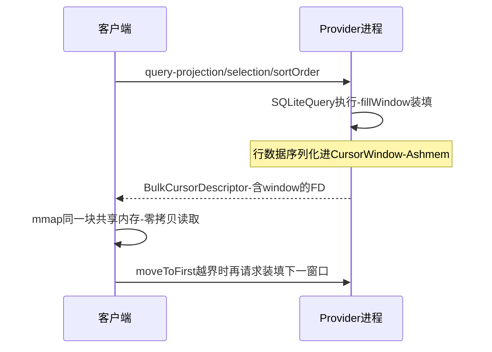

## 6.1 概述

ContentProvider 是四大组件中的"数据共享"担当：对外提供统一的 CRUD 接口，底层对接 SQLite、文件或内存数据。原书第 7 章按"provider 的发布 → 访问 → query/close 的游标流转"三步走，并顺带剖析 SQLite 相关组件。

本章基于 Android 4.0 源码按概念重写（标注"概念简化"处），与原书可能有出入；小节编号为笔记整理时重建。

## 6.2 ContentProvider 的发布和进阶

### 6.2.1 使用侧全景

使用方看到的只是 `ContentResolver`：

```java
ContentResolver cr = context.getContentResolver();
Cursor cursor = cr.query(
        Uri.parse("content://sms/inbox"),
        new String[]{"address", "body"},   // projection
        "date > ?", new String[]{"1700000000000"},  // selection
        "date DESC");                       // sortOrder
```

`content://sms/inbox` 的解析路径：`ContextImpl.ApplicationContentResolver.acquireProvider("sms")` → 跨 Binder 调 AMS 的 `getContentProvider` → AMS 找到 `ContentProviderRecord` → 返回 holder（含 `IContentProvider` binder 引用与进程信息）→ 客户端包装为 `ContentProviderProxy`（`Transport` 的代理）。**`ContentResolver` 的每个 query/insert/update/delete 都是一次跨进程 binder 调用**（除非 provider 恰在同进程——AMS 会给同进程调用方直接返回本地接口，与 AIDL `asInterface` 的同进程优化同一思路）。

### 6.2.2 provider 何时就绪：installContentProviders

**ContentProvider 的一个反直觉特性：它在 Application.onCreate 之前被安装**。两条安装路径：

**路径一：本进程冷启动。** 进程创建时（`ActivityThread.handleBindApplication`，概念简化）：

```java
// ActivityThread.handleBindApplication 的顺序（概念简化）
// bindApplication的参数里带providers列表（AMS在启动进程时已解析好该包的provider）
Application app = mInstrumentation.newApplication(...);
installContentProviders(app, providers);   // 先装provider
mInstrumentation.callApplicationOnCreate(app);  // 后调Application.onCreate
```

`installContentProviders` 对每个 `ProviderInfo`：

1. `ContentProvider.attachInfo` → 反射创建子类实例并回调其 `onCreate()`（初始化数据库等）
2. `publishContentProviders`（跨 Binder 告诉 AMS"我装好了"）→ AMS 唤醒所有在等这个 provider 的客户端

**路径二：按需拉起。** 客户端 query 一个未发布 provider 时：AMS 发现目标进程没起 → `startProcessLocked` 拉起，并在 bindApplication 参数里带上"必须先安装的 provider 列表" → 装完发布后唤醒等待方。

三个推论：

- **在 Application 构造/onCreate 里通过 ContentResolver 访问别人的 provider 是安全且常见的**（AMS 会等到它就绪）
- **自己 provider 的 onCreate 会拖慢整个进程冷启动**（它先于 Application.onCreate 执行，任何慢查询都在启动关键路径上）
- AMS 侧 `ContentProviderRecord` 记录 `mConnections`（使用者列表）：只要还有客户端在用，提供方进程至少保 SERVICE 级 adj——**这是很多"纯 provider 进程"常驻不死的机制根源**

### 6.2.3 ContentProviderClient 与连接管理

`cr.acquireContentProviderClient(authority)` 返回 `ContentProviderClient`：保持与 provider 的连接，之后多次调用不必每次走 AMS 解析（但每步仍是 binder 调用）。4.0 时代须手工 `release()`；`ContentProvider` 的 `Transport` 内层（`android.content.ContentProvider.Transport`）是真正的 binder 服务端，做权限检查（`enforceReadPermission`）后转调子类 `query/insert`。

### 6.2.4 权限三件套

provider 的权限控制：

- `android:readPermission` / `writePermission`：读写分离
- `android:permission`：整体（未细分时）
- `grant-uri-permissions` + `FLAG_GRANT_READ_URI_PERMISSION`：临时授权——典型的"分享一张图给另一个 App"场景：分享方临时授权目标 App 读这个 Uri，不给出常驻权限。AMS 的 `UriPermission` 表管理这些临时授权（4.0 已支持 `takePersistableUriPermission` 的前身）

## 6.3 SQLite 与持久化

### 6.3.1 组件总览

| 类 | 职责 |
|---|---|
| `SQLiteDatabase` | 数据库对象：execSQL/query/insert/replace，事务 beginTransaction/endTransaction |
| `SQLiteStatement` | 预编译语句（无结果集，用于 INSERT/EXEC） |
| `SQLiteQuery` | 预编译查询（有结果集），fillWindow 驱动取数 |
| `SQLiteCompiledSql`（4.0） | 已编译 SQL 的缓存条目，重用 statement 句柄 |
| `SQLiteOpenHelper` | 应用层的建库/升级样板（onCreate/onUpgrade） |
| `SQLiteQueryBuilder` | 拼查询（防注入的 selection 拼装） |
| native sqlite3 | 真正实现，Java 层是 JNI 包装 |

所有 Java SQLite 类在 `android.database.sqlite` 包，底层通过 JNI 调 sqlite3 C API：`sqlite3_open_v2` → `sqlite3_prepare_v2` → `sqlite3_bind_*`/`sqlite3_step` → `sqlite3_finalize`。**"每次查询都重新 prepare"是性能杀手，SQL 编译是昂贵步骤**——`SQLiteCompiledSql` 缓存与后来的 `SQLitePreparedStatement` 池都为此而生。

### 6.3.2 并发模型与事务

（4.0 尚无 `SQLiteSession`/`SQLiteConnectionPool`，此处按原书脉络 + 现代结构合并重述）

- **默认 journal 模式**（rollback journal）：写时独占，读写互斥；**WAL（Write-Ahead Logging，预写日志）模式**：写不再阻塞读（一写多读并发），提交只追加日志文件。Android 后续版本对应用数据库默认/大量采用 WAL
- `beginTransaction()` 开启时获取锁并把 session 深度 +1（嵌套事务内层自动变 savepoint），`setTransactionSuccessful()` 标记后才真正提交，否则回滚——**标准用法是 try/finally 配对**：

```java
db.beginTransaction();
try {
    for (Item item : items) db.insert(...);   // 批量写在事务里快得多
    db.setTransactionSuccessful();
} finally {
    db.endTransaction();
}
```

- 多线程共享一个 `SQLiteDatabase` 实例在 4.0 是安全的（内部锁串行化），但并发读会被写阻塞；多连接并发是后来的 `SQLiteConnectionPool` 话题

### 6.3.3 query 的两种执行路径与惰性取数

`SQLiteDatabase.query` 有两个家族：

- `query`：面向列的便捷封装，内部走 `SQLiteQueryBuilder` 拼出 SQL
- `rawQuery`：直接执行原始 SQL

关键性能认知：**`query` 返回 Cursor 时并不搬运数据**。真正的取数发生在第一次 `moveToFirst`/`moveToNext` 触发的 `SQLiteQuery.fillWindow`：把行批量装进 `CursorWindow`（见 6.4）。也就是"查询慢不慢"要看游标怎么移动，光调 query 是测不出来的。

## 6.4 Cursor query 和 close 的研究

### 6.4.1 CursorWindow：跨进程数据搬运的集装箱

查询结果跨进程返回给客户端，靠 `CursorWindow`——native 层由 Ashmem（Anonymous Shared Memory，匿名共享内存）分配的共享内存块：



要点展开：

- **数据只拷贝一次**：provider 进程把行数据写进 Ashmem 块，客户端拿到 FD 后 mmap 同一块内存直接读——不走 binder 逐行传输。跨进程 Cursor 的大结果集性能由此才可用
- **窗口装不下时分页**：结果集超过窗口（2MB 量级）时，客户端游标移到窗口外会触发跨进程的再装填（`getWindow`/`BulkCursorToCursorAdaptor` 的协议）：provider 侧游标前移、刷新窗口内容。用户快速滑长列表时的卡顿就来自这条再装填路径——**设计上应限制 projection、用 limit/分页约束结果集**
- `close()` 释放的是 window 的 FD 与 statement 引用；同进程查询的 `SQLiteCursor` 同样要 close（native statement 资源）

### 6.4.2 Cursor 的关闭义务与常见泄漏

- **不用必须 close**（`close()` 或 7.0+ 的 try-with-resources），否则共享内存与 native 资源要等 GC/finalize 才释放；大量未关 Cursor 会打出 "CursorWindow allocation of xx kb failed" 并触发清理
- StrictMode 的 `close` 检测（`penaltyDeathOnClose` 式）可让泄漏在开发期直接暴露——4.0 时代排查 Cursor 泄漏的第一工具
- `deactivate()`/`requery()`：4.0 时代的"释放窗口但保留查询参数、稍后重新执行"的机制，已随 Loader 体系废弃

### 6.4.3 通知联动：setNotificationUri

`cursor.setNotificationUri(cr, uri)` 把游标与 Uri 通知机制（ContentService）挂钩：数据变化时 provider `notifyChange` → ContentService 派发 → 客户端 cursor 的 `onChange` 触发 `requery`（4.0 时代）——这就是 `CursorLoader` 实现数据变化自动刷新的底层链路。

## 6.5 后续演进：4.0 机制 vs 现代 Android

| 维度 | Android 4.0（原书） | 现代 Android（12~15） | 展开说明 |
|---|---|---|---|
| Cursor 资源管理 | 手工 close + requery | try-with-resources；Loader → Room/Flow | `Cursor` 实现 `Closeable`；`CursorLoader`（support library 时代）解决了重查与生命周期，Jetpack 时代被 **Room** + `LiveData`/Kotlin `Flow` 取代：查询在后台线程执行、结果以响应式流投递，Cursor 完全被框架管理。`ContentResolver.query` 原始 API 仍在（系统编程常用） |
| SQLite 并发 | 单连接内部锁 | `SQLiteConnectionPool` 多连接 + WAL 默认 | framework SQLite 自带连接池（读连接并发、写单连接排队），配合 WAL 一写多读；"必须单例 SQLiteOpenHelper"的建议随连接池弱化，但共享 helper 仍是惯例 |
| ORM 层 | 无（手写 SQL） | **Room**（2017）编译期校验 | Room 在 SQLite 上编译期检查 SQL 与实体映射、迁移（Migration）显式声明、`@Query` 返回 Flow/LiveData/Paging 分页；**Paging 库**把 6.4.1 的"CursorWindow 越界再装填"的分页思想抬到库层（`PositionalDataSource`/`PagingSource`），列表按需加载有标准答案 |
| CursorWindow | 2MB 固定 | 默认 2MB（老版本 1MB），可构造参数调整 | 超大结果集的正解仍是分页/limit，调大窗口只是饮鸩 |
| 跨进程大数据 | CursorWindow | 语义不变 + `ContentProviderClient` 强化 | 机制保留；`call()` 方法（自定义命令式 RPC）成为 provider 上传命令的补充通道 |
| 权限与可见性 | read/write permission + 临时授权 | package visibility 波及 provider 查询 | Android 11 起 `queryIntentContentProviders` 等受 `<queries>` 限制；临时授权机制（`takePersistableUriPermission`）成为 SAF 文档访问的标准票据 |
| 文件共享 | 私有路径直递 | **FileProvider** + **SAF**（4.4+）+ Scoped Storage | Android 10/11 分区存储后，跨应用共享文件的合规路径是 FileProvider（`content://` Uri + 临时授权）或 Storage Access Framework 的 DocumentsProvider；裸文件路径与 `getExternalStorageDirectory` 已死 |
| 系统级 provider | 短信/联系人设置 | MediaProvider 模块化（APEX） | MediaProvider 成为 Mainline 模块（Android 11+），配合 FUSE 实现 scoped storage 的 `MediaStore` 视图——provider 从"数据共享组件"扩展为"存储治理中枢" |

**读原书的价值锚点**：6.2 的"provider 先于 Application 就绪 + AMS 按需拉起"时序、6.4 的 CursorWindow 共享内存机制，到今天字字有效；变化全在应用层 API 的封装高度（Room/Paging/SAF）。做系统开发或性能排查（列表滑动卡顿查 window 再装填）时，这两节仍是必背。
