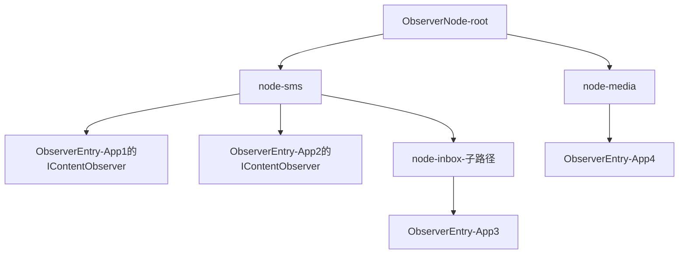
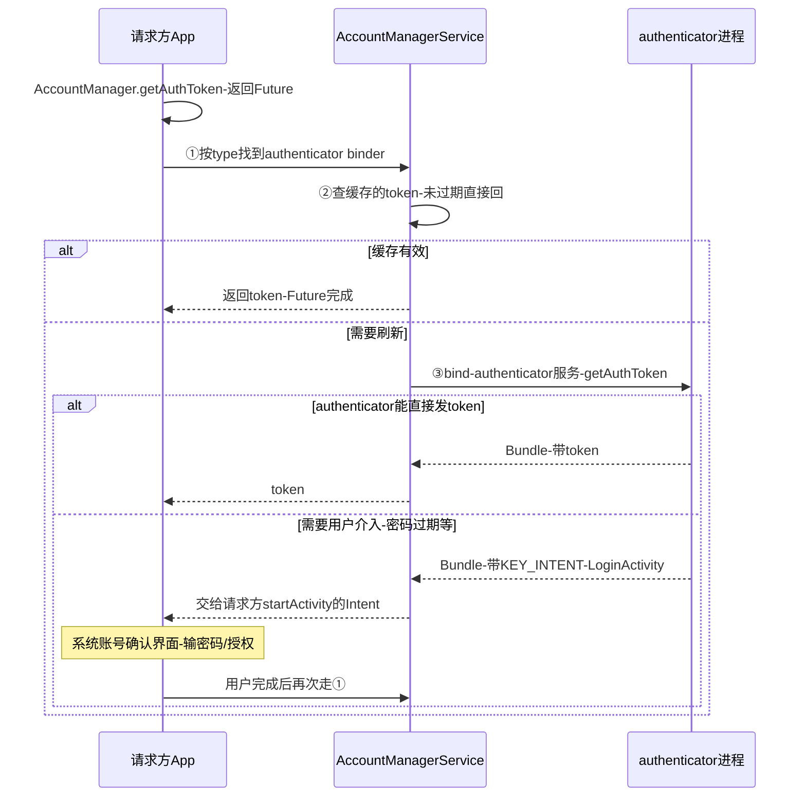
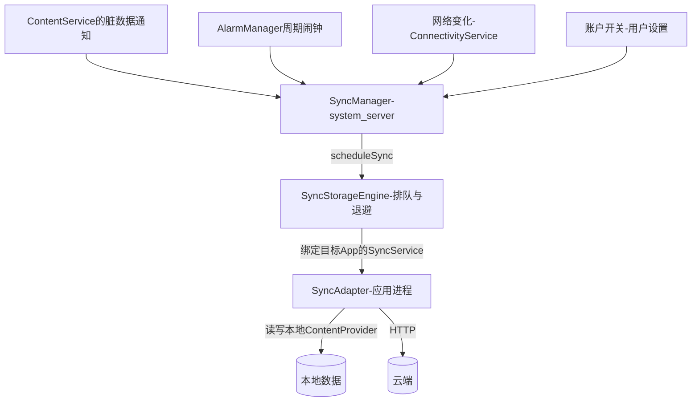

## 7.1 概述

本章是卷二的收官：两个"数据类"系统服务——

- **ContentService**：数据更新通知机制（`ContentResolver.notifyChange` / `registerContentObserver` 的服务端），是"数据库变了 UI 自动刷新"的系统底座
- **AccountManagerService**：账户管理与数据同步（账号体系 + SyncManager 同步框架的入口），是"云 + 端"同步时代的核心架构

本章基于 Android 4.0 源码按概念重写（标注"概念简化"处），与原书可能有出入；小节编号为笔记整理时重建。

## 7.2 数据更新通知机制

### 7.2.1 使用侧全景

```java
// 数据方：数据变了，广播通知（通常在provider的insert/update/delete后）
cr.notifyChange(Uri.parse("content://sms"), null);

// 观察方：注册监听（notifyForDescendents=true表示子路径变化也算）
cr.registerContentObserver(Uri.parse("content://sms"), true,
        new ContentObserver(new Handler()) {
            @Override
            public void onChange(boolean selfChange) { /* 刷新UI */ }
        }, observerUid /* 4.0无此参数，按概念补 */);
```

- `notifyChange` 的第二个参数是**发起方自己的 observer**：通知派发时会跳过它（或以 `selfChange=true` 告知），避免"自己写数据自己重刷"——`CursorLoader` 靠这个参数区分"自己的写"与"别人的写"
- `ContentObserver.onChange` 在**注册时传入的 Handler 所在线程**回调：传主线程 Handler 即可安全刷 UI；传 null 则在 binder 线程回调（要求 observer 自己线程安全）

### 7.2.2 ContentService 的内部实现

ContentService 维护一棵**通知树**：以 Uri 路径段为节点（`ObserverNode`），每个节点挂若干 `ObserverEntry`（包装客户端注册来的 `IContentObserver` Binder 与分发线程）。



`notifyChange(uri, observer)` 的派发（概念骨架）：

```java
// ContentService.notifyChange（概念简化）
void notifyChange(Uri uri, IContentObserver observer, boolean syncToNetwork) {
    rootNode.notifyChange(uri, observer, 0,
            selfChange /*是否跳过发起方*/);
    if (syncToNetwork) {
        // 顺带给SyncManager发脏数据信号（见7.4）
        SyncManager.scheduleLocalSync(...);
    }
}
// ObserverNode.notifyChange：从当前节点向下匹配，
// 对匹配节点及子树上的所有ObserverEntry调用
// entry.observer.onChange(selfChange)——跨进程binder回调
```

两个匹配语义：

- **notifyForDescendents**：注册时选 false 则只监听精确 Uri；选 true 则该 Uri 的任何"后代"（子路径）变化都收到。上图中 `content://sms/inbox` 的变化会同时命中 App3（精确）与 App1（descendents），不命中 App4
- 派发是**进程间异步风暴**：每个 ObserverEntry 一次 binder oneway 回调。注册者极多时（如联系人变化）通知本身有开销——所以通知粒度应尽量精确到行级 Uri（`content://contacts/people/42`）

**RemoteCallbackList 的用武之地**：observer 注册表天然要处理"注册方进程死亡"——`ObserverEntry` 内部对 `IContentObserver` 的 binder 挂 DeathRecipient，死了自动摘除节点，防泄漏防死调用——与系统里其他跨进程监听表（如剪贴板服务）同一套路。

### 7.2.3 与 SyncManager 的钩子

`notifyChange` 还有一个隐藏作用：若 Uri 的 provider 在 syncadapter 配置里声明了 `supportsUploading`，且 `notifyChange` 的 `syncToNetwork` 参数为 true（默认），这次通知会顺带给 SyncManager 发一个**本地脏数据信号**，触发该 authority 的后续同步（见 7.4）——数据变更"顺手"驱动上云，是这套机制的设计闭环。

## 7.3 AccountManagerService 分析

### 7.3.1 账户体系基础

先建立三要素模型：

| 概念 | 载体 | 说明 |
|---|---|---|
| account type | authenticator XML 声明的字符串 | 如 `com.google`、`com.example`，一个 type 对应一个 authenticator 实现 |
| account name | 用户可见名 | 如 someone@gmail.com；(type, name) 二元组唯一标识一个账户 |
| authenticator | 提供 `AbstractAccountAuthenticator` 的 App | 真正处理登录/令牌的服务实现，跑在它自己的进程里 |

authenticator 的声明方式（提供方 App 的 manifest）：

```xml
<service android:name=".AuthenticatorService" android:exported="true">
    <intent-filter android:name="android.accounts.AccountAuthenticator"/>
    <meta-data android:name="android.accounts.AccountAuthenticator"
               android:resource="@xml/authenticator"/>
</service>
<!-- res/xml/authenticator.xml -->
<account-authenticator xmlns:android="http://schemas.android.com/apk/res/android"
    android:accountType="com.example"
    android:label="@string/account_label"/>
```

AccountManagerService 启动时扫描 PMS 找出全部 authenticator（`mAuthenticatorCache`），设备上所有 type 的能力由此聚合——**账户体系是"系统提供壳、应用提供实现"的插件化设计**。

### 7.3.2 AccountManagerService 的职责

- 维护账户数据：账户列表、密码/令牌（加密后落 `/data/system/users/0/accounts.db`），`/Authenticators` 与 `/Accounts` 两张核心表
- 提供对外 API：`AccountManager` 的 `addAccount`/`removeAccount`/`getAuthToken`/`setPassword`/`getAccountsByType`…全部跨 Binder 到 AMSvc，再路由到对应 authenticator
- 账户变更通知：内部用注册的 `AccountsUpdatedReceiver` 式回调，设置界面的账户列表实时刷新

### 7.3.3 getAuthToken：核心状态机

**AMSvc 只是路由与缓存，真正的鉴权逻辑在提供 authenticator 的应用进程**（跨 Binder 调用）：



展开三个要点：

- **为什么结果可能是 Intent**：authenticator 判定需要用户交互（首次登录、密码过期、需要授权新应用）时，返回一个打开它自己 Login UI 的 Intent，由请求方 `startActivity` 弹出——**鉴权的 UI 归 authenticator 应用，流程控制归 AccountManager**。这就是 `AccountAuthenticatorResponse` 双向回调的用途
- **token 缓存**：`AuthTokenKey(type, authTokenType)` → token 的缓存带过期时间；`invalidAuthToken` 主动失效后下次走刷新。`authTokenType`（如 `"full"`、`"mobile"` 等用途标识）让一个账户可发多种用途的令牌
- **权限**：`GET_ACCOUNTS`/`AUTHENTICATE_ACCOUNTS`/`MANAGE_ACCOUNTS` 按账户 type 或全局授予——4.0 时代是安装时权限，注意它在现代版本已是运行时权限

### 7.3.4 addAccount 与系统设置

"添加账户"（设置 → 账户与同步）的流程同样是状态机：设置界面 `AccountManager.addAccount` → AMSvc 找 authenticator → authenticator 返回自己的添加账户 UI Intent → 系统弹出 → 用户完成 → `onResult` 回 AMSvc 写库 → 账户列表刷新。**AMSvc 从不渲染 UI**，所有账户相关界面都在 authenticator 应用里。

## 7.4 数据同步

### 7.4.1 SyncManager 与 SyncAdapter

数据同步（sync）的架构全景：



- **SyncAdapter**：应用实现的同步逻辑（继承 `AbstractThreadedSyncAdapter`，`onPerformSync(account, extras, authority, provider, syncResult)` 里干活），与 authenticator 绑定同一 account type、操作同一 authority 的 provider——三者（authenticator/syncadapter/provider）在提供方 App 的 XML 里配套声明
- **SyncManager**（运行在 system_server，经 `ContentService.getSyncManager` 暴露）：接收四类触发源（脏数据通知、周期闹钟、网络可用、设置开关），排队调度。**SyncManager 的排队核心在 SyncStorageEngine**：持久化每个 (account, authority) 的同步计划、周期、退避（backoff，失败后指数推迟）、历史结果（成功/失败/取消计数）
- 触发源去抖：同一 authority 的脏通知会合并（extras 里 `doNotRetry` 等标志控制重试），网络不可用时挂起而非失败

### 7.4.2 ContentResolver 的同步 API

```java
// 手动触发一次同步（不排队，立即尽最大努力）
ContentResolver.requestSync(account, authority, extras);

// 声明周期性同步（系统会聚簇执行省电）
ContentResolver.addPeriodicSync(account, authority, extras, 86400L);

// 同步开关（账户级/authority级/全局）
ContentResolver.setSyncAutomatically(account, authority, true);
ContentResolver.setMasterSyncAutomatically(true);   // 设置里"自动同步"总开关
ContentResolver.setIsSyncable(account, authority, 1); // isSyncable>0才可同步
```

`syncResult` 的 `delayUntil`/`stats` 让 adapter 能反馈"稍后再试"与错误分类，SyncManager 据此做退避。

### 7.4.3 同步的现代命运

SyncAdapter 体系是"云账户 + 定期批量同步"时代的产物（Gmail、日历、联系人的背景）：系统级统一调度、账户级凭据复用、省电的周期聚簇。它**至今仍在**（设置 → 账户 → 同步），但新应用基本改用推送（FCM，Firebase Cloud Messaging）+ 按需请求，或 WorkManager 周期任务——原书详析的 SyncManager 调度细节，在现代开发中的受众已很窄；但"触发源合并 + 退避 + 账户绑定"的调度思想值得系统设计者揣摩。

## 7.5 后续演进：4.0 机制 vs 现代 Android

本章两个主角命运迥异：**通知机制几乎原样存活，同步体系被工作调度新范式取代**。逐项对比：

| 维度 | Android 4.0（原书） | 现代 Android（12~15） | 展开说明 |
|---|---|---|---|
| 通知树派发 | ObserverNode 树 + DeathRecipient 自清 | 结构与语义完全延续 | `registerContentObserver`/`notifyChange` 至今是系统内数据联动（如 MediaStore 变化通知桌面/相册）的核心机制；通知粒度细化到行级 Uri 的实践保留。新增 flag：`NOTIFY_SYNC_TO_NETWORK=false` 可只通知不同步、`NOTIFY_NO_DELAY` 等，控制派发与同步副作用 |
| 通知的跨界扩展 | 单用户 | **多用户**路由 | ContentService 为每用户维护独立通知空间（`mRootNode` per userId），跨用户 observer 需显式 `crossUser` 权限——支持 work profile/多用户设备 |
| AccountManager | 安装时权限，账户全局 | 运行时权限 + 可见性收紧 | `GET_ACCOUNTS` 6.0 起运行时化；Android 13 对第三方应用枚举他人账户进一步限制（type 白名单/同签名）；企业场景 `DevicePolicyManager` + work profile 把账户隔离成 profile 级。Google 自家主线已转向 Play Services 的账号体系（不经过 AccountManager 的公开 API 面向第三方收窄） |
| 账户存储 | accounts.db | direct boot 感知的 CE/DE 存储 | Android 7.0 CE/DE（device encrypted / credential encrypted）拆分后，账户与令牌按用户解锁状态分层存储，`notifyAccountAuthenticated` 等管理令牌新鲜度 |
| 周期同步 | SyncManager + addPeriodicSync | **WorkManager**（2018） | Jetpack WorkManager 取代周期同步的调度职责：内部走 JobScheduler（进程存活与 Doze 感知由系统保证），带约束（充电/网络/空闲）、退避、链式任务；应用侧不再需要 syncadapter XML 三件套。SyncManager 仍为系统账户（Exchange 等）服务 |
| 推送式同步 | 定期拉取为主 | **FCM 推送**驱动 | "服务器有变化才推一条消息，客户端按需拉"取代"周期性全量比对"——云同步的延迟与流量双降；SyncAdapter 的脏数据上行（supportsUploading）思想活在"操作队列 + 推送触发 flush"的实现里 |
| 通知消费端 | observer + requery | Room/Flow + `InvalidationTracker` | Room 的 `InvalidationTracker` 底层就是 ContentObserver + `notifyChange`（框架替你 wire 好表级通知），`Flow<List<T>>` 自动重查——应用层"数据变了 UI 刷新"的写法从手工 observer 进化为响应式流，但系统层机制没换 |
| CursorLoader | 自动 requery 的事实标准 | 已被 ViewModel + Room/Flow 取代 | `LoaderManager` 停滞在 support library 时代；生命周期感知的重查由 ViewModel 作用域 + Flow 收集完成 |

**读原书的价值锚点**：7.2 的通知树机制是全卷"老化最慢"的一章——`ObserverNode` 的匹配派发、`selfChange` 语义、DeathRecipient 自清，今天读 AOSP `ContentService.java` 仍是同一套；7.3/7.4 的账户与同步体系则要带着"历史文物 + 调度思想标本"的双重心态去读：API 面缩小、新代码不再用，但"插件化服务壳 + 账户凭据集中管理 + 多触发源合并调度"的设计模式仍是可迁移的系统设计经验。
