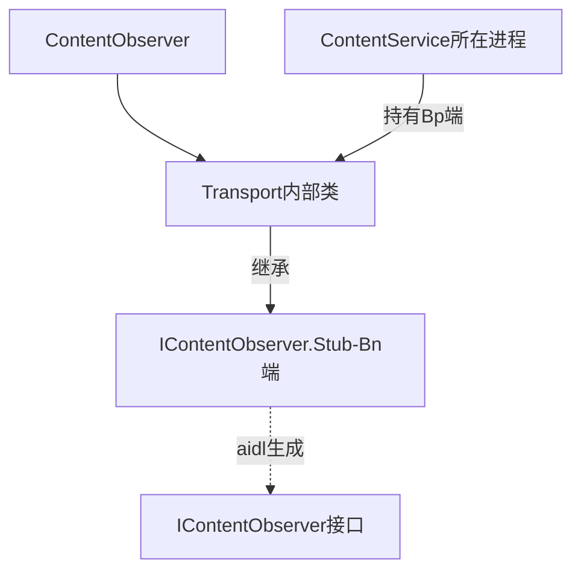
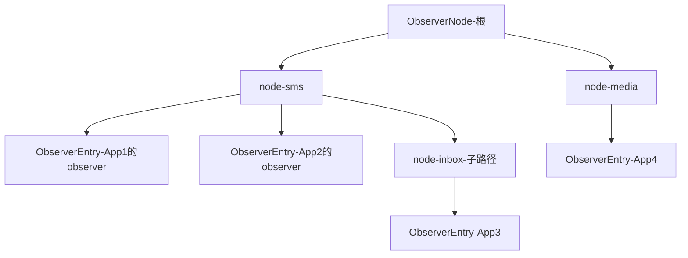
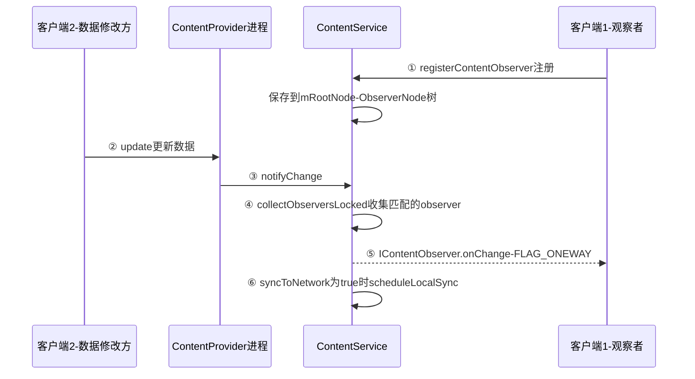
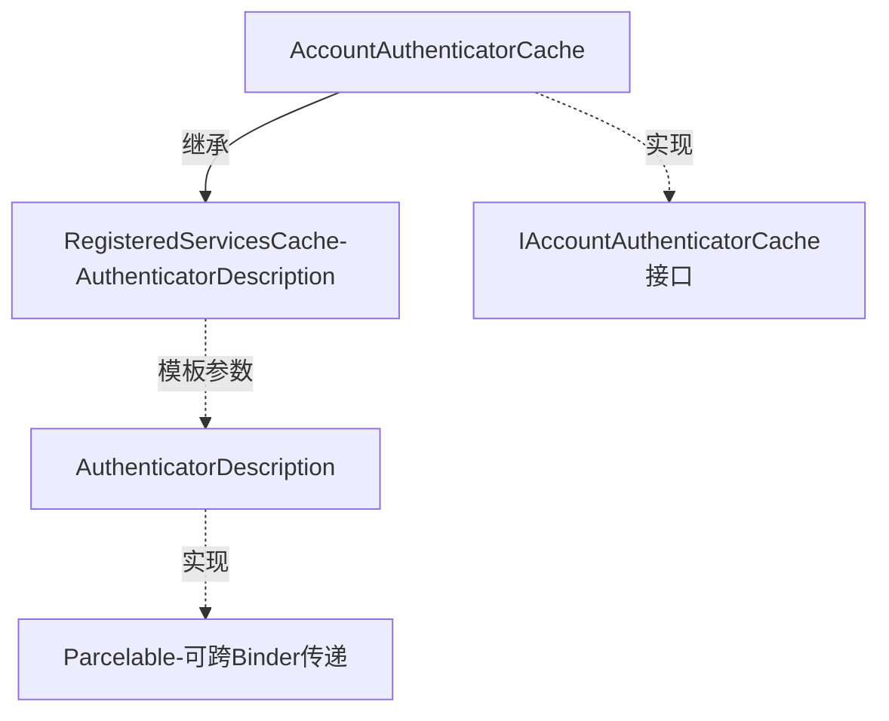
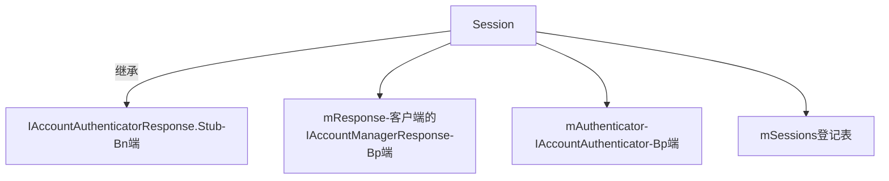
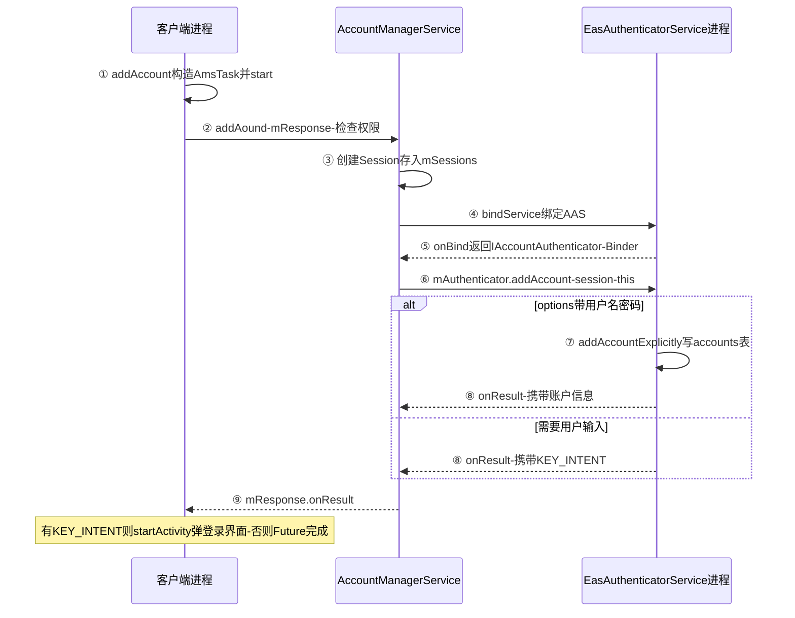
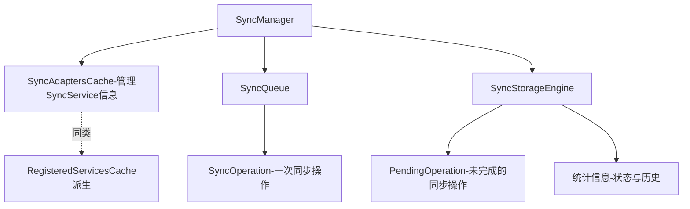
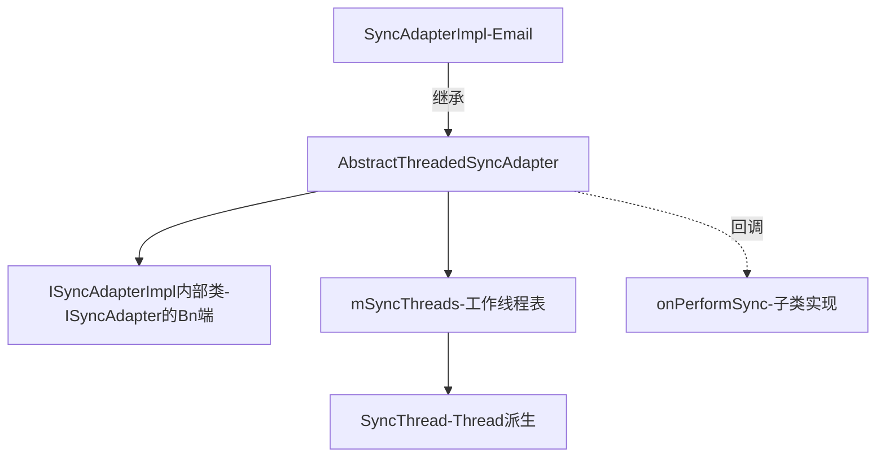
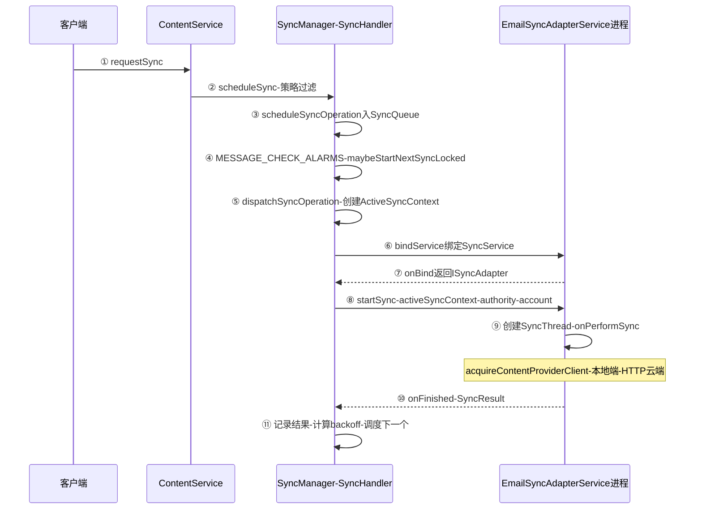

## 7.1 概述

本章是卷二的收官之章,分析两个"数据类"系统服务:

- **ContentService**:身兼两职——既是 Android 平台中**数据更新通知的执行者**(数据变了,UI 自动刷新的系统底座),又是**数据同步服务的管理中枢**(联系人、邮件等数据同步到远端服务器时,都要与它交互)
- **AccountManagerService**:负责管理手机中用户的**online 账户**(如用户在 Google、Facebook 上注册的账户),主要工作涉及账户的添加和删除、AuthToken(authentication token,身份验证令牌——有了它,客户端就无须每次操作都向服务器发送密码)的获取和更新等

两个服务在设计结构上有较大的相似性(都要管理"应用声明的插件式服务"),内容上也有关联(数据同步依赖账户体系)。本章先分析 ContentService 的数据更新通知机制(7.2),再分析 AccountManagerService(7.3),最后分析 ContentService 中的数据同步管理 SyncManager(7.4)。

本章涉及的核心源码文件:

| 文件 | 位置(frameworks/base 下) | 角色 |
|---|---|---|
| SystemServer.java | services/java/com/android/server/ | 两个服务的创建入口 |
| ContentService.java | core/java/android/content/ | 通知机制 + 同步服务入口 |
| ContentResolver.java | core/java/android/content/ | 客户端 API |
| AccountManagerService.java | core/java/android/accounts/ | 账户服务 |
| AccountAuthenticatorCache.java / RegisteredServicesCache.java | core/java/android/accounts、core/java/android/content/pm/ | 插件式服务注册表 |
| AccountManager.java | core/java/android/accounts/ | 账户客户端 API |
| EasAuthenticatorService.java | packages/apps/Email(Exchange) | AAS 实例 |
| SyncManager.java / SyncStorageEngine.java / SyncQueue.java / SyncAdapterCache.java | core/java/android/content/ | 同步管理家族 |
| AbstractThreadedSyncAdapter.java | core/java/android/content/ | SyncAdapter 基类 |
| EmailSyncAdapterService.java | packages/apps/Exchange | SyncAdapter 实例 |

## 7.2 数据更新通知机制分析

何为数据更新通知?以 BugZilla 管 Bug 为例:跟踪自己名下的 Bug 有两种办法,一是不断登录查询(轮询),二是为 Bug 设置关系人列表,一旦状态变化系统就给关系人发邮件(通知)。操作系统里同样如此——外设以中断方式通知 CPU,而非让 CPU 轮询外设状态。Android 平台中,程序若要监控某数据项的变化,无须 while 循环轮询,只需注册一个 **ContentObserver**,数据变化时系统就会通过其 `onChange` 函数通知我们。设计模式上,这就是 **Observer(观察者)模式**。

通知机制的实施包括两步:**第一步,注册观察者;第二步,通知观察者**。两步都离不开 ContentService。

### 7.2.1 初识 ContentService

SystemServer 创建 ContentService 的代码非常简单:

```java
// SystemServer.java :: ServerThread.run(节选)
public void run() {
    ......
    ContentService.main(context, factoryTest == SystemServer.FACTORY_TEST_LOW_LEVEL);
    ......
}
```

```java
// ContentService.java :: main
public static IContentService main(Context context, boolean factoryTest) {
    // 构造 ContentService 实例
    ContentService service = new ContentService(context, factoryTest);
    // 注册到 ServiceManager 中,注册名叫 "content"
    ServiceManager.addService(ContentResolver.CONTENT_SERVICE_NAME, service);
    return service;
}

// ContentService.java :: 构造函数
ContentService(Context context, boolean factoryTest) {
    mContext = context;
    mFactoryTest = factoryTest;
    getSyncManager(); // 获取同步服务管理对象
}

// ContentService.java :: getSyncManager
private SyncManager getSyncManager() {
    synchronized (mSyncManagerLock) {
        try {
            // 创建 SyncManager 实例,它是 ContentService 中负责数据同步服务的主力成员
            if (mSyncManager == null) mSyncManager = new SyncManager(mContext, mFactoryTest);
        } ......
        return mSyncManager;
    }
}
```

ContentService 本身很简单,最难的功能(数据同步)都封装在 **SyncManager** 及相关类中(7.4 节),所以分析通知机制时不会和数据同步有太多瓜葛。下面看通知机制的第一步——注册 ContentObserver,由 ContentResolver 的 `registerContentObserver` 函数实现。

### 7.2.2 ContentResolver 的 registerContentObserver 分析

```java
// ContentResolver.java :: registerContentObserver
public final void registerContentObserver(Uri uri, boolean notifyForDescendents,
        ContentObserver observer) {
    /*
     三个参数的含义:
     uri:客户端监听的数据项地址。如 content://sms/inbox
     notifyForDescendents:若为 true,则所有地址"包含此 uri"的数据项发生变化时都会触发
      通知;否则只有完全符合该 uri 的数据项变化才触发。以文件夹和其中的文件为例,
      若 uri 指向某文件夹,则需设置为 true——文件夹下任何文件变化都要通知监听者
     observer:监听对象。数据项变化时,其 onChange 函数将被调用
    */
    try {
        // 转调 ContentService 的 registerContentObserver,第三个参数是
        // observer.getContentObserver 的返回值,它是什么呢?见下文
        getContentService().registerContentObserver(
                uri, notifyForDescendents, observer.getContentObserver());
    } ......
}
```

#### 1. ContentObserver 介绍

ContentObserver 与第 7 章介绍的 ContentProvider 非常类似:**内部都定义了一个 Transport 类参与 Binder 通信**。



Transport 从 `IContentObserver.Stub` 派生——从 Binder 通信的角度看,客户端进程中的 Transport 是 **Bn 端**;通过 registerContentObserver 传递到 ContentService 进程的就是 **Bp 端**(真实类型为 `IContentObserver.Stub.Proxy`)。也就是说,**onChange 的调用方向是"服务端跨进程回调客户端"**,与普通"客户端调用服务端"的 Binder 调用正好相反。

> IContentObserver.java 由 aidl 工具处理 IContentObserver.aidl 生成,位于 out/target/common/obj/JAVA_LIBRARIES/framework_intermediates/ 下。

#### 2. registerContentObserver 函数分析

```java
// ContentService.java :: registerContentObserver
public void registerContentObserver(Uri uri, boolean notifyForDescendents,
        IContentObserver observer) {
    ......
    synchronized (mRootNode) {
        // ContentService 要做的事情很简单:保存 uri 和 observer 的对应关系
        // 到内部变量 mRootNode 中
        mRootNode.addObserverLocked(uri, observer, notifyForDescendents,
                mRootNode, Binder.getCallingUid(), Binder.getCallingPid());
    }
}
```

`mRootNode` 是 ContentService 的成员变量,类型为 **ObserverNode**——一棵以 Uri 路径段为节点的树,叶子(挂在节点上)的类型为 **ObserverEntry**,保存了 uri、对应的 IContentObserver Bp 端对象、注册方 uid/pid,并通过 `binder.linkToDeath` 监听注册进程死亡以便自动清理:



至此,客户端已为某数据项设置了观察者。再看第二步——通知观察者。

### 7.2.3 ContentResolver 的 notifyChange 分析

数据更新的通知由 `notifyChange` 触发。以 MediaProvider 的 update 函数为例:

```java
// MediaProvider.java :: update(节选)
public int update(Uri uri, ContentValues initialValues, String userWhere,
                  String[] whereArgs) {
    int match = URI_MATCHER.match(uri);
    DatabaseHelper database = getDatabaseForUri(uri); // 找到对应的数据库对象
    SQLiteDatabase db = database.getWritableDatabase();
    ......
    synchronized (sGetTableAndWhereParam) {
        getTableAndWhere(uri, match, userWhere, sGetTableAndWhereParam);
        switch (match) {
            case VIDEO_MEDIA:
            case VIDEO_MEDIA_ID: {
                ContentValues values = new ContentValues(initialValues);
                ......
                // 调用 SQLiteDatabase 的 update 函数更新数据库
                count = db.update(sGetTableAndWhereParam.table, values,
                                  sGetTableAndWhereParam.where, whereArgs);
            } ......
        }
    }
    // 更新完数据库后,调用 notifyChange 触发通知
    if (count > 0 && !db.inTransaction())
        getContext().getContentResolver().notifyChange(uri, null);
    return count;
}
```

客户端侧的 notifyChange:

```java
// ContentResolver.java :: notifyChange
public void notifyChange(Uri uri, ContentObserver observer) {
    // 一般情况下 observer 参数为 null。转调三参数版本
    notifyChange(uri, observer, true);
}

public void notifyChange(Uri uri, ContentObserver observer, boolean syncToNetwork) {
    // 第三个参数 syncToNetwork 用于控制是否顺带发起一次数据同步请求(见 7.4 节)
    try {
        getContentService().notifyChange(
                uri, observer == null ? null : observer.getContentObserver(),
                observer != null && observer.deliverSelfNotifications(),
                syncToNetwork);
    } ......
}
```

ContentService 侧的派发:

```java
// ContentService.java :: notifyChange
public void notifyChange(Uri uri, IContentObserver observer,
        boolean observerWantsSelfNotifications, boolean syncToNetwork) {
    long identityToken = clearCallingIdentity();
    try {
        ArrayList<ObserverCall> calls = new ArrayList<ObserverCall>();
        // 从根节点(树结构)开始搜索需要通知的观察者,结果保存在 calls 数组中
        synchronized (mRootNode) {
            mRootNode.collectObserversLocked(uri, 0, observer,
                    observerWantsSelfNotifications, calls);
        }
        final int numCalls = calls.size();
        for (int i = 0; i < numCalls; i++) {
            ObserverCall oc = calls.get(i);
            try {
                // 调用客户端 IContentObserver 的 Bn 端,即 ContentObserver 内部类
                // Transport 的 onChange 函数,最后由 Transport 调用客户端提供的
                // ContentObserver 子类的 onChange 函数——跨进程 binder 回调
                oc.mObserver.onChange(oc.mSelfNotify);
            } ...... // 异常处理
        }
        if (syncToNetwork) {
            SyncManager syncManager = getSyncManager();
            if (syncManager != null) {
                // 顺带发起一次同步请求,相关内容留待 7.4 节分析
                syncManager.scheduleLocalSync(null, uri.getAuthority());
            }
        }
    } finally {
        restoreCallingIdentity(identityToken);
    }
}
```

两个匹配语义值得展开:

- **notifyForDescendents**:注册时选 false 则只监听精确 uri;选 true 则该 uri 的任何"后代"(子路径)变化都收到。上图中 `content://sms/inbox` 的变化会同时命中 App3(精确注册)与 App1(descendents 注册),不命中 App4
- **selfChange 语义**:`collectObserversLocked` 比较发起方传入的 observer 与各 ObserverEntry 保存的对象,跳过发起方自己(或以 `selfChange=true` 告知),避免"自己写数据自己重刷"——CursorLoader 正是靠这个机制区分"自己的写"与"别人的写"

### 7.2.4 数据更新通知机制总结和深入探讨

整体流程:



**问题一:onChange 耗时会阻塞 update 吗?** 客户端 2 调用 update 间接触发客户端 1 的 onChange,若客户端 1 在 onChange 中耗时过长(甚至恶意死循环),会不会把客户端 2 阻塞在 update 中?从流程图看似必然而实际不会,原因在这段代码:

```java
// IContentObserver.java :: Proxy.onChange(aidl 生成,节选)
private static class Proxy implements android.database.IContentObserver {
    private android.os.IBinder mRemote;
    ......
    public void onChange(boolean selfUpdate) throws android.os.RemoteException {
        android.os.Parcel _data = android.os.Parcel.obtain();
        try {
            _data.writeInterfaceToken(DESCRIPTOR);
            _data.writeInt(((selfUpdate) ? (1) : (0)));
            // 调用客户端 1 的 ContentObserver Bn 端的 onChange 函数,
            // 注意 transact 的最后一个参数:FLAG_ONEWAY!
            mRemote.transact(Stub.TRANSACTION_onChange, _data, null,
                             android.os.IBinder.FLAG_ONEWAY);
        } finally {
            _data.recycle();
        }
    }
}
```

**onChange 的 Binder 调用使用了 FLAG_ONEWAY 标志**(见第 2 章):只需将请求发给 binder 驱动即可返回,无须等待客户端处理完成。因此即使客户端 1 在 onChange 中恶意浪费时间,也不会阻塞客户端 2 的 update。

**问题二(开放性):服务端功能的"开关"如何实现?** 假设服务端有一项功能需要客户端控制开闭,Android 上至少有三种做法:

| 方法 | 机制 | 实例 |
|---|---|---|
| 第一种 | 服务端实现一个 API 函数,客户端直接调用 | USB MTP/PTP 的使能 |
| 第二种 | 客户端发送指定广播,服务端注册接收者处理 | 系统内多处使用 |
| 第三种 | 服务端输出 ContentProvider 和 uri,注册 ContentObserver,客户端通过**更新数据**触发服务端 onChange | ADB 的开关 |

同样在 Settings 应用中,USB 相关功能就用了两种不同方法。MTP 走第一种——`UsbSettings.onPreferenceTreeClick` 中直接调用 `mUsbManager.setCurrentFunction(UsbManager.USB_FUNCTION_MTP, true)`(Bn 端在 UsbService 中)。ADB 的开关却走第三种——先更新 Settings 数据库:

```java
// DevelopmentSettings.java :: onClick(节选)
public void onClick(DialogInterface dialog, int which) {
    if (which == DialogInterface.BUTTON_POSITIVE) {
        mOkClicked = true;
        // 设置 Settings 数据库 ADB 对应数据项的值为 1
        Settings.Secure.putInt(getActivity().getContentResolver(),
                Settings.Secure.ADB_ENABLED, 1);
    } else
        mEnableAdb.setChecked(false); // 界面更新
}
```

数据项的更新将触发 UsbDeviceManager 中注册的观察者:

```java
// UsbDeviceManager.java :: AdbSettingsObserver(节选)
private class AdbSettingsObserver extends ContentObserver {
    ......
    public void onChange(boolean selfChange) {
        // 从数据库中取出对应项的值
        boolean enable = (Settings.Secure.getInt(mContentResolver,
                Settings.Secure.ADB_ENABLED, 0) > 0);
        // 发送 MSG_ENABLE_ADB 消息,UsbDeviceManager 的 Handler 将处理此消息
        mHandler.sendMessage(MSG_ENABLE_ADB, enable);
    }
}
```

同样是 USB 功能,Settings 却采用了两种截然不同的方法(这为需要统一处理 USB 扩展功能的项目带来过极大困扰)。两种方法各自的适用场景是什么,是原书留给读者的开放性问题。

**问题三**:第 7 章分析 Cursor query 时曾看到 ContentObserver 的身影(通知机制与 Cursor 的 requery),回过头去分析 query 流程中与 ContentObserver 相关的部分,所涉及的流程比本节内容还要多——原书将其留作读者自行研究。

## 7.3 AccountManagerService 分析

AccountManagerService 负责管理手机中用户的 online 账户。先看它的创建:

### 7.3.1 初识 AccountManagerService

```java
// SystemServer.java :: ServerThread.run(节选)
......
// 注册 AccountManagerService 到 ServiceManager,服务名为 "account"
ServiceManager.addService(Context.ACCOUNT_SERVICE, new AccountManagerService(context));
```

```java
// AccountManagerService.java :: 构造函数之一
public AccountManagerService(Context context) {
    // 转调三参数版本,第三个参数构造一个 AccountAuthenticatorCache 对象
    this(context, context.getPackageManager(), new AccountAuthenticatorCache(context));
}
```

#### 1. AccountAuthenticatorCache 分析

AccountAuthenticatorCache 是 Android 平台中**账户验证服务(Account Authenticator Service,AAS)的管理中心**。AAS 由应用程序通过在 AndroidManifest.xml 中声明符合指定要求的 Service 而来:



- **RegisteredServicesCache** 是一个模板类,专门用于**管理系统中指定 Service 的信息收集和更新**——具体收集哪些 Service 由构造参数(intnet action、meta-data 名等)指定
- **AuthenticatorDescription** 继承 Parcelable,描述一个 AAS 的信息(可跨 Binder 传递)
- AccountAuthenticatorCache 实现 IAccountAuthenticatorCache 接口,供外部调用者获取 AAS 信息

```java
// AccountAuthenticatorCache.java :: 构造函数
public AccountAuthenticatorCache(Context context) {
    /*
     三个关键常量的值:
     ACTION_AUTHENTICATOR_INTENT     = "android.accounts.AccountAuthenticator"
     AUTHENTICATOR_META_DATA_NAME    = "android.accounts.AccountAuthenticator"
     AUTHENTICATOR_ATTRIBUTES_NAME   = "account-authenticator"
    */
    super(context, AccountManager.ACTION_AUTHENTICATOR_INTENT,
            AccountManager.AUTHENTICATOR_META_DATA_NAME,
            AccountManager.AUTHENTICATOR_ATTRIBUTES_NAME, sSerializer);
}
```

##### RegisteredServicesCache 分析

```java
// RegisteredServicesCache.java :: 构造函数与generateServicesMap(节选)
public RegisteredServicesCache(Context context, String interfaceName,
        String metaDataName, String attributeName, ......) {
    mContext = context;
    mInterfaceName = interfaceName;   // 保存控制参数
    mMetaDataName = metaDataName;
    mAttributesName = attributeName;
    File systemDir = new File(Environment.getDataDirectory(), "system");
    File syncDir = new File(systemDir, "registered_services");
    // mPersistentServicesFile 指向 syncDir 目录下的
    // android.accounts.AccountAuthenticator.xml:把收集到的服务信息持久化,
    // 避免每次都全量查询 PKMS
    mPersistentServicesFile = new AtomicFile(
            new File(syncDir, interfaceName + ".xml"));
    generateServicesMap();            // 生成服务信息
    final BroadcastReceiver receiver = new BroadcastReceiver() {
        public void onReceive(Context context1, Intent intent) {
            generateServicesMap();    // Package 变化时重新生成
        }
    };
    // 注册 Package 安装、卸载和更新等广播监听者,还监听 SD 卡应用
    // AVAILABLE/UNAVAILABLE 广播——管理的 Service 随 APK 生灭,必须及时更新。
    // 这是全书反复出现的"系统插件注册表"套路(PKMS 管组件、
    // AccountAuthenticatorCache 管 AAS、SyncAdaptersCache 管 SyncService)
    IntentFilter intentFilter = new IntentFilter();
    intentFilter.addAction(Intent.ACTION_PACKAGE_ADDED);
    intentFilter.addAction(Intent.ACTION_PACKAGE_CHANGED);
    intentFilter.addAction(Intent.ACTION_PACKAGE_REMOVED);
    intentFilter.addDataScheme("package");
    mContext.registerReceiver(receiver, intentFilter);
    ......
}

void generateServicesMap() {
    ......
    // 查询 PKMS 中满足 Intent action 为 "android.accounts.AccountAuthenticator"
    // 的服务信息(带 GET_META_DATA 标志,即查询 Service 声明的 meta-data)
    List<ResolveInfo> resolveInfos = pm.queryIntentServices(
            new Intent(mInterfaceName), PackageManager.GET_META_DATA);
    for (ResolveInfo resolveInfo : resolveInfos) {
        // 解析 meta-data,返回模板类对象 ServiceInfo<AuthenticatorDescription>
        ServiceInfo<V> info = parseServiceInfo(resolveInfo);
        serviceInfos.add(info);
    }
    synchronized (mServicesLock) {
        if (mPersistentServices == null) readPersistentServicesLocked();
        mServices = Maps.newHashMap();
        ...... // 比较 mPersistentServices 保存的服务信息与当前从 PKMS 中取出的信息,
              // 有变化则通知监听者(注意其中 uid 的作用)
    }
}
```

##### parseServiceInfo 函数分析

```java
// RegisteredServicesCache.java :: parseServiceInfo(节选)
private ServiceInfo<V> parseServiceInfo(ResolveInfo service) {
    android.content.pm.ServiceInfo si = service.serviceInfo;
    ComponentName componentName = new ComponentName(si.packageName, si.name);
    PackageManager pm = mContext.getPackageManager();
    try {
        // 解析 Service 的 meta-data,得到一个 XmlResourceParser
        parser = si.loadXmlMetaData(pm, mMetaDataName);
        AttributeSet attrs = Xml.asAttributeSet(parser);
        ......
        // 调用子类实现的 parseServiceAttributes 得到真实对象(本例为
        // AuthenticatorDescription),第一个参数代表 meta-data 的 resource 信息
        V v = parseServiceAttributes(
                pm.getResourcesForApplication(si.applicationInfo),
                si.packageName, attrs);
        final int uid = si.applicationInfo.uid;
        return new ServiceInfo<V>(v, componentName, uid);
    } ...... finally {
        if (parser != null) parser.close();
    }
}
```

##### AccountAuthenticatorCache 分析总结

以 Email 应用为例,其 AndroidManifest.xml 中声明了一个 AAS:

```xml
<!-- Email 应用的 AndroidManifest.xml(节选) -->
<service android:name=".service.EasAuthenticatorService">
    <intent-filter>
        <action android:name="android.accounts.AccountAuthenticator"/>
    </intent-filter>
    <meta-data android:name="android.accounts.AccountAuthenticator"
               android:resource="@xml/eas_authenticator"/>
</service>
```

meta-data 的具体信息保存在 resource 指向的另一个 xml 文件中:

```xml
<!-- res/xml/eas_authenticator.xml -->
<account-authenticator xmlns:android="http://schemas.android.com/apk/res/android"
    android:accountType="com.android.email"
    android:label="@string/eas_label"
    android:icon="@drawable/eas_icon"/>
```

- **accountType** 标签指定账户类型(账户类型和具体应用有关,Android 并未规定统一的类型)
- **icon、smallIcon、label、accountPreferences** 等用于界面显示——需要用户输入账户信息时,系统会弹出 Activity,这些标签就用于该界面

最终收集结果持久化在 `/data/system/registered_services/android.accounts.AccountAuthenticator.xml` 中,内容是设备上全部 AAS 的 type/componentName/uid 列表。**账户体系是"系统提供壳、应用提供实现"的插件化设计**:设备上所有 type 的能力由 AccountAuthenticatorCache 聚合而来。

#### 2. AccountManagerService 构造函数分析

```java
// AccountManagerService.java :: 构造函数(节选)
public AccountManagerService(Context context, PackageManager packageManager,
        IAccountAuthenticatorCache authenticatorCache) {
    mContext = context;
    mPackageManager = packageManager;
    synchronized (mCacheLock) {
        // 此数据库文件对应 /data/system/accounts.db
        mOpenHelper = new DatabaseHelper(mContext);
    }
    // 专用的 HandlerThread,处理消息
    mMessageThread = new HandlerThread("AccountManagerService");
    mMessageThread.start();
    mMessageHandler = new MessageHandler(mMessageThread.getLooper());
    mAuthenticatorCache = authenticatorCache;
    // 为 AccountAuthenticatorCache 设置监听者:AAS 服务发生变化时做对应处理
    mAuthenticatorCache.setListener(this, null /* Handler */);
    sThis.set(this);
    // 监听 ACTION_PACKAGE_REMOVED 广播
    IntentFilter intentFilter = new IntentFilter();
    intentFilter.addAction(Intent.ACTION_PACKAGE_REMOVED);
    intentFilter.addDataScheme("package");
    mContext.registerReceiver(new BroadcastReceiver() {
        public void onReceive(Context context1, Intent intent) {
            purgeOldGrants();
        }
    }, intentFilter);
    /*
     accounts.db 中有一个 grants 表,存储授权信息(哪些 Package 有权限获取账户信息)。
     purgeOldGrants 根据 grants 表查询 PKMS,判断这些 Package 是否还存在,
     不存在则更新 grants 表
    */
    purgeOldGrants();
    /*
     accounts 表存储账户类型和账户名。validateAccountsAndPopulateCache 比较
     accounts 表内容与 AccountAuthenticatorCache 中的服务信息——若某账户类型
     对应的 AAS 已不存在,则删除 accounts 表中的对应项
    */
    validateAccountsAndPopulateCache();
}
```

账户三要素模型:

| 概念 | 载体 | 说明 |
|---|---|---|
| account type | authenticator XML 声明的字符串 | 如 `com.android.email`,一个 type 对应一个 AAS 实现 |
| account name | 用户可见名 | 如 someone@gmail.com;(type, name) 二元组唯一标识一个账户 |
| authenticator(AAS) | 提供 `AbstractAccountAuthenticator` 的 App | 真正处理登录/令牌的服务实现,跑在它自己的进程里 |

### 7.3.2 AccountManager 的 addAccount 分析

下面通过"为 Exchange 账户添加一个用户"的实例(EasAuthenticatorService)分析 AccountManagerService 的工作流程。AMSvc 运行在 SystemServer 中,客户端必须借助 **AccountManager** 提供的 API 使用它。

#### 1. AccountManager 的 addAccount 发起请求

```java
// AccountManager.java :: addAccount 的函数原型
public AccountManagerFuture<Bundle> addAccount(
        final String accountType,       // 账户类型,本例为 "com.android.email",不能为空
        final String authTokenType,     // 以下三个参数与具体 AAS 有关
        final String[] requiredFeatures,
        final Bundle addAccountOptions,
        final Activity activity,        // AAS 需要弹登录界面时,用它启动 AAS 返回的 Intent
        AccountManagerCallback<Bundle> callback,
        Handler handler)
```

返回值类型 `AccountManagerFuture<Bundle>` 与 Java 并发库(concurrent 库)的 **FutureTask** 有关,是对异步函数调用的一种封装(设计模式上属于 **ActiveObject 模式**)。由于 addAccount 可能涉及网络操作(AAS 需要把账户添加到网络服务器上),故采用异步调用避免长时间阻塞——这也是 `getResult` 不能在主线程调用的原因。

```java
// AccountManager.java :: addAccount(节选)
public AccountManagerFuture<Bundle> addAccount(final String accountType, ......) {
    if (accountType == null) throw new IllegalArgumentException("accountType is null");
    final Bundle optionsIn = new Bundle();
    if (addAccountOptions != null) optionsIn.putAll(addAccountOptions);
    optionsIn.putString(KEY_ANDROID_PACKAGE_NAME, mContext.getPackageName());
    // 构造一个匿名类对象,继承自 AmsTask 并实现 doWork 函数;返回前调用其 start
    return new AmsTask(activity, handler, callback) {
        public void doWork() throws RemoteException {
            // mService 用于和 AccountManagerService 通信
            mService.addAcount(mResponse, accountType, authTokenType,
                    requiredFeatures, activity != null, optionsIn);
        }
    }.start();
}
```

##### AmsTask 介绍

```mermaid
graph TD
    FT[FutureTask] <-- 继承 -- AT[AmsTask]
    AT -.实现.-> AF[AccountManagerFuture接口]
    AT --> R["Response内部类-IAccountManagerResponse的Bn端"]
    R -- 继承 --> STUB2[IAccountManagerResponse.Stub]
```

- AmsTask 继承 **FutureTask** 并实现 AccountManagerFuture 接口;其 `doWork` 虚函数由子类(各 API 的匿名类)实现
- AmsTask 有一个 **mResponse** 成员,类型为内部类 Response——它参与 Binder 通信且是 **Bn 端**;AccountManagerService 的 addAccount 将得到它的 Bp 端对象,**处理完成后通过 onResult/onError 向 Response 通知结果**

```java
// AccountManager.java :: AmsTask(节选)
public AmsTask(Activity activity, Handler handler, AccountManagerCallback<Bundle> callback) {
    ......                              // 调用基类构造函数
    mHandler = handler;
    mCallback = callback;
    mActivity = activity;
    mResponse = new Response();        // 构造 Response 并保存到 mResponse
}

public final AccountManagerFuture<Bundle> start() {
    try {
        doWork();                      // 调用匿名类实现的 doWork
    } ......
    return this;
}
```

#### 2. AccountManagerService 的 addAccount 转发请求

```java
// AccountManagerService.java :: addAccount(节选)
public void addAcount(final IAccountManagerResponse response,
        final String accountType, final String authTokenType,
        final String[] requiredFeatures, final boolean expectActivityLaunch,
        final Bundle optionsIn) {
    // 检查客户端进程是否有 MANAGE_ACCOUNTS 权限
    checkManageAccountsPermission();
    final int pid = Binder.getCallingPid();
    final int uid = Binder.getCallingUid();
    final Bundle options = (optionsIn == null) ? new Bundle() : optionsIn;
    options.putInt(AccountManager.KEY_CALLER_UID, uid);
    options.putInt(AccountManager.KEY_CALLER_PID, pid);
    long identityToken = clearCallingIdentity();
    try {
        // 创建一个匿名类对象,派生自 Session;最后调用其 bind 函数
        new Session(response, accountType, expectActivityLaunch, true /* stripAuthToken */) {
            public void run() throws RemoteException {
                // 调用远端 AAS 的 addAccount,this 即 Session 自己,
                // AAS 处理完后将通过它回调结果
                mAuthenticator.addAccount(this, mAccountType,
                        authTokenType, requiredFeatures, options);
            }
            protected String toDebugString(long now) { ...... }
        }.bind();
    } finally {
        restoreCallingIdentity(identityToken);
    }
}
```

##### Session 介绍

Session 是 AccountManagerService 工作流程的**桥梁**,其家族结构:



- Session 从 `IAccountAuthenticatorResponse.Stub` 派生,是 Binder 通信的 **Bn 端**,通信对象正是具体的 AAS 服务——AccountManagerService 把自己(的 Session)传递给 AAS,AAS 完成工作后通过 `IAccountAuthenticatorResponse` 的 Bp 端对象向 Session 返回结果
- Session 的 **mResponse** 指向来自客户端的 IAccountManagerResponse——Session 收到 AAS 的结果后,再通过它向客户端返回
- Session 的 **mAuthenticator**(IAccountAuthenticator 类型)用于和远端 AAS 通信,客户端的请求经 Session 由它调用 AAS 中的函数

整个 addAccount 中 AccountManagerService 起纯粹的**桥梁**作用:**客户端的请求先发给 AMSvc,AMSvc 转发给对应的 AAS;AAS 的处理结果先返回给 AMSvc,再由 AMSvc 返回给客户端**。

##### Session 处理分析

```java
// AccountManagerService.java :: Session(节选)
public Session(IAccountManagerResponse response, String accountType,
        boolean expectActivityLaunch, boolean stripAuthTokenFromResult) {
    super();
    // expectActivityLaunch 由客户端传来:调用 addAccount 时传入了 activity 则为 true
    mStripAuthTokenFromResult = stripAuthTokenFromResult;
    mResponse = response;
    mAccountType = accountType;
    mExpectActivityLaunch = expectActivityLaunch;
    mCreationTime = SystemClock.elapsedRealtime();
    synchronized (mSessions) {
        // 将这个 Session 对象保存到 AccountManagerService 的 mSessions 中
        mSessions.put(toString(), this);
    }
    try {
        response.asBinder().linkToDeath(this, 0); // 监听客户端死亡消息
    } ......
}

// Session.bind:绑定到 mAccountType 指定的 AAS(本例为 "com.android.email")
void bind() {
    if (!bindToAuthenticator(mAccountType)) {
        onError(AccountManager.ERROR_CODE_REMOTE_EXCEPTION, "bind failure");
    }
}

private boolean bindToAuthenticator(String authenticatorType) {
    // 从 mAuthenticatorCache 中查询满足指定类型的服务信息
    AccountAuthenticatorCache.ServiceInfo<AuthenticatorDescription> authenticatorInfo =
            mAuthenticatorCache.getServiceInfo(
                    AuthenticatorDescription.newKey(authenticatorType));
    ......
    Intent intent = new Intent();
    intent.setAction(AccountManager.ACTION_AUTHENTICATOR_INTENT);
    intent.setComponent(authenticatorInfo.componentName); // 目标服务的 ComponentName
    // 通过 bindService 启动指定的 AAS,结果经 ServiceConnection 接口(Session 实现了它)返回
    if (!mContext.bindService(intent, this, Context.BIND_AUTO_CREATE)) { ...... }
    return true;
}

// Session.onServiceConnected:绑定成功后
public void onServiceConnected(ComponentName name, IBinder service) {
    // 得到远端 AAS 返回的 IAccountAuthenticator 接口(Bp 端)
    mAuthenticator = IAccountAuthenticator.Stub.asInterface(service);
    try {
        run(); // 调用匿名类实现的 run 函数,即 mAuthenticator.addAccount(this, ...)
    } ......
}
```

**AMSvc 从不渲染 UI,所有账户相关界面都在 authenticator 应用里**;AMSvc 与 AAS 的每一次交互都通过 bindService 建立、用完即断的连接完成。

#### 3. EasAuthenticatorService 处理请求

AMSvc 的 bindService 触发 EasAuthenticatorService 的 onBind:

```java
// EasAuthenticatorService.java :: onBind
public IBinder onBind(Intent intent) {
    if (AccountManager.ACTION_AUTHENTICATOR_INTENT.equals(intent.getAction())) {
        // 创建一个 EasAuthenticator 对象,返回其内部的 Transport 的 Binder
        return new EasAuthenticator(this).getIBinder();
    } else return null;
}
```

EasAuthenticator 从 **AbstractAccountAuthenticator** 派生,后者的内部类 Transport 继承 `IAccountAuthenticator.Stub`(Bn 端)。Session 调用 Bp 端的 addAccount 后,Email 进程中首先被触发的是 Transport 的 addAccount:

```java
// AbstractAccountAuthenticator.java :: Transport.addAccount(节选)
private class Transport extends IAccountAuthenticator.Stub {
    public void addAccount(IAccountAuthenticatorResponse response,
            String accountType, String authTokenType,
            String[] features, Bundle options) throws RemoteException {
        checkBinderPermission();   // 检查权限(AUTHENTICATE_ACCOUNTS)
        try {
            // 调用 AbstractAccountAuthenticator 子类实现的 addAccount 函数
            final Bundle result = AbstractAccountAuthenticator.this.addAccount(
                    new AccountAuthenticatorResponse(response),
                    accountType, authTokenType, features, options);
            // result 不为空则通过 response 的 onResult 返回结果——它将触发
            // AMSvc 侧 Session 的 onResult
            if (result != null) response.onResult(result);
        } ......
    }
}
```

EasAuthenticator 实现的 addAccount 展示了 AAS 的两种典型返回:

```java
// EasAuthenticatorService.java :: EasAuthenticator.addAccount(节选)
public Bundle addAccount(AccountAuthenticatorResponse response,
        String accountType, String authTokenType,
        String[] requiredFeatures, Bundle options) throws NetworkErrorException {
    // 如果调用方传递的 options 中保护了密码和用户名(OPTIONS_PASSWORD 等是
    // Android 统一定义的参数名),直接完成添加
    if (options != null && options.containsKey(OPTIONS_PASSWORD)
            && options.containsKey(OPTIONS_USERNAME)) {
        // 创建 Account 对象,仅含 name(账户名)和 type(账户类型)两个成员
        final Account account = new Account(options.getString(OPTIONS_USERNAME),
                AccountManagerTypes.TYPE_EXCHANGE);
        // 调用 addAccountExplicitly 将 account 和 password 传递给
        // AccountManagerService,内部写入 accounts.db 的 accounts 表
        AccountManager.get(EasAuthenticatorService.this).addAccountExplicitly(
                account, options.getString(OPTIONS_PASSWORD), null);
        // 根据传递的选项设置 Contacts/Calendar/Email 三类数据的自动同步参数,
        // 这两个函数将和 ContentService 中的 SyncManager 交互(见 7.4 节)
        ContentResolver.setIsSyncable(account, EmailContent.AUTHORITY, 1);
        ContentResolver.setSyncAutomatically(account, EmailContent.AUTHORITY, syncEmail);
        ......
        // 构造返回结果,KEY_ACCOUNT_NAME 等参数名也是 Android 统一定义的
        Bundle b = new Bundle();
        b.putString(AccountManager.KEY_ACCOUNT_NAME, options.getString(OPTIONS_USERNAME));
        b.putString(AccountManager.KEY_ACCOUNT_TYPE, AccountManagerTypes.TYPE_EXCHANGE);
        return b;
    } else {
        // 没有传递密码:返回一个携带 KEY_INTENT 的 Bundle,客户端需启动
        // 该 Intent 指示的登录 Activity 让用户输入账户密码
        Bundle b = new Bundle();
        Intent intent = AccountSetupBasics.actionSetupExchangeIntent(
                EasAuthenticatorService.this);
        intent.putExtra(AccountManager.KEY_ACCOUNT_AUTHENTICATOR_RESPONSE, response);
        b.putParcelable(AccountManager.KEY_INTENT, intent);
        return b;
    }
}
```

不同的 AAS 有自己特定的处理逻辑,但 Android 统一定义了一批通用参数(OPTIONS_USERNAME、OPTIONS_PASSWORD、KEY_INTENT、KEY_ACCOUNT_NAME 等),详见 SDK 文档 AccountManager 的说明。

#### 4. 返回值的处理流程

AAS 返回结果后,AMSvc 侧 Session 的 onResult 被触发:

```java
// AccountManagerService.java :: Session.onResult(节选)
public void onResult(Bundle result) {
    mNumResults++;
    // 状态栏相关逻辑:若结果带 AuthToken,取消"需要登录"的通知
    if (result != null && !TextUtils.isEmpty(
            result.getString(AccountManager.KEY_AUTHTOKEN))) {
        String accountName = result.getString(AccountManager.KEY_ACCOUNT_NAME);
        String accountType = result.getString(AccountManager.KEY_ACCOUNT_TYPE);
        if (!TextUtils.isEmpty(accountName) && !TextUtils.isEmpty(accountType)) {
            Account account = new Account(accountName, accountType);
            cancelNotification(getSigninRequiredNotificationId(account));
        }
    }
    IAccountManagerResponse response;
    // 若客户端传了 activity 且 AAS 返回的结果包含 KEY_INTENT,则表明需要弹出
    // Activity 输入账户和密码,流程未完,保留与 AAS 的连接
    if (mExpectActivityLaunch && result != null
            && result.containsKey(AccountManager.KEY_INTENT)) {
        response = mResponse;
    } else {
        // getResponseAndClose 返回的也是 mResponse,但会调用 unbindService
        // 断开和 AAS 服务的连接——addAccount 在 AMSvc 与 AAS 侧的工作已完成
        response = getResponseAndClose();
    }
    if (response != null) {
        try {
            if (mStripAuthTokenFromResult)
                result.remove(AccountManager.KEY_AUTHTOKEN); // 剥离令牌
            // 调用位于客户端的 IAccountManagerResponse 的 onResult 函数
            response.onResult(result);
        } ......
    }
}
```

客户端的 Response(AmsTask 内部类)收到结果:

```java
// AccountManager.java :: AmsTask.Response.onResult(节选)
public void onResult(Bundle bundle) {
    Intent intent = bundle.getParcelable(KEY_INTENT);
    if (intent != null && mActivity != null) {
        // 需要弹 Activity:利用客户端传入的 activity 启动 AAS 指定的登录界面
        mActivity.startActivity(intent);
    } else if (bundle.getBoolean("retry")) {
        try {
            doWork();   // 需要重试,再次发起请求
        } ......
    } else {
        // 将返回结果保存起来,客户端调用 getResult 时即可得到结果
        set(bundle);    // FutureTask 的 set,唤醒所有等待线程
    }
}
```

#### 5. addAccount 分析总结

addAccount 流程涉及三个模块(客户端、AccountManagerService、AAS),整体难度不大,架构却比较巧妙:



若返回的是 KEY_INTENT,用户在 AAS 的登录界面完成输入后,AAS 通过 `AccountAuthenticatorResponse` 再次回调 AMSvc 写库——**鉴权的 UI 归 authenticator 应用,流程控制归 AccountManager**。getAuthToken(获取 AuthToken)等其他 AccountManager API 走的是同一套 AmsTask + Session 桥梁机制,只是 Session 匿名类 run 函数中调用的 AAS 接口不同。

### 7.3.3 AccountManagerService 分析总结

本节从技术上说涉及 Java concurrent 类(FutureTask/ActiveObject 模式)与 Binder 双向回调的复合。AccountManagerService 及相关类的设计非常巧妙,值得重温 RegisteredServicesCache 的结构及 addAccount 的处理流程并认真体会。

## 7.4 数据同步管理 SyncManager 分析

SyncManager 和 AccountManagerService 的关系比较紧密(同步必须以账户为凭据)。由于数据同步涉及手机中重要数据(联系人、Email、日历等)的传输,其**控制逻辑非常严谨**,知识点多、难度较大,是本章理解难度最大的部分。

### 7.4.1 初识 SyncManager

SyncManager 的构造函数较长,分段来看。

#### 1. SyncManager 家族介绍

```java
// SyncManager.java :: SyncManager 构造函数(第一段)
public SyncManager(Context context, boolean factoryTest) {
    mContext = context;
    // SyncManager 中的几位重要成员登场
    SyncStorageEngine.init(context);
    mSyncStorageEngine = SyncStorageEngine.getSingleton();
    mSyncAdapters = new SyncAdaptersCache(mContext);
    mSyncQueue = new SyncQueue(mSyncStorageEngine, mSyncAdapters);
    HandlerThread syncThread = new HandlerThread("SyncHandlerThread",
            Process.THREAD_PRIORITY_BACKGROUND);
    syncThread.start();
    mSyncHandler = new SyncHandler(syncThread.getLooper()); // 专用工作线程
    mMainHandler = new Handler(mContext.getMainLooper());
    // mSyncAdapters 类似 AccountAuthenticatorCache,管理系统中和 SyncService
    // 相关的服务信息。为其设置监听者:一旦 SyncService 发生变化(例如安装了
    // 提供同步服务的 APK),则针对该服务发起一次同步请求
    mSyncAdapters.setListener(new RegisteredServicesCacheListener<SyncAdapterType>() {
        public void onServiceChanged(SyncAdapterType type, boolean removed) {
            if (!removed) {
                scheduleSync(null /* 所有账户 */, type.authority, null, 0, false);
            }
        }
    }, mSyncHandler);
    ......
```



SyncManager 家族成员的功能分三部分:

- **SyncAdaptersCache**:派生自 RegisteredServicesCache(与 AccountAuthenticatorCache 同基类),用 **SyncAdapterType** 类表示 SyncService 的信息
- **SyncQueue 与 SyncOperation**:**SyncOperation 代表一次正在执行或等待执行的同步操作**;SyncQueue 通过 mOperationsMap 保存系统中现存的 SyncOperation
- **SyncStorageEngine**:负责同步系统中绝大部分信息的管理与保存——**PendingOperation** 代表保存在本地文件中的还没执行完的同步操作,另外还有同步状态、统计(如耗电量统计)等信息

接着看构造函数的后半段——SyncManager 注册的**六类监听**:

```java
// SyncManager.java :: SyncManager 构造函数(第二段,节选)
// ① 用于和 AlarmManagerService 交互的广播 PendingIntent(定时触发同步调度)
mSyncAlarmIntent = PendingIntent.getBroadcast(mContext, 0,
        new Intent(ACTION_SYNC_ALARM), 0);
// ② 同步需要网络,监听网络连接变化广播
IntentFilter intentFilter = new IntentFilter(ConnectivityManager.CONNECTIVITY_ACTION);
context.registerReceiver(mConnectivityIntentReceiver, intentFilter);
if (!factoryTest) {
    // ③ 监听 BOOT_COMPLETED 广播
    intentFilter = new IntentFilter(Intent.ACTION_BOOT_COMPLETED);
    context.registerReceiver(mBootCompletedReceiver, intentFilter);
}
// ④ 监听后台数据设置变化广播(用户可在 Settings 中设置)
intentFilter = new IntentFilter(
        ConnectivityManager.ACTION_BACKGROUND_DATA_SETTING_CHANGED);
context.registerReceiver(mBackgroundDataSettingChanged, intentFilter);
// ⑤ 监视设备存储空间状态(SyncStorageEngine 要写存储设备)
intentFilter = new IntentFilter(Intent.ACTION_DEVICE_STORAGE_LOW);
intentFilter.addAction(Intent.ACTION_DEVICE_STORAGE_OK);
context.registerReceiver(mStorageIntentReceiver, intentFilter);
// ⑥ 监听 SHUTDOWN 广播,优先级设为 100(优先接收)
intentFilter = new IntentFilter(Intent.ACTION_SHUTDOWN);
intentFilter.setPriority(100);
context.registerReceiver(mShutdownIntentReceiver, intentFilter);
......
mNotificationMgr = (NotificationManager)
        context.getSystemService(Context.NOTIFICATION_SERVICE); // 状态栏提示
context.registerReceiver(new SyncAlarmIntentReceiver(),
        new IntentFilter(ACTION_SYNC_ALARM)); // 针对 mSyncAlarmIntent 的接收者
mPowerManager = (PowerManager) context.getSystemService(Context.POWER_SERVICE);
// 创建两个 WakeLock,防止同步过程中掉电
mHandleAlarmWakeLock = mPowerManager.newWakeLock(
        PowerManager.PARTIAL_WAKE_LOCK, HANDLE_SYNC_ALARM_WAKE_LOCK);
mHandleAlarmWakeLock.setReferenceCounted(false);
mSyncManagerWakeLock = mPowerManager.newWakeLock(
        PowerManager.PARTIAL_WAKE_LOCK, SYNC_LOOP_WAKE_LOCK);
mSyncManagerWakeLock.setReferenceCounted(false);
```

构造函数的最后是两个重要知识点:

```java
// SyncManager.java :: SyncManager 构造函数(第三段)
// 知识点一:监听 SyncStorageEngine 的状态变化
mSyncStorageEngine.addStatusChangeListener(
        ContentResolver.SYNC_OBSERVER_TYPE_SETTINGS,
        new ISyncStatusObserver.Stub() {
            public void onStatusChanged(int which) {
                sendCheckAlarmsMessage(); // 状态变了,重新检查待执行的同步
            }
        });
// 知识点二:监视账户变化。用户添加或删除账户时需做相应处理
if (!factoryTest) {
    AccountManager.get(mContext).addOnAccountsUpdatedListener(
            SyncManager.this, mSyncHandler, false);
    onAccountsUpdated(AccountManager.get(mContext).getAccounts());
}
```

**知识点一的工作流程**(以 setSyncAutomatically 为例):

```java
// ContentService.java :: setSyncAutomatically(设置某账户某数据项是否自动同步)
public void setSyncAutomatically(Account account, String providerName, boolean sync) {
    ...... // 检查 WRITE_SYNC_SETTINGS 权限
    long identityToken = clearCallingIdentity();
    try {
        SyncManager syncManager = getSyncManager();
        if (syncManager != null) {
            // 直接调用 SyncStorageEngine 的函数:内部修改对应账户的同步服务信息,
            // 然后通知监听者——监听者正是知识点一注册的那个 ISyncStatusObserver
            syncManager.getSyncStorageEngine().setSyncAutomatically(
                    account, providerName, sync);
        }
    } finally {
        restoreCallingIdentity(identityToken);
    }
}
```

ContentService 中大部分设置同步参数的 API,内部实现都是**先直接调用 SyncStorageEngine 的函数,再由 SyncStorageEngine 通知监听对象**(SyncManager 收到通知后 sendCheckAlarmsMessage,重新规划调度)。

**知识点二**:数据同步和账户的关系非常紧密——同一个账户可对应不同的数据项(如一个 Exchange 账户可对应 Contacts、Calendar、Email 三种数据项,添加账户时还可选择是否同步其中某项,即 7.3.2 节 EasAuthenticator 中的 OPTIONS_CONTACTS_SYNC_ENABLED 等选项)。因此 SyncManager 必须监听手机中账户的变化情况。

#### 2. SyncStorageEngine 介绍

SyncStorageEngine 负责整个同步系统中**信息管理**方面的工作:

```java
// SyncStorageEngine.java :: init
public static void init(Context context) {
    if (sSyncStorageEngine != null) return; // 单例
    // 得到加密文件系统路径;一般手机没有加密文件系统,故 dataDir 为 /data
    File dataDir = Environment.getSecureDataDirectory();
    sSyncStorageEngine = new SyncStorageEngine(context, dataDir);
}

// SyncStorageEngine.java :: 构造函数(节选)
private SyncStorageEngine(Context context, File dataDir) {
    mContext = context;
    sSyncStorageEngine = this;
    mCal = Calendar.getInstance(TimeZone.getTimeZone("GMT+0"));
    File systemDir = new File(dataDir, "system");
    File syncDir = new File(systemDir, "sync");
    syncDir.mkdirs();
    // 记录账户与同步服务信息的文件
    mAccountInfoFile = new AtomicFile(new File(syncDir, "accounts.xml"));
    // 记录同步服务状态信息
    mStatusFile = new AtomicFile(new File(syncDir, "status.bin"));
    // 记录当前处于 pending 状态的同步请求
    mPendingFile = new AtomicFile(new File(syncDir, "pending.bin"));
    // 记录同步服务运行过程中的统计信息
    mStatisticsFile = new AtomicFile(new File(syncDir, "stats.bin"));
    // 解析上述四个文件:先 readXXX 后 writeXXX 是 AtomicFile 的用法——
    // 它内部实际包含两个文件,其中一个用于备份,防止数据丢失
    readAccountInfoLocked();
    readStatusLocked();
    readPendingOperationsLocked();
    readStatisticsLocked();
    readAndDeleteLegacyAccountInfoLocked();
    writeAccountInfoLocked();
    writeStatusLocked();
    writePendingOperationsLocked();
    writeStatisticsLocked();
}
```

以真实机器上的 accounts.xml 为例,其内容包含两个关键部分:

- **listen-for-tickles** 标签:与 **Master Sync** 有关,控制手机中所有账户对应的所有数据项是否自动同步(总开关),用户通过 `ContentResolver.setMasterSyncAutomatically` 设置
- **AuthorityInfo**(账户 + 数据项的同步信息):一个账户(含 account、type 两个属性)可对应多种数据项(authority),如 `com.android.email.provider`、`com.android.contacts` 等。其中的 **periodicSync** 控制周期同步的时间(单位秒,默认 86400 即一天);**syncable** 属性的可选值为 true/false/unknown(代码中对应 1、0、-1)

**syncable 的 unknown 状态**是个较难理解的概念,它和 `SYNC_EXTRAS_INITIALIZE` 参数有关。官方解释:如果某个同步服务的状态为 unknown,那么启动它时必须传递 SYNC_EXTRAS_INITIALIZE 选项,SyncService 解析该选项后即可知自己尚未被初始化;初始化完成后需调用 `setIsSyncable` 将状态设为 ≥ 0,且此时并不立即执行真正的数据同步,需用户再次发起请求。7.3.2 节 EasAuthenticator 在添加账户后调用 `ContentResolver.setIsSyncable(account, EmailContent.AUTHORITY, 1)` 正是完成这一初始化(是否设置与具体应用有关)。

#### 3. SyncAdaptersCache 介绍

```java
// SyncAdapterCache.java :: 构造函数
SyncAdaptersCache(Context context) {
    // SERVICE_INTERFACE/SERVICE_META_DATA 均为 "android.content.SyncAdapter",
    // ATTRIBUTES_NAME 为 "sync-adapter"
    super(context, SERVICE_INTERFACE, SERVICE_META_DATA,
            ATTRIBUTES_NAME, sSerializer);
}
```

SyncAdaptersCache 与 AccountAuthenticatorCache 同源,不再赘述。以 Exchange 应用为例:

```xml
<!-- Exchange 的 AndroidManifest.xml(节选) -->
<service android:name=".EmailSyncAdapterService">
    <intent-filter>
        <action android:name="android.content.SyncAdapter"/>
    </intent-filter>
    <meta-data android:name="android.content.SyncAdapter"
               android:resource="@xml/syncadapter_email"/>
</service>

<!-- res/xml/syncadapter_email.xml -->
<sync-adapter xmlns:android="http://schemas.android.com/apk/res/android"
    android:contentAuthority="com.android.email.provider"
    android:accountType="com.android.exchange"/>
```

contentAuthority 声明该 SyncAdapter 同步哪个 ContentProvider 的数据,accountType 声明绑定的账户类型;此外还可声明 supportsUploading(是否支持上传,Exchange 邮件服务只支持从服务端下载到本机,故为 false)、allowParallelSyncs、isAlwaysSyncable 等属性。**authenticator、syncadapter、provider 三者在提供方 App 中配套声明,通过 accountType 与 authority 关联成一体**。

#### 4. SyncQueue 介绍

SyncQueue 用于管理同步操作对象 SyncOperation:

```java
// SyncQueue.java :: 构造函数(节选)
public SyncQueue(SyncStorageEngine syncStorageEngine,
                 final SyncAdaptersCache syncAdapters) {
    mSyncStorageEngine = syncStorageEngine;
    // 取出上次没有完成的同步操作信息(由 PendingOperation 表示)——
    // 重启后恢复未竟的同步队列
    ArrayList<SyncStorageEngine.PendingOperation> ops
            = mSyncStorageEngine.getPendingOperations();
    final int N = ops.size();
    for (int i = 0; i < N; i++) {
        SyncStorageEngine.PendingOperation op = ops.get(i);
        // 取出该同步操作的 backoff 信息(见下文知识点)
        final Pair<Long, Long> backoff =
                syncStorageEngine.getBackoff(op.account, op.authority);
        // 从 SyncAdaptersCache 中取出对应同步服务信息,服务已不存在则跳过
        final RegisteredServicesCache.ServiceInfo<SyncAdapterType> syncAdapterInfo =
                syncAdapters.getServiceInfo(
                        SyncAdapterType.newKey(op.authority, op.account.type));
        if (syncAdapterInfo == null) continue;
        // 构造 SyncOperation 对象并保存到 mOperationsMap 变量中
        SyncOperation syncOperation = new SyncOperation(
                op.account, op.syncSource, op.authority, op.extras, 0,
                backoff != null ? backoff.first : 0,
                syncStorageEngine.getDelayUntilTime(op.account, op.authority),
                syncAdapterInfo.type.allowParallelSyncs());
        syncOperation.expedited = op.expedited;
        syncOperation.pendingOperation = op;
        add(syncOperation, op);
    }
}
```

### 7.4.2 ContentResolver 的 requestSync 分析

下面以同步 Email 数据(目标同步服务为 EmailSyncAdapterService)为例:

```java
Account emailSyncAccount = new Account("fanping.deng@gmail", "com.google");
String emailAuthority = "com.android.email.provider";
Bundle emailBundle = new Bundle();
...... // 为 emailBundle 添加相关参数,内容与具体的同步服务有关
// 发起 Email 同步请求
ContentResolver.requestSync(emailSyncAccount, emailAuthority, emailBundle);
```

#### 1. 客户端发起请求

```java
// ContentResolver.java :: requestSync
public static void requestSync(Account account, String authority, Bundle extras) {
    // 检查 extras 携带参数的数据类型,目前只支持 float、int 和 String 等几种
    validateSyncExtrasBundle(extras);
    try {
        // 调用 ContentService 的 requestSync 函数
        getContentService().requestSync(account, authority, extras);
    } ......
}
```

与 addAccount 相比,客户端发起同步请求所要做的工作简单多了:

```java
// ContentService.java :: requestSync
public void requestSync(Account account, String authority, Bundle extras) {
    ContentResolver.validateSyncExtrasBundle(extras);
    long identityToken = clearCallingIdentity();
    try {
        SyncManager syncManager = getSyncManager();
        if (syncManager != null) {
            syncManager.scheduleSync(account, authority, extras, 0 /* delay */, false);
        }
    } finally {
        restoreCallingIdentity(identityToken);
    }
}
```

#### 2. SyncManager 的 scheduleSync 函数分析

scheduleSync 是 SyncManager 中**最重要**的函数之一,其原型(5 个参数):

| 参数 | 作用 |
|---|---|
| requestedAccount | 要同步的账户;为 null 则同步**所有账户** |
| requestedAuthority | 要同步的数据项;为 null 则同步**所有数据项** |
| extras | 同步操作的一些参数信息 |
| delay | 本次同步请求是否延迟执行,单位毫秒 |
| onlyThoseWithUnkownSyncableState | 是否只同步那些处于 unknown 状态的同步服务(为 true 时本次请求的主要作用是通知同步服务进行初始化) |

代码分段分析,第一段——解析参数:

```java
// SyncManager.java :: scheduleSync(节选)
public void scheduleSync(Account requestedAccount, String requestedAuthority,
        Bundle extras, long delay, boolean onlyThoseWithUnkownSyncableState) {
    // 判断是否允许后台数据传输
    final boolean backgroundDataUsageAllowed = !mBootCompleted
            || getConnectivityManager().getBackgroundDataSetting();
    if (extras == null) extras = new Bundle();
    // SYNC_EXTRAS_EXPEDITED 表示立即执行,设置了它则 delay 参数不起作用
    Boolean expedited = extras.getBoolean(ContentResolver.SYNC_EXTRAS_EXPEDITED, false);
    if (expedited) delay = -1;
    Account[] accounts;
    if (requestedAccount != null) {
        accounts = new Account[]{requestedAccount};
    } ......
    // SYNC_EXTRAS_UPLOAD 设置本次同步是否为上传(从本地同步到服务端为 upload)
    final boolean uploadOnly = extras.getBoolean(
            ContentResolver.SYNC_EXTRAS_UPLOAD, false);
    // SYNC_EXTRAS_MANUAL 等同于 IGNORE_BACKOFF 加 IGNORE_SETTINGS
    final boolean manualSync = extras.getBoolean(
            ContentResolver.SYNC_EXTRAS_MANUAL, false);
    if (manualSync) {
        // 手动同步则忽略 backoff 和 settings 的影响
        extras.putBoolean(ContentResolver.SYNC_EXTRAS_IGNORE_BACKOFF, true);
        extras.putBoolean(ContentResolver.SYNC_EXTRAS_IGNORE_SETTINGS, true);
    }
    final boolean ignoreSettings = extras.getBoolean(
            ContentResolver.SYNC_EXTRAS_IGNORE_SETTINGS, false);
    // 定义本次同步操作的触发源
    int source;
    if (uploadOnly) {
        source = SyncStorageEngine.SOURCE_LOCAL;
    } else if (manualSync) {
        source = SyncStorageEngine.SOURCE_USER;
    } else if (requestedAuthority == null) {
        source = SyncStorageEngine.SOURCE_POLL;
    } else {
        source = SyncStorageEngine.SOURCE_SERVER;
    }
    ......
```

两个知识点:

**知识点一:backoff(退避)**。其应用场景是:本次同步操作失败,则"休息一会"再执行,backoff 控制的就是休息时间。与 backoff 有关的数据被定义成 `Pair<Long, Long>`,两个参数分别对应 `setBackoff(Account account, String providerName, long nextSyncTime, long nextDelay)` 中的 **nextSyncTime**(下次同步时间)与 **nextDelay**(下次的延迟增量)——失败次数越多,延迟按算法(指数退避)增长。用户设置 Manual 参数后,无须对这次同步使用 backoff 模式。

**知识点二:触发源(source)**,描述本次同步操作因何而起,主要用于 SyncStorageEngine 的统计:

```java
// SyncStorageEngine.java(节选)
/** Enum value for a local-initiated sync. */
public static final int SOURCE_LOCAL = 1;    // 本地触发(如脏数据上传)
/** Enum value for a poll-based sync (e.g., upon connection to network). */
public static final int SOURCE_POLL = 2;     // 轮询触发(如网络连接上时)
/** Enum value for a user-initiated sync. */
public static final int SOURCE_USER = 3;     // 用户手动触发
/** Enum value for a periodic sync. */
public static final int SOURCE_PERIODIC = 4; // 周期触发
```

第二段——筛选与策略控制(scheduleSync 的难点所在)。先从 SyncAdaptersCache 取出全部 SyncService,若指定了 requestedAuthority 则筛出满足要求的;再对每个 (authority, account) 组合做过滤:

```java
// SyncManager.java :: scheduleSync 续(节选)
for (String authority : syncableAuthorities) {
    for (Account account : accounts) {
        // 取出 AuthorityInfo 中的 syncable 状态
        int isSyncable = mSyncStorageEngine.getIsSyncable(account, authority);
        if (isSyncable == 0) continue; // syncable 为 false,不能同步
        final RegisteredServicesCache.ServiceInfo<SyncAdapterType> syncAdapterInfo =
                mSyncAdapters.getServiceInfo(
                        SyncAdapterType.newKey(authority, account.type));
        // 有些同步服务支持多路并发同步
        final boolean allowParallelSyncs = syncAdapterInfo.type.allowParallelSyncs();
        final boolean isAlwaysSyncable = syncAdapterInfo.type.isAlwaysSyncable();
        // 状态为 unknown 却"永远可同步"的服务,直接把状态设为 1
        if (isSyncable < 0 && isAlwaysSyncable) {
            mSyncStorageEngine.setIsSyncable(account, authority, 1);
            isSyncable = 1;
        }
        // 只操作 unknown 状态的服务,而它已不是 unknown,则跳过
        if (onlyThoseWithUnkownSyncableState && isSyncable >= 0) continue;
        // 服务不支持上传而本次又是 uploadOnly,则跳过
        if (!syncAdapterInfo.type.supportsUploading() && uploadOnly) continue;
        // 是否允许执行:状态为 unknown 时总是允许(这时的请求只为初始化);
        // 否则要求 后台数据允许 + 总开关 + 该账户该数据项的自动同步 均打开
        boolean syncAllowed = (isSyncable < 0) || ignoreSettings
                || (backgroundDataUsageAllowed && masterSyncAutomatically
                    && mSyncStorageEngine.getSyncAutomatically(account, authority));
        ......
        // 取出对应的 backoff 与 delayUntil 参数
        Pair<Long, Long> backoff =
                mSyncStorageEngine.getBackoff(account, authority);
        long delayUntil =
                mSyncStorageEngine.getDelayUntilTime(account, authority);
        final long backoffTime = backoff != null ? backoff.first : 0;
        if (isSyncable < 0) {
            // 状态为 unknown:构造一个特殊的初始化操作,
            // SYNC_EXTRAS_INITIALIZE 通知 SyncService 进行初始化
            Bundle newExtras = new Bundle();
            newExtras.putBoolean(ContentResolver.SYNC_EXTRAS_INITIALIZE, true);
            scheduleSyncOperation(new SyncOperation(
                    account, source, authority, newExtras, 0,
                    backoffTime, delayUntil, allowParallelSyncs));
        }
        if (!onlyThoseWithUnkownSyncableState)
            scheduleSyncOperation(new SyncOperation(
                    account, source, authority, extras, delay,
                    backoffTime, delayUntil, allowParallelSyncs));
    } // for 循环结束
}
```

scheduleSync 的难点在于**策略控制**:同一 (account, authority) 的请求要经过 syncable 状态、后台数据开关、Master Sync 总开关、自动同步开关、supportsUploading、backoff/delayUntil 等层层过滤才生成 SyncOperation。scheduleSync 最后把 SyncOperation 保存到 mSyncQueue,并发送 **MESSAGE_CHECK_ALARMS** 消息给 mSyncHandler 处理。

#### 3. 处理 MESSAGE_CHECK_ALARMS 消息

```java
// SyncManager.java :: SyncHandler.handleMessage(节选)
public void handleMessage(Message msg) {
    long earliestFuturePollTime = Long.MAX_VALUE;
    long nextPendingSyncTime = Long.MAX_VALUE;
    try {
        waitUntilReadyToRun();
        mDataConnectionIsConnected = readDataConnectionState();
        mSyncManagerWakeLock.acquire(); // 获得 WakeLock,防止同步过程中掉电
        earliestFuturePollTime = scheduleReadyPeriodicSyncs(); // 处理周期同步
        switch (msg.what) {
            ......
            case SyncHandler.MESSAGE_CHECK_ALARMS:
                // 核心函数:尝试启动下一个同步操作,返回下一次待处理的时间
                nextPendingSyncTime = maybeStartNextSyncLocked();
                break;
            ......
        }
    } finally {
        manageSyncNotificationLocked(); // 状态栏同步图标管理
        // 与 AlarmManagerService 交互设置定时提醒:闹钟超时后广播
        // mSyncAlarmIntent,SyncManager 收到广播后再次进入调度循环
        manageSyncAlarmLocked(earliestFuturePollTime, nextPendingSyncTime);
        mSyncTimeTracker.update();
        mSyncManagerWakeLock.release();
    }
}
```

**maybeStartNextSyncLocked**(原书留给读者分析的函数中最难的一个)主要做以下几项工作:

- 检查 SyncQueue 中的 SyncOperation,其对应同步服务的 syncable 状态若为 false,不允许执行
- 查询 ConnectivityManagerService 判断目标服务是否在使用的网络;当前没有网络则不允许执行
- 判断 SyncOperation 的执行时间是否已到(未到则留待闹钟下次唤醒)
- 将通过检查的操作与当前正在执行的同步操作上下文(**ActiveSyncContext**,SyncOperation 之上的封装,包含和同步服务交互的接口)比较——并非所有服务都支持多路并发(allowParallelSyncs);仅对应初始化的操作执行过长(系统属性 sync.max_time_per_sync 控制,默认 5 分钟)也要处理

层层考验通过后,最后调用 **dispatchSyncOperation** 真正派发同步操作:

```java
// SyncManager.java :: dispatchSyncOperation(节选)
private boolean dispatchSyncOperation(SyncOperation op) {
    SyncAdapterType syncAdapterType = SyncAdapterType.newKey(op.authority, op.account.type);
    RegisteredServicesCache.ServiceInfo<SyncAdapterType> syncAdapterInfo =
            mSyncAdapters.getServiceInfo(syncAdapterType);
    ......
    // 构造 ActiveSyncContext——同步操作上下文对象
    ActiveSyncContext activeSyncContext =
            new ActiveSyncContext(op, insertStartSyncEvent(op), syncAdapterInfo.uid);
    activeSyncContext.mSyncInfo =
            mSyncStorageEngine.addActiveSync(activeSyncContext);
    // mActiveSyncContexts 保存当前系统中所有的 ActiveSyncContext
    mActiveSyncContexts.add(activeSyncContext);
    // 将上下文对象绑定到具体的同步服务上
    if (!activeSyncContext.bindToSyncAdapter(syncAdapterInfo)) {
        closeActiveSyncContext(activeSyncContext);
        return false;
    }
    return true;
}
```

ActiveSyncContext 的结构与 7.3 节的 Session **非常像**:它实现 ServiceConnection,通过 bindService 启动目标 SyncService,在 onServiceConnected 中得到用于交互的 ISyncAdapter 的 Bp 端;调用 `startSync` 时把自己传给同步服务,同步完成后服务通过 ISyncContext 的 Bp 端回调 `onFinished` 通知结果。

#### 4. ActiveSyncContext 派发请求

```java
// SyncManager.java :: ActiveSyncContext.bindToSyncAdapter(节选)
boolean bindToSyncAdapter(RegisteredServicesCache.ServiceInfo info) {
    Intent intent = new Intent();
    intent.setAction("android.content.SyncAdapter");
    intent.setComponent(info.componentName); // 目标同步服务的 ComponentName
    intent.putExtra(Intent.EXTRA_CLIENT_LABEL,
            com.android.internal.R.string.sync_binding_label);
    intent.putExtra(Intent.EXTRA_CLIENT_INTENT, PendingIntent.getActivity(
            mContext, 0, new Intent(Settings.ACTION_SYNC_SETTINGS), 0));
    mBound = true;
    // 调用 bindService 启动指定的同步服务
    final boolean bindResult = mContext.bindService(intent, this,
            Context.BIND_AUTO_CREATE | Context.BIND_NOT_FOREGROUND
            | Context.BIND_ALLOW_OOM_MANAGEMENT);
    if (!bindResult) mBound = false;
    return bindResult;
}

// ActiveSyncContext.onServiceConnected
public void onServiceConnected(ComponentName name, IBinder service) {
    Message msg = mSyncHandler.obtainMessage();
    msg.what = SyncHandler.MESSAGE_SERVICE_CONNECTED;
    // 构造 ServiceConnectionData:第二个参数是 SyncService 在 onBind 中返回的
    // ISyncAdapter 的 Binder 对象(此处转成 Bp 端)
    msg.obj = new ServiceConnectionData(this, ISyncAdapter.Stub.asInterface(service));
    mSyncHandler.sendMessage(msg);
}
```

```java
// SyncManager.java :: SyncHandler.handleMessage(节选)
case SyncHandler.MESSAGE_SERVICE_CONNECTED: {
    ServiceConnectionData msgData = (ServiceConnectionData)msg.obj;
    if (isSyncStillActive(msgData.activeSyncContext))
        runBoundToSyncAdapter(msgData.activeSyncContext, msgData.syncAdapter);
    break;
}

// SyncManager.java :: runBoundToSyncAdapter
private void runBoundToSyncAdapter(final ActiveSyncContext activeSyncContext,
                                   ISyncAdapter syncAdapter) {
    activeSyncContext.mSyncAdapter = syncAdapter;
    final SyncOperation syncOperation = activeSyncContext.mSyncOperation;
    try {
        activeSyncContext.mIsLinkedToDeath = true;
        syncAdapter.asBinder().linkToDeath(activeSyncContext, 0); // 监听服务进程死亡
        // 调用目标同步服务的 startSync 函数
        syncAdapter.startSync(activeSyncContext, syncOperation.authority,
                syncOperation.account, syncOperation.extras);
    } ......
}
```

#### 5. EmailSyncAdapterService 处理请求

目标同步服务的 onBind:

```java
// EmailSyncAdapterService.java :: onBind
public IBinder onBind(Intent intent) {
    // sSyncAdapter 是内部类 SyncAdapterImpl 的对象
    return sSyncAdapter.getSyncAdapterBinder();
}
```

SyncAdapterImpl 从 **AbstractThreadedSyncAdapter** 派生,后者是核心类:



- 内部成员 **mISyncAdapterImpl** 是 ISyncAdapter Binder 通信的 Bn 端,即 onBind 的返回值
- **SyncThread** 从 Thread 派生——同步服务创建工作线程执行具体同步;`mSyncThreads` 以 account 为 key 保存所有工作中的 SyncThread
- 同步结果通过 **SyncResult** 返回给 SyncManager

ISyncAdapterImpl 的 startSync:

```java
// AbstractThreadedSyncAdapter.java :: ISyncAdapterImpl.startSync(节选)
public void startSync(ISyncContext syncContext, String authority,
        Account account, Bundle extras) {
    // 构造一个 SyncContext 对象,保存上下文信息
    final SyncContext syncContextClient = new SyncContext(syncContext);
    boolean alreadyInProgress;
    final Account threadsKey = toSyncKey(account);
    synchronized (mSyncThreadLock) {
        // 根据 account 生成 key,判断是否已存在执行中的 SyncThread
        if (!mSyncThreads.containsKey(threadsKey)) {
            if (mAutoInitialize
                    && extras != null && extras.getBoolean(
                        ContentResolver.SYNC_EXTRAS_INITIALIZE, false)) {
                // mAutoInitialize 一般为 true,表示同步服务支持自动初始化:
                // 若 syncable 状态为 unknown,重新设置为 1
                if (ContentResolver.getIsSyncable(account, authority) < 0)
                    ContentResolver.setIsSyncable(account, authority, 1);
                // 直接返回,不做真正的数据同步(后续流程其实也可继续)
                syncContextClient.onFinished(new SyncResult());
                return;
            }
            // 创建一个新的 SyncThread 对处理本次同步
            SyncThread syncThread = new SyncThread(
                    "SyncAdapterThread-" + mNumSyncStarts.incrementAndGet(),
                    syncContextClient, authority, account, extras);
            mSyncThreads.put(threadsKey, syncThread);
            syncThread.start();      // 启动工作线程
            alreadyInProgress = false;
        } else {
            alreadyInProgress = true;
        }
    }
    if (alreadyInProgress)
        syncContextClient.onFinished(SyncResult.ALREADY_IN_PROGRESS);
}
```

SyncThread 的 run 函数:

```java
// AbstractThreadedSyncAdapter.java :: SyncThread.run(节选)
public void run() {
    Process.setThreadPriority(Process.THREAD_PRIORITY_BACKGROUND);
    SyncResult syncResult = new SyncResult();
    ContentProviderClient provider = null;
    try {
        if (isCanceled()) return;
        // 获得同步操作指定的 ContentProvider——ContentProviderClient 类型,
        // 用于和目标 ContentProvider 交互(本地数据端)
        provider = mContext.getContentResolver().
                acquireContentProviderClient(mAuthority);
        if (provider != null) {
            // 调用 AbstractThreadedSyncAdapter 子类实现的 onPerformSync 函数
            AbstractThreadedSyncAdapter.this.onPerformSync(mAccount,
                    mExtras, mAuthority, provider, syncResult);
        } else
            syncResult.databaseError = true;
    } finally {
        if (provider != null) provider.release();
        if (!isCanceled())
            mSyncContext.onFinished(syncResult); // 通知结果给 ActiveSyncContext
        synchronized (mSyncThreadLock) {
            mSyncThreads.remove(mThreadsKey);    // 工作完成,移除工作线程
        }
    }
}

// EmailSyncAdapterService.java :: SyncAdapterImpl.onPerformSync(节选)
public void onPerformSync(Account account, Bundle extras, String authority,
        ContentProviderClient provider, SyncResult syncResult) {
    try {
        // 调用 EmailSyncAdapterService 的 performSync 完成真正的同步,
        // 内部为 Email 业务逻辑(取远端邮件、写本地 provider),不再深入
        EmailSyncAdapterService.performSync(mContext, account, extras,
                authority, provider, syncResult);
    } ......
}
```

#### 6. requestSync 分析总结



从技术上看,requestSync 的调用流程繁琐但无特别难点;真正值得揣摩的是**贯穿其间的同步策略**(触发源、backoff 退避、syncable 三态、多开关过滤、并发控制)。

### 7.4.3 数据同步管理总结

本节内容主要包括三个方面:

- SyncManager 及相关成员(SyncStorageEngine、SyncAdaptersCache、SyncQueue)的作用
- 通过 requestSync 展示了 SyncManager 各模块的作用及交互过程
- 穿插于其中的数据同步处理策略和规则——**触发源合并 + 退避 + 账户绑定**的统一调度,是"云账户 + 定期批量同步"时代的系统级设计

SyncAdapter 体系至今仍在(设置 → 账户 → 同步),但新应用基本改用推送(FCM,Firebase Cloud Messaging)+ 按需请求,或 WorkManager 周期任务;原书详析的调度细节,在现代开发中的受众已很窄,而其调度思想值得系统设计者揣摩。

## 7.5 后续演进:4.0 机制 vs 现代 Android

本章两个主角命运迥异:**通知机制几乎原样存活,同步体系被工作调度新范式取代**。逐项对比:

| 维度 | Android 4.0(原书) | 现代 Android(12~15) | 展开说明 |
|---|---|---|---|
| 通知树派发 | ObserverNode 树 + DeathRecipient 自清 | 结构与语义完全延续 | `registerContentObserver`/`notifyChange` 至今是系统内数据联动(如 MediaStore 变化通知桌面/相册)的核心机制;通知粒度细化到行级 Uri 的实践保留。新增 flag:`NOTIFY_SYNC_TO_NETWORK=false` 可只通知不同步、`NOTIFY_NO_DELAY` 等,控制派发与同步副作用 |
| 通知的跨界扩展 | 单用户 | **多用户**路由 | ContentService 为每用户维护独立通知空间(`mRootNode` per userId),跨用户 observer 需显式 `crossUser` 权限——支持 work profile/多用户设备 |
| AccountManager | 安装时权限,账户全局 | 运行时权限 + 可见性收紧 | `GET_ACCOUNTS` 6.0 起运行时化;Android 13 对第三方应用枚举他人账户进一步限制(type 白名单/同签名);企业场景 `DevicePolicyManager` + work profile 把账户隔离成 profile 级。Google 自家主线已转向 Play Services 的账号体系(不经过 AccountManager 的公开 API 面向第三方收窄) |
| 账户存储 | accounts.db | direct boot 感知的 CE/DE 存储 | Android 7.0 CE/DE(device encrypted / credential encrypted)拆分后,账户与令牌按用户解锁状态分层存储,`notifyAccountAuthenticated` 等管理令牌新鲜度 |
| 周期同步 | SyncManager + addPeriodicSync | **WorkManager**(2018) | Jetpack WorkManager 取代周期同步的调度职责:内部走 JobScheduler(进程存活与 Doze 感知由系统保证),带约束(充电/网络/空闲)、退避、链式任务;应用侧不再需要 syncadapter XML 三件套。SyncManager 仍为系统账户(Exchange 等)服务 |
| 推送式同步 | 定期拉取为主 | **FCM 推送**驱动 | "服务器有变化才推一条消息,客户端按需拉"取代"周期性全量比对"——云同步的延迟与流量双降;SyncAdapter 的脏数据上行(supportsUploading)思想活在"操作队列 + 推送触发 flush"的实现里 |
| 通知消费端 | observer + requery | Room/Flow + `InvalidationTracker` | Room 的 `InvalidationTracker` 底层就是 ContentObserver + `notifyChange`(框架替你 wire 好表级通知),`Flow<List<T>>` 自动重查——应用层"数据变了 UI 刷新"的写法从手工 observer 进化为响应式流,但系统层机制没换 |
| CursorLoader | 自动 requery 的事实标准 | 已被 ViewModel + Room/Flow 取代 | `LoaderManager` 停滞在 support library 时代;生命周期感知的重查由 ViewModel 作用域 + Flow 收集完成 |

**读原书的价值锚点**:7.2 的通知树机制是全卷"老化最慢"的一章——`ObserverNode` 的匹配派发、`selfChange` 语义、FLAG_ONEWAY 防阻塞、DeathRecipient 自清,今天读 AOSP `ContentService.java` 仍是同一套;7.3/7.4 的账户与同步体系则要带着"历史文物 + 调度思想标本"的双重心态去读:API 面缩小、新代码不再用,但"RegisteredServicesCache 插件化服务壳 + Session 双向 Binder 桥梁 + 多触发源合并调度"的设计模式仍是可迁移的系统设计经验。
