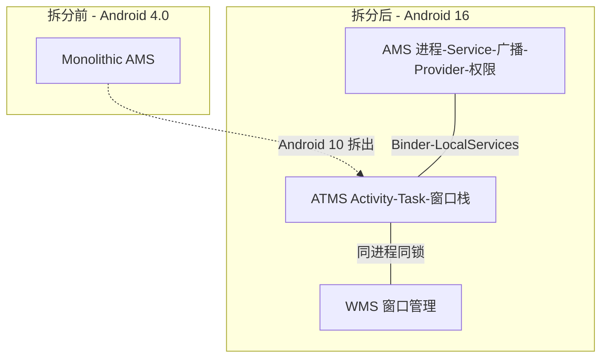
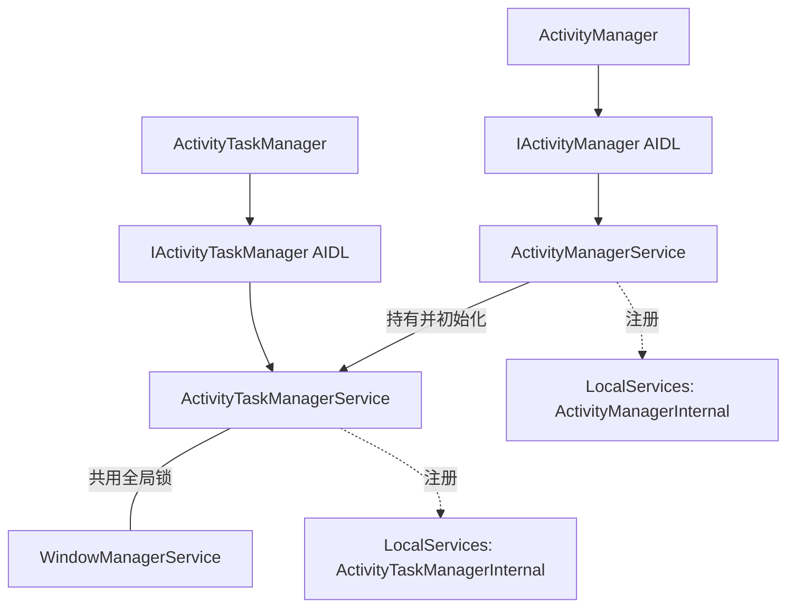
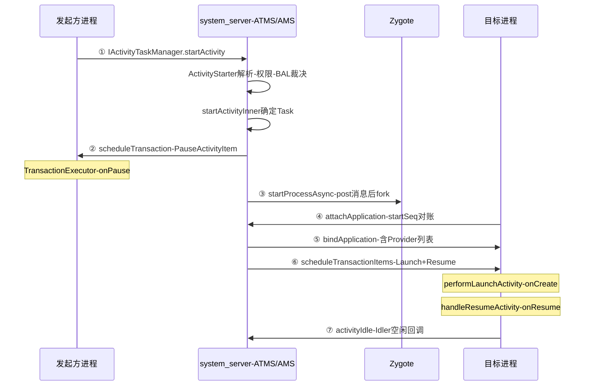

## 8.1 概述

原书第 5 章分析了 Android 4.0(2011 年)时代的 ActivityManagerService(AMS)。此后十几年 AMS 是整个 framework 里被改动最多的服务:Activity 职责拆出去了、杀进程换了引擎、广播队列整个重写、Crash 与 ANR(Application Not Responding,应用无响应)治理独立成军。本章以本地 AOSP 源码为准重新走一遍第 5 章的那几条线——**源码为 AOSP main 分支,提交时间 2025-03,对应 Android 16 / API 36 开发阶段**(下文统称"现代源码";个别新机制尚在开关灰度中,行文会标注)。

AMS 的职责定位没变,仍是**四大组件的启动、切换、调度及应用进程的管理和调度**中枢,但组织形式变了:



- **AMS(ActivityManagerService)** 保留进程管理、Service、广播、ContentProvider、权限与 backup 等职责,代码在 `services/core/java/com/android/server/am/`(下称 `am/`)
- **ATMS(ActivityTaskManagerService)** 接管 Activity/Task 的启动与调度。它虽是独立注册的 Binder 服务(`activity_task`),但与 WMS(WindowManagerService)**同属一个进程、共用一把全局锁**(`WindowManagerGlobalLock`),代码放在 `services/core/java/com/android/server/wm/`(下称 `wm/`)——"Task 与窗口本就是一体两面",索性合到一起
- 客户端对应拆分:`ActivityManager` → AMS,`ActivityTaskManager` → ATMS

### 8.1.1 Binder 接口的 AIDL 化

4.0 时代 `ActivityManagerNative`(AMN)/`ActivityManagerProxy`(AMP) 那套手写 Binder 已经消失,`IActivityManager`、`IActivityTaskManager` 均改为 AIDL(Android Interface Definition Language)生成的 Stub/Proxy。客户端取代理的方式:

```java
// ActivityManager.java
public static IActivityManager getService() {
    return IActivityManagerSingleton.get();  // Singleton 懒加载 ServiceManager 中的 "activity" 服务
}
```

AMS 与 system_server 内部其他服务之间则大量走 **LocalServices**(`ActivityManagerInternal`/`ActivityTaskManagerInternal`):同进程内不经过 Binder,直接方法调用,是 system_server 内部服务的"进程内接口注册表"。

### 8.1.2 AMS 家族图谱:现代版



AMS 本尊也不再是那个什么都揽的 Monolith——`am/` 目录如今有 130+ 个文件,职责被拆给一组协作者:

| 协作者 | 职责(4.0 时代在哪) |
|---|---|
| `ProcessList` | 进程孵化与登记,持有 `mProcessNames`/`mLruProcesses`(原在 AMS;`mPidsSelfLocked` 仍留在 AMS 上) |
| `ProcessStateController` + `OomAdjuster`(及 `OomAdjusterModernImpl`) | oom_adj 计算与应用(原 updateOomAdjLocked 系列) |
| `CachedAppOptimizer` | cached 进程冻结 freezer(4.0 无) |
| `BroadcastController` + `BroadcastQueue`/`BroadcastQueueModernImpl` | 广播派发(原 mParallelBroadcasts/mOrderedBroadcasts) |
| `ActiveServices` | Service 大管家(4.0 已有,职责未变) |
| `ContentProviderHelper` | ContentProvider(原 AMS 内联代码) |
| `AppErrors` + `AnrHelper` + `AppExitInfoTracker` | Crash/ANR 处理与死因记录(原 crashApplication 内联代码) |
| `UserController` | 多用户(4.0 几乎没有) |
| `AppProfiler`、`BatteryStatsService`、`ProcessStatsService` | 内存/CPU 画像与统计(原 mProcessStats 等) |
| `AppBindRecord`、`BackupRecord`、`PhantomProcessList` 等 | 各类专项记录 |

**读现代 AMS 源码的第一件事是接受"类变小、协作变多"**:一个 `attachApplication` 调用要在 AMS、ProcessList、ActiveServices、BroadcastQueue、ATMS 五个类之间跳。

### 8.1.3 ProcessRecord 家族与锁策略

ProcessRecord(ProcessRecord,进程档案)大幅瘦身,状态被拆到伴生对象:

- `ProcessStateRecord`:进程状态、oom_adj、procstate(4.0 时代散落在 ProcessRecord 的几十个字段)
- `ProcessProfileRecord`:CPU/内存画像
- `ProcessCachedOptimizerRecord`:冻结调度状态(如 `earliestFreezableTime`)
- `WindowProcessController`:**wm 侧的影子对象**——ATMS/WMS 不直接持有 am 包的 ProcessRecord,而是通过这个桥接类回访。第 5 章"ActivityRecord 与 Activity 对象分居两界"在现代源码里升级成了"am 与 wm 两个包之间也划界而治"

锁策略同样体系化了:`ActivityManagerGlobalLock` 是一个标记接口,AMS 实例本身(`synchronized(this)`)是全局锁,**ActivityManagerProcLock**(`mProcLock`)是嵌套的进程级细粒度锁,持有全局锁时才能拿进程锁。源码中大量 `LOSP`(Lock On Service Provider)/`LSP`(Lock On Service Provider-进程锁)后缀的方法名就是在声明自己的锁约定。ATMS/WMS 侧则是另一把 `WindowManagerGlobalLock`。**两把全局锁的获取顺序有严格约束**(AMS 锁 → wm 锁),反过来的路径必须先 post 消息脱手,8.3 节的 `startProcessAsync` 就是活例子。

## 8.2 AMS 的诞生:SystemServer 启动轨迹

4.0 时代那段著名的"AThread 双线程互等"已经没有了。现代 AMS 由 **SystemServiceManager** 统一孵化,且 **ATMS 先于 AMS 启动**:

```java
// SystemServer.java :: startBootstrapServices(节选)
// Activity manager runs the show.
ActivityTaskManagerService atm = mSystemServiceManager.startService(
        ActivityTaskManagerService.Lifecycle.class).getService();  // ① 先启动 ATMS
mActivityManagerService = ActivityManagerService.Lifecycle.startService(
        mSystemServiceManager, atm);                               // ② 再启动 AMS,注入 ATMS
mActivityManagerService.setSystemServiceManager(mSystemServiceManager);
mActivityManagerService.setInstaller(installer);
mWindowManagerGlobalLock = atm.getGlobalLock();                    // ③ SystemServer 也拿到 wm 全局锁句柄
```

`Lifecycle` 是 AMS 对 SystemService 体系的适配器:

```java
// ActivityManagerService.java :: Lifecycle
public static final class Lifecycle extends SystemService {
    private final ActivityManagerService mService;
    private static ActivityTaskManagerService sAtm;

    public Lifecycle(Context context) {
        super(context);
        mService = new ActivityManagerService(context, sAtm);  // 构造发生在 Lifecycle 构造里
    }

    public static ActivityManagerService startService(
            SystemServiceManager ssm, ActivityTaskManagerService atm) {
        sAtm = atm;   // 通过静态变量把 ATMS 递进构造函数
        return ssm.startService(ActivityManagerService.Lifecycle.class).getService();
    }

    @Override
    public void onStart() {
        mService.start();
    }

    @Override
    public void onBootPhase(int phase) {   // 按启动阶段回调:电池统计就绪、广播观察者启动、看门狗挂载等
        ......
    }
}
```

### 8.2.1 AMS 构造函数:协作者的组装线

```java
// ActivityManagerService.java :: 构造函数(节选,源码 2458 行起)
mHandlerThread = new ServiceThread(TAG, THREAD_PRIORITY_FOREGROUND, false /*allowIo*/);
mHandlerThread.start();
mHandler = new MainHandler(mHandlerThread.getLooper());     // 不再占用 fork 线程,消息线程独立成 ServiceThread
mProcStartHandlerThread = new ServiceThread(TAG + ":procStart", ...);  // 进程孵化还有专属线程

mProcessList = mInjector.getProcessList(this);              // 进程孵化与登记
mAppProfiler = new AppProfiler(this, ..., new LowMemDetector(this));
mProcessStateController = new ProcessStateController.Builder(this, mProcessList, activeUids)
        .useModernOomAdjuster(mConstants.ENABLE_NEW_OOMADJ) // OomAdjuster 新旧两版,开关切换
        .build();
mBroadcastController = new BroadcastController(mContext, this, mBroadcastQueue);
mServices = new ActiveServices(this);                       // Service 大管家
mCpHelper = new ContentProviderHelper(this, true);
mAppErrors = new AppErrors(mUiContext, this, mPackageWatchdog);
mBatteryStatsService = BatteryStatsService.create(...);
mProcessStats = new ProcessStatsService(this, new File(systemDir, "procstats"));
mUserController = new UserController(this);                 // 多用户
mActivityTaskManager = atm;                                 // 注入的 ATMS 在此保存
mActivityTaskManager.initialize(mIntentFirewall, mPendingIntentController, ...);
```

与 4.0 相比要点有三:

- **没有 AThread 了**。AMS 构造在 SystemServer 主线程完成,自己的消息循环跑在独立 `ServiceThread("ActivityManager")` 上,双线程互等的设计被 SystemServiceManager 的同步 startService 语义取代
- **系统运行环境的建立挪了窝**:4.0 在 AMS 的 `main()` 里调 `ActivityThread.systemMain()`;现代 SystemServer 在 `run()` 一开始就经 `createSystemContext()` 调 `ActivityThread.systemMain()` 搭好 system 进程的运行环境,轮到 AMS 构造时 `mSystemThread = ActivityThread.currentActivityThread()` 直接取现成的
- 构造尾声依旧把自己交给看门狗:`Watchdog.getInstance().addMonitor(this)`,并抢先做一次 `updateOomAdjLocked(OOM_ADJ_REASON_SYSTEM_INIT)`

### 8.2.2 start() 与 setSystemProcess

`onStart` → `start()` 负责把各统计服务 publish 到 ServiceManager 并向 LocalServices 注册进程内接口。`setSystemProcess()` 仍在 startOtherServices 阶段被调,骨架未变、细节全换:

```java
// ActivityManagerService.java :: setSystemProcess(节选)
ServiceManager.addService(Context.ACTIVITY_SERVICE, this, /* allowIsolated= */ true, ...);
ServiceManager.addService(ProcessStats.SERVICE_NAME, mProcessStats);
ServiceManager.addService("meminfo", new MemBinder(this));
ServiceManager.addService("gfxinfo", new GraphicsBinder(this));
ServiceManager.addService("dbinfo", new DbBinder(this));
ServiceManager.addService("permission", new PermissionController(this));
ServiceManager.addService("processinfo", new ProcessInfoService(this));
ServiceManager.addService("cacheinfo", new CacheBinder(this));   // 4.0 没有的缓存信息服务

ApplicationInfo info = mContext.getPackageManager().getApplicationInfo(
        "android", STOCK_PM_FLAGS | MATCH_SYSTEM_ONLY);
mSystemThread.installSystemApplicationInfo(info, getClass().getClassLoader());

synchronized (this) {
    // 为 system_server 自己建 ProcessRecord,纳入进程管理——4.0 的设计沿用至今
    ProcessRecord app = mProcessList.newProcessRecordLocked(info, info.processName, ...,
            new HostingRecord(HostingRecord.HOSTING_TYPE_SYSTEM));
    app.setPersistent(true);
    app.setPid(MY_PID);
    mProcessStateController.setMaxAdj(app, ProcessList.SYSTEM_ADJ);
    app.makeActive(new ApplicationThreadDeferred(mSystemThread.getApplicationThread()),
            mProcessStats);
    addPidLocked(app);
    updateLruProcessLocked(app, false, null);
    updateOomAdjLocked(OOM_ADJ_REASON_SYSTEM_INIT);
}
```

注意 `SYSTEM_ADJ` 的值:4.0 是 -16,现代是 **-900**——这不是数值漂移,而是整个 oom_adj 坐标系换成了内核的 `oom_score_adj`(0~1000,负值代表系统侧),8.6 节展开。

### 8.2.3 systemReady:四段式收尾

```java
// ActivityManagerService.java :: systemReady(节选,源码 8961 行起)
// 第一段:各控制器就绪
mActivityTaskManager.onSystemReady();
mUserController.onSystemReady();
mProcessList.onSystemReady();
mSystemReady = true;

// 第二段:清场——杀掉先于 AMS 就绪、不被允许的进程(系统升级期间的残留)
ArrayList<ProcessRecord> procsToKill = null;
synchronized (mPidsSelfLocked) { ...... }
synchronized (this) {
    if (procsToKill != null) {
        for (int i = procsToKill.size() - 1; i >= 0; i--) {
            mProcessList.removeProcessLocked(procsToKill.get(i), true, false,
                    ApplicationExitInfo.REASON_OTHER,      // 死因会被 AppExitInfoTracker 记账
                    ApplicationExitInfo.SUBREASON_SYSTEM_UPDATE_DONE, "system update done");
        }
    }
    mProcessesReady = true;
}
retrieveSettings();                                        // 读配置(条目远多于 4.0 的 4 个)

if (goingCallback != null) goingCallback.run();            // 第三段:回调 SystemServer(启动 SystemUI 等)

// 第四段:persistent 应用 + Home
synchronized (this) {
    startPersistentApps(PackageManager.MATCH_DIRECT_BOOT_AWARE);  // 只先起 directBootAware 的
    mBooting = true;
    mAtmInternal.startHomeOnAllDisplays(currentUserId, "systemReady");  // Home 交给 ATMS
    mAtmInternal.resumeTopActivities(false /* scheduleIdle */);
    // 设置 Binder 代理数量水位(防单个应用打死 system_server)
    BinderInternal.nSetBinderProxyCountWatermarks(BINDER_PROXY_HIGH_WATERMARK, ...);
}
```

4.0 时代 Home 启动靠 `mMainStack.resumeTopActivityLocked(null)` 兜底,现代源码是显式的 `startHomeOnAllDisplays`——多显示器时代,每个 Display 都要有自己的 Launcher。`ACTION_BOOT_COMPLETED` 仍在 Home Activity 空闲(`activityIdle`)后由 `finishBooting` 发出,机制与 4.0 相同。

## 8.3 Activity 启动全链路:ActivityStarter 与 ClientTransaction

第 5 章的 startActivity 分析在 Android 10 后要看 ATMS。骨架仍是"解析 → 找 Task → resume → 起进程 → 投递事务",但每一步的实现都换了人。

### 8.3.1 入口:IActivityTaskManager.startActivity

```java
// Instrumentation.java :: execStartActivity(节选)
int result = ActivityTaskManager.getService().startActivity(
        whoThread, who.getBasePackageName(), who.getAttributionTag(),
        intent, intent.resolveTypeIfNeeded(who.getContentResolver()),
        token, target != null ? target.mEmbeddedID : null,
        requestCode, 0, profilerInfo, options);
```

`ActivityTaskManager.getService()` 返回 `IActivityTaskManager` 的 AIDL 代理,目标是 `activity_task` 服务(ATMS)。ATMS 的 `startActivity` 只做 uid/pid 提取与 user 校验,随即转入 `ActivityStarter`:

```java
// ActivityTaskManagerService.java :: startActivityAsUser(节选,源码 1309 行)
return getActivityStartController().obtainStarter(intent, "startActivityAsUser")
        .setCaller(caller)
        .setCallingPackage(callingPackage)
        ......
        .setUserId(userId)
        .execute();
```

`ActivityStarter` 是 Android 6 诞生的专职类,由 **ActivityStartController** 统一池化管理;4.0 时代 ActivityStack 里 `startActivityMayWait`/`startActivityLocked`/`startActivityUncheckedLocked` 三板斧的职责全归了它。

### 8.3.2 ActivityStarter:executeRequest 与 startActivityInner

`execute()` 先解析 Intent(与 PKMS 交互查 ActivityInfo)、做权限与**后台启动限制**(Background Activity Launch, BAL;Android 10 引入,由 `BackgroundActivityStartController` 依据 allowlist 与启动裁决决定放行与否),然后进入核心:

```java
// ActivityStarter.java :: execute(节选,源码 1690 行附近)
try {
    Trace.traceBegin(Trace.TRACE_TAG_WINDOW_MANAGER, "startActivityInner");
    result = startActivityInner(r, sourceRecord, voiceSession, voiceInteractor,
            startFlags, options, inTask, inTaskFragment, balVerdict,
            intentGrants, realCallingUid);
} finally {
    startedActivityRootTask = handleStartResult(r, options, result, ...);
}
```

`startActivityInner` 的使命与 4.0 的 `startActivityUncheckedLocked` 一样——**为 ActivityRecord 找到归宿 Task**,但模型现代化了:

- 4.0 的"所有 ActivityRecord 塞一个 mHistory"早已重构为 **WindowContainer 树**:`DisplayContent → Task(rootTask) → TaskFragment → ActivityRecord`,Task 与窗口层级共享(多窗口、分屏、多显示器都长在这棵树上)
- launchMode 与 `FLAG_ACTIVITY_NEW_TASK`/`CLEAR_TOP` 的裁决逻辑仍在(`TaskFragment` 复用、`findTask` 搜索、clear 逻辑),但分散在 `Task`/`TaskFragment`/`ActivityStarter` 三处
- 入栈后同样走 resume 链:`RootWindowContainer.resumeFocusedTasksTopActivities()` → `Task.resumeTopActivityInnerLocked()`(对应 4.0 的 resumeTopActivityLocked)

### 8.3.3 进程不存在时:startProcessAsync 的"脱锁"设计

resume 链发现目标进程没起来时:

```java
// ActivityTaskManagerService.java :: startProcessAsync(节选,源码 5279 行起)
void startProcessAsync(ActivityRecord activity, boolean knownToBeDead, boolean isTop,
        String hostingType) {
    ......
    // Post message to start process to avoid possible deadlock of calling into AMS with the
    // ATMS lock held. —— 持 wm 锁时直接调 AMS(要拿 am 锁)可能死锁,必须先把手里的锁放下
    final Message m = PooledLambda.obtainMessage(ActivityManagerInternal::startProcess,
            mAmInternal, activity.processName, activity.info.applicationInfo, knownToBeDead,
            isTop, hostingType, activity.intent.getComponent());
    mH.sendMessage(m);
}
```

这是 8.1.3 锁纪律的活教材:wm 锁 → am 锁的逆向路径一律 post 消息。真正孵化在 `ProcessList.startProcessLocked`:

```java
// ProcessList.java :: startProcessLocked(节选,源码 2096 行起)
final String entryPoint = "android.app.ActivityThread";   // 入口类十几年未变
// 经 ZygoteProcess 与 zygote 通信 fork 子进程;新进程以 pid/startSeq 登记后,
// 同样挂 PROC_START_TIMEOUT(10 秒)超时消息
```

10 秒超时(`PROC_START_TIMEOUT = 10 * 1000 * Build.HW_TIMEOUT_MULTIPLIER`)与 4.0 一致,但现代源码把后续的 bindApplication 超时拆成了 **soft/hard 两级消息**(`BIND_APPLICATION_TIMEOUT_SOFT_MSG/HARD_MSG`):软超时先催(trace + 日志),硬超时才杀——给慢设备与大规模应用留了缓冲。

### 8.3.4 realStartActivityLocked:打包 ClientTransaction

4.0 时代 `realStartActivityLocked` 里那句 `app.thread.scheduleLaunchActivity(...)` 没了,取而代之的是**事务化投递**:

```java
// ActivityTaskSupervisor.java :: realStartActivityLocked(节选,源码 941 行起)
// Create activity launch transaction.
final LaunchActivityItem launchActivityItem = new LaunchActivityItem(r.token,
        r.intent, System.identityHashCode(r), r.info,
        procConfig, overrideConfig, deviceId, referrer, voiceSession,
        ..., r.getSavedState(), ..., results, newIntents, ..., activityWindowInfo);

// Set desired final state. —— 目标生命周期决定事务的"末态"
final ActivityLifecycleItem lifecycleItem;
if (andResume) {
    lifecycleItem = new ResumeActivityItem(r.token, isTransitionForward, ...);
} else if (r.isVisibleRequested()) {
    lifecycleItem = new PauseActivityItem(r.token);
} else {
    lifecycleItem = new StopActivityItem(r.token);
}

// Schedule transaction. —— 一个事务携带"要做什么"+"做到哪"
mService.getLifecycleManager().scheduleTransactionItems(
        proc.getThread(),
        true /* shouldDispatchImmediately */,
        launchActivityItem, lifecycleItem);
```

要点:

- **ClientTransaction 是"一批请求 + 一个目标终态"**:回调项(`ClientTransactionItem`,如 `LaunchActivityItem`、`NewIntentItem`、`ConfigurationChangeItem`)列表 + 生命周期末态项(`ActivityLifecycleItem`,如 `ResumeActivityItem`)。一次 Binder 往返携带一批工作,取代 4.0 时代 pause/stop/launch 各发一次的散装 `scheduleXxx`
- `resume` 前先暂停当前前台 Activity 的逻辑还在(`TaskFragment.startPausing`,投递的自然也是 `PauseActivityItem` 事务),500ms 的 pause 超时传统保留(`ActivityRecord.PAUSE_TIMEOUT = 500`)
- 事务在服务端由 `ClientLifecycleManager` 统一调度,还支持"延迟合并派发"——同一进程的多个事务攒一批再发

### 8.3.5 客户端:TransactionExecutor 的执行模型

客户端 `ApplicationThread`(仍是 IApplicationThread 的 Binder 服务端,即 ActivityThread 的内部类)收到事务:

```java
// ClientTransactionHandler.java :: scheduleTransaction
void scheduleTransaction(ClientTransaction transaction) {
    transaction.preExecute(this);                // 执行前钩子(如刷新pending状态)
    sendMessage(ActivityThread.H.EXECUTE_TRANSACTION, transaction);  // 照旧扔回主线程 Handler
}
```

主线程 `mH` 收到 `EXECUTE_TRANSACTION` 后交给 `TransactionExecutor`。本源码树的执行器是又一代重写(相对 Android 9~14 的"先 callbacks 后 lifecycleState"两段式):**逐项执行、边走边补路径**:

```java
// TransactionExecutor.java :: executeTransactionItems(节选)
for (int i = 0; i < size; i++) {
    final ClientTransactionItem item = items.get(i);
    if (item.isActivityLifecycleItem()) {
        executeLifecycleItem(transaction, (ActivityLifecycleItem) item);      // 生命周期项
    } else {
        executeNonLifecycleItem(transaction, item, ...);                      // 普通回调项
    }
}

// executeNonLifecycleItem 内部(节选):
final int postExecutionState = item.getPostExecutionState();
if (item.shouldHaveDefinedPreExecutionState()) {
    final int closestPreExecutionState = mHelper.getClosestPreExecutionState(r,
            postExecutionState);
    if (closestPreExecutionState != UNDEFINED) {
        cycleToPath(r, closestPreExecutionState, transaction);  // 把 Activity 沿生命周期"转"到前置状态
    }
}
item.execute(mTransactionHandler, mPendingActions);             // 真正干活,如 LaunchActivityItem.execute
item.postExecute(mTransactionHandler, mPendingActions);
```

`LaunchActivityItem.execute` → `client.handleLaunchActivity` → `performLaunchActivity`(反射创建 Activity、attach、onCreate);`ResumeActivityItem.execute` → `handleResumeActivity`(onResume)。`cycleToPath` 负责"从当前状态走到目标状态之间的每个生命周期回调都要补齐"——比如事务要求到达 RESUMED 而当前是 CREATED,就先走 `StartActivityItem`。**4.0 时代由 AMS 逐个 schedule 的生命周期序列,现在变成客户端自己按事务声明推导**,这是生命周期驱动方式最大的语义变化。

收尾动作也没变:主线程空闲时 `Idler.queueIdle` → `am.activityIdle(...)`,AMS 侧 `activityIdleInternal` 完成 stop 旧 Activity、发 BOOT_COMPLETED 等扫尾——第 5 章的这条"空闲回调"链路完整保留。

### 8.3.6 attachApplication:新进程的登记与授权

新进程的 `ActivityThread.main` → `attach(false)` → `ams.attachApplication(thread, startSeq)`,AMS 侧分三步(与 4.0 的三阶段同构):

```java
// ActivityManagerService.java :: attachApplication / attachApplicationLocked(节选)
public final void attachApplication(IApplicationThread thread, long startSeq) {
    synchronized (this) {
        int callingPid = Binder.getCallingPid();
        final int callingUid = Binder.getCallingUid();
        attachApplicationLocked(thread, callingPid, callingUid, startSeq);
    }
}
// 之一:按 pid + startSeq 匹配 ProcessRecord(防"旧进程复活顶包"),撤销启动超时消息
// 之二:bindApplication——赋予进程使命:
thread.bindApplication(processName, appInfo, ..., providerList,   // 注意:Provider 列表仍是第一个安排的
        instrumentationName, profilerInfo, ..., preBindInfo.configuration, ...);
// 之三:启动等待中的组件(委托给各协作者):
didSomething = mAtmInternal.attachApplication(app.getWindowProcessController());  // Activity
didSomething |= mServices.attachApplicationLocked(app);                            // Service
... // 广播、backup 等
```

Activity 这条腿:`mAtmInternal.attachApplication` → `RootWindowContainer.attachApplication` 遍历各 Display 的 Task,找到等在这个新进程门口的栈顶 ActivityRecord,调 `mTaskSupervisor.realStartActivityLocked(r, app, ...)`——回到 8.3.4,闭环。

### 8.3.7 全链路时序与现代对照



与 4.0 对比:**Binder 穿越次数没变(三次量级),但每次携带的信息密度变大了**——生命周期调度从"N 次散装 Binder"压缩为"打包事务";驱动方从 AMS 一家变成 AMS/ATMS 两家;客户端从"收到什么执行什么"变成"按事务声明自己推导路径"。**第 5 章的两条核心认知原样成立**:生命周期回调由系统远程驱动、在客户端主线程 Handler 中执行;ActivityRecord(token)与 Activity 对象分居两界,token 再与 WMS 的窗口层关联。

## 8.4 广播重构:BroadcastQueueModernImpl 与每进程队列

第 5 章的"并行/串行两条队列 + 全局串行"模型在 Android 14 前后被彻底重写。本源码树里 AMS 只持有一个 `mBroadcastQueue`,实现类是 `BroadcastQueueModernImpl`(约 2500 行),设计思想记录在源码自带的 `BroadcastQueue.md` 里——**以进程为中心重组队列**。

### 8.4.1 旧模型的问题

4.0 模型(`mParallelBroadcasts` + `mOrderedBroadcasts`,后来演进为 fg/bg 两条 BroadcastQueue)有两个结构性毛病:

- **全局 head-of-line blocking(队头阻塞)**:ordered 广播是全局串行,一条不相干的慢广播能卡住整条队列
- **派发粒度是"广播"而非"进程"**:同一进程可能同时被并行队列连发多条,不同进程之间又没有公平性可言,OOM(Out of Memory,内存不足杀进程)调整被频繁触发

### 8.4.2 每进程队列与 runnable at

新模型为**每个 `android:process`(不管进程是否活着)维护一个 `BroadcastProcessQueue`**:

```mermaid
graph LR
    B[broadcastIntent 入口] --> PA[进程A队列]
    B --> PB[进程B队列]
    B --> PC[进程C队列]
    PA -.runnable at 时间戳.--> S[调度排序]
    PB -.runnable at 时间戳.--> S
    S --> R[运行槽位-running 最多4个]
    S --> COLD[冷启动槽位-同时仅1个]
    R --> D[派发后可续发批量广播摊薄OOM调整]
```

每个队列有一个 **runnable at 时间戳**(下次可执行时刻),由一组策略推算:

- 广播属性:urgent 广播提前、delay 广播推后
- 进程状态:cached 进程推后、instrumented 进程提前
- 依赖阻塞:ordered/prioritized 广播在等待前序接收者完成时不可运行

调度器按 runnable at 排序,选等得最久的先提升为 running。**并发放开关控制**:

```java
// BroadcastConstants.java(节选)
public int MAX_RUNNING_PROCESS_QUEUES =
        ActivityManager.isLowRamDeviceStatic() ? 2 : 4;      // 常规设备最多 4 个进程同时收广播
```

同时**至多一个进程处于冷启动中**——fork zygote 是重活,串行化避免 thundering herd(惊群)(4.0 时代靠"静态接收者全塞串行队列"回避的问题,如今成了显式的一格冷启动槽位)。

防饿死三板斧(来自 `BroadcastQueue.md`):积压过多(`MAX_PENDING_BROADCASTS`)时无视 delay;一个进程连续派发过多(`MAX_RUNNING_ACTIVE_BROADCASTS`)时临时"退役"让位;urgent 广播走独立的 `mPendingUrgent` 优先通道。客户端侧的投递链路则没有大变:AMS 仍是 `scheduleRegisteredReceiver` Binder 调用过去,InnerReceiver 用注册时的 Handler post 一个 Runnable,`run()` 里调 `receiver.onReceive`——ordered 广播处理完回调 `finish()`,这套 4.0 时代的结构原样保留。

### 8.4.3 前台/后台与 ANR 的 soft/hard 超时

fg/bg 两条物理队列没了,**前后台语义收敛为逐广播的标志位与超时参数**:

```java
// BroadcastQueueModernImpl.java :: processNextBroadcast(节选)
final int softTimeoutMillis = (int) (r.isForeground() ? mFgConstants.TIMEOUT
        : mBgConstants.TIMEOUT);       // fg 10s / bg 60s 的传统数值保留为两组 BroadcastConstants
startDeliveryTimeoutLocked(queue, softTimeoutMillis);
```

ANR 治理引入 **soft/hard 两级超时**:CPU 争用严重时软超时最多放宽一倍再观察,硬超时才真正判死——慢设备上"广播 ANR 但进程其实还活着"的误杀显著减少。静态接收者仍可能触发进程冷启动(挂在该进程队列上等 attach),**"任何广播对静态接收者都是 ordered 的"这条第 5 章结论在新模型里依然成立**,只是实现从全局串行队列换成了每进程队列里的依赖阻塞。

外围收紧仍在继续:Android 8 起大量隐式广播不再投递给 manifest receiver;Android 13 起动态注册非系统广播必须声明 `RECEIVER_EXPORTED`/`RECEIVER_NOT_EXPORTED`;sticky 广播则早已进入废弃流程。

## 8.5 Service 与前台服务:ActiveServices 的准入与限制

`ActiveServices` 从 4.0 一路走来还是那个 Service 大管家,`ServiceRecord`/`ConnectionRecord`/`BindRecord` 的三级模型、`scheduleCreateService` → 主线程 `handleCreateService`(反射创建、onCreate)的投递路径都没变。变的是**权限与准入**:

**后台 Service 禁令(Android 8)**。后台进程 `startService` 直接抛 `IllegalStateException`,合法路径只剩 `startForegroundService`——它要求 Service 在限时内调用 `startForeground` 挂出常驻通知:

```java
// ActivityManagerConstants.java(节选)
private static final int DEFAULT_SERVICE_START_FOREGROUND_TIMEOUT_MS = 30 * 1000;  // 起前台限时
private static final long DEFAULT_SERVICE_TIMEOUT = 20 * 1000 * Build.HW_TIMEOUT_MULTIPLIER;        // 前台 Service 生命周期超时
private static final long DEFAULT_SERVICE_BACKGROUND_TIMEOUT = DEFAULT_SERVICE_TIMEOUT * 10;        // 后台 Service 200s
```

超时未 `startForeground` → `serviceForegroundTimeoutANR`(ANR 而非直接杀,给系统留观察窗口)。两条超时链路都在 ActiveServices 里,以定时器驱动:

```java
// ActiveServices.java(节选)
// ① Service 生命周期超时:超时会遍历该进程"正在执行中"的 Service,
//    找出 executingStart 早于 deadline 的那个,转入 ANR 流程(AnrHelper)
void serviceTimeout(ProcessRecord proc) {                     // 源码 7517 行
    ......
    final long maxTime = now
            - (psr.shouldExecServicesFg()                     // 前台 20s / 后台 200s
            ? mAm.mConstants.SERVICE_TIMEOUT
            : mAm.mConstants.SERVICE_BACKGROUND_TIMEOUT);
    for (int i = psr.numberOfExecutingServices() - 1; i >= 0; i--) {
        ServiceRecord sr = psr.getExecutingServiceAt(i);
        if (sr.executingStart < maxTime) { timeout = sr; break; }
    }
    ......                                                     // 调试中或无执行中 Service 则撤销定时器
}

// ② startForegroundService 限时:必须在限时内调 startForeground,否则 ANR
void scheduleServiceForegroundTransitionTimeoutLocked(ServiceRecord r) {
    r.fgWaiting = true;
    mServiceFGAnrTimer.start(r, mAm.mConstants.mServiceStartForegroundTimeoutMs);  // 默认 30s
}
```

注意 `Build.HW_TIMEOUT_MULTIPLIER`:现代源码的超时值会按硬件档位缩放,裸记"20 秒"要带这个系数意识。

**前台服务类型制(FGS,Foreground Service;Android 14)**。前台服务必须在 Manifest 声明 `foregroundServiceType`(location/camera/mediaPlayback/dataSync/shortService 等十余种),运行时按类型二次校验——类型没声明、声明了没权限、运行行为与类型不符都会被拒。`ActiveServices` 源码里维护着"哪些类型允许在后台启动"的白名单位图,以及 while-in-use(使用中)权限模型:FGS 想用位置/相机/麦克风,不仅要权限,还要求**发起进程当时具备相应的进程能力(process capability,Android 11 引入,由 OomAdjuster 在算 adj 时一并计算,见 8.6.3)**。

一句话总结这十几年:**Service 的生命周期模型一点没变,准入模型翻了一倍厚**。

## 8.6 进程管理与 OOM 调节:新坐标系、新引擎、新刑罚

### 8.6.1 oom_score_adj:从 -16~15 到 -1000~999

现代 `ProcessList` 的 adj 阶梯(与 Linux 内核 `oom_score_adj` 同坐标系):

```java
// ProcessList.java(节选)
public static final int NATIVE_ADJ = -1000;            // 原生守护进程(不含 zygote)
public static final int SYSTEM_ADJ = -900;             // system_server
public static final int PERSISTENT_PROC_ADJ = -800;    // persistent 应用
public static final int PERSISTENT_SERVICE_ADJ = -700;
public static final int FOREGROUND_APP_ADJ = 0;        // 前台应用
public static final int PERCEPTIBLE_RECENT_FOREGROUND_APP_ADJ = 50;
public static final int VISIBLE_APP_ADJ = 100;         // 可见但不在前台(按窗口层级还能细分)
public static final int PERCEPTIBLE_APP_ADJ = 200;     // 用户可感知(后台放音乐等)
public static final int BACKUP_APP_ADJ = 300;
public static final int HEAVY_WEIGHT_APP_ADJ = 400;
public static final int SERVICE_ADJ = 500;             // 有 service 的进程
public static final int HOME_APP_ADJ = 600;            // Launcher
public static final int PREVIOUS_APP_ADJ = 700;        // 上一个应用(快速切回)
public static final int SERVICE_B_ADJ = 800;           // B List service(长期无人绑定的旧服务)
public static final int CACHED_APP_MIN_ADJ = 900;      // cached 进程区间 900~999
public static final int CACHED_APP_MAX_ADJ = 999;
```

与 4.0 的 -16~15 相比:概念一一对应(SYSTEM/PERSISTENT/FOREGROUND/VISIBLE/PERCEPTIBLE/SERVICE/HOME/PREVIOUS/BACKUP/CACHED 都在),数值全部重标定,且 **cached 进程独占 100 档(900~999)**——这 100 档内部还要再分桶(bucket)排序,对应"最近最少使用"的细粒度 LRU。

### 8.6.2 杀手换引擎:内核 LMK → userspace lmkd + PSI

4.0 的内核态 lowmemorykiller 驱动(minfree 阈值数组)在 Android 9 后被 userspace 守护进程 **lmkd**(Low Memory Killer Daemon)取代:

- AMS 侧由 `ProcessList` 经 `OomConnection` 与 lmkd 维持 socket 长连接,把每个进程的 oom_score_adj、进程名单同步过去;连接断开自动重连(`LMKD_RECONNECT_DELAY_MS = 1000`)
- lmkd 不再轮询剩余内存,而是订阅内核 **PSI**(Pressure Stall Information,内存压力停顿指标)事件,内存压力到达 some/full 阈值时再决策杀谁——从"水位驱动"进化为"停顿驱动",对突发的感知快得多
- 亲手杀进程的从内核换成了 lmkd(写 `/dev/memcg/.../kill` 或 signal),AMS 只提供"名单与理由",**裁决权与执行权分离**;死因经 `AppExitInfoTracker` 记账(8.7.4)

### 8.6.3 OomAdjuster:计算模型的两次迭代

`OomAdjuster`(源码亦附设计文档 `OomAdjuster.md`)每次组件状态变化都会被触发(Activity resume、Service bind、Provider 发布、进程死亡……检查点密度与 4.0 相当),负责算三样东西:

1. **Process State**(`PROCESS_STATE_*`,数百档,供全 system_server 判断进程 foreground 与否)
2. **Oom adj score**(同步给 lmkd)
3. **Scheduler Group / 进程能力**(大小核调度、while-in-use 能力位)

计算骨架仍是"取最强组件状态打底,再沿**进程依赖图**传播":前台应用绑定的后台 Service 要保命(客户端把自己的 adj "传染"给服务端)、ContentProvider 客户端把 Provider 进程往上拽——第 5 章 computeOomAdjLocked 的这些规则完整存活,并且绑端 service/provider 的传播规则在 `OomAdjuster.md` 里有两张条件真值表,细致到每个 BIND_* flag 的组合。

老实现的痛点是**依赖环**:A 绑 B、B 绑 A 时,递归计算要用全局序列号 `mAdjSeq` 检测环、回退重试(上限 10 次),复杂度 O((1+重试次数)×进程数×连接数),且结果依赖输入顺序、可能算错。本源码树里已有换血后的 **OomAdjusterModernImpl**:

```text
# OomAdjuster.md 伪代码(原文意译)
对进程表里每个进程:只按自身组件状态计算初始状态(不含客户端),按状态放入对应桶
从最高桶到最低桶逐桶遍历:桶内每个进程检查它绑定的服务/Provider,
若因绑定关系可以提升,则把被绑定进程搬到更高的桶
```

桶(bucket)+ 广度优先传播,复杂度降为 O(进程数×连接数),且"应用不可能把它连的服务/Provider 提到自己之上"的不变量天然成立。**新旧实现并存,由 `ActivityManagerConstants.ENABLE_NEW_OOMADJ`(DeviceConfig 键 `enable_new_oom_adj`,默认值来自 aconfig 标志 `oomadjuster_correctness_rewrite`)切换**——读源码时要在 `ProcessStateController.Builder().useModernOomAdjuster(...)` 处分叉,两套都在维护。

### 8.6.4 CachedAppOptimizer:杀不死你的,先冻住你

cached 进程(adj ≥ `FREEZER_CUTOFF_ADJ = 900`)的待遇从"等着被杀"升级为"先冻结":

- **cgroup freezer**:通过 cgroup v2 的 freezer 把进程整个冻住——不占 CPU、不耗电,但内存还在、恢复零成本;相比 LMK 杀进程后冷启动的秒级开销,解冻是毫秒级
- 冻结按 **uid 粒度**统一裁决(`areAllProcessesFrozen`:同 uid 下所有进程都该冻才冻),冻/解冻是异步的(`freezeAppAsyncLSP`),带 `earliestFreezableTime` 延迟窗防抖
- **冻结的代价与兜底**:进程被冻期间如果有别的进程给它发 Binder 调用,调用会挂起。system_server 侧专门有 `frozenBinderTransactionDetected(pid, code, flags, err)`(SystemServer.java:1010)感知这一情况,必要时解冻;被冻进程有广播要收时,广播队列的 runnable at 也要提前解冻再派发
- 配套的 `CacheOomRanker` 按使用频率等信号给 cached 进程排桶位,决定谁先冻、谁先被 lmkd 盯上

**"应用退出 ≠ 进程退出"的第 5 章结论在现代源码里又进了一步**:退出的应用先是 Empty/cached 进程留在 LRU 里(`mLruProcesses` 还在 ProcessList),然后大概率被冻而不是被杀——用户感知到的"后台被杀"其实多数只是"被冻结后内存真的不够才杀"。

## 8.7 Crash 与 ANR 的现代治理

### 8.7.1 Crash:KillApplicationHandler

客户端入口仍是 `RuntimeInit.commonInit()`,只是 4.0 的 `UncaughtHandler` 更名并拆成两个 handler:

```java
// RuntimeInit.java :: commonInit(节选)
LoggingHandler loggingHandler = new LoggingHandler();
RuntimeHooks.setUncaughtExceptionPreHandler(loggingHandler);   // pre handler:先记日志,应用换不掉
Thread.setDefaultUncaughtExceptionHandler(new KillApplicationHandler(loggingHandler));
```

应用可以用 `Thread.setDefaultUncaughtExceptionHandler` 覆盖默认行为(崩溃上报 SDK 的原理),但 pre handler 换不掉。`KillApplicationHandler` 的套路与 4.0 相同:调 `AMS.handleApplicationCrash` 上报,最后 `Process.killProcess` + `System.exit` 自我了断。

### 8.7.2 AppErrors:从内联代码到专职科室

AMS 里的 `crashApplication` 逻辑整体搬入 `AppErrors`:

- 流程骨架不变:找 ProcessRecord → `addErrorToDropBox` 存档 → 弹错误对话框("关闭应用"/"关闭并反馈") → `handleAppCrashLocked` 做崩溃计数、跳过它正在处理的串行广播
- **bad process 熔断**仍在:短时间反复崩的应用进 bad process 名单,后台不再自动拉起
- 新增与 **PackageWatchdog** 的联动:核心系统组件反复 crash 可能触发 RescueParty/回滚机制——这是 4.0 完全没有的"系统自愈"路线
- 进程死亡的 Binder death notification(`AppDeathRecipient.binderDied`)→ `handleAppDiedLocked` 打理身后事的链路(Service 清理、Provider 重启或连带杀客户端、persistent 进程自动重启)与 4.0 同构,代码分进了 `ActiveServices`/`ContentProviderHelper`

### 8.7.3 ANR:AnrHelper 的异步化与 early dump

4.0 时代 ANR 在超时消息里同步处理(dump 堆栈、弹窗),大机型上 dump 本身就能把 system_server 拖住数秒。现代实现拆出 `AnrHelper`,把"记账"与"重活"分离:

```java
// AnrHelper.java :: appNotResponding(节选)
synchronized (mAnrRecords) {
    ...... // 去重:同 pid 正在处理/在队/预dump中,直接跳过
    // We dump the main process as soon as we can on a different thread,
    // this is done as the main process's dump can go stale in a few hundred
    // milliseconds and the average full ANR dump takes a few seconds.
    // —— 主进程的堆栈几百毫秒就会过时,全量 dump 要几秒:先抢一份"新鲜"的
    Future<File> firstPidDumpPromise = mEarlyDumpExecutor.submit(() -> {
        File tracesFile = StackTracesDumpHelper.dumpStackTracesTempFile(incomingPid, ...);
        return tracesFile;
    });
    mAnrRecords.add(new AnrRecord(anrProcess, ...));   // 入队,由 AnrHelper 线程慢慢处理
}
```

设计动机写在注释里:ANR 主角的堆栈**几百毫秒就会过时**,而完整 dump 平均要几秒——所以先在独立线程抢一份"early dump"保真,正式流程(全量 trace、CPU 快照、dropbox、弹窗/静默)异步排队做。三类超时的传统数字(输入 5s、前台 Service 20s、前台广播 10s)与"主线程 MessageQueue 断粮"的本质都没变,广播侧还叠了 8.4.3 的 soft/hard 两级宽限。

### 8.7.4 AppExitInfoTracker:死因档案室

"我的进程为什么被杀?"在 4.0 时代只能翻 logcat。Android 11 起 `AppExitInfoTracker` 把每次进程死亡的原因(`ApplicationExitInfo.REASON_*`:LMK、ANR、crash、用户停止、信号……)持久化,应用可通过 `ActivityManager.getHistoricalProcessExitReasons()` 查询自己的死因档案——8.2.3 里那句 `SUBREASON_SYSTEM_UPDATE_DONE` 就是往这份档案里写记录。

## 8.8 总结:4.0 → 16 的变与不变

| 维度 | Android 4.0(第 5 章) | Android 16(本章源码) |
|---|---|---|
| 服务形态 | Monolithic AMS,Activity 栈也在里面 | AMS + ATMS 分治;am/ 目录 130+ 协作者;AIDL 接口;LocalServices 进程内协作 |
| Binder 接口 | 手写 ActivityManagerNative/AMP | IActivityManager/IActivityTaskManager 由 AIDL 生成 |
| 启动方式 | AThread 双线程互等 + ActivityThread.systemMain | SystemServiceManager 孵化;ATMS 先启动再注入;运行环境建立提前到 SystemServer.run |
| Activity 调度 | mHistory 单栈、startActivityUncheckedLocked 找 Task | WindowContainer 树(Display→Task→TaskFragment→ActivityRecord);ActivityStarter 裁决;多显示器/多窗口原生 |
| 生命周期投递 | schedulePauseActivity 等散装 Binder | ClientTransaction 事务打包(LaunchActivityItem + 终态项);客户端 TransactionExecutor 按声明推导路径 |
| 广播 | 并行/串行两条队列,全局串行 | BroadcastQueueModernImpl 每进程队列 + runnable at;最多 4 个 running 槽;冷启动一次仅一个;soft/hard ANR 超时 |
| Service | 随便起、随便驻留 | 后台 startService 禁令;startForegroundService + 30s 限时;FGS 类型制;while-in-use 能力校验 |
| oom 坐标系 | oom_adj -16~15,写 /proc/pid/oom_adj | oom_score_adj -1000~999;cached 900~999 分桶 |
| 杀进程引擎 | 内核 lowmemorykiller + minfree | userspace lmkd + PSI 事件;cgroup freezer 先冻后杀;CacheOomRanker 排桶 |
| adj 计算 | computeOomAdjLocked 递归 | OomAdjuster;ModernImpl 桶+广度优先,flag 灰度切换 |
| Crash/ANR | 内联 handleApplicationCrash;同步 ANR | AppErrors/AnrHelper/PackageWatchdog 自愈;ANR 异步化 + early dump;死因档案 AppExitInfoTracker |

**三根没动的桩**:

1. **双界对应**——服务端的 ActivityRecord/ProcessRecord 与客户端的 Activity/ActivityThread 永远隔 Binder 相望,token 是两岸唯一的桥
2. **adj 与组件状态联动**——"前台放音乐杀不死、空进程最先死"的规则从 4.0 的 computeOomAdjLocked 一路传到 OomAdjusterModernImpl,所有保活技巧对抗的仍是同一张表
3. **Binder + Handler 三段式**——系统侧远程驱动、ApplicationThread 回投、客户端主线程 MessageQueue 执行;散装 schedule 变成了打包事务,但"回调发生在主线程"这件事十五年没变

**两条主线变化**:**进程怎么死**(内核驱动水位杀 → lmkd+PSI+freezer 的分级刑罚)与**后台能干什么**(从自由驻留到处处设卡)。读懂第 5 章的骨架再来看本章,演进脉络就是这两句话。
