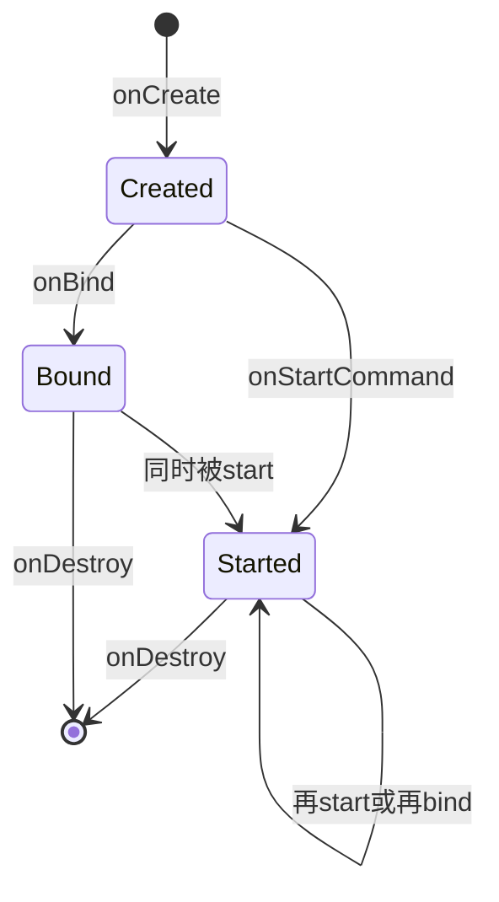
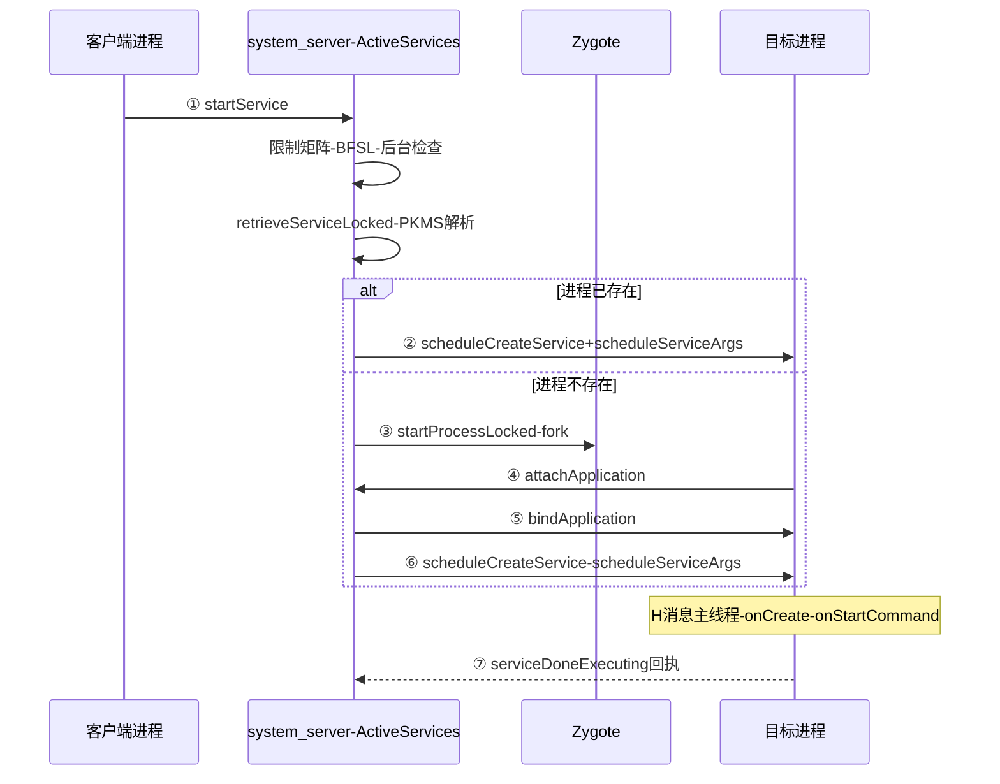

## 9.1 概述

上一章沿 Activity 与广播链路看了 AMS 与 ATMS 的分工，本章下沉到四大组件中"没有 UI、供后台长期执行业务逻辑"的一个：Service——播放音乐、下载数据、维持长连接、对外提供 Binder 服务。它的调度中枢是 ActiveServices，本章源码（与上一章同一棵 AOSP main 树，Android 16 / API 36 开发阶段）里它有 9444 行，AMS 只是把 `startService`/`bindService`/`stopService` 等 Binder 调用转手给它。

> 版本注意：Service 的准入与前台服务契约在 Android 8/12/13/14 被逐版收紧（后台 start 禁令、类型制、限时类型），生命周期与投递骨架则与 4.0 一致；文中按 Android 16 源码描述，收紧项均标注了引入版本。
>
> 摘编声明：文中代码均为摘编版——保留主干与关键分支，省略日志、trace 与样板代码；类名与方法名与 AOSP 一致，可对照源码阅读，代码块首行标注来源类与方法。

两种驱动方式，决定两套生命周期：

- **startService**：发 Intent 交代任务，`onStartCommand` 逐次接收；生命周期由 `stopSelf`/`stopService` 终结
- **bindService**：建立 Binder 绑定，`onBind` 返回 IBinder；生命周期延续到最后一个客户端 `unbindService`
- 两者可叠加：同一 Service 实例可以既被 start 又被 bind，**总引用计数归零才销毁**



注意一个对比鲜明的细节：**Service 没有被 ClientTransaction 化**。Activity 的生命周期在 Android 9 后打包成事务投递，Service 到本源码树为止仍是散装 Binder 调用 + 主线程 Handler 消息：`scheduleCreateService` → `H.CREATE_SERVICE`、`scheduleServiceArgs` → `H.SERVICE_ARGS`、`scheduleBindService` → `H.BIND_SERVICE`——原书第 5 章 4.0 时代的投递骨架原样保留，读起来反而比 Activity 链路亲切。

### 9.1.1 核心数据结构

| 结构 | 职责 |
|---|---|
| `ServiceRecord` | 一个 Service 实例的总档案：`startRequested`、`pendingStarts`/`deliveredStarts`（待投递/已投递的 start 项）、`bindings`、`executeNesting`（执行计数）、`restartDelay`/`restartCount`（重启退避）、`fgRequired`/`isForeground` |
| `IntentBindRecord` | 按**绑定 Intent** 维度的记录：哪些 app 绑了这条 intent、`hasBound`/`requested`（onBind 是否已投递） |
| `AppBindRecord` | 一次"某 app 与该 Service 的绑定关系"的聚合体 |
| `ConnectionRecord` | 一次 `bindService` 调用的记录，持有客户端的 `IServiceConnection` 与 BIND 标志 |
| `ProcessServiceRecord` | 进程维度的 Service 汇总（挂在 ProcessRecord 上）：`executingServices`、`startedServices`——ANR 定时器与 oom_adj 计算从这里取数 |
| `StartItem`（内嵌于 ServiceRecord） | 一次 start 请求：`id`（startId）、`intent`、`deliveryCount`（投了几次）、`doneExecutingCount`（serviceDoneExecuting 回了几次） |

**双界对应**：AMS 侧只有 ServiceRecord + token，客户端才有 Service 对象——和 ActivityRecord/Activity 的关系一模一样。

### 9.1.2 四条链路总览

全章按 start、bind、销毁与重启、前台服务四条链路推进，先看总览再逐节深入：

| 链路 | 节 | 服务端入口 | 客户端回调 | 关键超时/退避 |
|---|---|---|---|---|
| startService | 9.2 | `ActiveServices#startServiceLocked` → `bringUpServiceLocked` → `realStartServiceLocked` | `onCreate` → `onStartCommand`（H.CREATE_SERVICE / H.SERVICE_ARGS） | 生命周期 20s（前台档）/200s（后台档） |
| bindService | 9.3 | `ActiveServices#bindServiceLocked` → `requestServiceBindingLocked` | `onBind` → `onServiceConnected`（H.BIND_SERVICE） | — |
| 销毁与重启 | 9.4 | `stopServiceToken` → `bringDownServiceLocked` → `scheduleServiceRestartLocked` | `onUnbind` → `onDestroy`（H.UNBIND_SERVICE / H.STOP_SERVICE） | 重启 1s×4 指数退避；bound 型 30min×崩溃次数、上限 16 次 |
| 前台服务 | 9.5 | `setServiceForegroundInnerLocked`、short FGS 定时器 | `startForeground`、`onTimeout` | startForegroundService 兑现 30s；shortService 3min |

## 9.2 startService 全链路

### 9.2.1 客户端入口：调用与错误标记

`Context.startService` 的实现落在 ContextImpl.startServiceCommon：先带着 IApplicationThread 发一次同步 Binder 调用给 AMS，再处理返回值。这里有个值得注意的设计——**AMS 拒绝请求时不抛异常，而是返回一个特殊的 ComponentName 作为错误标记**，由客户端识别标记后转换成异常抛给应用：

```java
// ContextImpl#startServiceCommon(节选)
ComponentName cn = ActivityManager.getService().startService(
        mMainThread.getApplicationThread(), service, ..., requireForeground, ...);
if (cn != null) {
    if (cn.getPackageName().equals("!")) {
        // "!" 标记:目标 Service 需要调用方没有的权限
        throw new SecurityException("Not allowed to start service " + service
                + " without permission " + cn.getClassName());
    } else if (cn.getPackageName().equals("?")) {
        // "?" 标记:目标应用整体处于后台,不允许启动它的 Service
        throw ServiceStartNotAllowedException.newInstance(requireForeground,
                "Not allowed to start service " + service + ": " + cn.getClassName());
    }
}
// startForegroundService 额外记录调用点堆栈:之后若因没按期 startForeground 而崩溃,
// 崩溃信息里会带上这段堆栈,指明这次 FGS 是从哪里发起的
if (cn != null && requireForeground) {
    Service.setStartForegroundServiceStackTrace(cn.getClassName(),
            new StackTrace("Last startServiceCommon() call for this service was made here"));
}
```

`ServiceStartNotAllowedException` 继承自 IllegalStateException。4.0 时代这类拒绝只是一句笼统的 IllegalStateException，Android 16 源码把各种拒绝原因拆成了专门的异常家族（`ServiceStartNotAllowedException`、`ForegroundServiceStartNotAllowedException`、`MissingForegroundServiceTypeException` 等），看异常名就知道被拒的原因。

那么服务端凭什么判定"后台不许启动"？答案在 ActiveServices.startServiceLocked——所有 startService 类调用经 Binder 进入 system_server 后，AMS 都转交给它处理，任何请求都要先过这一关。

### 9.2.2 startServiceLocked：先过限制矩阵

startServiceLocked 开头先确认两件事：**调用方是谁、目标 Service 是什么**：

```java
// ActiveServices#startServiceLocked(节选,939 行起)
final boolean callerFg;
if (caller != null) {
    final ProcessRecord callerApp = mAm.getRecordForAppLOSP(caller);
    ......
    // 判定调用方算不算前台:依据是它的进程调度组,与它有没有可见的 Activity 无关
    callerFg = callerApp.mState.getSetSchedGroup() != ProcessList.SCHED_GROUP_BACKGROUND;
} else {
    callerFg = true;   // 没有 ProcessRecord 的调用方(如 shell)按前台对待
}
// 向 PKMS 解析目标 Service,命中已有的 ServiceRecord 或新建一个
ServiceLookupResult res = retrieveServiceLocked(service, instanceName, ...);
......
// startForegroundService 专属的后台启动限制检查(源码注释简称 BFSL)
setFgsRestrictionLocked(callingPackage, callingPid, callingUid, service, r, userId,
        backgroundStartPrivileges, false /* isBindService */);
```

`callerFg` 会一路透传成后面的 `execInFg`：调用方在前台，Service 的生命周期回调就按前台档 20 秒计 ANR（Application Not Responding，应用无响应），反之 200 秒。身份确认之后，才是这道关卡的主体——一组按顺序执行的准入检查，4.0 时代"后台随便 start"的门就是被它们关上的：

```java
// startServiceLocked 限制矩阵(节选)
// ① 目标 app 处于后台(uid 不活跃)?
final boolean bgLaunch = !mAm.isUidActiveLOSP(appUid);
// ② 用户开了严格后台限制(设置里的 Restricted / Uninstalled apps)?
if (bgLaunch && appRestrictedAnyInBackground(appUid, appPackageName) && ......) {
    forcedStandby = true;
}
// ③ startForegroundService 的 FGS 启动豁免检查(BFSL/while-in-use):
//    不满足 → Android 14+ 抛 ForegroundServiceStartNotAllowedException,老版本静默拒绝
if (fgRequired) {
    if (!r.isFgsAllowedStart() && isBgFgsRestrictionEnabled(r, callingUid)) {
        if (CompatChanges.isChangeEnabled(FGS_START_EXCEPTION_CHANGE_ID, callingUid)) {
            throw new ForegroundServiceStartNotAllowedException(msg);
        }
        return null;
    }
}
// ④ 普通后台 startService 禁令(O+):返回 "?" 标记,即 9.2.1 里客户端
//    转成 ServiceStartNotAllowedException 抛出的那种情况
if (forcedStandby || (!r.startRequested && !fgRequired)) {
    final int allowed = mAm.getAppStartModeLOSP(appUid, appPackageName,
            appTargetSdkVersion, callingPid, false, false, forcedStandby);
    if (allowed != ActivityManager.APP_START_MODE_NORMAL) {
        ......
        return new ComponentName("?", "app is in background uid " + uidRec);
    }
}
// ⑤ targetSdk < O 的老应用:不强制 startForegroundService → startForeground 契约
if (appTargetSdkVersion < Build.VERSION_CODES.O && fgRequired) {
    fgRequired = false;
}
// ⑥ 包正被 freezer 冻结(安装/升级等场景):延迟到解冻后再拉起
if (deferServiceBringupIfFrozenLocked(r, service, callingPackage, ...)) {
    return null;
}
```

### 9.2.3 登记与两分支拉起

准入检查全部通过后，`startServiceInnerLocked` 把这次请求登记成 `StartItem`（带自增 `startId`）塞进 `r.pendingStarts`，然后 `bringUpServiceInnerLocked` 分两路：

```java
// ActiveServices#bringUpServiceInnerLocked(节选,5741 行起)
if (r.app != null && r.app.isThreadReady()) {
    // 分支一:进程已活着,直接补投 onStartCommand
    r.updateOomAdjSeq();
    sendServiceArgsLocked(r, execInFg, false);
    return null;
}
......
// 分支二:进程没起来 → startProcessLocked(经 Zygote fork),
// 新进程 attachApplication 时由 attachApplicationLocked 遍历该进程的 ServiceRecord,
// 再走 realStartServiceLocked —— 与 Activity 冷启动共用同一套"进程孵化→补组件"机制
```

另有一个"延迟启动名单"：目标进程已死但 Service 处于重启等待期（`mRestartingServices`）时，本次请求只并入队列不拉起，等重启投递时一并送达。

### 9.2.4 realStartServiceLocked 与客户端的创建

两条分支最终都汇聚到 `realStartServiceLocked`，由它把 Service 的创建投递给客户端进程：

```java
// ActiveServices#realStartServiceLocked(节选,6024 行起)
r.setProcess(app, thread, pid, uidRecord);
final ProcessServiceRecord psr = app.mServices;
final boolean newService = mAm.mProcessStateController.startService(psr, r);
// "create" 也计入执行计数 → ANR 计时从 onCreate 就开始
bumpServiceExecutingLocked(r, execInFg, "create", OOM_ADJ_REASON_NONE,
        skipOomAdj /* skipTimeoutIfPossible: 进程若将被冻结则暂挂 ANR 计时 */);
mAm.updateLruProcessLocked(app, false, null);
......
thread.scheduleCreateService(r, r.serviceInfo, null, app.mState.getReportedProcState());
```

客户端主线程收到 `H.CREATE_SERVICE`（消息号 114）后 `handleCreateService`：

```java
// ActivityThread#handleCreateService(节选)
Application app = packageInfo.makeApplicationInner(false, mInstrumentation);
// 反射创建 Service 实例(经 AppComponentFactory,可被应用工厂改写)
service = packageInfo.getAppFactory().instantiateService(cl, data.info.name, data.intent);
ContextImpl context = ContextImpl.getImpl(service.createServiceBaseContext(this, packageInfo));
......
service.attach(context, this, data.info.name, data.token, app, ActivityManager.getService());
service.onCreate();     // —— 与 4.0 一样,全部在主线程
mServices.put(data.token, service);
```

### 9.2.5 onStartCommand 的投递与 START_FLAG

onCreate 投递出去之后，排队中的 start 请求（期间可能攒下好几条）由 `sendServiceArgsLocked` 攒成一批继续投递：

```java
// ActiveServices#sendServiceArgsLocked(节选,6150 行起)
while (r.pendingStarts.size() > 0) {
    ServiceRecord.StartItem si = r.pendingStarts.remove(0);
    si.deliveredTime = SystemClock.uptimeMillis();
    r.deliveredStarts.add(si);            // 移入"已投递"列表,重启退避要用
    si.deliveryCount++;
    bumpServiceExecutingLocked(r, execInFg, "start", OOM_ADJ_REASON_NONE, false);
    // startForegroundService 契约:若一直没等来 startForeground,挂上 30 秒限时
    if (r.fgRequired && !r.fgWaiting) {
        if (!r.isForeground) {
            scheduleServiceForegroundTransitionTimeoutLocked(r);   // 30 秒
        } else {
            r.fgRequired = false;
        }
    }
    int flags = 0;
    if (si.deliveryCount > 1)       flags |= Service.START_FLAG_RETRY;        // 重投过
    if (si.doneExecutingCount > 0)  flags |= Service.START_FLAG_REDELIVERY;   // 上次没回执
    args.add(new ServiceStartArgs(si.taskRemoved, si.id, flags, si.intent));
}
// 攒成一批经一次 Binder 发送;单次最多内联 4 条,超出部分走异步分片,防 TransactionTooLarge
ParceledListSlice<ServiceStartArgs> slice = new ParceledListSlice<>(args);
slice.setInlineCountLimit(4);
r.app.getThread().scheduleServiceArgs(r, slice);
```

客户端 `handleServiceArgs` 里逐条调 `s.onStartCommand(data.args, data.flags, data.startId)`（ActivityThread.java：5327），处理完回 `serviceDoneExecuting`——**AMS 对每一次投递都有回执核对**，这是后面重启重投递语义的基础。

冷启动全链路：



## 9.3 bindService 全链路

### 9.3.1 ServiceConnection 是怎么过 Binder 的

ServiceConnection 是个普通 Java 接口，真正参与 IPC 的是 LoadedApk 里的 `ServiceDispatcher`，其内部类 `InnerConnection` 是 `IServiceConnection.Stub`——**与广播的 `ReceiverDispatcher`/`InnerReceiver` 完全同款的 dispatcher 套路**（第 5 章分析过广播那套，这里照搬）：

```java
// ContextImpl#bindServiceCommon(节选)
IServiceConnection sd;
if (executor != null) {
    sd = mPackageInfo.getServiceDispatcher(conn, getOuterContext(), executor, flags);
} else {
    sd = mPackageInfo.getServiceDispatcher(conn, getOuterContext(), handler, flags);
    // 不传 handler/executor 时默认主线程——onServiceConnected 回到主线程
}
......
int res = ActivityManager.getService().bindServiceInstance(
        mMainThread.getApplicationThread(), getActivityToken(), service,
        service.resolveTypeIfNeeded(getContentResolver()),
        sd, flags, instanceName, getOpPackageName(), user.getIdentifier());
```

dispatcher 按 `(context, conn)` 缓存：同一个 ServiceConnection 在同一个 Context 上重复 bindService 不会重复建 Binder 端；**客户端进程死亡由 AMS 的常规 death notification 链路兜底**（AppDeathRecipient → `killServicesLocked`，与 Service 自身崩溃共用清理路径），不需要服务端操心。

### 9.3.2 服务端登记与 onBind

`ActiveServices.bindServiceLocked`（源码 4060 行起）做三件事：

1. **创建 ConnectionRecord** 存入 ServiceRecord 的 connections 表（客户端 binder → 连接列表，一个 IServiceConnection 可以绑多个 Service）
2. **`BIND_AUTO_CREATE` 则 `bringUpServiceLocked`**（进程不存在同样走 fork 链路）；不带该标志的绑定"挂账"，Service 尚未创建时并不拉起
3. Service 活着则 `requestServiceBindingLocked` → `thread.scheduleBindService`（H.BIND_SERVICE，消息号 121）→ `handleBindService` → `service.onBind(intent)` → `publishService` 通知 AMS → AMS 回调客户端 `conn.connected(...)` → dispatcher 在注册时的 Handler/Executor 上执行 `onServiceConnected`

```java
// ActiveServices#requestServiceBindingLocked(节选,5214 行起)
if ((!i.requested || rebind) && i.apps.size() > 0) {
    ......
    r.app.getThread().scheduleBindService(r, i.intent.getIntent(), rebind, ...);
    if (!rebind) {
        i.requested = true;    // 同一 intent 只投一次 onBind;断开后重连走 onRebind
    }
    ......
}
```

`onBind`/`onRebind`/`onUnbind` 的分界由此驱动：**同一 Intent 的第二次绑定不会再调 onBind**（直接复用已发布的 Binder），`onRebind` 只在曾解绑后又绑回时触发。

### 9.3.3 unbind 与销毁联动

`unbindService` 按 ConnectionRecord 减引用：该 app 的最后一个连接断开且无 BIND_AUTO_CREATE 留守、Service 也不再 started，才走 `bringDownServiceLocked`。绑定方死亡经 `binderDied` 走同样的清理路径。

## 9.4 销毁与重启

### 9.4.1 stopServiceToken 与 startId 的精妙设计

`stopService()` 直接停；`stopSelf(startId)` 则是"**只有当这是我经手的最后一次 start 时才停**"：

```java
// ActiveServices#stopServiceToken(节选,1776 行起)
if (startId >= 0) {
    // 把 startId 之前(含)的所有 start 项从已投递列表丢弃
    ServiceRecord.StartItem si = r.findDeliveredStart(startId, false, false);
    if (si != null) {
        while (r.deliveredStarts.size() > 0) {
            ServiceRecord.StartItem cur = r.deliveredStarts.remove(0);
            cur.removeUriPermissionsLocked();
            if (cur == si) break;
        }
    }
    if (r.getLastStartId() != startId) {
        return false;    // 我之后还有别人 start 过——不能停
    }
}
......  // 真正停止:进入 destroy 流程
```

这就是 onStartCommand 参数里 startId 的意义：并发的 startService 交错时，`stopSelf()`（不带参）可能把"后到还没处理"的请求一起带走，`stopSelf(最近收到的 startId)` 才安全。

### 9.4.2 bringDownServiceLocked 的身后事

```java
// ActiveServices#bringDownServiceLocked(节选,6283 行起)
// ① 通知所有绑定方:第三个参数 dead=true,客户端走 onServiceDisconnected
ArrayMap<IBinder, ArrayList<ConnectionRecord>> connections = r.getConnections();
for (int conni = connections.size() - 1; conni >= 0; conni--) {
    ArrayList<ConnectionRecord> c = connections.valueAt(conni);
    for (int i = 0; i < c.size(); i++) {
        ConnectionRecord cr = c.get(i);
        cr.serviceDead = true;
        cr.stopAssociation();
        try {
            cr.conn.connected(clientSideComponentName, null, true);
        } ......  // 通知失败仅记日志,不阻断清理
    }
}
// ② 对每条已绑定(hasBound)的 Intent 投递 onUnbind
if (ibr.hasBound) {
    bumpServiceExecutingLocked(r, false, "bring down unbind", ...);
    ibr.hasBound = false;
    ibr.requested = false;               // 复位后,下次绑定才会再走 onBind
    r.app.getThread().scheduleUnbindService(r, ibr.intent.getIntent());
}
```

- **前台收尾**：停 FGS 超时计时、撤通知（short FGS 未停就销毁会记一条警告日志）
- **归档**：从 ServiceMap 摘除、`scheduleStopService` → 客户端 `handleStopService` → `onDestroy`、释放 URI 权限、更新 procstats
- 注意 `onServiceDisconnected` 只是**断连通知**，Service 对象此时还在；`onDestroy` 才是终结

### 9.4.3 崩溃/被杀后的重启退避

进程死亡时，ActiveServices 决定哪些 Service 值得重启、何时重启：

```java
// ActiveServices#scheduleServiceRestartLocked(节选,5286 行起)
// ① 已投递的 start 项回炉 pendingStarts;但重投/重执次数超限的直接放弃:
//    "Canceling start item ..." —— 反复处理失败的 Intent 不会无限循环
if (!allowCancel || (si.deliveryCount < ServiceRecord.MAX_DELIVERY_COUNT      // 3
        && si.doneExecutingCount < ServiceRecord.MAX_DONE_EXECUTING_COUNT)) { // 6
    r.pendingStarts.add(0, si);
    long dur = SystemClock.uptimeMillis() - si.deliveredTime;
    dur *= 2;                       // ② 每个start项运行得越久,重启退避越长
    if (minDuration < dur) minDuration = dur;
    ......
}
// ③ 退避计算:1s 起步,每次 ×4;稳定运行超过 60s 则重置回 1s
r.totalRestartCount++;
if (r.restartDelay == 0) {
    r.restartCount++;
    r.restartDelay = minDuration;                       // SERVICE_RESTART_DURATION = 1s
} else if (r.crashCount > 1) {
    r.restartDelay = BOUND_SERVICE_CRASH_RESTART_DURATION * (r.crashCount - 1);  // 30 分钟
} else {
    if (now > (r.restartTime + resetTime)) {            // SERVICE_RESET_RUN_DURATION = 60s
        r.restartCount = 1;
        r.restartDelay = minDuration;
    } else {
        r.restartDelay *= SERVICE_RESTART_DURATION_FACTOR;  // 4
    }
}
```

要点整理：

| 场景 | 退避 |
|---|---|
| started service 崩溃 | 1s → 4s → 16s → 64s…（×4 指数），稳定运行 60s 重置；单个 start 项运行时长 ×2 计入下限 |
| bound service（被 BIND_AUTO_CREATE 拉起）崩溃 | 30 分钟 ×（崩溃次数-1），最多重试 16 次后放弃——绑定方自己不复活就没人拉它 |
| 内存压力大 | 额外延迟（`mExtraServiceRestartDelayOnMemPressure`），减轻系统负担 |

**START_STICKY 与 START_REDELIVER_INTENT 的实现差异**就藏在 `deliveredStarts` 的处理里：STICKY 只保留"被 start 过"的事实，重启后 `onStartCommand` 收到 **null intent**；REDELIVER_INTENT 则把 StartItem 重新投递（并带上 `START_FLAG_REDELIVERY`）；NOT_STICKY 干脆不重启。是否重启还受 `canStopIfKilled`（综合最近一次返回值）与"是否还有 AUTO_CREATE 绑定"影响。

## 9.5 前台服务（FGS）

FGS（Foreground Service，前台服务）是 Service 的"特殊运行态"：挂常驻通知、享受前台优先级，也因此被套上了层层收紧的契约。本源码树的 FGS 治理围绕三件事：30 秒兑现契约、类型制权限矩阵、限时类型的 onTimeout。

### 9.5.1 startForeground 的校验

`Service.startForeground` 不只是"挂个通知"：`setServiceForegroundInnerLocked` 里有两道硬校验——权限与类型：

```java
// ActiveServices#setServiceForegroundInnerLocked(节选,1846 行起)
// ① 权限:targetSdk P+ 必须 FOREGROUND_SERVICE 权限;Instant app 另有专门通道
if (r.appInfo.targetSdkVersion >= Build.VERSION_CODES.P) {
    mAm.enforcePermission(android.Manifest.permission.FOREGROUND_SERVICE,
            r.app.getPid(), r.appInfo.uid, "startForeground");
}
// ② 类型:传入的 foregroundServiceType 必须是 manifest 声明的子集,
//    类型本身还要过 ForegroundServiceTypePolicy 的权限矩阵(该类型要求的
//    all-of/any-of 权限,如 location 类型要 ACCESS_FINE_LOCATION)
final int manifestType = r.serviceInfo.getForegroundServiceType();
if (foregroundServiceType == FOREGROUND_SERVICE_TYPE_MANIFEST) {
    foregroundServiceType = manifestType;
}
```

`ForegroundServiceTypePolicy`（core/java/android/app/）为每种 `foregroundServiceType` 声明策略：必需权限组合、目标 SDK 分叉的行为开关。类型不齐抛的异常也各不相同（`MissingForegroundServiceTypeException`、`InvalidForegroundServiceTypeException`、`ForegroundServiceTypeException`），从异常名就能定位问题。

### 9.5.2 startForegroundService 的 30 秒契约与超时

`startForegroundService` 起的 Service，`fgRequired` 置位；若一直不调 `startForeground`，`sendServiceArgsLocked` 里挂 30s 定时（`mServiceStartForegroundTimeoutMs`），超时走 `serviceForegroundTimeoutANR`。另外每条 Service 生命周期回调的执行有独立超时：**前台档 20s/后台档 200s**，由 `bumpServiceExecutingLocked` 的执行计数驱动——进程的第一条 executing service 开始计时，归零撤销。

一个与 freezer 联动的细节：`bumpServiceExecutingLocked` 在进程"已冻结或待冻结"时可跳过超时计时（`isPendingFreeze() || isFrozen()`），解冻后再补挂——**冻结进程不该被 ANR 误杀**。

### 9.5.3 限时类型与 onTimeout

```java
// ActivityManagerConstants.java(节选)
static final long DEFAULT_SHORT_FGS_TIMEOUT_DURATION = 3 * 60_000;   // shortService 3 分钟
```

`FOREGROUND_SERVICE_TYPE_SHORT_SERVICE` 到 3 分钟、`DATA_SYNC`/`MEDIA_PROCESSING` 到 6 小时（Service.java/ServiceInfo.java 文档），由 `SERVICE_SHORT_FGS_TIMEOUT_MSG` → `onShortFgsTimeout` 处理，客户端收到 **`Service.onTimeout(startId, fgsType)`** 回调，必须**尽快自行 stop**；拖太久系统会替你停（升级为 ANR）。实践上要认清：shortService 是给"快速收尾"用的，不是延长寿命的技巧——时限不会自动续，再调一次 startService 也**不能**续期（源码注释明确：对已超时的 SHORT_SERVICE 重新 start 不会延长时限）。

## 9.6 Service 与进程优先级

Service 是应用抬升自身 oom_adj/进程状态（procstate）的主要"资产"，OomAdjuster 的优先级传播规则大多以 Service 为入口：

- **executing service**：正在执行 onCreate/onStartCommand 等——进程直接抬到前台档（procstate），adj 视情况到 FOREGROUND 或 SERVICE 档；`PROCESS_STATE_SERVICE`、`SERVICE_ADJ = 500` 因此得名
- **started service 长期驻留**：不前台也不绑定的老 Service 会被划入 SERVICE_B_ADJ = 800（B List，长期无人绑定的旧服务），内存紧张时第一批让位
- **bind 传播**：客户端的优先级沿 ConnectionRecord 传染给服务进程，传染强度由 BIND 标志决定

BIND 标志速查（adj/能力相关，Context.java）：

| 标志 | 对服务端的影响 |
|---|---|
| `BIND_AUTO_CREATE` | 服务死了自动拉活（也是 30 分钟重启退避的适用场景） |
| `BIND_NOT_FOREGROUND` | 不允许此绑定把服务进程抬过后台档 |
| `BIND_IMPORTANT` | 此绑定按"重要前台"级别抬升服务进程 |
| `BIND_ABOVE_CLIENT` | 服务进程排在客户端之上（客户端被杀时连坐服务） |
| `BIND_NOT_PERCEPTIBLE` | 承诺"此绑定用户无感知"，抬升上限封在低可感知档 |
| `BIND_ALLOW_OOM_MANAGEMENT` | 放弃绑定保护，服务进程可按后台进程正常回收 |
| `BIND_WAIVE_PRIORITY` | 放弃优先级影响（不抬不降） |
| `BIND_ADJUST_WITH_ACTIVITY` | 客户端 Activity 可见性变化时联动调整 |
| `BIND_INCLUDE_CAPABILITIES` | 把客户端的 while-in-use 能力（位置/麦克风等）传给服务进程 |
| `BIND_ALLOW_BACKGROUND_ACTIVITY_STARTS` | 授予服务进程从后台启动 Activity 的豁免（受系统白名单管制） |
| `BIND_RESTRICT_ASSOCIATIONS` | 声明此绑定不应计入"可见关联"统计（Android 14 反滥用） |

另有 `Context.updateServiceGroup(conn, group, importance)` 可在绑定后动态调整重要度。

## 9.7 使用时要注意的点

以下条目都对应前文分析过的源码机制，关键条目直接给使用示例。

### 9.7.1 startService：onStartCommand 返回值与 stopSelf 竞态

先明确三个返回值的语义，再写代码：

| 返回值 | 进程被杀后 | 适用 |
|---|---|---|
| `START_STICKY` | 重启，但 `onStartCommand` 收到 **null intent** | 状态可自行恢复、不依赖原 Intent |
| `START_NOT_STICKY` | 不重启 | 一次性任务 |
| `START_REDELIVER_INTENT` | 重启并**原样重投 Intent**（带 `START_FLAG_REDELIVERY`） | 任务丢了必须补做 |

```java
public class SyncService extends Service {
    private final ExecutorService workExecutor = Executors.newSingleThreadExecutor();

    @Override
    public int onStartCommand(Intent intent, int flags, int startId) {
        if (intent == null) {
            restoreSession();       // STICKY 重启场景:intent 为 null,只恢复环境,别当新任务
            return START_STICKY;
        }
        String taskId = intent.getStringExtra(EXTRA_TASK_ID);
        // 任务交给工作线程,主线程尽快返回——ANR 计时(前台 20s/后台 200s)盯的是主线程
        workExecutor.execute(() -> {
            runTask(taskId);
            // 用"自己经手的 startId"收尾:若之后又有新的 start 进来,这次 stopSelf 不会生效
            // (9.4.1 的对账逻辑)。写成裸 stopSelf() 会把还没处理的后续请求一起带走
            stopSelf(startId);
        });
        return START_STICKY;        // 任务必须补做的场景改用 START_REDELIVER_INTENT
    }
}
```

另注意重投不是无限的：同一 Intent 最多投递 3 次、回执 6 次，超限直接丢弃（9.4.3 的 `MAX_DELIVERY_COUNT`/`MAX_DONE_EXECUTING_COUNT`）。

### 9.7.2 startForegroundService：30 秒契约的正确写法

契约从 `startForegroundService` 调用那一刻开始倒数，**尽早兑现，别让初始化挡在前面**：

```xml
<!-- manifest:类型必须先在这里声明,运行时只能收窄 -->
<service android:name=".DownloadService"
    android:foregroundServiceType="dataSync"
    android:exported="false"/>
```

```java
public class DownloadService extends Service {
    @Override
    public void onCreate() {
        super.onCreate();
        // 先挂通知兑现契约,再开始干活;长初始化排到 startForeground 之后
        startForeground(R.id.notif_download, buildNotification(),
                ServiceInfo.FOREGROUND_SERVICE_TYPE_DATA_SYNC);  // 类型与 manifest 对齐
    }

    private void onDownloadFinished() {
        // 二选一:REMOVE 连通知一起撤;DETACH 保留通知、仅退出前台状态
        stopForeground(STOP_FOREGROUND_REMOVE);
        stopSelf();
    }
}
```

超时未兑现 → `serviceForegroundTimeoutANR`，以 `RemoteServiceException.ForegroundServiceDidNotStartInTimeException` 崩溃收场；崩溃信息里附带的 "Last startServiceCommon（） call" 堆栈就是 ContextImpl 记录的发起调用点（9.2.1），排查"谁发起的 FGS 没兑现"直接看它。类型制的三道校验（manifest 声明、子集关系、运行时权限）见 9.5.1；限时类型（shortService 3 分钟、dataSync/mediaProcessing 6 小时）到点 `onTimeout`，必须马上自停。

### 9.7.3 bindService：ServiceConnection 的完整用法

绑定是异步的，`ServiceConnection` 有四个回调，各自含义不同，容易混：

```java
public class MusicActivity extends AppCompatActivity {
    private IMusicService mService;       // AIDL 生成的客户端接口
    private boolean mBound = false;       // bindService 返回过 true 就置位,管理中间态

    private final ServiceConnection mConn = new ServiceConnection() {
        @Override public void onServiceConnected(ComponentName name, IBinder binder) {
            // 到这里才有可用的 binder;之前对 mService 的调用要么排队要么丢弃
            mService = IMusicService.Stub.asInterface(binder);
        }
        @Override public void onServiceDisconnected(ComponentName name) {
            // 只在服务端进程死亡时回调——本地 unbindService 不会触发它!
            // binder 已失效:清引用,等系统重连(BIND_AUTO_CREATE 会拉活服务并再次回调 connected)
            mService = null;
        }
        @Override public void onBindingDied(ComponentName name) {
            // 服务的宿主进程被整个替换(如应用升级重启):本次绑定作废,需要重新 bindService
        }
        @Override public void onNullBinding(ComponentName name) {
            // 目标 Service 的 onBind 返回了 null——常见于 Intent 的 component/action 没对上,
            // 绑到了错误的目标上,排查 manifest 与 Intent
        }
    };

    @Override protected void onStart() {
        super.onStart();
        // 必须显式 Intent:隐式 Intent 绑定直接抛 IllegalArgumentException
        Intent it = new Intent(this, MusicService.class);
        // 返回 false = 没绑上(典型原因:未加 BIND_AUTO_CREATE 且服务未在运行)
        mBound = bindService(it, mConn, Context.BIND_AUTO_CREATE);
    }

    @Override protected void onStop() {
        super.onStop();
        // 与 onStart 严格对称:只要 bindService 返回过 true,无论 connected 是否已经回调,
        // 都要解绑——否则 ServiceConnectionLeaked(9.3.1 的 dispatcher 缓存没有进程内兜底)
        if (mBound) {
            unbindService(mConn);
            mBound = false;
        }
        mService = null;
    }
}
```

| 回调 | 触发条件 | 要做的事 |
|---|---|---|
| `onServiceConnected` | 绑定成功、binder 可用 | 保存 binder，补发排队的调用 |
| `onServiceDisconnected` | **服务端进程死亡**（本地 unbind 不触发） | 清空 binder 引用等待重连 |
| `onBindingDied` | 服务宿主进程被替换 | 重新 `bindService` |
| `onNullBinding` | 目标 `onBind` 返回 null | 排查 Intent 是否绑错目标 |

常见 flags 取舍：

```java
// 常规:服务没跑就拉起;服务端死亡会自动拉活并重连(AIDL 客户端通常用这个)
bindService(it, mConn, Context.BIND_AUTO_CREATE);
// 只连现成的:服务未运行时直接返回 false、无任何回调——避免"取个数把人家进程拉活"
bindService(it, mConn, 0);
// 工具型绑定:允许拉活,但别把服务进程优先级抬过后台档
bindService(it, mConn, Context.BIND_AUTO_CREATE | Context.BIND_NOT_FOREGROUND);
// 指定回调线程(默认主线程);文档要求:同一个 ServiceConnection 必须始终配同一个 Executor
bindService(it, Context.BIND_AUTO_CREATE, bgExecutor, mConn);
```

两个时序提醒：回调不一定晚于 `bindService` 返回——同进程同包的 Service 存在同步连接路径，`onServiceConnected` 可能在 `bindService` 返回之前就执行；`onServiceConnected`/`onServiceDisconnected` 在主线程时也别做重活，堵的同样是主线程队列。

### 9.7.4 线程模型：主线程回调与 Binder 线程

`onCreate`/`onStartCommand`/`onBind`/`onDestroy` 全在**主线程**；但 `onBind` 返回的 Binder 对象，其方法跑在 **Binder 线程池**——两个世界访问同一份状态，必须同步：

```java
public class CounterService extends Service {
    private final AtomicInteger mCount = new AtomicInteger();

    @Override
    public int onStartCommand(Intent intent, int flags, int startId) {
        mCount.incrementAndGet();      // 主线程写
        return START_NOT_STICKY;
    }

    private final ICounter.Stub mBinder = new ICounter.Stub() {
        @Override public int getCount() {
            // AIDL 方法在 Binder 线程执行:普通 int 有可见性问题,用原子量或锁
            return mCount.get();
        }
    };

    @Override
    public IBinder onBind(Intent intent) {
        return mBinder;
    }
}
```

### 9.7.5 其他要点速查

- **后台启动的合法通道**：应用处于前台/可见的短暂窗口、高优先级 FCM（Firebase Cloud Messaging）、系统闹钟 PendingIntent、用户交互的直接续接。后台 `startService` 抛 `ServiceStartNotAllowedException`（IllegalStateException 子类）；`startForegroundService` 被拒时 Android 14+ 抛 `ForegroundServiceStartNotAllowedException`。**"先 start 再想办法前台化"在 12+ 已走不通**（限制矩阵在 startServiceLocked 前段就拦截）。
- **FGS 通知是产品语义**：Android 13 起 FGS 通知默认静默、独立分组；用户可在系统的前台服务任务管理器里直接停止你的 FGS——**不要假设 FGS 不会被用户停**。
- **不要把崩溃重启当可靠性机制**：started service 崩溃后 1s 起指数退避，bound service 30 分钟起步、最多 16 次（9.4.3）。需要可靠执行用 WorkManager，Service 只负责"活着的时候干活"。
- **同一进程同一 Service 只有一个实例**：多次 startService 只有一次 onCreate、N 次 onStartCommand；要多实例只能拆进程（`android:process` 或 isolated process），而不是再 start 一次。
- **常驻 Service 优先考虑替代品**：定期/可延迟任务 → WorkManager；播放/导航/通话 → 对应类型的 FGS；单纯保活没有任何合法手段。`IntentService`（API 30 废弃）与 `JobIntentService`（被 WorkManager 取代）的历史使命都已结束。
- **Service ANR 三张表**：生命周期回调 20s（前台档）/200s（后台档）；startForegroundService 兑现 30s；shortService 到期后的宽限。本质都是"主线程 MessageQueue 被堵死"，原书第 5 章的结论继续成立。

## 9.8 总结：4.0 → 16 的变与不变

| 维度 | Android 4.0 | Android 16（本章源码） |
|---|---|---|
| 投递方式 | scheduleCreateService 等散装 Binder | **未变**（Service 没赶上 ClientTransaction 化），start 参数批量化为 ServiceStartArgs 分片 |
| 核心数据结构 | ServiceRecord/ConnectionRecord 等 | **未变**，新增 ProcessServiceRecord 挂到进程侧 |
| 后台准入 | 随便 start | 限制矩阵：后台 start 抛异常、BFSL、AppOps、冻结包延迟 |
| FGS | startForeground 一挂了之 | 30s 契约 + 类型制 + 权限矩阵 + 限时类型与 onTimeout |
| 崩溃重启 | 固定延迟重启 | 1s×4 指数退避 + 60s 重置 + bound 型 30min/16 次 + 内存压力延迟 |
| 优先级联动 | BIND 标志基础集 | 标志扩展到 20+ 个，含能力传递（BIND_INCLUDE_CAPABILITIES）与反滥用（BIND_RESTRICT_ASSOCIATIONS） |
| 客户端异常 | 泛化拒绝 | 异常家族体系化（ServiceStartNotAllowedException 等），FGS 未兑现崩溃附发起点堆栈 |

三条核心认知：**ServiceRecord 与 Service 对象的双界对应**（token 为桥）；**引用计数模型**（started 计数 + binding 计数 + executeNesting 三层计数贯穿创建、投递、销毁、ANR、重启的所有判断）；**Service 的一切优惠（存活、优先级、豁免）都来自被计数**——限制矩阵、退避公式、BIND 标志本质上都在回答同一个问题：这个进程凭什么留在内存里。
