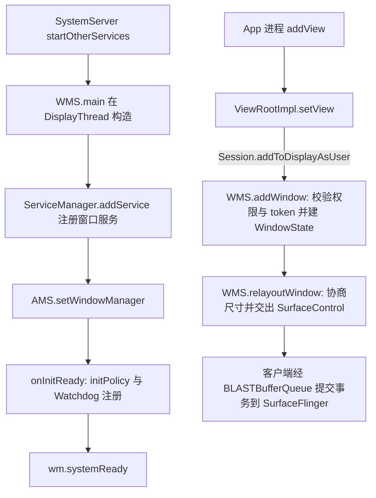
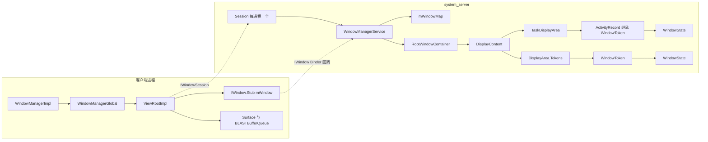
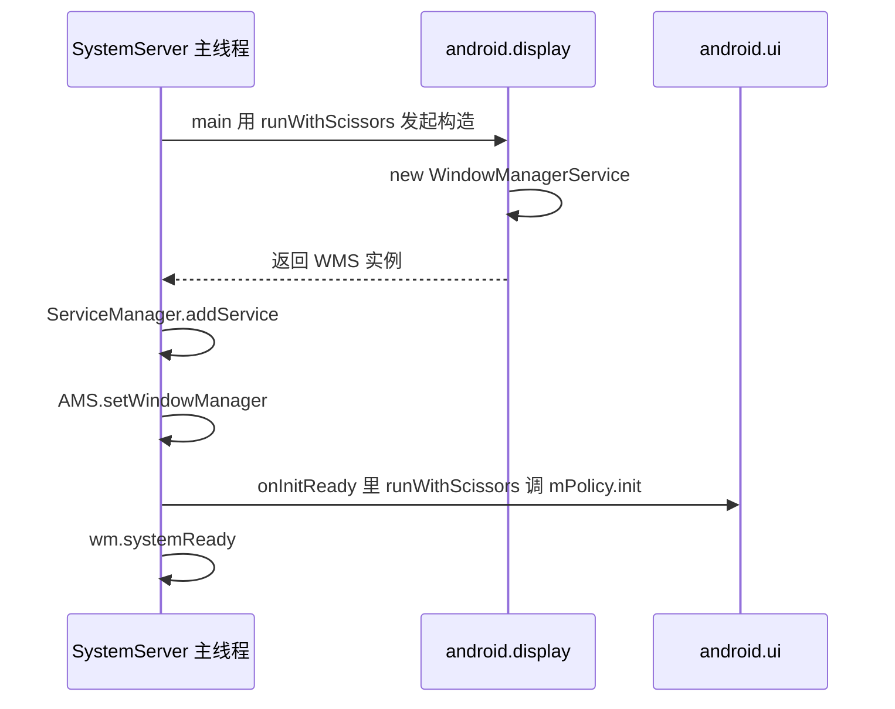
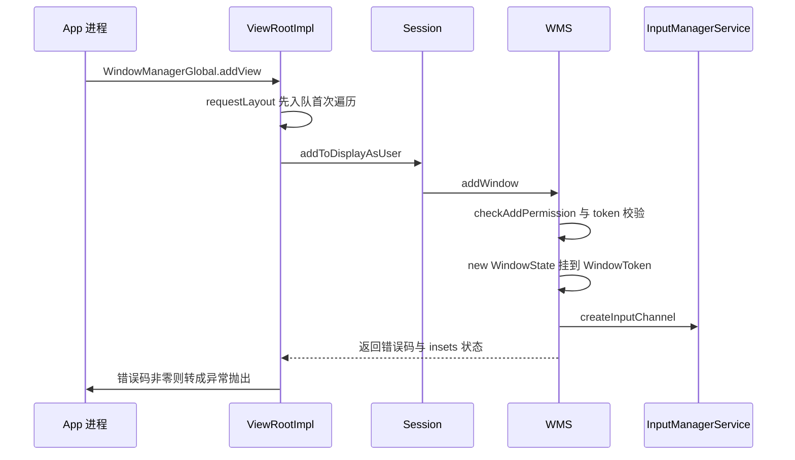
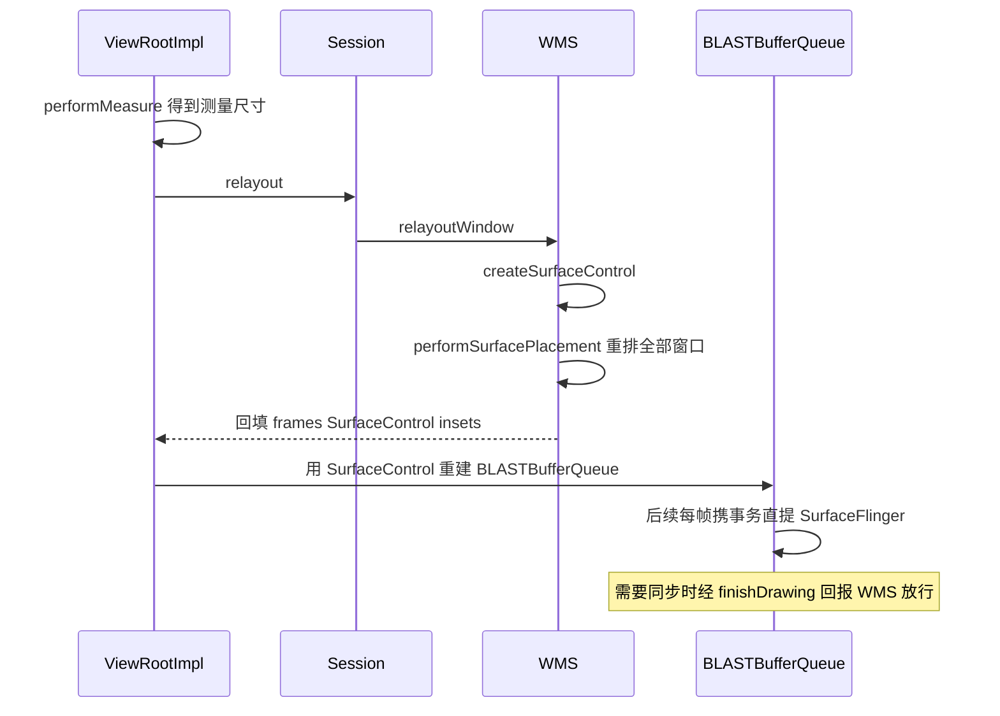
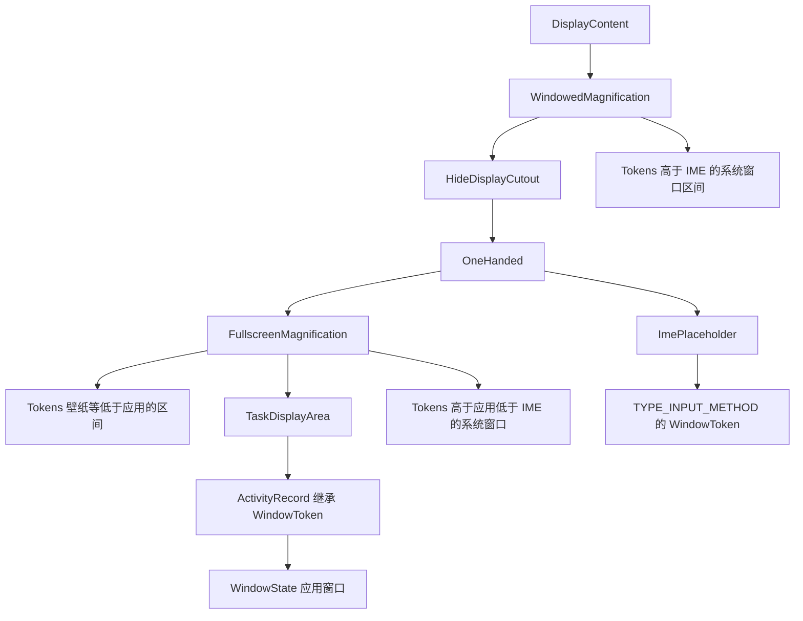

## 10.1 概述与版本说明

上一章看完 Service 的调度中枢 ActiveServices，本章转向屏幕侧的核心服务：WindowManagerService（WMS）。App 调用 `addView` 交给系统的那个"窗口"，不是某个 View，而是经 Binder 在 system_server 里登记的一块独立 Surface 加上它的 LayoutParams；View 树只是这块 Surface 上绘制的内容。WMS 是所有窗口的唯一管理者：登记与注销、尺寸与 Z-order、输入通道与焦点、insets 协商、转场动画，全部经过它。本章源码与上一章同一棵 AOSP main 树（Android 16 / API 36 开发阶段），`WindowManagerService.java` 本体 10501 行，是 system_server 中体量最大的服务之一。

> 版本注意：WMS 的骨架（Session 握手、addWindow 校验、relayout 协商、按类型分层）多年来保持稳定；但 Android 11 重构了 insets 分发（InsetsState/InsetsSourceControl 成为 relayout 的出入参），Android 12 起 BLAST 同步合帧成为默认、shell 侧 Transition 逐步接管转场动画，relayout 交接给客户端的从包装好的 Surface 变成了 SurfaceControl。原书卷II 的 WMS 一章基于 4.0 时代源码，本章以当前 main 源码为主体，与旧版的差异不再单独成节，只在涉及处行内标注。

> 摘编声明：文中代码均为摘编版——保留主干与关键分支，省略日志、trace 与样板代码；类名与方法名与 AOSP 一致，可对照源码阅读，代码块首行标注来源类与方法。

本章按四条主线推进，先总览后逐节深入：

| 阶段 | 节 | 所在进程/线程 | 核心调用链 |
|---|---|---|---|
| 启动 | 10.3 | system_server 主线程 → android.display | `WindowManagerService.main` → 构造 → `onInitReady` → `systemReady` |
| addWindow | 10.4 | App 主线程 → system_server Binder 线程 | `ViewRootImpl.setView` → `Session.addToDisplayAsUser` → `WMS.addWindow` |
| relayout | 10.5 | App 主线程 ↔ system_server | `performTraversals` → `Session.relayout` → `WMS.relayoutWindow` → `createSurfaceControl` |
| remove | 10.7 | App 窗口线程 → system_server Binder 线程 | `ViewRootImpl.doDie` → `Session.remove` → `WindowState.removeIfPossible` |

全局图景一张图——启动在 system_server 侧自上而下完成；之后每个窗口的生命周期都是"客户端发起、WMS 校验登记"：



WMS 的工作分布在几个线程上，读代码前先认清楚：

| 线程 | 承担的工作 |
|---|---|
| system_server 主线程 | `startOtherServices` 里发起 `main` 调用后立即返回，不参与后续逻辑 |
| android.display（DisplayThread） | WMS 实例的归属线程：`main` 用 `runWithScissors` 把构造切过来执行，`mH` Handler 与动画、布局驱动也跑在它上面 |
| android.ui（UiThread） | `initPolicy` 把 `PhoneWindowManager` 的初始化切到这个线程 |
| Binder 线程池 | 客户端经 IWindowSession 进来的调用（addWindow、relayout、remove 等）都在 Binder 线程上执行，靠 `mGlobalLock` 与 android.display 上的逻辑串行化 |

## 10.2 整体类关系

WMS 的类关系分客户端与服务端两界，中间由一对 Binder 接口连接：客户端持 `IWindowSession` 调服务端，服务端持 `IWindow` 回调客户端。先看两侧的核心角色，再点破几处关键对应。

**客户端侧**（frameworks/base/core/java/android/view/）：

| 类 | 职责 |
|---|---|
| `WindowManagerImpl` | `Context.getSystemService(WINDOW_SERVICE)` 返回的入口，每个 Context 一份，方法全部转手给 `WindowManagerGlobal` |
| `WindowManagerGlobal` | 进程单例。维护 `mViews`/`mRoots`/`mParams` 三个平行数组：已添加的根 View、各自的 ViewRootImpl、各自的 LayoutParams；进程默认使用的 `IWindowSession` 也由它懒创建并缓存（ViewRootImpl 默认构造即取它） |
| `ViewRootImpl` | 每个窗口一个。持有 `IWindow.Stub`（`mWindow`，给 WMS 回调用）、遍历的执行者、BLASTBufferQueue |
| `Surface` | 窗口的绘制面。Android 12 后由 `BLASTBufferQueue` 创建并管理 |

**服务端侧**（services/core/java/com/android/server/wm/）：

| 类 | 职责 |
|---|---|
| `Session` | 一般每个与 WMS 交互的进程一个（源码注释：generally one Session per process），`IWindowSession.Stub`，同时实现 `IBinder.DeathRecipient` 监听进程死亡。`openSession` 创建后由客户端缓存复用 |
| `WindowManagerService` | 总入口。`mWindowMap: IBinder → WindowState` 以客户端 `IWindow` 的 Binder 为键索引全部窗口 |
| `RootWindowContainer` | 窗口树的根，孩子是各 `DisplayContent` |
| `DisplayContent` | 一个逻辑显示的窗口世界，继承自 `RootDisplayArea`，内部由 DisplayAreaPolicy 按窗口类型区间划出 `DisplayArea` 分区 |
| `TaskDisplayArea` | 应用窗口的容器区，ActivityRecord/Task 挂在它下面 |
| `WindowToken` | 同类窗口的分组凭证，持一个 IBinder token；`ActivityRecord` 直接继承它，所以 Activity 的 token 本身就是一个 WindowToken |
| `WindowState` | 一个窗口在服务端的全部状态（attrs、frame、可见性、animator），既是树的叶子也能作为子窗口的父亲 |

**双界对应**是读懂 WMS 的入口：服务端只有 `WindowState` + token，客户端才有 View 树和 `ViewRootImpl`——和 ServiceRecord 与 Service 的关系一模一样。`addWindow` 时客户端把 `mWindow`（IWindow.Stub）传过去，WMS 以它的 `asBinder()` 为键放进 `mWindowMap`；此后服务端要通知客户端（如窗口 resize、执行 transaction）就沿这条 Binder 反向调用。



`WindowState` 挂载点的上层是 `WindowContainer` 家族——窗口树上的每个节点都是它（或它的子类），节点间靠 `addChild` 维持有序：

```java
// WindowContainer#addChild(节选)
protected void addChild(E child, Comparator<E> comparator) {
    ......
    int positionToAdd = -1;
    if (comparator != null) {
        // 按 comparator 找到第一个"不小于新孩子"的位置插入
        for (int i = 0; i < count; i++) {
            if (comparator.compare(child, mChildren.get(i)) < 0) {
                positionToAdd = i;
                break;
            }
        }
    }
    if (positionToAdd == -1) {
        mChildren.add(child);
    } else {
        mChildren.add(positionToAdd, child);
    }
    child.setParent(this);
}
```

`mChildren` 有序意味着**树的排列本身就是 Z-order 的骨架**：越靠后的孩子越在上层，10.6 节的分层赋值只是把这个顺序换算成 SurfaceControl 的 layer 值提交给 SurfaceFlinger。

第二个关键点是锁。WMS 的成员锁并不独立存在：

```java
// WindowManagerService 构造(节选)
mGlobalLock = atm.getGlobalLock();
```

`mGlobalLock` 就是 ActivityTaskManagerService（ATMS，Activity 管理服务）持有的那把 `WindowManagerGlobalLock`——Android 11（R）起窗口管理与 Activity/任务管理共用一把全局锁。AMS（ActivityManagerService）/WMS 的代码互相调用时不必担心锁序问题，代价是任意一方持锁都在事实上阻塞整个 system_server 的调度逻辑，这也是 WMS 一旦 ANR（Application Not Responding，应用无响应）会拖垮全局的原因。

## 10.3 启动流程

SystemServer 在启动服务的第一梯队里创建 WMS——它必须赶在应用进程起来之前就绪：

```java
// SystemServer#startOtherServices(节选)
t.traceBegin("StartWindowManagerService");
// WMS needs sensor service ready
mSystemServiceManager.startBootPhase(t, SystemService.PHASE_WAIT_FOR_SENSOR_SERVICE);
wm = WindowManagerService.main(context, inputManager, !mFirstBoot,
        new PhoneWindowManager(), mActivityManagerService.mActivityTaskManager);
ServiceManager.addService(Context.WINDOW_SERVICE, wm, /* allowIsolated= */ false,
        DUMP_FLAG_PRIORITY_CRITICAL | DUMP_FLAG_PRIORITY_HIGH
                | DUMP_FLAG_PROTO);
t.traceEnd();

t.traceBegin("SetWindowManagerService");
mActivityManagerService.setWindowManager(wm);
t.traceEnd();

t.traceBegin("WindowManagerServiceOnInitReady");
wm.onInitReady();
t.traceEnd();
```

注意两点：一是构造参数里直接传入了 `mActivityTaskManager`，ATMS 在 WMS 之前就已创建；二是 `PhoneWindowManager`（窗口策略的实现类）在这里作为 `WindowManagerPolicy` 传入，WMS 把所有"这个窗口该不该加、加在哪儿、要不要遮挡状态栏"这类策略判断委托给它。

`main` 的工作只有一个——把构造切到 DisplayThread：

```java
// WindowManagerService#main(节选)
final WindowManagerService[] wms = new WindowManagerService[1];
DisplayThread.getHandler().runWithScissors(() ->
        wms[0] = new WindowManagerService(context, im, showBootMsgs, policy, atm,
                displayWindowSettingsProvider, transactionFactory,
                surfaceControlFactory, appCompat), 0);
return wms[0];
```

`runWithScissors` 是 Handler 的一个"同步穿透"方法：把 Runnable 投递到目标线程并阻塞当前线程，直到它执行完（或超时）。于是 WMS 实例连同绑定其上的 `mH` Handler 都落在了 android.display 线程上，而 SystemServer 主线程拿到引用后继续往下走。

构造函数两百多行，摘几件值得记住的事：

```java
// WindowManagerService 构造(节选)
mGlobalLock = atm.getGlobalLock();                       // 与 ATMS 共用一把全局锁
mInputManager = inputManager;                            // 输入系统，建输入通道时用
mAnimator = new WindowAnimator(this);                    // 动画驱动
mRoot = new RootWindowContainer(this);                   // 窗口树根
mSyncEngine = new BLASTSyncEngine(this);                 // Android 12 起的同步合帧引擎
mWindowPlacerLocked = new WindowSurfacePlacer(this);     // 全局布局 pass 的入口
......
// 监听两个 AppOps：悬浮窗与 Toast。AppOps 状态变化时刷新对应窗口的可见性
mAppOps.startWatchingMode(OP_SYSTEM_ALERT_WINDOW, null, opListener);
mAppOps.startWatchingMode(AppOpsManager.OP_TOAST_WINDOW, null, opListener);
......
LocalServices.addService(WindowManagerInternal.class, new LocalService());
```

`onInitReady` 在 `AMS.setWindowManager` 之后调用，把策略初始化切到 UiThread：

```java
// WindowManagerService#onInitReady(节选)
public void onInitReady() {
    initPolicy();                          // UiThread 上执行 mPolicy.init
    // Add ourself to the Watchdog monitors.
    Watchdog.getInstance().addMonitor(this);   // WMS 加入 Watchdog 监控，卡死会被杀
    createWatermark();
    showEmulatorDisplayOverlayIfNeeded();
}

private void initPolicy() {
    UiThread.getHandler().runWithScissors(new Runnable() {
        @Override
        public void run() {
            WindowManagerPolicyThread.set(Thread.currentThread(), Looper.myLooper());
            mPolicy.init(mContext, WindowManagerService.this);
        }
    }, 0);
}
```

最后在 system_server 起动收尾处，`startOtherServices` 调 `wm.systemReady()`，WMS 通知各 DisplayPolicy、快照控制器就绪并加载设置。至此启动闭环完成：



## 10.4 阶段①：addWindow 全链路

客户端一句 `mWindowManager.addView(decorView, params)`，到服务端落成一个 `WindowState`，中间要过五道关卡：权限、display 归属、查重、token、参数调整。先看时序，再逐段拆：



### 10.4.1 客户端：WindowManagerGlobal.addView

`WindowManagerImpl.addView` 直接转手给进程单例 `WindowManagerGlobal`：

```java
// WindowManagerGlobal#addView(节选)
final WindowManager.LayoutParams wparams = (WindowManager.LayoutParams) params;
if (parentWindow != null) {
    // 子窗口：让父窗口补齐 token 等参数
    parentWindow.adjustLayoutParamsForSubWindow(wparams);
} else if (context != null && (context.getApplicationInfo().flags
        & ApplicationInfo.FLAG_HARDWARE_ACCELERATED) != 0) {
    wparams.flags |= WindowManager.LayoutParams.FLAG_HARDWARE_ACCELERATED;
}

synchronized (mLock) {
    int index = findViewLocked(view, false);
    if (index >= 0) {
        if (mDyingViews.contains(view)) {
            // 上一次 remove 还在走 MSG_DIE 延迟流程，就地让它立即死掉
            mRoots.get(index).doDie();
        } else {
            throw new IllegalStateException("View " + view
                    + " has already been added to the window manager.");
        }
    }
    // 子窗口要找到它依附的父 View，后面作为 panelParentView 传入
    if (wparams.type >= WindowManager.LayoutParams.FIRST_SUB_WINDOW &&
            wparams.type <= WindowManager.LayoutParams.LAST_SUB_WINDOW) {
        final int count = mViews.size();
        for (int i = 0; i < count; i++) {
            if (mRoots.get(i).mWindow.asBinder() == wparams.token) {
                panelParentView = mViews.get(i);
            }
        }
    }
    ......
    root = new ViewRootImpl(view.getContext(), display);
    // view、root、params 三个平行数组按同一索引对齐
    view.setLayoutParams(wparams);
    mViews.add(view);
    mRoots.add(root);
    mParams.add(wparams);

    try {
        root.setView(view, wparams, panelParentView, userId);
    } catch (RuntimeException e) {
        // BadTokenException 或 InvalidDisplayException：就地清理已登记的三元组再抛出
        removeViewLocked(viewIndex, true);
        throw e;
    }
}
```

同一进程重复 add 同一个 View 会在客户端就地抛 `IllegalStateException`，根本走不到 Binder——这与服务端的 `ADD_DUPLICATE_ADD` 是同一约束的两层防线。

### 10.4.2 ViewRootImpl.setView：先排遍历再握手

`setView` 有个次序上反直觉的设计：**先把首次遍历排进 Choreographer，再向 WMS 登记窗口**：

```java
// ViewRootImpl#setView(节选)
mAdded = true;
int res;
// Schedule the first layout -before- adding to the window
// manager, to make sure we do the relayout before receiving
// any other events from the system.
requestLayout();
InputChannel inputChannel = null;
if ((mWindowAttributes.inputFeatures
        & WindowManager.LayoutParams.INPUT_FEATURE_NO_INPUT_CHANNEL) == 0) {
    inputChannel = new InputChannel();
}
......
res = mWindowSession.addToDisplayAsUser(mWindow, mWindowAttributes,
        getHostVisibility(), mDisplay.getDisplayId(), userId,
        mInsetsController.getRequestedVisibleTypes(), inputChannel, mTempInsets,
        mTempControls, attachedFrame, compatScale);
```

原注释解释了动机：必须保证第一次 relayout 先于任何系统事件到达——否则输入事件可能先于窗口拿到 frame 就派发下来。注意 `inputChannel` 是客户端新建的空对象，服务端把真实通道的两端复制进去，这就是"一个窗口一条独立输入通道"的落点。

服务端返回后，客户端按错误码翻译异常：

```java
// ViewRootImpl#setView(节选)
if (res < WindowManagerGlobal.ADD_OKAY) {
    switch (res) {
        case WindowManagerGlobal.ADD_BAD_APP_TOKEN:
        case WindowManagerGlobal.ADD_BAD_SUBWINDOW_TOKEN:
            throw new WindowManager.BadTokenException(
                    "Unable to add window -- token " + attrs.token
                    + " is not valid; is your activity running?");
        case WindowManagerGlobal.ADD_NOT_APP_TOKEN:
            throw new WindowManager.BadTokenException(
                    "Unable to add window -- token " + attrs.token
                    + " is not for an application");
        case WindowManagerGlobal.ADD_APP_EXITING:
            throw new WindowManager.BadTokenException(
                    "Unable to add window -- app for token " + attrs.token + " is exiting");
        case WindowManagerGlobal.ADD_DUPLICATE_ADD:
            throw new WindowManager.BadTokenException(
                    "Unable to add window -- window " + mWindow + " has already been added");
        case WindowManagerGlobal.ADD_PERMISSION_DENIED:
            throw new WindowManager.BadTokenException("Unable to add window "
                    + mWindow + " -- permission denied for window type "
                    + mWindowAttributes.type);
        case WindowManagerGlobal.ADD_INVALID_DISPLAY:
            throw new WindowManager.InvalidDisplayException(...);
        ......
    }
}
```

错误码在服务端产生、异常在客户端抛出，这张映射表覆盖了 `BadTokenException` 的主要来源，10.8 节会按它整理排查清单。

### 10.4.3 服务端：权限与基本校验

`Session.addToDisplayAsUser` 只是转手，所有逻辑在 `WMS.addWindow`。第一关是权限，委托给 `WindowManagerPolicy` 的实现类 PhoneWindowManager：

```java
// WindowManagerService#addWindow(节选)
int[] appOp = new int[1];
int res = mPolicy.checkAddPermission(attrs.type, isRoundedCornerOverlay,
        attrs.packageName, appOp, displayId);
if (res != ADD_OKAY) {
    return res;
}
```

```java
// PhoneWindowManager#checkAddPermission(节选)
// 类型必须落在三段合法区间内
if (!((type >= FIRST_APPLICATION_WINDOW && type <= LAST_APPLICATION_WINDOW)
        || (type >= FIRST_SUB_WINDOW && type <= LAST_SUB_WINDOW)
        || (type >= FIRST_SYSTEM_WINDOW && type <= LAST_SYSTEM_WINDOW))) {
    return WindowManagerGlobal.ADD_INVALID_TYPE;
}
// 应用窗口与子窗口不做权限检查，交给后续 token 校验
if (type < FIRST_SYSTEM_WINDOW || type > LAST_SYSTEM_WINDOW) {
    return ADD_OKAY;
}
if (!isSystemAlertWindowType(type)) {
    switch (type) {
        case TYPE_TOAST:
            outAppOp[0] = OP_TOAST_WINDOW;    // Toast 走 AppOps 限额
            return ADD_OKAY;
        case TYPE_INPUT_METHOD:
        case TYPE_WALLPAPER:
        case TYPE_PRESENTATION:
        ......  // 这些专用类型由 WMS 后续 token 校验把关
            return ADD_OKAY;
    }
    // 其余系统窗口需要 INTERNAL_SYSTEM_WINDOW（签名级权限）
    return (mContext.checkCallingOrSelfPermission(INTERNAL_SYSTEM_WINDOW)
            == PERMISSION_GRANTED) ? ADD_OKAY : ADD_PERMISSION_DENIED;
}
// alert 系窗口（悬浮窗）：SYSTEM_UID 直接放行
if (UserHandle.getAppId(callingUid) == Process.SYSTEM_UID) {
    return ADD_OKAY;
}
......
// targetSdk O 以上只允许 TYPE_APPLICATION_OVERLAY 这一种 alert 类型，且需 AppOps 授权
if (appInfo == null || (type != TYPE_APPLICATION_OVERLAY && appInfo.targetSdkVersion >= O)) {
    return (mContext.checkCallingOrSelfPermission(INTERNAL_SYSTEM_WINDOW)
            == PERMISSION_GRANTED) ? ADD_OKAY : ADD_PERMISSION_DENIED;
}
outAppOp[0] = OP_SYSTEM_ALERT_WINDOW;
```

把权限矩阵整理成表：

| 窗口类型 | 权限要求 |
|---|---|
| 应用窗口 1~99、子窗口 1000~1999 | 无权限要求，靠 token 校验 |
| `TYPE_TOAST` | 无权限，记 `OP_TOAST_WINDOW`，Android 8 后还要求 token（见 10.4.4） |
| IME、壁纸、Presentation、VoiceInteraction 等 | 无权限，靠 token 校验 |
| 其余系统窗口 | `INTERNAL_SYSTEM_WINDOW`（系统签名） |
| alert 系（`TYPE_APPLICATION_OVERLAY` 等） | `SYSTEM_ALERT_WINDOW` 的 AppOps 授权；targetSdk O 以上非 overlay 的 alert 类型一律拒绝 |

回到 `addWindow`，权限之后是 display 与查重：

```java
// WindowManagerService#addWindow(节选)
if (session.isClientDead()) {
    return WindowManagerGlobal.ADD_APP_EXITING;
}
if (type >= FIRST_SUB_WINDOW && type <= LAST_SUB_WINDOW) {
    // 子窗口：attrs.token 必须是已存在的父窗口（mWindowMap 以父窗口 IWindow 的 binder 索引）
    parentWindow = windowForClientLocked(null, attrs.token, false);
    if (parentWindow == null) {
        return WindowManagerGlobal.ADD_BAD_SUBWINDOW_TOKEN;
    }
    if (parentWindow.mAttrs.type >= FIRST_SUB_WINDOW
            && parentWindow.mAttrs.type <= LAST_SUB_WINDOW) {
        // 子窗口不能挂子窗口
        return WindowManagerGlobal.ADD_BAD_SUBWINDOW_TOKEN;
    }
}
final DisplayContent displayContent = parentWindow != null
        ? parentWindow.mDisplayContent
        : getDisplayContentOrCreate(displayId, attrs.token);
if (displayContent == null) {
    return WindowManagerGlobal.ADD_INVALID_DISPLAY;
}
if (!displayContent.hasAccess(session.mUid)) {
    return WindowManagerGlobal.ADD_INVALID_DISPLAY;
}
if (mWindowMap.containsKey(client.asBinder())) {
    return WindowManagerGlobal.ADD_DUPLICATE_ADD;
}
```

### 10.4.4 token 校验矩阵

token 是 addWindow 里最绕的一段：子窗口直接复用父窗口的 token；其余窗口按类型与 token 的既有身份做匹配，不匹配就拒绝，没有就新建。摘主干：

```java
// WindowManagerService#addWindow(节选)
WindowToken token = displayContent.getWindowToken(
        hasParent ? parentWindow.mAttrs.token : attrs.token);
final int rootType = hasParent ? parentWindow.mAttrs.type : type;

if (token == null) {
    if (!unprivilegedAppCanCreateTokenWith(parentWindow, callingUid, type,
            rootType, attrs.token, attrs.packageName)) {
        // 应用窗口、IME、壁纸等类型拿不到 token 直接拒绝
        return WindowManagerGlobal.ADD_BAD_APP_TOKEN;
    }
    // 允许的普通窗口：新建 WindowToken；WindowContext 场景则复用其注册的 token
    token = new WindowToken.Builder(this, binder, type)
            .setDisplayContent(displayContent)
            .setOwnerCanManageAppTokens(session.mCanAddInternalSystemWindow)
            ......
            .build();
} else if (rootType >= FIRST_APPLICATION_WINDOW && rootType <= LAST_APPLICATION_WINDOW) {
    // 应用窗口的 token 必须是 ActivityRecord
    activity = token.asActivityRecord();
    if (activity == null) {
        return WindowManagerGlobal.ADD_NOT_APP_TOKEN;
    } else if (activity.getParent() == null) {
        // Activity 已退出
        return WindowManagerGlobal.ADD_APP_EXITING;
    } else if (type == TYPE_APPLICATION_STARTING) {
        // 起始窗口只允许一个
        ......
        return WindowManagerGlobal.ADD_DUPLICATE_ADD;
    }
} else if (rootType == TYPE_INPUT_METHOD) {
    if (token.windowType != TYPE_INPUT_METHOD) {
        return WindowManagerGlobal.ADD_BAD_APP_TOKEN;
    }
} else if (rootType == TYPE_WALLPAPER) {
    ......  // 同上：token.windowType 必须一致
} else if (type == TYPE_TOAST) {
    // targetSdk O（Android 8）以上加 Toast 必须持 TYPE_TOAST 的 token
    //（token 由通知系统持有，应用拿不到，等于禁止应用直接加 Toast 窗口）
    addToastWindowRequiresToken = doesAddToastWindowRequireToken(attrs.packageName,
            callingUid, parentWindow);
    if (addToastWindowRequiresToken && token.windowType != TYPE_TOAST) {
        return WindowManagerGlobal.ADD_BAD_APP_TOKEN;
    }
}
```

整理成矩阵，`BadTokenException` 的每一种都能对号入座：

| rootType | token 为空 | token 存在 |
|---|---|---|
| 应用窗口 1~99 | `ADD_BAD_APP_TOKEN` | 必须是 `ActivityRecord`，否则 `ADD_NOT_APP_TOKEN`；Activity 已退出则 `ADD_APP_EXITING` |
| 子窗口 1000~1999 | 不看这里，父窗口缺失即 `ADD_BAD_SUBWINDOW_TOKEN` | 直接复用父窗口 token |
| `TYPE_INPUT_METHOD`/`TYPE_WALLPAPER`/`TYPE_VOICE_INTERACTION`/`TYPE_ACCESSIBILITY_OVERLAY`/`TYPE_QS_DIALOG` | `ADD_BAD_APP_TOKEN` | `token.windowType` 必须与窗口类型一致 |
| `TYPE_TOAST` | targetSdk O 以下可无 token 直接加 | 需限额时 `token.windowType` 必须是 `TYPE_TOAST` |
| 其他系统窗口 | 用 `client.asBinder()` 新建 `WindowToken` | 误用 ActivityRecord 时置空 attrs.token 重建 |

### 10.4.5 WindowState 登记与输入通道

校验全部通过后，进入不再允许出错的阶段——原代码在此处有一句注释 `// From now on, no exceptions or errors allowed!`。先建 `WindowState`：

```java
// WindowManagerService#addWindow(节选)
final WindowState win = new WindowState(this, session, client, token, parentWindow,
        appOp[0], attrs, viewVisibility, session.mUid, userId,
        session.mCanAddInternalSystemWindow);
final DisplayPolicy displayPolicy = displayContent.getDisplayPolicy();
// 策略层最后一次调整参数：比如根据焦点性修正 FLAG_NOT_FOCUSABLE
displayPolicy.adjustWindowParamsLw(win, win.mAttrs);
attrs.flags = sanitizeFlagSlippery(attrs.flags, win.getName(), callingUid, callingPid);
res = displayPolicy.validateAddingWindowLw(attrs, callingPid, callingUid);
if (res != ADD_OKAY) {
    return res;
}

final boolean openInputChannels = (outInputChannel != null
        && (attrs.inputFeatures & INPUT_FEATURE_NO_INPUT_CHANNEL) == 0);
if (openInputChannels) {
    win.openInputChannel(outInputChannel);
}
```

`WindowState` 构造里最值得看的是分层参数的确定，这里先记住 `mBaseLayer`/`mSubLayer` 两个值，10.6 节展开：

```java
// WindowState 构造(节选)
if (mAttrs.type >= FIRST_SUB_WINDOW && mAttrs.type <= LAST_SUB_WINDOW) {
    // 子窗口：基层取父窗口的层，再按子窗口类型定相对层
    mBaseLayer = mPolicy.getWindowLayerLw(parentWindow)
            * TYPE_LAYER_MULTIPLIER + TYPE_LAYER_OFFSET;
    mSubLayer = mPolicy.getSubWindowLayerFromTypeLw(a.type);
    mIsChildWindow = true;
} else {
    mBaseLayer = mPolicy.getWindowLayerLw(this)
            * TYPE_LAYER_MULTIPLIER + TYPE_LAYER_OFFSET;
    mSubLayer = 0;
    mIsChildWindow = false;
}
```

输入通道的建立直通 InputManagerService：

```java
// WindowState#openInputChannel(节选)
String name = getName();
mInputChannel = mWmService.mInputManager.createInputChannel(name);
mInputChannelToken = mInputChannel.getToken();
mInputWindowHandle.setToken(mInputChannelToken);
// token 到 WindowState 的映射：输入事件派发时据此找到目标窗口
mWmService.mInputToWindowMap.put(mInputChannelToken, this);
mInputChannel.copyTo(outInputChannel);
```

之后是一连串登记：`mWindowMap.put(client.asBinder(), win)`、`win.mToken.addWindow(win)`（按 10.2 的 comparator 插入 `mChildren`）、可接收按键则 `updateFocusedWindowLocked` 抢焦点、`computeImeTarget` 重算输入法（Input Method Editor，IME）目标、`assignChildLayers` 分配层级、`InputMonitor.updateInputWindowsLw` 把窗口列表同步给输入系统，最后把 insets 状态、子窗口依附 frame、兼容缩放回填到出参。窗口至此完成登记，但它还没有尺寸也没有 Surface——这要等 relayout。

**支线：进程死亡**。`Session` 实现了 `IBinder.DeathRecipient`，客户端进程一旦死亡，服务端收到 `binderDied` 回调，遍历该 Session 的所有窗口逐个 `removeIfPossible`，再 `killSessionLocked` 清理会话——所以 App 崩溃后它的悬浮窗、Toast 立即消失，不依赖应用自己清理。

## 10.5 阶段②：relayoutWindow 与绘制面交接

`addWindow` 只完成了登记，窗口要上屏还差两样东西：确定的尺寸和一块 Surface。这两样在 relayout 里协商：客户端把测量结果报上去，WMS 把最终 frame 与 SurfaceControl 交下来。

### 10.5.1 客户端：performTraversals 与遍历顺序

ViewRootImpl 收到 `requestLayout` 后经 `scheduleTraversals` 向 Choreographer 注册 `CALLBACK_TRAVERSAL`，垂直同步到来时执行 `performTraversals`。这一遍按固定顺序做四步：

```java
// ViewRootImpl#performTraversals(结构摘编)
performMeasure(childWidthMeasureSpec, childHeightMeasureSpec);   // 1. 测量
if (mFirst || windowShouldResize || viewVisibilityChanged || params != null
        || mForceNextWindowRelayout) {
    ......
    relayoutResult = relayoutWindow(params, viewVisibility, insetsPending);  // 2. 找 WMS 换 frame 与 Surface
}
performLayout(lp, mWidth, mHeight);                              // 3. 布局
......
performDraw();                                                   // 4. 绘制
```

测量在前是关键：`relayoutWindow` 上报的 `requestedWidth`/`requestedHeight` 来自测量结果，WMS 按它和 LayoutParams 协商出最终 frame。`mFirst` 为真保证窗口首次必然走一次 relayout。

客户端 `relayoutWindow` 有个值得注意的优化分支：只要位置与尺寸不是同时变化，就走 `relayoutAsync`——不等服务端结果：

```java
// ViewRootImpl#relayoutWindow(节选)
final boolean positionChanged = ...;
final boolean sizeChanged = ...;
// 位置与尺寸没有同时变化时只把 attrs 异步推给 WMS，不阻塞遍历等返回
relayoutAsync = !positionChanged || !sizeChanged;
mRelayoutSeq++;
if (relayoutAsync) {
    mWindowSession.relayoutAsync(mWindow, params,
            requestedWidth, requestedHeight, viewVisibility, ..., mRelayoutSeq, mLastSyncSeqId);
} else {
    relayoutResult = mWindowSession.relayout(mWindow, params,
            requestedWidth, requestedHeight, viewVisibility, ...,
            mRelayoutSeq, mLastSyncSeqId, mRelayoutResult);
    ......
    // 同步路径返回后：frame、MergedConfiguration、insets 都已回填进 mTmpFrames 等出参
}
```

### 10.5.2 服务端：relayoutWindow 主干

`WMS.relayoutWindow` 四百多行，主干分四段。第一段，seq 去重与参数变更处理：

```java
// WindowManagerService#relayoutWindow(节选)
final WindowState win = windowForClientLocked(session, client, false);
if (win == null) {
    return 0;
}
// 用客户端自增的 seq 丢弃乱序重放的旧请求
if (win.mRelayoutSeq < seq) {
    win.mRelayoutSeq = seq;
} else if (win.mRelayoutSeq > seq) {
    return 0;
}
if (viewVisibility != View.GONE) {
    win.setRequestedSize(requestedWidth, requestedHeight);
}
if (attrs != null) {
    displayPolicy.adjustWindowParamsLw(win, attrs);
    if (win.mAttrs.type != attrs.type) {
        // 窗口类型添加后不可变，直接抛异常
        throw new IllegalArgumentException(
                "Window type can not be changed after the window is added.");
    }
    // 逐位比对出新旧差异，按差异触发焦点、IME、壁纸等重算
    flagChanges = win.mAttrs.flags ^ attrs.flags;
    attrChanges = win.mAttrs.copyFrom(attrs);
    if ((attrChanges & WindowManager.LayoutParams.LAYOUT_CHANGED) != 0) {
        win.mLayoutNeeded = true;
    }
}
```

第二段，处理"变得不可见"与 Surface 创建。窗口首次可见时必须在这里拿到 SurfaceControl：

```java
// WindowManagerService#relayoutWindow(节选)
final boolean shouldRelayout = viewVisibility == View.VISIBLE &&
        (win.mActivityRecord == null || win.mAttrs.type == TYPE_APPLICATION_STARTING
                || win.mActivityRecord.isClientVisible());
if (!shouldRelayout && winAnimator.hasSurface() && !win.mAnimatingExit) {
    result |= RELAYOUT_RES_SURFACE_CHANGED;
    // 窗口转不可见：启动退出动画而不是立刻销毁，避免闪黑
    tryStartExitingAnimation(win, winAnimator);
}
if (shouldRelayout && outSurfaceControl != null) {
    result = createSurfaceControl(outSurfaceControl, result, win, winAnimator);
}
// 强制跑一次全局布局 pass，让本窗口与受影响的窗口都拿到新 frame
mWindowPlacerLocked.performSurfacePlacement(true /* force */);
```

`createSurfaceControl` 落到 `WindowStateAnimator#createSurfaceLocked`：在这里构建窗口自己的 SurfaceControl，之后复制一份引用交给客户端出参。

第三段，焦点、IME、壁纸等连带重算：

```java
// WindowManagerService#relayoutWindow(节选)
if (shouldRelayout) {
    result = win.relayoutVisibleWindow(result);   // 处理可见性切换，首次可见打 RELAYOUT_RES_FIRST_TIME
    if (win.mAttrs.type == TYPE_INPUT_METHOD && displayContent.mInputMethodWindow == null) {
        displayContent.setInputMethodWindowLocked(win);
        imMayMove = true;
    }
}
if (focusMayChange) {
    if (updateFocusedWindowLocked(UPDATE_FOCUS_NORMAL, true /*updateInputWindows*/)) {
        imMayMove = false;
    }
}
if (imMayMove) {
    displayContent.computeImeTarget(true /* updateImeTarget */);
}
```

第四段，回填出参并返回标志位：

```java
// WindowManagerService#relayoutWindow(节选)
if (outFrames != null && outMergedConfiguration != null) {
    win.fillClientWindowFramesAndConfiguration(outFrames, outMergedConfiguration,
            outActivityWindowInfo, false /* useLatestConfig */, shouldRelayout);
    win.onResizeHandled();
}
if (outInsetsState != null) {
    win.fillInsetsState(outInsetsState, true /* copySources */);
}
```

返回标志一览：

| 标志 | 语义 |
|---|---|
| `RELAYOUT_RES_FIRST_TIME` | 首次可见，客户端据此初始化部分状态 |
| `RELAYOUT_RES_SURFACE_CHANGED` | SurfaceControl 新建或变更 |
| `RELAYOUT_RES_CANCEL_AND_REDRAW` | 服务端要求客户端取消当前绘制并整帧重画（如配置变更打断） |
| `RELAYOUT_RES_CONSUME_ALWAYS_SYSTEM_BARS` | 系统 bar 区域被强制消费，客户端布局需让出 |

### 10.5.3 BLAST：SurfaceControl 交接与同步合帧

Android 12 前，relayout 交回的 Surface 内部带着 BufferQueue，客户端往里画、SurfaceFlinger 来取；Android 12 起默认启用的 BLAST 机制把流程反转为：**WMS 只交 SurfaceControl，客户端自行把绘制内容打包成事务直提 SurfaceFlinger**。窗口首帧的交接在 ViewRootImpl 里：

```java
// ViewRootImpl(节选)
mBlastBufferQueue = new BLASTBufferQueue(mTag, mSurfaceControl,
        mSurfaceSize.x, mSurfaceSize.y, mWindowAttributes.format);
Surface blastSurface;
if (addSchandleToVriSurface()) {
    blastSurface = mBlastBufferQueue.createSurfaceWithHandle();
} else {
    blastSurface = mBlastBufferQueue.createSurface();
}
mSurface.transferFrom(blastSurface);
```

从此客户端的每帧绘制由 `BLASTBufferQueue` 携带事务（含 buffer、裁剪、transform）提交 SurfaceFlinger，减少一次跨进程等待。代价是"窗口内容更新"与"WMS 侧窗口状态变更"可能失配——所以需要同步合帧：服务端 `BLASTSyncEngine`（构造里的 `mSyncEngine`）为需要同步的窗口开同步组，客户端 `reportNextDraw` 后下一帧绘制完成时经 `Session.finishDrawing`（对应 `WMS.finishDrawingWindow`）回报，服务端确认整组就绪才一起上屏。`RELAYOUT_RES_CANCEL_AND_REDRAW` 正是这条链路上的防护：客户端已上报同步绘制、而服务端的同步组还没完成时，服务端置上这个标志要求客户端取消当前这一帧并整帧重画，防止未经同步的画面提前上屏。



## 10.6 阶段③：Z-order 与窗口分层

窗口有了尺寸和 Surface，最后一个问题是：屏幕上几十个窗口谁盖住谁。WMS 的答案分两层：先按窗口类型给出基础层（决定"类别"的高低），再按树序微调（决定同类内部的先后）。

### 10.6.1 窗口类型三区间

`WindowManager.LayoutParams.type` 取值被切成三个互不重叠的区间，这是所有分层的起点：

| 区间 | 值域 | 归属 |
|---|---|---|
| 应用窗口 | 1 ~ 99（`FIRST/LAST_APPLICATION_WINDOW`） | Activity 的窗口、起始窗口，挂 ActivityRecord |
| 子窗口 | 1000 ~ 1999（`FIRST/LAST_SUB_WINDOW`） | Panel、PopupWindow 等依附父窗口的类型 |
| 系统窗口 | 2000 ~ 2999（`FIRST/LAST_SYSTEM_WINDOW`） | 状态栏、IME、壁纸、悬浮窗等；`TYPE_APPLICATION_OVERLAY` = 2000 + 38 = 2038 |

### 10.6.2 基础层与子层

10.4.5 已见到 `WindowState` 构造里确定 `mBaseLayer`/`mSubLayer`。换算公式与常量：

- `mBaseLayer = getWindowLayerLw(win) × TYPE_LAYER_MULTIPLIER + TYPE_LAYER_OFFSET`，其中 `TYPE_LAYER_MULTIPLIER = 10000`、`TYPE_LAYER_OFFSET = 1000`；乘法是为了在同一类型的层内给多个窗口留出空间，如应用窗口 baseLayer = 2 × 10000 + 1000 = 21000
- 子窗口的 `mSubLayer` 按类型取相对层，正数在父窗口之上、负数在之下：

| 子窗口类型 | mSubLayer | 效果 |
|---|---|---|
| `TYPE_APPLICATION_MEDIA` | -2 | 垫在父窗口下面（SurfaceView 视频层） |
| `TYPE_APPLICATION_MEDIA_OVERLAY` | -1 | 垫底但在 media 之上 |
| `TYPE_APPLICATION_PANEL`、`TYPE_APPLICATION_ATTACHED_DIALOG` | 1 | 盖在父窗口上（Dialog/PopupWindow 常用） |
| `TYPE_APPLICATION_SUB_PANEL` | 2 | 更高 |
| `TYPE_APPLICATION_ABOVE_SUB_PANEL` | 3 | 最高 |

`getWindowLayerFromTypeLw` 是一张静态映射表，节选关键行：

```java
// WindowManagerPolicy#getWindowLayerFromTypeLw(节选)
if (type >= FIRST_APPLICATION_WINDOW && type <= LAST_APPLICATION_WINDOW) {
    return APPLICATION_LAYER;               // 应用窗口统一 2 层，内部先后交给树序
}
switch (type) {
    case TYPE_WALLPAPER:    return 1;       // 壁纸垫底
    case TYPE_PHONE:        return 3;       // 电话窗口（in-call UI），与 Presentation、QS 对话框同层
    case TYPE_SEARCH_BAR:   return 4;
    case TYPE_TOAST:        return 7;
    case TYPE_SYSTEM_ALERT:                 // ANR 弹窗这类
        return canAddInternalSystemWindow ? 12 : 9;
    case TYPE_APPLICATION_OVERLAY: return 11;   // 悬浮窗固定 11
    case TYPE_INPUT_METHOD: return 13;
    case TYPE_STATUS_BAR:   return 15;
    case TYPE_KEYGUARD_DIALOG: return 19;
    case TYPE_VOLUME_OVERLAY:  return 22;
    case TYPE_NAVIGATION_BAR:  return 24;
    case TYPE_DRAG:         return 30;
    case TYPE_ACCESSIBILITY_OVERLAY: return 31;
    case TYPE_POINTER:      return 35;      // 鼠标指针接近顶格
}
```

几个刻意的设计值得留意：壁纸层为 1，唯一比应用窗口（2）还低，WMS 会动态把壁纸窗口"贴"到当前壁纸目标的下方；悬浮窗固定 11，恰好压过普通应用与 Toast（7），但低于 IME（13）和状态栏（15）——这就是"悬浮窗盖不住输入法和系统栏"的出处；同一层值在有 `INTERNAL_SYSTEM_WINDOW` 权限时会有两个取值（如 `TYPE_SYSTEM_ALERT` 的 9/12），系统签名进程的同类窗口天然压在应用之上。

### 10.6.3 DisplayArea：按类型区间分区

基础层值决定的只是窗口之间的相对高低，Android 12 起 WMS 在此之上重构了显示区的组织：每个 `DisplayContent` 内由 `DisplayAreaPolicy` 按窗口类型区间划出若干 `DisplayArea` 分区，WindowToken 按类型"对号入座"。默认策略 `DefaultProvider` 对可信 display 构建的 feature 顺序：

```java
// DisplayAreaPolicy#DefaultProvider(节选)
rootHierarchy.addFeature(new Feature.Builder(wmService.mPolicy, "WindowedMagnification",
        FEATURE_WINDOWED_MAGNIFICATION)
        .upTo(TYPE_ACCESSIBILITY_MAGNIFICATION_OVERLAY)
        .except(TYPE_ACCESSIBILITY_MAGNIFICATION_OVERLAY)
        .setNewDisplayAreaSupplier(DisplayArea.Dimmable::new)
        .build());
if (content.isDefaultDisplay) {
    // 仅默认 display 有刘海屏分区
    rootHierarchy.addFeature(new Feature.Builder(wmService.mPolicy, "HideDisplayCutout",
            FEATURE_HIDE_DISPLAY_CUTOUT)
            .all()
            .except(TYPE_NAVIGATION_BAR, TYPE_NAVIGATION_BAR_PANEL, TYPE_STATUS_BAR,
                    TYPE_NOTIFICATION_SHADE)
            .build())
            .addFeature(new Feature.Builder(wmService.mPolicy, "OneHanded", FEATURE_ONE_HANDED)
            .all()
            .except(TYPE_NAVIGATION_BAR, TYPE_NAVIGATION_BAR_PANEL, TYPE_SECURE_SYSTEM_OVERLAY)
            .build());
}
rootHierarchy
        .addFeature(new Feature.Builder(wmService.mPolicy, "FullscreenMagnification",
                FEATURE_FULLSCREEN_MAGNIFICATION)
                .all()
                .except(TYPE_ACCESSIBILITY_MAGNIFICATION_OVERLAY, TYPE_INPUT_METHOD,
                        TYPE_INPUT_METHOD_DIALOG, TYPE_MAGNIFICATION_OVERLAY,
                        TYPE_NAVIGATION_BAR, TYPE_NAVIGATION_BAR_PANEL)
                .build())
        .addFeature(new Feature.Builder(wmService.mPolicy, "ImePlaceholder",
                FEATURE_IME_PLACEHOLDER)
                .and(TYPE_INPUT_METHOD, TYPE_INPUT_METHOD_DIALOG)
                .build());
```

每个 feature 覆盖一段窗口类型区间，构建时为每个子区间实例化一个 `DisplayArea.Tokens`；应用类型区间让位给 `TaskDisplayArea`。以此得到的窗口树主干（子节点顺序即 Z-order 从低到高）：



这样分区的收益是：放大镜、单手模式、刘海避让这些"作用于一段窗口"的效果，各自只需要锚定一个 DisplayArea 的 Surface，而不必逐个窗口处理。10.4 里 `addWindow` 为窗口新建的 `WindowToken`，正式挂载点就在这里——`DisplayContent.getWindowToken` 查不到时由 `DisplayAreaPolicy` 按类型选中对应分区挂入。`ImePlaceholder` 只收输入法两类窗口；高于 IME 的类型（如导航栏）不在任何下层 feature 的覆盖范围里，落在 WindowedMagnification 覆盖区间末尾的 Tokens 区。

### 10.6.4 assignChildLayers：把树序换算成 layer 值

树序到 SurfaceControl layer 的换算由 `assignChildLayers` 完成，入口在 `DisplayContent.assignWindowLayers`：

```java
// DisplayContent#assignWindowLayers(节选)
void assignWindowLayers(boolean setLayoutNeeded) {
    assignChildLayers(getSyncTransaction());
    if (setLayoutNeeded) {
        setLayoutNeeded();
    }
    // layer 变更先攒进 pending transaction，等动画 pass 的 prepareSurfaces 一起提交，
    // 让 Z-order 变化与 surface 的显隐严格同步
    scheduleAnimation();
}
```

```java
// WindowContainer#assignChildLayers(节选)
void assignChildLayers(Transaction t) {
    int layer = 0;
    // 两遍扫描：第一遍处理普通孩子，第二遍处理需要 Z 提升的（如传送中的 IME），
    // 等价于把需要置顶的子树排到末尾
    for (int j = 0; j < mChildren.size(); ++j) {
        final WindowContainer wc = mChildren.get(j);
        wc.assignChildLayers(t);
        if (!wc.needsZBoost()) {
            wc.assignLayer(t, layer++);
        }
    }
    for (int j = 0; j < mChildren.size(); ++j) {
        final WindowContainer wc = mChildren.get(j);
        if (wc.needsZBoost()) {
            wc.assignLayer(t, layer++);
        }
    }
}
```

```java
// WindowContainer#assignLayer(节选)
void assignLayer(Transaction t, int layer) {
    // Transition 动画进行期间不做层级重排，避免与转场动画争抢 Z 序
    if (!mTransitionController.canAssignLayers(this)) return;
    final boolean changed = layer != mLastLayer || mLastRelativeToLayer != null;
    if (mSurfaceControl != null && changed) {
        setLayer(t, layer);
        mLastLayer = layer;
    }
}
```

递归自顶向下：每个父容器把自己的孩子按树序编号为 0、1、2……，`setLayer` 写入各自 SurfaceControl；兄弟间的先后完全由 10.2 所述的插入顺序决定，`mBaseLayer` 决定的是 WindowToken 被放进哪个 DisplayArea 分区，从而决定类别间的高低。最终所有 layer 变更汇入事务交给 SurfaceFlinger 生效。

## 10.7 阶段④：removeWindow

有加必有减。removeWindow 与 addWindow 呈镜像：客户端先杀自己的 View 树与渲染资源，再通知服务端摘除 `WindowState`，服务端回收输入通道、转移焦点。逐段看：

### 10.7.1 客户端：die 的立即与延迟两条路径

`WindowManager.removeView` → `WindowManagerGlobal.removeView` → `removeViewLocked`：

```java
// WindowManagerGlobal#removeViewLocked(节选)
private void removeViewLocked(int index, boolean immediate) {
    ViewRootImpl root = mRoots.get(index);
    View view = root.getView();
    if (root != null) {
        root.getImeFocusController().onWindowDismissed();
    }
    boolean deferred = root.die(immediate);
    if (view != null) {
        view.assignParent(null);
        if (deferred) {
            // 延迟死亡：先进 mDyingViews 待删除列表
            mDyingViews.add(view);
        }
    }
}
```

```java
// ViewRootImpl#die(节选)
boolean die(boolean immediate) {
    if (immediate && !mIsInTraversal) {
        doDie();
        return false;
    }
    ......
    // 非立即模式：把死亡消息发回本窗口的线程排队执行
    mHandler.sendEmptyMessage(MSG_DIE);
    return true;
}

void doDie() {
    checkThread();        // 必须在创建本 ViewRootImpl 的线程上死
    synchronized (this) {
        if (mRemoved) {
            return;
        }
        mRemoved = true;
        if (mAdded) {
            dispatchDetachedFromWindow();
        }
        destroyHardwareRenderer();
        if (mAdded && !mFirst) {
            if (mView != null) {
                ......
                // 死前把最后的属性变更同步给 WMS，保证退出动画参数正确
                if ((relayoutWindow(mWindowAttributes, viewVisibility, false)
                        & WindowManagerGlobal.RELAYOUT_RES_FIRST_TIME) != 0) {
                    mWindowSession.finishDrawing(
                        mWindow, null /* postDrawTransaction */, Integer.MAX_VALUE);
                }
            }
            destroySurface();
        }
        ......
    }
}
```

`removeView` 默认走延迟路径：`MSG_DIE` 投回窗口线程排队，等当前遍历做完再死，期间 View 进入 `mDyingViews` 待删除列表（再次 addView 时会看到 10.4.1 就地 `doDie` 的处理）；`removeViewImmediate` 则当场执行——但若正处于遍历中，`mIsInTraversal` 会把它降级回延迟路径，防止边遍历边拆树。

```java
// ViewRootImpl#dispatchDetachedFromWindow(节选)
mView.assignParent(null);
mView = null;
destroySurface();
......
try {
    mWindowSession.remove(mWindow.asBinder());
} catch (RemoteException e) {
}
if (mInputEventReceiver != null) {
    // 客户端先注销自己的输入接收端，避免服务端回收通道后收到 socket 断开事件
    mInputEventReceiver.dispose();
    mInputEventReceiver = null;
}
```

### 10.7.2 服务端：摘除与清理

```java
// WindowManagerService#removeClientToken(节选)
void removeClientToken(Session session, IBinder client) {
    synchronized (mGlobalLock) {
        WindowState win = windowForClientLocked(session, client, false);
        if (win != null) {
            win.removeIfPossible();
            return;
        }
        mEmbeddedWindowController.remove(client);
    }
}
```

`removeIfPossible` 名字里的 "IfPossible" 指退出动画：窗口有 Surface 且正在动画时先走 exiting 动画、置 `mRemoveOnExit`，动画结束后再真正移除；否则立即进入 `removeImmediately`：

```java
// WindowState#removeImmediately(节选)
void removeImmediately() {
    if (mRemoved) {
        return;
    }
    mRemoved = true;
    // 先销毁 Surface 再从父容器摘除，保证 sync engine 的子先于父的清理顺序
    mWinAnimator.destroySurfaceLocked(getSyncTransaction());
    super.removeImmediately();
    ......
    if (isImeLayeringTarget()) {
        // 移除的是输入法目标窗口：摘掉输入法截图，重算目标
        dc.removeImeSurfaceByTarget(this);
        dc.setImeLayeringTarget(null);
        dc.computeImeTarget(true /* updateImeTarget */);
    }
    dc.getDisplayPolicy().removeWindowLw(this);
    ......
    disposeInputChannel();
    mWmService.postWindowRemoveCleanupLocked(this);
}
```

```java
// WindowManagerService#postWindowRemoveCleanupLocked(节选)
final IBinder client = win.mClient.asBinder();
mWindowMap.remove(client);           // 双界索引解除
win.resetAppOpsState();              // 归还悬浮窗等 AppOps 状态
......
if (displayContent.mInputMethodWindow == win) {
    displayContent.setInputMethodWindowLocked(null);
}
final WindowToken token = win.mToken;
// token 下窗口清空且该 token 非持久时才连 token 一起移除；
// ActivityRecord 这类持久 token 会保留，随 Activity 生命周期单独销毁
if (token.isEmpty() && !token.mPersistOnEmpty) {
    token.removeIfPossible();
}
......
if (dc != null && !mWindowPlacerLocked.isInLayout()) {
    // 重排层级并跑一次布局 pass：焦点、壁纸目标、其余窗口的顺序落定
    dc.assignWindowLayers(true /* setLayoutNeeded */);
    mWindowPlacerLocked.performSurfacePlacement();
}
```

与 10.4 正好闭环：`mWindowMap` 的键值在 `addWindow` 放入、在这里取出；输入通道在 `openInputChannel` 建立（服务端半边登记进 `mInputToWindowMap`）、在 `disposeInputChannel` 注销；焦点在 `addWindow` 交给能接收按键的新窗口、在这里移交给余下窗口；层级在 `assignChildLayers` 升起、在这里重排。窗口的一生就是这四步的一次或多次循环。

**支线：进程死亡**。应用不调 removeView 而进程直接被杀时，走的是 10.4 支线提到的 `Session.binderDied`：服务端主动遍历该 Session 全部窗口 `removeIfPossible`，清理逻辑与主动移除完全一致——这正是"服务端只有 WindowState、客户端死了它就是孤儿"这一设计的兜底。

## 10.8 使用时要注意的点

每条先讲语义，再看代码。

**一、addView 与 removeView 必须在创建窗口的线程上调用。** ViewRootImpl 在构造时记下当前线程，`checkThread` 强制所有遍历与销毁都在这条线程上执行。子线程加窗口（如悬浮窗）必须用开了 Looper 的子线程，并在同一线程里 remove：

```java
// 正确：HandlerThread 自带 Looper，viewRootImpl 绑定在它上面
handlerThread.post(() -> {
    windowManager.addView(floatView, layoutParams);
    ......
    handlerThread.post(() -> windowManager.removeView(floatView));
});

// 错误：在别的线程 remove，checkThread 直接抛
// CalledFromWrongThreadException: Only the original thread that created a view hierarchy can touch its views.
windowManager.removeView(floatView);
```

**二、BadTokenException 按错误码对号排查。** 10.4.2 的映射表翻译成排查清单：

| 崩溃信息片段 | 出错的错误码 | 常见根因 |
|---|---|---|
| `token ... is not valid; is your activity running?` | `ADD_BAD_APP_TOKEN` / `ADD_BAD_SUBWINDOW_TOKEN` | Activity 已退出后才 addView；拿别的应用的 token 加应用窗口 |
| `token ... is not for an application` | `ADD_NOT_APP_TOKEN` | 用了非 ActivityRecord 的 token 加应用类型窗口 |
| `app for token ... is exiting` | `ADD_APP_EXITING` | 进程退出过程中（Session 已标记死亡）仍发 addView |
| `permission denied for window type` | `ADD_PERMISSION_DENIED` | 无 `INTERNAL_SYSTEM_WINDOW` 加系统窗口；悬浮窗 AppOps 未授权 |
| `has already been added` | `ADD_DUPLICATE_ADD` | 同一 View 重复 addView |

最常见的是第一种，典型反例是异步回调回来时 Activity 已经销毁：

```java
// 反例：网络回调不感知生命周期，onDestroy 后到达必崩
httpClient.get(url, resp -> windowManager.addView(bannerView, params));

// 正解：回调里先确认 token 还活着（Activity.isFinishing/isDestroyed），
// 或改用 applicationContext 加 TYPE_APPLICATION_OVERLAY 的悬浮窗
if (!isDestroyed() && !isFinishing()) {
    windowManager.addView(bannerView, params);
}
```

**三、悬浮窗用 TYPE_APPLICATION_OVERLAY，别用 TYPE_PHONE/TYPE_SYSTEM_ALERT。** 从 10.4.3 的权限矩阵可见：targetSdk O 以上，`TYPE_PHONE`、`TYPE_SYSTEM_ALERT` 这类 alert 型系统窗口直接被 `checkAddPermission` 拒绝，只有 `TYPE_APPLICATION_OVERLAY`（2038）面向应用开放，且需要 `SYSTEM_ALERT_WINDOW` 特殊授权（`Settings.canDrawOverlays`）：

```java
if (!Settings.canDrawOverlays(context)) {
    // 引导用户到设置页授权
    context.startActivity(new Intent(Settings.ACTION_MANAGE_OVERLAY_PERMISSION,
            Uri.parse("package:" + context.getPackageName())));
    return;
}
WindowManager.LayoutParams params = new WindowManager.LayoutParams(
        WRAP_CONTENT, WRAP_CONTENT,
        WindowManager.LayoutParams.TYPE_APPLICATION_OVERLAY,   // 2038
        WindowManager.LayoutParams.FLAG_NOT_FOCUSABLE,
        PixelFormat.TRANSLUCENT);
```

**四、窗口类型添加后不可变，改属性走 updateViewLayout。** 10.5.2 里 `relayoutWindow` 对 type 变更直接抛 `IllegalArgumentException`；flags、gravity、坐标等可以改，但要显式提交：

```java
// 错误：改完不提交，WMS 无感知；改 type 提交则直接抛异常
layoutParams.x = 100;
layoutParams.type = WindowManager.LayoutParams.TYPE_STATUS_BAR;   // 类型永远不许改

// 正确：改完调用 updateViewLayout，触发一次 relayout
layoutParams.x = 100;
windowManager.updateViewLayout(floatView, layoutParams);
```

**五、removeViewImmediate 慎用，遍历回调里禁用。** 10.7.1 已见 `die` 的降级逻辑：`removeViewImmediate` 会同步拆树并 Binder 调服务端，若在绘制/布局回调（如 `onDraw`、`OnGlobalLayoutListener`）里调用，会正踩在遍历中途，即便 `mIsInTraversal` 兜底转延迟，逻辑也容易失配：

```java
// 反例：在 layout 监听里移除自己
floatView.getViewTreeObserver().addOnGlobalLayoutListener(
        () -> windowManager.removeViewImmediate(floatView));

// 正解：post 到下一帧，或干脆用普通 removeView 让 MSG_DIE 排队处理
floatView.post(() -> windowManager.removeView(floatView));
```

**六、insets 从 relayout 结果读取，别再依赖已被废弃的 systemUiVisibility。** Android 11 起 insets 状态由服务端在 addWindow/relayout 时整包下发（`outInsetsState`），可控的来源由 `outActiveControls` 给出，客户端用 `WindowInsetsController` 控制状态栏与输入法显隐：

```java
// 客户端只持有 InsetsController 的代理，实际状态以 relayout 回传的 InsetsState 为准
view.getWindowInsetsController().hide(WindowInsets.Type.navigationBars());
// 监听变化：为根 View 挂 OnApplyWindowInsetsListener
view.setOnApplyWindowInsetsListener((v, insets) -> {
    int barHeight = insets.getInsets(WindowInsets.Type.systemBars()).top;
    v.setPadding(0, barHeight, 0, 0);
    return WindowInsets.CONSUMED;
});
```

窗口管理的一切复杂度，最终都收敛在"客户端 View 树 ↔ 服务端 WindowState"这对双界关系上：加窗是登记，relayout 是协商，分层是树序换算，移除是逆登记。抓住这条主线，再读 WMS 剩下的万行源码——动画、Transition、多显示——都只是往这四步骨架上挂专题而已。
