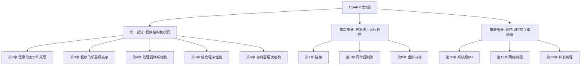

## 0.1 关于本书

《深入理解计算机系统》（Computer Systems: A Programmer's Perspective,简称 **CS:APP**）由 CMU 的 Randal E. Bryant 和 David R. O'Hallaron 编写,从**程序员的角度**讲解计算机系统:不是教你如何设计硬件或操作系统,而是解释"你写的程序在机器上到底发生了什么"。

本系列笔记基于**第 3 版**（中文版:机械工业出版社 2016;ISBN 9787111544937）。第 3 版最大的变化是**从 IA32 全面转向 x86-64**,浮点部分也改用 AVX2 讲解。小节编号与关键数据已对照原书（Global Edition 3rd）PDF 校对;性能数据（CPE 等）为原书参考机 Core i7 Haswell 上的测量值。

> 本书由 12 章组成,旨在阐述计算机系统的核心概念。

全书分三部分:



第 1 章（计算机系统漫游）是全书的总览,不归入任何部分。

## 0.2 各章一句话

| 章 | 标题 | 一句话 |
| --- | --- | --- |
| 1 | 计算机系统漫游 | 跟踪一个 hello 程序的生命周期,把全书主题过一遍 |
| 2 | 信息的表示和处理 | 位、整数（无符号/补码）与浮点（IEEE 754）在机器中如何表示与运算 |
| 3 | 程序的机器级表示 | C 代码对应的 x86-64 汇编:数据传送、控制流、过程、数组与结构体 |
| 4 | 处理器体系结构 | 用教学指令集 Y86-64 从零设计一个顺序与流水线处理器 |
| 5 | 优化程序性能 | 编译器能优化什么、不能优化什么,以及如何写出快的代码 |
| 6 | 存储器层次结构 | SRAM/DRAM/磁盘与 cache,局部性,编写缓存友好的代码 |
| 7 | 链接 | 静态/动态链接、符号解析、重定位、共享库与位置无关代码 |
| 8 | 异常控制流 | 异常、进程、fork/execve、信号——操作系统如何夺回控制权 |
| 9 | 虚拟内存 | 页表、地址翻译、内存映射与 malloc 的实现 |
| 10 | 系统级I/O | Unix I/O（read/write）是所有 I/O 的地基,标准 I/O 建立在它之上 |
| 11 | 网络编程 | socket API 与一个迷你 Web 服务器 |
| 12 | 并发编程 | 进程、I/O 多路复用、线程与信号量同步 |

## 0.3 阅读路线

- **顺序通读**:第 1~6 章（程序结构和执行）是理解后续内容的基础,建议按顺序读;第 2 章的补码与浮点、第 3 章的汇编是全书的硬通货。
- **配合其他书**:第 7 章可配合《程序员的自我修养——链接、装载与库》（见本库 [链接、装载与库](/链接、装载与库/)）;第 8、9 章可配合操作系统材料;第 11 章可配合计算机网络材料。
- **第一部分偏底层硬件**。如果时间有限:第 4 章（Y86-64 处理器设计）相对独立,可最后再看。

## 0.4 CS:APP Labs

原书的精华之一是配套实验（官网 [csapp.cs.cmu.edu](http://csapp.cs.cmu.edu/3e/labs.html)）,每个 lab 对应若干章:

| Lab | 内容 | 对应章节 |
| --- | --- | --- |
| Data Lab | 只用位运算实现各种函数 | 第 2 章 |
| Bomb Lab | 拆"二进制炸弹",读懂汇编 | 第 3 章 |
| Attack Lab | 缓冲区溢出注入攻击（code injection / ROP） | 第 3 章 |
| Architecture Lab | 修改并优化 Y86-64 处理器 | 第 4 章 |
| Cache Lab | 模拟缓存 + 写缓存友好的转置函数 | 第 6 章 |
| Shell Lab | 实现一个带作业控制的 Unix shell | 第 8 章 |
| Malloc Lab | 实现一个显式空闲链表分配器 | 第 9 章 |
| Proxy Lab | 实现一个多线程 Web 代理 | 第 11、12 章 |

## 0.5 环境说明

书中代码基于 **x86-64 Linux + GCC（GNU Compiler Collection）**,查看汇编用:

```bash
gcc -Og -S hello.c        # 生成汇编(.s 文件,-Og 让优化不干扰阅读)
gcc -o hello hello.c      # 编译链接出可执行文件
objdump -d hello          # 反汇编可执行文件
```

在 macOS（Apple Silicon）或 Windows 上可通过 **Docker（x86-64 镜像）**、远程 Linux 服务器或 WSL 获得一致环境。
