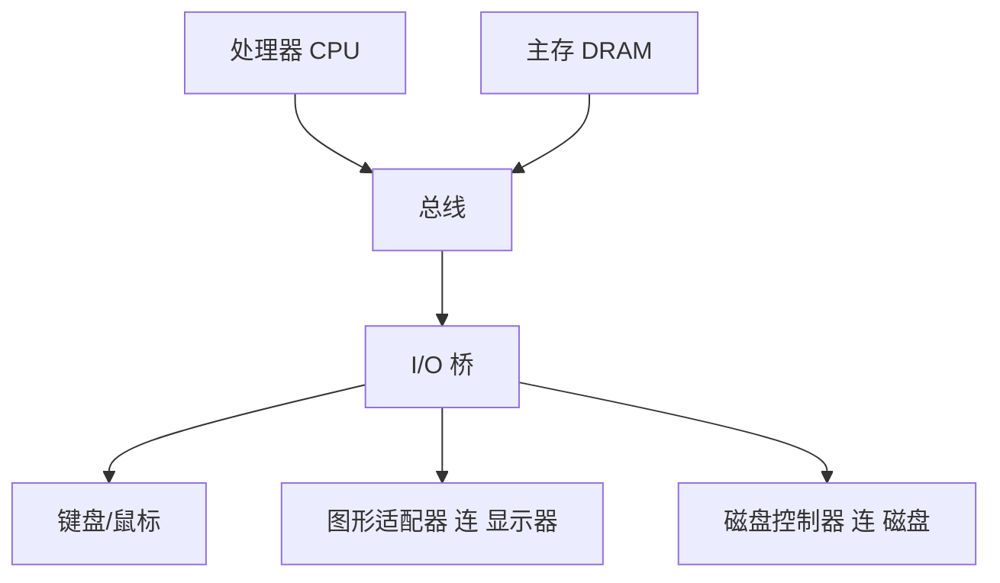
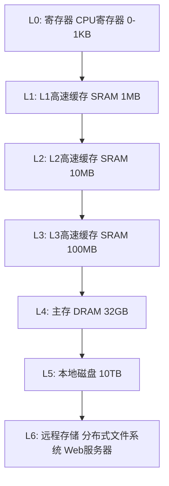
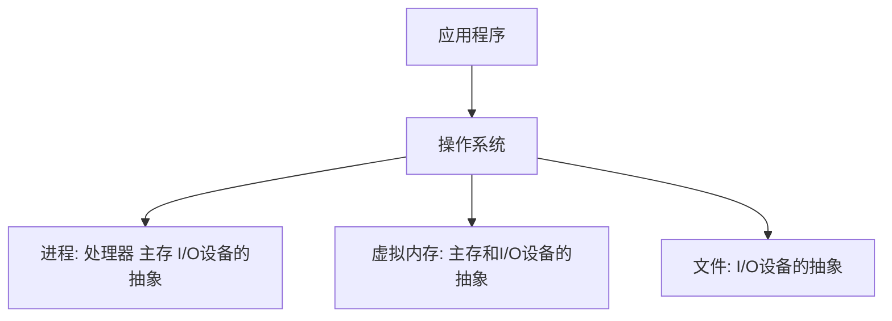
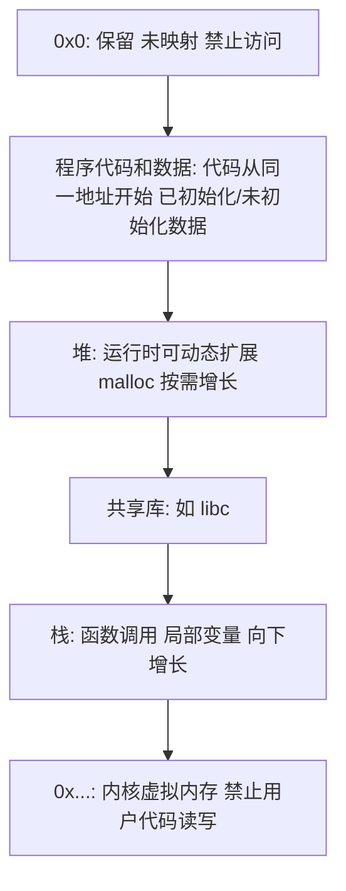
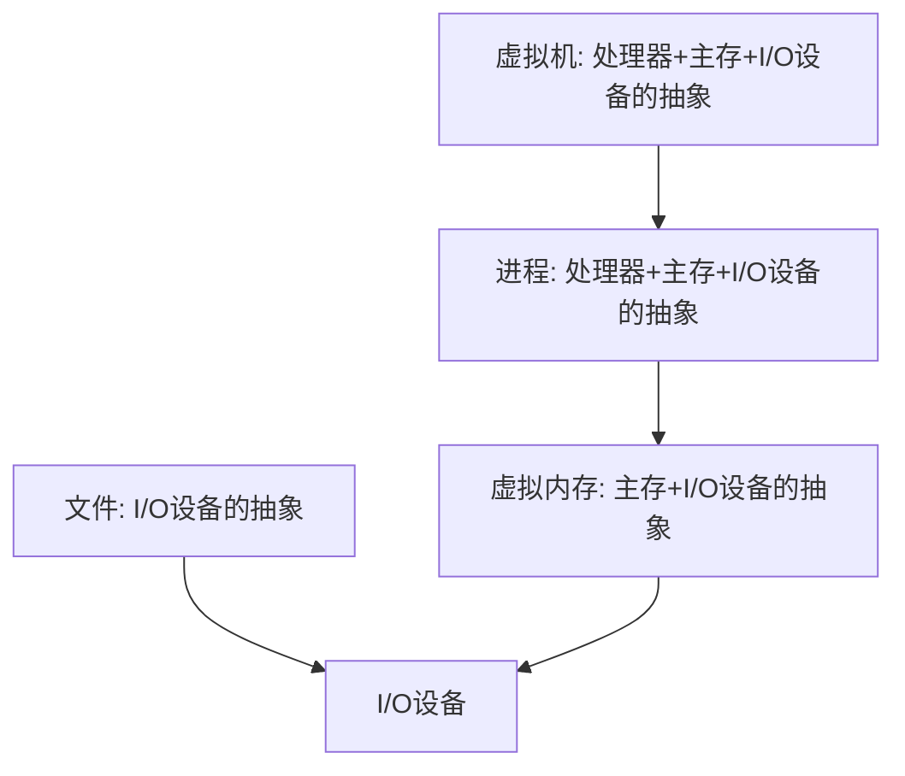

## 1.1 信息就是位 + 上下文

hello.c 的生命周期从一个源文件开始,它就是一个**位（bit）序列**:

```c
#include <stdio.h>

int main()
{
    printf("hello, world\n");
    return 0;
}
```

- 源文件本质是字节序列,每个字节是一个 8 位的位串。如 `#` 的 ASCII 码是 35,即 `00100011`。
- 只由 ASCII 字符构成的文件称为**文本文件（text file）**,其他所有文件都称为**二进制文件（binary file）**。
- 系统中一切信息——磁盘文件、内存中的程序与数据、网络上传送的数据——都是一串位。**区分不同数据对象的唯一方法,是我们读到这些数据时的上下文（context）**:同样的字节序列,在不同上下文中可以是一个整数、字符串或机器指令。

## 1.2 程序被其他程序翻译成不同的格式

C 语言是**高级语言**,它的语句要先被翻译成机器能懂的指令序列（**机器语言**）,打包成**可执行目标文件（executable object file）**才能运行。GCC 驱动的翻译分四步:


- **预处理阶段（preprocessing）**:处理 `#` 开头的命令,`#include <stdio.h>` 把头文件内容直接插入程序文本,得到 `hello.i`。
- **编译阶段（compilation）**:将 `hello.i` 翻译成汇编语言程序 `hello.s`。汇编是各种高级语言（malloc.c、main.c、C++/Fortran 编译器输出）的**公共出口**。
- **汇编阶段（assembly）**:将 `.s` 翻译成机器指令,打包成**可重定位目标文件（relocatable object file）** `hello.o`。
- **链接阶段（linking）**:hello 程序调用的 `printf` 在 `printf.o` 里（标准 C 庿的一部分）,链接器把它们合并,得到可执行文件 `hello`。

## 1.3 了解编译系统如何工作是大益处的

- **优化程序性能**:理解编译器做了什么（循环的机器级实现、指针与数组的关系）才能写出高效代码。
- **理解链接时错误**:经典问题——静态库的命令行顺序、重复定义的全局变量,第 7 章展开。
- **避免安全漏洞**:缓冲区溢出等安全漏洞的根源是程序员对数据在栈上的表示与控制方式了解不足,第 3 章展开。

## 1.4 处理器读并解释储存在内存中的指令

### 1.4.1 系统的硬件组成



- **总线（bus）**:贯穿系统的电子管道,携带信息字节并负责在各部件间传递,通常传送定长的**字（word）**。32 位系统字长 4 字节,64 位系统字长 8 字节。
- **I/O 设备**:系统与外界的联系通道（键盘、鼠标、显示器、磁盘）。每个 I/O 设备通过一个**控制器（controller）**或**适配器（adapter）**连到 I/O 总线。
- **主存（main memory）**:临时存放程序与数据的地方,物理上是一组 **DRAM（dynamic random access memory,动态随机存取存储器）** 芯片;逻辑上是一个线性的字节数组,每个字节有唯一地址。
- **处理器（CPU）**:执行存储在主存中指令的引擎,核心是**程序计数器（Program Counter,PC）**——一个字长寄存器,任意时刻指向某条机器指令（含该指令的内存地址）。处理器按 PC 指向取指令、解释位、更新 PC。指令集围绕少数操作构建:
  - **加载（load）**:从主存复制一个字节/字到寄存器,覆盖原值
  - **存储（store）**:从寄存器复制到主存
  - **操作（operate）**:把两个寄存器的值复制到 ALU（Arithmetic and Logic Unit,算术逻辑单元）,ALU 做算术运算后写回寄存器
  - **跳转（jump）**:从指令中抽取目标地址,复制到 PC

现代处理器远比这个简单模型复杂（乱序、分支预测等,见第 4、5 章）,但模型够用来理解机器级程序的行为。

### 1.4.2 运行 hello 程序

- shell（命令行解释器）等待输入 `./hello` 回车后,读入字符到寄存器,再存入内存。
- shell 执行一系列指令**加载可执行 hello 文件**:利用 **DMA（direct memory access,直接存储器存取）** 技术,数据可以不经过处理器直接从磁盘到达主存。
- 加载完成后,处理器开始执行 hello 的 `main`,机器指令将 "hello, world\n" 字节从主存复制到寄存器,再从寄存器复制到显示设备显示。

## 1.5 高速缓存至关重要

"简单hello 程序也要复制大量数据:磁盘→主存→处理器" 的例子揭示了一个系统矛盾:**制造更快更小的存储设备,比制造更大更慢的设备成本高得多**。

- **高速缓存存储器（cache memory,高速缓存）** 作为 L1/L2 缓存,是**静态随机访问存储器（Static Random-Access Memory,SRAM）** 技术,缓解处理器与主存（DRAM）的速度鸿沟。
- L1 高速缓存容量数万字节,速度几乎和寄存器一样快;L2 数十万到数百万字节,通过总线与处理器相连,比 L1 慢 5 倍左右。
- 系统可以取得较大存储器与较快存储器的平衡,依靠的是程序的**局部性（locality）** 原理,第 6 章展开。

## 1.6 存储设备形成层次结构



- 从上往下:容量更大、速度更慢、价格更便宜（**更靠近 CPU 的层是更低层级的子集**——L1 的数据都在 L2 中,L0 的数据都在 L1 中）。
- 存储器层次结构是理解计算机系统性能的核心概念,**上一层的存储器作为低一层存储器的高速缓存**。L4 主存作为 L5 磁盘的缓存（由 OS + 磁件控制器的硬件共同管理,虚拟内存机制,第 9 章）。

## 1.7 操作系统管理硬件

可以把操作系统看成应用程序与硬件之间的一层软件,提供三种基本抽象:



- 所有应用程序对硬件的操作尝试都必须通过操作系统。

### 1.7.1 进程

**进程（process）** 是对**处理器、主存和 I/O 设备**的抽象。程序运行时,操作系统给人一种"程序独占处理器、主存和 I/O 设备"的假象,实际上一条指令可能与其他进程交错执行——通过**上下文切换（context switching）** 实现。

- **上下文（context）**:进程运行所需的所有状态信息（PC、寄存器、主存内容等）。
- 切换由**内核（kernel）** 管理。内核是操作系统代码常驻主存的部分,不是独立进程,是系统管理全部进程所用代码与数据结构的集合。
- 示例:shell 进程调用 fork 创建新进程,内核进行上下文切换;新进程 execve 加载并运行 hello;hello 结束后内核切换回 shell。

### 1.7.2 线程

一个进程可以由多个**线程（thread）** 组成,每个线程运行在进程的上下文中,共享同样的代码与全局数据。线程是网络服务器高性能处理的基本单位（第 12 章）。

### 1.7.3 虚拟内存

**虚拟内存（virtual memory）** 是对**主存和磁盘 I/O 设备**的抽象,让进程以为自己独占整个主存。每个进程看到的内存是一致的,称为**虚拟地址空间（virtual address space）**,布局如下（从下往上,地址增大方向）:



虚拟内存机制运作需硬件与 OS 软件密切配合,第 9 章展开。

### 1.7.4 文件

**文件（file）** 就是**字节序列**,是对 **I/O 设备**的抽象。每个 I/O 设备（磁盘、键盘、显示器、网络）都被看成文件,系统的所有输入输出都是通过**Unix I/O** 系统调用读写文件实现的。

## 1.8 系统之间利用网络通信

网络可以视为一个 I/O 设备。从一台主机拷贝信息到另一台:本机系统调用 `read`/`write`,数据经过网络适配器,到达远端机器,如本地 telnet 远程运行 hello,流通过:本地键盘 → 本地 telnet 客户端 → 网络 → 远端 shell → 远端 hello → 远程 telnet 服务器 → 网络 → 本地 telnet 客户端 → 本地显示器。

## 1.9 重要主题

### 1.9.1 Amdahl 定律

**Amdahl 定律（Amdahl's Law）**:想大幅提升整个系统的性能,必须提升整个系统中**相当大的部分**的性能。

主要观点:若对系统某部分加速比例为 $s$,该部分原本耗时占整个系统的 $\alpha$,则整体加速比:

$$S = \frac{1}{(1 - \alpha) + \alpha/s}$$

即使把占比 $\alpha$ 的部分加速到无穷快（$s \to \infty$）,整体加速比也只到 $\frac{1}{1-\alpha}$。例如某部分占 60%,即使它快 100 倍,整体也只是 $\frac{1}{0.4+0.6/100} \approx 2.46$ 倍。**要想显著加速整个系统,必须改进全系统中很大一部分组件**。

### 1.9.2 并发和并行

- **并发（concurrency）**:同时具有多个活动的系统,通用概念。
- **并行（parallelism）**:用并发使系统运行得更快,强调同时执行。

三个层次:

- **线程级并发**:多进程虚拟多台计算机;多处理器/多核更高效;**超线程（hyperthreading,同时多线程 simultaneous multi-threading）** 是一项允许一个 CPU 执行多个控制流的技术,一个核有多个硬件部件（PC、寄存器）,如一个 4 核 i7 处理器每个核 2 个超线程,可同时执行 8 个线程。
- **指令级并行**:现代处理器可以同时执行多条指令（**流水线 pipelining** 技术）。如果处理器达到每个周期一条以上的指令（通常 2~4 条）,称为**超标量（superscalar）**处理器。
- **单指令、多数据并行（Single Instruction, Multiple Data,SIMD）**:最低层次,一条特殊指令并行地对多个数据做加法/乘法,多以向量方式出现,GCC 支持 SIMD 指令的向量扩展。

### 1.9.3 计算机系统中抽象的重要性

抽象是隐藏复杂性的艺术。编程语言是机器指令的抽象;上文四个抽象（进程、虚拟内存、文件、虚拟机）是操作系统提供的抽象:



在处理器设计中,**指令集架构（Instruction Set Architecture,ISA）** 是对处理器硬件的抽象:机器代码程序假设运行在 ISA 之上,而不必关心底层硬件如何实现。**虚拟机**则提供对整个计算机（包括 OS）的抽象。

## 1.10 小结

- 计算机系统 = 硬件 + 系统软件 + 应用程序,信息统一以位串表示,靠上下文区分。
- 编译系统把 C 翻译成机器码;处理器、存储器、I/O 通过总线协作。
- 加速大概率事件、Amdahl 定律;存储层次与抽象（进程、虚拟内存、文件）是全书后文的两大主线。
