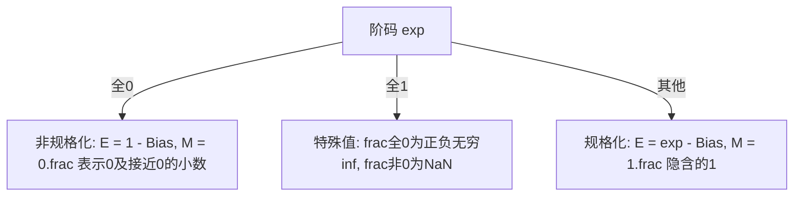

## 2.1 信息存储

计算机中一切信息都是**二进制位串**,大多数计算机以 8 位的**字节（byte）** 作为最小可寻址内存单位。机器级程序把内存视为一个非常大的字节数组,称为**虚拟内存（virtual memory）**;内存的每个字节由唯一**地址（address）** 标识,所有可能地址的集合就是**虚拟地址空间**。

### 2.1.1 十六进制表示法

一个字节 8 位,用二进制太啰嗦、十进制转换麻烦,**十六进制（hexadecimal,base 16）** 是事实标准:一个字节的取值 $00000000_2 \sim 11111111_2$ 即 $0x00 \sim 0xFF$。

| 十六进制 | 1 | 2 | 3 | 4 | 5 | 6 | 7 | 8 | 9 | A | B | C | D | E | F |
| --- | --- | --- | --- | --- | --- | --- | --- | --- | --- | --- | --- | --- | --- | --- | --- |
| 十进制 | 1 | 2 | 3 | 4 | 5 | 6 | 7 | 8 | 9 | 10 | 11 | 12 | 13 | 14 | 15 |

常用换算技巧:$2^n$ 的十六进制就是 $2^{n \bmod 4}$ 后面跟 $\lfloor n/4 \rfloor$ 个 0,如 $2^{11} = 0x800$。十六进制 ↔ 二进制按 4 位一组直接映射。

### 2.1.2 字数据大小

**字长（word size）** 指指针的标称大小（nominal size）,虚拟地址以字长编码,决定了最大虚拟地址空间。32 位字长限制虚拟地址空间 4GB;64 位字长是 16EB。x86-64 机器上 `long` 为 8 字节,而 32 位机器为 4 字节。

C 的数据类型在 x86-64（Linux/gcc）上的典型大小:

| C 声明 | 32 位 | 64 位 |
| --- | --- | --- |
| `char` | 1 | 1 |
| `short int` | 2 | 2 |
| `int` | 4 | 4 |
| `long int` | 4 | 8 |
| `long long int` | 8 | 8 |
| `char *` | 4 | 8 |
| `float` | 4 | 4 |
| `double` | 8 | 8 |

`int32_t`、`int64_t` 等定宽类型是 ISO C99 引入的,大小固定,利于可移植性。

### 2.1.3 寻址和字节顺序

多字节对象在内存中如何排列各字节?对 `int x = 0x01234567`,`&x = 0x100`:

| 地址 | 0x100 | 0x101 | 0x102 | 0x103 |
| --- | --- | --- | --- | --- |
| **小端（little endian）** | 67 | 45 | 23 | 01 |
| **大端（big endian）** | 01 | 23 | 45 | 67 |

- **小端法（little endian）**:最低有效字节在最前面（多数 Intel 兼容机）。
- **大端法（big endian）**:最高有效字节在最前面（多数 IBM、Oracle 机器;网络字节序也是大端）。

用一段程序打印对象的字节表示（show_bytes）:

```c
#include <stdio.h>

typedef unsigned char *byte_pointer;

void show_bytes(byte_pointer start, size_t len) {
    size_t i;
    for (i = 0; i < len; i++)
        printf(" %.2x", start[i]);   // 以十六进制逐字节打印
    printf("\n");
}

void show_int(int x) {
    show_bytes((byte_pointer) &x, sizeof(int));
}
void show_float(float x) {
    show_bytes((byte_pointer) &x, sizeof(float));
}
void show_pointer(void *x) {
    show_bytes((byte_pointer) &x, sizeof(void *));
}
```

在 x86-64 Linux 上测试 `int x = 12345`（0x00003039）,打印 `39 30 00 00`——小端法。同样的值在不同机器/系统上的字节序列可能不同,**这解释了二进制数据在网络传输与文件存储时必须约定字节序**。

### 2.1.4 表示字符串

C 字符串是以 **null（0） 结尾**的字节数组。ASCII 字符串的编码与字节序无关（每字符独立一字节）,因而在任何机器上文本数据具有更强的平台独立性。

### 2.1.5 表示代码

同一段 C 源码,不同机器/编译器产出的机器码不同——**机器码没有统一标准二进制格式**。从这个角度看,程序就是字节序列。

### 2.1.6 布尔代数简介

二进制值 1/0 定义了布尔代数,基本运算:**NOT（¬）、AND（∧）、OR（∨）**。按位扩展到向量:按位独立运算。用途:位向量可以表示有限集合,如 $a = [01101001]$ 表示集合 $\{0, 3, 5, 6\}$,`&` 求交集、`|` 求并集、`¬` 求补集。

### 2.1.7 C 语言中的位级运算

C 支持 `& | ^ ~`（按位与、或、异或、取反）,直接映射到布尔运算。经典应用——**交换两个值不借助临时变量**:

```c
void inplace_swap(int *x, int *y) {
    *y = *x ^ *y;   /* 第 1 步: a ^ b 存入 y */
    *x = *x ^ *y;   /* 第 2 步: x 变为原 y */
    *y = *x ^ *y;   /* 第 3 步: y 变为原 x */
}
```

原理: `(a ^ b) ^ a = b`。注意 x 与 y 指向同一位置时会清零。另一个经典:掩码（mask）——`x & 0xFF` 取最低字节;`~0` 生成全 1 掩码。

### 2.1.8 C 语言中的逻辑运算

`|| && !` 与位运算的区别:**把任何非零视为 TRUE,只产生 0/1**,且**短路求值**:

```c
int a = 0x55, b = 0x39;
a && b   /* 1: 两者都非零 */
!a || !b /* 0: !a 为 0, !b 为 0 */
/* 对比位级: a & b = 0x01, a | b = 0x7D, ~a | ~b = 0xFE */
```

指针判空惯用法:`if (!p || *p > 0)`,若 p 为 NULL,短路避免了对空指针解引用。

### 2.1.9 C 语言中的移位运算

- 左移 `x << k`:补 0。
- **右移**分两种:
  - **逻辑右移（logical）**:左端补 0。
  - **算术右移（arithmetic）**:左端补**最高有效位的值**（符号扩展）。
- 几乎所有编译器/机器对**有符号数用算术右移**,对无符号数用逻辑右移。
- Java 中明确区分:`>>` 算术右移,`>>>` 逻辑右移。
- 移位量 k 应在 0 ~ w-1 之间,超出则为未定义行为（C 语言没明确定义,如 x86-64 上 `x << k` 实际对 k 取模位宽）。
- 移位运算优先级低于加法,`1 << 2 + 3 << 4` 意为 `1 << (2+3) << 4`,**加括号**。

## 2.2 整数表示

### 2.2.1 整型数据类型

w 位能表示 $2^w$ 个值。关键取值（以 w 位为例）:

| 量 | 值 |
| --- | --- |
| $UMax_w$ | $2^w - 1$ |
| $TMin_w$ | $-2^{w-1}$ |
| $TMax_w$ | $2^{w-1} - 1$ |

注意 **$|TMin| = TMax + 1$**（补码的不对称性）:一半的位模式表示负数,另一半表示非负数,而 0 占掉了非负数的一个名额。64 位:`TMin = -9223372036854775808`,`TMax = 9223372036854775807`。

### 2.2.2 无符号数的编码

$$B2U_w(\vec{x}) = \sum_{i=0}^{w-1} x_i \cdot 2^i$$

无符号编码是**双射**（每个位模式唯一对应一个值）。

### 2.2.3 补码编码

**补码（two's complement）**:最高位是符号位,权重为 $-2^{w-1}$:

$$B2T_w(\vec{x}) = -x_{w-1} \cdot 2^{w-1} + \sum_{i=0}^{w-2} x_i \cdot 2^i$$

- 同样是双射。w=4 时: `[1111]` = -1,`[0111]` = $TMax = 7$,`[1000]` = $TMin = -8$。
- 非负数 x 的补码 = x 的无符号表示;负数 -x 的补码 = $2^w - x$。
- **$UMax = 2 \times TMax + 1$**。

### 2.2.4 有符号数与无符号数之间的转换

C 标准要求:**位模式不变,解释方式改变**。补码 ↔ 无符号的映射:

- 补码 → 无符号:$T2U_w(x) = \begin{cases} x + 2^w, & x < 0 \\ x, & x \geq 0 \end{cases}$
- 无符号 → 补码:$U2T_w(u) = \begin{cases} u, & u \leq TMax_w \\ u - 2^w, & u > TMax_w \end{cases}$

例如 16 位:12345 的两种表示相同;−1 ↔ 65535;−32768 ↔ 32768。

### 2.2.5 C 语言中的有符号数与无符号数

- C 中大多数常数默认 int（有符号）;`12345U` 后缀 U 表示无符号。
- **运算对象一个是无符号数时,另一个会被隐式转换为无符号**——这是大量 bug 的来源:

```c
int a = -1;
unsigned b = 0;
if (a < b)          /* -1 被转为 UMax,比较结果为假! */
    printf("负数更小\n");
else
    printf("实际会走到这里\n"); /* 打印这个 */
```

- `sizeof` 返回无符号类型,经典坑:

```c
for (unsigned i = n - 1; i >= 0; i--)  /* i-- 到 0 后再减 1 变 UMax,死循环 */
    ...
```

### 2.2.6 扩展一个数字的位表示

- **无符号数 → 更宽类型:零扩展（zero extension）**,高位补 0。
- **补码数 → 更宽类型:符号扩展（sign extension）**,高位补符号位。例如 16 位 `-1 (FFFF...)` 扩为 32 位 `0xFFFFFFFF` 仍为 -1。
- C 中先改变大小再改变符号（如 `short → unsigned`）时,先做符号扩展再转无符号,结果仍是预期的位模式。

### 2.2.7 截断数字

截断到 k 位 = **对 $2^k$ 取模**:

- 无符号:$B2U_k([x_{k-1}, ..., x_0]) = B2U_w(\vec{x}) \bmod 2^k$
- 补码:$T2B_k$ 结果 = $U2T_k(B2U_w(\vec{x}) \bmod 2^k)$

例如 int 值 53191 截断为 8 位:53191 mod 256 = 135,补码解释为 -121。

### 2.2.8 关于有符号数与无符号数的建议

- 无符号运算的回绕（wrap around）特性并非 bug 而是**特性**,合理使用（如取模运算、想包含全部 w 位模式时）。
- **谨慎在可能为负的表达式场景使用无符号**。例:`unsigned i; for (i = n-1; i >= 0; i--)` 死循环;比较 `sizeof` 结果时注意。

## 2.3 整数运算

### 2.3.1 无符号加法

w 位无符号加法:**溢出则丢弃高位,等价于模 $2^w$**:

$$x +^u_w y = \begin{cases} x + y, & x + y < 2^w \quad \text{正常} \\ x + y - 2^w, & 2^w \leq x + y < 2^{w+1} \quad \text{溢出} \end{cases}$$

**检测溢出**:$s = x + y$ 溢出当且仅当 $s < x$（或 $s < y$）。

### 2.3.2 补码加法

补码加法 = 同样位模式的无符号加法,再解释为补码。三种情况:正溢出（$x+y > TMax$,结果变"很负"）、正常、负溢出:

$$x +^t_w y = \begin{cases} x + y - 2^w, & 2^{w-1} \leq x + y \quad \text{正溢出} \\ x + y, & -2^{w-1} \leq x + y < 2^{w-1} \quad \text{正常} \\ x + y + 2^w, & x + y < -2^{w-1} \quad \text{负溢出} \end{cases}$$

例:8 位下 127 + 1 = -128（正溢出）,-128 + （-1） = 127（负溢出）。

**检测补码加法溢出**:当且仅当 $x, y$ 同号而 $s$ 与它们异号。

```c
int tadd_ok(int x, int y) {
    int s = x + y;
    return (x > 0 && y > 0 && s <= 0) ||
           (x < 0 && y < 0 && s >= 0) ? 0 : 1;  /* 1 表示未溢出 */
}
```

### 2.3.3 补码的非

$TMin_w$ 的非是它自己（$-2^{w-1}$ 取负溢出仍为 $-2^{w-1}$）。其余 $x$ 的非为 $-x$,位级技巧:**按位取反再加 1**:$-x = \sim x + 1$。

### 2.3.4 无符号乘法

w 位乘积可能需要 2w 位,机器只保留低 w 位:$x *^u_w y = (x \cdot y) \bmod 2^w$。

### 2.3.5 补码乘法

同样保留低 w 位,再按补码解释:$x *^t_w y = U2T_w((x \cdot y) \bmod 2^w)$。**关键结论:无符号乘与补码乘的位级结果完全相同**,只是解释不同。乘法溢出检测:$xy \neq 0$ 且 $p = x*y$ 除以 $x$ 不等于 $y$,或用除法/高位判断。

### 2.3.6 乘以常数

乘法指令慢（3~12+ 周期）,编译器用**移位和加法**组合优化:

- 乘 $2^k$:左移 k 位。
- 乘常数 $K$:把 K 写成二进制,对连续 1 的段用 $(m << j) + (m << (j+1))$ 或减法形式 $(m << (j+2)) - (m << j)$。例:$x * 14$ → `(x<<3) + (x<<2) + (x<<1)`,或 `(x<<4) - (x<<1)`。

### 2.3.7 除以 2 的幂

除法更慢（20+ 周期）,用右移代替:

- **无符号 / 补码正数:逻辑右移 k 位** = 恰好 $\lfloor x / 2^k \rfloor$,无歧义。
- **补码负数:算术右移会向下舍入（偏小）**,而 C 语言要求截断到零。修正:**加偏置（biasing）再移位**——$(x + (1 << k) - 1) >> k$（算术右移）,即 $\lceil x / 2^k \rceil$ 对负数成立,实现向零舍入。

### 2.3.8 关于整数运算的最后思考

- 计算机整数运算是**模运算**,"环绕"是正常行为。
- 补码提供了使加减乘除位级统一于无符号的巧妙编码;不对称的 $TMin$ 是多数边界问题的根源。
- **必须时刻意识到溢出**是可能的,程序员有责任检查。

## 2.4 浮点数

### 2.4.1 二进制小数

二进制小数按 2 的幂加权:$b = \sum_{i} b_i \cdot 2^i$（小数点右为负指数）。二进制小数只能精确表示 $x / 2^k$ 形式的数,如 1/3 = 0.010101... 无限循环——**十进制小数（如 0.1）在二进制中无法精确表示**,这是一切浮点精度问题的根源。

### 2.4.2 IEEE 浮点表示

IEEE 754 标准,用 $V = (-1)^s \times M \times 2^E$ 表示数:

- **符号（sign）** s:1 位,决定正负。
- **尾数（significand, mantissa）** M:一个二进制小数,范围为 $1 \sim 2 - \varepsilon$ 或 $0 \sim 1 - \varepsilon$。
- **阶码（exponent）** E:对浮点数加权。

单精度（float,32 位）:s 1 位、exp 8 位、frac 23 位;双精度（double,64 位）:s 1 位、exp 11 位、frac 52 位。按 exp 的值分三种情况（以单精度为例）:



- **偏置（Bias）**:$Bias = 2^{k-1} - 1$,单精度 127,双精度 1023。规格化数 $E = e - Bias$,单精度 E 范围 -126 ~ +127。
- 规格化数**隐含了开头的 1**（leading one）,白赚一位精度。
- 非规格化数用于:**表示 0**（exp/frac 全 0;有 +0.0 和 -0.0）与**渐进下溢**（表示非常接近 0 的数,平滑过渡到 0）。
- 特殊值:**+∞/-∞**（如除零、溢出）与 **NaN**（Not a Number,如 $\sqrt{-1}$、∞-∞）。

### 2.4.3 数字示例

| 位模式（单精度） | 表示 |
| --- | --- |
| `0 00000000 00000000000000000000000` | +0 |
| `0 11111111 00000000000000000000000` | $+\infty$ |
| `0 11111111 10000000000000000000000` | NaN |
| `0 01111111 000...000` | 1.0（E=0, M=1.0） |

值的分布:**越靠近 0 越稠密,绝对值越大越稀疏**（不是均匀的）。

### 2.4.4 舍入

默认方式是**向偶数舍入（round-to-even）**:舍入到最接近的候选值;若在中间（恰好 0.5）,舍入使最低有效位为偶数（0）。

- 例如十进制 1.40 → 1.4,1.60 → 1.6,1.5 与 2.5 都 → 2（向偶）。
- 好处:**无统计偏置**——一半向上、一半向下,长期平均接近真值。二进制同理:舍入到最低有效位为 0 的那个。

其他模式:向零舍入、向下、向上。

### 2.4.5 浮点运算

- 加法:**可交换但不可结合**。$(3.14 + 1e10) - 1e10 \neq 3.14 + (1e10 - 1e10)$,因为 3.14 在大数面前被舍入掉了。
- 乘法对加法**不满足分配律**。
- 单调性（monotonicity）成立:若 $a \geq b$ 则 $a + c \geq b + c$（NaN 除外）——比补码溢出的环绕行为"安全":浮点溢出到 ∞,无效运算得 NaN,而整数溢出会回绕成大相反数。
- 缺乏结合性会破坏数学恒等式,编译器不能随意重排浮点表达式。

### 2.4.6 C 语言中的浮点数

C 提供 `float`/`double`,标准只要求 float 至少能精确表示 6 位十进制有效数字,double 至少 10 位（通常分别为 23/52 位尾数,约 7 与 16 位十进制精度）。`int → float` 可能舍入（int 32 位 > 24 位尾数）;`float → int` 向零舍入,越界/NaN 结果未定义（多为 $TMin$）。

## 2.5 小结

- 计算机将信息编码为位,按上下文解释。
- 无符号与补码:位模式不变、解释不同;隐式转换规则是坑的高发区。
- 运算是模运算,溢出回绕;$TMin$ 的不对称性值得警惕。
- IEEE 754 用规格化/非规格化数覆盖极宽动态范围,向偶舍入无偏但牺牲结合律。
- 精确理解这些表示,是写出正确、安全、可移植代码的前提。
