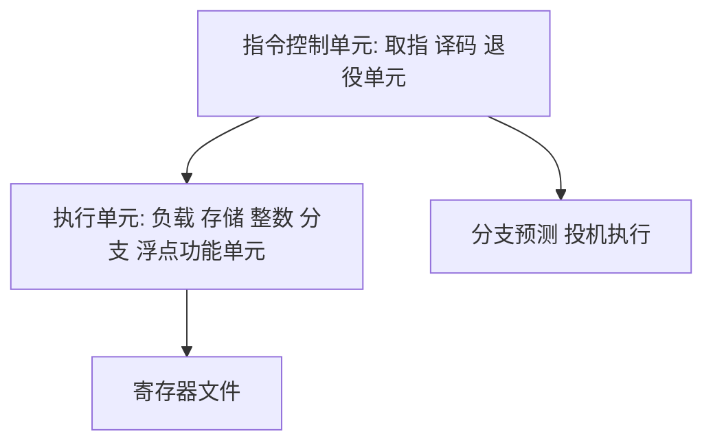

## 5.1 优化编译器的能力和局限性

现代编译器成熟而复杂,但必须**保守**:**只做保证程序语义不变（按 C 标准）的优化**。两个典型障碍:

- **内存别名（memory aliasing）**:两个指针指向同一内存位置,编译器无法在多数情况下判断是否别名:

```c
void twiddle1(long *xp, long *yp) {
    *xp += *yp;
    *xp += *yp;
}
void twiddle2(long *xp, long *yp) {
    *xp += 2 * *yp;
}
```

若 xp 与 yp 指向不同位置,twiddle2 快 1 倍;但若相同（别名）,twiddle1 结果是 4 倍值,twiddle2 是 3 倍,**语义不同**,编译器不能擅自替换。

- **函数调用副作用**:

```c
long f();
long func1() { return f() + f() + f() + f(); }
long func2() { return 4 * f(); }
```

f 可能改全局状态（如计数器）,两次调用结果可能不同,func2 不能替换 func1。GCC 常用 **-fno-inline 禁止内联/重排**;**内联函数（inlining）** 可以让编译器看到函数体后做更多优化。

结论:**写"对编译器友好"的代码**（避免别名、帮助识别循环不变量）,是程序员的责任。

## 5.2 表示程序性能

引入 **CPE（Cycles Per Element,每元素的周期数）** 度量:**总周期数 = a + b·n**（固定的启动开销 a + 线性部分）,CPE 就是斜率 b。比较不同实现时看 CPE 越小越好。

## 5.3 程序示例

原书核心示例——combine 系列:向量求和/点乘。数据结构:

```c
typedef struct {
    long len;
    data_t *data;
} vec_rec, *vec_ptr;
```

combine1 的初始实现（每次循环调用 get_vec_element 做边界检查、vec_length 放在循环条件里）:

```c
void combine1(vec_ptr v, data_t *dest) {
    long i;
    *dest = IDENT;
    for (i = 0; i < vec_length(v); i++) {
        data_t val;
        get_vec_element(v, i, &val);   /* 每次都做边界检查 */
        *dest = *dest OP val;
    }
}
```

OP 为 +/×,IDENT 为 0/1,演示通用优化过程。

## 5.4 消除循环的低效率

**代码移动（code motion）**:把循环不变计算移出循环——`vec_length(v)` 移到循环外:

```c
void combine2(vec_ptr v, data_t *dest) {
    long i;
    long length = vec_length(v);       /* 循环外取长度 */
    *dest = IDENT;
    for (i = 0; i < length; i++) {
        data_t val;
        get_vec_element(v, i, &val);
        *dest = *dest OP val;
    }
}
```

CPE 约从 6~9 降到 5~7。这类优化本该编译器做,但调用在循环内 + 潜在副作用使它不敢。（strcmp 之类长度判定的经典教训:"Mark Allen Mitchell 教授在 Colwell 的书中提到的把 strlen 移出循环" 使性能提升数倍。）

## 5.5 减少过程调用

过程调用有开销（参数传递、call/ret、栈管理）。combine3 直接访问数据数组,去掉 get_vec_element:

```c
void combine3(vec_ptr v, data_t *dest) {
    long i;
    long length = vec_length(v);
    data_t *d = get_vec_start(v);      /* 直接拿首地址 */
    *dest = IDENT;
    for (i = 0; i < length; i++) {
        *dest = *dest OP d[i];
    }
}
```

注意:这引入了"绕过边界检查"的耦合——**优化常常以牺牲部分抽象性为代价**,收益也逐渐递减（调用开销占比越来越小）。

## 5.6 消除不必要的内存引用

combine3 的 `*dest` 每次迭代都要**load + store**（编译器不知道 dest 是否与 d[i] 别名）:

```asm
.L518:
    vmovsd  (%rbx), %xmm0    # 读 *dest
    vmulsd  (%rax), %xmm0, %xmm0
    vmovsd  %xmm0, (%rbx)    # 写回 *dest
    addq    $8, %rax
    cmpq    %r8, %rax
    jne     .L518
```

combine4 用**临时累积变量**消除内存读写:

```c
void combine4(vec_ptr v, data_t *dest) {
    long i;
    long length = vec_length(v);
    data_t *d = get_vec_start(v);
    data_t acc = IDENT;                /* 累积在寄存器 */
    for (i = 0; i < length; i++) {
        acc = acc OP d[i];
    }
    *dest = acc;
}
```

汇编变成纯寄存器累积。**注意语义差异**:combine4 结束才写 *dest,若 dest 指向 v 内部元素,循环中无中间可见结果——原书说明这种差异在正常场景可接受,但要意识到。

## 5.7 理解现代处理器

以上是"优化显而易见的低效";进一步优化需要理解**现代微体系结构**。

### 5.7.1 整体操作

假设两种处理单元:

- **延迟（latency）界限**:串行依赖链决定的每元素周期数下界——后一条运算必须等前一条完成。
- **吞吐量界限**:硬件功能单元的原始计算能力（发射率 × 容量）决定的下界。

超标量处理器结构（逻辑视图）:



- **指令控制单元（Instruction Control Unit,ICU）**:取指、早期译码,含**分支预测**,**投机执行（speculative execution）**——沿预测路径取指执行,预测错则丢弃。
- **退役单元（retirement unit）**:保证指令按程序序"逻辑完成"（更新寄存器）,投机执行的指令只有退役才生效。
- **执行单元（Execution Unit,EU）**:**乱序（out-of-order）执行**指令,结果经转发网络传递。
- **寄存器重命名（register renaming）**:控制操作数在执行单元间传递的核心机制——指令更新寄存器 r 时生成唯一标签 t,后续使用 r 的指令携带 t 作为操作数来源,完成后按标签匹配回填。它消除了**假依赖（false dependency）**:不同迭代写同一寄存器互不等待。

### 5.7.2 功能单元的性能

三个量:**延迟（latency）**（单条指令完成时间）、**发起时间（issue time,发射时间）**（两条同类指令最小间隔）、**容量（capacity）**（同类功能单元数）。原书参考机（Core i7 Haswell）的测量值:

| 操作 | Integer 延迟/发射/容量 | Floating point 延迟/发射/容量 |
| --- | --- | --- |
| Addition（加减） | 1 / 1 / 4 | 3 / 1 / 1 |
| Multiplication（乘法） | 3 / 1 / 1 | 5 / 1 / 2 |
| Division（除法） | 3–30 / 3–30 / 1 | 3–15 / 3–15 / 1 |
| 加载（读内存） | 4 / 1 / 2 | — |
| 存储 | — / 1 / 2 | — |

- 发射时间为 1 的单元是**完全流水线化（fully pipelined）**的:每周期可开始一个新操作;**除法器未流水线**（发射 = 延迟）,是开销最大的操作。
- 容量 4 的整数加法理论吞吐 4 次/周期;但**两个加载单元**限制读内存 2 个/周期,构成吞吐界限 0.50。由此可得两个 CPE 基础界限:

| 界限 | int + | int * | float + | float * |
| --- | --- | --- | --- | --- |
| 延迟界限（Latency bound） | 1.00 | 3.00 | 3.00 | 5.00 |
| 吞吐量界限（Throughput bound） | 0.50 | 1.00 | 1.00 | 0.50 |

### 5.7.3 处理器操作的抽象模型

用**数据流图（data-flow graph）** 分析:combine4 的依赖链是串行的（acc 依赖上一次 acc）。实测 combine4 的 CPE 为 1.27 / 3.01 / 3.01 / 5.01（int+ / int* / float+ / float*）——**除 int+ 外全部精确落在延迟界限上**,说明其性能由累积运算的延迟决定:处理 n 个元素约需 $L \cdot n + K$ 个周期（L 为运算延迟,K 为调用与循环启停开销）,**CPE = 延迟界限**。要突破延迟界限,必须**打破依赖链**。

## 5.8 循环展开

**循环展开（loop unrolling）**:每次迭代处理多个元素,减少循环控制开销与分支:

```c
void combine5(vec_ptr v, data_t *dest) {
    long i, length = vec_length(v), limit = length - 1;
    data_t *d = get_vec_start(v);
    data_t acc = IDENT;
    for (i = 0; i < limit; i += 2) {   /* 2×1 展开 */
        acc = acc OP d[i] OP d[i + 1];
    }
    for (; i < length; i++)
        acc = acc OP d[i];             /* 收尾 */
    *dest = acc;
}
```

- 削减循环开销（比较/自增/分支减半）,CPE 下降但**未突破延迟界限**——依赖链仍在。
- 展开 k 次 + 余数处理是标准套路,可做**k×k 展开的变体**（见下）。

## 5.9 提高并行性

### 5.9.1 多个累积变量

combine6 用**两个独立累积变量**,打破依赖链:

```c
    data_t acc0 = IDENT, acc1 = IDENT;
    for (i = 0; i < limit; i += 2) {
        acc0 = acc0 OP d[i];
        acc1 = acc1 OP d[i + 1];       /* 独立链 */
    }
    *dest = acc0 OP acc1;
```

CPE 减半;更多累积变量可继续压向**吞吐量界限**。

### 5.9.2 重新结合变换

combine7 保持一次读一个数,但改变括号:

```c
    acc = ((acc OP d[i]) OP d[i+1]);  /* combine5 顺序 */
    acc = (acc OP (d[i] OP d[i+1]));  /* combine7: 重新结合 */
```

后者编译器只需一条乘加内的独立子表达式,**结果依赖链减半**,CPE 趋近两倍加速。重新结合是编译器不能自动做的（浮点结合性差异）,程序员显式改写。

## 5.10 优化合并代码的结果小结

从 combine1 到 combine7 的 CPE 实测（原书参考机 Core i7 Haswell,标量代码）:

| 函数 | 方法 | int + | int * | float + | float * |
| --- | --- | --- | --- | --- | --- |
| combine1 | 抽象层未优化（-O1） | 10.12 | 10.12 | 10.17 | 11.14 |
| combine4 | 寄存器累积 | 1.27 | 3.01 | 3.01 | 5.01 |
| combine6 | 2×2 展开 | 0.81 | 1.51 | 1.51 | 2.51 |
| combine6 | 10×10 展开 | 0.55 | 1.00 | 1.01 | 0.52 |
| 延迟界限 | | 1.00 | 3.00 | 3.00 | 5.00 |
| 吞吐量界限 | | 0.50 | 1.00 | 1.00 | 0.50 |

层层优化把 CPE 压到接近吞吐量界限,总提升 10~20 倍——全部用普通 C 代码 + 标准编译器完成。若进一步改写为 SIMD 向量代码,还有近 4~8 倍空间（如单精度乘法 CPE 从 11.14 降到 0.06,超过 180 倍）。**对性能敏感的代码,层层递进的手工优化 + 理解处理器模型缺一不可**。

## 5.11 一些限制因素

### 5.11.1 寄存器溢出

x86-64 只有 16 个寄存器,循环展开/累积变量过多时,溢出到栈上,**性能不升反降**。

### 5.11.2 分支预测和预测错误处罚

- 现代分支预测准确率高（条件分支用历史模式预测）,**不可预测的分支代价大**（约 15~25 周期）。
- 用**条件传送**代替分支（写成三目/select 形式）,或把最可能的情况写成直落路径。

## 5.12 理解内存性能

### 5.12.1 加载的性能

现代 CPU 有多端口加载单元（每周期 2 次 load）,但**加载延迟 4 周期**构成依赖链时:CPE 下界 = 加载延迟。原书的 "read list 遍历链表" 示例:每次指针追踪必须等上一次加载完成,CPE ≈ 4;**链表遍历的本质是加载延迟限制**。

### 5.12.2 存储的性能

存储（store）不产生结果给寄存器,但 **load 与 store 之间的内存别名判断** 影响调度:

```c
for (i = 0; i < n; i++)
    a[i] = b[i];   /* 编译器不确定 a 与 b 是否重叠 */
```

存储缓冲区 + 猜测执行让写很快;写写在同一地址时按序生效。分析程序时要意识到 store 是"发射型"操作（不像 load 有依赖链）。

## 5.13 应用:性能提高技术

层级化总结:

1. **高级设计**:选合适的算法与数据结构;
2. **基本编码原则**:避免连续函数调用（移出循环）、减少内存引用（临时累积）;
3. **低级优化**:循环展开、多累积变量、重新结合、条件传送代替分支;
4. **用剖析器（profiler）定位热点**再优化（见 5.14）。

## 5.14 确认和消除性能瓶颈

### 5.14.1 程序剖析

**Unix 剖析工具 GPROF**:编译加 `-pg`,运行生成 gmon.out,gprof 分析:

```bash
gcc -Og -pg prog.c -o prog
./prog                # 运行产生 gmon.out
gprof prog            # 查看各函数耗时占比与调用次数
```

输出解读:flat profile（各函数自耗时/调用次数）、call graph（父子关系与继承时间）。

### 5.14.2 使用剖析程序来指导优化

原书的示例（分析 K-best 均值程序）:剖析显示 find_elew 递归占大头（树不平衡 + 每次递归调用）,改为迭代 + 局部变量后大幅提升。**注意剖析的局限**:调用计数是精确的,时间采样是近似的;细粒度热点定位还可配合perf、valgrind 等现代工具。

## 5.15 小结

- 编译器优化保守的根源是内存别名与副作用;"帮助编译器"是第一层优化。
- CPE 是度量标尺;循环不变量外提、临时累积、循环展开、打破依赖链是核心手段。
- 现代处理器延迟界限 vs 吞吐量界限决定优化天花板;剖析工具指路,优化永远从热点开始。
