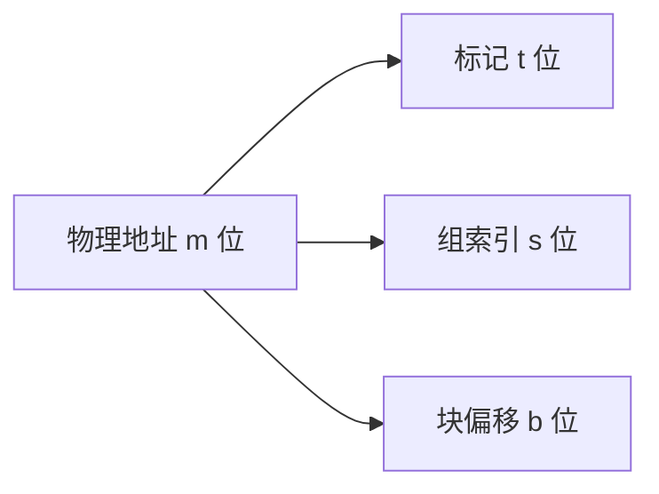
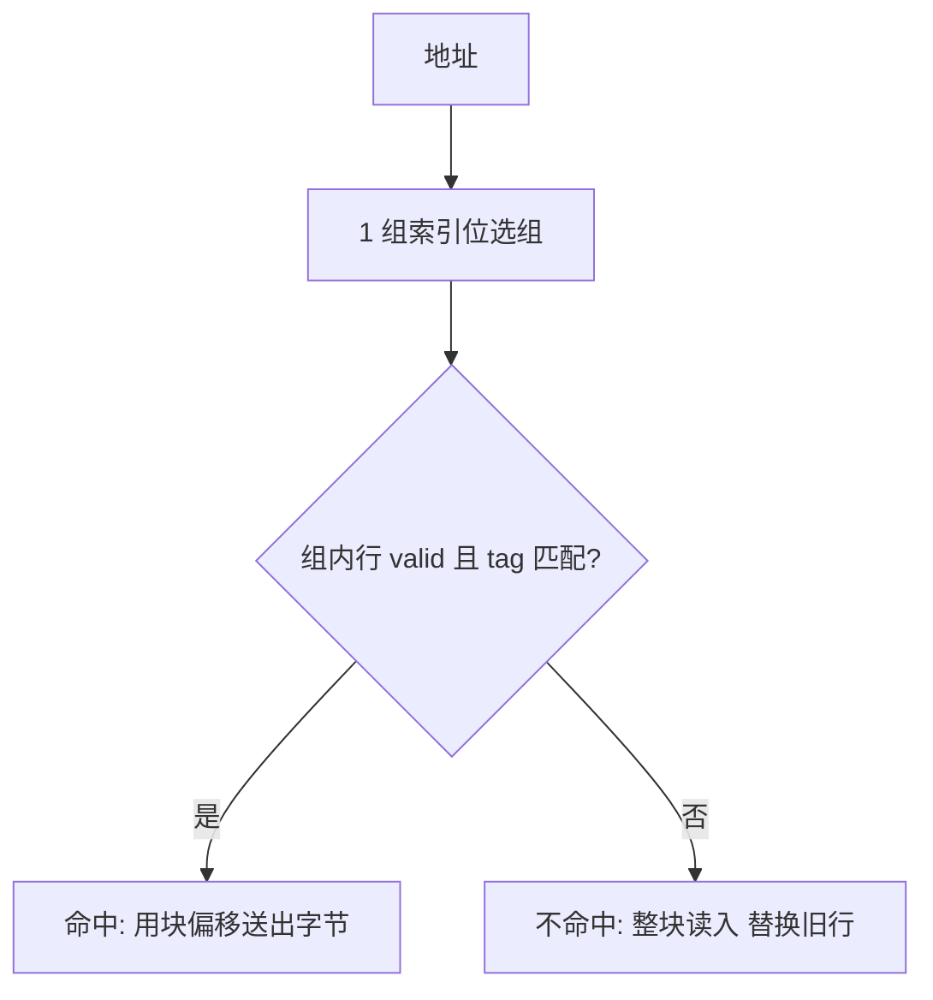

## 6.1 存储技术

### 6.1.1 随机访问存储器

**随机访问存储器（RAM）** 分两类（以字为单位读写,断电丢数据）:

| 特性 | SRAM（静态） | DRAM（动态） |
| --- | --- | --- |
| 存储单元 | 双稳态触发器（6 晶体管） | 电容充放（1 晶体管+1 电容） |
| 是否刷新 | 不需要 | 需要（~每 64ms 刷新抗漏电） |
| 速度 | 快 | 慢 |
| 造价 | 贵 | 便宜 |
| 用途 | 高速缓存（L1~L3） | 主存 |

- **传统 DRAM**:二维阵列,行/列地址分两次送（RAS/CAS）,**内存控制器（memory controller）** 桥接 CPU 与 DRAM。
- **增强型 DRAM**:SDRAM（同步）、DDR SDRAM（双倍数据率,DDR3/DDR4/DDR5,预取缓冲位数递增）等,通过"发一次地址读多个字"提高带宽。
- 非易失性存储:ROM、PROM、EPROM、EEPROM、**闪存（flash）**（固态硬盘与 EEPROM 的基础）。**固件（firmware）** 存于 ROM。

### 6.1.2 磁盘存储

**磁盘（disk）** 是容量大、便宜的持久存储:

- **盘片（platter）** 表面磁性材料,主轴旋转（转速 RPM,如 5400~15000）。
- **读写头（read/write head）** 在**传动臂（actuator arm）** 上径向移动;每个面一个磁头。
- **柱面（cylinder）**:所有盘片上同一位置的磁道集合。
- **扇区（sector）**:磁道分段,每个 512 字节~4KB,扇区间有间隙。**柱面×磁道×扇区**的编号经 CHS/LBA（逻辑块寻址）映射。
- **磁盘访问时间 = 寻道时间 + 旋转延迟 + 传送时间**;寻道（约几~十几 ms）与旋转（半圈均值）是大头。
- **格式化**建立逻辑块编号;磁盘控制器维护"逻辑块 ↔ 物理扇区"映射,并预留替换坏扇区的空闲扇区。

### 6.1.3 固态硬盘

**SSD（Solid State Disk）** = 闪存 + **闪存翻译层（FTL,相当于磁盘控制器）**:

- 读按页（page,~4KB~16KB）,写按页但**擦除按块**（block,~32~128 页）,写前必须先擦整个块,故写入放大存在。
- 机械硬盘 ~ms 级随机访问,SSD 随机读写 ~几十 µs（慢 100 倍于 DRAM 但快 1000 倍于机械盘）。
- 反复写会磨损闪存,FTL 做磨损均衡（wear leveling）。

### 6.1.4 存储技术趋势

- 三类技术:**机械/电力属性差异大**（DRAM 每位成本 ~SRAM 的 1/100~1/1000,磁盘更便宜）。
- 历史趋势:**密度（容量）增长快于延迟缩短**——"性能差距"逐年扩大:**CPU 与 DRAM、DRAM 与磁盘的速度鸿沟都在拉大**,缓存的重要性随之上升。
- 容量/速率的提升与延迟改善不成比例。

## 6.2 局部性

**局部性（locality）** 是层次结构能工作的根基:

- **时间局部性（temporal locality）**:被引用过的项,不久后大概率再次被引用（循环中的累加变量）。
- **空间局部性（spatial locality）**:被引用项的邻近项,大概率即将被引用（顺序扫描数组）。

```c
int sumarrayrows(int a[M][N]) {
    int i, j, sum = 0;
    for (i = 0; i < M; i++)
        for (j = 0; j < N; j++)
            sum += a[i][j];       /* 行主序顺序访问: 空间局部性好 */
    return sum;
}

int sumarraycols(int a[M][N]) {
    int i, j, sum = 0;
    for (j = 0; j < N; j++)
        for (i = 0; i < M; i++)
            sum += a[i][j];       /* 按列跳跃 N*4 字节: 局部性差 */
    return sum;
}
```

- 取指也有局部性（循环体反复执行 = 时间局部性;顺序执行 = 空间局部性）。
- **量化局部性**:不命中率为 1 步长 → 缓存行利用率;步长越大空间局部性越差。

## 6.3 存储器层次结构

### 6.3.1 存储器层次结构中的缓存

第 k+1 层存储器被分割为**块（block）**,第 k 层缓存其中一部分块:

- **缓存命中（hit）**:第 k 层有目标数据,直接快速返回。
- **缓存不命中（miss）**:从第 k+1 层取块放入第 k 层,**可能触发替换（evict）**——**替换策略**（如 LRU）决定牺牲块。

### 6.3.2 缓存命中

完全由硬件管理（对软件透明）,周期级完成。

### 6.3.3 缓存不命中

三类不命中:

- **冷（强制）不命中（cold miss）**:缓存空,首次访问必然不命中。
- **冲突不命中（conflict miss）**:受限于放置策略,同一位置的数据互相驱逐（即使缓存未满）。
- **容量不命中（capacity miss）**:工作集超过缓存容量。

放置策略:直接映射（块只能去唯一槽）、组相联（限某组内任意行）、全相联（任意位置）。

### 6.3.4 缓存管理

寄存器间的传送由编译器管理;L1~L3 由硬件管理;虚拟内存（主存作磁盘缓存）由硬件 + OS 协同管理;浏览器/CDN 是分布式的缓存层次。

## 6.4 高速缓存存储器

### 6.4.1 通用的高速缓存存储器结构

地址划分（$m$ 位物理地址,$S = 2^s$ 组,$E$ 行,$B = 2^b$ 字节块）:



每行含:**有效位（valid bit） + 标记（tag） + 数据块（B 字节）**。参数关系:$C = S \times E \times B$（总容量,不含 tag/valid 开销）。

### 6.4.2 直接映射高速缓存

**每个组只有 1 行（E=1）**,组索引直接定位:



- 命中判断:行有效 && tag 相等。
- **字选择**:块偏移在块内选字节。
- **冲突不命中的典型案例**:交替访问 x[0] 与 y[0],两数组同列映射同组,命中率 0%（原书的抖动示例）;对齐/填充（在结构中加 padding）使其错开即可解决。
- **缓存大小 vs 索引**:地址中组索引位数不含最低 b 位（块偏移）。

### 6.4.3 组相联高速缓存

每组 E > 1 行（常见 2、4 路）:组内任一行可放,替换用 LRU 类策略（FIFO/LFU/随机）。硬件复杂度:需要**多路比较器**并行匹配。

### 6.4.4 全相联高速缓存

只有一个组（S=1）,任意行放置,只适合小缓存（如 TLB）。

### 6.4.5 有关写的问题

写命中后如何处理:

- **直写（write-through）**:立刻写下一层 + 配写缓冲（write buffer）避免等待。
- **写回（write-back）**:改本层,标记**脏位（dirty bit）**,被替换时才写下一层。要求更多控制逻辑,但带宽利用高（多次写只回写一次）。

写不命中:

- **写分配（write-allocate）**:先把块调入缓存再写（常配合写回）。
- **非写分配（no-write-allocate）**:直接写下一层（常配合直写）。

典型组合:缓存内写回 + 写分配;直写 + 非写分配。

### 6.4.6 一个真实的高速缓存层次结构的解剖

Intel Core i7 高速缓存层次（概念示例）:L1 i-cache/d-cache（每核 32KB,8 路）、L2 统一（256KB,8 路）、L3 统一（共享,~8MB,16 路）;所有 L3 下的访问经过**点对点链接**的核间互联。**i-cache 与 d-cache 分离**的动机:指令与数据的访问模式不同,并行取指与取数。

### 6.4.7 高速缓存参数的性能影响

指标:**不命中率 = 1 − 命中率;命中率;平均访问时间 = 命中时间 + 不命中率 × 不命中代价**。

参数影响:

- **C（容量）↑**:容量不命中 ↓ 但命中时间 ↑、成本 ↑;
- **E（相联度）↑**:冲突不命中 ↓ 但命中时间与功耗 ↑;
- **B（块大小）↑**:空间局部性利用 ↑（命中率先升）,但不命中代价 ↑、冲突可能 ↑（块数减少）。

## 6.5 编写高速缓存友好的代码

基本方法:

1. **让最常见的情况跑得快**:聚焦核心循环;
2. **每个引用的局部性最大化**:步长为 1 的顺序访问最好,数据在寄存器/缓存中尽量复用（时间局部性）;
3. **反复引用变量在寄存器/缓存中**（如累积变量）;
4. **以步长 1 的模式访问存储器**（顺序遍历）。

原书示例:多次循环单次访问 vs 单次循环多次访问——后者反复命中同一缓存块,更快。

## 6.6 综合:高速缓存对程序性能的影响

### 6.6.1 存储器山

**存储器山（memory mountain）**:测出"读吞吐量（带宽）关于步长 × 工作集大小"的立体地形图:

- 越小工作集 → 越高带宽（L1 顶部）;步长越大 → 带越窄（空间局部性损失）。
- 谷:相联度导致的冲突不命中。

一个系统的"读性能"完整的表述是这座山,程序性能取决于它在山上的位置。

### 6.6.2 重新排列循环以提高空间局部性

多维数组访问顺序决定缓存利用率:

```c
/* 好: 内层按行顺序 */
for (i = 0; i < N; i++)
    for (j = 0; j < N; j++)
        c[i][j] += a[i][k] * b[k][j];

/* 差: 内层跳跃访问 b 的列 */
```

矩阵乘法的**分块（tiling/blocking）**:把大矩阵分成 cache 友好的子块逐块计算,提高每块的复用次数（时间局部性）,大幅减少不命中。

### 6.6.3 在程序中利用局部性

- 把注意力集中在**内层循环**——绝大多数计算与访存发生在这里;
- **按数据在内存中的存储顺序（行主序）访问**;
- 一旦数据被读入,尽可能多复用;
- 理解存储器山,在算法设计中考虑工作集大小与步长。

## 6.7 小结

- 存储技术:SRAM 快而贵（DRAM 与磁盘便宜而慢）,速度鸿沟仍在扩大;
- 层次结构靠**局部性**弥合差距:缓存命中/不命中、三类不命中;
- 高速缓存由 S/E/B 三参数定义:直接映射/组相联/全相联各有取舍;
- 程序员通过**顺序访问、提高局部性、分块**可以直接控制程序速度的量级差异——这是不换硬件、不改算法也能"白拿"的性能。
