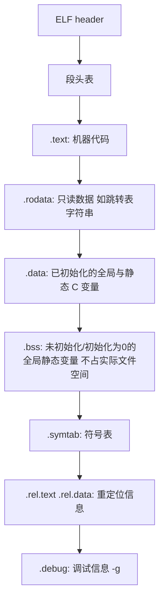
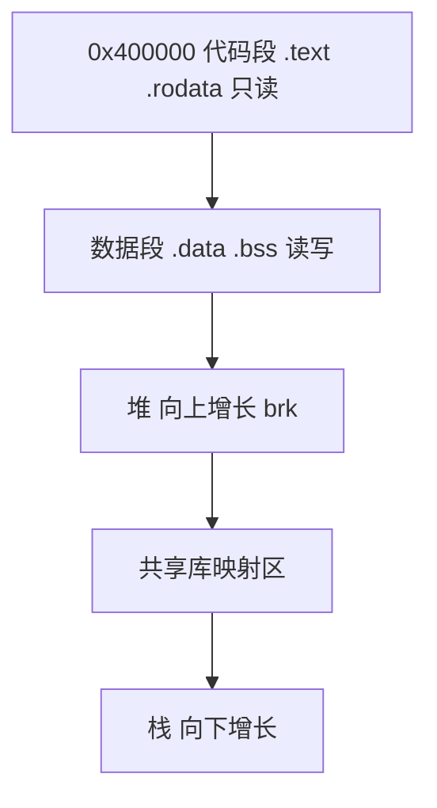

## 7.1 编译器驱动程序

**编译器驱动程序（compiler driver）**（gcc）按四步把源文件变成可执行文件:

```bash
gcc -Og -o prog main.c swap.c
# 实际过程:
cpp  main.c main.i        # 预处理
cc1  main.i  main.s       # 编译成汇编
as   main.s  main.o       # 汇编成可重定位目标文件
# 对 swap.c 同样处理, 然后:
ld   main.o swap.o -o prog  # 链接(含系统目标文件与 C 标准库)
```

运行 `./prog` 时,shell 调用操作系统的**加载器（loader）** 把可执行文件复制进内存并跳到入口点。

## 7.2 静态链接

**静态链接器（static linker）** 以一组**可重定位目标文件（relocatable object file）** 与命令行参数为输入,生成完全链接的、可加载运行的可执行文件。链接器两大任务:

- **符号解析（symbol resolution）**:每个符号（函数、全局变量、静态变量）对应一个定义,解析各处引用;
- **重定位（relocation）**:编译器汇编时地址从 0 开始,链接器把每个符号定义与内存位置绑定,再修改所有对这些符号的引用使其指向该位置。

## 7.3 目标文件

三种形式:

- **可重定位目标文件**:含二进制代码与数据,可与其他文件合并成可执行文件;
- **可执行目标文件**:可直接复制进内存执行;
- **共享目标文件**:特殊的可重定位文件,加载或运行时动态加载进内存。

Linux 用 **ELF（Executable and Linkable Format）**（Windows 用 PE,Mac 用 Mach-O）。

## 7.4 可重定位目标文件

ELF 可重定位文件的典型节（section）:



- **.bss（Better Save Space）**:未初始化的全局/静态变量在目标文件中只记录**大小**,运行时在内存中占位为零——不占文件空间。
- 局部（非 static）变量在栈上,与符号表无关。
- `readelf -a` / `objdump -dx` 可查看各节。

## 7.5 符号和符号表

汇编器给链接器的符号分三类:

1. **全局链接器符号**:本模块定义、可被其他模块引用（非 static 函数与全局变量）;
2. **外部符号**:本模块引用、别处定义（`extern`）;
3. **本地符号**:本模块定义且独占（static 函数与全局变量）。

.symtab 表项含 name、size、type、binding、value（相对节的偏移）、section 等字段。**局部符号 ≠ 局部变量**——自动变量从不出现在符号表。

## 7.6 符号解析

链接器按**名字**精确匹配符号（C++/Java 用**名字修饰（mangling）** 支持重载,C 用编译器约定如 `__` 前缀等）。

多重定义的处理:编译器向汇编器输出全局符号,**函数与已初始化全局变量是强符号,未初始化全局变量是弱符号**,链接器规则:

1. 多个强符号 → **错误**;
2. 一个强 + 若干弱 → 选强;
3. 只有弱 → 任选一个（通常最大的分配）。

经典暗坑:

```c
/* foo.c */ int x;  /* 弱 */
/* bar.c */ int x = 1; /* 强: 链接后 x 共享同一内存! */
/* 更隐蔽: foo.c 定义 int x; bar.c 定义 double x; 类型不同也静默合并, 值被互相破坏 */
```

防御:**全局变量加 extern 声明或初始化为强符号;开 -fno-common/-Werror**（GCC 10 起默认多重定义报错）。

与静态库链接:`.a` 文件是一组可重定位文件的归档（ar 打包）:

- 链接器按**命令行顺序**扫描 .o 与 .a,**维护三个集合:未解析的符号、已定义的符号、已加入的目标文件**;
- .a 中只有"能解析当前未解析符号"的成员才会被抽取;
- 顺序规则:**库放在命令行末尾;相互依赖的库按依赖顺序排**（libx 依赖 liby 则 -lx -ly）。`gcc foo.c ./libfoo.a -o foo` 而非把 .a 放前面。

## 7.7 重定位

完成符号解析后进入重定位:

- **重定位节与符号定义**:把所有同类型节合并,给运行时内存地址;
- **重定位节中的符号引用**:修改 .text/.data 中对符号的引用。

汇编器遇到未知地址符号时生成**重定位条目**（`.rel.text`/`.rel.data`）,两种基本类型:

- **R_X86_64_PC32**:32 位 **PC 相对地址**重定位（4 字节,常见于 call/jump 与 RIP 相对引用）;
- **R_X86_64_64**:64 位绝对地址重定位（8 字节,如 movq 立即数形式的地址）。

重定位公式（PC 相对）:`REFADDR = 重定位后该引用处的地址;*ref += (S + A) - PC`——S 是符号运行时地址,A 是编译期已写入的加数（-4 之类）,PC 是引用点地址。x86-64 的 call 指令因此**天然位置无关**（代码段可整体搬移）。

## 7.8 可执行目标文件

可执行 ELF 与可重定位文件类似,但**已完全重定位**（无 .rel 节）、多出**入口点（_start）** 与 **.init** 节;**程序头表（program header table）** 描述运行时内存映像（哪些段、权限、对齐）。段（segment）是运行时加载单位,节（section）是链接单位。

## 7.9 加载可执行目标文件

shell 下运行 ./prog:

1. fork 出子进程,execve 调用加载器;
2. 加载器在**虚拟地址空间**创建内存映像:代码段从 **0x400000**（x86-64 默认）开始,数据段紧随其后（含运行时堆,按页对齐）,栈在高地址;
3. 跳到 **_start → __libc_start_main → main**,程序开始执行。



## 7.10 动态链接共享库

**共享库（shared library, Linux .so / Windows .dll）**:

- 链接时不复制库代码,只记录依赖;**加载时/运行时**由**动态链接器（ld-linux.so）** 完成剩余重定位;
- 库代码在内存中**只有一份**,被所有进程共享（代码段只读共享,数据段各进程私有 COW）;
- 便于**bug 修复与升级**而不必重新链接所有程序。

```bash
gcc -shared -fpic -o libvector.so addvec.c multvec.c   # 建共享库(-fpic 生成位置无关代码)
gcc -o prog main.c ./libvector.so                       # 链接共享库
```

加载时动态链接:加载器发现 .interp 节（PINTERP）,先加载并运行动态链接器;链接器完成符号解析后把控制交给 main。

## 7.11 从应用程序中加载和链接共享库

运行时显式加载:

```c
#include <dlfcn.h>

void *handle = dlopen("./libvector.so", RTLD_LAZY);  /* 打开共享库 */
void (*addvec)(int *, int *, int) = dlsym(handle, "addvec"); /* 取符号 */
int rc = dlclose(handle);                            /* 卸载 */
```

应用:**分发软件插件**、构建高性能 Web 服务器（运行时按需加载模块）、浏览器的第三方扩展。

## 7.12 位置无关代码

**PIC（Position-Independent Code,位置无关代码）**:可加载到内存任意位置而无须修改的代码,是现代共享库的基础。GOT/PLT 机制（概念）:


- **GOT（Global Offset Table）**:.data 节中的指针数组,运行时**间接**解析数据/函数地址——**代码本身不含绝对地址,共享库代码段在所有进程间完全共享**;
- 惰性绑定:函数首次被调用时才由动态链接器解析地址（加快启动）;
- 库打桩（见 7.13）与运行时二进制分析常利用 GOT/PLT 结构。

## 7.13 库打桩机制

**库打桩（interpositioning）**:截获对共享库函数的调用,执行自己的版本。C 原理:链接符号解析的时机可被打断:

- **编译时打桩**:`-D` 宏替换（如 `#define malloc(size) my_malloc(size)`,用 __LINE__/__FILE__ 记录）;
- **链接时打桩**:`--wrap f` 符号改写,`__wrap_f` 接管、`__real_f` 调真实函数;
- **运行时打桩**:`LD_PRELOAD` 环境变量让动态链接器**优先**加载打桩库,同符号优先解析为打桩版本（需 -fpic）。

典型用途:内存泄漏追踪、调试统计、行为监控。

## 7.14 处理目标文件的工具

| 工具 | 用途 |
| --- | --- |
| `ar` | 创建静态库（.a） |
| `strings` | 列出目标文件中的可打印字符串 |
| `strip` | 从目标文件删除符号表信息 |
| `nm` | 列出目标文件的符号表 |
| `size` | 列出节的名字与大小 |
| `readelf` | 显示目标文件完整结构（ELF 专用） |
| `objdump` | 反汇编（-d）/显示全部信息（-x） |
| `ldd` | 列出可执行文件依赖的共享库 |

## 7.15 小结

- 链接 = 符号解析 + 重定位;ELF 把重定位信息显式存于 .rel 节;
- 静态库按命令行顺序解析;强弱符号规则解释"多重定义"的诡异行为;
- 共享库 + PIC 实现代码共享与运行时加载（dlopen/dlsym）;
- 链接知识直接对应实战:静态库顺序问题、重复符号、打桩调试、库的 ABI 管理。
