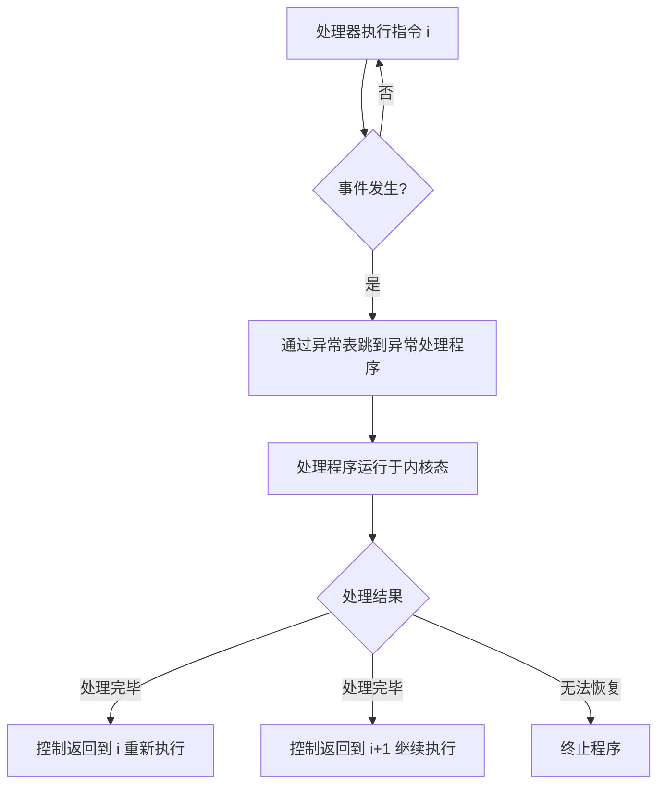

## 8.1 异常

**异常（exception）** 是异常控制流（Exceptional Control Flow,ECF）的一种形式,**一部分由硬件实现、一部分由操作系统实现**:

> An exception is an abrupt change in the control flow, which occurs as a response to some change in the processor's state.
>
> 异常就是控制流中的突变,用来响应处理器状态中的某些变化。

状态变化称为**事件（event）**:虚拟内存缺页、除零、syscall 请求、外部 I/O 完成等。



- **异常表（exception table）**:每种事件一个编号 k,表项 k 指向处理程序地址;**异常表基址寄存器**指向该表。
- **异常处理程序运行在内核态**。

### 8.1.1 异常处理

系统启动时 OS 初始化异常表;异常处理后返回的三种路径:返回当前指令 / 返回下一条指令 / 终止。

### 8.1.2 异常的类别

| 类别 | 原因 | 同步/异步 | 返回行为 |
| --- | --- | --- | --- |
| **中断（interrupt）** | 来自 I/O 设备的信号 | 异步 | 总是返回下一条 |
| **陷阱（trap）** | 有意的**系统调用** | 同步 | 总是返回下一条 |
| **故障（fault）** | 潜在可恢复的错误（缺页） | 同步 | 可能重新执行当前指令 |
| **中止（abort）** | 不可恢复的错误 | 同步 | 不返回 |

- **中断**异步:处理器**在指令之间**轮询中断引脚,响应后返回"下一条"继续。
- **陷阱**:用户程序 `syscall n` 请求服务（read/fork/execve...）,处理程序返回下一条——像"落入陷阱再爬出来"。
- **故障**:处理程序若能修正（如缺页:把页调入后）**重新执行当前指令**;不能（如无效地址访问）**转 abort 例程终止**。
- **中止**:硬件级致命错误（如 DRAM 奇偶校验错）。

### 8.1.3 Linux/x86-64 系统中的异常

常见例子:

- **除法错误（故障,编号 0）**:除零/溢出 → 默认 **SIGFPE** 终止。
- **一般保护故障（编号 13）**:引用未定义内存区域 → **SIGSEGV（segmentation fault）**,shell 显示 "Segmentation fault"。
- **缺页（故障）**:地址翻译命中无效页表项 → 内核调入页面后重启指令;不能恢复则 SIGSEGV。
- **机器检查**:硬件故障,不返回。
- **系统调用**:C 库封装（read/write/fork/execve...）内部 syscall 指令。x86-64 系统调用号在 %rax,参数在 %rdi/%rsi/%rdx,返回值负值（−1 ~ −4095 范围）表示错误（errno）。

## 8.2 进程

**进程**是程序执行的实例,ECF 提供的两个抽象:

### 8.2.1 逻辑控制流

程序计数器序列叫**逻辑控制流（logical control flow）**。并发流并发运行在"同一时间段",交错执行;单核上的并发其实是**多路复用**——一个进程的指令与另一个交错。

### 8.2.2 私有地址空间

进程的内存映像独立,不能读写他进程内存（**内核内存与共享内存例外**）。

### 8.2.3 用户模式和内核模式

- **模式位（mode bit）**:控制寄存器,决定进程权限。
- 用户模式不能执行**特权指令**（停机、模式切换、页表修改）,不能直接引用内核区内存。
- 进入内核的唯一途径:**异常（系统调用/中断/故障）**。处理程序在内核态运行,返回时重置为用户态。
- Linux 的 /proc 文件系统允许用户模式进程读内核数据结构。

### 8.2.4 上下文切换

**上下文切换**由**调度器（scheduler）** 决定:保存当前进程上下文、恢复新进程上下文。引发切换的场景:系统调用（sleep/read 等阻塞型）、中断（定时器）。

## 8.3 系统调用错误处理

Unix 系统调用出错时返回 −1 并设 **errno**。健壮代码必须检查:

```c
#include <unistd.h>
#include <errno.h>
#include <stdio.h>

void unix_error(char *msg) {   /* 经典包装: 报错并退出 */
    fprintf(stderr, "%s: %s\n", msg, strerror(errno));
    exit(0);
}
/* 用法 */
if ((pid = fork()) < 0)
    unix_error("fork error");
```

更高层用包装函数（Fork（）/Waitpid（） ...）简化错误处理（CSAPP 附录的 csapp.c 风格）。

## 8.4 进程控制

### 8.4.1 获取进程 ID

```c
pid_t getpid(void);   /* 当前进程 PID（Process Identifier,进程标识符） */
pid_t getppid(void);  /* 父进程 PID */
```

### 8.4.2 创建和终止进程

进程三状态:**运行、停止（挂起）、终止**。fork 创建新运行的子进程:

```c
#include <unistd.h>
#include <stdio.h>

int main() {
    pid_t pid = fork();
    if (pid == 0) {
        printf("子进程: pid=%d ppid=%d\n", getpid(), getppid());
    } else {
        printf("父进程: pid=%d 子进程pid=%d\n", getpid(), pid);
    }
    return 0;
}
```

- **子进程获得与父进程相同的（但独立的）用户级虚拟地址空间副本**:相同的代码与数据、堆、共享库、用户栈,**但独立**。
- **最大区别:返回值不同**——父进程得到子进程 PID,子进程得到 0。
- **fork 调用一次,返回两次**。父/子执行顺序与 CPU 调度有关（输出顺序不确定,printf 缓冲影响输出位置）。

进程终止:main 返回 / exit（刷新缓冲、关闭 fd） / 异常（信号）。**子进程被父进程回收或过继给 init（PID 1）**。

### 8.4.3 回收子进程

- 终止但未回收的进程 = **僵尸进程（zombie）**:保留 PID 与退出状态,等父进程 **waitpid** 查询。
- 父进程先终止:内核把子进程**过继给 init 进程**并由其回收。

```c
pid_t waitpid(pid_t pid, int *statusp, int options);
/* pid > 0 等待指定子进程; -1 任意子进程 */
/* options: WNOHANG 立即返回0若无终止子进程; WUNTRACED 挂起也报告; WCONTINUED */
/* statusp: WIFEXITED/WEXITSTATUS/WIFSIGNALED/WIFSTOPPED 宏解析 */
```

```c
/* 简化的 wait: 等任意子进程 */
pid_t wait(int *statusp);

/* 逐个回收所有子进程的惯用法 */
while ((pid = waitpid(-1, &status, 0)) > 0) {
    if (WIFEXITED(status))
        printf("子进程 %d 正常退出 %d\n", pid, WEXITSTATUS(status));
}
```

### 8.4.4 让进程休眠

```c
sleep(unsigned int secs);   /* 返回剩余未睡秒数(被信号打断时) */
pause(void);                /* 永远休眠直到收到信号 */
```

### 8.4.5 加载并运行程序

**execve** 在当前进程中加载并运行新程序（**不新建进程**,PID 不变,覆盖原代码/数据/堆/栈）:

```c
int execve(const char *filename, char *const argv[],
           char *const envp[]);
/* argv[0] 是程序名, 以 NULL 结尾; envp 是环境变量数组 */
/* 成功则不返回, 失败返回 -1 */
```

- 新程序栈的布局:栈顶是 envp/argv 指针数组（逆序存放,以 NULL 结束）、main 的参数由此构造;
- **environ 全局变量 / getenv/setenv/unsetenv** 操作环境;
- execve 一次调用（成功）不返回。

### 8.4.6 利用 fork 和 execve 运行程序

shell 的本质:读命令行 → fork 子进程 → 子进程 execve 新程序;父进程 waitpid 回收。**fork + execve 的组合**是 Unix 进程模型的基石——在两者之间可以改环境（重定向 dup2、信号处理）,这正是 shell 实现管道/重定向的方式。

## 8.5 信号

### 8.5.1 信号术语

**信号（signal）** 是一条小消息,通知进程发生了某种事件（软件形式的"异常"）:

- **发送信号**:内核检测到事件（除零、子进程终止、定时器到期）或进程显式 kill/raise。
- **接收信号**:进程被内核**强制**陷入信号处理逻辑:默认行为 / 忽略 / **捕捉（注册处理程序 handler）**。
- 待处理（pending）、阻塞（blocked）:被阻塞的待处理信号**只保留一个**（同类型不排队）。

### 8.5.2 发送信号

```c
kill(pid_t pid, int sig);      /* pid>0 发给进程; 0 同进程组; -1 所有(权限内) */
unsigned int alarm(unsigned int secs);  /* 定时给自己发 SIGALRM, 返回上次剩余秒 */
```

/bin/kill 程序、Ctrl-C（SIGINT）、Ctrl-Z（SIGTSTP）是常用触发方式。

### 8.5.3 接收信号

信号到达时内核把控制交给 p -> **处理程序**,运行后返回"被打断的指令处"继续:

```c
handler_t *signal(int signum, handler_t *handler);
/* handler: SIG_IGN 忽略 / SIG_DFL 默认 / 自定义函数 */
```

```c
#include <signal.h>
#include <stdio.h>
#include <stdlib.h>

void sigint_handler(int sig) {          /* 信号处理程序 */
    printf("Caught SIGINT!\n");
    exit(0);
}

int main() {
    signal(SIGINT, sigint_handler);     /* 注册 */
    pause();                            /* 等待信号 */
    return 0;
}
```

### 8.5.4 阻塞和解除阻塞信号

- **隐式阻塞**:当前处理 SIGs 时同类新信号待处理不接收。
- **显式阻塞**:`sigprocmask` 操作 **blocked 位向量**:

```c
sigset_t mask, prev_mask;
sigemptyset(&mask);
sigaddset(&mask, SIGINT);
sigprocmask(SIG_BLOCK, &mask, &prev_mask);   /* 阻塞 SIGINT */
/* ... 临界区 ... */
sigprocmask(SIG_SETMASK, &prev_mask, NULL);  /* 恢复 */
```

### 8.5.5 编写信号处理程序

处理程序与主程序**并发**运行,共享全局变量,安全原则:

- 处理程序**尽可能简单**（设全局标志立即返回）;
- 处理程序中只调用**异步信号安全**的函数（write、_exit 等;printf/malloc 不安全）;
- **保存与恢复 errno**;
- 访问共享全局变量时用 `volatile`（防止编译器缓存到寄存器）;
- 多字共享数据用 `sig_atomic_t` 或阻塞信号保护。

正确的 sigwait/sigsuspend 模式可用于同步等待信号。

### 8.5.6 同步流以避免讨厌的并发错误

经典竞态:父进程注册 SIGCHLD 处理程序前子进程已终止;或删除作业列表与信号处理修改列表的交错竞争。解法:**在操作 jobs 相关数据前阻塞 SIGCHLD,操作完再恢复**（fork 前阻塞、处理完恢复的固定套路）。

## 8.6 非本地跳转

**非本地跳转（nonlocal jump）** 通过 setjmp/longjmp 直接从一个函数跳到另一个（不经过正常调用/返回）:

```c
#include <setjmp.h>

sigjmp_buf buf;
int rc = setjmp(buf);          /* 1. 调用一次或多次返回: 首次返回 0 */
/* ... 深层调用中出错时: */
siglongjmp(buf, 1);            /* 2. 直接跳回 setjmp 处, 返回 1 */
```

- setjmp 保存调用环境（寄存器、栈指针、PC）;longjmp 恢复并跳回。
- 用途:C 错误处理"一步回到顶层";信号版 sigsetjmp/siglongjmp 用于信号处理中跳出深层嵌套。
- **限制**:longjmp 目标函数若已返回（栈帧不在了）→ 未定义行为,灾难性后果。

## 8.7 操作进程和信号的工具

| 命令/系统调用 | 用途 |
| --- | --- |
| `ps` | 查看进程（ STAT 状态 S/Z/T...） |
| `top` | 实时资源占用 |
| `/proc` 文件系统 | 导出内核进程结构（如 /proc/loadavg） |
| `strace` | 打印系统调用轨迹（调试神器） |
| `pmap` | 进程内存映射 |

## 8.8 小结

- ECF 无处不在:异常（硬件+内核）、进程上下文切换、信号、非本地跳转。
- 异常四分类（中断/陷阱/故障/中止）与"返回行为"是分析核心;系统调用即陷阱。
- fork 一次调用两次返回、execve 不返回、waitpid 回收僵尸——进程三件套;
- 信号是异步 ECF,处理程序须按"并发代码"标准编写（安全函数、volatile、阻塞保护）。
