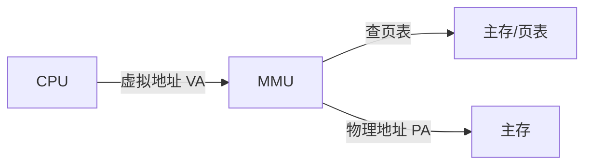
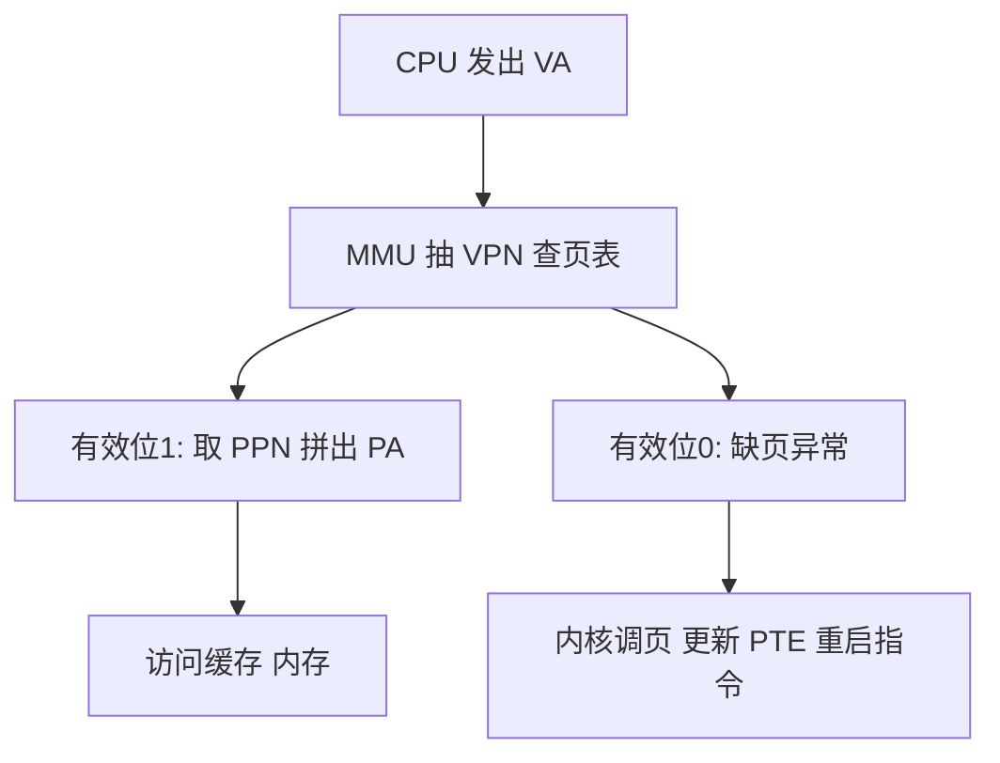

## 9.1 物理和虚拟寻址

- **物理寻址（physical addressing）**:早期 PC 直接用物理地址访问主存。
- **虚拟寻址（virtual addressing）**:CPU 生成**虚拟地址（virtual address,VA）**,经 **MMU（内存管理单元）** 的地址翻译转换为**物理地址（physical address,PA）**。



## 9.2 地址空间

- **地址空间（address space）**:非负整数地址的有序集合;线性地址空间 = $\{0, 1, ..., N-1\}$ 的连续整数集合,N = 2^n。
- n 位地址空间含 $2^n$ 个地址;虚拟地址空间大小由**字长**决定。
- **主存每字节有唯一物理地址**,构成物理地址空间。

## 9.3 虚拟内存作为缓存的工具

VM 思想:虚拟页（VPN）是磁盘块,**DRAM 作缓存**:

- 虚拟页面集合分三种:**未分配**（无数据）、**缓存在 DRAM**、**未缓存在 DRAM**（在磁盘）。
- DRAM 比 SRAM 慢约 10 倍,磁盘比 DRAM 慢约 100000 倍 → **缺页代价巨大**,页面通常较大（4KB~2MB）,DRAM 全相联组织。

### 9.3.1 DRAM 缓存的组织结构

全相联 + 精心替换策略（近似 LRU,考虑脏页写回代价）。

### 9.3.2 页表

**页表（page table）**:常驻物理内存（本身也是页）,由 OS 与 MMU 共同维护,是"虚拟页 → 物理页"的映射数据结构。每个进程一个页表。

页表项（PTE）含**有效位 + 地址**:有效位 1 → 后面是 DRAM 中物理页号（命中）;有效位 0 → 空地址（未分配）或磁盘地址（未缓存）。

### 9.3.3 页命中、缺页

- **页命中**:PTE 有效位为 1,MMU 直接翻译,纯硬件完成;
- **缺页（page fault）**:PTE 无效 → 触发**缺页异常**,内核**缺页处理程序**:
  1. 选牺牲页（近似 LRU）;
  2. 若脏则写回磁盘;
  3. 调入新页到 DRAM,更新 PTE;
  4. **重新执行缺页指令**（故障类异常）——这次命中。

按需调页（demand paging）+ 局部性:工作集装进内存后,缺页率骤降,"DRAM 当磁盘缓存"的性能幻觉成立——**抖动（thrashing）**:工作集超内存,反复缺页,性能崩溃。

## 9.4 虚拟内存作为内存管理的工具

多进程共享少量物理内存,OS 提供统一假象:

- **简化链接**:每个进程独立统一地址空间,链接器无须关心物理布局;
- **简化加载**:加载器只分配页表、标记"未缓存",首次访问才真正调入（快速启动）;
- **简化共享**:代码段（如 libc）在物理内存只一份,多进程页表映射到同一物理页;
- **简化内存分配**:malloc 一段连续虚拟页,物理页可不连续。

## 9.5 虚拟内存作为内存保护的工具

PTE 增加权限位:**READ/WRITE/EXEC 与 SUP（Supervisor,内核态才可访问）**,非法访问触发**保护故障（segmentation fault）**。

## 9.6 地址翻译

符号:$\text{VA} = \text{VPN} \cdot \text{页大小} + \text{VPO}$;PTE 索引 = VPN;$\text{PA} = \text{PPN} \cdot \text{页大小} + \text{PPO}$（VPO = PPO 页内偏移不变）。

**页表基址寄存器（PTBR）** 指向当前进程页表;切换进程 = 切换 PTBR（上下文切换的一部分）。

页命中（无 TLB 时）的完整流程:



注意:**每次内存翻译本身又要访问一次内存（读页表）** —— 需要加速。

### 9.6.1 用 TLB 加速地址翻译

**TLB（translation lookaside buffer,翻译后备缓冲）**:MMU 内的 SRAM 高速缓存,缓存 PTE（全相联/组相联）。VPN 切成 **TLB 标记（TLBT）+ TLB 索引（TLBI）**,命中则**无须访问内存中的页表**;多级命中路径:TLB → 页表 → 缺页处理。

### 9.6.2 多级页表

64 位虚拟地址空间单级页表荒谬巨大（512GB 仅为页表数组）。**多级层次**:

- 一级页表（常驻）的 PTE 指向二级页表;**未使用区域的一级 PTE 为空,不分配下级页表** → 稀疏地址空间只占用实际使用的页表内存;
- x86-64 采用 **4 级页表**（9+9+9+9 位 VPN + 12 位偏移,48 位有效地址;新 CPU 支持 57 位 5 级分页）。

### 9.6.3 综合:端到端的地址翻译

真实系统（Core i7 概览）:VA 经 TLB/L1~L4 页表翻译;PTE 含 RWX 权限位、U/S 位、accessed/dirty 位;**Linux 维护 PGD/PUD/PMD/PTE 四级页表,每级用 9 位索引、页大小 4KB**。案例演示:给定 VA 与页表内容,逐级抽取索引得到 PA。

## 9.7 案例研究:Linux/x86-64 内存系统

Linux 实际组织（概念）:

- 每进程独立**页表结构**,task_struct 中 mm_struct 指向 pgd（全局页目录）;
- 内核虚拟内存:内核代码/数据 + **vm_area_struct 链表描述的进程映射区域**;
- /proc/self/maps 可查看进程内存布局。

## 9.8 内存映射

**内存映射（memory mapping）**:把虚拟内存区域与磁盘文件/匿名对象关联:

- **区域（struct vm_area_struct）**:已映射的连续虚拟页区间（读写权限、共享/私有）;
- 私有对象写时复制（**copy-on-write,COW**）:fork 时父子共享物理页,标记只读,写时才复制——**fork 快、共享省**;
- execve 用映射加载可执行文件;dup 之后 mmap 的区域在进程间共享。

`mmap/munmap` 系统调用可手动建立/删除映射:

```c
void *mmap(void *start, size_t length, int prot, int flags,
           int fd, off_t offset);
/* prot: PROT_READ/WRITE/EXEC/NONE; flags: MAP_SHARED/MAP_PRIVATE */
munmap(start, length);
```

## 9.9 动态内存分配

### 9.9.1 malloc 和 free 函数

```c
#include <stdlib.h>
void *malloc(size_t size);        /* 成功返回指针 不初始化; 失败 NULL */
void free(void *ptr);             /* ptr 必须来自 malloc/calloc/realloc */
```

- 相关: calloc（清零）、realloc（扩缩）、sbrk（内核级 brk 调整堆尾,分配器底层手段）。
- 分配器管理**堆（heap）**:连续虚拟内存区间,从**分配器视角**（而非 OS）管理空闲块。

### 9.9.2 为什么要使用动态内存分配

某些数据结构运行时才知道大小;局部/全局数组大小固定,堆分配灵活（链表、树、动态字符串）。

### 9.9.3 分配器的要求和目标

- 要求:处理任意请求序列、立即响应（不重排/拷贝已分配块）、对齐（16 字节）、只操作自有内存;
- 目标:**吞吐率**（每秒操作数）与**内存利用率**（峰值使用比例）$U_k = \frac{\text{有效载荷峰值}}{\text{堆大小}}$——两者有张力。

### 9.9.4 碎片

- **内部碎片（internal fragmentation）**:块本身大于载荷（对齐/最小块限制）,已分配无法利用;
- **外部碎片（external fragmentation）**:空闲内存总量够,但碎片分散不连续,无法满足大请求。

### 9.9.5 隐式空闲链表

块格式（隐式链表:用块头部 size 字段即可遍历）:


- 头部:size（含头） + 低位 3 位中 1 位是 allocated 标记;
- 遍历 = "跳 size 字节",故称隐式;**分配与释放都与堆块数成线性关系**。

### 9.9.6 放置分配的块

放置策略:**首次适应（first fit）**、**下一次适应（next fit）**、**最佳适应（best fit）**——first fit 简单但碎（头部积累小碎片）,best fit 碎片小但搜索慢,next fit 快但碎片更糟。

### 9.9.7 分割空闲块

找到过大的空闲块 → 分割（留剩余空闲块）,减少内部碎片;也可整块分配（简单,内部碎片）。

### 9.9.8 获取额外的堆内存

找不到合适空闲块 → sbrk 扩堆;新内存并入空闲链表再重试。

### 9.9.9 合并空闲块

free 相邻块应**合并（coalescing）**,否则出现**假碎片**（两个相邻空闲块却无法满足请求）。

### 9.9.10 带边界标记的合并

**边界标记（footer,又称幻数/脚部）**:块尾复制头部,free 时可**O（1） 判断前一块**是否空闲并合并。优化:**只有前一块空闲才需要 footer**（分配时给下一块埋"本块已分配"标记）,配合位运算可省去已分配块的 footer 开销。

### 9.9.11 综合:实现一个简单的分配器

经典设计（原书 mm.c）:隐式链表 + 边界标记 + first fit + 立即合并:

```c
#define WSIZE 4
#define PACK(size, alloc) ((size) | (alloc))
#define GET(p)       (*(unsigned int *)(p))
#define PUT(p, val)  (*(unsigned int *)(p) = (val))
#define GET_SIZE(p)  (GET(p) & ~0x7)
#define GET_ALLOC(p) (GET(p) & 0x1)
#define HDRP(bp) ((char *)(bp) - WSIZE)
#define FTRP(bp) ((char *)(bp) + GET_SIZE(HDRP(bp)) - 2*WSIZE)
```

关键流程:mm_init 建序言/结尾块;find_fit 扫描;place 分割;coalesce 四情形合并（前后空闲状态组合）。

### 9.9.12 显式空闲链表

空闲块体内嵌 **pred/succ 指针**成双向链表 → first fit 代价与**空闲块数**成正比（而非总块数）,LIFO 插入 O（1）。

### 9.9.13 分离的空闲链表

**分离存储（segregated free lists）**:按大小分类（类:≤16, ≤32, ≤64...）;**简单分离存储**（每类固定块大小,不分割）与**分离适配（segregated fit）**（各类内仍可分割,即是 glibc malloc ptmalloc 的 arena+bin 思想）;伙伴系统是按 2 的幂分离的特例。

## 9.10 垃圾收集

### 9.10.1 垃圾收集器的基本知识

GC 自动识别并释放**垃圾（garbage,不再被引用的已分配块）**:**不可达**即垃圾。根节点:寄存器、栈、全局/已初始化数据区中的指针。

### 9.10.2 Mark&Sweep 垃圾收集器

- **标记（mark）**:从根出发 DFS,标记每个可达块（头部置位）;
- **清除（sweep）**:扫全堆,未标记的空闲块释放、已标记的重置。

```c
void mark(ptr p) {
    if ((b = isPtr(p)) && !blockMarked(b)) {
        markBlock(b);
        for (i = 0; i < len(b); i++)
            mark(b[i]);        /* 递归标记块内每个字 */
    }
}
void sweep(ptr b, ptr end) {
    while (b < end) {
        if (blockMarked(b)) unmarkBlock(b);
        else if (!blockAllocated(b)) b = nextBlock(b);
        else { next = nextBlock(b); freeBlock(b); b = next; }
    }
}
```

### 9.10.3 C 语言的保守 Mark&Sweep

C 不维护指针类型信息（任何 int 都可能是指针） → **保守式 GC**:**看起来像指针的一律当作指针**,可能"多留"不释放,但**绝不误放**。boehm-gc 是实际实现,可与 malloc/free 混用。

## 9.11 C 程序中常见的与内存有关的错误

| 错误 | 表现 |
| --- | --- |
| **间接引用坏指针** | `scanf("%d", val)` 少写 & → 写到错误地址 |
| **读未初始化的内存** | malloc 不清零,读出垃圾 |
| **允许栈缓冲区溢出** | gets/strcpy 越界 |
| **假设指针和对象大小相同** | sizeof（int*） ≠ sizeof（int） |
| **造成错位错误** | 循环边界 off-by-one,读写越界一字节 |
| **引用指针而不是对象** | `*size--` 是先减指针（* 优先级） |
| **误解指针运算和缩放** | p+i 前进 i 个对象而非 i 字节 |
| **引用不存在的变量** | 返回局部变量地址（栈帧已回收） |
| **引用空闲堆块** | free 后使用（use-after-free） |
| **内存泄漏** | 忘 free,长跑进程内存耗尽 |

## 9.12 小结

- VM 三大角色:缓存（按需调页）、管理（统一地址空间/COW/共享）、保护（权限位）;
- 地址翻译链:TLB 加速 + 多级页表覆盖稀疏大空间;
- mmap 统一了文件 I/O 与内存分配的视图;malloc 是用户态分配器,核心在空闲块组织（隐式/显式/分离链表）与合并策略;
- 内存错误是 C 程序员的主要战场,理解布局（栈/堆/静态区）才能快速定位。
