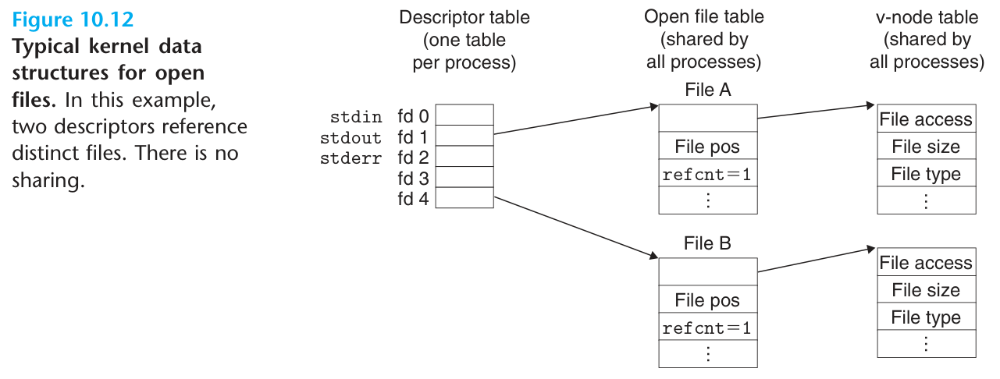

## 10.1 Unix I/O

Linux 把一切设备抽象为**文件（file）**,所有输入输出统一为对文件的读/写:

- **打开文件**:内核返回一个小的非负整数**描述符（descriptor,fd）**,标识该文件（所有 I/O 操作都通过它）。
- **读写**:read/write 以字节流为单位,从当前位置推进。
- **关闭**:close 释放描述符;进程终止时内核自动关闭所有打开文件。

## 10.2 文件

Linux 文件的类型:**普通文件**（文本/二进制,对内核无区别）、**目录**（含链接的表,`.` 与 `..`）、**套接字**、命名管道、符号链接、字符设备、块设备等。目录层次从**根目录 /** 展开;**绝对/相对路径**;每个进程有**当前工作目录**。

## 10.3 打开和关闭文件

```c
#include <fcntl.h>

int fd = open("/etc/hosts", O_RDONLY);          /* 只读打开 */
int fd2 = open("out.txt", O_WRONLY|O_CREAT|O_TRUNC, 0644); /* 写|不存在则建|清空 */
int rc = close(fd);                              /* 0 成功 -1 失败 */
```

| flag | 含义 |
| --- | --- |
| O_RDONLY / O_WRONLY / O_RDWR | 只读 / 只写 / 读写（必须指定其一） |
| O_CREAT | 不存在则创建（需第三参 mode 权限位） |
| O_TRUNC | 已存在则清空 |
| O_APPEND | 追加写（每次写前自动移到末尾） |

进程启动时 shell 默认打开三个:**标准输入 0（stdin）、标准输出 1（stdout）、标准错误 2（stderr）**。

## 10.4 读和写文件

```c
ssize_t read(int fd, void *buf, size_t count);   /* 返回读到的字节数; 0 = EOF; -1 = 错误 */
ssize_t write(int fd, const void *buf, size_t count); /* 返回写的字节数 */
```

**short count（不足值）**:read 返回小于 count 的值——**这不是错误**!网络/终端/缓冲边界常返回短读（如网络上有 1 字节可读就先返回）。写同理。健壮的代码必须循环处理短读。

## 10.5 用 RIO 包健壮地读写

CSAPP 提供的 **RIO（Robust I/O）** 包处理两类场景:

- **无缓冲输入输出**:`rio_readn/rio_writen`——自动处理短读短写,循环直到 n 字节完成（适合网络与文件）。
- **带缓冲的输入**:`rio_readlineb/rio_readnb`——内部维护读缓冲区,减少系统调用次数（每次 read 尽量填满缓冲,上层从缓冲拿）:

```c
#include "csapp.h"

char buf[MAXLINE];
rio_t rio;
rio_readinitb(&rio, fd);            /* 初始化缓冲 */
ssize_t n = rio_readlineb(&rio, buf, MAXLINE);  /* 读一行 */
rio_writen(fd, buf, n);             /* 全量写 */
```

读缓冲的语义:最多预读,不丢失（与 stdio 混用会出错,别混）。

## 10.6 读取文件元数据

```c
#include <sys/stat.h>

struct stat st;
stat("/etc/passwd", &st) 或 fstat(fd, &st) 或 lstat(不跟随符号链接);

/* 常用字段 */
st_size;        /* 文件字节大小 */
st_mode;        /* 文件类型与权限 */
```

用 **S_ISREG/S_ISDIR/S_ISSOCK（st.st_mode）** 宏判断文件类型;权限判断用 st_mode & S_IRUSR 位掩码。

## 10.7 读取目录和内容

```c
#include <dirent.h>

DIR *dp = opendir("/tmp");
struct dirent *ent;
while ((ent = readdir(dp)) != NULL) {
    /* ent->d_name 是文件名(不递归进子目录) */
}
closedir(dp);
```

readdir 返回的条目含 d_name、d_ino 等; "." 与 ".." 也会返回。

## 10.8 共享文件

内核为每个打开的文件维护三个数据结构（原书 Figure 10.12,左:每进程的描述符表;中:全局共享的打开文件表;右:v-node 表）:

- **描述符表（descriptor table）**:每进程独立,表项指向文件表;
- **文件表（file table）**:全局,每项含**文件位置（offset）、状态标志、引用计数（refcnt）、指向 v-node**;
- **v-node 表（v-node table）**:全局,每项含文件元数据（stat 信息:文件大小、类型、访问权限）。



上图中,描述符 1 和 4 指向**两个不同的文件表项**（两次独立 open 同一文件）——各自 offset 独立推进;而 dup 复制的描述符或 fork 后的父子进程则指向**同一文件表项**,共享 offset:

- **两次独立 open 同一文件**:两个文件表项,**各自 offset 独立推进**;
- **父子进程（fork 后共享）**:同一文件表项,共享 offset;
- **dup/dup2 复制描述符**:指向同一文件表项,共享 offset——I/O 重定向的机制基础。

## 10.9 I/O 重定向

```c
int dup2(int oldfd, int newfd);   /* 把 newfd 重定向到 oldfd 指向的文件 */
```

shell 的 `ls > foo.txt` 实现:fork 后子进程 close（1） 再 open foo.txt（描述符 1 被复用）,或直接 `dup2(fd, 1)`——此后所有 printf/write（1） 都写进文件。

## 10.10 标准 I/O

C 标准库（stdio）:FILE* 流（是对描述符 + 缓冲区的抽象）:

- 全缓冲（填满才冲）、行缓冲（遇换行冲）、无缓冲（stderr）;
- fread/fwrite/fgets/fprintf/fscanf/fflush/fseek;
- 标准流的描述符版本:stdin（0）/stdout（1）/stderr（2）。

## 10.11 综合:我该使用哪些 I/O 函数?

决策依据:

- **尽可能用标准 I/O**（文本行处理、可移植性）,但注意:
  - 标准库函数**不是异步信号安全**的（信号处理程序里只能 write）;
  - **网络套接字**上 stdio 有问题（避免 fseek、EOF 后流状态）→ 网络与信号场景用 RIO;
- 格式化输出进内存用 snprintf,输入用 sscanf;
- **理解系统级 Unix I/O 是根本**——标准 I/O 与 RIO 都构建在它之上。

## 10.12 小结

- Unix I/O 十字诀:**open、close、read、write、lseek/stat、dup2**;
- short count 是常态,不是错误;
- 三张表（描述符表/文件表/v-node）解释共享、offset 与重定向的一切行为;
- 选型:一般用标准 I/O;网络/信号场景用 RIO;所有上层最终落到 Unix I/O。
