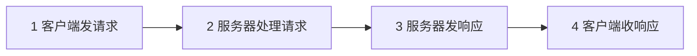
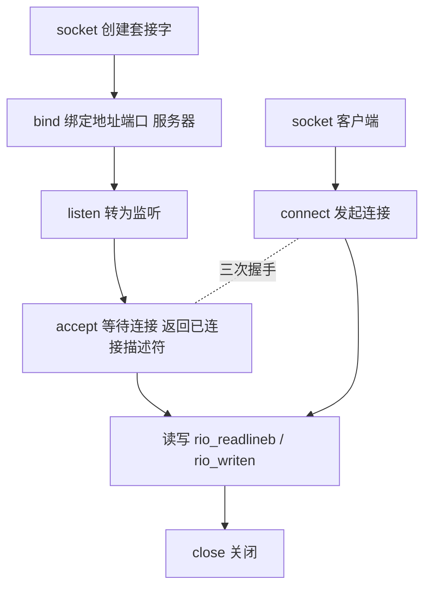

## 11.1 客户端-服务器编程模型

每个网络应用都基于**客户端-服务器模型（client-server model）**:

- **服务器**:管理资源,提供服务（文件、数据库、网页）;
- **客户端**:发起请求,消费服务。

基本事务四步:



客户端与服务器是**进程**而非主机;一对主机可同时互为客户端/服务器。

## 11.2 网络

对主机而言,网络是又一种 I/O 设备:

- 最流行的网络是**以太网（Ethernet,LAN）**:每台主机有唯一 **48 位 MAC（Media Access Control）地址**,段内广播帧,各主机按目的 MAC 接收（交换机学习 MAC-端口映射）;
- 下一层是**广域网（WAN）** 与互联的**互联网（internet）**:通过**路由器（router）** 把不兼容的局域网连起来;
- **协议（protocol）** 是运行在主机/路由器上的一组约定,完成数据打包、寻址与转发,**消除不同网络硬件的差异**。

互联网协议栈（本书视角的简化分层）:

| 层 | 职责 | 例子 |
| --- | --- | --- |
| 应用层 | 应用间消息 | HTTP、SMTP、DNS |
| 传输层 | 进程到进程 | TCP（Transmission Control Protocol）、UDP（User Datagram Protocol） |
| 网络层 | 主机到主机 | IP |
| 链路层 | 设备到设备 | 以太网、Wi-Fi |

TCP/IP 的关键能力:**命名机制（IP 地址唯一标识主机）**、**传送机制（把数据封装为包,路由转发）**。

## 11.3 全球 IP 因特网

### 11.3.1 IP 地址

32 位（IPv4）,按**网络字节序（大端）** 存储:

```c
#include <arpa/inet.h>

struct sockaddr_in {             /* IPv4 套接字地址 */
    uint16_t        sin_family;  /* AF_INET */
    uint16_t        sin_port;    /* 端口: 网络字节序 */
    struct in_addr  sin_addr;    /* IP 地址 */
};

uint32_t addr = inet_addr("127.0.0.1");      /* 点分十进制 → 网络序(废弃) */
inet_aton("127.0.0.1", &ap);                 /* 同上(推荐) */
char *p = inet_ntoa(ap);                     /* 网络序 → 点分十进制 */
```

主机字节序 ↔ 网络字节序转换:`htons/htonl/ntohs/ntohl`（host-to-network-short...）。x86 是小端,网络是大端。

### 11.3.2 因特网域名

**DNS（domain name system）** 建立域名 ↔ IP 的多对多映射:

```bash
nslookup www.google.com   # 查询域名
```

`getaddrinfo`（现代接口,替代已废弃的 gethostbyname）完成域名解析,见 11.4.7。

### 11.3.3 因特网连接

- **点对点、全双工、可靠字节流**;
- **套接字（socket）对**（cliaddr:cliport, servaddr:servport） 唯一标识一条连接;
- 端口标识主机上的进程服务:80（Web/HTTP）、25（SMTP）、443（HTTPS）、**1024 以下为周知端口（需特权）**;
- IPv6（128 位地址）正在普及,本章以 IPv4 讲原理。

## 11.4 套接字接口

**套接字接口（socket interface）** 是 Unix I/O 的一组系统调用,与 TCP/IP 共同发展（伯克利）:



### 11.4.1 套接字地址结构

```c
struct sockaddr {              /* 通用地址(历史遗物) */
    uint16_t sa_family;
    char     sa_data[14];
};
/* 所有接口统一用 struct sockaddr * 传递, 具体结构转型传入 */
```

### 11.4.2 socket 函数

```c
int sockfd = socket(AF_INET, SOCK_STREAM, 0);   /* TCP 套接字; 返回描述符 */
```

### 11.4.3 connect 函数

客户端建立连接:

```c
connect(sockfd, (SA *)&servaddr, sizeof(servaddr));
/* 阻塞直到三次握手完成; 返回 0 成功 */
```

### 11.4.4 bind 函数

```c
bind(listenfd, (SA *)&servaddr, sizeof(servaddr));
/* 服务器把地址端口绑定到监听描述符 */
```

### 11.4.5 listen 函数

```c
listen(listenfd, LISTENQ);   /* 主动套接字 → 监听套接字, LISTENQ 为待决连接队列上限 */
```

### 11.4.6 accept 函数

```c
int connfd = accept(listenfd, (SA *)&clientaddr, &clientlen);
/* 阻塞等待; 返回"已连接描述符"(与监听描述符不同!) */
```

**关键区分**:**监听描述符**生命周期与服务器一致（接收连接）,**已连接描述符**只为某次连接存在（通信）——分离监听与连接是并发服务器的基础。

### 11.4.7 主机和服务的转换

现代接口 getaddrinfo/getnameinfo（线程安全、支持 IPv6）:

```c
struct addrinfo hints = {0}, *listp;
hints.ai_family = AF_INET;        /* IPv4 */
hints.ai_socktype = SOCK_STREAM;  /* TCP */
hints.ai_flags = AI_PASSIVE;      /* 服务器: 任意本地地址 */
getaddrinfo("www.example.com", "http", &hints, &listp);
/* 遍历 listp 逐个尝试 socket+connect/bind */
freeaddrinfo(listp);
```

### 11.4.8 套接字接口的辅助函数

CSAPP 封装:

```c
int open_clientfd(char *hostname, char *port);  /* 客户端: 解析+socket+connect */
int open_listenfd(char *port);                  /* 服务器: 解析+socket+bind+listen */
```

### 11.4.9 echo 客户端和 echo 服务器

**迭代式服务器**（一次处理一个客户端）:

```c
/* echo 服务器主循环 */
listenfd = open_listenfd(argv[1]);
while (1) {
    connfd = accept(listenfd, (SA *)&clientaddr, &clientlen);
    echo(connfd);                    /* 处理一个客户端 */
    close(connfd);
}

void echo(int connfd) {
    size_t n; char buf[MAXLINE];
    rio_t rio;
    rio_readinitb(&rio, connfd);
    while ((n = rio_readlineb(&rio, buf, MAXLINE)) != 0) {
        printf("server received %d bytes\n", (int)n);
        rio_writen(connfd, buf, n);  /* 原样写回 */
    }
}
```

```c
/* echo 客户端 */
clientfd = open_clientfd(host, port);
while (fgets(buf, MAXLINE, stdin) != NULL) {
    rio_writen(clientfd, buf, strlen(buf));
    rio_readlineb(&rio, buf, MAXLINE);
    fputs(buf, stdout);
}
close(clientfd);
```

**迭代服务器的缺陷**:慢客户端阻塞所有后来者——第 12 章用并发解决。注意 fgets（标准 I/O）与 rio（网络）在此合理搭配:前者管键盘输入,后者管网络。

## 11.5 Web 服务器

### 11.5.1 Web 基础

**Web 客户端（浏览器）+ Web 服务器 + HTTP（HyperText Transfer Protocol,超文本传送协议）**:

- **URL（Uniform Resource Locator,统一资源定位符）**: `http://www.google.com:80/index.html` → 协议、主机、端口、资源路径;
- **MIME（Multipurpose Internet Mail Extensions）类型**:text/html、image/gif、text/plain... 告诉浏览器如何处理内容。

### 11.5.2 内容

- **静态内容**:磁盘文件,服务器原样返回;
- **动态内容**:服务器运行程序（如 CGI）返回输出。

### 11.5.3 HTTP 事务

HTTP/1.1 是文本协议,一次事务由请求与响应构成。

请求（客户端发出）:

```http
GET / HTTP/1.1
Host: www.example.com
(空行结束请求)
```

响应（服务器返回）:

```http
HTTP/1.1 200 OK
Content-length: 123
Content-type: text/html
(空行之后是内容主体)
```

- 请求方法:**GET**（请内容）、**POST**（表单数据）、**HEAD**（只要报头）、PUT/DELETE 等;
- 状态码:200 OK、301 Moved、404 Not Found、501 Not Implemented;
- 连接默认持久（HTTP/1.1 keep-alive）。

### 11.5.4 服务动态内容

**CGI（common gateway interface）** 的原理:服务器 fork + execve 一个 CGI 程序,用**环境变量（QUERY_STRING）与 stdin** 传参,子进程 stdout 重定向到已连接描述符 → 程序输出即响应体。现代替代:FastCGI、服务器内嵌模块、应用服务器。

## 11.6 综合:TINY Web 服务器

CSAPP 的 **TINY**（约 300 行）:迭代式 HTTP 服务器,支持 GET 静态与动态内容:

- 主循环:accept → doit（解析请求,仅支持 GET）;
- `read_requesthdrs` 逐行读报头;`parse_uri` 区分静态（./home.html）/动态（./cgi-bin/adder）;
- **静态**:读文件 → 按后缀定 MIME → 写报头与文件内容;
- **动态**:设置 QUERY_STRING 环境变量 → fork → 子进程 dup2（connfd, stdout） + execve CGI 程序;
- 错误处理:clienterror 返回 404/501 HTML。

测试:`tiny 8000` 起服务,浏览器/curl 访问。

## 11.7 小结

- 客户端-服务器模型 + 协议栈分层是网络应用的骨架;
- 套接字 API:socket/bind/listen/accept/connect,监听与连接描述符分离;
- 用 RIO 处理网络短读;getaddrinfo 是现代解析姿势;
- HTTP 是文本协议,TINY 演示了"几十行 C 代码 = 一个真正的 Web 服务器"。
