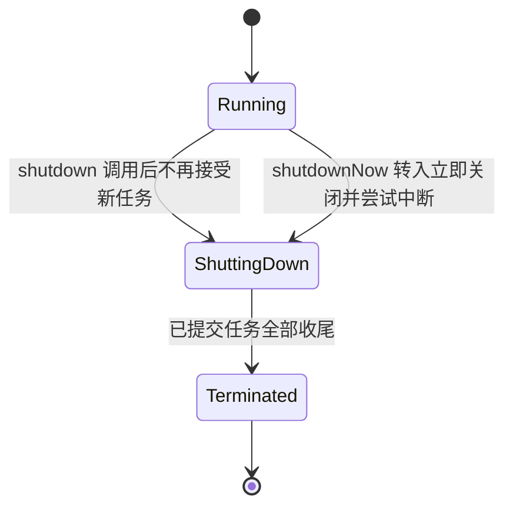

### 在线程中执行任务

**任务的抽象**：大多数并发程序围绕“任务（task）”组织——任务是抽象的、离散的工作单元。任务（要做什么，Runnable）与执行策略（怎么跑：在哪个线程、几个并发）应当**分离**——这正是 java.util.concurrent 的核心设计思想（Executor 框架）。

> Most concurrent applications are organized around the execution of tasks: abstract, discrete units of work.
>
> 大多数并发应用程序都围绕着执行任务来组织：任务是抽象的、离散的工作单元。

书用 Web 服务器展示三种执行策略：

**1. 串行执行**——一个线程处理所有请求：简单，理论上有“单线程的好处”（无竞态），但吞吐极差（一个慢请求阻塞所有后续请求），CPU 在 IO 等待时白白空转：

```java
// 串行 Web 服务器：线程在 handleRequest 的 IO 上阻塞时，其他连接全部排队
class SingleThreadWebServer {
    public static void main(String[] args) throws IOException {
        ServerSocket socket = new ServerSocket(80);
        while (true) {
            Socket connection = socket.accept();
            handleRequest(connection);      // 处理完一个才 accept 下一个
        }
    }
}
```

**2. 每任务一线程（thread-per-task）**——结构上最直观（“一个连接一个任务”），任务之间互不阻塞：

```java
// 每连接一线程：快速响应，但线程数不受控
class ThreadPerTaskWebServer {
    public static void main(String[] args) throws IOException {
        ServerSocket socket = new ServerSocket(80);
        while (true) {
            final Socket connection = socket.accept();
            Runnable task = () -> handleRequest(connection);
            new Thread(task).start();       // 无上限地创建线程！
        }
    }
}
```

问题：

- **线程生命周期开销**：创建和销毁有真实成本（系统调用、栈分配），请求频繁时开销可观；
- **资源消耗**：空闲线程占内存（默认栈约 1MB，可用 -Xss 调整）；线程多到一定程度，垃圾回收（Garbage Collection, GC）压力、调度开销陡增；
- **稳定性**：无界创建线程的终点是 OutOfMemoryError（OOM）——**这是最容易触发的“崩溃边界”：收到多少连接就建多少线程的系统，必然垮在高流量下**。

**3. 线程池（thread pool）**——固定数量的工作线程从共享队列取任务执行，兼得前两种方案的响应性与稳定性（第 7 篇详述配置）。

### Executor 框架

```java
Executor executor = anExecutor;
executor.execute(runnable);   // 提交任务，怎么执行由执行策略决定
```

Executor 虽只有一个方法，但它是**执行策略的载体**——把“任务的提交”与“任务的执行”解耦。它同时也是生产者-消费者模式的标准体现：execute 的调用者是生产者，执行任务的工作线程是消费者。

> An object that executes submitted Runnable tasks. This interface provides a way of decoupling task submission from the mechanics of how each task will be run, including details of thread use, scheduling, etc.
>
> 一个执行已提交 Runnable 任务的对象。该接口提供了一种把“任务提交”与“任务如何运行的机制（线程使用、调度等细节）”解耦的方法。——Executor 接口 Javadoc

**执行策略要回答的问题**（设计任何异步服务前先想清楚这六个）：

1. 任务在**什么线程**中执行（新建？池中复用？调用者线程直接执行？）；
2. 任务按**什么顺序**执行——先进先出 FIFO、后进先出 LIFO，还是按优先级；
3. 可以有多少任务**并发**执行；
4. 可以有多少任务**排队**等候（有界还是无界）；
5. 系统过载时要**放弃**哪些任务（拒绝策略：抛异常？静默丢弃？让提交者的线程自己执行？）；
6. 任务开始和结束时应该执行**哪些动作**（记录日志、统计指标、回收清理之类的钩子）。

```java
// 把“每连接一线程”服务器换成 Executor：一行改动，执行策略随手可换
class TaskExecutionWebServer {
    private static final Executor exec = Executors.newCachedThreadPool();

    public static void main(String[] args) throws IOException {
        ServerSocket socket = new ServerSocket(80);
        while (true) {
            final Socket connection = socket.accept();
            Runnable task = () -> handleRequest(connection);
            exec.execute(task);             // 替代 new Thread(task).start()
        }
    }
}
```

**线程池**——执行策略最常见的落地形式，本质上是“一组工作线程 + 一个任务队列”。四个工厂方法覆盖了绝大多数配置需求：

| 工厂方法 | 配置 | 适用 |
| --- | --- | --- |
| newFixedThreadPool(n) | 固定 n 个线程，无界队列 | 负载稳定的场景 |
| newCachedThreadPool | 0 核心、上限 ∞、SynchronousQueue | 大量短命小任务 |
| newSingleThreadExecutor | 单线程 + 无界队列 | 任务需要严格串行 |
| newScheduledThreadPool(n) | 定时与周期执行 | 替代 Timer |

线程池的优势：复用（省去创建销毁的成本）、**限流**（活动线程数有上限——过载时任务排队而不是系统垮掉）、解耦（执行策略与任务代码独立演化）。

**ExecutorService 与生命周期**：ExecutorService 在 Executor 之上扩展了两块能力——更丰富的任务提交方式（submit 返回 Future，invokeAll/invokeAny 批量执行），以及显式的生命周期管理。它的内部是一台三状态的状态机：



| 方法 | 行为 |
| --- | --- |
| shutdown | 温和关闭：不再接受新任务，已提交的任务（含还在排队的）全部执行完 |
| shutdownNow | 立即关闭：interrupt 正在执行的任务，返回尚未开始执行的任务列表 |
| awaitTermination | 阻塞等待进入 Terminated 状态；到期仍未终止则返回 false |

isShutdown 在发出任一关闭指令后即为 true；“真的跑完了”以 isTerminated 为准。典型组合是先 shutdown，再用 awaitTermination 等待，超时还不停才升级为 shutdownNow。支持生命周期的 Web 服务器：

```java
// 支持优雅关闭：shutdown 后 accept 循环靠 isShutdown 感知状态变化，
// 此时再提交任务会被拒绝——RejectedExecutionException 属于正常路径，不是错误
class LifecycleWebServer {
    private final ExecutorService exec = Executors.newCachedThreadPool();

    public void start() throws IOException {
        ServerSocket socket = new ServerSocket(80);
        while (!exec.isShutdown()) {
            try {
                final Socket connection = socket.accept();
                exec.execute(() -> handleRequest(connection));
            } catch (RejectedExecutionException e) {
                if (!exec.isShutdown()) log("task submission rejected", e);
            }
        }
    }
    public void stop() { exec.shutdown(); }    // 关闭由服务的拥有者发起（第 6 篇）
    ...
}
```

### 延迟任务与周期任务

**ScheduledThreadPoolExecutor 优于 Timer**：

```java
// Timer 的两个坑都埋在这两行代码里
Timer timer = new Timer();
timer.schedule(new LongRunningTask(), 10);              // 慢任务会推迟后面的所有任务
timer.schedule(new ComplicatedTask(), 1000);            // 它若抛异常，TimerThread 整个挂掉
```

- Timer 只有**一个线程**执行所有定时任务：一个任务耗时过长会推迟后续全部任务；任何一个任务抛出未捕获异常，都会**杀死整个 Timer**——它认为“调度器已经坏了”，之后的所有任务都不再执行。而 ScheduledThreadPoolExecutor 里单个任务的异常只影响自己；
- Timer 基于**绝对时间**做调度，对系统时钟敏感：NTP（Network Time Protocol，网络时间协议）校时导致时钟回拨时会出问题。ScheduledThreadPoolExecutor 基于相对时间（nanoTime）。

结论：**新代码一律用 ScheduledThreadPoolExecutor**（或其工厂方法 newScheduledThreadPool / newSingleThreadScheduledExecutor）。

### 携带结果的任务：Callable 与 Future

Runnable 不够用：run() 没有返回值、不能抛受检异常。要支撑“异步计算”，需要更强的任务抽象——**Callable\<V\>** 通过 call() 方法返回结果、可以抛受检异常；**Future** 则是计算结果的句柄，刻画了任务的一生：

```java
Callable<V> task = () -> { ...; return result; };
Future<V> future = exec.submit(task);   // 提交后立刻返回 Future，不等计算完成
V result = future.get();                // 阻塞直到完成（超时版：get(timeout, unit)）
// future.cancel(true)：尝试取消，参数为 true 时会中断正在运行的任务
// future.isDone() / isCancelled()
```

Future 的关键语义：**任务的生命周期只能前进，不能后退**——一旦到达终态（完成、取消或失败），就永久停留在那里。get() 的异常路径有三种：计算抛出的异常被包装为 ExecutionException 重抛（getCause() 取原始异常）；任务被取消则抛 CancellationException；带超时的 get 到期未完成抛 TimeoutException。

顺带记住 ExecutorService 的两个批量方法：invokeAll（等全部完成，下一节的时限控制常用）和 invokeAny（**竞速语义**——任意一个任务先成功完成就返回它的结果，其余任务被取消，适合“同一件事问多个来源，谁先答出来用谁的”）。

**ExecutorCompletionService**：在“一批任务、按完成顺序消费结果”的场景下，把“任务完成”与“获取结果”进一步解耦——完成的任务自动进入内部结果队列，take() 按**完成顺序**取出而不是按提交顺序 get（页面渲染的完整例子见第 7 篇）：

```java
// ExecutorCompletionService = Executor + 完成队列：submit 时任务被包成 QueueingFuture，
// 完成的瞬间由 done 回调把它放入完成队列
ExecutorCompletionService<ImageData> completionService =
        new ExecutorCompletionService<>(executor);
completionService.submit(() -> downloadImage(info));
Future<ImageData> f = completionService.take();   // 谁先完成取谁（而不是按提交顺序等待）
```

### 为任务设置时限

**给异步任务设预算**：get(timeout)、invokeAll(timeout) 超时后把没做完的任务取消掉，避免无限等待把调用方拖死。“在限定时间内检查所有邮箱”是书里的经典例子——无论查没查完，都要在预算内给出答案：

```java
// 有限时间内做完所有任务：并发执行 + 总预算
boolean checkMail(Set<String> hosts, long timeout, TimeUnit unit) throws InterruptedException {
    ExecutorService exec = Executors.newCachedThreadPool();
    final AtomicBoolean hasNewMail = new AtomicBoolean(false);   // 多线程安全的结果汇聚
    try {
        for (final String host : hosts)
            exec.execute(() -> { if (checkMail(host)) hasNewMail.set(true); });
    } finally {
        exec.shutdown();                          // 不再接受新任务
        exec.awaitTermination(timeout, unit);     // 最多等 timeout，到点还没完的就随它去
    }
    return hasNewMail.get();
}
```

invokeAll(timeout, unit) 是这类需求的批量官方版：提交一批任务并等待，超时时未完成的 Future 一律处于取消状态，遍历结果时要按业务处理这两种结局：

```java
List<Callable<T>> tasks = ...;
List<Future<T>> futures = exec.invokeAll(tasks, timeout, unit);   // 返回时：要么已完成，要么已被取消
for (Future<T> f : futures) {
    try { process(f.get()); }                     // 被取消的 get 抛 CancellationException——按业务处理
    catch (ExecutionException e) { ... }
    catch (CancellationException e) { /* 超时未完成的部分 */ }
}
```

### 任务与负载：为任务选择合适的执行策略

- 任务有不同的形状：**短小独立**（最好调度）/ **长任务**（长时间占住工作线程）/ **依赖任务**（可能线程饥饿死锁，见第 8 篇）/ **要求独占资源**；
- 匹配原则：队列要有界、过载要有策略。数据库连接、内存都是有限的——**无界队列会把瞬时高峰变成持续积压**；用有界队列加明确的饱和策略（caller-runs 或抛异常）让过载“尽早失败”，好过拖着表面平静慢慢走向 OOM（第 7 篇的饱和策略）。

> 【演进】书中写作时（Java 5/6）Executor 框架还是新鲜事物，如今已是 Java 并发的基础设施。Java 8 的 **CompletableFuture** 把“提交-等待-组合”升级为声明式流水线（thenApply/thenCombine/allOf/anyOf），不必手工管理一串 Future 再逐个 get；Java 21 的**虚拟线程**（Executors.newVirtualThreadPerTaskExecutor()）让“每任务一线程”模式复活——阻塞式写法配上近乎零成本的阻塞，尤其适合 IO 密集服务（虚拟线程**不要池化**，每任务新建一个即可；ThreadLocal 也慎用——数量巨大时有内存放大效应）；**结构化并发**（Structured Concurrency）试图把“父任务等子任务、超时统一取消”提升为语言级结构，自 JDK 21 起仍在多轮预览中孵化。
