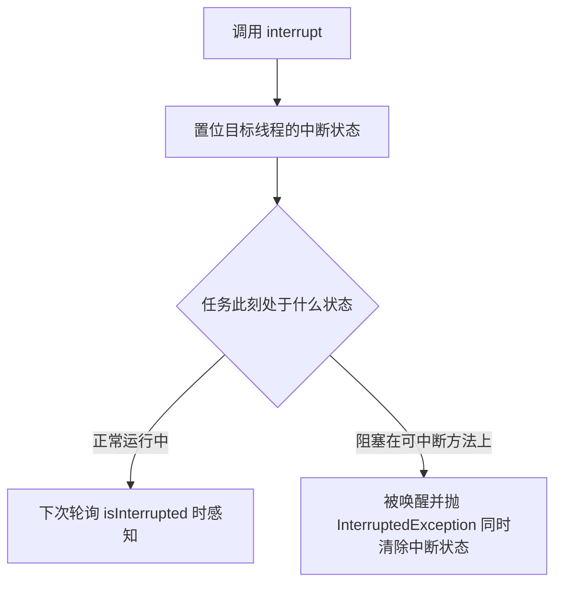

### 取消的难题

没有“抢占式安全停止线程”的方法（`Thread.stop` 已废弃——直接释放锁会破坏数据一致性，Java 20 起更被改为无条件抛出 UnsupportedOperationException，彻底不可用；`suspend`/`resume` 同样废弃，现代 JDK 同样无条件抛 UOE——死锁风险）。取消的本质是**协作式的**：请求方发出“请停下来”，任务在合适的时机**自愿配合**。

> There is no safe way to preemptively stop a thread in Java, and therefore no safe way to preemptively stop a task. There are only cooperative mechanisms, by which the task and the code requesting cancellation follow an agreed-upon protocol.
>
> 遗憾的是，Java 里没有安全抢占式停止线程的办法，因此也没有安全抢占式取消任务的手段。只有协作机制：由任务与请求取消的一方共同遵守一份约定好的协议。——原书第 7 章开篇

一个取消操作涉及三方，每方都有话要说：

- **请求方**：怎么触发取消（标志位、中断、Future.cancel）；
- **被取消的任务**：如何响应（立即退出？做完当前单元？忽略？）；
- **其他相关代码**：如何感知取消结果（拿到部分结果？异常？）。

**取消策略（cancellation policy）**：想被取消的任务要明确回答三件事——**how**（别的代码怎么请求取消）、**when**（任务在哪些点检查取消请求）、**what**（检查到之后做什么）。原书用支票止付类比：银行对“如何提交止付请求、响应时限、真止付时的流程（通知对方银行、收手续费）”都有明文——合起来就是支票的“取消策略”。PrimeGenerator 的策略简单明确：客户端调 cancel 请求取消，任务每算出一个素数检查一次标志，检查到就退出。策略要写成文档，让维护者不猜。

**取消标志位的问题**：

```java
private volatile boolean cancelled;
public void run() {
    while (!cancelled) { ... }
}
```

对可轮询的任务够用（素数生成器 PrimeGenerator：每算一个检查一次标志）；但**任务一旦阻塞**（take/sleep/等 IO），永远检查不到标志——需要**中断**来打断阻塞：

```java
// 破碎的素数生产者：取消标志置位了，但生产者阻塞在 put 上，永远醒不来
class BrokenPrimeProducer extends Thread {
    private final BlockingQueue<BigInteger> queue;
    private volatile boolean cancelled = false;

    BrokenPrimeProducer(BlockingQueue<BigInteger> queue) { this.queue = queue; }
    public void run() {
        try {
            BigInteger p = BigInteger.ONE;
            while (!cancelled)
                queue.put(p = p.nextProbablePrime());   // 队列满时阻塞——cancelled 置位也看不见
        } finally { ... }
    }
    public void cancel() { cancelled = true; }
}
// 修复：cancelled 换成“中断状态”，while (!Thread.currentThread().isInterrupted())，
//       cancel() 换成 interrupt()——阻塞中的 put 很快被 InterruptedException 打断
```

### 中断（Interruption）

中断**不意味着停止**，只是“通知”——被中断线程自己决定怎么响应（原书：interrupt 并不会真正打断一个运行中的线程，它只是请求线程在下一个方便的时机自己中断自己）：

- `interrupt()`：发出中断（置位中断状态；若目标线程阻塞在 sleep/wait/join 上，会尽快检测并抛 InterruptedException——JVM 不保证检测速度，实践中很快）；
- `isInterrupted()`：查询中断状态；
- `Thread.interrupted()`：查询**并清除**（静态方法，唯一的**手动**清除途径——阻塞库方法响应中断时也会自行清除）。

调用 interrupt 的效果取决于线程当时的状态：正常执行则仅置位（中断是“粘住的”，直到有人查询或清除）；阻塞在可中断方法上则抛异常并**清除**中断状态。所以“中断状态”可能被中途经过的库代码消费掉——自定义取消逻辑通常要**保存/传递**它。一图概括两条命中路径：



**处理 InterruptedException 的准则**（本章最重要的一节）：

1. **传递异常**：方法自己也声明 throws InterruptedException，把决定权交给调用者；
2. **恢复中断状态**：不能抛时（Runnable 的 run 签名不允许抛），捕获后重新置位：

```java
public void run() {
    try {
        ...阻塞调用...
    } catch (InterruptedException e) {
        Thread.currentThread().interrupt();   // 恢复中断状态，让上层逻辑感知
        // 收尾后退出循环
    }
}
```

3. **绝不吞掉**：捕获后什么都不做等于剥夺调用者的取消能力，是最常见的并发 bug 之一。唯一可以“吃掉”中断的场景：你正是该线程中断策略的拥有者，且确定退出前不再有依赖中断的逻辑。

**不可取消任务的重试循环——恢复时机的陷阱**（Listing 7.7）：不支持取消但仍要调用可中断阻塞方法（如队列 take）时，惯例是“捕获中断后重试”。此时**不要在 catch 里立刻恢复中断状态**——要把状态存进局部变量，**返回前才恢复**：

```java
// 不可取消任务：保存中断状态，返回前才恢复（Listing 7.7）
boolean interrupted = false;
try {
    while (true) {
        try {
            return queue.take();
        } catch (InterruptedException e) {
            interrupted = true;          // 先记账，继续重试
            // fall through and retry
        }
    }
} finally {
    if (interrupted)
        Thread.currentThread().interrupt();   // 返回前恢复，交还决定权
}
```

原书点破原因：*Setting the interrupted status too early could result in an infinite loop*——大多数可中断阻塞方法**入口处**就检查中断状态，置位就直接抛 InterruptedException；catch 里马上恢复 = 下一轮 take 进门即抛，循环永不前进。“sleep 与 interrupt 谁先谁后”一类的时序竞态，根源就在这里。

### 中断策略

- 任务应有**明确的中断策略**：收到中断是尽快退出？做完当前单元再退出？还是暂时搁置（记住被中断了，做完当前更新再处理——保护数据结构不被打断在半途）？——策略要写进文档；
- **区分“任务的中断”与“线程的中断”**：任务在借来的线程里跑（Tasks do not execute in threads they own; they borrow threads owned by a service）——任务可以**自行处理**中断（比如做完收尾再退出），但必须**保留中断状态**，把最终决定权交还给拥有者（原书的比喻：替人看家时，来信别扔——收好等主人回来处理，哪怕你顺手看了杂志）。正确的写法就是上一节的“处理了也恢复”；Executor 的标准做法：shutdownNow 中断**正在执行**的任务（排队的任务被移除返回、不被中断），工作线程把中断传给当前任务，任务自己决定行为；
- 复杂系统中**按层级传递取消**：上层“拥有”下层的执行与取消权，最顶层对用户负责——把“谁拥有线程”想清楚，取消策略自然就清晰了。

### 用 Future 取消

还有一种取消手段不依赖任务“自己检查标志”——通过 Future 持有任务的取消权：

```java
Future<?> task = exec.submit(runnable);
// mayInterruptIfRunning=true：已在运行也中断它；false 只取消还没开始的
task.cancel(true);
```

cancel 之后 get 必然抛 CancellationException。两个精确的语义：①cancel 的返回值只表示“**中断是否成功送达**”，不代表任务检测并响应了它（原书：tells you only whether it was able to deliver the interruption, not whether the task detected and acted on it）；②mayInterruptIfRunning=false 适合“没有为中断而设计”的任务（标准库的求值类取消常用它）。**不要在不拥有任务的地方中断线程池的工作线程**——只有任务的拥有者才知道它的中断策略（“谁知道这个任务能不能被安全地中断”）。

**限时运行的通用工具**（7.1.4）——三代演进，每一步都在修上一代的坑：

第一版（错误）：计时到了直接 interrupt **当前调用线程**——任务提前结束后，超时中断照样打过来，殃及无辜的后续代码；还把未知代码的调度当成了自己线程的中断策略。

第二版（专用线程）：把任务放进临时线程，超时中断它、timed join 等待、重抛异常——修好了“误伤”，但继承了 join 的缺陷：**无法区分**“线程正常结束”还是“join 超时返回”（join 没有状态返回值，原书脚注视之为 Thread API 的缺陷）：

```java
// 专用线程版 timedRun（原书 Listing 7.9，节选）
class RethrowableTask implements Runnable {
    private volatile Throwable t;          // volatile：安全发布异常
    public void run() {
        try { r.run(); }
        catch (Throwable t) { this.t = t; }
    }
    void rethrow() { if (t != null) throw launderThrowable(t); }
}

RethrowableTask task = new RethrowableTask();
final Thread taskThread = new Thread(task);
taskThread.start();
cancelExec.schedule(() -> taskThread.interrupt(), timeout, unit);  // 超时中断任务线程
taskThread.join(unit.toMillis(timeout));        // 限时等待它结束
task.rethrow();                                 // 把任务异常重抛给调用者
```

第三版（Future，正确）：提交给 Executor + 超时 get + finally 里 cancel：

```java
// 有限时间内运行任意 Runnable：Future 版（正确）
private static final ExecutorService taskExec = Executors.newCachedThreadPool();

public static void timedRun(Runnable r, long timeout, TimeUnit unit) throws Throwable {
    Future<?> task = taskExec.submit(r);
    try {
        task.get(timeout, unit);              // 等 timeout：完成/超时/异常/取消
    } catch (TimeoutException e) {
        // 接下来在 finally 里取消
    } catch (ExecutionException e) {
        // 任务中抛出的异常——剥壳重抛给调用者
        throw launderThrowable(e.getCause());
    } finally {
        task.cancel(true);                    // 幂等：已完成则无害；运行中则中断它
    }
}
```

注意它只保证“任务收到了取消请求”（cancel），**不保证任务真的停下**——不响应中断的任务仍可能继续跑。可靠关闭 = cancel + 明确的中断策略 + 有限时间的等待确认（“确认”的进阶手段见下文 TrackingExecutor）。

### 处理不可中断的阻塞

中断不是万能的——**部分阻塞操作不响应中断**：

| 阻塞类型 | 中断有效？ | 打断手段 |
| --- | --- | --- |
| sleep/wait/join、Lock 的 lockInterruptibly | ✅ | interrupt() |
| 内置锁 synchronized 的等待 | ❌ | 无（只能等持有者释放） |
| java.io 旧式 Socket IO 读写 | ❌ | **关闭 socket**（read 抛 SocketException） |
| java.nio 的 InterruptibleChannel | ✅ | interrupt()——阻塞线程抛 ClosedByInterruptException 且**通道被关闭**（同通道上其他阻塞线程也抛）；主动关闭通道则阻塞线程抛 AsynchronousCloseException |
| Selector.select | ✅ | interrupt 或 wakeup（wakeup 使其提前返回并抛 ClosedSelectorException） |
| 轮询 isInterrupted() 的自旋 | ✅ | 下轮检查感知 |

（原书本节是四段正文（java.io socket / java.nio channel / Selector / 内置锁），没有这张表——表格为笔记整理，首行“sleep/wait/join”取自 7.1.1 的阻塞方法论述。）

覆写 interrupt 来“连坐”关闭 socket：

```java
// 中断阻塞在 socket 读上的线程：覆写 interrupt，关闭 socket 让 read 抛异常
public class ReaderThread extends Thread {
    private final Socket socket;
    private final InputStream in;

    public ReaderThread(Socket socket) throws IOException {
        this.socket = socket;
        this.in = socket.getInputStream();
    }
    public void interrupt() {                  // 覆写：中断 + 关 socket 双管齐下
        try {
            socket.close();                    // read() 会抛 SocketException——这就是“中断”
        } catch (IOException ignored) { }
        super.interrupt();                     // 别忘了标准中断
    }
    public void run() {
        try {
            byte[] buf = new byte[BUF_SIZE];
            int bytesRead;
            while ((bytesRead = in.read(buf)) > -1)
                processBuffer(buf, bytesRead);
        } catch (SocketException e) {          // socket 被 interrupt() 关闭——正常退出
        } catch (IOException e) { ... }
    }
}
```

**用 newTaskFor 封装非标准取消**（任务知道自己该如何被取消，Future.cancel 委托给它）：

```java
// CancellableTask：知道如何取消自己的 Callable
public interface CancellableTask<T> extends Callable<T> {
    void cancel();
    RunnableFuture<T> newTask();
}

// 携带 socket 的任务基类：cancel() = 关 socket；newTask() 返回“取消时先关 socket 的 FutureTask”
public abstract class SocketUsingTask<T> implements CancellableTask<T> {
    @GuardedBy("this") private Socket socket;
    protected synchronized void setSocket(Socket s) { socket = s; }
    public synchronized void cancel() {
        try { if (socket != null) socket.close(); } catch (IOException ignored) { }
    }
    public RunnableFuture<T> newTask() {
        return new FutureTask<T>(this) {                     // 覆写 FutureTask.cancel
            public boolean cancel(boolean mayInterruptIfRunning) {
                try {
                    SocketUsingTask.this.cancel();           // 任务专属的非标准取消（关 socket）
                } finally {
                    return super.cancel(mayInterruptIfRunning);  // 标准取消（置状态/中断）
                }
            }
        };
    }
}

// 让 Executor 使用自定义的 future 工厂——覆写 newTaskFor 的池（原书 7.1.7）：
@ThreadSafe
public class CancellingExecutor extends ThreadPoolExecutor {
    protected <T> RunnableFuture<T> newTaskFor(Callable<T> callable) {
        if (callable instanceof CancellableTask)
            return ((CancellableTask<T>) callable).newTask();   // 走任务自定义的取消
        else
            return super.newTaskFor(callable);                  // 普通任务走标准路径（别忘兜底）
    }
}
// 使用：SocketUsingTask task = ...; Future f = exec.submit(task); f.cancel(true);  // 会自动关 socket
```

这体现了原书的一贯思想：**把“怎么取消”的知识放在拥有它的层**（任务最清楚自己占着什么资源），把“何时取消”留给拥有它的上层。

### 停止基于线程的服务

**服务的生命周期应由创建它的所有者管理**（所有权原则：线程池拥有工作线程，就该由池的拥有者来关闭它）。JVM（Java Virtual Machine，Java 虚拟机）的关闭钩子由运行时管理，也是这个道理——库代码不应“自作主张”地关停线程/线程池，把关闭入口留给拥有者。

**两阶段终止模式（以日志服务为例）**：第一阶段停止接收新请求（置标志、拒绝 log），第二阶段清空队列中的存量日志后退出（书中用“预订计数”保证一条不丢）：

```java
public class LogService {
    private final BlockingQueue<String> queue;
    private final LoggerThread loggerThread;
    private final PrintWriter writer;
    @GuardedBy("this") private boolean isShutdown;        // ① 关闭请求标志
    @GuardedBy("this") private int reservations = 0;      // ② 已入队但未被消费的日志数

    public LogService(BlockingQueue<String> queue, PrintWriter writer) {
        this.queue = queue; this.writer = writer;
        this.loggerThread = new LoggerThread();
    }
    public void start() { loggerThread.start(); }

    public void stop() {
        synchronized (this) { isShutdown = true; }        // 第一阶段：拒绝新日志
        loggerThread.interrupt();                         // 唤醒可能正阻塞的消费者
    }

    public void log(String msg) throws InterruptedException {
        synchronized (this) {
            if (isShutdown) throw new IllegalStateException("logger is shut down");
            ++reservations;                               // 先记账，再入队
        }
        queue.put(msg);                                   // put 可能阻塞——必须在锁外（否则与消费者死锁）
    }

    private class LoggerThread extends Thread {
        public void run() {
            try {
                while (true) {
                    try {
                        synchronized (LogService.this) {
                            if (isShutdown && reservations == 0)   // 收到关闭且存量清空 → 退出
                                break;
                        }
                        String msg = queue.take();
                        synchronized (LogService.this) { --reservations; }
                        writer.println(msg);
                    } catch (InterruptedException e) { /* 重试：回头再检查退出条件 */ }
                }
            } finally {
                writer.close();
            }
        }
    }
}
```

**设计关闭的逻辑陷阱**：log() 若在锁内执行 queue.put() 会死锁——put 因队满阻塞时始终持锁；消费者循环**开头要检查退出条件**，检查就得拿这把锁，拿不到就永远到不了 take()，队列永远不空，生产者永远阻塞——生产与消费互相卡死。这正是“put 放锁外”的原因（原书：don't hold a lock while trying to enqueue the message, since put could block）。生产者-消费者式服务的关闭必须**两侧都安全**：既要停止接收新输入，又要消费完存量。

**毒丸（poison pill）**：往队列放一个各方公认的终结对象，消费者取到即知该退出——在**无界队列且生产者/消费者数量已知**的前提下是可靠的优雅关闭手段（有界队列满时毒丸可能塞不进去；多个生产者要各放一颗）。索引服务的经典实现：

```java
public class IndexingService {
    private static final File POISON = new File("");       // 毒丸：这个“文件”代表停止
    private final BlockingQueue<File> queue;
    private final CrawlerThread producer = new CrawlerThread();
    private final IndexerThread consumer = new IndexerThread();
    ...
    public void start() { producer.start(); consumer.start(); }

    class CrawlerThread extends Thread {                   // 生产者：爬完树后放毒丸
        public void run() {
            try {
                crawl(root);
            } catch (InterruptedException e) { /* fall through：被中断也要放毒丸 */ }
            finally {
                while (true)
                    try { queue.put(POISON); break; }      // 一定要送达（哪怕重试）
                    catch (InterruptedException e1) { /* retry */ }
            }
        }
        private void crawl(File root) throws InterruptedException { ... }
    }
    class IndexerThread extends Thread {                   // 消费者：收到毒丸即有序退出
        public void run() {
            try {
                while (true) {
                    File file = queue.take();
                    if (file == POISON) break;             // 排在毒丸之前的存量都已处理完
                    else indexFile(file);
                }
            } catch (InterruptedException consumed) { }
        }
    }
}
```

关闭 ExecutorService 的标准写法——官方 Javadoc 推荐的两段式模板：

> Attempts to stop all actively executing tasks, halts the processing of waiting tasks, and returns a list of the tasks that were awaiting execution.
>
> 尝试停止所有正在执行的任务，不再处理排队的任务，并返回等待执行的任务列表。——ExecutorService.shutdownNow Javadoc

```java
void shutdownAndAwaitTermination(ExecutorService pool) {
    pool.shutdown();                                // 第一阶段：拒绝新任务
    try {
        if (!pool.awaitTermination(60, TimeUnit.SECONDS))
            pool.shutdownNow();                     // 第二阶段：升级为强制取消剩余任务
        if (!pool.awaitTermination(60, TimeUnit.SECONDS))
            System.err.println("Pool did not terminate");
    } catch (InterruptedException ie) {
        pool.shutdownNow();
        Thread.currentThread().interrupt();         // 恢复中断
    }
}
```

**shutdown 与 shutdownNow 的权衡**：正常关闭（shutdown）慢但安全——排队的任务全部执行完才终止；突然关闭（shutdownNow）快但冒险——正在执行的任务可能被拦腰打断（原书：*abrupt termination is faster but riskier… normal termination is slower but safer*）。对外服务可以两者都提供，让调用方按场景选。

**把 ExecutorService 封进更高层服务**（Listing 7.16）：服务持有池、生命周期方法委托给池——所有权链“应用→服务→线程”再加一环：

```java
// 用 ExecutorService 实现的日志服务（Listing 7.16）
class LogService {
    private final ExecutorService exec = Executors.newSingleThreadExecutor();
    ...
    public void start() { }
    public void stop() throws InterruptedException {
        try {
            exec.shutdown();
            exec.awaitTermination(TIMEOUT, UNIT);
        } finally {
            writer.close();
        }
    }
    public void log(String msg) {
        try { exec.execute(new WriteTask(msg)); }
        catch (RejectedExecutionException ignored) { }   // 已关闭：静默拒绝
    }
}
```

**方法级私有 Executor**（checkMail，Listing 7.20）：一个方法要并行处理一批任务、全部完成才返回时，建一个生命周期恰好被这次方法调用限定的私有池：

```java
// 并行检查多台主机的邮件：私有池 + finally 收尾（Listing 7.20，lambda 改写）
boolean checkMail(Set<String> hosts, long timeout, TimeUnit unit) throws InterruptedException {
    final AtomicBoolean hasNewMail = new AtomicBoolean(false);  // 原书用 AtomicBoolean 而非 volatile boolean：匿名类捕获要求 final，改不了值
    ExecutorService exec = Executors.newCachedThreadPool();
    for (final String host : hosts)
        exec.submit(() -> {
            if (checkMail(host)) hasNewMail.set(true);
        });
    exec.shutdown();
    exec.awaitTermination(timeout, unit);
    return hasNewMail.get();
}
```

（原书提示：这种“一批任务全部完成才返回”的场景，invokeAll/invokeAny 往往更顺手。）

**shutdownNow 的局限与 TrackingExecutor**（7.2.3）：shutdownNow 无法告诉你哪些任务“已开始但没做完”——它只中断**正在执行**的任务、移除并返回没开始的；返回的 Runnable 还可能是包装过的对象，不是你当初提交的实例（原书脚注 5）。要精确追踪，用原书的 TrackingExecutor 包装池：execute 时把任务包一层，任务正常返回前的 finally 里检查“池已关闭 && 线程带中断状态”则记入“已取消”集合：

```java
// TrackingExecutor 的核心（Listing 7.21，节选）
public void execute(final Runnable runnable) {
    exec.execute(new Runnable() {
        public void run() {
            try {
                runnable.run();
            } finally {
                if (isShutdown() && Thread.currentThread().isInterrupted())
                    tasksCancelledAtShutdown.add(runnable);
            }
        }
    });
}
// terminate 后 getCancelledTasks() = “已开始但没做完”的任务，可存档重放
```

两个前提要记住：①任务**返回时保留中断状态**（本来就该这么做）这条技术才成立；②存在**不可避免的竞态误报（false positives）**——任务可能在最后一条指令执行完、记账完成之前撞上关停，被误记为“已取消”。任务幂等（如网页爬虫）则无害，否则调用方要能处理重复。

### 处理未捕获异常（7.3）

任务抛出未捕获的运行时异常 = 工作线程死亡——而它可能不出现在任何日志里（线程静默消失，任务无声失败）。两条互补的防线：

1. **主动捕获**：工作者线程的标准结构（Listing 7.23）——`run` 里 try 执行任务、catch Throwable 通知框架、finally 收尾；ThreadPoolExecutor 与 Swing 都这么做，保证一个烂任务不会拖垮后续任务；
2. **UncaughtExceptionHandler 兜底**：线程因未捕获异常死亡时，JVM 通知该线程的 UncaughtExceptionHandler（没有则把栈轨迹打到 System.err）：

```java
// 打日志的 UEH（原书 Listing 7.25）
public class UEHLogger implements Thread.UncaughtExceptionHandler {
    public void uncaughtException(Thread t, Throwable e) {
        Logger logger = Logger.getAnonymousLogger();
        logger.log(Level.SEVERE, "Uncaught exception in thread " + t, e);
    }
}
```

给池线程装 UEH 的途径是自定义 ThreadFactory（见第 7 篇线程工厂——只有线程的拥有者才该改它）。原书准则：*In long-running applications, always use uncaught exception handlers for all threads that at least log the exception.*

**一个反直觉的坑**：只有 **execute** 提交的任务抛的异常才会走到 UEH；**submit** 提交的任务任何异常（含非受检）都被算进任务的“返回状态”，只在 Future.get 时包在 ExecutionException 里重抛——submit 的任务死了，UEH 不会有任何动静。想要任务级异常通知，包装任务自己 catch，或覆写 afterExecute。

### JVM 关闭

JVM 有两种关闭方式：**有序关闭**——最后一个非守护线程结束、有人调用 System.exit、或平台特定手段（SIGINT / Ctrl-C）；**突然关闭**——Runtime.halt 或 OS 层直接杀进程（SIGKILL）。只有有序关闭会执行清理流程。

- **关闭钩子（shutdown hook）**：`Runtime.addShutdownHook(thread)`——有序关闭时 JVM 启动所有已注册钩子（顺序无保证、与其他存活线程并发跑），用来做资源清理（刷日志、删临时文件）。两条约束：①钩子不结束，有序关闭就“挂住”，JVM 只能被突然终止——钩子要快；②钩子不要依赖“可能已被应用或其他钩子关闭的服务”（多个钩子并发，关日志文件的钩子会坑掉还想用日志的钩子）。原书建议：**只用一个关闭钩子**，在单线程里顺序调用各服务的关闭动作——消灭钩子间竞态与死锁，还能按依赖顺序收尾；
- **守护线程（daemon thread）**：JVM 退出时**不等**守护线程——它们连同没做完的工作一起被直接抛弃。所以守护线程只适合“可随时丢弃”的工作；反过来，凡需要收尾清理的动作（flush 日志、关闭文件）都不能交给守护线程。线程的守护性继承自创建它的线程，isDaemon() 可查询。原书提醒：*Daemon threads are not a good substitute for properly managing the lifecycle of services within an application*——守护线程不是服务生命周期管理的替代品；
- **Finalizer**：原书的态度是 *Avoid finalizers*——无运行时间保证、有性能代价、难写对，唯一例外是持有 native 资源的对象（见篇尾演进）；
- 非正常终止（kill -9、Runtime.halt、JVM crash）不会执行任何钩子——**唯一的补救是在系统外部安排兜底**（如定期落盘标记文件，下次启动检测后清理）。

### 要点小结

| 场景 | 手段 |
| --- | --- |
| 轮询型任务 | volatile 标志 / 中断状态检查 |
| 阻塞型任务 | interrupt + 正确处理 InterruptedException（不可取消任务：先存状态、返回前恢复） |
| 阻塞在不可中断操作（socket IO 等） | 关闭底层资源 / newTaskFor 封装非标准取消 |
| 异步任务 | Future.cancel(true)（返回值只代表中断送达） |
| 服务优雅关闭 | 两阶段终止 / 毒丸 / shutdown + awaitTermination 兜底 shutdownNow |
| 关停时“已开始未完成”的任务 | TrackingExecutor 记账（接受误报，任务尽量幂等） |
| 线程意外死亡 | 主动捕获 + UncaughtExceptionHandler（execute 才走 UEH；submit 包在 ExecutionException 里） |
| JVM 收尾 | 关闭钩子（单钩子顺序收尾，快而安全）；守护线程只用于可丢弃的工作 |
| 绝不做 | 吞中断、调 stop()、在不确信拥有权时中断线程 |

> 【演进】取消的心智模型至今没有变：Java 21 正式落地的虚拟线程被中断时照样抛 InterruptedException，走的仍是协作式那套协议。手写的 shutdownAndAwaitTermination 模板如今有了官方替代——ExecutorService 自 Java 19 起实现 AutoCloseable，try-with-resources 即可获得“shutdown + awaitTermination”语义；限时运行也有 CompletableFuture.orTimeout / completeOnTimeout（Java 9+）。结构化并发（Structured Concurrency）想把“父任务等待并统一取消全部子任务”包装成语言级 API，但自 JDK 19 孵化器版起历经多轮预览、API 形态几经重新设计，截至 Java 25 仍未定稿，先观望为宜。原书 *Avoid finalizers* 的告诫在今天可以读作“禁止”——finalize 自 Java 9 起废弃、JEP 421（JDK 18）终结弃用（Deprecated for removal），清理逻辑改用 Cleaner。Kotlin 协程的 cooperative cancellation、响应式流的 Subscription.cancel，本质上都是这套“协作式取消”思想在不同生态里的翻版。
