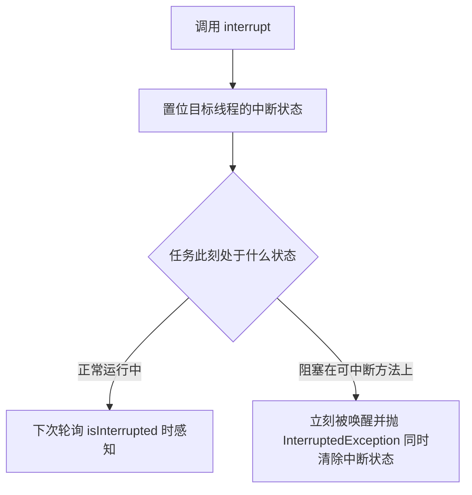

### 取消的难题

没有“抢占式安全停止线程”的方法（`Thread.stop` 已废弃——直接释放锁会破坏数据一致性，Java 20 起更被改为无条件抛出 UnsupportedOperationException，彻底不可用；`suspend`/`resume` 同样废弃——死锁风险）。取消的本质是**协作式的**：请求方发出“请停下来”，任务在合适的时机**自愿配合**。

> There is no safe way to preemptively stop a thread in Java, and therefore no safe way to preemptively stop a task. There are only cooperative mechanisms, by which the task and the code requesting cancellation follow an agreed-upon protocol.
>
> 遗憾的是，Java 里没有安全抢占式停止线程的办法，因此也没有安全抢占式取消任务的手段。只有协作机制：由任务与请求取消的一方共同遵守一份约定好的协议。——原书第 7 章开篇

一个取消操作涉及三方，每方都有话要说：

- **请求方**：怎么触发取消（标志位、中断、Future.cancel）；
- **被取消的任务**：如何响应（立即退出？做完当前单元？忽略？）；
- **其他相关代码**：如何感知取消结果（拿到部分结果？异常？）。

**取消标志位的问题**：

```java
private volatile boolean cancelled;
public void run() {
    while (!cancelled) { ... }
}
```

对可轮询的任务够用（素数生成器 PrimeGenerator：每算一个检查一次标志）；但**任务一旦阻塞**（take/sleep/等 IO），永远检查不到标志——需要**中断**来打断阻塞：

```java
// 破碎的素数生产者：取消标志置位了，但生产者阻塞在 put 上，永远醒不来
class BrokenPrimeProducer extends Thread {
    private final BlockingQueue<BigInteger> queue;
    private volatile boolean cancelled = false;

    BrokenPrimeProducer(BlockingQueue<BigInteger> queue) { this.queue = queue; }
    public void run() {
        try {
            BigInteger p = BigInteger.ONE;
            while (!cancelled)
                queue.put(p = p.nextProbablePrime());   // 队列满时阻塞——cancelled 置位也看不见
        } finally { ... }
    }
    public void cancel() { cancelled = true; }
}
// 修复：cancelled 换成“中断状态”，while (!Thread.currentThread().isInterrupted())，
//       cancel() 换成 interrupt()——阻塞中的 put 立刻被 InterruptedException 打断
```

### 中断（Interruption）

中断**不意味着停止**，只是“通知”——被中断线程自己决定怎么响应：

- `interrupt()`：发出中断（置位中断状态；若目标线程阻塞在 sleep/wait/join 上会立刻抛 InterruptedException）；
- `isInterrupted()`：查询中断状态；
- `Thread.interrupted()`：查询**并清除**（静态方法，唯一的清除途径）。

调用 interrupt 的效果取决于线程当时的状态：正常执行则仅置位；阻塞在可中断方法上则抛异常并**清除**中断状态。所以“中断状态”可能被中途经过的库代码消费掉——自定义取消逻辑通常要**保存/传递**它。一图概括两条命中路径：



**处理 InterruptedException 的准则**（本章最重要的一节）：

1. **传递异常**：方法自己也声明 throws InterruptedException，把决定权交给调用者；
2. **恢复中断状态**：不能抛时（Runnable 的 run 签名不允许抛），捕获后重新置位：

```java
public void run() {
    try {
        ...阻塞调用...
    } catch (InterruptedException e) {
        Thread.currentThread().interrupt();   // 恢复中断状态，让上层逻辑感知
        // 收尾后退出循环
    }
}
```

3. **绝不吞掉**：捕获后什么都不做等于剥夺调用者的取消能力，是最常见的并发 bug 之一。唯一可以“吃掉”中断的场景：你正是该线程中断策略的拥有者，且确定退出前不再有依赖中断的逻辑。

### 中断策略

- 任务应有**明确的中断策略**：收到中断是尽快退出？做完当前单元再退出？还是吞掉（既然这是不可取消的阶段）？——策略要写进文档；
- **区分“任务的中断”与“线程的中断”**：线程池的工作线程属于池，任务不该擅自“恢复并吞掉中断”——那会影响池里排队的下一个任务。Executor 的标准做法：shutdownNow 对池内所有任务统一发出中断，工作线程收到中断把它传给当前任务，任务自己决定行为；
- 复杂系统中**按层级传递取消**：上层“拥有”下层的执行与取消权，最顶层对用户负责——把“谁拥有线程”想清楚，取消策略自然就清晰了。

### 处理不可中断的阻塞

中断不是万能的——**部分阻塞操作不响应中断**：

| 阻塞类型 | 中断有效？ | 打断手段 |
| --- | --- | --- |
| sleep/wait/join、Lock 的 lockInterruptibly | ✅ | interrupt() |
| 内置锁 synchronized 的等待 | ❌ | 无（只能等持有者释放） |
| java.io 旧式 Socket IO 读写 | ❌ | **关闭 socket**（read 抛 SocketException） |
| Selector.select | ✅ | interrupt 或 wakeup |
| 自旋式等待条件成立 | ❌ | 改用可中断的条件等待（Condition） |

覆写 interrupt 来“连坐”关闭 socket：

```java
// 中断阻塞在 socket 读上的线程：覆写 interrupt，关闭 socket 让 read 抛异常
public class ReaderThread extends Thread {
    private final Socket socket;
    private final InputStream in;

    public ReaderThread(Socket socket) throws IOException {
        this.socket = socket;
        this.in = socket.getInputStream();
    }
    public void interrupt() {                  // 覆写：中断 + 关 socket 双管齐下
        try {
            socket.close();                    // read() 会抛 SocketException——这就是“中断”
        } catch (IOException ignored) { }
        super.interrupt();                     // 别忘了标准中断
    }
    public void run() {
        try {
            byte[] buf = new byte[BUF_SIZE];
            int bytesRead;
            while ((bytesRead = in.read(buf)) > -1)
                processBuffer(buf, bytesRead);
        } catch (SocketException e) {          // socket 被 interrupt() 关闭——正常退出
        } catch (IOException e) { ... }
    }
}
```

**用 newTaskFor 封装非标准取消**（任务知道自己该如何被取消，Future.cancel 委托给它）：

```java
// CancellableTask：知道如何取消自己的 Callable
public interface CancellableTask<T> extends Callable<T> {
    void cancel();
    RunnableFuture<T> newTask();
}

// 携带 socket 的任务基类：cancel() = 关 socket；newTask() 返回“取消时先关 socket 的 FutureTask”
public abstract class SocketUsingTask<T> implements CancellableTask<T> {
    @GuardedBy("this") private Socket socket;
    protected synchronized void setSocket(Socket s) { socket = s; }
    public synchronized void cancel() {
        try { if (socket != null) socket.close(); } catch (IOException ignored) { }
    }
    public RunnableFuture<T> newTask() {
        return new FutureTask<T>(this) {                     // 覆写 FutureTask.cancel
            public boolean cancel(boolean mayInterruptIfRunning) {
                try {
                    SocketUsingTask.this.cancel();           // 任务专属的非标准取消（关 socket）
                } finally {
                    return super.cancel(mayInterruptIfRunning);  // 标准取消（置状态/中断）
                }
            }
        };
    }
}

// 让 Executor 使用自定义的 future 工厂——覆写 newTaskFor 的池：
public class CancellingExecutor extends ThreadPoolExecutor {
    protected <T> RunnableFuture<T> newTaskFor(CancellableTask<T> ctask) {
        return ctask.newTask();
    }
}
// 使用：SocketUsingTask task = ...; Future f = exec.submit(task); f.cancel(true);  // 会自动关 socket
```

这体现了原书的一贯思想：**把“怎么取消”的知识放在拥有它的层**（任务最清楚自己占着什么资源），把“何时取消”留给拥有它的上层。

### 用 Future 取消

```java
Future<?> task = exec.submit(runnable);
// mayInterruptIfRunning=true：已在运行也中断它；false 只取消还没开始的
task.cancel(true);
```

cancel 之后 get 必然抛 CancellationException。**不要在不拥有任务的地方中断线程池的工作线程**——只有任务的拥有者才知道它的中断策略（“谁知道这个任务能不能被安全地中断”）。

**限时运行的通用工具**：错误版（计时到了直接中断当前调用线程）会“误伤”——任务提前结束后，超时中断照样打过来，殃及无辜的后续代码；正确版（提交给 Executor + 超时 get + finally 里 cancel）：

```java
// 有限时间内运行任意 Runnable：Future 版（正确）
private static final ExecutorService taskExec = Executors.newCachedThreadPool();

public static void timedRun(Runnable r, long timeout, TimeUnit unit) throws Throwable {
    Future<?> task = taskExec.submit(r);
    try {
        task.get(timeout, unit);              // 等 timeout：完成/超时/异常/取消
    } catch (TimeoutException e) {
        // 接下来在 finally 里取消
    } catch (ExecutionException e) {
        // 任务中抛出的异常——剥壳重抛给调用者
        throw launderThrowable(e.getCause());
    } finally {
        task.cancel(true);                    // 幂等：已完成则无害；运行中则中断它
    }
}
```

注意它只保证“任务收到了取消请求”（cancel），**不保证任务真的停下**——不响应中断的任务仍可能继续跑。可靠关闭 = cancel + 明确的中断策略 + 有限时间的等待确认。

### 停止基于线程的服务

**服务的生命周期应由创建它的所有者管理**（所有权原则：线程池拥有工作线程，就该由池的拥有者来关闭它）。JVM（Java Virtual Machine，Java 虚拟机）的关闭钩子由运行时管理，也是这个道理——库代码不应“自作主张”地关停线程/线程池，把关闭入口留给拥有者。

**两阶段终止模式（以日志服务为例）**：第一阶段停止接收新请求（置标志、拒绝 log），第二阶段清空队列中的存量日志后退出（书中用“预订计数”保证一条不丢）：

```java
public class LogService {
    private final BlockingQueue<String> queue;
    private final LoggerThread loggerThread;
    private final PrintWriter writer;
    @GuardedBy("this") private boolean isShutdown;        // ① 关闭请求标志
    @GuardedBy("this") private int reservations = 0;      // ② 已入队但未被消费的日志数

    public LogService(BlockingQueue<String> queue, PrintWriter writer) {
        this.queue = queue; this.writer = writer;
        this.loggerThread = new LoggerThread();
    }
    public void start() { loggerThread.start(); }

    public void stop() {
        synchronized (this) { isShutdown = true; }        // 第一阶段：拒绝新日志
        loggerThread.interrupt();                         // 唤醒可能正阻塞的消费者
    }

    public void log(String msg) throws InterruptedException {
        synchronized (this) {
            if (isShutdown) throw new IllegalStateException("logger is shut down");
            ++reservations;                               // 先记账，再入队
        }
        queue.put(msg);                                   // put 可能阻塞——必须在锁外（否则与消费者死锁）
    }

    private class LoggerThread extends Thread {
        public void run() {
            try {
                while (true) {
                    try {
                        synchronized (LogService.this) {
                            if (isShutdown && reservations == 0)   // 收到关闭且存量清空 → 退出
                                break;
                        }
                        String msg = queue.take();
                        synchronized (LogService.this) { --reservations; }
                        writer.println(msg);
                    } catch (InterruptedException e) { /* 重试：回头再检查退出条件 */ }
                }
            } finally {
                writer.close();
            }
        }
    }
}
```

**设计关闭的逻辑陷阱**：log() 若在锁内执行 queue.put() 会死锁——put 因队满而阻塞时始终持锁，消费者的 take 想进同步块更新 reservations 却拿不到锁，生产与消费互相卡死。生产者-消费者式服务的关闭必须**两侧都安全**：既要停止接收新输入，又要消费完存量。

**毒丸（poison pill）**：往队列放一个各方公认的终结对象，消费者取到即知该退出——在**无界队列且生产者/消费者数量已知**的前提下是可靠的优雅关闭手段（有界队列满时毒丸可能塞不进去；多个生产者要各放一颗）。索引服务的经典实现：

```java
public class IndexingService {
    private static final File POISON = new File("");       // 毒丸：这个“文件”代表停止
    private final BlockingQueue<File> queue;
    private final CrawlerThread producer = new CrawlerThread();
    private final IndexerThread consumer = new IndexerThread();
    ...
    public void start() { producer.start(); consumer.start(); }

    class CrawlerThread extends Thread {                   // 生产者：爬完树后放毒丸
        public void run() {
            try {
                crawl(root);
            } catch (InterruptedException e) { /* fall through：被中断也要放毒丸 */ }
            finally {
                while (true)
                    try { queue.put(POISON); break; }      // 一定要送达（哪怕重试）
                    catch (InterruptedException e1) { /* retry */ }
            }
        }
        private void crawl(File root) throws InterruptedException { ... }
    }
    class IndexerThread extends Thread {                   // 消费者：收到毒丸即有序退出
        public void run() {
            try {
                while (true) {
                    File file = queue.take();
                    if (file == POISON) break;             // 排在毒丸之前的存量都已处理完
                    else indexIn(file);
                }
            } catch (InterruptedException consumed) { }
        }
    }
}
```

关闭 ExecutorService 的标准写法——官方 Javadoc 推荐的两段式模板：

> Attempts to stop all actively executing tasks, halts the processing of waiting tasks, and returns a list of the tasks that were awaiting execution.
>
> 尝试停止所有正在执行的任务，不再处理排队的任务，并返回等待执行的任务列表。——ExecutorService.shutdownNow Javadoc

```java
void shutdownAndAwaitTermination(ExecutorService pool) {
    pool.shutdown();                                // 第一阶段：拒绝新任务
    try {
        if (!pool.awaitTermination(60, TimeUnit.SECONDS))
            pool.shutdownNow();                     // 第二阶段：升级为强制取消剩余任务
        if (!pool.awaitTermination(60, TimeUnit.SECONDS))
            System.err.println("Pool did not terminate");
    } catch (InterruptedException ie) {
        pool.shutdownNow();
        Thread.currentThread().interrupt();         // 恢复中断
    }
}
```

### JVM 关闭

- **关闭钩子（shutdown hook）**：`Runtime.addShutdownHook(thread)`——JVM **正常关闭**时执行，用来做资源清理（刷日志、删临时文件）。钩子里要快、要线程安全（关闭期间其他线程还在跑）；多个钩子并发执行、顺序无保证；钩子中不要再阻塞等待其他钩子的结果；
- **守护线程（daemon thread）**：JVM 退出时**不等**守护线程——它们连同没做完的工作一起被直接抛弃。所以守护线程只适合“可随时丢弃”的工作；反过来，凡需要收尾清理的动作（flush 日志、关闭文件）都不能交给守护线程。线程的守护性继承自创建它的线程，isDaemon() 可查询；
- 非正常终止（kill -9、Runtime.halt、OS 层面的 kill、JVM crash）不会执行任何钩子——**唯一的补救是在系统外部安排兜底**（如定期落盘标记文件，下次启动检测后清理）。

### 要点小结

| 场景 | 手段 |
| --- | --- |
| 轮询型任务 | volatile 标志 / 中断状态检查 |
| 阻塞型任务 | interrupt + 正确处理 InterruptedException |
| 阻塞在不可中断操作（socket IO 等） | 关闭底层资源 / newTaskFor 封装非标准取消 |
| 异步任务 | Future.cancel(true) |
| 服务优雅关闭 | 两阶段终止 / 毒丸 / shutdown + awaitTermination 兜底 shutdownNow |
| JVM 收尾 | 关闭钩子（快而安全）；守护线程只用于可丢弃的工作 |
| 绝不做 | 吞中断、调 stop()、在不确信拥有权时中断线程 |

> 【演进】取消的心智模型至今没有变：Java 21 正式落地的虚拟线程被中断时照样抛 InterruptedException，走的仍是协作式那套协议。结构化并发（Structured Concurrency）想把“父任务等待并统一取消全部子任务”包装成语言级 API，但自 JDK 19 孵化器版起历经多轮预览、API 形态几经重新设计，截至 Java 25 仍未定稿，先观望为宜。Kotlin 协程的 cooperative cancellation、响应式流的 Subscription.cancel，本质上都是这套“协作式取消”思想在不同生态里的翻版。
