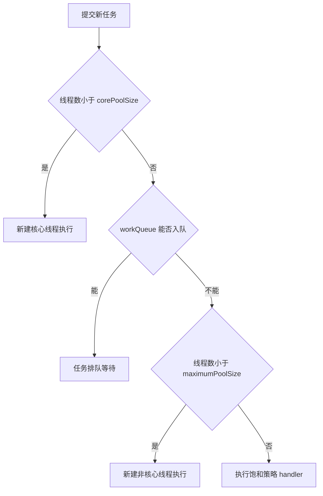

### 任务与执行策略的隐含耦合

Executor 的美妙在于“任务提交与执行解耦”，但**有些任务不适合任意执行策略**，强行搭配会产生错误：

1. **依赖任务会饥饿死锁**：单线程池里提交的任务又等待同池的子任务——工作线程互相等待，永不完成：

```java
// 死锁：单线程池中，RenderPage 提交子任务后等待它，而子任务排在
// 同一个（唯一）工作线程的队列里，永远轮不到执行
ExecutorService exec = Executors.newSingleThreadExecutor();
Future<?> renderPage = exec.submit(() -> {
    Future<?> header = exec.submit(() -> renderHeader());   // 排在队列后面
    Future<?> body = exec.submit(() -> renderBody());
    header.get();   // 等待“永远轮不到”的任务 —— 线程饥饿死锁
    body.get();
});
```

线程饥饿死锁的表现：池里所有工作线程都在等**排在同一个池队列里**的任务——不是锁死锁，但同样永久阻塞（不止单线程池，“任务等待子任务 + 池容量不足”就会发生）。

2. **长时间运行的任务**：占住线程，拖慢甚至饿死短任务（应该隔离到专用池；书中建议：限时等待后“告警并放弃”，或让任务自己管理时间片——`Thread.yield()` 一类的机制）；
3. **依赖 ThreadLocal 的任务**：线程复用让 ThreadLocal 的假设失效（扩展的执行策略改变了线程语义——子任务跑在别的线程，上下文丢了）；
4. **任务对响应时间敏感 / 需要特定执行环境**（GUI 线程）。

结论：**提交任务时就把执行策略约束说清楚**（文档化“该任务要求的池类型”）。线程池的工作队列/大小/策略不该是“运维细节”，而是**应用架构的一部分**——每个池该“服务哪些任务、多大、满怎么办”，在代码评审时就确定。

### 携带结果的任务：页面渲染的演进

书中经典案例——渲染 HTML 页面，逐步并行化：

**1. 串行**：下载所有图片 → 一起渲染（总时间 = Σ每张图）。

**2. Future 并行**：先渲染文本（体验改善），同时提交图片下载任务，再逐个 get：

```java
// 提交所有下载任务
List<ImageInfo> infos = scanForImageInfo(source);
Callable<ImageData> task = () -> downloadImage(info);   // 每张图一个 Callable
Future<ImageData> future = executor.submit(task);
renderText(source);                                      // 渲染文本与下载并行

// 渲染图片（阻塞等待每个结果）
for (Future<ImageData> f : futures)
    renderImage(f.get());
```

问题：**get 按提交顺序等待**——图 A 很慢，即使图 B 已完成也要等 A 先拿到才渲染 B（完成顺序 ≠ 提交顺序）。

**3. CompletionService：按完成顺序取结果**：

```java
// ExecutorCompletionService = Executor + 完成队列
ExecutorCompletionService<ImageData> completionService =
        new ExecutorCompletionService<>(executor);
for (ImageInfo info : infos)
    completionService.submit(() -> downloadImage(info));  // 完成的任务进入队列

renderText(source);
for (int i = 0; i < infos.size(); i++) {
    Future<ImageData> f = completionService.take();       // 谁先完成取谁
    renderImage(f.get());
}
```

**4. 为任务设置超时**：页面“总预算”内能下多少画多少——invokeAll（带总时限）或逐个 `get(remaining, unit)`，超时的任务取消（渲染占位符），用户拿到的是“预算内最优”的页面。

这个案例的教训：**并行化先找“任务的自然边界”（文本 vs 图片），再找“结果消费的顺序”（完成序 vs 提交序），最后加“预算约束”（超时与降级）**。

### 线程池的大小与配置

经验公式（IO/CPU 混合型负载）：

$$N_{threads} = N_{cpu} \times U_{cpu} \times \left(1 + \frac{W}{C}\right)$$

其中 $N_{cpu}$ 是 CPU 核数，$U_{cpu}$ 是目标 CPU 利用率（$0 \sim 1$），$W/C$ 是等待时间与计算时间之比。

- **CPU 密集**：N + 1（多出的一个在偶尔的缺页/暂停时补位）；**IO 密集**（W/C 大）：更多线程填满等待空隙；
- W/C 怎么测：用 Profiler 或工具测量“等待 IO 的时间占比”；
- 还要受**资源约束**限制：数据库连接数、内存、文件句柄——线程再多，下游资源不够能力不涨反降；一个池里既有 CPU 密集又有 IO 密集的任务，应该**分池**（各自配策略，互不拖累）。

### 配置 ThreadPoolExecutor

线程池工厂方法只是常用参数组合的快捷方式，ThreadPoolExecutor 的构造函数才是完全体：

```java
public ThreadPoolExecutor(int corePoolSize,          // 核心线程数：即使空闲也保留（除非 allowCoreThreadTimeOut）
                          int maximumPoolSize,        // 最大线程数
                          long keepAliveTime, TimeUnit unit,   // 超过核心的空闲线程存活时间
                          BlockingQueue<Runnable> workQueue,  // 任务排队策略
                          ThreadFactory threadFactory,         // 线程怎么创建（命名、守护性、优先级）
                          RejectedExecutionHandler handler)    // 饱和时的处理
```

**提交新任务时的判定顺序**（顺序很重要，是排错常识）。一图流——注意它与直觉相反的点：**当前线程数达到 core 后，哪怕有线程闲着也是先排队；只有队列也满了才继续建线程**：



只有四个分支全走不通，`handler` 才登场。

**队列的选择**：

| workQueue | 行为 | 风险/适用 |
| --- | --- | --- |
| SynchronousQueue | 不排队，直接交接 | 要求 max 无界（newCachedThreadPool）；满则触发拒绝 |
| 无界队列（LinkedBlockingQueue 默认） | 永不拒绝 | **任务无界积压 → 内存耗尽**（newFixedThreadPool 的隐患） |
| 有界队列（ArrayBlockingQueue / 有容量的 Linked） | 排队有上限 | 满则创建线程至 max → 再满则饱和策略 |

**工厂方法的真面目**（拆开看）：

> Creates a thread pool that reuses a fixed number of threads operating off a shared unbounded queue.
>
> 创建一个复用固定数量线程的线程池，这些线程运行在一条共享的无界队列上。——Executors.newFixedThreadPool Javadoc

一句话点破：工厂方法的便利性背后是无界队列这类默认选择。

| 工厂方法 | 等价的配置 |
| --- | --- |
| newFixedThreadPool(n) | core = max = n，keepAlive = 0，无界 LinkedBlockingQueue |
| newSingleThreadExecutor | core = max = 1，无界队列（外加不可改配置的包装） |
| newCachedThreadPool | core = 0，max = ∞，keepAlive = 60s，SynchronousQueue |
| newScheduledThreadPool(n) | ScheduledThreadPoolExecutor + 延迟队列 |

注意 newFixedThreadPool 和 newSingleThreadExecutor 都用**无界队列**——任务堆积不拒绝，直到 OOM。**重要服务请显式 new ThreadPoolExecutor(...)：有界队列 + 明确的拒绝策略**。

### 饱和策略（RejectedExecutionHandler）

队列满且线程达 max 时，新提交的任务交给 RejectedExecutionHandler 处理：

| 策略 | 行为 | 适用 |
| --- | --- | --- |
| AbortPolicy（默认） | 抛 RejectedExecutionException | 让调用者感知过载、自行处理 |
| CallerRunsPolicy | **提交任务的线程自己执行** | 天然的“减速器”：生产者被拖住，提交速率自动下降（背压）——不能容忍丢弃时首选 |
| DiscardPolicy | 静默丢弃 | 允许失败的辅助任务 |
| DiscardOldestPolicy | 丢掉队列最老的任务再重试提交 | 只在乎“最新”的任务（如实时行情） |

CallerRunsPolicy 的官方语义正好描述了这种背压：

> A handler for rejected tasks that runs the rejected task directly in the calling thread of the execute method, unless the executor has been shut down, in which case the task is discarded.
>
> 一个处理被拒绝任务的 handler：除非执行器已经 shutdown（此时直接丢弃任务），否则就在 execute 方法的调用者线程里亲自运行被拒绝的任务。——ThreadPoolExecutor.CallerRunsPolicy Javadoc

饱和时还可“先关闭非核心任务腾资源”。更精细的**用信号量在提交前限流**——比拒绝更温和：提交者阻塞等待而不是被弹回：

```java
// 信号量版有界执行器：把“有界”从池内部挪到提交端
public class BoundedExecutor {
    private final Executor exec;
    private final Semaphore semaphore;

    public BoundedExecutor(Executor exec, int bound) {
        this.exec = exec;
        this.semaphore = new Semaphore(bound);
    }
    public void submitTask(final Runnable command) throws InterruptedException, RejectedExecutionException {
        semaphore.acquire();                  // 先拿许可（满则阻塞 = 背压）
        try {
            exec.execute(() -> {
                try { command.run(); }
                finally { semaphore.release(); }
            });
        } catch (RejectedExecutionException e) {
            semaphore.release();              // 提交失败要还许可
            throw e;
        }
    }
}
```

（Semaphore.release 由“不是获取者的线程”调用——正是第 4 篇说的“信号量与锁的区别”的用武之地。）

### 线程工厂（ThreadFactory）

线程的“出身”由 ThreadFactory 决定——**生产环境必备的自定义项**：命名（排错时 `jstack` 里能看出是哪个池的线程）、守护性、优先级、UncaughtExceptionHandler：

```java
// 自定义线程工厂：命名 + 未捕获异常处理
public class MyAppThread extends Thread {
    public static final String DEFAULT_NAME = "MyApp-Thread";
    private static final AtomicInteger created = new AtomicInteger();
    private static final AtomicInteger alive = new AtomicInteger();

    public MyAppThread(Runnable r) { this(r, DEFAULT_NAME); }
    public MyAppThread(Runnable runnable, String name) {
        super(runnable, name + "-" + created.incrementAndGet());
        setUncaughtExceptionHandler((t, e) ->
                System.err.println("UNCAUGHT in thread " + t.getName() + ": " + e));  // 不再“无声地死”
        // setDaemon(true); setPriority(...) 按需
    }
    @Override public void run() {
        try { super.run(); } finally { alive.decrementAndGet(); }
    }
    public static int getThreadsCreated() { return created.get(); }
    public static int getThreadsAlive() { return alive.get(); }
}

ThreadPoolExecutor exec = new ThreadPoolExecutor(..., new ThreadFactory() {
    public Thread newThread(Runnable r) { return new MyAppThread(r); }
});
```

**未捕获异常的后果**：run 抛出未捕获异常 → 线程死亡 → 池补一个新线程（但异常没有任何日志！）。所以要么任务自己 catch 全部异常，要么给线程装 UncaughtExceptionHandler。

### 定制 ThreadPoolExecutor 的行为：钩子方法

ThreadPoolExecutor 提供三个可覆写的生命周期钩子——beforeExecute / afterExecute / terminated，可以用来**给任务加装饰**（记录、统计、清理 ThreadLocal、重新初始化状态）：

```java
// 统计任务耗时的线程池
public class TimingThreadPool extends ThreadPoolExecutor {
    private final ThreadLocal<Long> startTime = new ThreadLocal<>();
    private final AtomicLong numTasks = new AtomicLong();
    private final AtomicLong totalTime = new AtomicLong();

    public TimingThreadPool(int core, int max, long keepAlive, TimeUnit unit,
                            BlockingQueue<Runnable> workQueue) {
        super(core, max, keepAlive, unit, workQueue);
    }
    protected void beforeExecute(Thread t, Runnable r) {
        super.beforeExecute(t, r);
        System.out.printf("Thread %s: start %s%n", t.getName(), r);
        startTime.set(System.nanoTime());
    }
    protected void afterExecute(Runnable r, Throwable t) {
        try {
            long elapsed = System.nanoTime() - startTime.get();
            numTasks.incrementAndGet();
            totalTime.addAndGet(elapsed);
            System.out.printf("Thread %s: end %s, elapsed=%dns%n",
                              Thread.currentThread().getName(), r, elapsed);
        } finally {
            super.afterExecute(r, t);
        }
    }
    protected void terminated() {                       // 池关闭完成后：打印总账
        System.out.println("Terminated: avg time = " + totalTime.get() / numTasks.get() + "ns");
    }
}
```

### 并行化的递归算法

**谜题求解器（puzzle solver）**——深度优先搜索的并行化，展示“递归 + 线程池 + 一次性结果闩锁”的组合。核心组件 ValueLatch：**结果只设置一次、等待者全部同时放行**（CountDownLatch + 值）：

```java
@Immutable
public class ValueLatch<T> {
    @GuardedBy("this") private T value = null;
    private final CountDownLatch done = new CountDownLatch(1);

    public boolean isSet() { synchronized (this) { return value != null; } }
    public synchronized void setValue(T newValue) {
        if (value == null) { value = newValue; done.countDown(); }   // 只设置一次
    }
    public T getValue() throws InterruptedException {
        done.await();                       // 没有结果就一直等（等“第一个解”）
        synchronized (this) { return value; }
    }
}
```

并行求解器——每个位置一个任务，找到解就“广播”给所有等待者：

```java
public class ConcurrentPuzzleSolver<P, M> {
    private final Puzzle<P, M> puzzle;
    private final ExecutorService exec;
    private final ConcurrentMap<P, Boolean> seen = new ConcurrentHashMap<>();   // 已探索位置（去重）
    protected final ValueLatch<Node<P, M>> solution = new ValueLatch<>();

    public List<M> solve() throws InterruptedException {
        try {
            exec.execute(newTask(puzzle.initialPosition(), null, null));
            // 阻塞等待：第一个找到解的线程 setValue 后，这里被唤醒
            Node<P, M> solnNode = solution.getValue();
            return (solnNode == null) ? null : solnNode.asMoveList();
        } finally {
            exec.shutdown();               // 拿到解（或放弃）后关闭池
        }
    }
    protected Runnable newTask(P p, M m, Node<P, M> n) { return new SolverTask(p, m, n); }

    class SolverTask extends Node<P, M> implements Runnable {
        ...
        public void run() {
            // 已有解 或 该位置已被探索过 → 直接返回（竞态下第二个也不亏）
            if (solution.isSet() || seen.putIfAbsent(pos, true) != null)
                return;
            if (puzzle.isGoal(pos))
                solution.setValue(this);                    // 找到解：只记录第一个
            else
                for (M m : puzzle.legalMoves(pos))         // 每个合法后继：再提交一个任务（递归展开）
                    exec.execute(newTask(puzzle.move(pos, m), m, this));
        }
    }
}
```

**要点**：① 搜索树每个节点一个任务——递归变成了“提交任务的循环”；② ConcurrentHashMap 的 putIfAbsent 做全局“已访问”去重（原子 check-then-act，第 4 篇）；③ 找到解后**要停止再提交新任务**（否则树太大时任务爆炸——isSet 检查 + 池的关闭时机都要管）。

**递归并行的一般化**——串行循环升级为并行提交：

```java
// 串行：处理每个元素
void processSequentially(List<Element> elements) {
    for (Element e : elements) process(e);
}
// 并行：每个元素一个任务
void processInParallel(Executor exec, List<Element> elements) {
    for (Element e : elements) exec.execute(() -> process(e));
}
```

递归也一样：**每个递归调用一个任务，再用边界控制**（元素太少/太深就退化回串行——并行化的收益要覆盖任务创建开销，用“工作批次阈值”控制）。

> 【演进】这条“递归分治 + 结果汇聚”的路线今天由 **ForkJoinPool**（Java 7）标准化：work-stealing 调度 + 细粒度任务（ForkJoinTask/RecursiveTask），避免每个元素一个任务的提交开销；**parallelStream**（Java 8）底层就是公共 ForkJoinPool。fork/join 版的谜题求解器比书中的“每节点一任务”高效得多。经验法则没变：任务粒度要够大（抵消调度成本）、要独立（无共享状态）、数量要受控（有界的递归深度/阈值）。

### GUI 应用程序（第 9 章精要）

Swing/AWT 展示了“单线程执行约束”的另一种解法——**事件派发线程（Event Dispatch Thread, EDT）**：

- **所有组件的访问都必须在 EDT 上**（Swing 的单线程规则）：组件内部状态不同步，靠“只有 EDT 能碰”这一封闭规则保证安全——第 2 篇“线程封闭”的应用（Swing 的组件不是线程安全的，也不打算做成线程安全的）；
- **EDT 上不能跑长任务**：EDT 同时负责事件分发与绘制，长任务 = 界面冻结；正确做法是“长任务交给后台线程（SwingWorker），完成后用 invokeLater 回 EDT 更新组件”；
- **单线程模型的本质**：大多数 GUI 工具包都选择它——组件的并发访问按“调用序”单线程化，代价是所有耗时操作都必须显式地跨线程（startModal 的例子展示了跨线程死锁的坑：模态对话框持有 EDT 等待用户，用户在别的线程持有锁等 EDT）；
- **SwingWorker**：doInBackground（后台）+ done（EDT 回调），就是“任务与执行分离 + 结果回调”在 GUI 的翻版。

> 【演进】Android 主线程（UI Thread）是同一思想的现代实现：主线程不能阻塞，否则触发 ANR（Application Not Responding，应用无响应）弹窗，后台工作交给 Handler/协程，UI 更新必须 post 回主线程。Jetpack Compose 乃至 Flutter、SwiftUI 都延续了“UI 单线程 + 后台并行”的结构。

### 小结

| 关注点 | 要点 |
| --- | --- |
| 任务与池的匹配 | 依赖任务会饥饿死锁；长任务隔离；ThreadLocal 慎用 |
| 池大小 | Ncpu × Ucpu × (1 + W/C)，受下游资源约束 |
| 队列 | 有界优先（无界队列 = 延迟的 OOM） |
| 饱和 | 显式拒绝策略；不能丢则 CallerRuns 或信号量背压 |
| 线程工厂 | 命名 + UncaughtExceptionHandler 是生产底线 |
| 扩展 | beforeExecute/afterExecute 钩子做统计与清理 |
| 递归并行 | 任务粒度与数量受控；ForkJoin 是现代答案 |

> 【演进】Java 8 的 **CompletableFuture** 把“提交-等待-组合”升级为声明式流水线（thenApply/thenCombine/allOf/anyOf），不需要手管 Future 列表；配合虚拟线程，阻塞式 get 的成本也大幅降低。编排复杂依赖时优先 CompletableFuture，简单并行批处理 invokeAll/CompletionService 依然好用。另外要注意：虚拟线程时代，“调大平台线程池凑吞吐”的路数对 IO 密集服务开始过时——阻塞不再是稀缺资源，容量规划的重点转移到下游连接数（数据库连接、HTTP 客户端连接上限）上。
