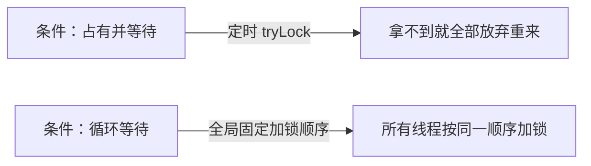

### 死锁（Deadlock）

**死锁：两个（或更多）线程互相持有对方需要的锁，永久等待。**经典的哲学家用餐问题就是死锁的原型：每位哲学家拿起左手筷子后等右手筷子——人人都拿着一根、等另一根，永远吃不上饭。死锁的四个必要条件（操作系统课的 Coffman 条件，破坏任一即可解）：

1. **互斥**：资源一次只能被一个线程持有；
2. **持有并等待**：持着已有资源再去等新资源；
3. **不可剥夺**：已获得的资源不能被强行抢走；
4. **循环等待**：等待关系成环。

本章给出的两条主流“破坏路径”，正好对应其中两个条件：



（互斥一般是锁存在的意义所在，不在可破坏之列；开放调用防的是下面另一类协作对象间的死锁。）

**锁顺序死锁**：两个线程以不同顺序获取相同的两把锁：

```java
// 经典的左右手锁
class LeftRight {
    private final Object left = new Object();
    private final Object right = new Object();

    public void leftRight() {
        synchronized (left)  { synchronized (right) { doSomething(); } }
    }
    public void rightLeft() {                    // 顺序相反
        synchronized (right) { synchronized (left)  { doSomething(); } }
    }
    // 线程A调 leftRight（拿了 left 等 right），线程B调 rightLeft（拿了 right 等 left）
    // —— 互相持有对方需要的锁，永远等待
}
```

这种“程序结构里写死的顺序”就是隐患本身；死锁要同时满足两个线程、相反顺序、时机交错才会发生——**又一次：测试通过不代表安全**。

**动态的锁顺序死锁**：转账时“先锁 from 再锁 to”，A→B 与 B→A 并发即死锁。看似代码里锁顺序一致（from→to），但**参数的传入顺序**使实际锁序相反：

```java
// 危险：transferMoney(myAccount, yourAccount) 与 transferMoney(yourAccount, myAccount) 并发
public void transferMoney(Account from, Account to, DollarAmount amount) {
    synchronized (from) { synchronized (to) { ... } }
}
```

**修复：定义全序**——按唯一可比的键（账户 id）排序加锁，任何调用路径下锁序都一致：

```java
// 身份哈希做全序比较 + tieLock 兜底哈希碰撞，保证任意两账户间的加锁顺序全局一致
private static final Object tieLock = new Object();
public void transferMoney(final Account fromAcct, final Account toAcct, final DollarAmount amount) {
    class Helper {
        public void transfer() {
            if (fromAcct.getBalance().compareTo(amount) < 0)
                throw new IllegalStateException();
            else {
                fromAcct.debit(amount);
                toAcct.credit(amount);
            }
        }
    }
    int fromHash = System.identityHashCode(fromAcct);   // 身份哈希：全序的可比键
    int toHash = System.identityHashCode(toAcct);
    if (fromHash < toHash) {
        synchronized (fromAcct) { synchronized (toAcct) { new Helper().transfer(); } }
    } else if (fromHash > toHash) {
        synchronized (toAcct) { synchronized (fromAcct) { new Helper().transfer(); } }
    } else {   // 哈希碰撞：先拿全局 tieLock 串行化，避免碰撞时两个线程以相反顺序加锁
        synchronized (tieLock) {
            synchronized (fromAcct) { synchronized (toAcct) { new Helper().transfer(); } }
        }
    }
}
```

（也可以拿账号这类唯一业务键做全序，或“锁分离 / 引入粗粒度锁”，代价各不相同；全序 + tie-breaker 是通用解。）

**协作对象间的死锁**

持锁期间调用**外来方法（alien method）**——外部回调可能又去获取别的锁，形成环。书中 Taxi/Dispatcher 的互相“礼貌通知”：

```java
// Taxi 与 Dispatcher 互相调用对方的方法（各自方法都同步）：
// 线程1：taxi.setLocation 锁 taxi → 调 dispatcher.notifyAvailable（锁 dispatcher）
// 线程2：dispatcher.markAvailable 锁 dispatcher → 调 taxi.getLocation（锁 taxi）
// 交叉进行即死锁——每个对象都“持着自己的锁伸手要对方的锁”
class Taxi {
    @GuardedBy("this") private Point location, destination;
    private final Dispatcher dispatcher;
    public synchronized void setLocation(Point location) {
        this.location = location;
        if (location.equals(destination))
            dispatcher.notifyAvailable(this);   // 持 taxi 锁调外部方法！
    }
    public synchronized Point getLocation() { return location; }
}
class Dispatcher {
    @GuardedBy("this") private final Set<Taxi> taxis;
    @GuardedBy("this") private final Set<Taxi> availableTaxis;
    public synchronized void notifyAvailable(Taxi taxi) { availableTaxis.add(taxi); }
    public synchronized Image getImage() {
        Image image = new Image();
        for (Taxi t : taxis)
            image.drawMarker(t.getLocation());  // 持 dispatcher 锁调 taxi 的同步方法！
        return image;
    }
}
```

**开放调用（open call）**：**在同步代码块之外调用外来方法**——把“构造参数、状态快照”在锁内准备好，回调/通知放到锁外：

> Calling a method with no locks held is called an open call.
>
> 调用时不持有任何锁的方法调用，就叫开放调用。——原书 §10.1

```java
// Taxi 的改进：锁内只更新自己的状态，通知动作放到锁外（开放调用）
class Taxi {
    private Point location, destination;              // 用私有锁/不在方法级同步
    private final Dispatcher dispatcher;
    ...
    void setLocation(Point location) {
        boolean reachedDestination;
        synchronized (this) {                          // 锁内：只碰自己的状态
            this.location = location;
            reachedDestination = location.equals(destination);
        }
        if (reachedDestination)                       // 锁外：调用外来方法（不会持锁进入别人的同步区）
            dispatcher.notifyAvailable(this);
    }
}

// Dispatcher 的改进：getImage 同样改为“锁内快照、锁外取值”
class Dispatcher {
    ...
    public Image getImage() {
        Set<Taxi> copy;
        synchronized (this) {                          // 锁内：拷一份引用快照
            copy = new HashSet<>(taxis);
        }
        Image image = new Image();
        for (Taxi t : copy)
            image.drawMarker(t.getLocation());         // 锁外：开放调用
        return image;
    }
}
```

开放调用既避免死锁，又缩小了锁范围（本来就该“快进快出”，见第 9 篇）——**在持锁时调用未知代码，活跃性与性能双重风险**。

### 死锁的避免与恢复

- **固定锁顺序**（全局排序）：适用于能明确排序的场景——把“哪些锁、按什么序获取”写进设计文档并全程遵守；
- **开放调用**：缩小锁范围，外来调用一律出锁后执行；
- **定时/可中断的锁**：tryLock(timeout) 拿不到就放弃、回退并释放已持有的锁，稍后重试——破坏“持有并等待”条件（数据库系统的死锁恢复就是这个思路；独占锁换 tryLock 是一种有代价的保险）；
- **JVM 无法自动恢复死锁**（数据库可以）——死锁发生后线程永久卡住，只能重启进程；

**诊断**：

- **jstack**（或 kill -3 / jcmd Thread.print）直接输出死锁检测——JVM 的死锁探测器能识别**内置锁**的循环等待（显式 Lock 的死锁 Java 6 起也能识别）：

```text
Found one Java-level deadlock:
=============================
"Thread-1":
  waiting to lock monitor 0x... (object 0x..., a java.lang.Object),
  which is held by "Thread-0"
"Thread-0":
  waiting to lock monitor 0x... (object 0x..., a java.lang.Object),
  which is held by "Thread-1"
```

- **程序化检测**：ThreadMXBean.findDeadlockedThreads()（返回死锁线程 id 数组；能同时查监视器锁与 ownable synchronizer）——可以定期巡检、发现后告警：

```java
ThreadMXBean mbean = ManagementFactory.getThreadMXBean();
long[] deadlockedIds = mbean.findDeadlockedThreads();   // 非空即发现死锁循环
if (deadlockedIds != null) alert(...);
```

- 避免靠“线程转储里锁的持有信息”反推设计——**预防优于检测**：评审时枚举“多锁获取的所有路径”，验证顺序一致。

**比例问题**：死锁是概率性事件——低负载测不出来，高负载 + 时机凑巧才爆发；一次死锁丢失的请求往往还伴随超时雪崩。这也是“原生锁顺序设计”要在代码评审期完成的原因。

### 资源死锁

锁之外的资源也可以死锁：两个任务各持有一个数据库连接，都等待对方的连接；线程池耗尽时互相等待对方释放线程（线程饥饿死锁，见第 7 篇——单线程池中的依赖任务是最典型形态）。资源死锁没有 jstack 式的自动检测（除非发生在锁层面），防御手段同样是：统一资源申请顺序、限制资源数、超时回退。

### 饥饿与活锁

- **饥饿（starvation）**：线程长期拿不到资源（锁被高频占用、优先级低的线程被压制）。要避免滥用线程优先级——**优先级是平台相关、无保证的提示**（不同 OS 策略不同），依赖优先级做正确性等于依赖运气；不要试图用改优先级来“调性能”，往往是把饥饿从一处搬到另一处；
- **糟糕的响应性**：如 GUI 后台任务占用锁太久——把耗时逻辑移出热点锁；服务类中的“锁内 IO”是响应性杀手；
- **活锁（livelock）**：线程没阻塞却在“反复尝试-失败-重试”（消息处理失败立即放回队列头部反复重发；两个互相让路的礼貌线程彼此同步退让，谁也过不去）。线程在做有用功吗？没有——只是活着。修复：引入**随机退避**打破对称性——这正是以太网 CSMA/CD（Carrier Sense Multiple Access with Collision Detection，载波侦听多路访问/冲突检测）的经典解法；或**有限重试 + 死信队列/人工介入**。

### 小结

| 危险 | 成因 | 药方 |
| --- | --- | --- |
| 锁顺序死锁 | 相反顺序获取相同的锁 | 全序加锁（id/哈希排序 + tie-breaker） |
| 协作死锁 | 锁内调外来方法 | 开放调用（锁内备料、锁外调用） |
| 线程饥饿死锁 | 池中任务等待池的任务 | 任务与执行策略解耦、分池 |
| 资源死锁 | 连接/线程互相等待 | 统一资源获取顺序、超时 |
| 饥饿 | 优先级滥用/锁被垄断 | 别用优先级；缩短持锁时间 |
| 活锁 | 互相重试/退让 | 随机退避、有限重试 |

> 【演进】死锁检测/诊断工具链比成书时完善得多：jcmd Thread.print、JFR（Java Flight Recorder）+ JDK Mission Control 可以回放分析；异步框架（Netty/CompletableFuture/协程）用“不持锁跨越异步边界”的结构天然规避了大量锁顺序问题——代价是把活跃性风险换成了“回调饿死/线程池打满”的新形态，应对思路仍是第 7 篇的任务隔离与背压。
