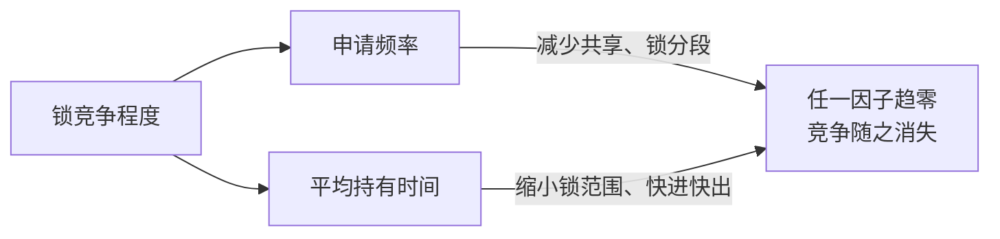

### 性能与可伸缩性

**性能**与**可伸缩性（scalability）**是两个目标：

- 性能：单任务/单请求的快慢（服务时间、延迟）；
- 可伸缩性：**增加资源时吞吐量的增长能力**（加 CPU 能不能成比例地处理更多工作）。

并发程序通常在两者间权衡：为并发付出的结构开销（锁、协调、上下文切换）换取多核扩展能力。**“更快”有两种含义**——同样的工作量更快完成（延迟），或者用更多的资源处理更多的工作（吞吐量）。单线程代码往往是“延迟最优”，多线程代码追求“吞吐可伸缩”——两者经常冲突（比如锁粒度：粗粒度延迟更好、细粒度可伸缩性更好）。设计并发程序时先想清楚**优化的是哪一个**。

若干普遍的权衡：粒度（数据结构/锁的大小）、同步（竞争 vs 安全）、共享（少共享好扩展但增加复制成本）、阻塞（阻塞简化了正确性推理，却限制了吞吐）。

性能优化的第一课是**克制**——原书：对性能的追逐“大概是并发 bug 的最大来源”（the quest for performance is probably the single greatest source of concurrency bugs），“同步太慢”的信念曾催生双检锁这类聪明反被聪明误的习语。动手优化前先答五问：

1. 你说的“更快”指什么？（延迟还是吞吐？）
2. 这条路径在什么条件下才真的更快——轻载还是重载？大/小数据集？有测量支撑吗？
3. 这些条件在你的场景里出现频率如何？
4. 这段代码会不会被用到条件不同的其他场景？
5. 你在用什么隐性成本（开发/维护风险）换这点性能？划算吗？

更狠的一句：**拿安全性换性能，可能两者皆失**（when you trade safety for performance, you may get neither）——多数开发者对“瓶颈在哪、哪个方案更快更可伸缩”的直觉是错的。优化要带着明确的性能目标与测量计划做，改完再测，验证真的拿到了收益。

### Amdahl 定律

**加速比受串行部分的限制**：

$$S(N) \le \frac{1}{F + (1 - F)/N}$$

其中 $F$ 是串行（不可并行）部分的比例，$N$ 是处理器数。

> The performance improvement to be gained from using some faster mode of execution is limited by the fraction of the time the faster mode can be used.
>
> 通过使用某种更快的执行方式所能获得的性能提升，受限于这种更快方式可以被使用的时间占比。——Gene Amdahl，1967

数值感受（F=0.1 时）：

| N（处理器数） | 10 | 100 | 1000 | → ∞ |
| --- | --- | --- | --- | --- |
| 加速比上限 | 5.3 | 9.2 | 9.9 | **10（=1/F）** |

- 串行 10%（F=0.1）时，无论多少核，加速比上限就是 10 倍——加到 100 核只比 10 核快不到一倍；
- **结论：消除热点串行段比增加处理器有效得多**——锁的竞争、全局队列、共享计数器都是串行点；
- 别忘了隐藏的串行段：框架调用链、共享容器、连接池。原书的实证（图 11.2）：同样的工作量，仅把 LinkedList（synchronizedList 包装）换成 ConcurrentLinkedQueue，伸缩性天差地别——前者 3 线程后吞吐开始下滑，到 4、5 线程时**每次队列锁访问都竞争**，吞吐被上下文切换吃掉；后者吞吐随线程数一路涨到处理器数才走平。差别就在串行化程度：一个整条 offer/remove 全程持一把锁，一个只串行化单个指针的原子更新。

### 线程引入的开销

并发不是免费的，开销有三大来源：

- **上下文切换**：保存/恢复现场（内核态切换、缓存污染——切换后缓存里全是上一个线程的数据），μs 级；Linux 上可用 vmstat 看 cs 列——**切换频繁说明线程数相对工作量过多**（内核态占用超过 10% 通常提示调度活动过重）；
- **内存同步**：无竞争的锁获取/释放也有固定成本（原书口径：多数处理器上约 20~250 个时钟周期）；synchronized 与 volatile 还可能用到内存屏障（memory barrier）特殊指令；volatile 的主要代价是**限制编译器/JIT（Just-In-Time Compiler，即时编译器）的重排优化**；有竞争时排队挂起；
- **阻塞**：挂起线程由 OS 调度（内核锁），抢不到锁时“自旋 vs 挂起”的权衡（自适应自旋）。JVM 自身的调度/统计也在消耗 CPU——这些 CPU 没有用于业务。

**别过度担心无竞争同步**——JVM 会优化掉“可证明不会竞争”的锁：

- **锁消除（lock elision）**：锁对象只有当前线程能访问时，加锁可以直接被优化掉：

```java
// 无效的同步——JVM 总能把它消除（原书 Listing 11.2，反面示例）
synchronized (new Object()) {
    // do something
}
```

更实用的是**逃逸分析（escape analysis）**驱动的消除：局部对象引用从未发布到堆、因此是线程私有的——栈封闭的变量自动线程安全：

```java
// 锁消除的候选（原书 Listing 11.3）：stooges 从未逃逸，朴素执行要对
// Vector 加解锁 4 次（3 次 add + 1 次 toString），编译器内联后看得到全部可消除
public String getStoogeNames() {
    List<String> stooges = new Vector<>();
    stooges.add("Moe");
    stooges.add("Larry");
    stooges.add("Curly");
    return stooges.toString();
}
```

- **锁粗化（lock coarsening）**：相邻、同一把锁的同步块合并为一次获取-释放——上面 4 次加锁可合成 1 次；不但省同步开销，还给优化器留出更大的整块代码。

> Don't worry excessively about the cost of uncontended synchronization. The basic mechanism is already quite fast, and JVMs can perform additional optimizations that further reduce or eliminate the cost. Instead, focus optimization efforts on areas where lock contention actually occurs.
>
> 不要过度担心无竞争同步的成本——机制本身已经很快，JVM 还能进一步减少甚至消除它。把优化精力放在真正发生锁竞争的地方。——原书 11.3.2

（提醒：锁粗化也可能反过来合并你手工拆开的同步块——缩小锁范围前先测量，11.4.1 脚注。）

注意方向性：多核时代单线程无法吃满所有核（目标是 keep the CPUs hot），但线程过多又会让调度与同步开销反噬吞吐——“合适”夹在中间，靠测量找。（原书脚注的极端例子：单 CPU 机器上的 CPU 密集型应用，池的最优线程数是 1。）

### 减少锁的竞争

**可伸缩性杀手是锁竞争（串行化）**——有竞争的锁让所有排队者空转/挂起。影响锁竞争的两个因子：**申请频率** × **持有时间**，两者任一趋零，竞争就消失：



手段按效果排列：

**1. 缩小锁的范围（快进快出）**

```java
// 反例：把昂贵的正则匹配放进锁里（持有时间被 CPU 密集操作拉长）
@ThreadSafe
class AttributeStore {
    @GuardedBy("this") private final Map<String, String> attributes = new HashMap<>();

    public synchronized boolean userLocationMatches(String name, String regexp) {
        String key = "users." + name + ".location";
        String location = attributes.get(key);
        if (location == null) return false;
        else return Pattern.matches(regexp, location);   // 锁内的昂贵计算！
    }
}

// 正解：锁内只做“取值”，正则匹配移出锁外——持锁时间缩到最短
@ThreadSafe
class BetterAttributeStore {
    @GuardedBy("this") private final Map<String, String> attributes = new HashMap<>();

    public boolean userLocationMatches(String name, String regexp) {
        String key = "users." + name + ".location";
        String location;
        synchronized (this) {
            location = attributes.get(key);              // 锁内：仅访问共享状态
        }
        if (location == null) return false;
        else return Pattern.matches(regexp, location);   // 锁外：纯计算
    }
}
```

注意：**锁的申请/释放本身有开销，两个小同步块未必比一个大块快**——缩范围的前提是“移出去的代码真的耗时”（IO、计算），不是为了切而切。

**2. 减小锁的粒度**

- **锁分解（lock splitting）**：一把锁保护多个独立状态 → 拆成多把锁各保护一个。ServerStatus 的用户集与查询集本无不变式关联：

```java
// 一把锁守护两组独立状态：users 与 queries 互不相关，却互相竞争
@ThreadSafe
public class ServerStatus {
    @GuardedBy("this") public final Set<String> users;
    @GuardedBy("this") public final Set<String> queries;
    public synchronized void addUser(String u) { users.add(u); }
    public synchronized void addQuery(String q) { queries.add(q); }
    public synchronized void removeUser(String u) { users.remove(u); }
    public synchronized void removeQuery(String q) { queries.remove(q); }
}

// 锁分解：各自的锁保护各自的状态——两组操作不再竞争
@ThreadSafe
public class ServerStatusAfter {
    @GuardedBy("users") public final Set<String> users;
    @GuardedBy("queries") public final Set<String> queries;
    public void addUser(String u) { synchronized (users) { users.add(u); } }
    public void addQuery(String q) { synchronized (queries) { queries.add(q); } }
    public void removeUser(String u) { synchronized (users) { users.remove(u); } }
    public void removeQuery(String q) { synchronized (queries) { queries.remove(q); } }
}
```

（前提：两组状态**真的独立**——若存在跨组不变式，分解就引入了竞态，参考第 3 篇 NumberRange。原书重构后的类名仍是 ServerStatus，此处改名 After 仅为对照阅读。锁分解在锁处于**中等竞争**时收益最大；锁越多，死锁风险也越高。）

- **锁分段（lock striping）**：分解的推广——**一组独立的锁对象**组成数组，按哈希选锁，访问不同段的线程互不阻塞；锁数与桶数**相互独立**（16 把锁可以守护任意多个桶）。ConcurrentHashMap 在 Java 8 之前（Java 5–7）的经典实现就是默认 16 段，理论上写并发度可达 16：

```java
// 锁分段的示意（改写自原书 StripedMap）：N_LOCKS 把锁覆盖 N_BUCKETS 个桶
private static final int N_LOCKS = 16;
private final Object[] locks = new Object[N_LOCKS];
private final Object[] buckets = new Object[N_BUCKETS];

Object lock = locks[hash(key) % N_LOCKS];       // 锁数与桶数解耦，不是每桶一锁
synchronized (lock) { ... 操作对应桶 ... }
```

分段的代价：难以独占整个容器——clear 这类批量操作要么逐段加锁、要么弱化语义（可能与其他并发操作交错）。

> 【演进】Java 8 起 ConcurrentHashMap 移除了 Segment 分段，改为 **CAS + 桶级 synchronized**，size 统计改为 baseCount + CounterCell（与 LongAdder 同构的分散计数）——“用分段对付热点”的思路没变，粒度更细了。定性地说，锁分解“一分为二”在多处理器面前收效有限，分段能把段数随处理器数扩上去，才是更可伸缩的形态（原书 11.2.2 的极限思维）。

**3. 避免热点域**

热点域（hot field）= 所有操作都要访问的共享点（如集中维护的计数器 size）——它把并行操作重新串行化。**缓存常用计算值这类“常规优化”恰恰会引入热点域、限制伸缩性**。ConcurrentHashMap 的做法：每个段维护**独立计数**（由段锁保护），size() 时逐段求和——返回的是**弱一致快照**（求和期间容器可能又变了），但每个数都是精确值；牺牲的是“全局原子视图”而非精确性。类似的还有 LongAdder 的分段累加（第 11 篇）。

**4. 替代方案**

- **读多写少 → 读写锁 ReentrantReadWriteLock**：读并行、写互斥（见第 10 篇）——多个读者并行意味着热点被分散；
- **简单计数 → 原子变量**：CAS 无锁（见第 11 篇），竞争下的伸缩性优于锁——把“热点计数器”从队列排队变成自旋重试，吞吐显著更稳；
- **更根本的是减少热点本身**：用不可变对象、并发容器、每线程私有状态消除共享——原书强调**减少热点数量（干脆不维护共享计数器）比“用原子变量替代锁”更有效**。

### 案例：Map 实现的吞吐量对比

**实验设计比数字重要**（原书 11.5）——N 个线程在紧密循环里随机取键：取不到则以 p=0.6 写入，取到则以 p=0.02 移除；对比 ConcurrentHashMap、ConcurrentSkipListMap 与 synchronizedMap 包装的 HashMap/TreeMap。结果（图 11.3）：CHM 与 ConcurrentSkipListMap **随线程数增加吞吐持续上升**（伸缩良好）；synchronizedMap 版本约 2 线程起就进入重竞争，吞吐断崖式下跌（所有操作串行化在一把锁上）。两个读数：①该实验“每线程制造的竞争比典型应用更多”（循环里除了怼 Map 几乎不干别的），真实程序每个迭代还有线程本地工作；②测量环境（8 核 Sparc V880、Java 6 预发布版）是 2006 年的，数字不可外推，**定性结论不变**：重竞争下同步容器断崖下跌。

**监控 CPU 利用率**（原书 11.4.6）——伸缩性测试的目标是让处理器保持繁忙。CPU 不饱和时，按概率排查四个方向：

1. **负载不足**——加大负载再看（注意瓶颈可能出在压测客户端而非被测系统）；
2. **IO 密集**——iostat 查磁盘、监控网络带宽；
3. **外部依赖**——数据库/远程服务才是瓶颈，用 profiler 或 DB 工具确认等待时间；
4. **锁竞争**——不用 profiler 也能查：随机抽几次线程转储，被阻塞线程的栈帧会标着 `waiting to lock monitor ...`。规律：**无竞争的锁几乎不出现在转储里，重竞争的锁几乎总有人在等**。

CPU 已打满时，看 vmstat 的“可运行但未获得 CPU”线程列——一直有 runnable 线程排队，加核才有收益。CPU 利用**不对称**（部分核热部分核闲）说明计算集中在一小撮线程里，先找并行度而不是加核。

**别搞对象池**（原书 11.4.7）——早期 JVM 分配与 GC 慢，催生了“对象池复用”的偏方；现代 JVM 上分配已极快（HotSpot 的 new Object 常见路径约 10 条机器指令，比 C 的 malloc 还快），**分配通常比同步便宜**（allocating objects is usually cheaper than synchronizing）。并发场景下池化更糟：分配走 TLAB（Thread-Local Allocation Buffer，线程本地分配缓冲）几乎不需线程间协调，而从池里取对象必须同步协调池本身——**因锁竞争阻塞一个线程的代价是分配一个对象的数百倍**，一点点池诱发的竞争就是伸缩性瓶颈。池还有一堆附带问题：池大小难调、对象状态复位遗漏引入隐蔽 bug、“归还后仍在使用”的悬空引用、旧对象引用新对象的模式给分代 GC 添乱。结论：池在受限环境（某些 J2ME/RTSJ 目标）仍有用武之地，**作为性能优化手段价值有限**——又一个“为优化而生、反成伸缩性危害”的技术。

### 减少上下文切换

原书本节的主体案例是**日志服务**：请求线程直接写日志（inline logging）时，I/O 阻塞与输出流锁竞争都会让线程被换出——服务时间被拉长、上下文切换增多。改成**单条队列 + 专职 logger 线程**：调用方只需把消息入队就返回（入队比日志 I/O 轻得多，基本不会阻塞），把“含 I/O 与锁竞争的不确定路径”变成“直线代码”。原书的比喻：一百个人各自提桶救火（水源与火场两头拥挤、人人不停切换模式）vs **传水桶（bucket brigade）**——水流恒定、每人专注一件事。代价（脚注 16）是要回答四个设计问题：中断语义（阻塞中的日志调用被中断怎么办）、服务保证（关停前刷完队列吗）、饱和策略（生产快于消费怎么办）、生命周期（怎么关停、怎么告知生产者）。

一般化：

- 任务数与线程数匹配（过多线程在等锁/等 IO 时频繁切换——vmstat 的 cs 列飙升）；
- 无锁结构、非阻塞算法减少挂起/唤醒（第 11 篇）；
- I/O 密集与 CPU 密集任务分池隔离（第 7 篇）；
- 缩短临界区、消除锁竞争本身就减少了“排队挂起”。

### 并发程序的测试（第 12 章精要）

并发测试分两大类：**正确性测试**（并发压力下不变式与后置条件仍成立）+ **性能测试**（吞吐、延迟、可伸缩性）。

**正确性测试**：

- 构造 **happens-before 压力**：多线程读写后校验总量/键值一致性（如 BoundedBuffer 测试：N 生产者 × M 消费者，最后校验放入 = 取出 = 期望集合）；
- 用 **CountDownLatch 同步起跑**（第 4 篇 TestHarness）：所有线程就绪后同时发令，制造真实竞争窗口——否则测的是“启动梯次”；
- 测试**阻塞行为本身**：空队列 take 应阻塞（用 Thread.getState 验证 WAITING、用中断验证“醒来后中断状态正确”）、满队列 put 应阻塞、超时版本要准时返回；
- 测试**资源泄露**：没有生产者时消费者正确休眠（不该自旋烧 CPU）、池/缓冲按时归还；
- 记录**非法状态**：不变式校验失败的瞬间抓到完整上下文（哪个线程、什么输入）。

**性能测试**：

- 区分指标：吞吐量（任务/秒）、延迟（**分位数比平均值重要**——p99 才是用户的体验）、可伸缩性（增加核数/线程数的吞吐曲线）；
- 测试要用**真实负载**：缓存命中/未命中、GC 影响、JIT 预热（丢弃前若干轮）都会改变结论；
- 用 **profiler / jstack / JFR / jcstress** 找竞争热点与切换热点——现代替代书中的自制框架：jcstress（OpenJDK）专测并发正确性（把交错穷举化），JMH 测微基准（避免死代码消除等陷阱）。

### 小结

优化顺序（先正确后性能——**测量驱动，不猜**）：

1. 正确的同步策略（不可变、封闭、并发容器）；
2. 测量（profiler、吞吐/延迟分位数）找**真正的**串行热点；
3. 缩小锁范围 → 分解/分段 → 读写锁/原子变量 → 更高级结构（异步、消息化）。

> 【演进】书中图 11.1/11.3 的测量数据成书于 2006 年的单/双核时代，今天核心数翻了两个数量级——Amdahl 的制约更狠了：100+ 核上 F=0.1 意味着 90% 的算力闲置。现代工具链（JFR/JMC、async-profiler、perf）让“测量先行”变得便宜；GC 与 NUMA（Non-Uniform Memory Access，非统一内存访问架构）的跨核缓存一致性成为新的隐形串行点。虚拟线程则把“减少阻塞开销”这条线推向了 OS 调度层。
