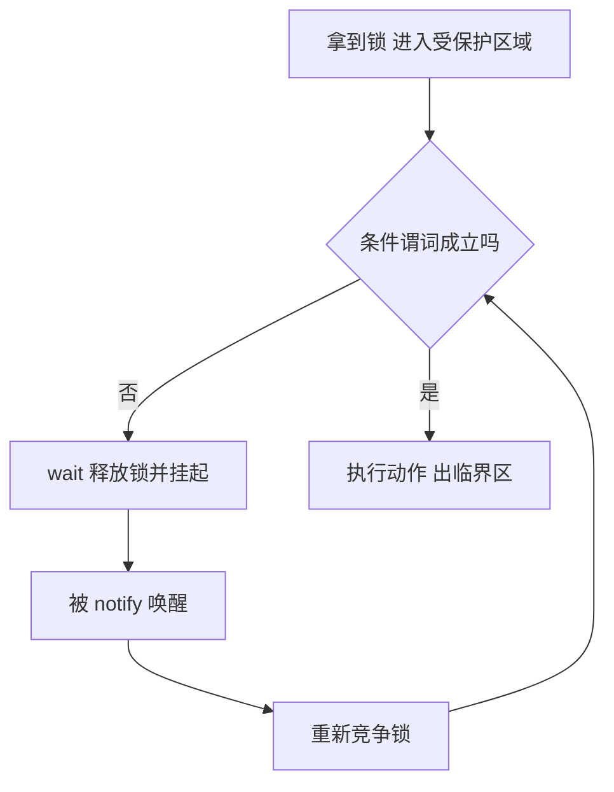

### 显式锁 Lock

Java 5 的 java.util.concurrent.locks 提供了 synchronized 之外的锁（Lock 接口），把“加锁/释放”从语言语法变成显式的 API 调用：

```java
Lock lock = new ReentrantLock();
lock.lock();
try {
    // 临界区
} finally {
    lock.unlock();   // 必须在 finally —— 锁的释放不再自动。
}
```

经典事故有两种：忘了 try/finally 包住 unlock（异常路径漏释放 = 永久锁死），以及把 lock() 放进 try 块内部——finally 可能对一把尚未持有的锁执行 unlock（抛 IllegalMonitorStateException）。规范形式是 **try 块必须始于 lock() 返回之后**。

**与内置锁对比的优势**：

- **获取与释放分离**（跨方法/作用域持锁——非块结构的锁，如链表遍历的锁耦合，hand-over-hand locking：锁住当前节点 → 拿到下一节点的锁 → 释放前者，逐节点“交接”前进）；
- **可中断的锁获取**：lockInterruptibly()——等待锁时响应中断（解决“无限等待”的取消问题，第 6 篇）；
- **定时获取**：tryLock(timeout) 拿不到就放弃——死锁恢复手段；
- **非阻塞获取**：tryLock() 立刻返回（拿得到就拿，拿不到走别的路）；
- **公平锁**：`new ReentrantLock(true)` 按先进先出（First In, First Out, FIFO）授予（默认非公平）。

```java
// 定时锁 + 可中断：拿不到就回退（避免死锁的关键手段）
if (lock.tryLock(1, TimeUnit.SECONDS)) {
    try { ... } finally { lock.unlock(); }
} else { /* 走备选路径 */ }
```

tryLock 的两类经典用法：

**概率性死锁避免**——上一章转账死锁的另一种解法（Listing 13.3）：两把锁都 tryLock，拿不齐就全部释放、退避后重试；退避时间含固定与随机两种成分（防活锁），超出总时限就优雅失败：

```java
// transferMoney 的 tryLock 版（Listing 13.3，节选）
long stopTime = System.nanoTime() + unit.toNanos(timeout);
while (true) {
    if (fromAcct.lock.tryLock()) {
        try {
            if (toAcct.lock.tryLock()) {
                try {
                    // 持有两把锁：校验余额并转账
                    ...
                    return true;
                } finally { toAcct.lock.unlock(); }
            }
        } finally { fromAcct.lock.unlock(); }
    }
    if (System.nanoTime() >= stopTime) return false;      // 预算耗尽：返回失败状态
    NANOSECONDS.sleep(fixedDelay + rnd.nextLong() % randMod);   // 固定 + 随机退避
}
```

**时间预算活动**——带截止时间的任务调用阻塞方法时传入“剩余预算”作超时；内置锁一旦开始等待就无法取消，所以时间预算类活动离不开定时锁。

可中断获取的规范形式要多一层 try（lockInterruptibly 本身可抛 InterruptedException——此时还没拿到锁，不能进 finally 解锁）：

```java
// 可中断锁获取：两个 try 块（Listing 13.5）
public boolean sendOnSharedLine(String message) throws InterruptedException {
    lock.lockInterruptibly();               // 抛中断异常时未持锁
    try {
        return cancellableSendOnSharedLine(message);
    } finally {
        lock.unlock();
    }
}
```

> A reentrant mutual exclusion Lock with the same basic behavior and semantics as the implicit monitor lock accessed using synchronized methods and statements, but with extended capabilities.
>
> 一种可重入的互斥锁 Lock：与 synchronized 方法及语句所访问的内置监视器锁具有相同的基本行为与语义，但具备更强的扩展能力。——ReentrantLock Javadoc

一句话总结：ReentrantLock 与 synchronized 一样是**可重入**的互斥锁——语义对齐，能力是超集。

**公平性的代价**：公平锁按请求顺序（FIFO）授予——原书 Threads acquire a fair lock in the order in which they requested it；非公平锁允许**插队（barging）**：锁恰好空闲时，请求线程直接拿走而跳过等待队列，省去挂起/唤醒的上下文切换——ReentrantLock / ReadWriteLock / Semaphore 的默认都是非公平。非公平的代价是“可能饥饿”（运气差的线程长期拿不到），只有需要避免饥饿时才用公平锁。唯一的例外要记住：**轮询式 tryLock()（无超时参数）即使在公平锁上也总是插队**（The polled tryLock always barges, even for fair locks）——公平约束的是挂起等待的授予顺序，不是获取尝试本身。

**性能**：Java 5 上 ReentrantLock 明显更快；Java 6 改进了内置锁的管理算法、**伸缩性差距大幅收窄**（原书：closes the scalability gap considerably，两者已经 quite close）。原书脚注的感叹在今天依然适用：“动笔时 ReentrantLock 还是锁伸缩性的极限，不到一年，内置锁就跟它旗鼓相当了。性能不只是移动目标，还是快速移动的目标。”选型不该押注在某个时点的基准测试上。

**选型**：**优先 synchronized**——不会忘记释放、线程转储能看到它的持有栈帧（内置锁与获取它的栈帧关联，排错信息更精确；Java 5 的转储里 ReentrantLock 完全不可见，Java 6 起才可见但只关联线程）、JVM 还能对它做锁消除/锁粗化等优化。需要 tryLock/超时/可中断/非块结构时才用 Lock。混用要小心（同一状态一半由 synchronized 保护、一半由 Lock 保护 = 两把互不相干的锁，等于没保护）。**读代码时把 lock/unlock 当作作用域边界来审**——它的“块”是人脑想象的，编译器不管。

### 读写锁 ReentrantReadWriteLock

读-读兼容、读-写/写-写互斥。适合**读多写少且持锁时间长**的场景（缓存、配置表——读操作里也有非平凡计算时才划算；纯内存读本来就快，读写锁的管理开销反而更贵）：

```java
public class ReadWriteMap<K, V> {        // 读写锁包装的线程安全 Map
    private final Map<K, V> map;
    private final ReadWriteLock lock = new ReentrantReadWriteLock();
    private final Lock r = lock.readLock();
    private final Lock w = lock.writeLock();

    public ReadWriteMap(Map<K, V> map) { this.map = map; }

    public V put(K key, V value) { w.lock(); try { return map.put(key, value); } finally { w.unlock(); } }
    public V get(K key)          { r.lock(); try { return map.get(key); } finally { r.unlock(); } }
    // remove、putAll 等同理各自用合适的锁
}
```

- **锁降级**：写锁内可以获取读锁再释放写锁（写 → 读的平滑过渡——“我改完了，但还要继续读，期间允许别人也读”）：

```java
// 锁降级的标准用法：写锁内更新数据 → 拿读锁 → 释放写锁 → 安全地继续读
ReadWriteLock rwl = new ReentrantReadWriteLock();
rwl.writeLock().lock();          // ① 写锁：独占更新
try {
    updateData();
    rwl.readLock().lock();       // ② 写锁内先拿读锁（降级准备）
} finally {
    rwl.writeLock().unlock();    // ③ 释放写锁——此后只持读锁
}
try {
    useDataReadOnly();           // ④ 其他读者可并行进入
} finally {
    rwl.readLock().unlock();
}
```

反之（**升级**）不允许——读锁中请求写锁会死锁（两个读者同时请求升级，都在等对方放手）。两把锁**都可重入**；公平模式下，读锁被持有时若有线程在等写锁，**后续读者不再放行**（否则写者可能无限期饿死），非公平模式不指定授予顺序。

- 读锁的“插队策略”（已有写线程排队时，新读者是否还能拿读锁）决定写者是否长期饥饿；竞争激烈且写操作不少时，读写锁可能比独占锁更慢——注意读写锁是**单一锁对象的两个视图**（原书：the read lock and write lock are simply different views of an integrated read-write lock object），其状态管理比独占锁复杂得多，并非“两把锁”；
- 原书的实用告诫：如果只需要并发哈希 Map，ConcurrentHashMap 的性能好到没理由用 ReadWriteMap——读写锁的价值在于给 **LinkedHashMap 等其他 Map 实现**提升并发读能力。

> 【演进】Java 8 的 **StampedLock** 提供乐观读：`tryOptimisticRead()` 拿版本戳 → 读数据 → `validate(stamp)` 校验期间无写入才使用，否则升级读锁重读——读路径完全无锁，比 ReentrantReadWriteLock 更快（注意不可重入、API 更易错、不支持 Condition）。

### 构建自定义同步工具（第 14 章精要）

**为什么需要条件队列——有界缓冲的三步演进**（14.1 的动机链）：

1. **失败即抛**（GrumpyBoundedBuffer）：缓冲满就抛 BufferFullException、空就抛 BufferEmptyException——把前提失败推给调用者，每个调用点都要写“捕获-重试”循环；立即重试是忙等烧 CPU，睡眠重试又可能**睡过头**（状态刚变就睡了，醒来才知情）——原书：客户端被夹在“忙等的差 CPU 占用”与“睡眠的差响应性”之间（the choice between the poor CPU usage of spinning and the poor responsiveness of sleeping）；
2. **轮询 + 睡眠**（SleepyBoundedBuffer）：把“不满足就 sleep 一会儿再试”封装进 put/take，调用者舒服了，但睡眠粒度是两难——粒度小则费 CPU，粒度大则条件已成立还要多睡一拍（图 14.1 的 oversleeping），响应性天然有上限；
3. **条件队列**：wait/notify 让“条件不成立就挂起、条件可能成立时被唤醒”——挂起不占 CPU，唤醒也不需要轮询，两者兼得。

**条件队列（condition queue）**：让线程“等待某个条件成立”的机制——队列里的线程因“某条件不满足”而等待，条件变化时被唤醒。Object.wait/notify/notifyAll 就是内置的条件队列（每个对象自带）。

**状态依赖方法的三种姿态**——遇到“条件不满足”时怎么办：

| 姿态 | 行为 | 例子 |
| --- | --- | --- |
| 阻塞直到可用 | 挂起等待（可带超时的变体：poll(timeout)） | BlockingQueue.take |
| 抛异常 | 立即返回，把前提失败推给调用者 | 缓冲满时 put 抛 BufferFullException |
| 返回失败值 | 不抛异常，用返回值示意 | offer 返回 false |

**条件谓词（condition predicate）是等待的核心**：线程等的是谓词（“队列非空”“缓存已就绪”），而不是 notify 本身——**谓词与锁绑定：wait/notify 必须在持有该谓词相关状态的锁时进行**。标准形式是一个循环：



这正是“谓词检查必须放在 while 里”的原因——每一圈循环都对应一次虚假唤醒或条件重新失效的可能：

```java
// 标准形式：条件谓词放在 while 中循环检查
synchronized (lock) {
    while (!conditionPredicate())   // ① 用 while 而非 if：虚假唤醒 + 条件可能再次失效
        lock.wait();                // ② 释放锁并阻塞；醒来后重新竞争锁
    doAction();                     // ③ 条件成立才执行
}

// 通知方
synchronized (lock) {
    setConditionTrue();
    lock.notifyAll();               // ④ notifyAll 优先于 notify：notify 只唤醒一个，
}                                   //    而被唤醒的可能不是等“这个条件”的线程
```

**wait/notify 的规则**：

- 条件等待必须持有锁（否则 IllegalMonitorStateException）；
- **wait 前检查条件（while）**，wait 返回后**重新检查**——醒来只代表“有人通知过”，不代表“条件此刻成立”（notify 到 wait 重新拿到锁之间，条件可能又被别的线程消费掉；另有虚假唤醒 spurious wakeup）；
- 有状态变化就 notifyAll（唤醒错了无害，漏了致命）；
- **两类“唤醒没生效”要区分**：①**错过信号（missed signal）**——通知先于等待发生：通知不“粘”（not sticky），先 notify 后 wait 的线程不会因此醒来，只能等下一次通知（像面包机响的时候人正好在外面取报纸）。坚持 Listing 14.7 的规范结构（持锁 → while 检查谓词 → wait）就不会踩；②**被劫持的信号（hijacked signal）**——notify 只唤醒一个、JVM 自选，被选中的可能在等**另一个谓词**，检查不成立又睡回去，真正该走的线程没被叫醒（原书：This is not exactly a missed signal—it's more of a "hijacked signal"）；
- **单次 notify 的两个严格前提**（否则一律 notifyAll）：①**同质等待者**（uniform waiters）——条件队列上只有一个条件谓词，所有线程 wait 返回后执行同样的逻辑；②**一进一出**（one-in, one-out）——一次通知最多放行一个线程，且每次放行都对应一次通知（Semaphore 这类“通知 N 次只放行 M 个”的语义就不满足）；
- **条件通知（conditional notification）**：只有状态转移真正满足某谓词时才通知（如仅当队列“从空到非空”才 notifyAll，用 wasEmpty 判断）——省掉大量无效唤醒；但容易写错、还给子类化添约束，优化前先想原书那句“First make it right, and then make it fast—if it is not already fast enough”；
- **wait 会释放锁**——这正是它的价值：睡眠期间不堵住通知方；醒来后从“重新竞争锁”处继续（重新进入同步块意味着重新排队）；
- 谓词涉及的变量务必由同一把锁保护，否则“检查-等待”之间有竞态。

**工程规范四则**（14.2.5–14.2.8）：

- **可重关门闩的谓词写法**：ThreadGate 用“代（generation）”计数实现可重开——关闭时记下 generation n，等待条件是“已打开且 opened-since(n)”（当前 generation 大于 n 即可通行），关门只需递增 generation，等待者用同一谓词重新判断；
- **子类安全**：条件队列的等待/通知协议要么对子类完全公开并文档化，要么禁止子类化——单次/条件通知的前提一旦被子类破坏，活跃性就悄悄丢失；
- **封装条件队列**：把条件队列与锁一起封装在类内部，外部无法绕过协议直接 notify；
- **入口/出口协议**：对每个依赖状态的操作，“更新状态 → 通知”是固定配对——AQS 把它制度化：tryRelease/tryReleaseShared 返回 true（可能有等待者被解除阻塞）时框架才去唤醒，“忘记通知”在 API 层面变得更难犯。

**Condition**：Lock 的条件队列——一个 Lock 可以有**多个 Condition**（每个条件谓词一个等待集），信号更精准（notifyAll 的“全屋大吼”变成“分房间喊人”），且提供限时等待：

```java
// 有界缓冲：put 等“非满”、take 等“非空”——两个独立条件
public class BoundedBuffer<E> {
    private final E[] items = (E[]) new Object[100];
    private int putPtr, takePtr, count;

    private final Lock lock = new ReentrantLock();
    private final Condition notFull  = lock.newCondition();   // 条件一：不满
    private final Condition notEmpty = lock.newCondition();   // 条件二：不空

    public void put(E x) throws InterruptedException {
        lock.lock();
        try {
            while (count == items.length) notFull.await();    // 等“非满”（可中断！）
            items[putPtr] = x;
            if (++putPtr == items.length) putPtr = 0;
            ++count;
            notEmpty.signal();                                // 只叫醒等“非空”的人
        } finally { lock.unlock(); }
    }

    public E take() throws InterruptedException {
        lock.lock();
        try {
            while (count == 0) notEmpty.await();              // 等“非空”
            E x = items[takePtr];
            items[takePtr] = null;                            // 帮 GC + 避免过期引用
            if (++takePtr == items.length) takePtr = 0;
            --count;
            notFull.signal();                                 // 只叫醒等“非满”的人
            return x;
        } finally { lock.unlock(); }
    }
}
```

（Condition 版比 wait/notify 版好在：信号精确、await 可中断可限时、Lock 的全部能力可用；坏在：更容易忘记必须先 lock。）Condition 的完整 API：`awaitUninterruptibly()`（不响应中断的等待——中断语义会丢失，慎用）、`awaitUntil(截止时间)`（限时等待）、`awaitNanos`；Condition 没有公平性选项，继承所属 Lock。一个经典陷阱——

> Hazard warning: ... Condition extends Object, which means that it also has wait and notify methods. Be sure to use the proper versions—await and signal—instead!
>
> 危险提示：Condition 继承自 Object，因此也有 wait/notify 方法。务必使用正确的版本——await 与 signal！

调错时若发现“通知了却没人醒”，先确认是不是在 Condition 上误调了 wait/notify。

### AQS：同步器的骨架

**AQS（AbstractQueuedSynchronizer）**：juc 的同步器骨架——**同步状态（单个 int）+ FIFO 等待队列**，把“排队、挂起、唤醒”的脏活全包了，子类只需回答两个问题：**tryAcquire（状态能否归我？）/ tryRelease（我怎么交出状态？）**（共享模式是 tryAcquireShared/tryReleaseShared）。ReentrantLock、Semaphore、CountDownLatch、ReentrantReadWriteLock、SynchronousQueue、FutureTask 全部基于 AQS（原书口径；SynchronousQueue 在 Java 6 即已改写为非阻塞实现，FutureTask 在 JDK 9 后也不再基于 AQS——见篇尾演进）。

> Provides a framework for implementing blocking locks and related synchronizers (semaphores, events, etc) that depend on a first-in-first-out (FIFO) wait queue.
>
> 提供一个实现阻塞锁以及相关同步器（信号量、事件等）的框架，这些同步器依赖一条先进先出（FIFO）的等待队列。——AbstractQueuedSynchronizer Javadoc

一个最小的自定义同步器——**一次性门闩 OneShotLatch**：

```java
// 用 AQS 实现的“只能打开一次的门”：await 阻塞到 signal 被调用
public class OneShotLatch {
    private final Sync sync = new Sync();

    public void signal() { sync.releaseShared(0); }      // 实参无意义，任何值都行（与原书一致）
    public void await() throws InterruptedException {
        sync.acquireSharedInterruptibly(0);      // 状态没置位就在 AQS 队列里排队
    }

    private class Sync extends AbstractQueuedSynchronizer {
        protected int tryAcquireShared(int ignored) {
            // 状态即语义：1 = 已打开（放行）；-1 = 还关着（排队等待）
            return (getState() == 1) ? 1 : -1;
        }
        protected boolean tryReleaseShared(int ignored) {
            setState(1);                          // 门闩置为已打开
            return true;                          // true = 可能有等待者被解除阻塞 → AQS 负责唤醒它们
        }
    }
}
```

AQS 的**模板方法设计**：acquire/release 是骨架（含排队、阻塞、取消），tryXxx 是钩子——**同步状态的含义由子类定义**。几个精确的协议细节：

- **tryAcquireShared 的返回值三分法**：负数 = 获取失败（进队列等待）；0 = 独占式获取成功（后续共享获取者仍需等待）；正数 = 非独占获取成功（后续共享获取者大概率也能过）；
- **tryRelease/tryReleaseShared 返回 true** 才表示“可能有等待者被解除阻塞”、框架会去唤醒——这正是上面的“出口协议”；
- **状态读改用 getState/setState/compareAndSetState**：这些方法具有 volatile 读写的内存语义，可以用 compareAndSetState 做原子判定（先看状态没变、再置位）。

juc 各同步器的“状态”语义：

| 同步器 | 同步状态的含义 | acquire（获取） | release（释放） |
| --- | --- | --- | --- |
| ReentrantLock | 持有计数（+拥有者） | lock：可重入计数 | unlock：计数减到 0 释放 |
| Semaphore | 剩余许可数 | acquire：许可-1，无则排队 | release：许可+1 |
| CountDownLatch | 闩的计数值 | await：计数=0 才过 | countDown：计数-1，到 0 全放行 |
| FutureTask | 任务状态 | get：完成才返回 | run/cancel：置终态 |
| ReentrantReadWriteLock | 高 16 位读计数 / 低 16 位写计数 | readLock/writeLock | 各自递减 |

底层机制：等待队列节点 + LockSupport.park/unpark（挂起/唤醒线程，许可语义，unpark 可以先于 park 调用——避免了“错过唤醒”）。

**ReentrantLock 怎么用状态**：状态存重入计数，另维护一个 **owner 变量**记录持有线程——区分“重入获取”与“竞争获取”全靠它；tryRelease 先校验 owner 是当前线程才允许解锁。妙处在于 owner 没有加同步：状态的 volatile 内存语义正好可以“捎带”（piggyback）给 owner——只在 getState 之后读、setState 之前写，就无需额外同步。

**ReentrantReadWriteLock 的队列授予**：队列头是写请求则写者获锁；队列头是读请求则**从队头到第一个写者之间的所有读者**一起放行（读读共享，写者卡住后续读者）。

**为什么同步器不互相实现**——Semaphore 完全可以建在锁上（SemaphoreOnLock），但“获取一个许可”就有了**两个可能阻塞的点**：先等状态锁、再等许可；AQS 实现的同步器**只有一个阻塞点**，少一半上下文切换开销——这是 AQS 为伸缩性而生的核心理由。

**组合而非继承**：juc 里没有一个同步器直接 extends AQS——全都持有私有的 AQS 内部子类实例做委托。继承会暴露 AQS 的 public 方法，调用者虽弄不坏状态、却极容易误用（[EJ Item 14] 的组合优先原则）。

**Condition 与 AQS 的关系**：每个 ConditionObject 是锁上的一个等待队列，await = 入条件队列 + 释放锁，signal = 从条件队列迁移到 AQS 同步队列去竞争锁。

### 小结

| 需求 | 工具 |
| --- | --- |
| 普通互斥 | synchronized（优先） |
| 超时/可中断/非块结构 | ReentrantLock |
| 读多写少 | ReentrantReadWriteLock / StampedLock |
| 等待条件 | wait/notifyAll（while 循环）或 Condition |
| 自定义同步器 | AQS 子类（状态 + tryAcquire/tryRelease） |

> 【演进】AQS 在 JDK 9~14 经历了内部重写（VarHandle 化），API 不变；**FutureTask 自 JDK 9 起重写为 state 字段 + 等待节点栈，不再基于 AQS**；SynchronousQueue 在 Java 6 就换成了（更可伸缩的）非阻塞实现——“基于 AQS”的家族名单是 2006 年的快照，读现代 JDK 源码时注意核对。JDK 21 的虚拟线程有一处著名的交互坑——**虚拟线程 pinned 在 synchronized 块里时不让出载体线程**（JDK 24 才解决），官方因此建议虚拟线程场景的竞争热点用 ReentrantLock（历史上首次出现“场景级建议放弃 synchronized”）。另：自 Java 5 起 wait/notify 的绝大多数用途都应替换为 Condition/并发工具——新代码几乎不该手写条件队列。
