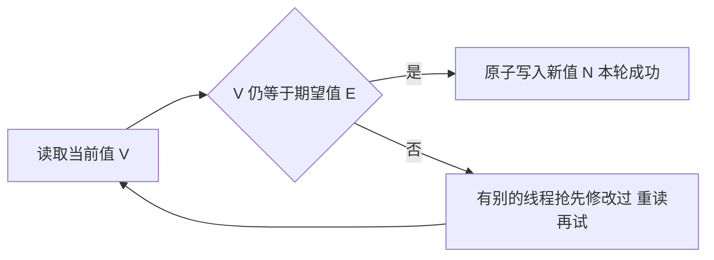

### 锁的劣势

硬件同步（锁）的开销：

- **挂起与恢复线程**有显著的内核开销（上下文切换），竞争激烈时大多数时间花在排队上——等待、唤醒、调度形成“锁风暴”；
- **volatile 与锁在无竞争时**很便宜，但**一个锁被频繁竞争**时，等待、唤醒、调度让吞吐雪崩；
- **锁的持有时间不确定**（一个慢持锁者拖累所有人）——无法对等待时间设上限；
- **优先级反转**：低优先级线程持有锁，高优先级线程等待（低优先级又被中优先级抢占，锁迟迟不释放）——历史上 Mars Pathfinder 就栽在这上面（看门狗复位，靠地球远程打补丁才救回来）。

锁的其他麻烦：性能损益的“全有或全无”（有竞争才有挂起开销）、死锁风险、一个线程阻塞全体遭殃。

### 更好的替代：非阻塞算法

**乐观的并发策略**：先操作，提交时检查“期间别人动过没有”，冲突就重试——与锁的“悲观预防”（先独占再操作）相对。

**非阻塞与无锁的精确定义**（原书 15.4，两级）：

- **非阻塞（nonblocking）**：任何线程的失败或挂起，都不会导致其他线程的失败或挂起；
- **无锁（lock-free）**：每一步都有**某个**线程能取得进展（some thread can make progress）——竞争 CAS 时总有一个赢家，所以纯 CAS 协调的算法若构造正确，可以同时满足非阻塞与无锁；
- （补充，超出原书）文献中还有更强的**无等待（wait-free）**分级：**每个**线程都能在有限步内完成，实现苛刻，实践中少见。

### CAS（比较并交换）

绝大多数处理器架构（IA32、Sparc 等）都提供 CAS 指令（如 x86 的 cmpxchg）；PowerPC 等用 load-linked/store-conditional 指令对实现同样功能；更早的世代还有 test-and-set、fetch-and-increment、swap 等原子指令——CAS 是这条谱系的现代形态，提供**原子的读-改-写**：

**CAS(V, A, B)：当且仅当 V == A 时，把 V 更新为 B。无论成功与否，都返回 V 当前的值。**（boolean 变体叫 compare-and-set——java.util.concurrent 里用的就是这个，返回“是否成功”。）

内存位置、预期值、新值三条信息由处理器保证原子执行。CAS 就是“乐观锁”思想的硬件实现——先读旧值做计算，提交时原子地“如果还是我读到的值就写入”；语义一句话：*I think V should have the value A; if it does, put B there, otherwise don't change it but tell me I was wrong.*



用 CAS 实现无锁计数：

```java
// CAS 计数器（原书 Listing 15.2 的 increment 逻辑，此处用 AtomicInteger 改写）
@ThreadSafe
public class CasCounter {
    private final AtomicInteger value = new AtomicInteger();
    public int getValue() { return value.get(); }

    public int increment() {
        int v;
        do {
            v = value.get();                          // 读取当前值（乐观假设它不会变）
        } while (!value.compareAndSet(v, v + 1));     // CAS 失败说明值变了，重读重试
        return v + 1;
    }
}
```

（易错点：原书 SimulatedCAS 的 compareAndSwap 返回旧值，写 `v != ...`；而 AtomicInteger.compareAndSet 是 boolean 变体，必须写 `!`——两个变体的返回值语义不同，混用即编译错误。）

- **代价量级**（原书 2006 口径，仅供数量级参考）：单 CPU 上 CAS 只要几个时钟周期；多 CPU 无竞争 CAS 约 10~150 周期；**多数处理器上无竞争锁的快路径约为一次 CAS 的两倍**——CAS 快，但没有数量级差距，别在两者间凭直觉下注；
- **竞争程度决定胜负**：中低竞争（现实中的常态）下 CAS 快于锁；**极高竞争下锁反而占优**——锁通过挂起线程降低 CPU 占用与共享内存总线的同步流量，而 CAS 只会立刻重试、火上浇油（下一节 PRNG 基准）；
- CAS 是硬件指令而非 JVM 协议——没有锁的排队与公平问题，对死锁与优先级反转免疫；但反复重试的算法**可能活锁或重试饥饿**（极端竞争下应考虑退避再重试）。

**CAS 最大的缺点**（原书脚注 5）：*the biggest disadvantage of CAS is the difficulty of constructing the surrounding algorithms correctly*——难的不是 CAS 本身，而是**正确构造它周边的算法**。

**CAS 的三个限制**：

1. 一次只能同步**一个变量**（多变量要打包成不可变对象再原子替换引用）；
2. 竞争下自旋烧 CPU；
3. **ABA 问题**（见下）。

**无锁栈（Treiber 栈）**——push/pop 都只用对栈顶的 CAS：

```java
@ThreadSafe
public class ConcurrentStack<E> {
    private final AtomicReference<Node<E>> top = new AtomicReference<>();

    private static class Node<E> {
        final E item;
        Node<E> next;
        Node(E item) { this.item = item; }
    }

    public void push(E item) {
        Node<E> newHead = new Node<>(item);
        Node<E> oldHead;
        do {
            oldHead = top.get();
            newHead.next = oldHead;       // 新节点指向当前栈顶
        } while (!top.compareAndSet(oldHead, newHead));   // 失败=别人先动过，重来
    }

    public E pop() {
        Node<E> oldHead, newHead;
        do {
            oldHead = top.get();
            if (oldHead == null) return null;
            newHead = oldHead.next;       // 下一个节点作为新栈顶
        } while (!top.compareAndSet(oldHead, newHead));   // 失败重试（含 ABA 风险，见下）
        return oldHead.item;
    }
}
```

栈是“单一热点（top 引用）+ 局部修改”的结构，天然适合无锁化；链表节点级 CAS 的进阶就是下面的 Michael-Scott 队列。

非阻塞算法的线程安全性从哪来？**CAS 同时提供原子性与可见性**——compareAndSet 写入具有 volatile 写的内存效果，对同一 AtomicReference 的 get 具有 volatile 读的内存效果，所以一个线程对栈的修改被**安全发布**给随后检查栈的所有线程。另外注意：非阻塞算法做的是**投机执行（speculative work）**——构造新节点时赌“等 CAS 到它时 next 还没变”，赌输就重做。

### 原子变量类

**JVM 对 CAS 的支持**：Java 5.0 之前 Java 代码只能写本地方法才能用上 CAS；Java 5.0 起 JVM 为 int/long/引用暴露了底层 CAS 支持，编译到目标平台最合适的指令；平台没有 CAS 类指令时，JVM 退化为**自旋锁**模拟（不是“加锁模拟”这么宽泛）。原子类底层历史上经 sun.misc.Unsafe、Java 9 起经 VarHandle 调用处理器的 CAS 指令。**多核间保持缓存一致本身就有代价**——CAS 不是魔法，只是把同步的开销从“内核排队”挪到“缓存协调 + 重试”。

JDK 把 CAS 包装成了原子变量类（java.util.concurrent.atomic 包）——“更好用的 volatile”：既有 volatile 的可见性，又有原子的读-改-写：

> A small toolkit of classes that support lock-free thread-safe programming on single variables.
>
> 一套支持对单个变量进行无锁线程安全编程的小型工具类。——java.util.concurrent.atomic 包 Javadoc

| 类 | 用途 |
| --- | --- |
| AtomicBoolean / AtomicInteger / AtomicLong | 基本类型原子读改写：getAndIncrement、compareAndSet |
| AtomicReference\<V\> | 引用的原子替换（配合不可变对象：原子更新“不可变快照”） |
| AtomicIntegerArray / AtomicLongArray / AtomicReferenceArray | 原子数组（按元素 CAS） |
| AtomicIntegerFieldUpdater / AtomicLongFieldUpdater / AtomicReferenceFieldUpdater | **字段更新器**：对已有类的 volatile 字段做 CAS（不想把字段声明为原子类型时） |
| AtomicStampedReference | 带版本戳（解决 ABA） |
| AtomicMarkableReference | 带布尔标记 |
| LongAdder / DoubleAdder | Java 8：高并发计数（分段累加，读时合并）——**统计计数首选** |
| LongAccumulator / DoubleAccumulator | Java 8：可结合任意运算的累计器 |

**“更好的 volatile”——守住多变量不变式**（原书 15.3.1）：原子引用 + 不可变对象 + compareAndSet，是“一次只能 CAS 一个变量”限制下的标准解法——把两个变量打包进不可变快照，原子替换整个快照（Listing 15.3，修复第 3 篇 NumberRange 的竞态）：

```java
public class CasNumberRange {
    @Immutable
    private static class IntPair {
        final int lower;   // 不变式：lower <= upper
        final int upper;
        IntPair(int lower, int upper) { this.lower = lower; this.upper = upper; }
    }
    private final AtomicReference<IntPair> values = new AtomicReference<>(new IntPair(0, 0));

    public void setLower(int i) {
        while (true) {
            IntPair oldv = values.get();
            if (i > oldv.upper)
                throw new IllegalArgumentException("Can't set lower to " + i + " > upper");
            IntPair newv = new IntPair(i, oldv.upper);
            if (values.compareAndSet(oldv, newv))   // 校验与写入对“整个快照”原子生效
                return;
        }
    }
    // setUpper 同理
}
```

**性能比较：竞争水平决定胜负**（原书 15.3.2 的 PRNG 基准，图 15.1/15.2）——同一个伪随机数生成器，分别用 ReentrantLock 与 AtomicInteger 保护种子竞争，竞争越高原子变量越吃亏：**高竞争下锁占优，现实的中低竞争下原子变量占优**。原理：锁对竞争的响应是挂起线程——降低 CPU 占用与内存总线流量（类似生产者阻塞后消费者得以喘息）；CAS 对竞争的响应是立刻重试——高竞争下互相制造更多竞争。第三条曲线用 ThreadLocal 把状态变成线程私有、彻底不共享，一骑绝尘——

> We can improve scalability by dealing more effectively with contention, but true scalability is achieved only by eliminating contention entirely.
>
> 更聪明地应付竞争能改善伸缩性，但真正的伸缩性只有彻底消除竞争才能获得。

**原子变量 vs 锁的选择**：中低竞争（多数真实负载）下原子变量把“竞争失败”变成“重试”，伸缩性优于锁的“排队挂起”；极高竞争下锁反而占优；CAS 无法表达的复杂逻辑（多变量不变式、需要阻塞语义）还得靠锁或不可变快照。**原子变量是“用 CPU 换吞吐”的工具**。

### 无锁链表与字段更新器

无锁栈之后是更精巧的无锁链表——**Michael-Scott 队列**（ConcurrentLinkedQueue 的原型）。难点在入队要改两个引用（尾节点的 next、tail 指针），解法是**两步 CAS + 帮助推进**：

```java
// 无锁链表队列：head/tail 与节点指针全部走 AtomicReference
public class LinkedQueue<E> {
    private static class Node<E> {
        final E item; final AtomicReference<Node<E>> next;
        Node(E item, Node<E> next) { this.item = item; this.next = new AtomicReference<>(next); }
    }
    private final Node<E> dummy = new Node<>(null, null);
    private final AtomicReference<Node<E>> head = new AtomicReference<>(dummy);
    private final AtomicReference<Node<E>> tail = new AtomicReference<>(dummy);

    public boolean put(E item) {
        Node<E> newNode = new Node<>(item, null);
        while (true) {
            Node<E> curTail = tail.get();
            Node<E> tailNext = curTail.next.get();
            if (curTail == tail.get()) {
                if (tailNext != null)                       // 中间状态：帮助推进尾指针
                    tail.compareAndSet(curTail, tailNext);
                else if (curTail.next.compareAndSet(null, newNode)) {  // 链上新节点
                    tail.compareAndSet(curTail, newNode);   // 推进尾指针（失败无妨，下个线程会帮）
                    return true;
                }
            }
        }
    }
}
```

两个要点：**两步 CAS**（先链节点、再推尾指针）容忍中间态——中间态下“tail 指向的节点 next 已非空”就是队列正忙的标志；**帮助推进（helping）**——发现别人处于中间态就先帮它收尾再干自己的事，这是无锁算法保证前进性的常见技巧。

**字段更新器（atomic field updater）**：不把字段声明为原子类型，而对已有类的 volatile 字段做 CAS（原书以 ConcurrentLinkedQueue 的 Node.next 为例——为高频短命对象省掉每个节点一个 AtomicReference 的开销）：

```java
// 不把 next 声明为 AtomicReference，而是普通 volatile + Updater——对象布局更省
class Node<E> {
    final E item;
    volatile Node<E> next;            // 只声明 volatile
    Node(E item, Node<E> next) { this.item = item; this.next = next; }
}
// 字段更新器：对该 volatile 字段做 CAS（反射式指定“哪个字段”）
private static final AtomicReferenceFieldUpdater<Node, Node> nextUpdater =
        AtomicReferenceFieldUpdater.newUpdater(Node.class, Node.class, "next");
```

两条边界要记住：①更新器的原子性保证**弱于**常规原子类——它只对“同样经由更新器方法”的访问保证原子，别的线程若直接改字段则不在保护范围；②原书原话：“in nearly all situations, ordinary atomic variables perform just fine”——**几乎一切场景普通原子变量就够**，更新器只在省内存/保留既有类序列化形式等少数场景才值得。

### ABA 问题

CAS 只比较值，不比较“是否变化过”：值 A → B → A，CAS 认为“没变”，但状态其实经历了变化。典型事故场景（无锁栈）：线程 1 读到栈顶为 A、其 next 为 B，准备 `CAS(top, A, B)`；期间线程 2 把 A、B 都弹出又把 **A 重新压回**（内存复用后地址恰好相同）——线程 1 的 CAS 成功了，但栈的结构早已不是它认知的样子（它持有的 B 可能已被释放/属于别的链）。

**解决：AtomicStampedReference**（值 + 版本戳，CAS 同时比较两者——“值相等且版本没动过”才算没变）。注意原书界定的前提：ABA 主要发生在**无 GC、节点内存自管**的环境（节点会被回收复用，地址恰好相同）——Java 里让 GC 管理链节点即可自然规避，风险不必高估；引用复用频繁的结构才需要版本戳（普通计数器无所谓，ABA 对“只加不减”的计数无害）。

### 小结

- 中低竞争（现实常态）、操作简单（计数、标志、引用替换）→ 原子变量优于锁；极高竞争下锁反而占优（挂起降负载）；
- 复杂的多变量不变式 → 老老实实加锁，或“不可变快照 + 原子替换引用”（CasNumberRange）；
- 高并发的单纯计数 → LongAdder（比 AtomicLong 更抗竞争，用“读时汇总”的弱化换伸缩）——但更上策是干脆不共享（ThreadLocal）；
- CAS 家族是 ConcurrentHashMap、AQS、LongAdder 等一切 juc 高性能结构的基石；设计新的无锁数据结构是留给专家的活。

> 【演进】Java 9 的 **VarHandle** 提供了比原子变量更细粒度的内存序控制（plain/opaque/acquire-release/volatile 四种访问模式），原子变量类底层已改用它实现；日常业务用原子变量足够，框架/库作者才需要直接面对 VarHandle。sun.misc.Unsafe 的内存访问方法自 JDK 23（JEP 471）起进入弃用流程，新代码不应直接触碰。Java 8 的 LongAdder 用 @Contended 的分段 Cell 规避伪共享；高并发监控计数——如 QPS（Queries Per Second，每秒查询数）统计——用它，低并发读多写少用 AtomicLong（读更便宜）。
