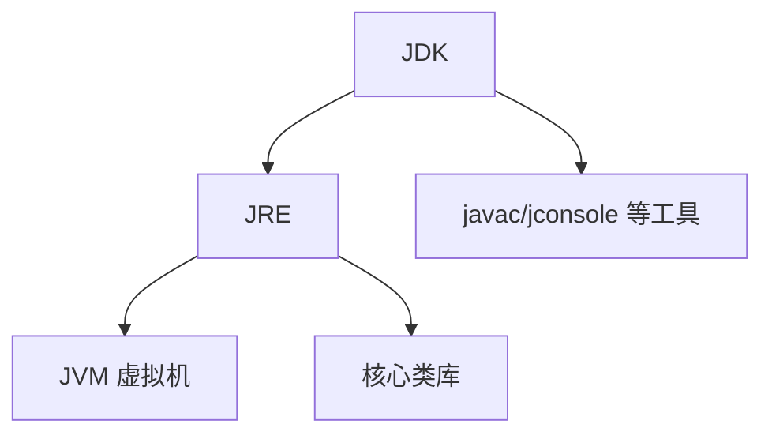

## 1. 概述

> 本篇按《深入理解Java虚拟机(第3版)》第1章结构整理。第1章偏历史与背景,重点掌握:Java 技术体系的构成、虚拟机家族、以及全书五部分的地图。

全书五部分:

| 部分 | 主题 | 对应章节 |
| --- | --- | --- |
| 第一部分 | 走近Java | 第1章 |
| 第二部分 | 自动内存管理(Automatic Memory Management) | 第2~5章 |
| 第三部分 | 虚拟机执行子系统(Execution Subsystem) | 第6~9章 |
| 第四部分 | 程序编译与代码优化(Compilation and Optimization) | 第10~11章 |
| 第五部分 | 高效并发(Efficient Concurrency) | 第12~13章 |

各部分之间基本相互独立,没有必然的前后依赖;第二部分(内存管理)与第三部分(执行子系统)是核心。

## 2. Java技术体系

Sun 官方把 Java 体系定义为三部分:

- **Java 程序设计语言**(Java Programming Language)
- **Java 虚拟机**(Java Virtual Machine):各家实现——HotSpot、JRockit、J9 等
- **Java API 类库**(Java API Class Libraries)

从更广义的生态看:

| 缩写 | 全称 | 内容 |
| --- | --- | --- |
| JDK | Java Development Kit | Java 语言、虚拟机、Java API——最小完整的开发环境 |
| JRE | Java Runtime Environment | Java API 中的核心类库 + 虚拟机——支持程序运行的最小环境 |

## 3. Java发展史

关键节点速览:

| 时间 | 版本 | 关键变化 |
| --- | --- | --- |
| 1991 | Oak | Java 前身,Sun 为机顶盒等嵌入式设备设计 |
| 1995 | JDK 1.0 | 正式发布,Applet、AWT |
| 1998 | JDK 1.2 | 拆分 J2SE/J2EE/J2ME,HotSpot 成为默认虚拟机 |
| 2004 | JDK 5.0 | 泛型、注解、枚举、自动装箱、并发包(java.util.concurrent)——语法层面最大的一次革新 |
| 2006 | JDK 6 | 不再是"1.x"命名风格的转折点;脚本语言支持 |
| 2011 | JDK 7 | invokedynamic 指令、G1 收集器、NIO.2 |
| 2014 | JDK 8 | Lambda、方法引用、元空间(Metaspace,取代永久代) |
| 2017 | JDK 9 | 模块化(JPMS),此后转为半年一个版本的发布节奏 |

## 4. Java虚拟机家族

- **Sun Classic / Exact VM**:早期虚拟机,Classic 只能纯解释执行;Exact VM 是 HotSpot 的前身,引入了准确式内存管理(Exact Memory Management,知道内存中某个位置的数据具体是什么类型)。
- **Sun HotSpot VM**:来源于 Longview Technologies 公司(1997 年被 Sun 收购),长期作为 Oracle JDK 的默认虚拟机。核心特点:**热点代码探测**(Hot Spot Detection)+ **解释器与即时编译器共存**的混合模式。
- **BEA JRockit / IBM J9**:曾经的两大商用竞品。JRockit 专注服务端、不含解释器、全力即时编译;J9 与 IBM 产品线绑定。Oracle 收购 BEA 后,JRockit 与 HotSpot 团队合并,JRockit 的部分特性(Mission Control 等)被吸收进 HotSpot 体系。
- **其他**:Azul Zing/C4、IBM OpenJ9、以及后起的 Graal VM 等。

## 5. 实战:自己编译JDK

原书用一整节演示在 Linux 上编译 OpenJDK,流程要点:

1. **获取源码**:OpenJDK 是开源的,从仓库下载对应版本源码
2. **Bootstrap JDK(引导 JDK)**:编译 JDK 需要先用一个"上一个版本"的 JDK——编译 JDK 11 需要 JDK 10。这是典型的**自举**(bootstrap)思想:先用旧编译器造出新编译器
3. **编译工具链**:编译器(Clang/GCC)、Make、Autoconf 等
4. **构建**:`bash configure && make images`,产物在 `build/*/images/jdk` 下

> 对日常开发而言,编译细节不必记;理解"自举"与"OpenJDK 是所有发行版(Zulu、Corretto、Temurin 等)的源头"这两点即可。
