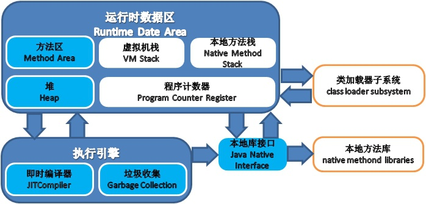
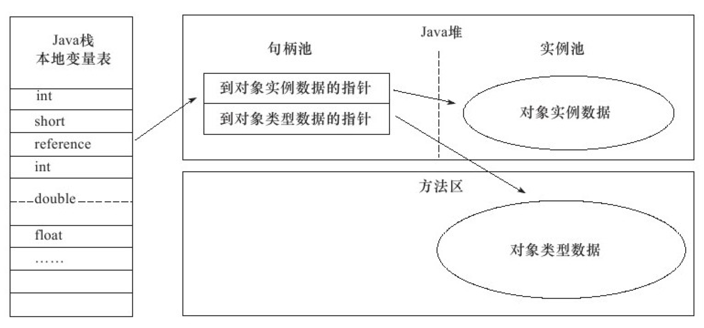
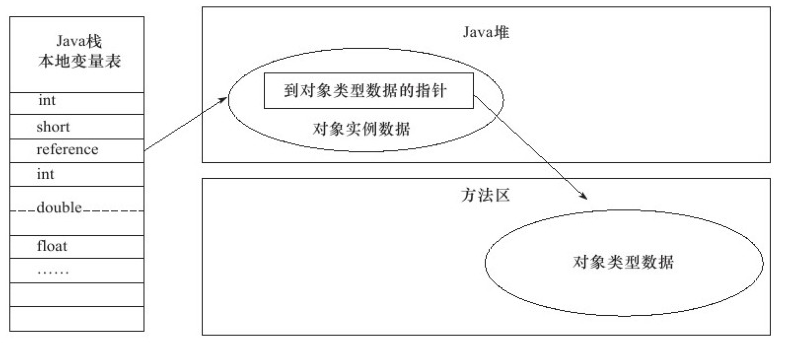

## 1. 概述

> 本篇按《深入理解Java虚拟机(第3版)》第2章结构整理。两条主线:**运行时数据区域**(Run-Time Data Areas)的划分,以及各区域对应的 **OutOfMemoryError** 实战定位。



## 2. 运行时数据区域

| 区域 | 线程私有 | 存放内容 | 溢出异常 |
| --- | --- | --- | --- |
| 程序计数器 | 是 | 当前线程执行的字节码行号 | 无(唯一不抛 OOM 的区域) |
| Java 虚拟机栈 | 是 | 栈帧(局部变量表、操作数栈等) | StackOverflowError / OOM |
| 本地方法栈 | 是 | Native 方法的服务 | StackOverflowError / OOM |
| Java 堆 | 否 | 对象实例、数组 | OOM |
| 方法区 | 否 | 类信息、常量、静态变量、JIT 代码 | OOM |
| 直接内存 | —— | NIO 堆外内存 | OOM(不受 -Xmx 约束) |

### 2.1 程序计数器(Program Counter Register)

一块较小的内存空间,可以看作当前线程所执行字节码的**行号指示器**。

线程切换后要能恢复到正确的执行位置,所以每条线程都有独立的程序计数器,互不影响——"**线程私有**"(Thread Private)的内存。

- 执行 Java 方法:记录的是正在执行的虚拟机字节码指令地址
- 执行 Native 方法:计数值为空(undefined)

此区域是唯一一个在 Java 虚拟机规范中**没有规定任何 OutOfMemoryError** 情况的区域。

### 2.2 Java虚拟机栈(Java Virtual Machine Stacks)

线程私有,生命周期与线程相同。描述 Java 方法执行的内存模型:每个方法执行时创建一个**栈帧**(Stack Frame)存储局部变量表、操作数栈、动态连接、方法出口等信息;方法从调用到执行完毕,对应栈帧在虚拟机栈中入栈到出栈(详见第8章)。

- 常说的"栈内存"(与堆内存相对)就是虚拟机栈,或具体指其中的**局部变量表**
- **局部变量表**:存放编译期可知的各种基本数据类型(boolean、byte、char、short、int、float、long、double)、对象引用(reference)和 returnAddress 类型(指向一条字节码指令的地址)
- 规定了两种异常:

| 异常 | 条件 |
| --- | --- |
| StackOverflowError | 线程请求的栈深度大于虚拟机所允许的深度 |
| OutOfMemoryError | 栈可动态扩展时,扩展中申请不到足够内存 |

### 2.3 本地方法栈(Native Method Stack)

与虚拟机栈作用相同,区别:虚拟机栈为虚拟机执行 Java 方法(字节码)服务,本地方法栈为 Native 方法服务。HotSpot 中**虚拟机栈与本地方法栈是同一个**,不区分(所以 `-Xoss` 参数无效,栈容量只由 `-Xss` 设定)。

### 2.4 Java堆(Java Heap)

- 虚拟机管理的内存中**最大**的一块,所有线程共享,虚拟机启动时创建
- 唯一目的:存放对象实例——"几乎"所有的对象实例都在这里分配(逃逸分析与标量替换成熟后,严格说不再是"绝对",见第11章)
- 垃圾收集器管理的主要区域,又称 **GC 堆**(Garbage Collected Heap);分代收集视角下可划分新生代/老年代,进一步细分为 Eden、Survivor 等区域
- 物理上可以不连续,逻辑连续即可
- 主流虚拟机按可扩展实现(`-Xmx` / `-Xms`);堆无内存完成分配且无法扩展时,抛 OutOfMemoryError

### 2.5 方法区(Method Area)

各线程共享,存储**已被加载的类信息、常量、静态变量、即时编译器编译后的代码**等数据。规范把它描述为堆的一个逻辑部分,但目的不同,也叫 Non-Heap(非堆);回收目标主要是常量池的回收与类型的卸载(判定条件见第3章)。

> **实现演进**:JDK 8 之前 HotSpot 用**永久代**(Permanent Generation)实现方法区,把 GC 分代扩展到了方法区——但规范从未要求如此,而且永久代有 `-XX:MaxPermSize` 上限,动态生成类(CGLib、JSP)容易溢出。**JDK 8 起永久代被彻底移除**,改为在本地内存中实现的**元空间**(Metaspace,`-XX:MaxMetaspaceSize` 控制);字符串常量池则在更早的 JDK 7 就已移入 Java 堆。

#### 运行时常量池(Runtime Constant Pool)

方法区的一部分,存放 Class 文件的**常量池**(Constant Pool Table)——编译期生成的各类字面量与符号引用(见第6章)。

运行时常量池具备**动态性**:并非只有预置入 Class 文件的内容才能进池,运行期间也能放入新常量——用得最多的就是 `String.intern()`。

### 2.6 直接内存(Direct Memory)

**不是**虚拟机运行时数据区的一部分,也不是规范定义的内存区域。

JDK 1.4 引入 NIO(New Input/Output),基于通道(Channel)与缓冲区(Buffer)的 I/O 方式可以使用 Native 函数库直接分配堆外内存,通过一个存储在堆中的 DirectByteBuffer 对象作为引用来操作——避免在 Java 堆和 Native 堆中来回复制数据,一些场景显著提高性能。

> 直接内存不受 `-Xmx` 约束,但仍是内存:受本机总内存(RAM + SWAP/分页文件)与处理器寻址空间限制。配置虚拟机参数时只盯 `-Xmx` 而忽略直接内存,各区域总和超限,动态扩展时照样 OOM(排查思路见第4章、案例见第5章)。

## 3. HotSpot虚拟机对象探秘

### 3.1 对象的创建

```text
new 指令
  → 常量池定位类的符号引用,检查类是否已加载/解析/初始化(没有则先类加载,见第7章)
  → 分配内存(大小类加载完成后已完全确定)
  → 内存空间初始化为零值
  → 设置对象头(哪个类的实例、哈希码、GC 分代年龄等)
  → 执行 <init> 构造方法
```

**分配方式**取决于堆内存是否规整(而堆是否规整又取决于收集器是否带压缩整理功能):

| 方式 | 条件 | 做法 |
| --- | --- | --- |
| 指针碰撞(Bump the Pointer) | 堆绝对规整 | 移动分界指针,划出与对象等大的一块 |
| 空闲列表(Free List) | 堆不规整 | 维护可用内存块列表,找一块够大的划分并更新 |

**并发分配的线程安全**问题(给 A 分配时指针未改,B 用旧指针又分了一次)两种解法:

- CAS + 失败重试,保证更新原子性
- **TLAB**(Thread Local Allocation Buffer,本地线程分配缓冲):每个线程在堆中预先分一小块私有内存,分配先在自己的 TLAB 上进行,用完才同步锁定申请新 TLAB。`-XX:+/-UseTLAB` 设定

### 3.2 对象的内存布局

| 部分 | 内容 |
| --- | --- |
| 对象头(Header) | ① Mark Word:哈希码、GC 分代年龄、锁状态标志、偏向线程 ID 等(32/64 位 VM 中分别 32/64 bit);② 类型指针:指向类元数据(不强制存在) |
| 实例数据(Instance Data) | 真正存储的有效字段内容 |
| 对齐填充(Padding) | HotSpot 要求对象大小为 8 字节整数倍,不足时补齐 |

实例数据的存储顺序受分配策略(FieldsAllocationStyle)与字段定义顺序影响,HotSpot 默认:longs/doubles → ints → shorts/chars → bytes/booleans → oops(Ordinary Object Pointers);相同宽度的字段总被分配在一起,父类变量在子类之前,`CompactFields=true`(默认)时子类较窄的变量可插入父类变量空隙。

### 3.3 对象的访问定位

栈上的 reference 如何定位、访问堆上的对象,规范未定义,取决于虚拟机实现。主流两种:

**句柄访问**:堆中划出**句柄池**,reference 存句柄地址,句柄中包含对象实例数据与类型数据各自的地址。



**直接指针访问**:reference 存的就是对象地址,对象布局中须考虑如何放置访问类型数据的信息。



| | 句柄 | 直接指针 |
| --- | --- | --- |
| 对象被 GC 移动时 | 只改句柄中的实例数据指针,reference 不动 | reference 全部要改 |
| 访问速度 | 多一次指针定位 | 更快 |

HotSpot 使用**直接指针**访问。

## 4. 实战:OutOfMemoryError异常

### 4.1 Java堆溢出

不断创建对象并保证 GC Roots 到对象有可达路径,数量到达最大堆容量限制后溢出,异常栈 `java.lang.OutOfMemoryError` 后跟 `Java heap space`。

```java
// VM Args: -Xms20m -Xmx20m -XX:+HeapDumpOnOutOfMemoryError
// 堆转储快照由 -XX:HeapDumpPath 指定输出路径
List<Object> list = new ArrayList<>();
while (true) {
    list.add(new Object());   // 保持 list 可达,无法被回收
}
```

解决路径:先用内存映像分析工具(MAT/VisualVM,见第4章)分析 Dump 快照,确认是**内存泄漏**(Memory Leak)还是**内存溢出**(Memory Overflow):

- 泄漏:进一步查看泄漏对象到 GC Roots 的引用链,定位泄漏代码
- 非泄漏(对象确实都该活着):检查 `-Xmx`/`-Xms` 是否可调大,检查代码中对象生命周期过长、持有状态过久的问题

### 4.2 虚拟机栈和本地方法栈溢出

HotSpot 不区分两种栈,栈容量只由 `-Xss` 设定。栈深度超过限制抛 StackOverflowError:

```java
// VM Args: -Xss128k
private int stackLength = 1;
public void stackLeak() {
    stackLength++;
    stackLeak();       // 无限递归 → StackOverflowError
}
```

不断的建立线程会耗尽内存抛 OOM(每个线程都要分配栈空间)——"多线程内存溢出"排查时应注意:适当减小 `-Xss` 或减少线程数,单线程内递归过深则相反。

### 4.3 方法区和运行时常量池溢出

(3版语境:元空间)动态生成大量类——CGLib 字节码增强、JSP 热部署、动态代理——会快速撑满类元数据:

```java
// JDK 8+  元空间溢出示例
// VM Args: -XX:MaxMetaspaceSize=10m
while (true) {
    Enhancer enhancer = new Enhancer();       // CGLib 持续生成新类
    enhancer.setSuperclass(OomObject.class);
    enhancer.setUseCache(false);              // 关闭类缓存,强制生成
    enhancer.create();
}
// 异常: java.lang.OutOfMemoryError: Metaspace
```

运行时常量池溢出的经典差异(JDK 6 vs JDK 7+):

```java
String s1 = new StringBuilder("计算机").append("软件").toString();
System.out.println(s1.intern() == s1);        // JDK6: false  JDK7+: true
// JDK6: intern 把首次遇到的字符串复制进永久代常量池,s1 在堆——false
// JDK7+: intern 只记录常量池中的引用(常量池已在堆中),s1 本身就是首次出现——true
```

### 4.4 本机直接内存溢出

DirectMemory 容量通过 `-XX:MaxDirectMemorySize` 指定,不指定则默认与 `-Xmx` 一致。特征:Dump 文件很小(直接内存不在堆里),程序直接/间接使用了 NIO——排查时优先怀疑直接内存(完整案例见第5章)。
