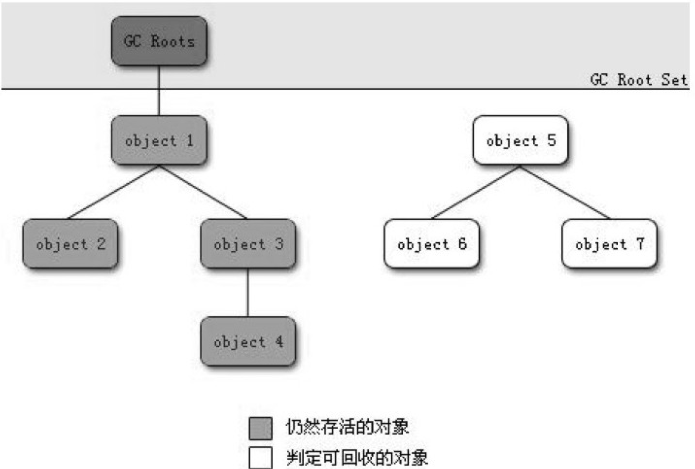
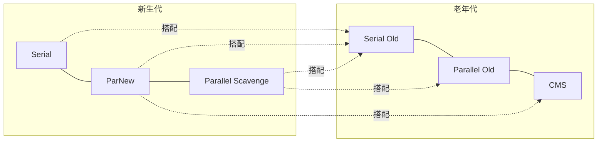

## 1. 概述

> 本篇按《深入理解Java虚拟机(第3版)》第3章结构整理。垃圾收集(Garbage Collection,GC)需要回答三个问题:

| 问题 | 承载章节 |
| --- | --- |
| 哪些内存需要回收? | 本章第2节(对象存活判定) |
| 什么时候回收? | 本章第7节(分配策略与触发条件) |
| 如何回收? | 本章第3~6节(算法与收集器) |

内存回收关注的区域是**Java 堆与方法区**;程序计数器、虚拟机栈、本地方法栈随线程生灭,不需要回收。

## 2. 对象已死?

### 2.1 引用计数算法(Reference Counting)

给对象添加一个引用计数器:有引用时 +1,引用失效时 -1;任何时刻为 0 的对象不可能再被使用。实现简单、判定效率高,但主流虚拟机都不采用——**无法解决对象间相互循环引用的问题**(objA.instance = objB 且 objB.instance = objA 时,两者计数都不为 0,却都已不可达)。

### 2.2 可达性分析算法(Reachability Analysis)

以一系列称为 **GC Roots** 的根对象为起始点,向下搜索,走过的路径称为**引用链**(Reference Chain);从 GC Roots 到某对象没有任何引用链相连(图论:不可达),则证明该对象不可用。



可作为 GC Roots 的对象:

- 虚拟机栈(栈帧中本地变量表)中引用的对象——各线程正在调用的对象
- 方法区中类静态属性引用的对象
- 方法区中常量引用的对象(如字符串常量池里的引用)
- 本地方法栈中 JNI(Native 方法)引用的对象
- JVM 内部引用(基本类型 Class 对象、常驻异常对象、系统类加载器)等

### 2.3 再谈引用(reference)

JDK 1.2 前,引用只有"有/无"两种状态;之后扩充为四种强度递减的引用,目的:**内存还够时留在内存里,垃圾收集后仍紧张时可以抛弃**。

| 引用类型 | 回收时机 | 典型用途 |
| --- | --- | --- |
| 强引用(Strong Reference) | 永不回收——只要强引用还在 | 普通赋值 `Object obj = new Object()` |
| 软引用(Soft Reference) | 内存溢出**之前**的第二次回收 | 内存敏感缓存 `SoftReference<T>` |
| 弱引用(Weak Reference) | 下一次垃圾收集时,不论内存是否足够 | WeakHashMap、ThreadLocalMap 的 key |
| 虚引用(Phantom Reference) | 不影响生存,也无法取得实例;唯一目的:回收时收到通知 | 跟踪对象回收(Cleaner 机制) |

### 2.4 生存还是死亡?

真正宣告对象死亡**至少要经过两次标记**:可达性分析后无引用链 → 第一次标记 + 筛选(是否有必要执行 finalize());判定"有必要"(覆盖了 finalize() 且未被执行过)的对象进入 **F-Queue** 队列,由低优先级的 **Finalizer 线程**执行——"执行"指虚拟机触发该方法,**不承诺等它运行结束**(防止 finalize 死循环拖垮回收系统)。

finalize() 是对象逃脱死亡的最后一次机会:在 finalize() 中把 this 赋值给类变量或成员变量,重新挂上引用链,第二次标记时就被移出"即将回收"集合;但**每个对象的 finalize() 只能执行一次**,第二次直接回收。

> **时效注解**:finalize() 运行代价高、不确定性大、无法保证顺序,JDK 9 起被标记废弃(JEP 421 于 JDK 18 进一步明确弃用)——清理资源用 try-with-resources(见第10章),回收通知用 Cleaner/虚引用,不要在新代码里使用 finalize()。

### 2.5 回收方法区

方法区(元空间)的垃圾收集"性价比"低:新生代一次回收可腾出 70%~95% 的空间,类元数据的回收效率远低于此。回收两部分内容:

- **废弃常量**:与堆对象回收类似——字符串 "abc" 在常量池中,但没有任何 String 对象引用它,也没别处引用该字面量,即可清理
- **无用的类**:三个条件**同时满足**——①该类所有实例都已被回收;②加载该类的 ClassLoader 已被回收;③对应 java.lang.Class 对象没有被任何地方引用(无法通过反射访问)

> 大量使用动态代理、字节码增强的场景才会频繁卸载类;普通应用基本可以忽略类卸载。

## 3. 垃圾收集算法

| 算法 | 思路 | 优点 | 缺点 | 适用 |
| --- | --- | --- | --- | --- |
| 标记-清除(Mark-Sweep) | 标记所有需回收对象,统一清除 | 基础,简单 | 效率不高;产生大量**不连续碎片**,大对象可能放不下而提前触发另一次 GC | —— |
| 标记-复制(Copying) | 内存分两块,用完一块把存活对象复制到另一块,整块清空 | 无碎片、分配高效(指针碰撞) | 内存缩为一半 | **新生代**(存活少,复制成本低) |
| 标记-整理(Mark-Compact) | 标记后存活对象全部向一端移动,清理边界外内存 | 无碎片 | 移动对象成本高(需 STW 或并发读屏障配合) | **老年代**(存活率高) |

**分代收集**(Generational Collection):商业虚拟机的通用策略——按对象存活周期把堆分为新生代与老年代,各年代选用最适当的算法:新生代大批对象死去→复制算法;老年代存活率高、无额外空间做分配担保→标记-清除或标记-整理。

> HotSpot 新生代实际是"Eden + 两块 Survivor"(8:1:1),复制时 Eden+From 存活对象拷入 To——每次回收只浪费 10% 而非 50%,空间分配担保兜住极端情况(见第7节)。

## 4. HotSpot的算法细节实现

### 4.1 根节点枚举

可达性分析必须 STW(Stop The World)。HotSpot 使用 **OOPMap**(Ordinary Object Pointer Map)直接得知哪里存放着对象引用——类加载完成时就把对象内什么偏移量上是什么类型计算好,无需逐条指令扫描。

### 4.2 安全点(Safepoint)与安全区域(SafeRegion)

OOPMap 不能每条指令都生成,只在特定位置记录——**安全点**。GC 发生时让所有线程"跑到最近的安全点再停下来":

- 抢先式中断(几乎无实现采用)与**主动式中断**:轮询标志,线程在安全点主动挂起
- 长时间"不在安全点"的程序(如大循环)会让其他线程干等——第5章的"安全点导致长停顿"案例与此同源
- 线程处于 Sleep 或 Blocked 状态时无法走到安全点——**安全区域**:一段代码里引用关系不变化,任何地方开始 GC 都是安全的

### 4.3 记忆集与卡表

跨代引用(老年代对象引用新生代对象)问题:Minor GC 时总不能把老年代也扫一遍。解决:在新生代建**记忆集**(Remembered Set),记录"哪一块老年代内存可能存在跨代引用",把扫描范围缩小到若干块。

HotSpot 用**卡表**(Card Table)实现:老年代按 512 字节分卡页,卡页脏(dirty)表示其中对象持有跨代引用——`CARD_TABLE [this address >> 9] = 0`。

### 4.4 写屏障(Write Barrier)

卡表元素何时变脏?对象引用字段被赋值的瞬间——AOT 无法预知,JVM 在引用赋值处生成一段**写屏障**代码:赋值后维护卡表状态。

写屏障带来的"浮游垃圾"与并发标记的原始快照/SATB 之争,见 4.5。

### 4.5 三色标记(Tri-color Marking)

并发标记的理论框架(白色:尚未访问;灰色:自身已访问、成员未访问完;黑色:自身与成员都访问完)。并发标记时用户线程同时在改引用,产生两个问题:

| 问题 | 描述 | 后果 | 解决 |
| --- | --- | --- | --- |
| **漏标**(对象消失) | 黑色对象新增指向白色对象的引用,且该白色对象的原灰色引用被删除 | 存活对象被误回收——致命 | 破坏任一条件:**增量更新**(CMS:记录黑→白的新引用,重新标记)或**原始快照 SATB**(G1/Shenandoah:记录被删除的引用,按快照扫) |
| **多标**(浮动垃圾) | 并发期间已经死亡的对象被标记过 | 本轮不回收,留到下一轮 | 可容忍 |

## 5. 经典垃圾收集器



连线表示可搭配使用(注意:两个收集器连线才代表可配;JDK 8 默认 Parallel Scavenge + Parallel Old,JDK 9 起默认 G1)。

### 5.1 Serial收集器

单线程,STW;新生代复制算法。简单高效(无线程交互开销),适合**单核/客户端模式**——client 模式默认收集器。`-XX:+UseSerialGC`。

### 5.2 ParNew收集器

Serial 的多线程并行版本,其余完全一样。曾是 Server 模式下首选新生代收集器——**唯一能与 CMS 搭配**的新生代收集器。JDK 9 起与 CMS 一起被废弃,JDK 14 移除。

### 5.3 Parallel Scavenge收集器

目标与众不同:**吞吐量**(Throughput)= 运行用户代码时间 / (运行用户代码时间 + GC 时间)。复制算法、并行、STW。

| 参数 | 作用 |
| --- | --- |
| `-XX:MaxGCPauseMillis` | 最大停顿时间(毫秒),越小吞吐越低 |
| `-XX:GCTimeRatio` | 吞吐量大小(99 = 允许 1% GC 时间) |
| `-XX:+UseAdaptiveSizePolicy` | 自适应策略:只需设 -Xmx 与目标,分代比例、Eden/Survivor 大小自动调 |

适合后台运算型任务(批处理、数据挖掘)——**停顿长一点没关系,吞吐要高**。

### 5.4 Serial Old收集器

Serial 的老年代版本:标记-整理。Client 模式用途之一;Server 模式主要是给 Parallel Scavenge 兜底(JDK 7 前的 CMS 失败后后备)。

### 5.5 Parallel Old收集器

JDK 6 提供,Parallel Scavenge 的老年代版(标记-整理),补上"吞吐量优先组合"的另一半——`-XX:+UseParallelOldGC`。

### 5.6 CMS(Concurrent Mark Sweep)收集器

**老年代**收集器,目标:最短回收停顿时间(互联网站/ B 端服务)。标记-清除算法,四步:

```text
1. 初始标记(Initial Mark)      STW,只标 GC Roots 直连对象,速度快
2. 并发标记(Concurrent Mark)   与用户线程并发,沿引用链遍历
3. 重新标记(Remark)            STW,修正并发期间变动的对象(增量更新)
4. 并发清除(Concurrent Sweep)  与用户线程并发,清掉白色对象
```

三大缺点:

- **并发阶段占 CPU 资源**(默认启动 (核数+3)/4 个回收线程),总吞吐量下降
- **浮动垃圾**(Floating Garbage):并发清理阶段新产生的垃圾本轮回收不了;且不能等老年代满了才动手(`-XX:CMSInitiatingOccupancyFraction`,默认 ~68% 启动),预留不够则 **Concurrent Mode Failure**,退化为 Serial Old 全停顿整理——最糟糕的情况
- **标记-清除的碎片问题**:碎片太多大对象放不下,提前触发 Full GC;`-XX:+UseCMSCompactAtFullCollection`(Full GC 时整理)只是缓解

> **时效注解**:CMS 在 JDK 9 被标记废弃、JDK 14 移除(JEP 363)——它的历史使命(低停顿)由 G1/ZGC 接棒。

### 5.7 G1(Garbage First)收集器

JDK 7 Update 4 转正,JDK 9 起默认。面向**服务端**、停顿可控的收集器,思想大转向:**不再物理分代**——把堆划为大小相等的 **Region**(1~32MB,2 的幂),每个 Region 动态扮演 Eden/Survivor/Old/Humongous 角色。

| 特性 | 说明 |
| --- | --- |
| 停顿可预测 | `-XX:MaxGCPauseMillis`(默认 200ms)设定目标,G1 按每个 Region 回收价值(收益/成本)排序,**优先收垃圾最多的 Region**——Garbage First 之名 |
| 大对象 | 超过 Region 一半的对象存入连续的 **Humongous** Region |
| 跨 Region 引用 | 每个 Region 带记忆集(RSet),卡表 + 写屏障维护 |
| 并发标记 | SATB 快照消除漏标 |
| 回收步骤 | Young GC(Eden 满,STW 复制存活对象)→ 并发标记 → **Mixed GC**(全部新生代 + 部分高价值老年代 Region) |
| 碎片 | Region 间复制(整体上属于标记-整理),无碎片 |

### 5.8 低延迟收集器(第3版新增重点)

| 收集器 | 关键技术 | 停顿 |
| --- | --- | --- |
| Shenandoah | 并发整理(Red Hat 主导,OpenJDK);转发指针 + 读写屏障;OpenJDK 12 引入,Oracle JDK 不含 | <10ms 目标 |
| ZGC(JDK 11 实验/15 转正) | **着色指针**(Colored Pointer,在 64 位指针中借位存标记信息)+ **读屏障**(Load Barrier);Region 化、并发整理 | 停顿 <10ms 且与堆大小无关 |

> **时效注解**:ZGC 的停顿不随堆增大而增长,几百 GB 堆也能 <1ms 级停顿;JDK 21 起支持**分代 ZGC**(JEP 439)进一步改善吞吐——大堆低延迟场景的默认答案。Epsilon(不回收的"无操作"收集器,JEP 318)用于性能测试与超短生命周期任务。

## 6. 内存分配与回收策略

对象分配大方向:**在堆的新生代 Eden 区上**(TLAB 开启则优先按线程在 TLAB 分配);少数情况直接进老年代。规则细节取决于收集器组合与参数。

### 6.1 对象优先在Eden分配

Eden 空间不足时发起一次 **Minor GC**(新生代 GC:频繁、速度快、STW 短);存活对象进入 Survivor/老年代。注意术语:**Minor GC** 只收新生代,**Major GC/Full GC** 收整个堆+方法区(慢)。

### 6.2 大对象直接进入老年代

大对象=需要大量连续内存的对象(长字符串、大数组)。最坏的不是大对象,是"**朝生夕灭**"的短命大对象——容易导致内存还有不少时就提前触发 GC 腾连续空间。`-XX:PretenureSizeThreshold`(大于该值的对象直接进老年代,避免在 Eden 与 Survivor 间来回复制;仅 Serial/ParNew 生效)。

### 6.3 长期存活的对象将进入老年代

对象年龄(Age)计数器:Eden 出生、熬过第一次 Minor GC → 进 Survivor,年龄设 1;每熬过一次 Minor GC +1;到阈值(默认 **15**,对象头年龄只有 4 bit)晋升老年代。`-XX:MaxTenuringThreshold` 调整。

### 6.4 动态对象年龄判定

不必等到 MaxTenuringThreshold:**Survivor 中同龄对象大小总和超过 Survivor 一半**,则该年龄及以上的对象直接晋升——让 Survivor 不至于被"同龄大队"挤爆。

### 6.5 空间分配担保

Minor GC 前检查:老年代最大可用连续空间 **>** 新生代所有对象总大小 → 这次 Minor GC 绝对安全。否则看 **空间分配担保**(Handle Promotion Failure)规则:

```text
老年代可用连续空间 > 历次晋升到老年代的平均大小?
 ├─ 是 → 尝试 Minor GC(有风险:平均大小不等于本次,担保失败就得 Full GC 兜底)
 └─ 否 → 直接先做 Full GC
```

> JDK 6 Update 24 之后规则简化:`HandlePromotionFailure` 不再起作用——只要老年代连续空间大于新生代对象总大小**或**历次晋升平均大小就会 Minor GC,否则 Full GC。
