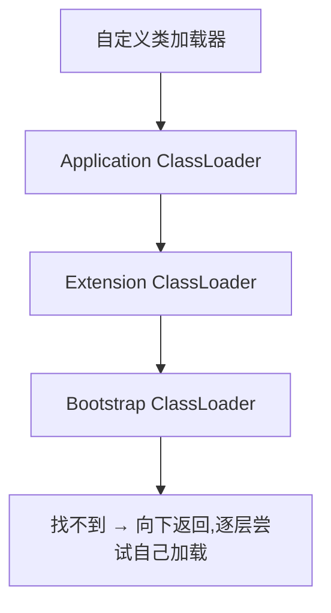

## 1. 概述

> 本篇按《深入理解Java虚拟机(第3版)》第7章结构整理——全书最重要的章节之一。虚拟机把"描述类的数据从 Class 文件加载到内存,并对数据进行校验、转换、解析和初始化,最终形成可以被虚拟机直接使用的 Java 类型"的整个过程,叫做**类加载机制**(Class Loading)。

## 2. 类加载的时机

类型的生命周期:


其中**加载、验证、准备、初始化、卸载**的开始顺序是确定的,但**解析**阶段不一定(支持 Java 的运行时绑定/晚期绑定,可以在初始化之后才开始)。

规范严格规定只有**六种情况必须立即初始化**(主动引用,active reference):

1. 遇到 `new`、`getstatic`、`putstatic`、`invokestatic` 四条指令——典型场景:new 对象、读写 static 字段(非 final 常量)、调用静态方法
2. 反射调用(`Class.forName`)
3. 初始化一个类时,发现父类还没初始化,先触发父类初始化
4. 虚拟机启动时初始化主类(含 main 的那个类)
5. `MethodHandle` 解析的结果为特定方法句柄时
6. 接口定义了 default 方法且其实现类初始化时

三种**被动引用**(passive reference)**不触发**初始化:

```java
// 例1:通过子类引用父类静态字段 —— 只初始化父类
System.out.println(SubClass.VALUE);   // VALUE 定义在 SuperClass

// 例2:定义数组 —— 只会在堆上创建数组类型,不初始化 SubClass
SubClass[] arr = new SubClass[10];

// 例3:引用编译期常量(constant) —— 编译阶段已把值存进调用方常量池
System.out.println(SubClass.HELLO);   // static final String HELLO = "hello"
```

## 3. 类加载的过程

### 3.1 加载(Loading)

三件事:

1. 通过全限定名拿到定义此类的二进制字节流(可以从 class 文件、jar、网络、动态代理生成……)
2. 把字节流的静态存储结构转化为**方法区**中的运行时数据结构
3. 在内存(堆)中生成一个代表这个类的 `java.lang.Class` 对象,作为方法区数据的访问入口

### 3.2 验证(Verification)

防止恶意/损坏的字节流危害虚拟机。四个阶段:

| 阶段 | 校验内容 |
| --- | --- |
| 文件格式验证 | 魔数、版本号、常量池 tag 合法性……(通过后才进方法区) |
| 元数据验证 | 语义分析:有没有父类、是否继承 final 类、抽象方法是否齐全 |
| 字节码验证 | 数据流与控制流分析:操作数栈类型匹配、跳转指令合法性 |
| 符号引用验证 | 解析前:符号引用能否找到对应类/字段/方法(访问权限 `IllegalAccessError` 等) |

### 3.3 准备(Preparation)

为类变量(static)分配内存并设**零值**——注意不是用户代码里的初始值:

```java
public static int value = 123;
// 准备阶段后 value = 0,初始化阶段才变为 123

public static final int CONST = 123;
// 若字段有 ConstantValue 属性(final 常量),准备阶段就直接赋 123
```

### 3.4 解析(Resolution)

把常量池中的**符号引用**(symbolic reference,名字)替换为**直接引用**(direct reference,指针/偏移量/句柄):

- 类/接口解析
- 字段解析(本类→接口→父类逐层找)
- 方法解析
- 接口方法解析

### 3.5 初始化(Initialization)

执行类构造器 **`<clinit>()`** 方法——编译器自动收集**所有静态变量的赋值动作与 static{} 块**合并产生,按源码顺序执行:

```java
static int i = 1;
static { i = 2; j = 2; }   // 可以给后面的变量赋值(写)
static int j = 1;          // 但不能"读"前面的语句访问后面的变量
```

`<clinit>()` 的两个重要性质:

1. **虚拟机保证线程安全**:多个线程同时初始化一个类时,`<clinit>()` 会被加锁同步——这正是"静态内部类单例"线程安全的原理:

```java
public class Singleton {
    private static class Holder {
        static final Singleton INSTANCE = new Singleton(); // 由 <clinit> 的锁保证只执行一次
    }
    public static Singleton getInstance() { return Holder.INSTANCE; }
}
```

2. 父类的 `<clinit>()` 先于子类执行(所以 `Object` 的最先执行)。

## 4. 类加载器

### 4.1 类与类加载器

**两个类"相等",前提是同一个类加载器加载**——即使同一个 Class 文件,被两个加载器加载后得到的 Class 对象也不相等(`equals`、`isAssignableFrom`、`instanceof` 都为 false)。这是 OSGi、热部署等一切"类加载器玩法"的基础。

### 4.2 双亲委派模型(Parents Delegation Model)

三层加载器(JDK 8 及之前):

| 加载器 | 加载范围 | 实现 |
| --- | --- | --- |
| Bootstrap ClassLoader(启动类加载器) | JAVA_HOME/lib 核心库 | C++ 实现,Java 中拿不到引用(null) |
| Extension ClassLoader(扩展类加载器) | lib/ext 下的扩展库 | Java 实现,`ExtClassLoader` |
| Application ClassLoader(应用程序类加载器) | classpath | Java 实现,`AppClassLoader`,默认加载器 |



**工作过程**:收到类加载请求先委派给父加载器,父加载器无法完成时子加载器才自己加载。

**为什么这样设计**:Java 类型体系因此有了带优先级的层次——`java.lang.Object` 永远由 Bootstrap 加载,用户自己写的同名类永远轮不到加载,**防止核心 API 被篡改**,也避免类的重复加载。实现上只需 ClassLoader 的 loadClass 逻辑(先查缓存 → 委派父级 → 调 findClass 自己加载)。

> JDK 9 起模块化(JPMS)取消了 Extension ClassLoader,取而代之的是 **Platform ClassLoader**,加载关系也按模块重新划分,但"先委派"的原则保留。

### 4.3 破坏双亲委派模型

历史上三次"破坏":

1. **JDK 1.2 之前**:自定义类加载器只能重写 loadClass(),委派逻辑就在其中,想不委派就没法办——1.2 引入 findClass() 引导用户把自定义逻辑放到里面
2. **SPI / 线程上下文类加载器**(Thread Context ClassLoader):核心类(如 JDBC 的 DriverManager,由 Bootstrap 加载)需要加载厂商实现(classpath 里的驱动),父加载器"看不见"子加载器的类,只好开线程上下文类加载器的后门让 Bootstrap 反过来用 Application 加载
3. **OSGi / 热部署**:模块间网状委派,按 Bundle 划分加载域、每段各自决定委派给谁——追求"程序热替换"的动态性,牺牲模型的简单性

> 用户代码想加载核心库同名类还有一道防线:`ClassLoader.preDefineClass` 检查包名——`java.` 开头的包用户类加载器禁止定义,抛 SecurityException。
