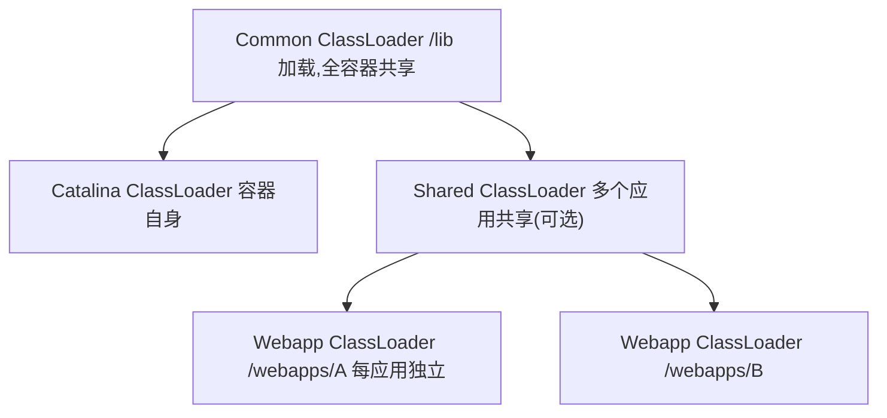

## 1. 概述

> 本篇按《深入理解Java虚拟机(第3版)》第9章结构整理。第7、8章讲机制,本章看真实框架怎么**运用**类加载器与字节码技术——这些案例的共同点:把"类的定义"从磁盘上的 class 文件解放出来,变成运行时可编程的资源。

## 2. 案例分析

### 2.1 Tomcat:正统的类加载器架构

一个 Tomcat 可能部署多个应用,它们要**隔离**(不同版本的同名类)、又要**共享**(同一份容器与公共库)。Tomcat 用"多个平行的类加载器"解决:



两个关键设计(与双亲委派相映成趣):

1. **隔离**:每个 Webapp 一个加载器,同名类互不可见——解决版本冲突
2. **先本地后委派**:Webapp ClassLoader **先自己加载**应用类,加载不到再委托父级——与标准双亲委派顺序相反,为的是让应用自带的库优先于容器公共库(实现覆盖)。这是"破坏双亲委派"服务于业务的正统一课

### 2.2 动态代理:字节码在运行期生成类

`java.lang.reflect.Proxy` 是 JDK 内建的运行期字节码生成案例——代理类(`$Proxy0`)**不来自任何 class 文件**,而是运行时由 `ProxyGenerator` 生成字节码数组、由类加载器 `defineClass` 进虚拟机:

```java
interface Hello { void sayHello(); }

Hello target = () -> System.out.println("real call");
Hello proxy = (Hello) Proxy.newProxyInstance(
        target.getClass().getClassLoader(),
        target.getClass().getInterfaces(),
        (p, method, args) -> {                 // InvocationHandler:所有调用汇到这里
            System.out.println("before");
            Object result = method.invoke(target, args);  // 反射回调目标
            System.out.println("after");
            return result;
        });
proxy.sayHello();   // before → real call → after
```

字节码生成库对比:

| 库 | 特点 |
| --- | --- |
| ASM | 最底层、最快,直接操纵字节码指令;CGLIB、Groovy 基于它 |
| CGLIB | 面向"继承目标类生成子类"的代理,不需接口;Spring 默认代理方案的备选 |
| Javassist | 拼接 Java 源码字符串即可生成类,易用性最高;MyBatis、Hibernate 使用 |
| ByteBuddy | 流式 API,支持 Java 新版本语法;Mockito、SkyWalking 使用 |

### 2.3 向后移植:Retrotranslator

把新 JDK 编译出的字节码**降级**成老虚拟机能运行的版本(语法糖反解:泛型/for-each/自动装箱还原为原始写法,新 API 替换为实现类)。它证明了一件事:**Class 字节码是可编程、可双向变换的中间层**——升可以兼容新语言特性,降可以救老平台(对 Android 而言,8-Desugaring、D8/R8 对新语法的处理是同一思想)。

## 3. 实战:自己动手实现远程执行功能

目标:线上服务不重启,把一段新代码送进正在运行的 JVM 执行。拆成两个子问题:

1. **如何编译/加载**:拿到字节码后,用自定义类加载器 `defineClass` 生成 Class——同一个类名,不同的类加载器,就是**不同的类**(见第7章),因此可以反复加载"同名类"实现多轮执行
2. **如何隔离污染**:传参/取结果用 `Map<String, Object>` 之类的通用结构,避免把测试类塞进应用类加载器的命名空间

核心骨架:

```java
// 1. 运行期编译:JDK 自带的编译器 API(前端编译器 javac 的库形态,见第10章)
JavaCompiler compiler = ToolProvider.getSystemJavaCompiler();
int result = compiler.run(null, null, null,
        "-d", "/tmp/classes",                       // 输出目录
        "/tmp/src/GenClass.java");                  // 源码文件

// 2. 自定义类加载器:每个任务一个实例 → 同名类可重复定义
class ExecutingClassLoader extends ClassLoader {
    private final String classDir;
    ExecutingClassLoader(String classDir, ClassLoader parent) {
        super(parent);                              // 委派应用类加载器,能引用业务类
        this.classDir = classDir;
    }
    @Override
    protected Class<?> findClass(String name) throws ClassNotFoundException {
        byte[] bytes = loadClassBytes(name);        // 从目录/网络读入字节码
        return defineClass(name, bytes, 0, bytes.length);   // 字节码 → Class 对象
    }
}

// 3. 反射执行入口方法,结果放入跨加载器安全的容器(字符串/Map)
Class<?> clazz = new ExecutingClassLoader(dir, appLoader).loadClass("GenClass");
Method run = clazz.getMethod("run", Map.class);
run.invoke(clazz.getDeclaredConstructor().newInstance(), params);
```

> 远程执行只是载体,原书真正想演示的是三件事的合力:**前端编译器 API、自定义类加载器、反射**——每一项都对应前面章节的一个知识点(第10章、第7章、第8章)。
