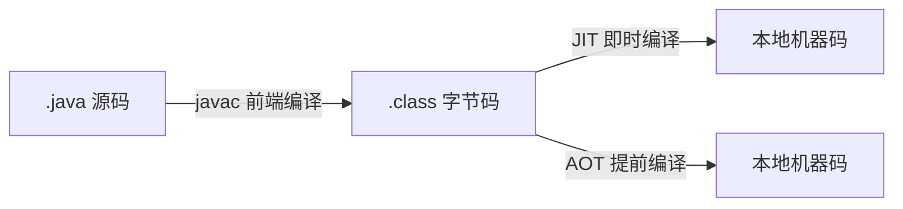

## 1. 概述

> 本篇按《深入理解Java虚拟机(第3版)》第10章结构整理。把 .java 变成 .class 的 **javac 属于前端编译器**(front-end compiler);虚拟机内部的 JIT/AOT 属于后端(第11章)。前端编译器的优化手段有限(语法糖脱糖、常量折叠),它更重要的职责是**把 Java 语法正确翻译成字节码**。



## 2. Javac编译器

### 2.1 编译过程总览

javac 四个步骤:

1. **解析与填充符号表**(Parse & Enter)
2. **插入式注解处理**(Annotation Processing)——可循环多轮
3. **语义分析与字节码生成**(Analyze & Generate)

### 2.2 解析:词法与语法分析

- **词法分析**(lexical analysis):字符流 → **Token 流**
- **语法分析**(syntax analysis):Token 流 → **抽象语法树**(Abstract Syntax Tree,AST),一棵描述程序语法结构的多叉树,后续所有操作都基于 AST

### 2.3 注解处理器

插在语义分析**之前**的扩展点:实现 `javax.annotation.processing.Processor` 接口的处理器可以**读取注解、修改/新增 AST、生成新的源文件**——生成的新文件会触发下一轮编译。Lombok(改 AST 消掉 getter/setter)、AutoValue、MapStruct 都靠它。

### 2.4 语义分析与字节码生成

- **标注检查**:变量使用前是否声明、类型是否匹配;常量折叠(`1+2` 直接折叠为 `3`)
- **数据及控制流分析**(data and control flow analysis):局部变量使用前是否 definite assignment 赋值、final 是否重赋值、可达性分析(不可达语句报错)
- **字节码生成**:遍历 AST 生成字节码,同时完成:泛型**类型擦除**、装箱拆箱插入、构造器 `<init>`/`<clinit>` 拼装、`this$`/`access$` 合成成员等

## 3. Java语法糖

语法糖(syntactic sugar):方便开发者的语法,由编译器在字节码层面"脱糖"还原。

### 3.1 泛型与类型擦除

Java 选择了**类型擦除式的泛型**(erasure-based generics,兼容老虚拟机的妥协)——泛型只存在于源码,进 class 文件前被擦回原始类型(Object/上界):

```java
List<String> a = new ArrayList<>();
List<Integer> b = new ArrayList<>();
System.out.println(a.getClass() == b.getClass());   // true:同一个 Class

// 原书著名例子:只有返回值不同也能"重载"?加上两个不同的类型擦除后签名不同即可
// void method(List<String> list)  → method(Ljava/util/List;)V
// void method(List<Integer> list) → 同一签名,编译失败;但加不同返回值(Signature 不同)可共存——
// 这不是让写的技巧,而是编译器生成桥方法(bridge method)的依据
```

擦除的代价与补偿:运行期拿不到泛型参数(`List<T>` 的 T), Signature 属性保留签名供反射 `getGenericType` 读取;**通配符** `? extends / ? super` 是为了让泛型协变/逆变可用(PECS 原则,详见 Effective Java 笔记)。

### 3.2 自动装箱、拆箱与遍历

```java
Integer a = 1;                  // Integer.valueOf(1) —— 有缓存 [-128, 127]!
int b = a;                      // a.intValue()
System.out.println(a == b);     // true:有拆箱,基本类型比较

Integer i1 = 127, i2 = 127;
System.out.println(i1 == i2);   // true:缓存池内同一对象
Integer i3 = 128, i4 = 128;
System.out.println(i3 == i4);   // false:缓存池外,各自 new —— 经典陷阱

for (String s : list) { }       // iterator() 循环的脱糖:hasNext()/next()
```

> 大量循环内装箱拆箱 = 频繁分配 + `==` 语义陷阱,与第5章"数据结构不当"案例同源。

### 3.3 条件编译

```java
if (DEBUG) { log(...); }   // DEBUG 是 final 常量:分支指令永远不可达,整块字节码被消除
```

C 语言 `#ifdef` 在 Java 中的等价物——只对常量条件生效。

### 3.4 其他语法糖一览

| 语法糖 | 脱糖结果 |
| --- | --- |
| 内部类 | 独立的 `Outer$Inner.class`,互访靠编译器生成的 `this$0`、`access$xxx` |
| 枚举 | 继承 `java.lang.Enum` 的普通类,常量是 static final 实例 |
| switch 支持字符串 | 字符串 hashCode + equals 的两段跳转 |
| switch 支持枚举 | 枚举序数 tableswitch + 合成内部类 `$SwitchMap` |
| 变长参数 | 数组传参 `Object...` → `Object[]` |
| try-with-resources | try/finally + `close()`(编译器生成 addSuppressed 逻辑) |
| 增强字段访问(记录类/record) | 自动生成构造器、accessor、equals/hashCode/toString |
| Lambda | **不是内部类**,编译为 invokedynamic + LambdaMetafactory,运行期动态生成(见第8章 3.5) |

## 4. 实战:插入式注解处理器

原书实现了一个 `NameCheckProcessor`:扫描编译期所有命名(类名大驼峰、方法名小驼峰、常量全大写),不合规则输出编译警告——**不修改 AST、只校验**的处理器最简单也最实用:

```java
@SupportedAnnotationTypes("*")          // 处理所有注解,每轮编译都回调
@SupportedSourceVersion(SourceVersion.RELEASE_17)
public class NameCheckProcessor extends AbstractProcessor {
    @Override
    public boolean process(Set<? extends TypeElement> annotations,
                           RoundEnvironment roundEnv) {
        if (!roundEnv.processingOver()) {          // 最后一轮结束前才检查
            for (Element element : roundEnv.getRootElements()) {
                checkName(element);                 // 扫描类的命名
            }
        }
        return false;   // 不"吃掉"注解,让其他处理器继续
    }
}
```

> 注解处理器的调试方式:javac 加 `-processorpath`;想看 javac 内部细节可用 `-XDcompilePolicy` 等参数。它的工程意义:**把"规范"做成编译期强制**——MapStruct/QueryDSL 生成代码、ErrorProne 静态检查都是这条路。
