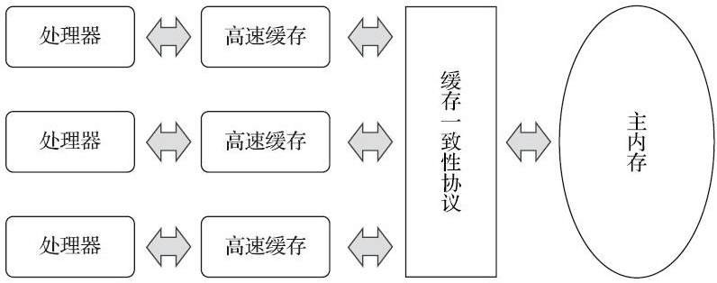
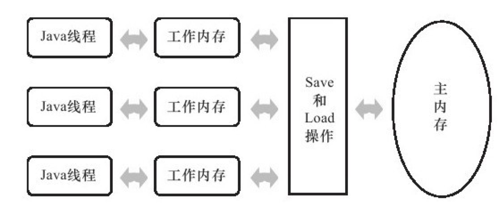
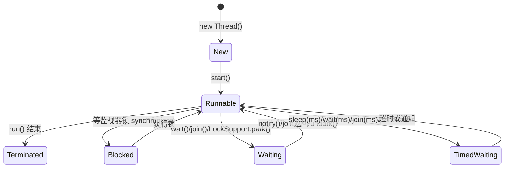

## 1. 概述

> 本篇按《深入理解Java虚拟机(第3版)》第12章结构整理。**Java 内存模型**(Java Memory Model,JMM)定义了程序中各变量的访问规则——把变量存储到内存、从内存取出变量的底层细节。它只关心**共享数据**:

这里的**变量**(Variables)与 Java 编程中所说的变量不同,包括**实例字段、静态字段和构成数组对象的元素**;**不包括局部变量与方法参数**(线程私有,不被共享)。reference 本身在栈的局部变量表里是线程私有的,但它引用的堆对象是共享的。

本章之后:线程安全的实现与锁优化见 `13  线程安全与锁优化.md`。

## 2. 硬件的效率与一致性

并发不是 Java 独有的矛盾,根源在硬件:

- 处理器运算速度远快于内存——引入**高速缓存**(Cache)作缓冲
- 每个处理器有自己的缓存,同一数据可能存在多份副本——需要**缓存一致性协议**(Cache Coherence Protocol,MESI 等)协调
- 处理器/编译器还会**乱序执行**(Out-of-Order Execution)优化指令流水

因此,物理机面临的问题与虚拟机一致:**缓存一致性与指令重排序**。JMM 是 Java 层面对这两个问题的统一答案。



## 3. Java内存模型

### 3.1 主内存与工作内存



- 所有变量都存储在**主内存**(Main Memory)中
- 每条线程有自己的**工作内存**(Working Memory),保存了该线程使用到的变量的主内存副本
- 线程对变量的所有操作(读取、赋值)都**必须在工作内存中进行**,不能直接读写主内存
- 线程间不能直接访问对方工作内存中的变量,值传递必须**经过主内存**完成

> 工作内存是 JMM 的抽象概念,并不真实存在:它涵盖了寄存器、缓存、写缓冲区、硬件以及编译器优化的所有范畴。

### 3.2 内存间交互操作

主内存 ↔ 工作内存如何交互,JMM 定义了 8 种操作,每种都是**原子的、不可再分的**(double/long 例外,见 3.4):

| 操作 | 作用于 | 作用 |
| --- | --- | --- |
| lock(锁定) | 主内存 | 把变量标识为一条线程独占的状态 |
| unlock(解锁) | 主内存 | 释放锁定状态的变量,之后才能被其他线程锁定 |
| read(读取) | 主内存 | 把变量值传输到工作内存,供随后的 load 使用 |
| load(载入) | 工作内存 | 把 read 得到的值放入变量副本 |
| use(使用) | 工作内存 | 把变量值传给执行引擎(遇到需要读变量的字节码指令时) |
| assign(赋值) | 工作内存 | 把从执行引擎收到的值赋给变量(遇到赋值字节码指令时) |
| store(存储) | 工作内存 | 把变量值传送到主内存,供随后的 write 使用 |
| write(写入) | 主内存 | 把 store 得到的值放入主内存变量 |

规则要点:不允许 read/load、store/write 单独出现(传输必须成对);线程不允许直接 use/assign 主内存的变量;一个变量同一时刻只允许一条线程 lock……(一组原子性规则,记主干即可)。

> **时效注解**:8 种操作是 JSR-133 之前的经典表述;JDK 11 前后的 JLS 已改写为等价但更简洁的 read/write 两种原子动作描述。原书第3版对此有说明——概念模型用于理解,不必纠结操作数量。

### 3.3 对于volatile型变量的特殊规则

volatile 是 JVM 提供的**最轻量**的同步机制,三条语义:

1. **可见性**:volatile 变量的写,立即刷回主内存;读总是拿主内存最新值(实现层面:缓存行失效/内存屏障)
2. **禁止指令重排序优化**:编译器与处理器在该变量的读写前后插入内存屏障(Memory Barrier),防止重排——这是"双重校验锁"单例必须加 volatile 的原因(防止对象**初始化与赋值引用的指令重排**,别的线程拿到未初始化完的引用)
3. **不保证原子性**:volatile 只有单个读/写变量的操作具备原子性;`i++` 这种复合操作照样丢更新:

```java
static volatile int race = 0;
public static void increase() { race++; }   // 20个线程各调用100次
// 结果几乎必然 < 2000:race++ 是 read-modify-write 复合操作,volatile 管不了
// 要么 synchronized,要么 AtomicInteger/LongAdder
```

volatile 的适用判断:**运算结果不依赖变量的当前值**,或**只有单一线程修改变量**,其他线程只是读取(如状态标志位 `volatile boolean shutdown`)。

### 3.4 针对long和double型变量的特殊规则

JMM 允许虚拟机把 64 位数据的读写划分为两次 32 位操作(**非原子性协定**,Non-Atomic Treatment of Double and Long)——理论上可能出现"写半个变量"被别的线程读到。**商用虚拟机基本都选择把 64 位读写做成了原子操作**,实际几乎不用担心;写跨平台嵌入式 VM 代码时留意。

### 3.5 原子性、可见性与有序性

JMM 围绕的三个性质,以及 Java 提供的保证手段:

| 性质 | 含义 | Java 的保证 |
| --- | --- | --- |
| 原子性(Atomicity) | 操作不可分割、不可中断 | 基本类型读写(除 long/double 协定);**synchronized** 块(含 lock/unlock 原子性) |
| 可见性(Visibility) | 修改对其他线程立即可见 | **volatile**;synchronized(解锁前刷回主内存);final(初始化不逃逸则无需同步) |
| 有序性(Ordering) | 本线程内观察操作有序(语义串行),线程间观察可能无序 | volatile(屏障禁止重排);synchronized(一个变量同一时刻单线程操作) |

**happens-before 原则**:判定两个操作是否存在**可见性因果关系**的依据——"A happens-before B"意味着 A 的结果对 B 可见。与程序员相关的主要规则:

- **程序顺序规则**:单线程内按控制流顺序,前面的操作 happens-before 后面的
- **管程锁定规则**:unlock happens-before 后续对同一把锁的 lock
- **volatile 变量规则**:volatile 写 happens-before 后续对该变量的读
- **线程启动规则**:Thread.start() happens-before 该线程的任何动作
- **线程终止规则**:线程的所有动作 happens-before 其他线程检测到它终止(join 返回/isAlive 为 false)
- **传递性**:A happens-before B,B happens-before C,则 A happens-before C

> happens-before 不是"时间上先发生":两个操作之间没有 happens-before 关系时,JVM 可以任意重排;一旦存在,则前者的结果必须对后者可见。

## 4. Java与线程

### 4.1 线程的实现

三种实现方式:

| 模型 | 说明 | 例子 |
| --- | --- | --- |
| 内核线程(1:1) | 每个线程对应一个内核线程(LWP 轻量进程),由内核调度 | **Java 的选择**、多数主流平台 |
| 用户线程(1:N) | 完全在用户态,内核无感知,线程库自己调度 | 早期 Java 曾尝试,维护成本极高 |
| 混合(N:M) | 用户线程多路复用到少量内核线程上 | Go goroutine 之前的一些运行时 |

Java 线程在 JDK 21 之前始终是内核线程 1:1 模型——`java.lang.Thread` 的每个实例最终都映射为系统线程。

### 4.2 Java线程调度

- **协同式**(Cooperative):线程自己交出执行权——实现简单,但一个线程写死循环就全卡死
- **抢占式**(Preemptive):系统分配执行时间,线程切换不由线程自己决定——**Java 采用**。线程可以"建议"(`Thread.setPriority`,1~10),但**优先级不保证**——OS 与 JVM 的优先级映射不一致,不能依赖它做正确性

### 4.3 状态转换

`Thread.State` 六个状态:



注意:**Runnable 是"可运行"**,排队等 CPU 与真正运行都算;OS 层面的"运行/就绪"区分被 JMM 层面合并了。Blocked 只对应**监视器锁**阻塞;LockSupport.park 进入的是 Waiting(线程池空闲线程的常态,见第4章 jstack 输出)。

## 5. Java与协程

(第3版新增小节)内核线程的代价:切换要**陷入内核态**(保存/恢复寄存器、切换页表等),以及每个线程固定消耗栈内存(默认约 1MB,`-XX:ThreadStackSize`)——线程数上限在几千这个量级,"一个请求一个线程"的模型撑不住 C10K 级并发。

**协程**(Coroutine):用户态调度的轻量执行单元——切换不进内核、栈按需分配(几 KB 起),单线程可塞数十万个。**纤程**(Fiber)常与协程混用;内核线程与协程混合(N:M)是主流方案。

> **时效注解**:原书成稿时 Project Loom 尚在孵化;**JDK 21 已正式交付虚拟线程**(Virtual Threads, JEP 444)——`Thread.ofVirtual()` 或 Executors.newVirtualThreadPerTaskExecutor()。虚拟线程是挂载在载体线程(carrier thread, ForkJoinPool)上的轻量线程,阻塞虚拟线程只释放载体线程,不阻塞 OS 线程;它管"高并发 IO 密集"场景,不能提升单线程计算性能(synchronized 阻塞期间仍 pin 载体线程的问题在 JDK 24 的 JEP 491 解决)。
