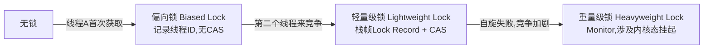

## 1. 概述

> 本篇按《深入理解Java虚拟机(第3版)》第13章结构整理。第12章(Java内存模型)见 `12  Java内存模型与线程.md`;本章回答两个问题:**什么是线程安全、如何实现**,以及虚拟机/ JDK 层面对 **synchronized 做了哪些优化**(锁优化)。

## 2. 线程安全

Brian Goetz 的经典定义:**当多个线程访问一个对象时,如果不用考虑这些线程在运行时环境下的调度和交替执行,也不需要进行额外的同步,或者在调用方进行任何其他的协调操作,调用这个对象的行为都可以获得正确的结果,那这个对象就是线程安全的。**

### 2.1 Java中线程安全的分级

按"安全程度"由强到弱五类:

| 级别 | 含义 | 例子 |
| --- | --- | --- |
| 不可变(immutable) | final/不可变对象天然安全 | String、枚举、`Integer.valueOf` 的包装类、`Collections.unmodifiableList` |
| 绝对线程安全 | 任何调用都不需额外同步——极严苛,Vector 也不算 | `CopyOnWriteArrayList` 近似 |
| 相对线程安全 | 单个操作安全,复合操作要自己保证 | Vector、Hashtable、ConcurrentHashMap |
| 线程兼容(thread-compatible) | 对象本身不安全,调用方加锁可用 | ArrayList、HashMap |
| 线程对立(thread-hostile) | 怎么加锁都不安全 | `Thread.suspend()/resume()`(已废弃)、System.setIn |

### 2.2 线程安全的实现方法

三条技术路线:**互斥同步(阻塞)、非阻塞同步、无同步方案**。

#### 互斥同步(Mutual Exclusion & Synchronization)

**synchronized**——Java 最基本的同步手段,字节码层面是 `monitorenter`/`monitorexit`(代码块)或 ACC_SYNCHRONIZED 标志(方法),锁的本质是对象关联的 **Monitor(管程)**:

- 同一线程可重入(计数器)
- 等待不可中断、非公平
- JDK 6 之后加入大量优化(见第3节),性能已不再是放弃它的理由

**ReentrantLock**——`java.util.concurrent`(J.U.C)的显式锁,API 层面三块能力超出 synchronized:

| 能力 | 说明 |
| --- | --- |
| 等待可中断 | `lockInterruptibly()`,死锁等待时可被打断 |
| 公平锁 | `new ReentrantLock(true)`,按等待顺序获取 |
| 绑定多个条件 | `newCondition()`,一把锁多个等待队列(wait/notify 只有一个) |

选择:**优先 synchronized**(简单 + 虚拟机持续优化),需要上述三能力时才用 ReentrantLock。

#### 非阻塞同步(Non-Blocking Synchronization)

互斥同步的代价:挂起/恢复线程都要转入内核态。硬件发展带来了**原子指令**,基于它做"先操作,冲突再重来"的乐观并发:

**CAS**(Compare And Swap,比较并交换)——三个操作数:内存地址 V、期望值 A、新值 B,当且仅当 V==A 时把 V 更新为 B,否则失败重试(自旋):

```java
// AtomicLong 的思路(实际为 Unsafe.compareAndSwapLong)
public final long getAndAddLong(Object o, long offset, long delta) {
    long v;
    do {
        v = getLongVolatile(o, offset);       // 读当前值
    } while (!compareAndSwapLong(o, offset, v, v + delta));  // CAS 失败就自旋重试
    return v;
}
```

三大问题:

1. **ABA 问题**:值从 A 改成 B 又改回 A,CAS 察觉不到——带版本号的 `AtomicStampedReference` 解决
2. 自旋开销:竞争激烈时空转烧 CPU(高竞争下 LongAdder 比 AtomicLong 强,见下)
3. 只能保证一个变量的原子性

> LongAdder/LongAccumulator(JDK 8):把一个计数拆成 base + Cell[] 数组分段累加,读时求和——用**空间换竞争度**,高并发计数首选。

#### 无同步方案

同步只是保证共享数据争用的手段之一,不共享就根本不需要同步:

- **可重入代码**(reentrant code / 纯代码,pure code):不依赖共享状态、入参相同结果相同——天然线程安全
- **线程本地存储**(Thread Local Storage):`ThreadLocal`,每个线程一份副本:

```java
private static final ThreadLocal<SimpleDateFormat> DF =
        ThreadLocal.withInitial(() -> new SimpleDateFormat("yyyy-MM-dd"));
// 实现:每个 Thread 内有一个 ThreadLocalMap,key 是 ThreadLocal 的弱引用(WeakReference),
// value 是变量副本 —— 线程池场景线程长存,不 remove() 会泄漏(value 链在 Thread 上),
// 务必在 finally 中 remove()
```

## 3. 锁优化

JDK 6 对 synchronized 做的优化,目标:让"轻竞争"场景下的 synchronized 接近无锁开销。

### 3.1 自旋锁与自适应自旋

挂起线程成本高,共享数据的锁定往往"一会儿就释放"——**自旋**(spin):不挂起,空循环等一会儿。自适应自旋(adaptive spinning)由前一次在同一个锁上的自旋结果决定这次自旋多久。

### 3.2 锁消除

逃逸分析(第11章)证明锁对象不可能被多线程共享 → 锁直接删:

```java
public String concat(String a, String b) {
    StringBuffer sb = new StringBuffer();   // sb 未逃逸出方法
    return sb.append(a).append(b).toString(); // append 内部的锁全部被消除
}
```

### 3.3 锁粗化

```java
for (int i = 0; i < 100; i++) {
    sb.append(i);   // 循环内反复加锁解锁同一个对象 —— JIT 粗化为一次加锁包住整个循环
}
```

### 3.4 轻量级锁与偏向锁

对象头 Mark Word 中存锁状态。锁升级路径:



| 状态 | Mark Word 存什么 | 获取开销 |
| --- | --- | --- |
| 偏向锁 | 偏向的线程 ID | 第一次之后几乎零成本(同一个线程反复进入) |
| 轻量级锁 | 指向栈帧中 Lock Record 的指针 | 一次 CAS |
| 重量级锁 | 指向 Monitor 的指针 | 互斥,可能挂起线程 |

> 原书按 JDK 8 语境详述偏向锁;**JDK 15 起偏向锁被废弃**(JEP 374),JDK 18 完全移除——维护成本高于收益。概念仍要懂:大量遗留代码与资料以它描述"锁升级",且理解 Mark Word 是理解 synchronized 的关键。
