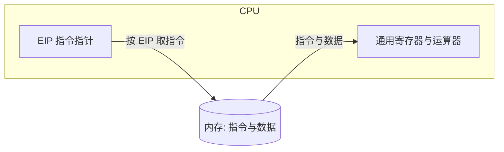
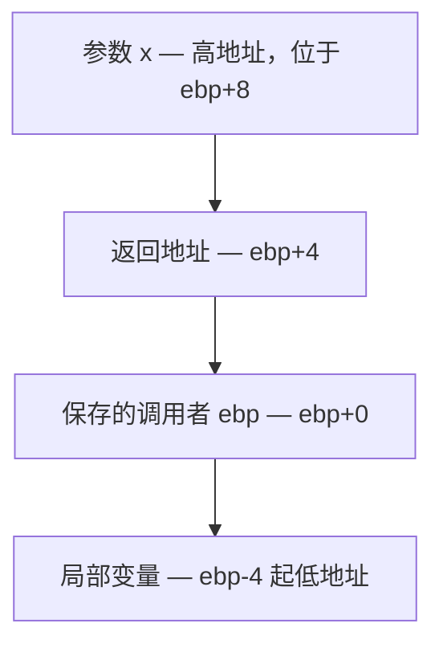

## 1. 存储程序计算机工作模型

**存储程序计算机(stored-program computer)**即冯·诺依曼体系结构(von Neumann architecture)：程序指令和数据以同等地位存放在同一个存储器中，计算机按"取指—译码—执行"的循环自动工作。这是理解计算机乃至操作系统最核心的模型。



- CPU(Central Processing Unit) 依次从内存取出指令执行，**指令指针永远指向下一条要执行的指令**
- x86-32 上指令指针是 **EIP(Extended Instruction Pointer, 扩展指令指针)**，顺序执行时自动前移：

```text
EIP = 当前指令地址 + 当前指令长度
```

- call、jmp、ret、iret 等控制转移指令会显式修改 EIP，函数调用与中断都建立在这上面

## 2. x86-32 平台常用寄存器

### 2.1 堆栈相关寄存器

- **esp(Stack Pointer, 堆栈指针)**：指向栈顶。x86 的栈向下生长——压栈 esp 减小，出栈 esp 增大
- **ebp(Base Pointer, 基址指针)**：记录当前函数栈帧(Stack Frame)的基址。C 语言的参数、局部变量都以 ebp 加偏移访问，例如 8(%ebp) 是第一个参数、-4(%ebp) 是局部变量

### 2.2 EIP 与 CS 寄存器

CS(Code Segment, 代码段寄存器)与 EIP 配合确定指令入口：

- 实模式下 CPU 将 CS 左移 4 位再加上 IP 得到 20 位物理地址；保护模式下 CS:EIP 经段机制与分页机制转换成物理地址
- **call**：将返回地址（当前的 cs:eip）压栈，再跳转到目标函数入口
- **ret**：从栈顶弹出返回地址放入 eip，回到调用点继续执行
- **jmp / 条件跳转**：直接把目标地址放入 cs:eip

寄存器名字的由来（A 累加器、B 基址、C 计数、D 数据）可参考 [EAX x86 Register: Meaning and History](https://keleshev.com/eax-x86-register-meaning-and-history/)。

### 2.3 通用寄存器一览

| 寄存器 | 用途惯例 |
| --- | --- |
| eax | 累加器(Accumulator)，函数返回值、系统调用号与返回值都放这里 |
| ebx / ecx / edx | 基址、计数、数据通用寄存器 |
| esi / edi | 变址寄存器，串操作的源/目的索引 |
| esp / ebp | 堆栈指针与栈帧基址 |
| eflags | 标志寄存器 |
| cs / ds / ss 等 | 段寄存器 |

## 3. AT&T 汇编基础

Linux 内核与 gcc 默认使用 AT&T 语法，与 Intel 语法的主要差异：

| 差异点 | AT&T | Intel |
| --- | --- | --- |
| 寄存器前缀 | %eax | eax |
| 立即数前缀 | $0x123 | 0x123 |
| 操作数方向 | 源在前、目的在后：movl %eax, %ebx | 目的在前：mov ebx, eax |
| 内存寻址 | 偏移(基址)：8(%ebp) | [ebp+8] |
| 长度后缀 | b/w/l 区分字节/字/双字：movl | 由操作数推断 |

### 3.1 堆栈操作与控制转移

| 指令 | 等价动作 | 说明 |
| --- | --- | --- |
| pushl %eax | subl $4, %esp<br/>movl %eax, (%esp) | 栈先向下生长 4 字节再写入 |
| popl %eax | movl (%esp), %eax<br/>addl $4, %esp | 先读栈顶再收缩 |
| call 0x12345 | pushl %eip<br/>movl $0x12345, %eip | 返回地址压栈后跳转（eip 不能直接寻址，此处为示意） |
| ret | popl %eip | 弹出返回地址回到调用点 |

### 3.2 寻址模式

| 寻址模式 | 格式 | 示例 | 含义 |
| --- | --- | --- | --- |
| 寄存器寻址(register) | %寄存器 | %edx | 操作数就是 edx 中的值 |
| 立即寻址(immediate) | $数字 | $0x123 | 操作数是常量 0x123 |
| 直接寻址(direct) | 数字 | 0x123 | 访问地址 0x123 处的内存 |
| 间接寻址(indirect) | (%寄存器) | (%ebx) | 访问 ebx 中存放的地址指向的内存 |
| 变址寻址(displacement) | 偏移(%寄存器) | 4(%ebx) | 访问 ebx 的值加 4 处的内存 |

## 4. 汇编分析一个简单的 C 程序

课程经典示例：

```c
// main.c
int g(int x)
{
    return x + 3;
}

int f(int x)
{
    return g(x);
}

int main(void)
{
    return f(8) + 1;
}
```

用 `gcc -S -m32 -o main.s main.c` 编译为 32 位汇编，核心代码如下（默认 -O0 级别，省略了保存中间变量的部分指令，保留关键路径）：

```assembly
g:
    pushl   %ebp            # 保存调用者的栈帧基址
    movl    %esp, %ebp      # 建立本函数栈帧：ebp 指向保存的旧 ebp
    movl    8(%ebp), %eax   # 取第一个参数 x（在 ebp+8 处）
    addl    $3, %eax        # x + 3，返回值放 eax
    popl    %ebp            # 恢复调用者 ebp
    ret                     # 弹出返回地址到 eip

f:
    pushl   %ebp
    movl    %esp, %ebp
    subl    $4, %esp        # 在栈帧中腾出 4 字节放参数
    movl    8(%ebp), %eax   # 取参数 x
    movl    %eax, (%esp)    # 写到栈顶，作为 g 的参数
    call    g               # 返回地址压栈，跳到 g
    leave                   # movl %ebp, %esp; popl %ebp，拆除栈帧
    ret

main:
    pushl   %ebp
    movl    %esp, %ebp
    subl    $4, %esp
    movl    $8, (%esp)      # 压入 f 的实参 8
    call    f
    addl    $1, %eax        # f(8) + 1
    leave
    ret
```

### 4.1 函数调用栈帧的通用结构

call 把返回地址压栈、被调函数开头保存旧 ebp 并让 ebp 指向此处，于是每个栈帧形成固定布局：

| 位置 | 内容 |
| --- | --- |
| 8(%ebp) | 第一个参数 |
| 12(%ebp) | 第二个参数 |
| 4(%ebp) | 返回地址（call 压栈） |
| 0(%ebp) | 调用者的 ebp（pushl %ebp） |
| -4(%ebp) 起 | 局部变量 |



### 4.2 关键结论

- **函数调用堆栈是 C 语言局部变量作用域、参数传递、函数返回的底层支撑**：进入函数建立栈帧（pushl %ebp; movl %esp, %ebp），返回前拆除（leave 或 movl %ebp, %esp; popl %ebp），ret 回到调用者
- 参数由调用者压栈（或按约定放寄存器），返回值通过 eax 传递
- ebp 串起调用链：每个栈帧里都保存着上一个栈帧的 ebp，调试器的 backtrace 就是沿这条链回溯的

## 5. 实验：分析自己写的多函数程序

```c
#include <stdio.h>

void p1(char c)
{
    printf("%c\n", c);
}

int p2(int x, int y)
{
    return x + y;
}

int main(void)
{
    char c = 'a';
    int x, y, z;
    x = 1;
    y = 2;
    p1(c);
    z = p2(x, y);
    printf("%d=%d+%d\n", z, x, y);
}
```

编译并观察汇编与运行时堆栈：

```bash
gcc -m32 -S -o main.s main.c    # 生成 32 位 AT&T 汇编，对照阅读 p1、p2 的栈帧
gcc -m32 -g -o main main.c      # 带调试信息编译
gdb ./main                      # break p2 后用 disas、info registers ebp esp 观察栈帧
```

观察点：

- p2 的两个参数如何压栈，如何用 8(%ebp)、12(%ebp) 取出
- p1 的 char 参数压栈时的长度处理
- p2 的返回值如何放进 eax，main 又如何取用
