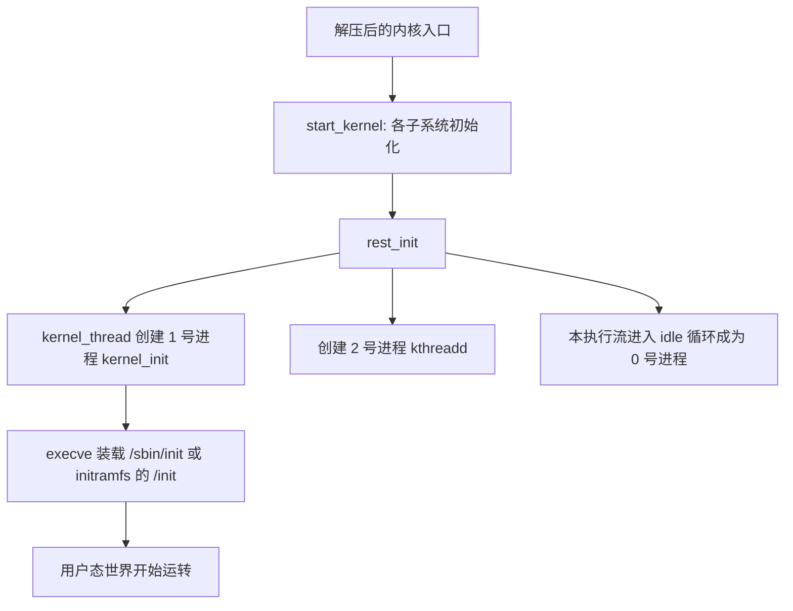

## 1. 实验环境总览

分析内核源码离不开动手实验。课程实验环境三件套：

| 组件 | 作用 |
| --- | --- |
| linux-3.18.6 源码 | 课程选定版本的内核源码 |
| QEMU(Quick EMUlator) | 纯软件虚拟机，-kernel 参数直接引导编译出的内核 |
| gdb | 通过 QEMU 内置的 gdb server 远程调试内核 |

## 2. 内核源码目录结构

| 目录 | 内容 |
| --- | --- |
| arch/ | 体系结构相关代码，arch/x86/ 是课程分析重点 |
| kernel/ | fork、调度、时间、软中断等核心子系统 |
| mm/ | 内存管理 |
| fs/ | 各文件系统与 VFS |
| drivers/ | 设备驱动 |
| ipc/ | 进程间通信 |
| net/ | 网络协议栈 |
| include/ | 内核头文件，如 include/linux/sched.h 中的 task_struct |
| init/ | 内核入口 start_kernel 所在的 main.c |

## 3. 编译内核

```bash
# 安装工具链
sudo apt install build-essential qemu-system-x86 libncurses-dev \
                 bison flex libssl-dev

# 下载并解压 linux-3.18.6
wget https://cdn.kernel.org/pub/linux/kernel/v3.x/linux-3.18.6.tar.xz
tar xf linux-3.18.6.tar.xz && cd linux-3.18.6

make i386_defconfig    # 使用 32 位 x86 默认配置，课程分析的是 32 位代码路径
make                   # 多线程可 make -j4
```

编译产物：

- **arch/x86/boot/bzImage**：压缩后的引导镜像，交给 QEMU 引导
- **vmlinux**：带符号的 ELF 内核映像，gdb 调试时加载它才能看到函数名与行号

## 4. 构造根文件系统与 MenuOS

内核启动后需要一个用户态程序作为第一个进程。课程用 mengning/menu 项目构造了一个名为 **MenuOS** 的最小系统（menu 仓库不同版本源文件略有差异，以课程实验指导为准）：

```bash
git clone https://github.com/mengning/menu.git
cd menu
gcc -pthread -o init linktable.c menu.c test.c -m32 -static

# 以 rootfs 目录为根制作 initramfs
mkdir rootfs && cp init rootfs/
cd rootfs && find . | cpio -o -Hnewc | gzip -9 > ../rootfs.img
```

rootfs.img 即 **initramfs(initial RAM file system)**：内核启动早期挂载的内存根文件系统，其中的 /init 是内核启动的第一个用户态程序。

启动：

```bash
qemu-system-i386 -kernel linux-3.18.6/arch/x86/boot/bzImage \
                 -initrd rootfs.img -s -S
```

| 参数 | 含义 |
| --- | --- |
| -kernel | 直接引导 bzImage，不依赖磁盘引导扇区 |
| -initrd | 提供 initramfs |
| -s | 等价于 -gdb tcp::1234，在 1234 端口开启 gdb server |
| -S | 启动时 CPU 暂停执行，等 gdb 连接后再继续 |

MenuOS 内置 help、version 等命令，还可以挂接 time、fork 等测试命令，用于跟踪系统调用与进程创建。

## 5. gdb 跟踪内核

另开一个终端连接调试：

```bash
cd linux-3.18.6
gdb vmlinux                # 加载带符号的内核映像
(gdb) target remote:1234   # 连接 QEMU 的 gdb server
(gdb) break start_kernel   # 内核 C 语言入口
(gdb) c
```

| 命令 | 作用 |
| --- | --- |
| b / c | 设置断点 / 继续执行 |
| n / s | 单步（不进入 / 进入函数） |
| finish | 执行到当前函数返回 |
| bt | 查看调用栈 |
| l | 显示源码 |
| p 变量 | 打印变量 |
| disas | 反汇编当前栈帧 |

## 6. 内核启动主线

init/main.c 中的 **start_kernel** 是内核的 C 语言入口：

- 依次完成各子系统初始化：setup_arch（体系结构相关）、trap_init（中断与异常门）、mm_init（内存管理）、sched_init（调度器）……几十个 init 逐步就位
- 末尾调用 **rest_init**：
  - kernel_thread 创建 1 号进程 kernel_init，最终 execve 装载 /sbin/init 或 initramfs 中的 /init，用户态世界开始
  - 创建 2 号进程 kthreadd，作为所有内核线程的孵化器
  - 本执行流进入 idle 循环，沦为 0 号进程 idle：无事可做时 CPU 在这里等待中断



用 gdb 在 start_kernel、rest_init 上打断点单步跟一遍，就能对这条主线有直观体感。
