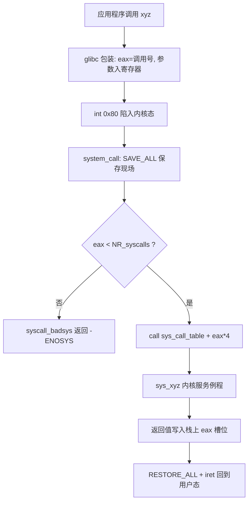

## 1. 为什么需要系统调用

CPU 有特权级机制，x86 分 ring 0～3，Linux 只使用两级：

- **内核态(kernel mode, ring 0)**：可以执行特权指令、访问全部内存与设备
- **用户态(user mode, ring 3)**：只能访问自己的地址空间，不能直接操作硬件

应用程序运行在用户态，需要内核服务（读文件、创建进程……）时，**通过一条特殊的陷入指令主动进入内核态，这个过程就是系统调用(System Call)**。它是用户态主动进入内核的唯一合法入口（另一类入口是中断与异常，属于被动进入）。

三个层次的概念要分清：

| 层次 | 例子 | 说明 |
| --- | --- | --- |
| API(Application Programming Interface) | glibc 的 printf、fork、open | 应用编程接口，通常实现在 libc 中 |
| 系统调用 | sys_fork、sys_open | 内核中的服务例程 |
| 陷入指令 | int $0x80 / sysenter | 触发特权级切换的指令 |

xyz() 库函数与 sys_xyz 内核例程大致一一对应；printf 这类复杂函数则可能组合多个系统调用（最终靠 write 输出）。

## 2. 系统调用的触发机制（32 位 x86）

调用约定：

- **eax 放系统调用号**，作为 sys_call_table 的下标
- 参数依次放 ebx、ecx、edx、esi、edi（最多 5 个寄存器传参，更多时借助内存）
- 返回值也在 eax，出错时为负的错误码（如 -ENOMEM）

系统调用表 sys_call_table 定义在 arch/x86/kernel/syscall_32.S，每个表项指向一个内核服务例程；内核用 NR_syscalls 界定合法下标：

```c
// arch/x86/kernel/syscall_32.S（节选）
ENTRY(sys_call_table)
    .long sys_restart_syscall   /* 0 */
    .long sys_exit
    .long sys_fork
    .long sys_read
    .long sys_write
    /* ……共 NR_syscalls 项 */
```

## 3. 源码走读：system_call 入口

int $0x80 触发后，CPU 查 IDT(Interrupt Descriptor Table, 中断描述符表) 的 0x80 号门描述符，切换到内核态并跳到 entry_32.S 中的 system_call（简化，省略了系统调用跟踪与信号处理分支）：

```assembly
# arch/x86/kernel/entry_32.S（linux-3.18.6，简化）
ENTRY(system_call)
    SAVE_ALL                      # 把通用寄存器、段寄存器压入内核栈
    GET_THREAD_INFO(%ebp)         # 让 ebp 指向当前进程的 thread_info
    cmpl $(NR_syscalls), %eax     # 检查系统调用号是否越界
    jae syscall_badsys            # 越界则返回 -ENOSYS
syscall_call:
    call *sys_call_table(,%eax,4) # 按调用号间接调用 sys_xyz
    movl %eax, PT_EAX(%esp)       # 返回值写回栈上保存的 eax 槽位
syscall_exit:
    # ……检查是否需要处理信号、重新调度（此处省略）
restore_all:
    RESTORE_ALL                   # 弹出 SAVE_ALL 保存的现场
    INTERRUPT_RETURN              # 即 iret：弹出 eip/cs/eflags/esp/ss 回用户态
```

SAVE_ALL 展开后是一串压栈，在内核栈上构造出 **pt_regs 结构**——用户态现场在内核里的完整快照：

```assembly
# SAVE_ALL 宏（节选，压栈顺序：fs es ds eax ebp edi esi edx ecx ebx）
    pushl %fs
    pushl %es
    pushl %ds
    pushl %eax
    pushl %ebp
    pushl %edi
    pushl %esi
    pushl %edx
    pushl %ecx
    pushl %ebx
    movl $__USER_DS, %edx         # 装入用户态数据段选择子
    movl %edx, %ds
    movl %edx, %es
    movl %edx, %fs
```

完整路径：



## 4. 实验：在 MenuOS 中跟踪系统调用

MenuOS 中执行 time 命令会触发 sys_time，用 gdb 跟踪：

```bash
(gdb) b sys_time
(gdb) c
# 在 MenuOS 中输入 time 回车
(gdb) finish          # 观察返回值：$eax 为当前时间戳
```

进阶做法：在 system_call 入口打断点观察每一次陷入，或对 sys_call_table 打硬件观察点，看 dispatch 的间接跳转。

## 5. 要点小结

- 系统调用的完整路径：int $0x80 → system_call → sys_call_table → sys_xyz → iret
- 内核通过 SAVE_ALL 在内核栈保存用户态现场，返回时 RESTORE_ALL + iret 恢复——与中断处理共用同一套骨架
- 系统调用号是用户态与内核之间唯一的"服务菜单"，内核据此做合法性检查后间接调用服务例程
