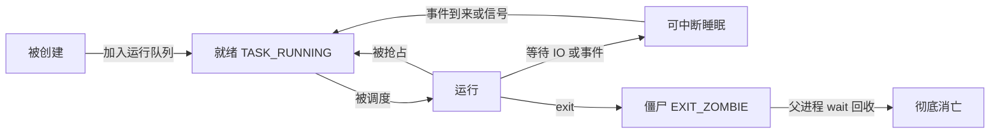
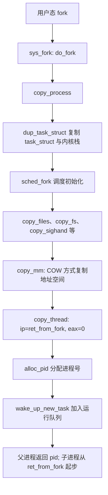

## 1. 进程与进程控制块

**进程(Process)是程序在某一数据集合上的一次运行过程，是资源分配的基本单位**；程序是静态的可执行文件，进程是动态的执行实例。

操作系统用 **PCB(Process Control Block, 进程控制块)**描述进程。Linux 的 PCB 是 include/linux/sched.h 中的 **task_struct**，主要内容：

| 类别 | 代表字段 | 说明 |
| --- | --- | --- |
| 标识 | pid、tgid | 进程号；tgid 是线程组号，多线程共享 |
| 状态 | state、exit_state | TASK_RUNNING 等 |
| 调度 | prio、policy、se | 优先级、调度策略、调度实体（CFS 相关） |
| 内存 | mm（struct mm_struct） | 进程地址空间：代码段、数据段、堆、栈与页目录 pgd |
| 文件 | files、fs | 打开文件表、根目录与工作目录 |
| 信号 | signal、sighand | 信号处理相关 |
| 进程树 | real_parent、parent、children、sibling | 父子兄弟链 |
| CPU 现场 | thread | 进程切换时保存的内核栈顶 sp 与恢复点 ip |

task_struct 与内核栈的关联：每个进程有一个内核栈，栈的最低端放着 **thread_info**，其中存有指向 task_struct 的指针——current 宏正是从 esp 掩码出内核栈地址、再经 thread_info 找到当前进程的 task_struct。

### 1.1 进程状态（linux-3.18.6）

| 状态 | 含义 |
| --- | --- |
| TASK_RUNNING | 就绪或正在 CPU 上运行 |
| TASK_INTERRUPTIBLE | 可中断睡眠：等待事件，可被信号唤醒 |
| TASK_UNINTERRUPTIBLE | 不可中断睡眠：不响应信号 |
| __TASK_STOPPED | 停止态：如收到 SIGSTOP |
| EXIT_ZOMBIE | 僵尸态：已退出但父进程尚未 wait 回收 |



## 2. 创建进程：fork 族系统调用

fork、vfork、clone 三个系统调用都进入 kernel/fork.c 的 do_fork，差别在 clone_flags：

| 系统调用 | 特点 | 典型用途 |
| --- | --- | --- |
| fork | 半复制创建子进程，地址空间按 COW(Copy-On-Write, 写时复制)处理 | shell 启动命令 |
| vfork | 不复制地址空间，父进程挂起直到子进程 exec 或 exit | 早期为 exec 做的优化 |
| clone | 通过 flags 精确控制共享哪些资源 | 创建线程（共享 mm、files 等） |

```c
// kernel/fork.c（linux-3.18.6，简化）
long do_fork(unsigned long clone_flags, ...)
{
    struct task_struct *p;
    p = copy_process(clone_flags, stack_start, stack_size,
                     parent_tidptr, NULL, child_tidptr, pid);
    if (!IS_ERR(p)) {
        wake_up_new_task(p);       /* 唤醒新进程投入运行 */
    }
    return nr;                     /* 父进程返回子进程 pid */
}
```

copy_process 中的关键步骤（简化归纳，顺序有调整，每一步失败都要回滚已复制的资源）：

1. **dup_task_struct**：分配内核栈并在栈底放 thread_info，整体复制父进程的 task_struct
2. **copy_creds**：复制凭证（UID 等身份信息），并检查进程数上限
3. **sched_fork**：调度相关字段初始化，进程状态置为 TASK_RUNNING
4. **copy_files / copy_fs / copy_sighand / copy_signal**：按 clone_flags 决定与父进程共享还是复制
5. **copy_mm**：处理地址空间。普通 fork 下页表按 COW 方式映射——父子只读共享同一物理页，谁先写谁触发缺页异常再复制，这是 fork 快的关键
6. **copy_thread**：布置子进程的执行现场——thread.ip 设为 ret_from_fork，子进程的 eax 置 0
7. **alloc_pid**：分配 pid

于是 fork 有著名的**"一次调用、两次返回"**：父进程拿到子进程 pid，子进程从 ret_from_fork 出发、经 RESTORE_ALL/iret 返回用户态时拿到 0：

```c
pid_t pid = fork();
if (pid == 0) {
    /* 子进程 */
} else if (pid > 0) {
    /* 父进程 */
}
```



## 3. 特殊进程

| 进程 | pid | 身份 |
| --- | --- | --- |
| idle（swapper） | 0 | start_kernel 演变而来，无事可做时占着 CPU 等中断 |
| init | 1 | 所有用户态进程的祖先，负责回收孤儿进程 |
| kthreadd | 2 | 所有内核线程的祖先，kernel_thread 的请求由它孵化 |

内核线程(kernel thread)只运行在内核态、没有独立用户地址空间（mm 为 NULL，借用上一个用户进程的 active_mm），承担刷脏页、内存回收（kswapd）等后台工作。

## 4. 实验：跟踪 fork

```bash
(gdb) b sys_fork
(gdb) b do_fork
(gdb) c
# 在 MenuOS 中执行会触发 fork 的命令后：
(gdb) bt              # 观察从系统调用入口到 do_fork 的调用栈
(gdb) finish          # 返回值即子进程 pid
```

宿主机上观察进程树：`pstree -p` 或 `ps -ef --forest`——父子关系正是 task_struct 里 children/sibling 链的外在表现。
