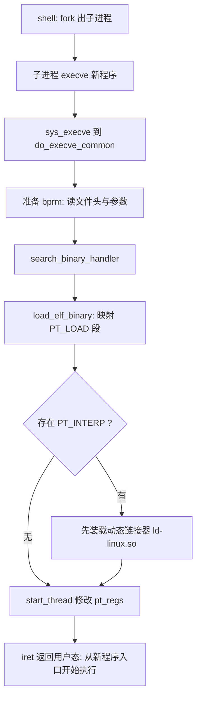

## 1. ELF 文件格式

Linux 可执行文件采用 **ELF(Executable and Linkable Format, 可执行可链接格式)**，一种格式三种用途：

| 类型 | 扩展惯例 | 用途 |
| --- | --- | --- |
| 可重定位文件(Relocatable) | .o | 编译中间产物，等待链接 |
| 可执行文件(Executable) | a.out 等 | 带入口地址，可直接装载运行 |
| 共享目标文件(Shared Object) | .so | 动态链接库，装载时或运行时链接 |

同一个文件有两个观察视角：

- **链接视角**：文件由 section 组成——.text 代码、.data 已初始化数据、.bss 未初始化数据、.symtab 符号表、.rel 重定位信息
- **装载视角**：文件由 segment 组成，Program Header 表描述哪些段映射到内存哪个虚地址、什么权限——内核装载时只关心后者

```bash
readelf -h hello      # ELF 头：入口地址、文件类型、目标架构
readelf -l hello      # Program Headers：PT_LOAD、PT_INTERP 等 segment
readelf -S hello      # Section Headers
```

## 2. 装载过程：execve 源码走读

shell 执行一个外部命令的典型路径是 fork + execve。execve 用新程序替换当前进程的用户态映像，而 pid 不变。

调用链（linux-3.18.6）：sys_execve → do_execve → **do_execve_common**（新内核已演进为 do_execveat_common 等，函数名随版本变化，主干一致）：

```c
// fs/exec.c（linux-3.18.6，大幅简化）
static int do_execve_common(struct linux_binprm *bprm, ...)
{
    bprm_mm_init(bprm);            /* 建立新的 mm_struct 与用户栈 */
    prepare_binprm(bprm);          /* 读入文件头，统计参数与环境变量 */
    search_binary_handler(bprm);   /* 逐个尝试内核支持的可执行格式 */
    ...
}
```

内核支持多种二进制格式（ELF、以 #! 开头的脚本等），每种注册一个 linux_binfmt；search_binary_handler 按文件头魔数匹配，ELF 对应 fs/binfmt_elf.c 的 **load_elf_binary**，其关键动作：

1. 校验 ELF 魔数 0x7f、'E'、'L'、'F'
2. 按 Program Header 把类型为 PT_LOAD 的 segment 依次 elf_map 到进程地址空间：代码段只读可执行、数据段读写
3. 若存在 PT_INTERP（动态链接器，如 /lib/ld-linux.so.2），先装载它，程序入口改为动态链接器——由它装载完共享库后再跳回程序本体
4. **start_thread**：修改保存在内核栈 pt_regs 里的 eip/esp，指向新程序入口和初始栈；本次系统调用 iret 返回时，进程就站在新程序的世界里了



## 3. 动态链接

| 方式 | 做法 | 特点 |
| --- | --- | --- |
| 静态链接 | 链接时把库全部并入可执行文件 | 独立可移植，但体积大、多进程重复占内存 |
| 装载时链接 | 启动时由 ld.so 解析依赖并重定位 | 体积小、物理内存共享，启动稍慢 |
| 运行时链接 | dlopen / dlsym 按需加载 | 插件机制，问题暴露得晚 |

延迟绑定：借助 PLT(Procedure Linkage Table) 与 GOT(Global Offset Table)，函数第一次被调用时才解析真实地址，加快启动。

## 4. 新进程的用户态起步

execve 后 iret 进入的不是 main，而是程序入口 _start（由 crt1.o 提供）；_start 准备好环境后调用 glibc 的 __libc_start_main，后者才调用 main，并在 main 返回后调用 exit。

初始用户栈的布局（高地址到低地址）：环境变量字符串、参数字符串、auxv 辅助向量、envp[]、argv[]、argc——__libc_start_main 正是从这里拿到 argc/argv/envp 的。

```bash
gcc -m32 -static -o hello hello.c    # MenuOS 无动态库环境，实验需静态编译
ldd hello                            # 查看动态依赖，静态程序显示 not a dynamic executable
```

## 5. fork 与 execve 的配合

fork 负责复制执行环境（COW 让代价很低），execve 负责替换用户态映像，两者组合就是 shell 启动外部命令、系统拉起服务的通用模式。概念上：**fork 复制 PCB，execve 换掉地址空间与执行现场，进程的"身份"pid 始终不变**。
