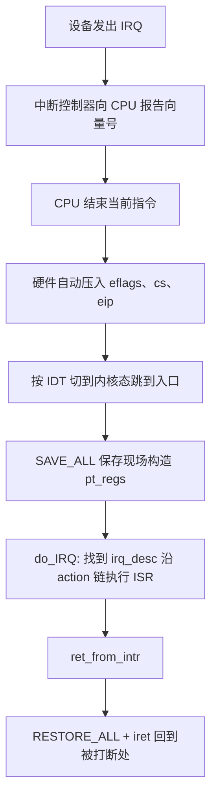

## 1. 中断与异常

CPU 可能长时间运行在用户程序里，**操作系统必须有一种"打断"机制夺回控制权**——这就是中断。它同时也是设备与内核通信、时钟驱动调度的基础。

|  | 中断(Interrupt) | 异常(Exception) |
| --- | --- | --- |
| 来源 | 外部设备，异步产生 | CPU 执行指令本身引起，同步 |
| 例子 | 时钟、键盘、磁盘完成 | 缺页异常、int 0x80 陷入、除零 |
| 与当前进程 | 无关 | 由当前指令引发 |

异常分三类：

| 类别 | 特点 | 例子 | 处理后去向 |
| --- | --- | --- | --- |
| 故障(Fault) | 修复后可重新执行当前指令 | 缺页异常 | 返回到当前指令 |
| 陷入(Trap) | 有意为之 | 系统调用、断点 | 返回到下一条指令 |
| 终止(Abort) | 不可恢复 | 硬件严重错误 | 进程被杀死 |

- 每个中断/异常有编号（向量），入口表是 **IDT(Interrupt Descriptor Table, 中断描述符表)**，由 trap_init 初始化
- 硬件中断经中断控制器投递（现代 x86 平台是 APIC(Advanced Programmable Interrupt Controller)），设备的中断线称 **IRQ(Interrupt ReQuest)**
- **时钟中断是操作系统的脉搏**：计时与调度都由它驱动

## 2. 中断处理流程

硬件与软件配合完成一次中断处理（32 位 x86，linux-3.18.6）：



内核为每个 IRQ 维护一个 irq_desc，其 action 链表挂着一个或多个 **ISR(Interrupt Service Routine, 中断服务例程)**，由驱动通过 request_irq 注册。/proc/interrupts 可查看每个 IRQ 的来源与触发次数。

### 2.1 中断上下文

- **进程上下文**：代码代表某个进程执行，可以睡眠（例如系统调用里的逻辑）
- **中断上下文**：不代表任何进程执行，**不能睡眠、不能阻塞**，处理要尽量短小

因此耗时工作被放入**下半部(bottom half)**延后处理：

| 机制 | 执行环境 | 特点 |
| --- | --- | --- |
| softirq | 中断上下文 | 最底层机制，同类型可在多 CPU 并发 |
| tasklet | 中断上下文 | 基于 softirq，同类型串行，用起来简单 |
| workqueue | 进程上下文 | 可以睡眠，适合睡等资源的工作 |

## 3. 设备驱动框架

Linux 把设备抽象成文件——**一切皆文件**。应用层 open/read/write 到达 VFS(Virtual File System) 层后，经由 struct file 里的 **file_operations** 分发到具体驱动的函数：


- 设备号 = 主设备号(major，驱动类别) + 次设备号(minor，同类中的实例)；/dev 下的设备节点由 mknod 创建（或由 devtmpfs 自动创建）
- 字符设备的核心结构是 cdev + file_operations；块设备与网络设备另有各自框架

一个最小字符设备驱动骨架（示意）：

```c
// mydev.c —— 最小字符设备驱动骨架（示意）
#include <linux/module.h>
#include <linux/fs.h>
#include <linux/cdev.h>
#include <linux/interrupt.h>

static dev_t devno;
static struct cdev my_cdev;

static irqreturn_t my_isr(int irq, void *dev_id)
{
    /* 读硬件寄存器、清中断标志，尽量短小 */
    return IRQ_HANDLED;
}

static ssize_t my_read(struct file *filp, char __user *buf,
                       size_t count, loff_t *ppos)
{
    /* copy_to_user 把内核数据带回用户态 */
    return 0;
}

static const struct file_operations my_fops = {
    .owner = THIS_MODULE,
    .read  = my_read,
};

static int __init my_init(void)
{
    alloc_chrdev_region(&devno, 0, 1, "mydev");  /* 申请设备号 */
    cdev_init(&my_cdev, &my_fops);
    cdev_add(&my_cdev, devno, 1);
    request_irq(42, my_isr, IRQF_SHARED, "mydev", NULL); /* 注册中断 */
    return 0;
}

static void __exit my_exit(void)
{
    free_irq(42, NULL);
    cdev_del(&my_cdev);
    unregister_chrdev_region(devno, 1);
}

module_init(my_init);
module_exit(my_exit);
MODULE_LICENSE("GPL");
```

配套 Makefile 与常用命令：

```bash
make                       # 内核模块 Makefile：obj-m += mydev.o
sudo insmod mydev.ko       # 加载模块
dmesg                      # 查看 printk 输出
sudo mknod /dev/mydev c 主设备号 次设备号
sudo rmmod mydev
```

## 4. 与系统调用机制的关系

系统调用与中断走的是同一套"保存现场—处理—恢复现场"骨架：int $0x80 可以看作应用主动触发的特殊中断，SAVE_ALL / RESTORE_ALL / iret 完全复用。理解了中断机制，系统调用的进入与返回路径就自然清楚了。
