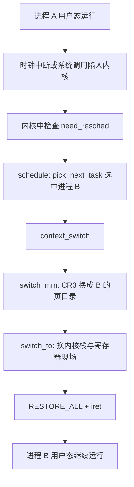

## 1. 进程调度的概念

多个进程竞争有限的 CPU，**调度器(Scheduler)决定谁下一个上 CPU、运行多久**。触发调度的时机：

- 进程阻塞或退出（主动让出 CPU）
- 时钟中断等发现时间片耗尽、或有更高优先级任务就绪（抢占）
- 中断或系统调用返回用户态前检查 need_resched 标志

### 1.1 调度策略（linux-3.18.6）

| 策略 | 类别 | 说明 |
| --- | --- | --- |
| SCHED_NORMAL（即 SCHED_OTHER） | 普通进程 | 走 CFS |
| SCHED_BATCH | 普通进程 | 批处理型，对交互不敏感 |
| SCHED_IDLE | 普通进程 | 极低优先级，CPU 空闲时才运行 |
| SCHED_FIFO | 实时进程 | 先到者一直运行，直到退出或让出 |
| SCHED_RR | 实时进程 | 带时间片轮转的 FIFO |

实时进程永远优先于普通进程；普通进程可用 nice 值（-20～19）调整权重，值越低优先级越高。

### 1.2 调度器演进

| 调度器 | 内核版本 | 数据结构 | 问题与改进 |
| --- | --- | --- | --- |
| O(n) | 早期 2.4 | 每次遍历就绪队列 | 进程多时选择开销线性增长 |
| O(1) | 2.6 起 | 按优先级的位图队列 | 交互任务判定复杂、公平性差 |
| CFS(Completely Fair Scheduler, 完全公平调度) | 2.6.23 起 | 每 CPU 一棵红黑树 | 以 vruntime 为核心的公平模型 |

### 1.3 CFS 原理

- 每个任务记录 **vruntime（虚拟运行时间）**：权重越高的任务 vruntime 增长越慢，公式为 `vruntime += 实际运行时间 × NICE_0_LOAD / 权重`
- 就绪任务按 vruntime 组织在红黑树中，**最左侧结点（vruntime 最小者）就是下一个该运行的进程**
- 树中维护单调递增的 min_vruntime，防止休眠很久的任务醒来后 vruntime 落后太多而长期霸占 CPU
- 调度实体 sched_entity 内嵌在 task_struct 的 se 字段里，使进程调度与组调度统一建模

## 2. 进程切换：schedule → context_switch → switch_to

调度器选中 next 之后，把 CPU 从 prev 交给 next 的过程即**进程切换(Process Switch)**，核心在 kernel/sched/core.c 的 context_switch：

```c
// kernel/sched/core.c（linux-3.18.6，简化）
static inline void
context_switch(struct rq *rq, struct task_struct *prev,
               struct task_struct *next)
{
    struct mm_struct *mm, *oldmm;
    mm = next->mm;
    oldmm = prev->active_mm;
    if (!mm) {                     /* next 是内核线程：借用 prev 的地址空间 */
        next->active_mm = oldmm;
        atomic_inc(&oldmm->mm_count);
        enter_lazy_tlb(oldmm, next);   /* 惰性 TLB：不切换页表 */
    } else
        switch_mm(oldmm, mm, next);   /* 第一步：加载 next 的 pgd 到 CR3 */
    /* …… */
    switch_to(prev, next, prev);      /* 第二步：切换内核栈与寄存器现场 */
}
```

两步分工明确：

| 步骤 | 做什么 | 涉及硬件 |
| --- | --- | --- |
| switch_mm | 切换 mm_struct，把 next 的页目录 pgd 装入 CR3 | 页表、TLB(Translation Lookaside Buffer) |
| switch_to | 切换内核栈 esp、恢复寄存器现场 | 通用寄存器、栈 |

### 2.1 switch_to 汇编（32 位，简化）

```assembly
# arch/x86/kernel/entry_32.S 中的 switch_to 宏（linux-3.18.6，省略 canary 等细节）
    pushfl                          /* 保存 EFLAGS */
    pushl %ebp                      /* 保存 prev 的 ebp */
    movl %esp, %[prev_sp]           /* 保存 prev 内核栈顶 -> prev->thread.sp */
    movl %[next_sp], %esp           /* 换栈：之后压栈都落在 next 的内核栈 */
    movl $1f, %[prev_ip]            /* 记下 prev 将来的恢复点（标号 1 处） */
    pushl %[next_ip]                /* next 的恢复点压入其栈顶 */
    jmp __switch_to                 /* 保存/恢复浮点、TLS、IO 位图等，结尾 ret */
1:  popl %ebp                       /* next 从这里恢复执行 */
    popfl
```

- 换栈之后 `jmp __switch_to`，其结尾的 ret 弹出的正是刚压入的 next 恢复点——prev 与 next 的执行流在此交汇又分离
- prev 再次被调度时从标号 1 继续，就像 switch_to 刚刚返回一样
- 新建进程从未执行过：copy_thread 把其 thread.ip 设为 **ret_from_fork**，首次调度从那里进入 RESTORE_ALL/iret 走回用户态

### 2.2 全景



用户态现场（用户态 esp、eip 等）在陷入内核那一刻就保存在各自内核栈的 pt_regs 中；切换完成后 iret 自然恢复到 B 上次被打断的地方。

## 3. 惰性 TLB 与内核线程

内核线程 mm 为 NULL、没有用户地址空间，切换到它时无需换 CR3，沿用 prev 的 active_mm（enter_lazy_tlb）——省掉整表刷新 TLB 的开销，等切回用户进程时再换页表。

## 4. 实验：用 mykernel 观察进程切换

孟宁老师的 mykernel（github.com/mengning/mykernel）在 Linux 内核之上搭了一个极小的"内核沙盘"：时钟中断驱动的 myinterrupt.c、轮转几个 PCB 的 mymain.c，把进程切换机制简化到肉眼可见。

核心数据结构（mypcb.h，简化）：

```c
#define MAX_TASK_NUM 4
#define KERNEL_STACK_SIZE 1024*8

struct thread {                 /* 进程切换的 CPU 现场 */
    unsigned long ip;           /* 恢复执行的入口 */
    unsigned long sp;           /* 内核栈顶 */
};

typedef struct PCB {            /* 极简版 task_struct */
    int pid;
    volatile long state;        /* -1 不可运行，0 可运行，>0 已停止 */
    char stack[KERNEL_STACK_SIZE];
    struct CPU reg;             /* 切换时保存的寄存器 */
    struct thread tsk;
} PCB;
```

时钟中断到来时调用 my_schedule，其核心就是保存当前进程的 ip/sp 到 PCB、再载入 next 的 ip/sp（简化示意）：

```c
/* myinterrupt.c 的 my_schedule（示意） */
if (next->state == 0 && current->state == 0) {
    asm volatile(
        "push %%ebp\n\t"        /* 保存 ebp 到当前内核栈 */
        "mov %%esp, %0\n\t"     /* 保存当前 esp 到当前进程 PCB */
        "mov %3, %%esp\n\t"     /* 换成 next 的内核栈 */
        "mov $1f, %1\n\t"       /* 记下当前进程的恢复点 */
        "push %4\n\t"           /* next 的 ip 压栈 */
        "ret\n\t"               /* 跳到 next 执行 */
        "1:\t"
        "pop %%ebp\n\t"
        : "=m" (current->tsk.sp), "=m" (current->tsk.ip)
        : "m" (next->tsk.sp), "m" (next->tsk.ip)
    );
}
```

它就是 switch_to 宏的教学版：**保存现场 → 换栈 → 跳转 → 将来从恢复点继续**。实验步骤以课程实验指导为准（为内核打 mykernel 补丁、QEMU 以 -kernel 方式启动），跑起来后能直观看到几个进程轮流执行、互相打断的输出。
