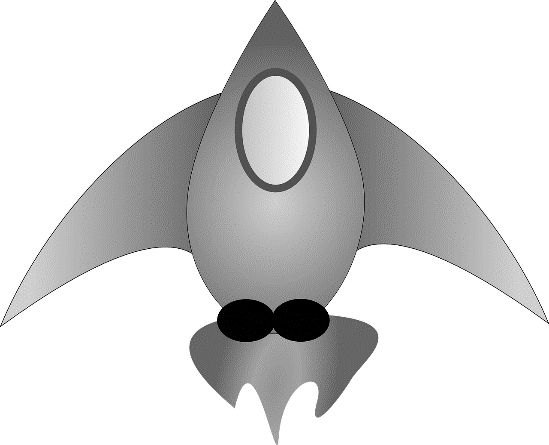
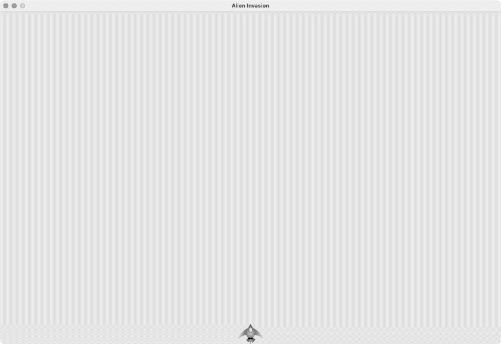
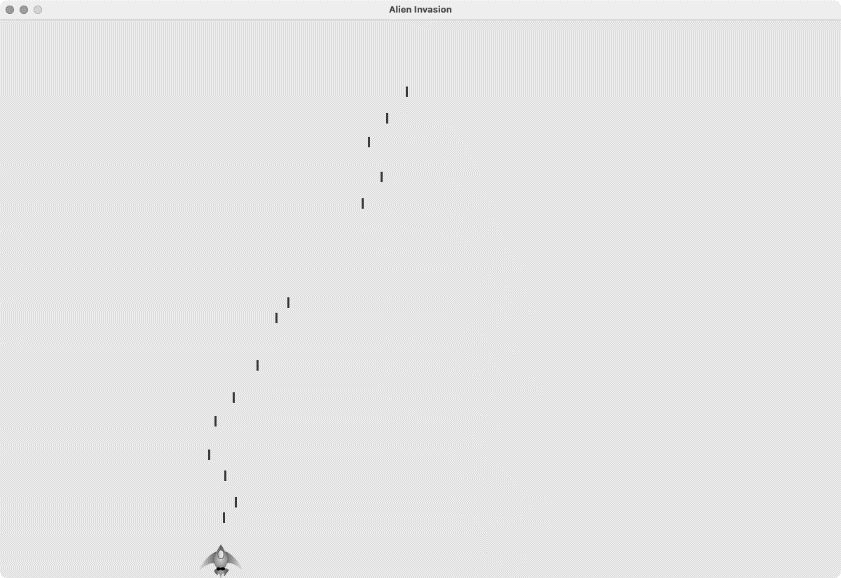

## 1. 规划项目

在开发大型项目时，先制定好规划再动手编写代码很重要。规划可确保你不偏离轨道，提高项目成功的可能性。下面来为游戏《外星人入侵》编写大概的玩法说明，其中虽然没有涵盖这款游戏的所有细节，但能让你清楚地知道该如何动手开发它：

在游戏《外星人入侵》中，玩家控制着一艘最初出现在屏幕底部中央的武装飞船。玩家可以使用方向键左右移动飞船，使用空格键进行射击。当游戏开始时，一个外星舰队出现在天空中，并向屏幕下方移动。玩家的任务是消灭这些外星人。玩家将外星人消灭干净后，将出现一个新的外星舰队，其移动速度更快。只要有外星人撞到玩家的飞船或到达屏幕下边缘，玩家就损失一艘飞船。玩家损失三艘飞船后，游戏结束。

在开发的第一个阶段，我们将创建一艘飞船，这艘飞船在用户按方向键时能够左右移动，并在用户按空格键时开火。设置这种行为后，就可以创建外星人以提高游戏的可玩性了。

## 2. 安装 Pygame

开始写程序前，需要安装 Pygame。这里将像前面安装 pytest 那样安装 Pygame——使用 pip。通过如下终端命令即可安装 Pygame：

```
$ python -m pip install --user pygame
```

如果你在运行程序或启动终端会话时使用的命令不是 python，而是 python3，务必将上述命令中的 python 替换为 python3。

## 3. 开始游戏项目

现在开始开发游戏《外星人入侵》。首先创建一个空的 Pygame 窗口，稍后将在其中绘制游戏元素，如飞船和外星人。之后，我们还将让这个游戏响应用户输入、设置背景色、加载飞船图像。

### 创建Pygame窗口及响应用户输入

下面创建一个表示游戏的类，以创建空的 Pygame 窗口。在文本编辑器中新建一个文件，将其保存为 alien_invasion.py，再在其中输入如下代码：

```python
  import sys

  import pygame

  class AlienInvasion:
      """管理游戏资源和行为的类"""

      def __init__(self):
          """初始化游戏并创建游戏资源"""
❶         pygame.init()

❷         self.screen = pygame.display.set_mode((1200, 800))
          pygame.display.set_caption("Alien Invasion")

      def run_game(self):
          """开始游戏的主循环"""
❸         while True:
              # 侦听键盘和鼠标事件
❹             for event in pygame.event.get():
❺                 if event.type == pygame.QUIT:
                      sys.exit()

              # 让最近绘制的屏幕可见
❻             pygame.display.flip()

  if __name__ == '__main__':
      # 创建游戏实例并运行游戏
      ai = AlienInvasion()
      ai.run_game()
```

首先，导入模块 sys 和 pygame。模块 pygame 包含开发游戏所需的功能；当玩家退出时，我们将使用 sys 模块中的工具来退出游戏。

为开发游戏《外星人入侵》，首先创建一个名为 AlienInvasion 的类。在这个类的 \_\_init\_\_() 方法中，调用函数 pygame.init() 来初始化背景，让 Pygame 能够正确地工作（见❶）。然后，调用 pygame.display.set_mode() 创建一个显示窗口（见❷），这个游戏的所有图形元素都将在其中绘制。实参是一个元组，(1200, 800) 指定了游戏窗口的尺寸——宽 1200 像素、高 800 像素（你可以根据自己的显示器尺寸调整）。将这个显示窗口赋给属性 self.screen，让这个类的所有方法都能够使用它。

赋给属性 self.screen 的对象是一个 surface。在 Pygame 中，**surface** 是屏幕的一部分，用于显示游戏元素。在这个游戏中，每个元素（如外星人或飞船）都是一个 surface。display.set_mode() 返回的 surface 表示整个游戏窗口，激活游戏的动画循环后，每经过一次循环都将自动重绘这个 surface，将用户输入触发的所有变化都反映出来。

这个游戏由 run_game() 方法控制。该方法包含一个不断运行的 while 循环（见❸），而这个循环包含一个事件循环以及管理屏幕更新的代码。**事件**是用户玩游戏时执行的操作，如按键或移动鼠标。为了让程序能够响应事件，可编写一个**事件循环**，以侦听事件并根据发生的事件类型执行适当的任务。嵌套在 while 循环中的 for 循环（见❹）就是一个事件循环。

我们使用 pygame.event.get() 函数来访问 Pygame 检测到的事件。这个函数返回一个列表，其中包含它在上一次调用后发生的所有事件。所有键盘和鼠标事件都将导致这个 for 循环运行。在这个循环中，我们将编写一系列 if 语句来检测并响应特定的事件。例如，当玩家单击游戏窗口的关闭按钮时，将检测到 pygame.QUIT 事件，进而调用 sys.exit() 退出游戏（见❺）。

❻处调用了 pygame.display.flip()，命令 Pygame 让最近绘制的屏幕可见。这里，它在每次执行 while 循环时都绘制一个空屏幕，并擦去旧屏幕，使得只有新的空屏幕可见。我们在移动游戏元素时，pygame.display.flip() 将不断更新屏幕，以显示新位置上的元素并隐藏原来位置上的元素，从而营造平滑移动的效果。

在这个文件末尾，创建一个游戏实例并调用 run_game()。这些代码被放在一个 if 代码块中，仅当直接运行该文件时，它们才会执行。如果此时运行 alien_invasion.py，将看到一个空的 Pygame 窗口。

### 控制帧率

理想情况下，游戏在所有的系统中都应以相同的速度（帧率）运行。对于可在多种系统中运行的游戏，控制帧率是个复杂的问题，好在 Pygame 提供了一种相对简单的方式来达成这个目标。我们将创建一个时钟（clock），并确保它在主循环每次通过后都进行计时（tick）。当这个循环的通过速度超过我们定义的帧率时，Pygame 会计算需要暂停多长时间，以便游戏的运行速度保持一致。

我们在 \_\_init\_\_() 方法中定义这个时钟：

```python
    def __init__(self):
        """初始化游戏并创建游戏资源"""
        pygame.init()
        self.clock = pygame.time.Clock()
        --snip--
```

初始化 pygame 后，创建 pygame.time 模块中的 Clock 类的一个实例，然后在 run_game() 的 while 循环末尾让这个时钟进行计时：

```python
    def run_game(self):
        """开始游戏的主循环"""
        while True:
            --snip--
            pygame.display.flip()
            self.clock.tick(60)
```

方法 tick() 接受一个参数：游戏的帧率。这里使用的值为 60，Pygame 将尽可能确保这个循环每秒恰好运行 60 次。

注意：在大多数系统中，使用 Pygame 提供的时钟有助于确保游戏的运行速度保持一致。如果在你的系统中，使用时钟导致游戏运行速度的一致性变差，可尝试不同的帧率值。如果找不到合适的帧率值，可不使用时钟，直接通过调整游戏的设置来让游戏在你的系统中平稳地运行。

### 设置背景色

Pygame 默认创建一个黑色屏幕，这太乏味了。下面在 \_\_init\_\_() 方法末尾将背景设置为另一种颜色：

```python
      def __init__(self):
      --snip--
          pygame.display.set_caption("Alien Invasion")

          # 设置背景色
❶         self.bg_color = (230, 230, 230)

      def run_game(self):
      --snip--
              for event in pygame.event.get():
                  if event.type == pygame.QUIT:
                      sys.exit()

          # 每次循环时都重绘屏幕
❷         self.screen.fill(self.bg_color)

          # 让最近绘制的屏幕可见
          pygame.display.flip()
          self.clock.tick(60)
```

在 Pygame 中，颜色是以 RGB 值指定的。这种色彩模式由红色（R）、绿色（G）和蓝色（B）值组成，其中每个值的可能取值范围都是 0～255。颜色值 (255, 0, 0) 表示红色，(0, 255, 0) 表示绿色，(0, 0, 255) 表示蓝色。通过组合不同的 RGB 值，可创建超过 1600 万种颜色。在颜色值 (230, 230, 230) 中，红色、绿色和蓝色的量相同，呈现出一种浅灰色。我们将这种颜色赋给 self.bg_color（见❶）。在❷处，调用 fill() 方法用这种背景色填充屏幕。fill() 方法用于处理 surface，只接受一个表示颜色的实参。

### 创建类Settings

每次给游戏添加新功能时，通常会引入一些新设置。下面来编写一个名为 settings 的模块，其中包含一个名为 Settings 的类，用于将所有设置都存储在一个地方，以免在代码中到处添加设置。这样，每当需要访问设置时，只需使用一个 settings 对象。在项目规模增大时，这还让游戏的外观和行为修改起来更加容易：在（接下来将创建的）settings.py 中修改一些相关的值即可，无须查找散布在项目中的各种设置。

在文件夹 alien_invasion 中，新建一个名为 settings.py 的文件，并在其中添加如下 Settings 类：

```python
class Settings:
    """存储游戏《外星人入侵》中所有设置的类"""

    def __init__(self):
        """初始化游戏的设置"""
        # 屏幕设置
        self.screen_width = 1200
        self.screen_height = 800
        self.bg_color = (230, 230, 230)
```

为了在项目中创建 Settings 实例，并使用它来访问设置，需要将 alien_invasion.py 修改成下面这样：

```python
  --snip--
  import pygame

  from settings import Settings

  class AlienInvasion:
      """管理游戏资源和行为的类"""

      def __init__(self):
          """初始化游戏并创建游戏资源"""
          pygame.init()
          self.clock = pygame.time.Clock()
❶         self.settings = Settings()

❷         self.screen = pygame.display.set_mode(
              (self.settings.screen_width, self.settings.screen_height))
          pygame.display.set_caption("Alien Invasion")

      def run_game(self):
      --snip--
              # 每次循环时都重绘屏幕
❸             self.screen.fill(self.settings.bg_color)

              # 让最近绘制的屏幕可见
              pygame.display.flip()
              self.clock.tick(60)
```

在主程序文件中，首先导入 Settings 类，并在调用 pygame.init() 后创建一个 Settings 实例，这个实例被赋给 self.settings（见❶）。在创建屏幕时（见❷），使用了 self.settings 的属性 screen_width 和 screen_height 来获取屏幕的宽度和高度；在接下来填充屏幕时，也使用了 self.settings 来获取背景色（见❸）。

如果此时运行 alien_invasion.py，结果不会有任何不同，因为我们只是将设置移到了不同的地方。现在可以在屏幕上添加新元素了。

## 4. 添加飞船图像

下面将飞船加入游戏。为了在屏幕上绘制玩家的飞船，需要先加载一幅图像，再使用 Pygame 方法 blit() 绘制它。

在为游戏选择素材时，务必注意是否有版权许可。最安全、成本最低的方式是使用 OpenGameArt 等网站提供的免费图形，这些素材无须授权许可即可使用和修改。在游戏中，可以使用几乎任意类型的图像文件，但使用位图（.bmp）文件最为简单，因为 Pygame 默认加载位图。虽然可配置 Pygame 以使用其他文件类型，但有些文件类型要求你在计算机上安装相应的图像库。网上的大多数图像是 .jpg 和 .png 格式的，不过可以使用 Photoshop、GIMP 和 Paint 等工具将其转换为位图。

在选择图像时，要特别注意背景色。请尽可能选择背景为透明或纯色的图像，以便使用图像编辑器将背景改成任意颜色。当图像的背景色与游戏的背景色一致时，游戏看起来最漂亮。简单起见，也可以直接将游戏的背景色设置成图像的背景色。

就游戏《外星人入侵》而言，飞船图像可使用文件 ship.bmp（如图 12-1 所示），它可在本书的源代码文件中找到（chapter_12/adding_ship_image/images/ship.bmp）。这个文件的背景色与项目使用的设置相同。请在项目文件夹（alien_invasion）中新建一个名为 images 的文件夹，并将文件 ship.bmp 保存在其中。



### 创建Ship类

选择好用于表示飞船的图像后，需要将其显示到屏幕上。我们创建一个名为 ship 的模块，其中包含 Ship 类，负责管理飞船的大部分行为：

```python
  import pygame

  class Ship:
      """管理飞船的类"""

      def __init__(self, ai_game):
          """初始化飞船并设置其初始位置"""
❶         self.screen = ai_game.screen
❷         self.screen_rect = ai_game.screen.get_rect()

          # 加载飞船图像并获取其外接矩形
❸         self.image = pygame.image.load('images/ship.bmp')
          self.rect = self.image.get_rect()

          # 每艘新飞船都放在屏幕底部的中央
❹         self.rect.midbottom = self.screen_rect.midbottom

❺     def blitme(self):
          """在指定位置绘制飞船"""
          self.screen.blit(self.image, self.rect)
```

Pygame 之所以高效，是因为它让你能够把所有的游戏元素当作矩形（rect 对象）来处理，即便它们的形状并非矩形也一样。而把游戏元素当作矩形来处理之所以高效，是因为矩形是简单的几何形状——例如，通过将游戏元素视为矩形，Pygame 能够更快地判断出它们是否发生了碰撞。这种做法的效果通常很好，游戏玩家几乎注意不到我们处理的不是游戏元素的实际形状。在这个类中，我们将把飞船和屏幕作为矩形进行处理。

定义这个类之前，导入模块 pygame。Ship 的 \_\_init\_\_() 方法接受两个参数：除了引用 self，还有一个指向当前 AlienInvasion 实例的引用，这让 Ship 能够访问 AlienInvasion 中定义的所有游戏资源。在❶处，将屏幕赋给 Ship 的一个属性，这样可在这个类的所有方法中轻松地访问它；在❷处，使用 get_rect() 方法访问屏幕的 rect 属性，并将其赋给 self.screen_rect，这让我们能够将飞船放到屏幕的正确位置上。

为了加载图像，我们调用 pygame.image.load()，并将飞船图像的位置传递给它（见❸）。这个函数返回一个表示飞船的 surface，而我们将这个 surface 赋给了 self.image。加载图像后，调用 get_rect() 获取相应 surface 的属性 rect，以便将来使用它来指定飞船的位置。

在处理 rect 对象时，可使用矩形的四个角及中心的 x 坐标和 y 坐标，通过设置这些值来指定矩形的位置。如果要将游戏元素居中，可设置相应 rect 对象的属性 center、centerx 或 centery；要让游戏元素与屏幕边缘对齐，可设置属性 top、bottom、left 或 right。除此之外，还有一些组合属性，如 midbottom、midtop、midleft 和 midright。要调整游戏元素的水平或垂直位置，可使用属性 x 和 y，它们分别是相应矩形左上角的 x 坐标和 y 坐标。这些属性让你无须去做游戏开发人员原本需要手动完成的计算，因此很常用。

注意：在 Pygame 中，原点 (0, 0) 位于屏幕的左上角，当一个点向右下方移动时，它的坐标值将增大。在 1200×800 的屏幕上，原点位于左上角，右下角的坐标为 (1200, 800)。这些坐标对应的是游戏窗口，而不是物理屏幕。

因为我们要将飞船放在屏幕底部的中央，所以将 self.rect.midbottom 设置为表示屏幕的矩形的属性 midbottom（见❹）。Pygame 将使用这些 rect 属性来放置飞船图像，使其与屏幕下边缘对齐并水平居中。最后，定义 blitme() 方法（见❺），它会将图像绘制到 self.rect 指定的位置。

### 在屏幕上绘制飞船

下面更新 alien_invasion.py，创建一艘飞船并调用其方法 blitme()：

```python
  --snip--
  from settings import Settings
  from ship import Ship

  class AlienInvasion:
      """管理游戏资源和行为的类"""

      def __init__(self):
      --snip--
          pygame.display.set_caption("Alien Invasion")

❶         self.ship = Ship(self)

      def run_game(self):
      --snip--
              # 每次循环时都重绘屏幕
              self.screen.fill(self.settings.bg_color)
❷             self.ship.blitme()

              # 让最近绘制的屏幕可见
              pygame.display.flip()
              self.clock.tick(60)
```

我们导入 Ship 类，并在创建屏幕后创建一个 Ship 实例（见❶）。在调用 Ship() 时，必须提供一个参数：一个 AlienInvasion 实例。在这里，self 指向的是当前的 AlienInvasion 实例。这个参数让 Ship 能够访问游戏资源，如对象 screen。我们将这个 Ship 实例赋给了 self.ship。填充背景后，调用 ship.blitme() 将飞船绘制到屏幕上，确保它出现在背景的前面（见❷）。

现在运行 alien_invasion.py，将看到飞船位于游戏屏幕底部的中央，如图 12-2 所示。



## 5. 重构：\_check_events() 方法和 \_update_screen() 方法

在大型项目中，经常需要在添加新代码前重构既有的代码。重构旨在简化既有代码的结构，使其更容易扩展。本节将把越来越长的 run_game() 方法拆分成两个辅助方法。**辅助方法**（helper method）一般在类中被调用，不会在类外调用；在 Python 中，辅助方法的名称以单下划线打头。

### \_check_events()方法

我们将把管理事件的代码移到一个名为 \_check_events() 的方法中，以简化 run_game() 并隔离事件循环。通过隔离事件循环，可将事件管理与游戏的其他方面（如更新屏幕）分离。下面是新增 \_check_events() 方法后的 AlienInvasion 类，只有 run_game() 的代码受到了影响：

```python
      def run_game(self):
          """开始游戏的主循环"""
          while True:
❶             self._check_events()

              # 每次循环时都重绘屏幕
              --snip--

❷     def _check_events(self):
          """响应按键和鼠标事件"""
          for event in pygame.event.get():
              if event.type == pygame.QUIT:
                  sys.exit()
```

我们新增了 \_check_events() 方法（见❷），并将检查玩家是否单击了关闭窗口按钮的代码移到这个方法中。要调用当前类的方法，可使用点号，并指定变量名 self 和要调用的方法的名称（见❶）。我们在 run_game() 的 while 循环中调用了这个新增的方法。

### \_update_screen()方法

为了进一步简化 run_game()，我们把更新屏幕的代码移到一个名为 \_update_screen() 的方法中：

```python
    def run_game(self):
        """开始游戏的主循环"""
        while True:
            self._check_events()
            self._update_screen()
            self.clock.tick(60)

    def _check_events(self):
    --snip--

    def _update_screen(self):
        """更新屏幕上的图像，并切换到新屏幕"""
        self.screen.fill(self.settings.bg_color)
        self.ship.blitme()

        pygame.display.flip()
```

这将绘制背景和飞船以及切换屏幕的代码移到了方法 \_update_screen() 中。现在，run_game() 中的主循环简单多了，很容易看出 run_game() 在每次循环中都会检测新发生的事件、更新屏幕并让时钟计时。

如果你开发过很多游戏，可能早就开始像这样将代码放到不同的方法中了；但如果你从未开发过这样的项目，可能在一开始不知道应该如何组织代码。这里采用的做法是，先编写尽量简单、可行的代码，再在代码越来越复杂时进行重构——这就是现实中的开发过程。对代码进行重构使其更容易扩展后，就可以开始让游戏「动起来」了。

## 6. 驾驶飞船

下面来让玩家能够左右移动飞船。你将编写代码，在用户按左右方向键时做出响应。先看看如何向右移动，再以同样的方式控制飞船向左移动。通过这样做，你将学会移动屏幕上的图像以及响应用户输入。

### 响应按键

在 Pygame 中，事件都是通过 pygame.event.get() 方法获取的，因此需要在 \_check_events() 方法中指定要检查的事件类型。在 \_check_events() 方法中，为事件循环添加一个 elif 代码块，以便在 Pygame 检测到 KEYDOWN 事件时做出响应（见❶）。在检测到 KEYDOWN 事件时，需要检查按下的是否是触发行动的键（event.key）。如果玩家按下的是右方向键（pygame.K_RIGHT），就将 self.ship.rect.x 的值加 1，从而使飞船向右移动（见❸）：

```python
      def _check_events(self):
          """响应按键和鼠标事件"""
          for event in pygame.event.get():
              if event.type == pygame.QUIT:
                  sys.exit()
❶             elif event.type == pygame.KEYDOWN:
❷                 if event.key == pygame.K_RIGHT:
                      # 向右移动飞船
❸                     self.ship.rect.x += 1
```

如果现在运行 alien_invasion.py，那么每按一次右方向键，飞船都将向右移动 1 像素。这只是一个开端，并非控制飞船的高效方式。下面来改进控制方式，允许飞船持续移动。

### 允许持续移动

当玩家按住右方向键不放时，我们希望飞船持续向右移动，直到玩家释放该键为止。我们将让游戏检测 pygame.KEYUP 事件，以便知道玩家何时释放右方向键。然后，将结合使用 KEYDOWN 和 KEYUP 事件以及一个名为 moving_right 的标志来实现持续移动：当标志 moving_right 为 False 时，飞船不会移动；当玩家按下右方向键时，我们将这个标志设置为 True；当玩家释放该键时，将这个标志重新设置为 False。

飞船的属性都由 Ship 类控制，因此要给这个类添加一个名为 moving_right 的属性和一个名为 update() 的方法。update() 方法检查标志 moving_right 的状态，如果这个标志为 True，就调整飞船的位置。我们将在每次通过 while 循环时调用一次这个方法，以更新飞船的位置：

```python
  class Ship:
      """管理飞船的类"""

      def __init__(self, ai_game):
      --snip--
          # 每艘新飞船都放在屏幕底部的中央
          self.rect.midbottom = self.screen_rect.midbottom

          # 移动标志（飞船一开始不移动）
❶         self.moving_right = False

❷     def update(self):
          """根据移动标志调整飞船的位置"""
          if self.moving_right:
              self.rect.x += 1

      def blitme(self):
      --snip--
```

在 \_\_init\_\_() 方法中，添加属性 self.moving_right，并将其初始值设置为 False（见❶）。接下来，添加方法 update()，它在前述标志为 True 时向右移动飞船（见❷）。方法 update() 将从类外调用，因此不是辅助方法。

接下来，需要修改 \_check_events()，使其在玩家按下右方向键时将 moving_right 设置为 True，并在玩家释放右方向键时将 moving_right 设置为 False：

```python
      def _check_events(self):
          """响应按键和鼠标事件"""
          for event in pygame.event.get():
          --snip--
              elif event.type == pygame.KEYDOWN:
                  if event.key == pygame.K_RIGHT:
❶                     self.ship.moving_right = True
❷             elif event.type == pygame.KEYUP:
                  if event.key == pygame.K_RIGHT:
                      self.ship.moving_right = False
```

最后，需要修改 alien_invasion.py 中 run_game() 的 while 循环，以便在每次执行循环时都调用飞船的 update() 方法：

```python
     def run_game(self):
        """开始游戏的主循环"""
        while True:
            self._check_events()
            self.ship.update()
            self._update_screen()
            self.clock.tick(60)
```

飞船的位置将在检测到键盘事件后（但在更新屏幕前）更新。这样能让飞船的位置根据玩家输入进行更新，并确保使用更新后的位置将飞船绘制到屏幕上。如果现在运行 alien_invasion.py 并按下右方向键，飞船将持续向右移动，直到释放右方向键为止。

### 左右移动

在飞船能够持续向右移动后，添加向左移动的逻辑很容易。我们再次修改 Ship 类和 \_check_events() 方法。下面显示了对 Ship 类的 \_\_init\_\_() 方法和 update() 方法所做的相关修改：

```python
    def __init__(self, ai_game):
    --snip--
        # 移动标志（飞船一开始不移动）
        self.moving_right = False
        self.moving_left = False

    def update(self):
        """根据移动标志调整飞船的位置"""
        if self.moving_right:
            self.rect.x += 1
        if self.moving_left:
            self.rect.x -= 1
```

在 \_\_init\_\_() 方法中，添加标志 self.moving_left。在 update() 方法中，添加一个 if 代码块，而不是 elif 代码块。这样，如果玩家同时按下左右方向键，将先增大再减小飞船的 rect.x 值，即飞船的位置保持不变。如果使用一个 elif 代码块来处理向左移动的情况，右方向键将始终处于优先地位。在改变飞船的移动方向时，玩家可能会同时按住左右方向键，此时使用两个 if 代码块能让移动更准确。

还需对 \_check_events() 做两处调整：

```python
    def _check_events(self):
        """响应按键和鼠标事件"""
        for event in pygame.event.get():
        --snip--
            elif event.type == pygame.KEYDOWN:
                if event.key == pygame.K_RIGHT:
                    self.ship.moving_right = True
                elif event.key == pygame.K_LEFT:
                    self.ship.moving_left = True

            elif event.type == pygame.KEYUP:
                if event.key == pygame.K_RIGHT:
                    self.ship.moving_right = False
                elif event.key == pygame.K_LEFT:
                    self.ship.moving_left = False
```

如果因玩家按下 K_LEFT 键而触发了 KEYDOWN 事件，就将 moving_left 设置为 True；如果因玩家释放 K_LEFT 键而触发了 KEYUP 事件，就将 moving_left 设置为 False。这里之所以可以使用 elif 代码块，是因为每个事件都只与一个键相关联——如果玩家同时按下左右方向键，将检测到两个不同的事件。

如果此时运行 alien_invasion.py，将能够持续地左右移动飞船；如果同时按住左右方向键，飞船将纹丝不动。下面来进一步优化飞船的移动方式：一是调整飞船的速度，二是限制飞船的移动距离，以免因移到屏幕外而消失。

### 调整飞船的速度

当前，每次执行 while 循环时，飞船都移动 1 像素。但是，可以在 Settings 类中添加属性 ship_speed，用于控制飞船的速度。我们将根据这个属性决定飞船在每次循环时最多移动多远。下面演示了如何在 settings.py 中添加这个新属性：

```python
class Settings:
    """存储游戏《外星人入侵》中所有设置的类"""

    def __init__(self):
    --snip--
        # 飞船的设置
        self.ship_speed = 1.5
```

这里将 ship_speed 的初始值设置成 1.5。现在在移动飞船时，每次循环将移动 1.5 像素而不是 1 像素。通过将速度设置指定为浮点数，可在稍后加快游戏的节奏时更细致地控制飞船的速度。然而，rect 的 x 等属性只能存储整数值，因此需要对 Ship 类做些修改：

```python
  class Ship:
      """管理飞船的类"""

      def __init__(self, ai_game):
          """初始化飞船并设置其初始位置"""
          self.screen = ai_game.screen
❶         self.settings = ai_game.settings
      --snip--

          # 每艘新飞船都放在屏幕底部的中央
          self.rect.midbottom = self.screen_rect.midbottom

          # 在飞船的属性x中存储一个浮点数
❷         self.x = float(self.rect.x)

          # 移动标志（飞船一开始不移动）
          self.moving_right = False
          self.moving_left = False

      def update(self):
          """根据移动标志调整飞船的位置"""
          # 更新飞船的属性x的值，而不是其外接矩形的属性x的值
          if self.moving_right:
❸             self.x += self.settings.ship_speed
          if self.moving_left:
              self.x -= self.settings.ship_speed
          # 根据self.x更新rect对象
❹         self.rect.x = self.x

      def blitme(self):
      --snip--
```

在❶处，给 Ship 类添加属性 settings，以便能够在 update() 中便捷地使用它。鉴于在调整飞船的位置时，将增减小数像素，因此需要将位置赋给一个能够存储浮点数的变量。虽然可以使用浮点数来设置 rect 的属性，但 rect 将只保留这个值的整数部分。为了准确地存储飞船的位置，定义一个可存储浮点数的新属性 self.x（见❷）：我们使用函数 float() 将 self.rect.x 的值转换为浮点数，并将结果赋给 self.x。

现在在 update() 中调整飞船的位置：self.x 的值会增减 settings.ship_speed 的值（见❸）。更新 self.x 后，再根据它来更新控制飞船位置的 self.rect.x（见❹）。self.rect.x 只存储 self.x 的整数部分，但对于显示飞船而言，问题不大。

现在可以修改 ship_speed 的值了。只要它的值大于 1，飞船的移动速度就会比以前更快。这有助于让飞船有足够快的反应速度，以便消灭外星人，还让我们能够随着游戏的进行加快节奏。

### 限制飞船的活动范围

当前，如果玩家按住方向键的时间足够长，飞船将移到屏幕之外，消失得无影无踪。下面来修复这个问题，让飞船到达屏幕边缘后停止移动。为此，将修改 Ship 类的 update() 方法：

```python
      def update(self):
          """根据移动标志调整飞船的位置"""
          # 更新飞船而不是rect对象的x值
❶         if self.moving_right and self.rect.right < self.screen_rect.right:
              self.x += self.settings.ship_speed
❷         if self.moving_left and self.rect.left > 0:
              self.x -= self.settings.ship_speed

          # 根据self.x更新rect对象
          self.rect.x = self.x
```

上述代码在修改 self.x 的值之前检查飞船的位置。self.rect.right 返回飞船外接矩形的右边缘的 x 坐标，如果这个值小于 self.screen_rect.right 的值，就说明飞船未触及屏幕右边缘（见❶）。左边缘的情况与此类似：如果 rect 的左边缘的 x 坐标大于零，就说明飞船未触及屏幕左边缘（见❷）。这确保仅当飞船在屏幕内时，才调整 self.x 的值。

如果此时运行 alien_invasion.py，飞船将在触及屏幕左边缘或右边缘后停止移动。只在 if 语句中添加一个条件测试，就能让飞船在到达屏幕左右边缘后像被墙挡住一样。

### 重构\_check_events()

随着游戏的开发，\_check_events() 方法将越来越长。因此我们将其部分代码放在两个方法中，其中一个处理 KEYDOWN 事件，另一个处理 KEYUP 事件：

```python
    def _check_events(self):
        """响应鼠标和按键事件"""
        for event in pygame.event.get():
            if event.type == pygame.QUIT:
                sys.exit()
            elif event.type == pygame.KEYDOWN:
                self._check_keydown_events(event)
            elif event.type == pygame.KEYUP:
                self._check_keyup_events(event)

    def _check_keydown_events(self, event):
        """响应按下"""
        if event.key == pygame.K_RIGHT:
            self.ship.moving_right = True
        elif event.key == pygame.K_LEFT:
            self.ship.moving_left = True

    def _check_keyup_events(self, event):
        """响应释放"""
        if event.key == pygame.K_RIGHT:
            self.ship.moving_right = False
        elif event.key == pygame.K_LEFT:
            self.ship.moving_left = False
```

这里创建两个新的辅助方法：\_check_keydown_events() 和 \_check_keyup_events()，它们都包含形参 self 和 event。这两个方法的代码是从 \_check_events() 中复制而来的，因此 \_check_events() 方法中相应的代码被替换成了对这两个方法的调用。现在，\_check_events() 方法更简单了，代码结构也更清晰了，使程序能更容易地对玩家输入做出进一步的响应。

### 按Q键退出

能够高效地响应按键后，我们来添加一种退出游戏的方式。当前，每次测试新功能时，都需要单击游戏窗口顶部的 X 按钮，实在是太麻烦了。因此，我们来添加一个结束游戏的键盘快捷键——Q 键：

```python
    def _check_keydown_events(self, event):
    --snip--
        elif event.key == pygame.K_LEFT:
            self.ship.moving_left = True
        elif event.key == pygame.K_q:
            sys.exit()
```

在 \_check_keydown_events() 中添加一个 elif 代码块，用于在玩家按 Q 键时结束游戏。现在测试这款游戏时，你可以直接按 Q 键来结束游戏，无须使用鼠标关闭窗口了。

### 在全屏模式下运行游戏

Pygame 支持全屏模式，相比于常规窗口，你可能更喜欢在这种模式下运行游戏。有些游戏在全屏模式下看起来更舒服，而且在一些系统中，游戏在全屏模式下可能有性能上的提升。要在全屏模式下运行这款游戏，可在 alien_invasion.py 的 \_\_init\_\_() 中做如下修改：

```python
      def __init__(self):
          """初始化游戏并创建游戏资源"""
          pygame.init()
          self.settings = Settings()

❶         self.screen = pygame.display.set_mode((0, 0), pygame.FULLSCREEN)
❷         self.settings.screen_width = self.screen.get_rect().width
          self.settings.screen_height = self.screen.get_rect().height
          pygame.display.set_caption("Alien Invasion")
```

在创建屏幕时，传入尺寸 (0, 0) 以及参数 pygame.FULLSCREEN（见❶），这让 Pygame 生成一个覆盖整个显示器的屏幕。由于无法预先知道屏幕的宽度和高度，要在创建屏幕后更新这些设置（见❷）：使用屏幕的 rect 的属性 width 和 height 来更新 settings 对象。

如果你喜欢这款游戏在全屏模式下的外观和行为，请保留这些设置；如果你更喜欢这款游戏在独立的窗口中运行，可恢复成原来的方法——将屏幕尺寸设置为特定的值。

注意：在全屏模式下运行这款游戏前，请确认能够按 Q 键退出，因为 Pygame 不提供在全屏模式下退出游戏的默认方式。

## 7. 简单回顾

下一节将添加射击功能，为此需要新增一个名为 bullet.py 的文件，并修改一些既有的文件。当前有三个文件，其中包含很多类和方法。在添加其他功能前，先来回顾一下这些文件，以便对这个项目的组织结构有清楚的认识。

### alien_invasion.py

主文件 alien_invasion.py 包含 AlienInvasion 类，这个类创建在游戏的很多地方会用到的一系列属性：赋给 settings 的设置、赋给 self.screen 的主显示 surface，以及一个飞船实例。这个模块还包含游戏的主循环，即一个调用 \_check_events()、ship.update() 和 \_update_screen() 的 while 循环。它还在每次通过循环后让时钟计时。

方法 \_check_events() 检测相关的事件（如按下和释放），并通过调用 \_check_keydown_events() 方法和 \_check_keyup_events() 方法处理这些事件。当前，这些方法负责管理飞船的移动。AlienInvasion 类还包含 \_update_screen() 方法，这个方法在每次主循环中重绘屏幕。要开始游戏《外星人入侵》，只需运行文件 alien_invasion.py，其他文件（settings.py 和 ship.py）包含的代码会被导入这个文件。

### settings.py

文件 settings.py 包含 Settings 类，这个类只包含 \_\_init\_\_() 方法，用于初始化控制游戏外观和飞船速度的属性。

### ship.py

文件 ship.py 包含 Ship 类，这个类包含 \_\_init\_\_() 方法、管理飞船位置的 update() 方法、在屏幕上绘制飞船的 blitme() 方法。表示飞船的图像 ship.bmp 存储在文件夹 images 中。

## 8. 射击

下面来添加射击功能。我们将编写在玩家按空格键时发射子弹（用小矩形表示）的代码。子弹将在屏幕中直线上升，并在抵达屏幕上边缘后消失。

### 添加子弹设置

首先，更新 settings.py，在 \_\_init\_\_() 方法末尾存储新类 Bullet 所需的值：

```python
    def __init__(self):
    --snip--
        # 子弹设置
        self.bullet_speed = 2.0
        self.bullet_width = 3
        self.bullet_height = 15
        self.bullet_color = (60, 60, 60)
```

这些设置创建了宽 3 像素、高 15 像素的深灰色子弹。子弹的速度比飞船稍快。

### 创建Bullet类

下面来创建存储 Bullet 类的文件 bullet.py，其前半部分如下：

```python
  import pygame
  from pygame.sprite import Sprite

  class Bullet(Sprite):
      """管理飞船所发射子弹的类"""

      def __init__(self, ai_game):
          """在飞船的当前位置创建一个子弹对象"""
          super().__init__()
          self.screen = ai_game.screen
          self.settings = ai_game.settings
          self.color = self.settings.bullet_color

          # 在(0,0)处创建一个表示子弹的矩形，再设置正确的位置
❶         self.rect = pygame.Rect(0, 0, self.settings.bullet_width,
              self.settings.bullet_height)
❷         self.rect.midtop = ai_game.ship.rect.midtop

          # 存储用浮点数表示的子弹位置
❸         self.y = float(self.rect.y)
```

Bullet 类继承了从模块 pygame.sprite 导入的 Sprite 类。通过使用**精灵**（sprite），可将游戏中相关的元素编组，进而同时操作编组中的所有元素。为了创建子弹实例，需要当前的 AlienInvasion 实例，因此调用 super() 来继承 Sprite。另外，还定义了用于存储屏幕和设置对象以及表示子弹颜色的属性。

在❶处，创建子弹的属性 rect。子弹并非基于图像文件的，因此必须使用 pygame.Rect() 类从头开始创建一个矩形。在创建这个类的实例时，必须提供矩形左上角的 x 坐标和 y 坐标，还有矩形的宽度和高度。我们在 (0, 0) 处创建这个矩形，而下一行代码将其移到了正确的位置，因为子弹的初始位置取决于飞船当前的位置。子弹的宽度和高度是从 self.settings 中获取的。

在❷处，将子弹的 rect.midtop 设置为飞船的 rect.midtop，这样子弹将出现在飞船顶部，看起来像是飞船发射出来的。我们将子弹的 y 坐标存储为浮点数，以便能够微调子弹的速度（见❸）。

下面是 bullet.py 的后半部分，包括 update() 方法和 draw_bullet() 方法：

```python
      def update(self):
          """向上移动子弹"""
          # 更新子弹的准确位置
❶         self.y -= self.settings.bullet_speed
          # 更新表示子弹的rect的位置
❷         self.rect.y = self.y

      def draw_bullet(self):
          """在屏幕上绘制子弹"""
❸         pygame.draw.rect(self.screen, self.color, self.rect)
```

update() 方法管理子弹的位置。发射之后，子弹向上移动，这意味着 y 坐标将不断减小。为了更新子弹的位置，从 self.y 中减去 settings.bullet_speed 的值（见❶），接下来，将 self.rect.y 设置为 self.y 的值（见❷）。

属性 bullet_speed 让我们能够随着游戏的进行或根据需要加快子弹的速度，以调整游戏的行为。子弹发射后，其 x 坐标始终不变，因此子弹将沿直线垂直上升。在需要绘制子弹时，我们调用 draw_bullet()。draw.rect() 使用存储在 self.color 中的颜色值，填充表示子弹的 rect 占据的那部分屏幕（见❸）。

### 将子弹存储到编组中

在定义 Bullet 类和必要的设置后，便可编写代码在玩家每次按空格键时都发射一颗子弹了。我们将在 AlienInvasion 中创建一个**编组**（group），用于存储所有有效的子弹，以便管理发射出去的所有子弹。这个编组是 Group 类（来自 pygame.sprite 模块）的一个实例。Group 类类似于列表，但提供了有助于开发游戏的额外功能。在主循环中，将使用这个编组在屏幕上绘制子弹，以及更新每颗子弹的位置。

首先，导入新的 Bullet 类：

```python
--snip--
from ship import Ship
from bullet import Bullet
```

接下来，在 \_\_init\_\_() 中创建用于存储子弹的编组：

```python
    def __init__(self):
    --snip--
        self.ship = Ship(self)
        self.bullets = pygame.sprite.Group()
```

然后在 while 循环中更新子弹的位置：

```python
    def run_game(self):
        """开始游戏的主循环"""
        while True:
            self._check_events()
            self.ship.update()
            self.bullets.update()
            self._update_screen()
            self.clock.tick(60)
```

在对编组调用 update() 时，编组会自动对其中的每个精灵调用 update()，因此 self.bullets.update() 将为编组中的每颗子弹调用 bullet.update()。

### 开火

在 AlienInvasion 中，需要修改 \_check_keydown_events()，以便在玩家按空格键时发射一颗子弹。无须修改 \_check_keyup_events()，因为在玩家释放空格键时不需要做任何操作。还需修改 \_update_screen()，确保在调用 flip() 前在屏幕上重绘每颗子弹。为了发射子弹，需要做的工作不少，因此编写一个新方法 \_fire_bullet() 来完成这项任务：

```python
      def _check_keydown_events(self, event):
      --snip--
          elif event.key == pygame.K_q:
              sys.exit()
❶         elif event.key == pygame.K_SPACE:
              self._fire_bullet()

      def _check_keyup_events(self, event):
      --snip--

      def _fire_bullet(self):
          """创建一颗子弹，并将其加入编组bullets"""
❷         new_bullet = Bullet(self)
❸         self.bullets.add(new_bullet)

      def _update_screen(self):
          """更新屏幕上的图像，并切换到新屏幕"""
          self.screen.fill(self.settings.bg_color)
❹         for bullet in self.bullets.sprites():
              bullet.draw_bullet()
          self.ship.blitme()

          pygame.display.flip()
```

当玩家按空格键时，我们调用 \_fire_bullet()（见❶）。在 \_fire_bullet() 中，创建一个 Bullet 实例并将其赋给 new_bullet（见❷），再使用 add() 方法将其加入编组 bullets（见❸）。add() 方法类似于列表的 append() 方法，不过是专门为 Pygame 编组编写的。

方法 bullets.sprites() 返回一个列表，其中包含 bullets 编组中的所有精灵。为了在屏幕上绘制发射出的所有子弹，遍历 bullets 编组中的精灵，并对每个精灵都调用 draw_bullet()（见❹）。我们将这个循环放在绘制飞船的代码行前面，以防子弹出现在飞船上。

如果此时运行 alien_invasion.py，将能够左右移动飞船，并发射任意数量的子弹。子弹在屏幕上直线上升，抵达屏幕上边缘后消失，如图 12-3 所示。子弹的尺寸、颜色和速度可以在 settings.py 中修改。



### 删除已消失的子弹

当前，虽然子弹会在抵达屏幕上边缘后消失，但这仅仅是因为 Pygame 无法在屏幕外绘制它们。这些子弹实际上依然存在，它们的 y 坐标为负数且越来越小。这是个问题，因为它们将继续消耗系统的内存和处理能力。

我们需要将这些已消失的子弹删除，否则游戏所做的无谓工作将越来越多，进而变得越来越慢。为此，需要检测表示子弹的 rect 的 bottom 属性是否为零。如果是，就表明子弹已飞过屏幕上边缘：

```python
      def run_game(self):
          """开始游戏的主循环"""
          while True:
              self._check_events()
              self.ship.update()
              self.bullets.update()

              # 删除已消失的子弹
❶             for bullet in self.bullets.copy():
❷                 if bullet.rect.bottom <= 0:
❸                     self.bullets.remove(bullet)
❹             print(len(self.bullets))

              self._update_screen()
              self.clock.tick(60)
```

在使用 for 循环遍历列表（或 Pygame 编组）时，Python 要求该列表的长度在整个循环中保持不变。这意味着不能从 for 循环遍历的列表或编组中删除元素，因此必须遍历编组的副本。使用方法 copy() 来作为 for 循环的遍历对象（见❶），让我们能够在循环中修改原始编组 bullets。我们检查每颗子弹，看看它是否从屏幕上边缘消失了（见❷）；如果是，就将其从 bullets 中删除（见❸）。在❹处，使用函数调用 print() 显示当前还有多少颗子弹，以核实确实删除了已消失的子弹。

如果这些代码没有问题，我们在发射子弹后查看终端窗口时，将发现随着子弹一颗颗地在屏幕上边缘消失，子弹数将逐渐降为零。运行这个游戏并确认子弹被正确地删除后，请将 print() 删除。如果不删除，游戏的速度将大大减慢，因为将输出写入终端的时间比将图形绘制到游戏窗口的时间还多。

### 限制子弹数量

很多射击游戏对可同时出现在屏幕上的子弹数量进行了限制，以鼓励玩家有目标地射击。在游戏《外星人入侵》中也可以做这样的限制。首先，将允许同时出现的子弹数存储在 settings.py 中：

```python
        # 子弹设置
        --snip--
        self.bullet_color = (60, 60, 60)
        self.bullets_allowed = 3
```

这将未消失的子弹数限制为三颗。在 AlienInvasion 的 \_fire_bullet() 中，会在创建新子弹前检查未消失的子弹数是否小于该设置：

```python
    def _fire_bullet(self):
        """创建新子弹并将其加入编组bullets"""
        if len(self.bullets) < self.settings.bullets_allowed:
            new_bullet = Bullet(self)
            self.bullets.add(new_bullet)
```

在玩家按空格键时，我们检查 bullets 的长度。如果 len(self.bullets) 小于 3，就创建一颗新子弹；但如果已经有三颗未消失的子弹，则什么都不做。现在运行这个游戏，屏幕上最多只能有三颗子弹。

### 创建方法\_update_bullets()

编写并检查子弹管理代码后，可将这些代码移到一个独立的方法中，以确保 AlienInvasion 类整洁。为此，创建一个名为 \_update_bullets() 的新方法，并将其放在 \_update_screen() 前面：

```python
def _update_bullets(self):
    """更新子弹的位置并删除已消失的子弹"""
    # 更新子弹的位置
    self.bullets.update()

    # 删除已消失的子弹
    for bullet in self.bullets.copy():
        if bullet.rect.bottom <= 0:
            self.bullets.remove(bullet)
```

\_update_bullets() 的代码是从 run_game() 剪切粘贴而来的，这里只是添加了清晰注释。run_game() 中的 while 循环又变得简单了：

```python
         while True:
            self._check_events()
            self.ship.update()
            self._update_bullets()
            self._update_screen()
            self.clock.tick(60)
```

我们让主循环包含尽可能少的代码，这样只要看方法名就能迅速知道游戏中发生的情况了。主循环检查玩家的输入，并更新飞船的位置和所有未消失的子弹的位置。然后，在每次循环末尾，都使用更新后的位置来绘制新屏幕，并让时钟计时。请再次运行 alien_invasion.py，确认发射子弹时没有错误。

## 9. 小结

在本章中，你首先学习了游戏开发计划的制定以及使用 Pygame 编写的游戏的基本结构；接着学习了如何设置背景色，以及如何将设置存储在独立的类中，以便将来可以轻松地调整；然后学习了如何在屏幕上绘制图像，以及如何让玩家控制游戏元素的移动。你不仅创建了能自动移动的元素，如在屏幕中直线上升的子弹，还删除了不再需要的对象；最后，你学习了经常性重构是如何为项目的后续开发提供便利的。
